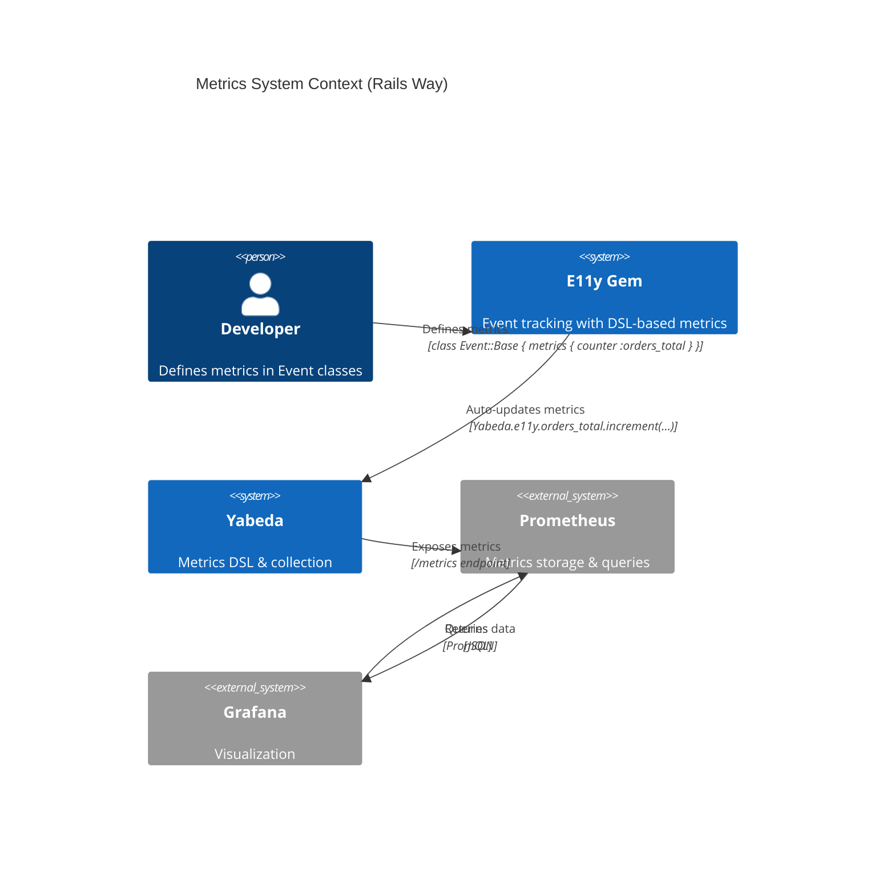
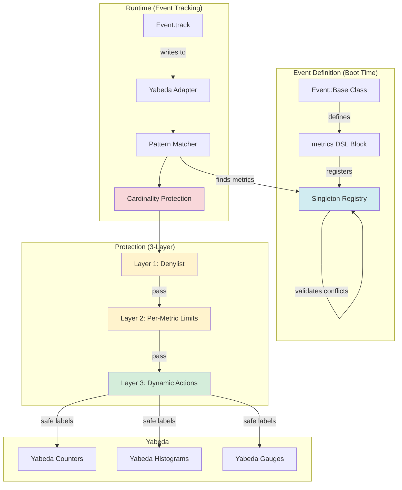
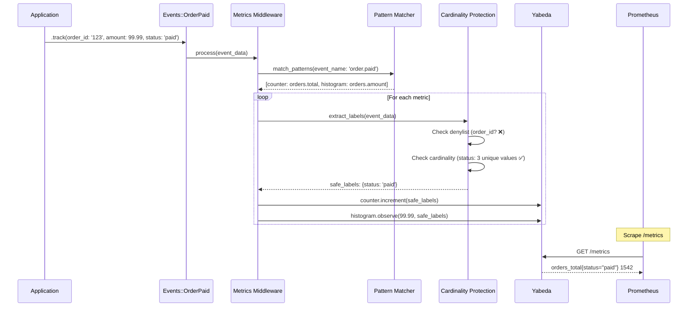
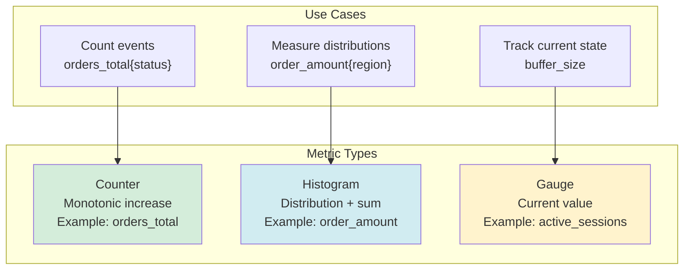
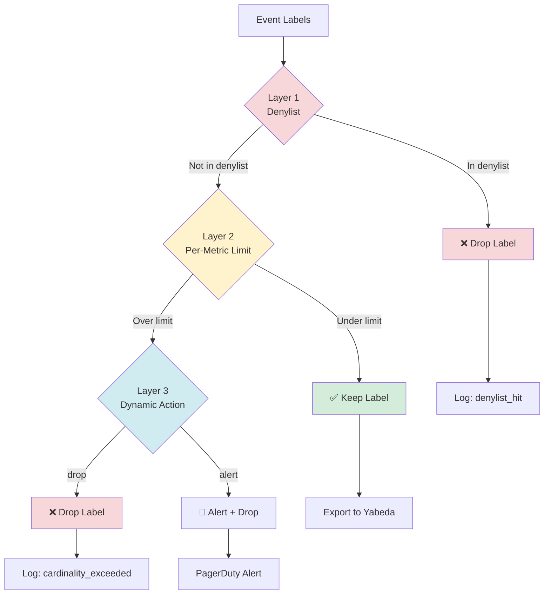
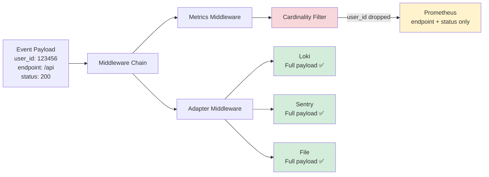

# ADR-002: Metrics & Yabeda Integration

**Status:** Implemented  
**Date:** January 12, 2026 (Updated: January 20, 2026)  
**Covers:** UC-003 (Event Metrics), UC-013 (High Cardinality Protection)  
**Depends On:** ADR-001 (Core Architecture)

**Implementation Notes:** Refactored to "Rails Way" architecture (January 20, 2026) - see [IMPLEMENTATION_NOTES.md](./IMPLEMENTATION_NOTES.md#2026-01-20-metrics-architecture-refactoring---rails-way-)

---

## 📋 Table of Contents

1. [Context & Problem](#1-context--problem)
2. [Architecture Overview](#2-architecture-overview)
3. [Event Metrics](#3-event-metrics)
4. [Cardinality Protection](#4-cardinality-protection)
   - 4.1. [Three-Layer Defense](#41-three-layer-defense)
   - 4.2. [Layer 1: Universal Denylist](#42-layer-1-universal-denylist)
   - 4.3. [Layer 2: Per-Metric Limits](#43-layer-2-per-metric-cardinality-limits)
   - 4.4. [Layer 3: Dynamic Actions](#44-layer-3-dynamic-actions)
   - 4.5. [Relabeling Rules](#45-relabeling-rules)
5. [Yabeda Integration](#5-yabeda-integration)
6. [Self-Monitoring](#6-self-monitoring)
7. [Configuration](#7-configuration)
8. [Performance](#8-performance)
9. [Testing](#9-testing)
10. [Trade-offs](#10-trade-offs)
11. [FAQ & Critical Clarifications](#11-faq--critical-clarifications)

---

## 0. Rails Way Implementation (2026-01-20)

> **🎯 Quick Start:** This section describes the implemented "Rails Way" architecture. For historical context and detailed design decisions, see sections below.

### 0.1. Metrics DSL in Event::Base

**Define metrics directly in event classes:**

```ruby
class Events::OrderCreated < E11y::Event::Base
  schema do
    required(:order_id).filled(:string)
    required(:currency).filled(:string)
    required(:status).filled(:string)
    required(:amount).filled(:float)
  end

  # Define metrics for this event
  metrics do
    counter :orders_total, tags: [:currency, :status]
    histogram :order_amount, value: :amount, tags: [:currency]
  end
end

# Track event - metrics automatically updated
Events::OrderCreated.track(
  order_id: "123",
  currency: "USD",
  status: "pending",
  amount: 99.99
)

# Prometheus metrics:
# orders_total{currency="USD",status="pending"} 1
# order_amount_bucket{currency="USD",le="100"} 1
```

### 0.2. Singleton Registry with Boot-Time Validation

**All metrics registered in singleton Registry:**

```ruby
# Automatic registration from Event::Base DSL
registry = E11y::Metrics::Registry.instance

# Find metrics for event
metrics = registry.find_matching("Events::OrderCreated")
# => [{ type: :counter, name: :orders_total, tags: [:currency, :status] }, ...]

# Boot-time validation catches conflicts:
class Events::OrderPaid < E11y::Event::Base
  metrics do
    counter :orders_total, tags: [:currency] # ❌ LabelConflictError!
    # Different labels than OrderCreated - caught at boot time
  end
end
```

**Rails Integration (Automatic Validation):**

```ruby
# lib/e11y/railtie.rb - Automatic validation on Rails boot
class Railtie < Rails::Railtie
  initializer "e11y.validate_metrics", after: :load_config_initializers do
    Rails.application.config.after_initialize do
      E11y::Metrics::Registry.instance.validate_all!
      Rails.logger.info "E11y: Metrics validated successfully (#{registry.size} metrics)"
    end
  end
end

# Result on boot:
# E11y: Metrics validated successfully (42 metrics)
#
# Or if conflict:
# E11y::Metrics::Registry::LabelConflictError:
#   Metric "orders_total" label conflict!
#   
#   Existing: [:currency, :status] (from Events::OrderCreated.metrics)
#   New:      [:currency] (from Events::OrderPaid.metrics)
#   
#   Fix: Use the same labels everywhere or rename the metric.
```

**Non-Rails Projects (Manual Validation):**

```ruby
# config/boot.rb or similar
require 'e11y'

# After loading all event classes
E11y::Metrics::Registry.instance.validate_all!
```

### 0.3. Yabeda Adapter with Integrated Cardinality Protection

**Replaces middleware, integrates protection:**

```ruby
# config/initializers/e11y.rb
E11y.configure do |config|
  # Yabeda adapter with cardinality protection
  config.adapters[:metrics] = E11y::Adapters::Yabeda.new(
    cardinality_limit: 1000,
    forbidden_labels: [:custom_id]
  )
end

# Adapter automatically:
# 1. Finds matching metrics from Registry
# 2. Extracts labels from event data
# 3. Applies 3-layer cardinality protection (denylist, per-metric limits, dynamic actions)
# 4. Updates Yabeda metrics
```

### 0.4. Metric Inheritance and Composition

**Base classes for shared metrics:**

```ruby
class BaseOrderEvent < E11y::Event::Base
  schema do
    required(:order_id).filled(:string)
    required(:currency).filled(:string)
    required(:status).filled(:string)
  end

  # Shared metric for all order events
  metrics do
    counter :orders_total, tags: [:currency, :status]
  end
end

class Events::OrderCreated < BaseOrderEvent
  # Inherits orders_total metric
end

class Events::OrderPaid < BaseOrderEvent
  # Inherits orders_total + adds own metric
  metrics do
    histogram :order_amount, value: :amount, tags: [:currency]
  end
end
```

### 0.5. Global Metrics via Registry

**Pattern-based metrics for multiple events:**

```ruby
# config/initializers/e11y.rb
E11y.configure do |config|
  # Global metric for all order.* events
  E11y::Metrics::Registry.instance.register(
    type: :counter,
    pattern: 'order.*',  # Matches order.created, order.paid, etc.
    name: :orders_total,
    tags: [:currency, :status],
    source: 'config/initializers/e11y.rb'
  )
end
```

### 0.6. Key Benefits

| Feature | Old (Middleware) | New (Rails Way) |
|---------|------------------|-----------------|
| **Metric Definition** | Config file | Event class DSL |
| **Validation** | Runtime | Boot time |
| **Cardinality Protection** | Separate class | Yabeda adapter |
| **Inheritance** | Not supported | Full support |
| **Conflict Detection** | Runtime errors | Boot-time errors |
| **Complexity** | 4 layers | 3 layers |

---

## 1. Context & Problem

### 1.1. Problem Statement

**Current Pain Points:**

1. **Manual Metric Definition:**
   ```ruby
   # ❌ Manual duplication for every event
   Yabeda.orders.increment({}, by: 1)
   Events::OrderCreated.track(...)
   ```

2. **Cardinality Explosions:**
   ```ruby
   # ❌ High-cardinality label → metrics explosion
   Yabeda.api.increment({ user_id: '123456' })  # 1M users = 1M time series!
   ```

3. **Cost & Performance:**
   - Prometheus can't handle high cardinality
   - Query performance degrades
   - Storage costs explode ($$$)

### 1.2. Goals

> **⚠️ NOTE (C03 Resolution):** Yabeda is the **default metrics backend** for E11y. OpenTelemetry metrics are **optional** (see ADR-007). Choose ONE backend to avoid double overhead. See [CONFLICT-ANALYSIS.md C03](../researches/CONFLICT-ANALYSIS.md#c03-dual-metrics-collection-overhead) for details.

**Primary Goals:**
- ✅ Auto-create metrics from events (event-level DSL)
- ✅ Prevent cardinality explosions (3-layer defense)
- ✅ Zero manual metric definitions
- ✅ Prometheus-friendly
- ✅ Cost-effective (<10k time series per metric)

**Non-Goals:**
- ❌ Replace Yabeda (we integrate with it)
- ❌ Custom metrics backend (use Prometheus)
- ❌ Real-time aggregation (Prometheus handles it)

### 1.3. Success Metrics

| Metric | Target | Critical? |
|--------|--------|-----------|
| **Auto-metrics** | 100% coverage | ✅ Yes |
| **Cardinality** | <10k per metric | ✅ Yes |
| **Overhead** | <0.1ms per event | ✅ Yes |
| **Cost savings** | $45k/year | ⚠️ Important |

---

## 2. Architecture Overview

> **🔄 Architecture Update (2026-01-20):** Refactored to "Rails Way" - metrics defined in Event::Base DSL, singleton Registry, Yabeda adapter replaces middleware.

### 2.1. System Context



### 2.2. Component Architecture (Rails Way)



### 2.3. Data Flow



---

## 3. Event Metrics

### 3.1. Pattern Matching

**Design Decision:** Glob-pattern matching for event names.

```ruby
module E11y
  module Metrics
    class PatternMatcher
      def initialize(patterns)
        @patterns = patterns.map { |p| compile_pattern(p) }
      end
      
      def match(event_name)
        @patterns.select { |pattern| pattern.match?(event_name) }
      end
      
      private
      
      def compile_pattern(pattern_string)
        # Convert glob pattern to regex
        # 'order.*' → /^order\..+$/
        # 'payment.{processed,failed}' → /^payment\.(processed|failed)$/
        
        regex_pattern = pattern_string
          .gsub('.', '\\.')
          .gsub('*', '.+')
          .gsub('{', '(')
          .gsub('}', ')')
          .gsub(',', '|')
        
        /^#{regex_pattern}$/
      end
    end
  end
end
```

**Examples:**

```ruby
matcher = PatternMatcher.new(['order.*', 'payment.{processed,failed}'])

matcher.match('order.created')   # ✅ Matches 'order.*'
matcher.match('order.paid')      # ✅ Matches 'order.*'
matcher.match('payment.processed') # ✅ Matches 'payment.{processed,failed}'
matcher.match('user.signup')     # ❌ No match
```

### 3.2. Metric Types

**Decision:** Support 3 metric types (Counter, Histogram, Gauge).



**Configuration:**


```ruby
# Event-level metrics (implemented)
class Events::OrderPaid < E11y::Event::Base
  metrics do
    counter :orders_total, tags: [:status]
    histogram :order_amount, value: :amount, tags: [:payment_method], buckets: [10, 50, 100, 500]
  end
end
```

### 3.3. Label Extraction

**Decision:** Extract labels from event payload (with cardinality protection).

```ruby
module E11y
  module Metrics
    class LabelExtractor
      def initialize(allowed_tags, cardinality_config)
        @allowed_tags = allowed_tags
        @cardinality_config = cardinality_config
      end
      
      def extract(event_data)
        labels = {}
        
        @allowed_tags.each do |tag|
          value = event_data[:payload][tag]
          
          next if value.nil?
          
          # Apply cardinality protection
          safe_value = @cardinality_config.protect(tag, value)
          labels[tag] = safe_value if safe_value
        end
        
        labels
      end
    end
  end
end
```

**Example:**

```ruby
# Event:
Events::OrderPaid.track(
  order_id: '123456',      # ← High cardinality (skip!)
  status: 'paid',          # ← Low cardinality ✅
  payment_method: 'card',  # ← Low cardinality ✅
  amount: 99.99
)

# Labels extracted:
# { status: 'paid', payment_method: 'card' }
# order_id skipped (in denylist)
```

---

## 4. Cardinality Protection

> **🔄 Simplified (2026-01-20):** Reduced from 4 layers to 3 layers. Removed "Safe Allowlist" (Layer 2) as overengineering for MVP.

### 4.1. Three-Layer Defense

**🔑 Critical: Layer Flow Logic**

Layers are applied **sequentially** (not simultaneously):

1. **Layer 1 (Universal Denylist):** If label in denylist → DROP, stop processing
2. **Layer 2 (Per-Metric Limits):** Track unique values per label, drop if exceeded
3. **Layer 3 (Dynamic Actions):** Configurable action on overflow (drop, alert, relabel)

**Example Flow:**

```
Label: user_id
→ Layer 1: in FORBIDDEN_LABELS? ✅ Yes → DROP ❌ (stop here)

Label: status
→ Layer 1: in FORBIDDEN_LABELS? ❌ No → continue
→ Layer 2: cardinality < limit? ✅ Yes (3 values) → KEEP ✅

Label: custom_field
→ Layer 1: in FORBIDDEN_LABELS? ❌ No → continue
→ Layer 2: cardinality < limit? ❌ No (150 > 100) → continue
→ Layer 3: action=drop → DROP ❌
```



### 4.2. Layer 1: Universal Denylist

**Design Decision:** Forbidden labels (dropped **only for metrics**, preserved for other adapters).

**🔑 Critical Clarification:**
- **Metrics adapters (Yabeda/Prometheus):** Denylist applied, high-cardinality fields dropped
- **Other adapters (Loki, Sentry, File):** Full payload preserved, no filtering

```ruby
module E11y
  module Metrics
    class CardinalityProtection
      # Universal denylist (never allow as metric labels)
      # NOTE: These fields are still sent to non-metric adapters!
      FORBIDDEN_LABELS = [
        # IDs (high cardinality)
        :id, :uuid, :guid, :user_id, :order_id, :transaction_id, :session_id,
        :request_id, :trace_id, :span_id,
        
        # Personal data (PII)
        :email, :phone, :ip_address, :user_agent,
        
        # Timestamps (infinite cardinality)
        :timestamp, :created_at, :updated_at,
        
        # Freeform text (unbounded)
        :message, :error_message, :description, :notes,
        
        # URLs/paths (high cardinality)
        :url, :path, :referer,
        
        # Tokens/secrets
        :token, :api_key, :password, :secret
      ].freeze
      
      def in_denylist?(label_name)
        FORBIDDEN_LABELS.include?(label_name.to_sym)
      end
    end
  end
end
```

**Example:**

```ruby
# Event:
Events::ApiCall.track(
  user_id: '123456',      # ❌ Dropped for metrics, ✅ sent to Loki/Sentry
  endpoint: '/api/users',  # ✅ Kept for metrics
  status: 200             # ✅ Kept for metrics
)

# Prometheus metric labels (filtered):
# api_calls_total{endpoint="/api/users", status="200"} 1

# Loki/Sentry/File adapters receive full payload (unfiltered):
# { user_id: '123456', endpoint: '/api/users', status: 200 }
```

**Architecture Clarification:**



### 4.3. Layer 2: Per-Metric Cardinality Limits

**Decision:** Track unique values per label, enforce limits.

```ruby
module E11y
  module Metrics
    class CardinalityTracker
      def initialize(limit: 100)
        @limit = limit
        @trackers = {}  # { metric_name: { label_name: Set[values] } }
        @mutex = Mutex.new
      end
      
      def check_and_track(metric_name, label_name, value)
        @mutex.synchronize do
          @trackers[metric_name] ||= {}
          @trackers[metric_name][label_name] ||= Set.new
          
          tracker = @trackers[metric_name][label_name]
          
          if tracker.include?(value)
            # Already seen, OK
            true
          elsif tracker.size < @limit
            # Under limit, add and allow
            tracker.add(value)
            true
          else
            # Over limit, reject
            false
          end
        end
      end
      
      def cardinality(metric_name, label_name)
        @trackers.dig(metric_name, label_name)&.size || 0
      end
    end
  end
end
```

**Example:**

```ruby
tracker = CardinalityTracker.new(limit: 3)

# OK: add first value
tracker.check_and_track('orders_total', :status, 'paid')  # ✅ true (1/3)

# OK: add second value
tracker.check_and_track('orders_total', :status, 'failed')  # ✅ true (2/3)

# OK: add third value
tracker.check_and_track('orders_total', :status, 'pending')  # ✅ true (3/3)

# REJECTED: over limit
tracker.check_and_track('orders_total', :status, 'cancelled')  # ❌ false (limit!)

# OK: already seen
tracker.check_and_track('orders_total', :status, 'paid')  # ✅ true (seen before)
```

### 4.4. Layer 3: Dynamic Actions

**Decision:** Configurable actions when limits exceeded.

```ruby
module E11y
  module Metrics
    class CardinalityProtection
      def handle_excess(label_name, value, config)
        case config.action_on_excess
        when :drop
          # Drop label entirely
          log_cardinality_exceeded(label_name, value, action: :drop)
          nil
          
        when :alert
          # Alert + drop
          alert_cardinality_exceeded(label_name, value)
          log_cardinality_exceeded(label_name, value, action: :alert)
          nil
        end
      end
    end
  end
end
```

**Example:**

```ruby
# Config: drop on excess
config.action_on_excess = :drop

# Event with high-cardinality label:
Events::ApiCall.track(
  endpoint: '/api/users',
  customer_id: 'cust_12345'  # ← 101st unique value, exceeds limit
)

# Layer 2: cardinality exceeded (100 limit)
# Layer 3: action=drop → customer_id dropped

# Result metric:
# api_calls_total{endpoint="/api/users"} 1
# (customer_id not included)
```

---

**Decision Tree: Which Action to Use?**

```mermaid
graph TB
    Start[Cardinality Limit Exceeded] --> Q1{Critical to<br/>investigate?}
    
    Q1 -->|Yes, ops needs to know| Alert[Action: ALERT<br/>PagerDuty + Drop label]
    Q1 -->|No| Q2{Can group values<br/>into categories?}
    
    Q2 -->|Yes, clear categories| Relabel[Use: RELABELING<br/>http_status → 2xx/3xx/4xx]
    Q2 -->|No clear categories| Drop[Action: DROP<br/>Remove label entirely]
    
    Drop --> Result1[orders_total 1000]
    Relabel --> Result2[orders_total{status_class=2xx} 1000]
    Alert --> Result3[orders_total 1000<br/>+ PagerDuty alert]
    
    style Drop fill:#f8d7da
    style Relabel fill:#d4edda
    style Alert fill:#f8d7da
```

**Summary Table:**

| Action | Cardinality | Signal Preserved | Use When | Example |
|--------|-------------|------------------|----------|---------|
| **Drop** | 1 | ❌ None | Label not important | Drop `request_id` |
| **Relabel** | 5-10 | ✅✅✅ High | Clear categories exist | `200` → `2xx` |
| **Alert** | 1 | ❌ None + 🚨 | Critical to investigate | Unexpected high cardinality |

**Note:** For v1.0, we keep it simple with just **drop** and **alert**. Advanced strategies (hash bucketing, aggregation) can be added in v1.1+ if needed.

### 4.5. Relabeling Rules

**Decision:** Transform high-cardinality labels to low-cardinality.

```ruby
E11y.configure do |config|
  config.metrics.cardinality_protection do
    # Relabel: HTTP status code → status class
    relabel :http_status do |value|
      case value.to_i
      when 100..199 then '1xx'
      when 200..299 then '2xx'
      when 300..399 then '3xx'
      when 400..499 then '4xx'
      when 500..599 then '5xx'
      else 'unknown'
      end
    end
    
    # Relabel: path → endpoint pattern
    relabel :path do |value|
      # /users/123 → /users/:id
      # /orders/456 → /orders/:id
      value.gsub(/\/\d+/, '/:id')
    end
    
    # Relabel: region → region group
    relabel :region do |value|
      case value
      when /^us-/ then 'us'
      when /^eu-/ then 'eu'
      when /^ap-/ then 'ap'
      else 'other'
      end
    end
  end
end
```

---

## 5. Yabeda Integration

### 5.1. Yabeda Setup

```ruby
# Auto-register metrics in Yabeda
module E11y
  module Metrics
    class YabedaIntegration
      def self.setup!
        return unless defined?(Yabeda)
        
        Yabeda.configure do
          # Create group for E11y metrics
          group :e11y do
            # Metrics will be auto-registered here
          end
        end
        
        # Hook into Yabeda collection
        Yabeda.configure!
      end
      
      def self.register_metric(type, name, config)
        Yabeda.e11y.public_send(type, name, **config)
      end
    end
  end
end
```

### 5.2. Metric Registration


```ruby
# Event-level metrics (implemented)
class Events::OrderCreated < E11y::Event::Base
  metrics do
    counter :orders_total, tags: [:status]
  end
end

# Yabeda adapter auto-registers from Registry when events are loaded
```

### 5.3. Metric Updates

```ruby
module E11y
  module Metrics
    class Middleware < E11y::Middleware
      def call(event_data)
        # Match patterns
        metrics = MetricsRegistry.match(event_data[:event_name])
        
        metrics.each do |metric|
          # Extract labels (with cardinality protection)
          labels = extract_labels(event_data, metric.tags)
          
          # Update Yabeda metric
          case metric.type
          when :counter
            Yabeda.e11y.public_send(metric.name).increment(labels)
            
          when :histogram
            value = event_data[:payload][metric.value_field]
            Yabeda.e11y.public_send(metric.name).observe(labels, value)
            
          when :gauge
            value = event_data[:payload][metric.value_field]
            Yabeda.e11y.public_send(metric.name).set(labels, value)
          end
        end
        
        @app.call(event_data)
      end
    end
  end
end
```

---

## 6. Self-Monitoring

### 6.1. Cardinality Metrics

```ruby
E11y.configure do |config|
  config.self_monitoring do
    enabled true
    
    # Track cardinality per metric
    gauge :metric_cardinality,
          tags: [:metric_name, :label_name],
          comment: 'Current cardinality per label'
    
    # Track cardinality violations
    counter :cardinality_violations_total,
            tags: [:metric_name, :label_name, :action],
            comment: 'Cardinality limit violations'
    
    # Track label operations
    counter :labels_processed_total,
            tags: [:metric_name, :label_name, :result],
            comment: 'Labels processed (kept/dropped/hashed)'
  end
end
```

### 6.2. Cost Impact Metrics

```ruby
# Track cost impact
E11y.configure do |config|
  config.self_monitoring do
    # Time series created
    counter :timeseries_created_total,
            tags: [:metric_name],
            comment: 'New time series created'
    
    # Estimated cost
    gauge :estimated_cost_monthly,
          tags: [:metric_name],
          comment: 'Estimated monthly cost in USD'
    
    # Samples per second
    gauge :metric_samples_per_second,
          tags: [:metric_name],
          comment: 'Metric update rate'
  end
end
```

---

## 7. Configuration

### 7.1. Full Configuration Example

```ruby
# config/initializers/e11y.rb
E11y.configure do |config|
  config.adapters[:metrics] = E11y::Adapters::Yabeda.new
end

# Define metrics in event classes:
# class Events::OrderPaid < E11y::Event::Base
#   metrics do
#     counter :orders_total, tags: [:status, :payment_method]
#     histogram :order_amount, value: :amount, tags: [:payment_method, :currency],
#               buckets: [10, 50, 100, 500, 1000, 5000]
#   end
# end
```

---

## 8. Performance

### 8.1. Performance Requirements

| Operation | Target | Critical? |
|-----------|--------|-----------|
| **Pattern matching** | <0.01ms | ✅ Yes |
| **Label extraction** | <0.05ms | ✅ Yes |
| **Cardinality check** | <0.02ms | ✅ Yes |
| **Yabeda update** | <0.02ms | ✅ Yes |
| **Total overhead** | <0.1ms | ✅ Yes |

### 8.2. Optimization Strategies

```ruby
module E11y
  module Metrics
    class MetricsRegistry
      def initialize
        # Pre-compile patterns for fast matching
        @compiled_patterns = {}
        @pattern_cache = {}
        
        compile_patterns!
      end
      
      def match(event_name)
        # Cache results
        @pattern_cache[event_name] ||= begin
          @compiled_patterns.select { |pattern, _|
            pattern.match?(event_name)
          }.values
        end
      end
      
      private
      
      def compile_patterns!
        # Compile once at boot
        Config.metrics.each do |metric_config|
          pattern = compile_pattern(metric_config.pattern)
          @compiled_patterns[pattern] = metric_config
        end
        
        # Freeze for thread-safety
        @compiled_patterns.freeze
      end
    end
  end
end
```

### 8.3. Memory Footprint

```
Cardinality Tracker Memory:

Per metric: 100 labels × 100 values × 50 bytes = 500KB
10 metrics: 10 × 500KB = 5MB

Total: ~5MB for cardinality tracking
```

---

## 9. Testing

### 9.1. Test Coverage Requirements

| Component | Coverage | Critical? |
|-----------|----------|-----------|
| **Pattern matching** | 100% | ✅ Yes |
| **Label extraction** | 95% | ✅ Yes |
| **Cardinality protection** | 100% | ✅ Yes |
| **Yabeda integration** | 90% | ⚠️ Important |

### 9.2. Test Examples

```ruby
RSpec.describe E11y::Metrics::CardinalityProtection do
  describe 'Layer 1: Denylist' do
    it 'drops forbidden labels' do
      protection = CardinalityProtection.new
      
      result = protection.protect(:user_id, '123456')
      
      expect(result).to be_nil
      expect(protection.metrics[:labels_dropped]).to eq(1)
    end
  end
  
  describe 'Layer 2: Cardinality Limits' do
    it 'enforces per-metric limits' do
      protection = CardinalityProtection.new(
        limits: { orders_total: { status: 3 } }
      )
      
      # Add 3 values (OK)
      protection.protect(:status, 'paid')
      protection.protect(:status, 'failed')
      protection.protect(:status, 'pending')
      
      # 4th value (REJECTED)
      result = protection.protect(:status, 'cancelled')
      
      expect(result).to be_nil
      expect(protection.cardinality(:orders_total, :status)).to eq(3)
    end
  end
end
```

---

## 10. Trade-offs

### 10.1. Key Decisions

| Decision | Pro | Con | Rationale |
|----------|-----|-----|-----------|
| **Auto-metrics** | Zero boilerplate | Less control | DX > control |
| **Pattern matching** | Flexible | Slower than exact | Flexibility matters |
| **3-layer defense** | Robust | Complex | Safety critical |
| **Hash bucketing** | Preserves some signal | Loss of precision | Better than drop |
| **Yabeda dependency** | Battle-tested | External dep | Standard in Ruby |

### 10.2. Alternatives Considered

**A) Custom metrics backend**
- ❌ Rejected: Reinventing wheel, Prometheus is standard

**B) No cardinality protection**
- ❌ Rejected: Production disasters inevitable

**C) Manual metric definitions**
- ❌ Rejected: Poor DX, error-prone

---

## 11. FAQ & Critical Clarifications

### Q1: Does cardinality protection apply to all adapters?

**A: No, only to metrics (Yabeda/Prometheus).**

```
Event payload: { user_id: '123', status: 'paid', amount: 99.99 }

Metrics (Prometheus):
  orders_total{status="paid"} 1
  ❌ user_id dropped (cardinality protection)

Loki/Sentry/File:
  { user_id: '123', status: 'paid', amount: 99.99 }
  ✅ Full payload preserved
```

**Rationale:**
- **Metrics:** Cardinality explosions break Prometheus (cost, performance)
- **Logs:** High-cardinality fields are fine (indexed differently)

---

### Q2: Are Layers 1–3 applied simultaneously or sequentially?

**A: Sequentially (waterfall), not simultaneously.**

```
Processing order:

1. Layer 1 (Denylist)
   ↓ If in denylist → DROP, stop
   ↓ If not in denylist → continue to Layer 2

2. Layer 2 (Per-Metric Limit)
   ↓ If under limit → KEEP, stop
   ↓ If over limit → continue to Layer 3

3. Layer 3 (Dynamic Action)
   ↓ Apply configured action: drop/alert/relabel
```

**Example:**

```ruby
# Event: { user_id: '123', status: 'paid', tier: 'premium' }

# user_id:
#   Layer 1: in FORBIDDEN_LABELS → ❌ DROP (stop here)

# status:
#   Layer 1: not in FORBIDDEN_LABELS → continue
#   Layer 2: cardinality under limit → ✅ KEEP

# tier:
#   Layer 1: not in FORBIDDEN_LABELS → continue
#   Layer 2: cardinality = 150 > limit (100) → continue
#   Layer 3: action=drop → ❌ DROP

# Result: { status: 'paid' }
```

---

### Q3: What should I do when cardinality limit is exceeded?

**A: Use relabeling if possible, otherwise drop the label.**

**Decision Matrix:**

| Scenario | Best Action | Rationale |
|----------|-------------|-----------|
| **No signal needed** | Drop | Simplest, lowest overhead |
| **Clear categories** | Relabeling | Best signal preservation |
| **Critical anomaly** | Alert | Operations team needs to know |

**Relabeling Examples:**

1. **HTTP Status Codes:** 200 → `2xx` (reduces from ~50 to 5 values)
2. **Geographic Regions:** `us-east-1` → `us` (reduces from ~30 to 5 values)
3. **Paths:** `/users/123` → `/users/:id` (reduces from infinite to ~100 endpoints)

**When to Alert:**

- Unexpected new high-cardinality label appears
- Known label suddenly exceeds limit (potential issue)
- Critical metric affected

**Why No Hash Bucketing in v1.0:**

- ❌ Adds complexity without clear immediate value
- ❌ Hard to explain and debug
- ❌ Most cases are better solved by relabeling or full logging
- ✅ Can be added in v1.1+ if real need emerges

---

**Status:** ✅ Draft Complete with Critical Clarifications  
**Next:** ADR-004 (Adapters) or ADR-006 (Security)  
**Estimated Implementation:** 2 weeks

