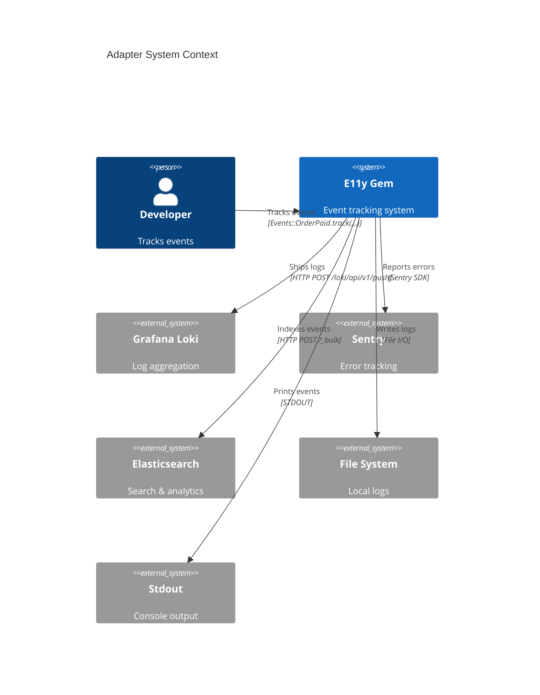
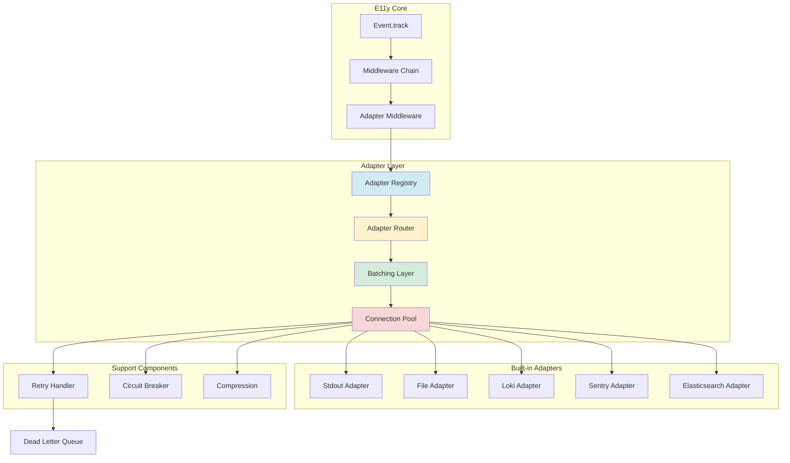
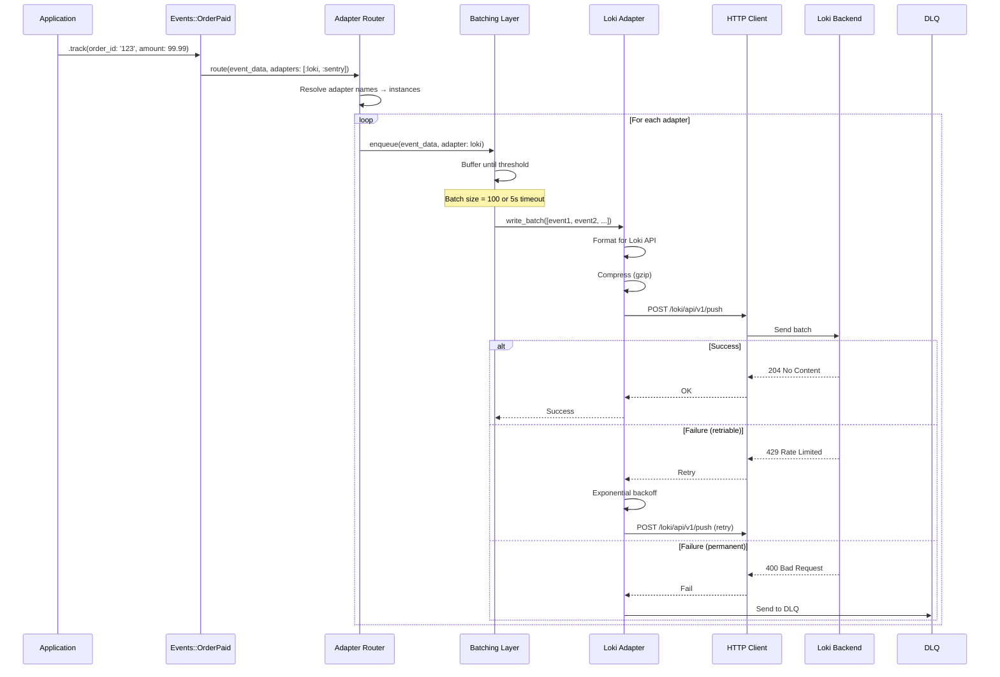
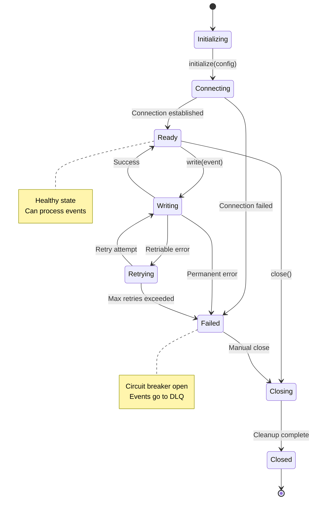
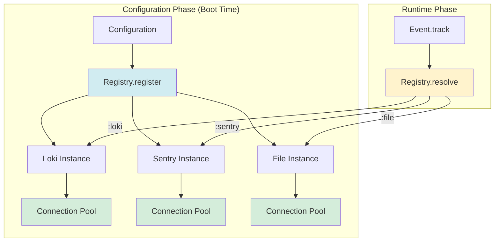

# ADR-004: Adapter Architecture

**Status:** Draft  
**Date:** January 12, 2026  
**Covers:** UC-005 (Sentry Integration), All Adapters (Loki, File, Stdout, Elasticsearch)  
**Depends On:** ADR-001 (Core Architecture), ADR-002 (Metrics)

---

## 📋 Table of Contents

1. [Context & Problem](#1-context--problem)
2. [Architecture Overview](#2-architecture-overview)
3. [Adapter Interface](#3-adapter-interface)
4. [Built-in Adapters](#4-built-in-adapters)
   - 4.1. [Stdout Adapter](#41-stdout-adapter)
   - 4.2. [File Adapter](#42-file-adapter)
   - 4.3. [Loki Adapter](#43-loki-adapter)
   - 4.4. [Sentry Adapter](#44-sentry-adapter)
   - 4.5. [Elasticsearch Adapter](#45-elasticsearch-adapter)
5. [Adapter Registry](#5-adapter-registry)
6. [Connection Management](#6-connection-management)
7. [Error Handling & Retry](#7-error-handling--retry)
8. [Performance & Batching](#8-performance--batching)
9. [Testing Strategy](#9-testing-strategy)
10. [Custom Adapters](#10-custom-adapters)
11. [Trade-offs](#11-trade-offs)

---

## 1. Context & Problem

### 1.1. Problem Statement

**Current Pain Points:**

1. **Tight Coupling:**
   ```ruby
   # ❌ Hard-coded destinations
   Events::OrderPaid.track(...) do
     send_to_loki(...)
     send_to_sentry(...)
     send_to_file(...)
   end
   ```

2. **No Unified Interface:**
   - Each destination has different API
   - No standard error handling
   - Inconsistent retry logic

3. **Configuration Duplication:**
   ```ruby
   # ❌ Configure same adapter multiple times
   Events::OrderPaid.track(..., adapters: [Loki.new(...)])
   Events::PaymentFailed.track(..., adapters: [Loki.new(...)])
   ```

4. **Testing Complexity:**
   - Can't easily mock adapters
   - Integration tests require real services

### 1.2. Goals

**Primary Goals:**
- ✅ Unified adapter interface (contract-based)
- ✅ Global adapter registry (configure once, reference by name)
- ✅ Per-event adapter overrides
- ✅ Built-in error handling & retry
- ✅ Connection pooling & reuse
- ✅ Easy testing (in-memory adapter)

**Non-Goals:**
- ❌ Support every possible destination (only critical ones)
- ❌ Real-time guarantees (async buffering is OK)
- ❌ Perfect delivery (at-least-once, not exactly-once)

### 1.3. Success Metrics

| Metric | Target | Critical? |
|--------|--------|-----------|
| **Adapter overhead** | <0.5ms per event | ✅ Yes |
| **Connection reuse** | 100% | ✅ Yes |
| **Retry success rate** | >95% | ✅ Yes |
| **Test coverage** | 100% for base | ✅ Yes |

---

## 2. Architecture Overview

### 2.1. System Context



### 2.2. Component Architecture



### 2.3. Data Flow



---

## 3. Adapter Interface

### 3.1. Base Adapter Contract

```ruby
module E11y
  module Adapters
    class Base
      # Initialize adapter with config
      # @param config [Hash] Adapter-specific configuration
      def initialize(config = {})
        @config = config
        validate_config!
      end
      
      # Write a single event (synchronous)
      # @param event_data [Hash] Event payload
      # @return [Boolean] Success
      def write(event_data)
        raise NotImplementedError, "Adapters must implement #write"
      end
      
      # Write a batch of events (preferred for performance)
      # @param events [Array<Hash>] Array of event payloads
      # @return [Boolean] Success
      def write_batch(events)
        # Default: call write for each event
        events.all? { |event| write(event) }
      end
      
      # Check if adapter is healthy
      # @return [Boolean] Health status
      def healthy?
        true
      end
      
      # Close connections, flush buffers
      def close
        # Default: no-op
      end
      
      # Adapter capabilities
      # @return [Hash] Capability flags
      def capabilities
        {
          batching: false,
          compression: false,
          async: false,
          streaming: false
        }
      end
      
      private
      
      # Validate adapter config
      def validate_config!
        # Override in subclasses
      end
      
      # Format event for this adapter
      # @param event_data [Hash]
      # @return [Hash, String] Formatted event
      def format_event(event_data)
        event_data
      end
    end
  end
end
```

### 3.2. Adapter Lifecycle



---

## 4. Built-in Adapters

### 4.1. Stdout Adapter

**Purpose:** Console output for development and debugging.

```ruby
module E11y
  module Adapters
    class Stdout < Base
      def initialize(config = {})
        super
        @colorize = config.fetch(:colorize, true)
        @pretty_print = config.fetch(:pretty_print, true)
      end
      
      def write(event_data)
        output = format_event(event_data)
        
        if @colorize
          puts colorize_output(output)
        else
          puts output
        end
        
        true
      rescue => e
        warn "Stdout adapter error: #{e.message}"
        false
      end
      
      def capabilities
        {
          batching: false,
          compression: false,
          async: false,
          streaming: true
        }
      end
      
      private
      
      def format_event(event_data)
        if @pretty_print
          JSON.pretty_generate(event_data)
        else
          event_data.to_json
        end
      end
      
      def colorize_output(output)
        severity = event_data[:severity]
        
        case severity
        when :debug then "\e[37m#{output}\e[0m"      # Gray
        when :info then "\e[36m#{output}\e[0m"       # Cyan
        when :success then "\e[32m#{output}\e[0m"    # Green
        when :warn then "\e[33m#{output}\e[0m"       # Yellow
        when :error then "\e[31m#{output}\e[0m"      # Red
        when :fatal then "\e[35m#{output}\e[0m"      # Magenta
        else output
        end
      end
    end
  end
end
```

**Configuration:**

```ruby
E11y.configure do |config|
  config.adapters do
    register :stdout, E11y::Adapters::Stdout.new(
      colorize: true,
      pretty_print: true
    )
  end
end
```

---

### 4.2. File Adapter

**Purpose:** Write events to local files with rotation.

```ruby
module E11y
  module Adapters
    class File < Base
      def initialize(config = {})
        super
        @path = config.fetch(:path)
        @rotation = config.fetch(:rotation, :daily)
        @max_size = config.fetch(:max_size, 100.megabytes)
        @compress_on_rotate = config.fetch(:compress, true)
        @file = nil
        @mutex = Mutex.new
        
        ensure_directory!
        open_file!
      end
      
      def write(event_data)
        @mutex.synchronize do
          rotate_if_needed!
          
          line = format_event(event_data)
          @file.puts(line)
          @file.flush
        end
        
        true
      rescue => e
        warn "File adapter error: #{e.message}"
        false
      end
      
      def write_batch(events)
        @mutex.synchronize do
          rotate_if_needed!
          
          events.each do |event_data|
            line = format_event(event_data)
            @file.puts(line)
          end
          
          @file.flush
        end
        
        true
      rescue => e
        warn "File adapter batch error: #{e.message}"
        false
      end
      
      def close
        @mutex.synchronize do
          @file&.close
          @file = nil
        end
      end
      
      def capabilities
        {
          batching: true,
          compression: false,  # Done on rotation
          async: false,
          streaming: true
        }
      end
      
      private
      
      def format_event(event_data)
        event_data.to_json
      end
      
      def ensure_directory!
        dir = ::File.dirname(@path)
        FileUtils.mkdir_p(dir) unless ::File.directory?(dir)
      end
      
      def open_file!
        @file = ::File.open(current_path, 'a')
        @file.sync = true  # Auto-flush
      end
      
      def current_path
        case @rotation
        when :daily
          "#{@path}.#{Date.today.strftime('%Y%m%d')}"
        when :hourly
          "#{@path}.#{Time.now.strftime('%Y%m%d%H')}"
        else
          @path
        end
      end
      
      def rotate_if_needed!
        need_rotation = case @rotation
        when :daily
          @file.path != current_path
        when :hourly
          @file.path != current_path
        when :size
          @file.size >= @max_size
        else
          false
        end
        
        if need_rotation
          rotate!
        end
      end
      
      def rotate!
        old_path = @file.path
        
        @file.close
        
        # Compress old file
        if @compress_on_rotate
          compress_file!(old_path)
        end
        
        # Open new file
        open_file!
      end
      
      def compress_file!(path)
        require 'zlib'
        
        Zlib::GzipWriter.open("#{path}.gz") do |gz|
          ::File.open(path, 'r') do |file|
            gz.write(file.read)
          end
        end
        
        ::File.delete(path)
      end
    end
  end
end
```

**Configuration:**

```ruby
E11y.configure do |config|
  config.adapters do
    register :file, E11y::Adapters::File.new(
      path: Rails.root.join('log', 'e11y.log'),
      rotation: :daily,
      max_size: 100.megabytes,
      compress: true
    )
  end
end
```

---

### 4.3. Loki Adapter

**Purpose:** Ship logs to Grafana Loki for aggregation and querying.

```ruby
module E11y
  module Adapters
    class Loki < Base
      def initialize(config = {})
        super
        @url = config.fetch(:url)
        @tenant_id = config[:tenant_id]
        @labels = config.fetch(:labels, {})
        @batch_size = config.fetch(:batch_size, 100)
        @batch_timeout = config.fetch(:batch_timeout, 5.seconds)
        @compress = config.fetch(:compress, true)
        
        @connection = build_connection
        @buffer = []
        @buffer_mutex = Mutex.new
      end
      
      def write(event_data)
        @buffer_mutex.synchronize do
          @buffer << event_data
          
          if @buffer.size >= @batch_size
            flush_buffer!
          end
        end
        
        true
      end
      
      def write_batch(events)
        @buffer_mutex.synchronize do
          @buffer.concat(events)
          
          if @buffer.size >= @batch_size
            flush_buffer!
          end
        end
        
        true
      end
      
      def close
        @buffer_mutex.synchronize do
          flush_buffer! if @buffer.any?
        end
      end
      
      def capabilities
        {
          batching: true,
          compression: true,
          async: true,
          streaming: false
        }
      end
      
      private
      
      def build_connection
        require 'net/http'
        require 'uri'
        
        uri = URI.parse(@url)
        
        http = Net::HTTP.new(uri.host, uri.port)
        http.use_ssl = uri.scheme == 'https'
        http.open_timeout = 5
        http.read_timeout = 10
        
        http
      end
      
      def flush_buffer!
        return if @buffer.empty?
        
        events = @buffer.dup
        @buffer.clear
        
        # Release mutex before I/O
        @buffer_mutex.unlock
        
        begin
          send_to_loki(events)
        ensure
          @buffer_mutex.lock
        end
      end
      
      def send_to_loki(events)
        payload = build_loki_payload(events)
        body = payload.to_json
        
        # Compress if enabled
        if @compress
          require 'zlib'
          body = Zlib.gzip(body)
        end
        
        # Build request
        request = Net::HTTP::Post.new('/loki/api/v1/push')
        request['Content-Type'] = 'application/json'
        request['Content-Encoding'] = 'gzip' if @compress
        request['X-Scope-OrgID'] = @tenant_id if @tenant_id
        request.body = body
        
        # Send
        response = @connection.request(request)
        
        unless response.is_a?(Net::HTTPSuccess)
          raise "Loki error: #{response.code} #{response.message}"
        end
        
        true
      rescue => e
        warn "Loki adapter error: #{e.message}"
        false
      end
      
      def build_loki_payload(events)
        # Group events by labels
        streams = events.group_by { |event| extract_labels(event) }
        
        {
          streams: streams.map do |labels, stream_events|
            {
              stream: labels,
              values: stream_events.map do |event|
                [
                  (event[:timestamp].to_f * 1_000_000_000).to_i.to_s,  # Nanoseconds
                  event.to_json
                ]
              end
            }
          end
        }
      end
      
      def extract_labels(event_data)
        base_labels = @labels.dup
        
        # Add standard labels
        base_labels[:severity] = event_data[:severity].to_s
        base_labels[:event_name] = event_data[:event_name]
        base_labels[:service] = event_data[:service] || 'unknown'
        base_labels[:environment] = event_data[:environment] || 'unknown'
        
        base_labels
      end
    end
  end
end
```

**Configuration:**

```ruby
E11y.configure do |config|
  config.adapters do
    register :loki, E11y::Adapters::Loki.new(
      url: ENV['LOKI_URL'] || 'http://localhost:3100',
      tenant_id: ENV['LOKI_TENANT_ID'],
      labels: {
        app: 'my_app',
        env: Rails.env
      },
      batch_size: 100,
      batch_timeout: 5.seconds,
      compress: true
    )
  end
end
```

---

### 4.4. Sentry Adapter

**Purpose:** Report errors and exceptions to Sentry.

```ruby
module E11y
  module Adapters
    class Sentry < Base
      def initialize(config = {})
        super
        @dsn = config.fetch(:dsn)
        @environment = config.fetch(:environment, Rails.env)
        @send_breadcrumbs = config.fetch(:breadcrumbs, true)
        @severity_threshold = config.fetch(:severity_threshold, :warn)
        
        initialize_sentry!
      end
      
      def write(event_data)
        severity = event_data[:severity]
        
        # Only send warn+ to Sentry (unless configured otherwise)
        return true unless should_send_to_sentry?(severity)
        
        if severity == :error || severity == :fatal
          send_error_to_sentry(event_data)
        else
          send_breadcrumb_to_sentry(event_data)
        end
        
        true
      rescue => e
        warn "Sentry adapter error: #{e.message}"
        false
      end
      
      def capabilities
        {
          batching: false,  # Sentry SDK handles batching
          compression: false,  # Sentry SDK handles compression
          async: true,  # Sentry SDK is async
          streaming: false
        }
      end
      
      private
      
      def initialize_sentry!
        require 'sentry-ruby'
        
        ::Sentry.init do |config|
          config.dsn = @dsn
          config.environment = @environment
          config.breadcrumbs_logger = []  # We manage breadcrumbs
        end
      end
      
      def should_send_to_sentry?(severity)
        severity_levels = [:debug, :info, :success, :warn, :error, :fatal]
        threshold_index = severity_levels.index(@severity_threshold)
        current_index = severity_levels.index(severity)
        
        current_index >= threshold_index
      end
      
      def send_error_to_sentry(event_data)
        ::Sentry.with_scope do |scope|
          # Set context
          scope.set_tags(extract_tags(event_data))
          scope.set_extras(event_data[:payload] || {})
          scope.set_user(event_data[:user] || {})
          
          # Set trace context
          if event_data[:trace_id]
            scope.set_context('trace', {
              trace_id: event_data[:trace_id],
              span_id: event_data[:span_id]
            })
          end
          
          # Capture exception or message
          if event_data[:exception]
            ::Sentry.capture_exception(event_data[:exception])
          else
            ::Sentry.capture_message(
              event_data[:message] || event_data[:event_name],
              level: sentry_level(event_data[:severity])
            )
          end
        end
      end
      
      def send_breadcrumb_to_sentry(event_data)
        return unless @send_breadcrumbs
        
        ::Sentry.add_breadcrumb(
          ::Sentry::Breadcrumb.new(
            category: event_data[:event_name],
            message: event_data[:message],
            level: sentry_level(event_data[:severity]),
            data: event_data[:payload] || {},
            timestamp: event_data[:timestamp]
          )
        )
      end
      
      def extract_tags(event_data)
        {
          event_name: event_data[:event_name],
          severity: event_data[:severity],
          environment: event_data[:environment]
        }
      end
      
      def sentry_level(severity)
        case severity
        when :debug then :debug
        when :info, :success then :info
        when :warn then :warning
        when :error then :error
        when :fatal then :fatal
        else :info
        end
      end
    end
  end
end
```

**Configuration:**

```ruby
E11y.configure do |config|
  config.adapters do
    register :sentry, E11y::Adapters::Sentry.new(
      dsn: ENV['SENTRY_DSN'],
      environment: Rails.env,
      breadcrumbs: true,
      severity_threshold: :warn  # Only send warn+ to Sentry
    )
  end
end
```

---

### 4.5. Elasticsearch Adapter

**Purpose:** Index events for search and analytics.

```ruby
module E11y
  module Adapters
    class Elasticsearch < Base
      def initialize(config = {})
        super
        @url = config.fetch(:url)
        @index_prefix = config.fetch(:index_prefix, 'e11y-events')
        @index_rotation = config.fetch(:index_rotation, :daily)
        @batch_size = config.fetch(:batch_size, 100)
        @batch_timeout = config.fetch(:batch_timeout, 5.seconds)
        
        @client = build_client
        @buffer = []
        @buffer_mutex = Mutex.new
      end
      
      def write(event_data)
        @buffer_mutex.synchronize do
          @buffer << event_data
          
          if @buffer.size >= @batch_size
            flush_buffer!
          end
        end
        
        true
      end
      
      def write_batch(events)
        @buffer_mutex.synchronize do
          @buffer.concat(events)
          
          if @buffer.size >= @batch_size
            flush_buffer!
          end
        end
        
        true
      end
      
      def close
        @buffer_mutex.synchronize do
          flush_buffer! if @buffer.any?
        end
      end
      
      def capabilities
        {
          batching: true,
          compression: true,
          async: true,
          streaming: false
        }
      end
      
      private
      
      def build_client
        require 'elasticsearch'
        
        ::Elasticsearch::Client.new(
          url: @url,
          transport_options: {
            request: { timeout: 10 }
          }
        )
      end
      
      def flush_buffer!
        return if @buffer.empty?
        
        events = @buffer.dup
        @buffer.clear
        
        @buffer_mutex.unlock
        
        begin
          bulk_index(events)
        ensure
          @buffer_mutex.lock
        end
      end
      
      def bulk_index(events)
        # Build bulk payload
        bulk_body = events.flat_map do |event_data|
          [
            { index: { _index: index_name(event_data) } },
            format_for_es(event_data)
          ]
        end
        
        # Send bulk request
        response = @client.bulk(body: bulk_body)
        
        # Check for errors
        if response['errors']
          handle_bulk_errors(response['items'])
        end
        
        true
      rescue => e
        warn "Elasticsearch adapter error: #{e.message}"
        false
      end
      
      def index_name(event_data)
        timestamp = event_data[:timestamp]
        
        suffix = case @index_rotation
        when :daily
          timestamp.strftime('%Y.%m.%d')
        when :monthly
          timestamp.strftime('%Y.%m')
        when :yearly
          timestamp.strftime('%Y')
        else
          'default'
        end
        
        "#{@index_prefix}-#{suffix}"
      end
      
      def format_for_es(event_data)
        {
          '@timestamp': event_data[:timestamp].iso8601,
          event_name: event_data[:event_name],
          severity: event_data[:severity],
          message: event_data[:message],
          trace_id: event_data[:trace_id],
          span_id: event_data[:span_id],
          payload: event_data[:payload],
          metadata: event_data[:metadata],
          environment: event_data[:environment],
          service: event_data[:service]
        }
      end
      
      def handle_bulk_errors(items)
        items.each do |item|
          if item['index'] && item['index']['error']
            warn "ES index error: #{item['index']['error']}"
          end
        end
      end
    end
  end
end
```

**Configuration:**

```ruby
E11y.configure do |config|
  config.adapters do
    register :elasticsearch, E11y::Adapters::Elasticsearch.new(
      url: ENV['ELASTICSEARCH_URL'] || 'http://localhost:9200',
      index_prefix: 'e11y-events',
      index_rotation: :daily,
      batch_size: 100,
      batch_timeout: 5.seconds
    )
  end
end
```

---

## 5. Adapter Registry

### 5.1. Registry Architecture



### 5.2. Registry Implementation

```ruby
module E11y
  module Adapters
    class Registry
      class << self
        def register(name, adapter_instance)
          validate_adapter!(adapter_instance)
          
          adapters[name] = adapter_instance
          
          # Register cleanup hook
          at_exit { adapter_instance.close }
        end
        
        def resolve(name)
          adapters.fetch(name) do
            raise AdapterNotFoundError, "Adapter not found: #{name}"
          end
        end
        
        def resolve_all(names)
          names.map { |name| resolve(name) }
        end
        
        def all
          adapters.values
        end
        
        def names
          adapters.keys
        end
        
        def clear!
          adapters.each_value(&:close)
          adapters.clear
        end
        
        private
        
        def adapters
          @adapters ||= {}
        end
        
        def validate_adapter!(adapter)
          unless adapter.respond_to?(:write)
            raise ArgumentError, "Adapter must respond to #write"
          end
          
          unless adapter.respond_to?(:write_batch)
            raise ArgumentError, "Adapter must respond to #write_batch"
          end
        end
      end
    end
    
    class AdapterNotFoundError < StandardError; end
  end
end
```

### 5.3. Usage in Events

```ruby
module Events
  class OrderPaid < E11y::Event::Base
    # Override global adapters
    adapters [:loki, :file, :sentry]
    
    schema do
      required(:order_id).filled(:string)
      required(:amount).filled(:float)
    end
  end
  
  class DebugEvent < E11y::Event::Base
    # Only log to file in development
    adapters [:file, :stdout]
    
    schema do
      required(:message).filled(:string)
    end
  end
end
```

---

## 6. Connection Management

### 6.1. Connection Pooling

```ruby
module E11y
  module Adapters
    class ConnectionPool
      def initialize(adapter_class, config, pool_size: 5)
        @adapter_class = adapter_class
        @config = config
        @pool_size = pool_size
        @pool = []
        @mutex = Mutex.new
        
        initialize_pool!
      end
      
      def with_connection
        connection = acquire
        
        begin
          yield connection
        ensure
          release(connection)
        end
      end
      
      def close_all
        @mutex.synchronize do
          @pool.each(&:close)
          @pool.clear
        end
      end
      
      private
      
      def initialize_pool!
        @pool_size.times do
          @pool << create_connection
        end
      end
      
      def create_connection
        @adapter_class.new(@config)
      end
      
      def acquire
        @mutex.synchronize do
          connection = @pool.pop
          
          # Create new if pool exhausted
          connection ||= create_connection
          
          connection
        end
      end
      
      def release(connection)
        @mutex.synchronize do
          if @pool.size < @pool_size
            @pool.push(connection)
          else
            connection.close
          end
        end
      end
    end
  end
end
```

---

## 7. Error Handling & Retry

### 7.1. Retry Policy

```ruby
module E11y
  module Adapters
    class RetryHandler
      def initialize(max_retries: 3, base_delay: 1.0, max_delay: 30.0)
        @max_retries = max_retries
        @base_delay = base_delay
        @max_delay = max_delay
      end
      
      def with_retry(adapter_name, &block)
        attempt = 0
        
        begin
          attempt += 1
          block.call
        rescue => e
          if retriable?(e) && attempt <= @max_retries
            delay = calculate_delay(attempt)
            
            warn "[E11y] Adapter #{adapter_name} failed (attempt #{attempt}/#{@max_retries}): #{e.message}"
            warn "[E11y] Retrying in #{delay}s..."
            
            sleep(delay)
            retry
          else
            raise
          end
        end
      end
      
      private
      
      def retriable?(error)
        # Network errors
        return true if error.is_a?(Timeout::Error)
        return true if error.is_a?(Errno::ECONNREFUSED)
        return true if error.is_a?(Errno::ETIMEDOUT)
        
        # HTTP errors (if using HTTP client)
        if defined?(Net::HTTPRetriableError)
          return true if error.is_a?(Net::HTTPRetriableError)
        end
        
        false
      end
      
      def calculate_delay(attempt)
        # Exponential backoff with jitter
        delay = [@base_delay * (2 ** (attempt - 1)), @max_delay].min
        jitter = rand * delay * 0.1
        
        delay + jitter
      end
    end
  end
end
```

### 7.2. Circuit Breaker

```ruby
module E11y
  module Adapters
    class CircuitBreaker
      CLOSED = :closed
      OPEN = :open
      HALF_OPEN = :half_open
      
      def initialize(failure_threshold: 5, timeout: 60, success_threshold: 2)
        @failure_threshold = failure_threshold
        @timeout = timeout
        @success_threshold = success_threshold
        
        @state = CLOSED
        @failure_count = 0
        @success_count = 0
        @last_failure_time = nil
        @mutex = Mutex.new
      end
      
      def call
        @mutex.synchronize do
          if open?
            if timeout_expired?
              transition_to_half_open
            else
              raise CircuitOpenError, "Circuit breaker is open"
            end
          end
        end
        
        begin
          result = yield
          on_success
          result
        rescue => e
          on_failure
          raise
        end
      end
      
      def open?
        @state == OPEN
      end
      
      def closed?
        @state == CLOSED
      end
      
      def half_open?
        @state == HALF_OPEN
      end
      
      private
      
      def on_success
        @mutex.synchronize do
          @failure_count = 0
          
          if half_open?
            @success_count += 1
            
            if @success_count >= @success_threshold
              transition_to_closed
            end
          end
        end
      end
      
      def on_failure
        @mutex.synchronize do
          @failure_count += 1
          @success_count = 0
          @last_failure_time = Time.now
          
          if @failure_count >= @failure_threshold
            transition_to_open
          end
        end
      end
      
      def timeout_expired?
        @last_failure_time && (Time.now - @last_failure_time) >= @timeout
      end
      
      def transition_to_open
        @state = OPEN
        warn "[E11y] Circuit breaker opened (#{@failure_count} failures)"
      end
      
      def transition_to_half_open
        @state = HALF_OPEN
        @success_count = 0
        warn "[E11y] Circuit breaker half-open (testing)"
      end
      
      def transition_to_closed
        @state = CLOSED
        warn "[E11y] Circuit breaker closed (recovered)"
      end
    end
    
    class CircuitOpenError < StandardError; end
  end
end
```

---

## 8. Performance & Batching

### 8.1. Adaptive Batching

```ruby
module E11y
  module Adapters
    class AdaptiveBatcher
      def initialize(adapter, min_size: 10, max_size: 1000, timeout: 5.seconds)
        @adapter = adapter
        @min_size = min_size
        @max_size = max_size
        @timeout = timeout
        
        @buffer = []
        @mutex = Mutex.new
        @last_flush = Time.now
        
        start_flush_timer!
      end
      
      def write(event_data)
        @mutex.synchronize do
          @buffer << event_data
          
          if should_flush?
            flush!
          end
        end
      end
      
      def flush!
        return if @buffer.empty?
        
        events = @buffer.dup
        @buffer.clear
        @last_flush = Time.now
        
        # Release lock before I/O
        @mutex.unlock
        
        begin
          @adapter.write_batch(events)
        ensure
          @mutex.lock
        end
      end
      
      private
      
      def should_flush?
        @buffer.size >= @max_size ||
          (@buffer.size >= @min_size && timeout_expired?)
      end
      
      def timeout_expired?
        (Time.now - @last_flush) >= @timeout
      end
      
      def start_flush_timer!
        Thread.new do
          loop do
            sleep(@timeout)
            
            @mutex.synchronize do
              flush! if timeout_expired? && @buffer.any?
            end
          end
        end
      end
    end
  end
end
```

---

## 9. Testing Strategy

### 9.1. In-Memory Test Adapter

```ruby
module E11y
  module Adapters
    class InMemory < Base
      attr_reader :events, :batches
      
      def initialize(config = {})
        super
        @events = []
        @batches = []
        @mutex = Mutex.new
      end
      
      def write(event_data)
        @mutex.synchronize do
          @events << event_data
        end
        true
      end
      
      def write_batch(events)
        @mutex.synchronize do
          @events.concat(events)
          @batches << events
        end
        true
      end
      
      def clear!
        @mutex.synchronize do
          @events.clear
          @batches.clear
        end
      end
      
      def find_events(pattern)
        @events.select { |event| event[:event_name].match?(pattern) }
      end
      
      def event_count(event_name: nil)
        if event_name
          @events.count { |event| event[:event_name] == event_name }
        else
          @events.size
        end
      end
    end
  end
end
```

### 9.2. RSpec Helpers

```ruby
RSpec.describe "Adapter Testing" do
  let(:test_adapter) { E11y::Adapters::InMemory.new }
  
  before do
    E11y.configure do |config|
      config.adapters do
        register :test, test_adapter
      end
    end
  end
  
  after do
    test_adapter.clear!
  end
  
  it "tracks events to test adapter" do
    Events::OrderPaid.track(order_id: '123', amount: 99.99)
    
    expect(test_adapter.events.size).to eq(1)
    expect(test_adapter.events.first[:event_name]).to eq('order.paid')
  end
  
  it "supports batch writes" do
    10.times { |i| Events::OrderPaid.track(order_id: i, amount: 10.0) }
    
    expect(test_adapter.event_count).to eq(10)
    expect(test_adapter.batches.size).to be > 0
  end
end
```

---

## 10. Custom Adapters

### 10.1. Creating a Custom Adapter

```ruby
# lib/adapters/slack_adapter.rb
module Adapters
  class Slack < E11y::Adapters::Base
    def initialize(config = {})
      super
      @webhook_url = config.fetch(:webhook_url)
      @channel = config.fetch(:channel, '#alerts')
      @username = config.fetch(:username, 'E11y Bot')
    end
    
    def write(event_data)
      # Only send error+ to Slack
      return true unless [:error, :fatal].include?(event_data[:severity])
      
      send_to_slack(event_data)
      true
    rescue => e
      warn "Slack adapter error: #{e.message}"
      false
    end
    
    def capabilities
      {
        batching: false,
        compression: false,
        async: true,
        streaming: false
      }
    end
    
    private
    
    def send_to_slack(event_data)
      require 'net/http'
      require 'uri'
      
      uri = URI.parse(@webhook_url)
      
      payload = {
        channel: @channel,
        username: @username,
        text: format_message(event_data),
        attachments: [
          {
            color: severity_color(event_data[:severity]),
            fields: [
              { title: 'Event', value: event_data[:event_name], short: true },
              { title: 'Severity', value: event_data[:severity], short: true },
              { title: 'Trace ID', value: event_data[:trace_id], short: false }
            ],
            ts: event_data[:timestamp].to_i
          }
        ]
      }
      
      http = Net::HTTP.new(uri.host, uri.port)
      http.use_ssl = true
      
      request = Net::HTTP::Post.new(uri.path)
      request['Content-Type'] = 'application/json'
      request.body = payload.to_json
      
      http.request(request)
    end
    
    def format_message(event_data)
      "🚨 *#{event_data[:event_name]}*: #{event_data[:message]}"
    end
    
    def severity_color(severity)
      case severity
      when :error then 'danger'
      when :fatal then 'danger'
      when :warn then 'warning'
      else 'good'
      end
    end
  end
end

# Register in config
E11y.configure do |config|
  config.adapters do
    register :slack, Adapters::Slack.new(
      webhook_url: ENV['SLACK_WEBHOOK_URL'],
      channel: '#production-alerts'
    )
  end
end
```

---

## 10a. Event-Level Adapter Configuration (NEW - v1.1)

> **🎯 CONTRADICTION_01 Resolution:** Move adapter configuration from global initializer to event classes.
>
> **Goal:** Reduce global config from 1400+ lines to <300 lines by distributing adapter routing across events.

### 10a.1. Problem: Global Adapter Routing Complexity

**Before (v1.0): All routing in global config**

```ruby
# config/initializers/e11y.rb (1400+ lines!)
E11y.configure do |config|
  # Register adapters (infrastructure)
  config.register_adapter :loki, Loki.new(url: ENV['LOKI_URL'])
  config.register_adapter :sentry, Sentry.new(dsn: ENV['SENTRY_DSN'])
  config.register_adapter :s3, S3Adapter.new(bucket: 'events-archive')
  config.register_adapter :audit_encrypted, AuditAdapter.new(...)
  
  # ❌ PROBLEM: Routing for EVERY event in global config
  config.events do
    # Payment events → multiple adapters
    event 'Events::PaymentSucceeded' do
      adapters [:loki, :sentry, :s3]
    end
    event 'Events::PaymentFailed' do
      adapters [:loki, :sentry, :s3]
    end
    event 'Events::PaymentRefunded' do
      adapters [:loki, :sentry, :s3]
    end
    
    # Audit events → encrypted adapter
    event 'Events::UserDeleted' do
      adapters [:audit_encrypted]
    end
    event 'Events::PermissionChanged' do
      adapters [:audit_encrypted]
    end
    
    # Debug events → file only
    event 'Events::DebugQuery' do
      adapters [:file]
    end
    
    # ... 100+ more events ...
  end
end
```

**Problems:**
- ❌ 1400+ lines of global config
- ❌ Routing far from event definition (locality violation)
- ❌ Hard to find which events use which adapters
- ❌ Duplication (many events → same adapters)

### 10a.2. Solution: Event-Level Adapter Declaration

**After (v1.1): Adapters in event classes**

```ruby
# config/initializers/e11y.rb (<300 lines!)
E11y.configure do |config|
  # ONLY infrastructure (adapter registration)
  config.register_adapter :loki, Loki.new(url: ENV['LOKI_URL'])
  config.register_adapter :sentry, Sentry.new(dsn: ENV['SENTRY_DSN'])
  config.register_adapter :s3, S3Adapter.new(bucket: 'events-archive')
  config.register_adapter :audit_encrypted, AuditAdapter.new(...)
  
  # Optional: default adapters (convention)
  config.default_adapters = [:loki]  # Most events → Loki
end

# app/events/payment_succeeded.rb
module Events
  class PaymentSucceeded < E11y::Event::Base
    schema do; required(:transaction_id).filled(:string); end
    
    # ✅ Adapters right next to schema!
    adapters [:loki, :sentry, :s3]
  end
end

# app/events/user_deleted.rb
module Events
  class UserDeleted < E11y::Event::Base
    schema do; required(:user_id).filled(:string); end
    
    # ✅ Adapters right next to schema!
    adapters [:audit_encrypted]
  end
end

# app/events/debug_query.rb
module Events
  class DebugQuery < E11y::Event::Base
    schema do; required(:query).filled(:string); end
    
    # ✅ Adapters right next to schema!
    adapters [:file]
  end
end
```

**Benefits:**
- ✅ Global config <300 lines (only infrastructure)
- ✅ Locality of behavior (adapters next to schema)
- ✅ Easy to find (grep event file)
- ✅ DRY via inheritance (see below)

### 10a.3. Inheritance for Adapter Routing

**Base class with common adapters:**

```ruby
# app/events/base_payment_event.rb
module Events
  class BasePaymentEvent < E11y::Event::Base
    # Common adapters for ALL payment events
    adapters [:loki, :sentry, :s3]
    
    # Common config
    severity :success
    sample_rate 1.0
    retention 7.years
  end
end

# Inherit from base (1-2 lines per event!)
class Events::PaymentSucceeded < Events::BasePaymentEvent
  schema do; required(:transaction_id).filled(:string); end
  # ← Inherits: adapters [:loki, :sentry, :s3]
end

class Events::PaymentFailed < Events::BasePaymentEvent
  severity :error  # ← Override severity
  schema do; required(:error_code).filled(:string); end
  # ← Inherits: adapters [:loki, :sentry, :s3]
end

class Events::PaymentRefunded < Events::BasePaymentEvent
  schema do; required(:refund_id).filled(:string); end
  # ← Inherits: adapters [:loki, :sentry, :s3]
end
```

**Base class for audit events:**

```ruby
# app/events/base_audit_event.rb
module Events
  class BaseAuditEvent < E11y::Event::Base
    # Common adapters for ALL audit events
    adapters [:audit_encrypted]
    
    # Common config
    audit_event true
    # ← Auto-set: retention = E11y.config.audit_retention (configurable!)
    #             rate_limiting = false (LOCKED!)
    #             sampling = false (LOCKED!)
  end
end

# Inherit from base
class Events::UserDeleted < Events::BaseAuditEvent
  schema do; required(:user_id).filled(:string); end
  # ← Inherits: adapters [:audit_encrypted]
end

class Events::PermissionChanged < Events::BaseAuditEvent
  schema do; required(:user_id).filled(:string); end
  # ← Inherits: adapters [:audit_encrypted]
end
```

### 10a.4. Preset Modules for Adapters

```ruby
# lib/e11y/presets/high_value_event.rb
module E11y
  module Presets
    module HighValueEvent
      extend ActiveSupport::Concern
      included do
        adapters [:loki, :sentry, :s3_archive]
        sample_rate 1.0
        retention 7.years
      end
    end
    
    module DebugEvent
      extend ActiveSupport::Concern
      included do
        adapters [:file]  # Local only
        severity :debug
        sample_rate 0.01
        retention 7.days
      end
    end
  end
end

# Usage:
class Events::PaymentProcessed < E11y::Event::Base
  include E11y::Presets::HighValueEvent  # ← Adapters inherited!
  schema do; required(:transaction_id).filled(:string); end
end

class Events::DebugQuery < E11y::Event::Base
  include E11y::Presets::DebugEvent  # ← Adapters inherited!
  schema do; required(:query).filled(:string); end
end
```

### 10a.5. Conventions for Adapters (Sensible Defaults)

```ruby
# Convention: Severity → Adapters
# :error/:fatal → [:sentry]
# :success/:info/:warn → [:loki]
# :debug → [:file] (dev), [:loki] (prod with sampling)

# Zero-config event (uses conventions):
class Events::OrderCreated < E11y::Event::Base
  severity :success
  schema do; required(:order_id).filled(:string); end
  # ← Auto: adapters = [:loki] (from severity!)
end

class Events::CriticalError < E11y::Event::Base
  severity :fatal
  schema do; required(:error_code).filled(:string); end
  # ← Auto: adapters = [:sentry] (from severity!)
end

# Override convention:
class Events::OrderCreated < E11y::Event::Base
  severity :success
  adapters [:loki, :elasticsearch, :s3]  # ← Override
  schema do; required(:order_id).filled(:string); end
end
```

### 10a.6. Adapter Strategy: Replace vs Append

```ruby
# Replace strategy (default): Override parent/convention
class Events::PaymentSucceeded < Events::BasePaymentEvent
  adapters [:loki, :sentry]  # ← Replaces base [:loki, :sentry, :s3]
end

# Append strategy: Add to parent/convention
class Events::PaymentSucceeded < Events::BasePaymentEvent
  adapters_strategy :append
  adapters [:slack_business]  # ← Adds to base (result: [:loki, :sentry, :s3, :slack_business])
end
```

### 10a.7. Precedence Rules

```ruby
# Precedence (highest to lowest):
# 1. Event-level explicit: adapters [:loki]
# 2. Preset module: include E11y::Presets::HighValueEvent
# 3. Base class inheritance: class < BasePaymentEvent
# 4. Convention: severity :success → [:loki]
# 5. Global default: config.default_adapters = [:loki]

# Example:
E11y.configure do |config|
  config.default_adapters = [:loki]  # 5. Global default
end

class Events::BasePaymentEvent < E11y::Event::Base
  adapters [:loki, :sentry]  # 3. Base class
end

class Events::PaymentSucceeded < Events::BasePaymentEvent
  include E11y::Presets::HighValueEvent  # 2. Preset (adds :s3)
  adapters [:loki, :sentry, :pagerduty]  # 1. Event-level (WINS!)
end

# Result: [:loki, :sentry, :pagerduty]
```

### 10a.8. Migration Path

**Step 1: Keep global config (backward compatible)**

```ruby
# v1.1 supports BOTH global and event-level config
E11y.configure do |config|
  # Old style (still works):
  config.events do
    event 'Events::OrderCreated' do
      adapters [:loki]
    end
  end
end

# New style (preferred):
class Events::OrderCreated < E11y::Event::Base
  adapters [:loki]  # ← Event-level (overrides global)
end
```

**Step 2: Migrate incrementally**

```ruby
# Migrate high-value events first:
class Events::PaymentSucceeded < E11y::Event::Base
  adapters [:loki, :sentry, :s3]  # ← Migrated
end

# Keep others in global config (temporary):
E11y.configure do |config|
  config.events do
    event 'Events::DebugQuery' do
      adapters [:file]  # ← Not migrated yet
    end
  end
end
```

**Step 3: Remove global routing**

```ruby
# After all events migrated:
E11y.configure do |config|
  # Only infrastructure (adapters registration)
  config.register_adapter :loki, Loki.new(...)
  config.register_adapter :sentry, Sentry.new(...)
  
  # Optional: default adapters (convention)
  config.default_adapters = [:loki]
  
  # ✅ No more config.events { ... } block!
end
```

### 10a.9. Benefits Summary

| Aspect | Before (v1.0) | After (v1.1) | Improvement |
|--------|---------------|--------------|-------------|
| **Global config lines** | 1400+ | <300 | 78% reduction |
| **Locality** | ❌ Far from event | ✅ Next to schema | Better |
| **DRY** | ❌ Duplication | ✅ Inheritance | Better |
| **Discoverability** | ❌ Hard to find | ✅ Grep event file | Better |
| **Conventions** | ❌ None | ✅ Severity → adapters | Better |
| **Backward compat** | N/A | ✅ Both styles work | Safe |

---

## 11. Trade-offs

### 11.1. Key Decisions

| Decision | Pro | Con | Rationale |
|----------|-----|-----|-----------|
| **Global registry** | Configure once, reuse | Less flexibility | DRY principle |
| **Batching by default** | Better performance | Slight latency | 99% use cases benefit |
| **Connection pooling** | Resource efficient | Memory overhead | Critical for scale |
| **Circuit breaker** | Prevents cascades | Complexity | Reliability critical |
| **Sync interface** | Simple to reason | Blocks thread | Buffering mitigates |

### 11.2. Alternatives Considered

**A) No adapter abstraction**
- ❌ Rejected: Every event hardcodes destinations

**B) Adapter instances in events**
- ❌ Rejected: Duplication, no connection reuse

**C) Async by default**
- ❌ Rejected: Complexity, hard to test

---

## 12. Validations & Environment-Specific Configuration (NEW - v1.1)

### 12.1. Adapter Registration Validation

**Problem:** Typos in adapter names → events lost.

**Solution:** Validate adapters against registered list:

```ruby
# Gem implementation (automatic):
def self.adapters(list)
  list.each do |adapter|
    unless E11y.registered_adapters.include?(adapter)
      raise ArgumentError, "Unknown adapter: #{adapter}. Registered: #{E11y.registered_adapters.keys.join(', ')}"
    end
  end
  self._adapters = list
end

# Result:
class Events::OrderPaid < E11y::Event::Base
  adapters [:loki, :sentri]  # ← ERROR: "Unknown adapter: :sentri. Registered: loki, sentry, file"
end
```

### 12.2. Environment-Specific Adapters

**Problem:** Different adapters per environment (dev/staging/prod).

**Solution:** Use Ruby conditionals:

```ruby
class Events::DebugQuery < E11y::Event::Base
  schema do
    required(:query).filled(:string)
  end
  
  # Environment-specific adapters
  adapters Rails.env.production? ? [:loki] : [:file]
end

class Events::PaymentFailed < E11y::Event::Base
  schema do
    required(:order_id).filled(:string)
  end
  
  # Multi-environment routing
  adapters case Rails.env
           when 'production' then [:loki, :sentry, :s3_archive]
           when 'staging' then [:loki, :sentry]
           else [:file]
           end
end
```

### 12.3. Precedence Rules for Adapters

**Precedence Order (Highest to Lowest):**

```
1. Event-level explicit config (highest)
   ↓
2. Preset module config
   ↓
3. Base class config (inheritance)
   ↓
4. Convention-based defaults (severity → adapters)
   ↓
5. Global config (lowest)
```

**Example:**

```ruby
# Global config (lowest)
E11y.configure do |config|
  config.adapters = [:file]  # Default
end

# Base class (medium)
class Events::BasePaymentEvent < E11y::Event::Base
  adapters [:loki, :sentry]  # Override global
end

# Preset (higher)
module E11y::Presets::HighValueEvent
  extend ActiveSupport::Concern
  included do
    adapters [:loki, :sentry, :s3_archive]  # Add S3
  end
end

# Event (highest)
class Events::CriticalPayment < Events::BasePaymentEvent
  include E11y::Presets::HighValueEvent
  
  adapters [:loki, :sentry, :s3_archive, :datadog]  # Add Datadog
  
  # Final: [:loki, :sentry, :s3_archive, :datadog] (event-level wins)
end
```

---

**Status:** ✅ Draft Complete (Updated to Unified DSL v1.1.0)  
**Next:** ADR-006 (Security & Compliance) or ADR-008 (Rails Integration)  
**Estimated Implementation:** 2 weeks
