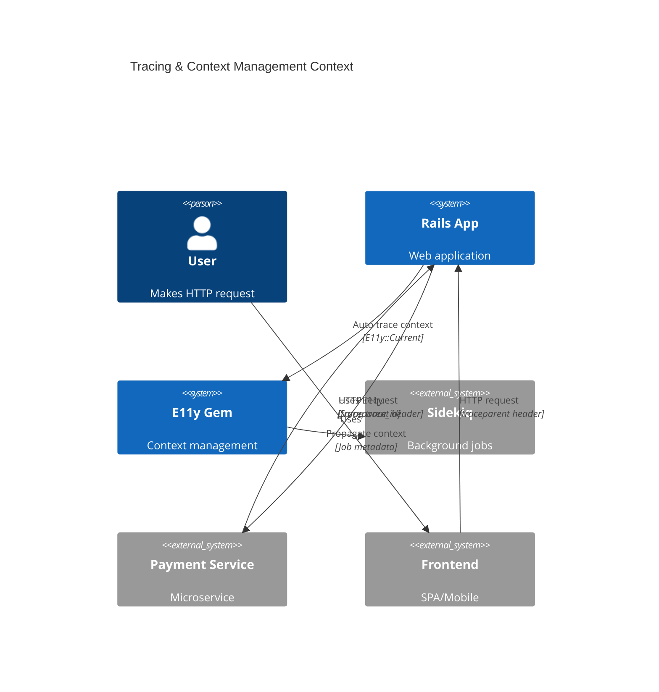
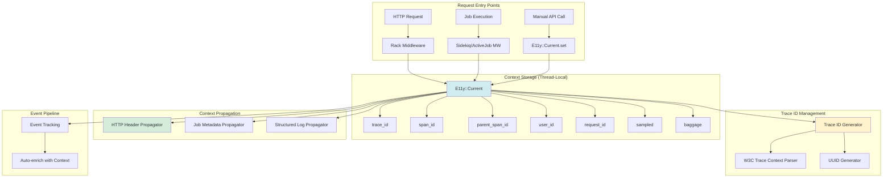
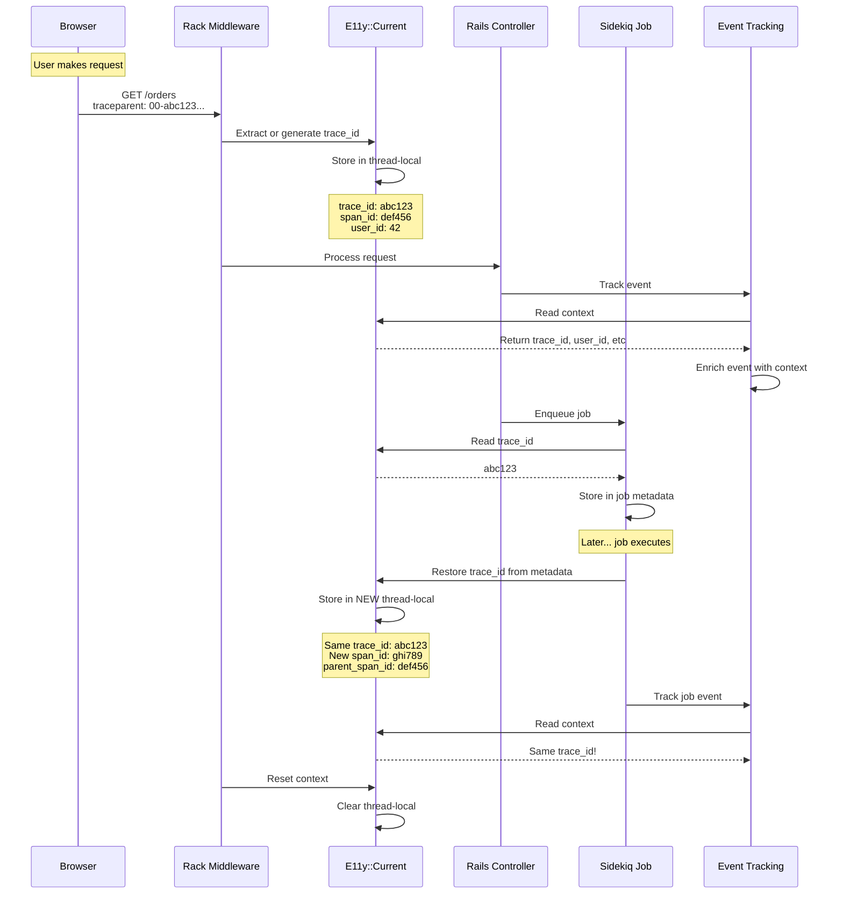

# ADR-005: Tracing & Context Management

**Status:** Draft  
**Date:** January 12, 2026  
**Covers:** UC-006 (Trace Context Management), UC-009 (Multi-Service Tracing)  
**Depends On:** ADR-001 (Core), ADR-008 (Rails Integration)

---

## 📋 Table of Contents

1. [Context & Problem](#1-context--problem)
2. [Architecture Overview](#2-architecture-overview)
3. [Current (Thread-Local Storage)](#3-current-thread-local-storage)
4. [Trace ID Generation](#4-trace-id-generation)
5. [W3C Trace Context](#5-w3c-trace-context)
6. [Context Propagation](#6-context-propagation)
7. [Sampling Decisions](#7-sampling-decisions)
8. [Context Inheritance](#8-context-inheritance)
   - 8.3. [Background Job Tracing Strategy (C17 Resolution)](#83-background-job-tracing-strategy-c17-resolution) ⚠️ CRITICAL
     - 8.3.1. The Problem: Unbounded Traces
     - 8.3.2. Decision: Hybrid Model (New Trace + Parent Link)
     - 8.3.3. SidekiqTraceMiddleware Implementation
     - 8.3.4. Configuration
     - 8.3.5. Querying Full Flow (Request → Job)
     - 8.3.6. Schema Changes
     - 8.3.7. Trade-offs (C17 Resolution)
9. [Trade-offs](#9-trade-offs)

---

## 1. Context & Problem

### 1.1. Problem Statement

**Current Pain Points:**

1. **No Trace Correlation:**
   ```ruby
   # ❌ Can't correlate events across requests
   Events::OrderCreated.track(order_id: 123)
   # Later in Sidekiq:
   Events::EmailSent.track(order_id: 123)
   # → No way to link these two events
   ```

2. **Lost Context in Background Jobs:**
   ```ruby
   # ❌ User context lost when job executes
   def create
     @current_user = User.find(params[:user_id])
     SendEmailJob.perform_later(order_id: 123)
     # Job has no idea about @current_user
   end
   ```

3. **No Cross-Service Tracing:**
   ```ruby
   # ❌ Can't trace requests across microservices
   response = HTTP.get("https://payment-service/charge")
   # Payment service has no idea this is part of the same trace
   ```

4. **Manual Context Passing:**
   ```ruby
   # ❌ Must manually pass context everywhere
   def process_order(order_id, trace_id:, user_id:, request_id:)
     Events::OrderProcessing.track(
       order_id: order_id,
       trace_id: trace_id,
       user_id: user_id,
       request_id: request_id
     )
   end
   ```

### 1.2. Goals

**Primary Goals:**
- ✅ **Automatic trace ID generation** for every request/job
- ✅ **W3C Trace Context** standard support
- ✅ **Thread-safe context storage** (Rails.current pattern)
- ✅ **Context propagation** to background jobs
- ✅ **Cross-service tracing** via HTTP headers
- ✅ **Sampling consistency** across distributed traces

**Non-Goals:**
- ❌ Full OpenTelemetry SDK (see ADR-007)
- ❌ Automatic span creation (manual spans only)
- ❌ Distributed transactions

### 1.3. Success Metrics

| Metric | Target | Critical? |
|--------|--------|-----------|
| **Context lookup overhead** | <100ns p99 | ✅ Yes |
| **Trace ID collision rate** | <1 in 10^15 | ✅ Yes |
| **Context propagation rate** | >99.9% | ✅ Yes |
| **Cross-service trace coverage** | >95% | ✅ Yes |

---

## 2. Architecture Overview

### 2.1. System Context



### 2.2. Component Architecture



### 2.3. Context Lifecycle



---

## 3. Current (Thread-Local Storage)

### 3.1. E11y::Current Implementation

**Design Decision:** Use `ActiveSupport::CurrentAttributes` for thread-safe storage.

```ruby
# lib/e11y/current.rb
module E11y
  class Current < ActiveSupport::CurrentAttributes
    # Core trace attributes
    attribute :trace_id
    attribute :span_id
    attribute :parent_span_id
    
    # Request/job attributes
    attribute :request_id
    attribute :job_id
    attribute :job_class
    
    # User/tenant attributes
    attribute :user_id
    attribute :tenant_id
    attribute :organization_id
    
    # Sampling decision
    attribute :sampled
    
    # Custom baggage (key-value pairs)
    attribute :baggage
    
    # IP and user agent (for security/audit)
    attribute :ip_address
    attribute :user_agent
    
    # Delegation methods for convenience
    class << self
      # Set multiple attributes at once
      def set(attributes = {})
        attributes.each do |key, value|
          public_send(:"#{key}=", value)
        end
      end
      
      # Get all current attributes as hash
      def to_h
        {
          trace_id: trace_id,
          span_id: span_id,
          parent_span_id: parent_span_id,
          request_id: request_id,
          job_id: job_id,
          job_class: job_class,
          user_id: user_id,
          tenant_id: tenant_id,
          organization_id: organization_id,
          sampled: sampled,
          baggage: baggage,
          ip_address: ip_address,
          user_agent: user_agent
        }.compact
      end
      
      # Check if we're in a traced context
      def traced?
        trace_id.present?
      end
      
      # Create a new span (child of current span)
      def create_span(name)
        new_span_id = E11y::TraceContext.generate_span_id
        
        span = Span.new(
          trace_id: trace_id || E11y::TraceContext.generate_id,
          span_id: new_span_id,
          parent_span_id: span_id,
          name: name,
          started_at: Time.now
        )
        
        # Update current span_id
        self.span_id = new_span_id
        
        span
      end
      
      # Add baggage (key-value metadata)
      def add_baggage(key, value)
        self.baggage ||= {}
        self.baggage[key.to_s] = value.to_s
      end
      
      # Get baggage value
      def get_baggage(key)
        baggage&.[](key.to_s)
      end
    end
    
    # Span helper class
    class Span
      attr_reader :trace_id, :span_id, :parent_span_id, :name, :started_at
      attr_accessor :finished_at, :status, :attributes
      
      def initialize(trace_id:, span_id:, parent_span_id:, name:, started_at:)
        @trace_id = trace_id
        @span_id = span_id
        @parent_span_id = parent_span_id
        @name = name
        @started_at = started_at
        @attributes = {}
      end
      
      def finish(status: :ok)
        @finished_at = Time.now
        @status = status
        
        duration = (@finished_at - @started_at) * 1000  # ms
        
        # Track span as event
        Events::Span.track(
          span_name: @name,
          trace_id: @trace_id,
          span_id: @span_id,
          parent_span_id: @parent_span_id,
          duration: duration,
          status: status,
          attributes: @attributes
        )
        
        self
      end
      
      def add_attribute(key, value)
        @attributes[key] = value
      end
    end
  end
end
```

### 3.2. Usage Examples

```ruby
# Read current context
E11y::Current.trace_id  # => "abc123..."
E11y::Current.user_id   # => 42

# Set context manually
E11y::Current.set(
  trace_id: 'custom-trace-123',
  user_id: 99,
  tenant_id: 'acme-corp'
)

# Check if traced
if E11y::Current.traced?
  puts "We're in a trace!"
end

# Get all context
E11y::Current.to_h
# => { trace_id: "abc...", user_id: 42, ... }

# Create a manual span
span = E11y::Current.create_span('database_query')
span.add_attribute('table', 'orders')
# ... do work ...
span.finish(status: :ok)

# Baggage (propagated metadata)
E11y::Current.add_baggage('experiment_id', 'exp-42')
E11y::Current.get_baggage('experiment_id')  # => "exp-42"
```

---

## 4. Trace ID Generation

### 4.1. Trace ID Generator

```ruby
# lib/e11y/trace_context/id_generator.rb
module E11y
  module TraceContext
    module IDGenerator
      # W3C Trace Context format:
      # trace-id: 32 hex chars (128 bits)
      # span-id: 16 hex chars (64 bits)
      
      # Generate trace ID (128 bits = 16 bytes)
      def self.generate_trace_id
        SecureRandom.hex(16)  # 32 hex chars
      end
      
      # Generate span ID (64 bits = 8 bytes)
      def self.generate_span_id
        SecureRandom.hex(8)   # 16 hex chars
      end
      
      # Validate trace ID format
      def self.valid_trace_id?(trace_id)
        trace_id.is_a?(String) &&
          trace_id.match?(/\A[0-9a-f]{32}\z/) &&
          trace_id != '00000000000000000000000000000000'  # Not all zeros
      end
      
      # Validate span ID format
      def self.valid_span_id?(span_id)
        span_id.is_a?(String) &&
          span_id.match?(/\A[0-9a-f]{16}\z/) &&
          span_id != '0000000000000000'  # Not all zeros
      end
      
      # Convert UUID to trace ID (for compatibility)
      def self.uuid_to_trace_id(uuid)
        uuid.delete('-').downcase
      end
    end
    
    # Convenience methods
    def self.generate_id
      IDGenerator.generate_trace_id
    end
    
    def self.generate_span_id
      IDGenerator.generate_span_id
    end
  end
end
```

---

## 5. W3C Trace Context

### 5.1. W3C Trace Context Standard

**Format:** `traceparent: 00-{trace-id}-{parent-id}-{trace-flags}`

**Example:** `traceparent: 00-0af7651916cd43dd8448eb211c80319c-b7ad6b7169203331-01`

- `00` = version
- `0af7651916cd43dd8448eb211c80319c` = trace-id (32 hex chars)
- `b7ad6b7169203331` = parent-id (16 hex chars)
- `01` = trace-flags (01 = sampled)

### 5.2. W3C Parser & Generator

```ruby
# lib/e11y/trace_context/w3c.rb
module E11y
  module TraceContext
    module W3C
      VERSION = '00'
      
      # Parse W3C traceparent header
      def self.parse_traceparent(header)
        return nil unless header.is_a?(String)
        
        parts = header.split('-')
        return nil unless parts.size == 4
        
        version, trace_id, parent_id, flags = parts
        
        # Validate format
        return nil unless version == VERSION
        return nil unless IDGenerator.valid_trace_id?(trace_id)
        return nil unless IDGenerator.valid_span_id?(parent_id)
        
        sampled = (flags.to_i(16) & 0x01) == 1
        
        {
          version: version,
          trace_id: trace_id,
          parent_span_id: parent_id,
          sampled: sampled,
          flags: flags
        }
      end
      
      # Generate W3C traceparent header
      def self.generate_traceparent(trace_id:, span_id:, sampled: true)
        flags = sampled ? '01' : '00'
        
        "#{VERSION}-#{trace_id}-#{span_id}-#{flags}"
      end
      
      # Parse W3C tracestate header (optional)
      def self.parse_tracestate(header)
        return {} unless header.is_a?(String)
        
        header.split(',').each_with_object({}) do |entry, hash|
          key, value = entry.split('=', 2)
          hash[key.strip] = value.strip if key && value
        end
      end
      
      # Generate W3C tracestate header
      def self.generate_tracestate(state_hash)
        state_hash.map { |k, v| "#{k}=#{v}" }.join(',')
      end
    end
  end
end
```

### 5.3. HTTP Header Extraction

```ruby
# lib/e11y/trace_context/http_extractor.rb
module E11y
  module TraceContext
    class HTTPExtractor
      TRACEPARENT_HEADER = 'HTTP_TRACEPARENT'
      TRACESTATE_HEADER = 'HTTP_TRACESTATE'
      
      # Legacy headers (fallback)
      X_REQUEST_ID = 'HTTP_X_REQUEST_ID'
      X_TRACE_ID = 'HTTP_X_TRACE_ID'
      X_CORRELATION_ID = 'HTTP_X_CORRELATION_ID'
      
      def self.extract(env)
        # Try W3C Trace Context first
        if env[TRACEPARENT_HEADER]
          extract_w3c(env)
        # Fallback to legacy headers
        elsif env[X_TRACE_ID]
          extract_legacy(env)
        else
          # No trace context → generate new
          generate_new
        end
      end
      
      private
      
      def self.extract_w3c(env)
        context = W3C.parse_traceparent(env[TRACEPARENT_HEADER])
        return generate_new unless context
        
        tracestate = W3C.parse_tracestate(env[TRACESTATE_HEADER])
        
        {
          trace_id: context[:trace_id],
          parent_span_id: context[:parent_span_id],
          span_id: IDGenerator.generate_span_id,  # New span for this service
          sampled: context[:sampled],
          tracestate: tracestate,
          format: :w3c
        }
      end
      
      def self.extract_legacy(env)
        trace_id = env[X_TRACE_ID] ||
                   env[X_REQUEST_ID] ||
                   env[X_CORRELATION_ID]
        
        # Convert to W3C format if needed
        trace_id = normalize_trace_id(trace_id)
        
        {
          trace_id: trace_id,
          span_id: IDGenerator.generate_span_id,
          sampled: true,  # Assume sampled for legacy
          format: :legacy
        }
      end
      
      def self.generate_new
        {
          trace_id: IDGenerator.generate_trace_id,
          span_id: IDGenerator.generate_span_id,
          sampled: true,
          format: :new
        }
      end
      
      def self.normalize_trace_id(trace_id)
        # If UUID format, convert to W3C
        if trace_id.include?('-') && trace_id.length == 36
          IDGenerator.uuid_to_trace_id(trace_id)
        # If already 32 hex chars, use as-is
        elsif trace_id.match?(/\A[0-9a-f]{32}\z/i)
          trace_id.downcase
        # Otherwise, hash it to 32 hex chars
        else
          Digest::SHA256.hexdigest(trace_id)[0...32]
        end
      end
    end
  end
end
```

---

## 6. Context Propagation

### 6.1. HTTP Propagator (Outgoing Requests)

```ruby
# lib/e11y/trace_context/http_propagator.rb
module E11y
  module TraceContext
    class HTTPPropagator
      # Inject trace context into HTTP headers
      def self.inject(headers = {})
        return headers unless E11y::Current.traced?
        
        trace_id = E11y::Current.trace_id
        span_id = E11y::Current.span_id
        sampled = E11y::Current.sampled
        
        # W3C Trace Context
        headers['traceparent'] = W3C.generate_traceparent(
          trace_id: trace_id,
          span_id: span_id,
          sampled: sampled
        )
        
        # Add tracestate if baggage present
        if E11y::Current.baggage&.any?
          headers['tracestate'] = W3C.generate_tracestate(
            E11y::Current.baggage
          )
        end
        
        # Legacy headers (for backwards compatibility)
        headers['X-Request-ID'] = E11y::Current.request_id if E11y::Current.request_id
        headers['X-Trace-ID'] = trace_id
        
        headers
      end
      
      # Helper for common HTTP clients
      def self.wrap_faraday(conn)
        conn.use :instrumentation do |faraday|
          faraday.request :headers do |req|
            inject(req.headers)
          end
        end
      end
      
      def self.wrap_http_rb(http)
        headers = inject
        headers.each { |k, v| http = http.headers(k => v) }
        http
      end
    end
  end
end
```

### 6.2. Job Propagator (Sidekiq/ActiveJob)

Already implemented in ADR-008, but here's the core logic:

```ruby
# lib/e11y/trace_context/job_propagator.rb
module E11y
  module TraceContext
    class JobPropagator
      # C17 Hybrid: Inject parent trace into job metadata (job will create NEW trace_id)
      def self.inject(job_metadata = {})
        return job_metadata unless E11y::Current.traced?
        
        job_metadata['e11y_parent_trace_id'] = E11y::Current.trace_id
        job_metadata['e11y_span_id'] = E11y::Current.span_id
        job_metadata['e11y_sampled'] = E11y::Current.sampled
        
        # Propagate baggage
        if E11y::Current.baggage&.any?
          job_metadata['e11y_baggage'] = E11y::Current.baggage
        end
        
        # Propagate user/tenant context
        job_metadata['e11y_user_id'] = E11y::Current.user_id if E11y::Current.user_id
        job_metadata['e11y_tenant_id'] = E11y::Current.tenant_id if E11y::Current.tenant_id
        
        job_metadata
      end
      
      # C17 Hybrid: Extract parent context; job gets NEW trace_id, links via parent_trace_id
      def self.extract(job_metadata)
        return {} unless job_metadata['e11y_parent_trace_id']
        
        {
          trace_id: IDGenerator.generate_trace_id,  # NEW trace per job
          parent_trace_id: job_metadata['e11y_parent_trace_id'],
          parent_span_id: job_metadata['e11y_span_id'],
          span_id: IDGenerator.generate_span_id,
          sampled: job_metadata['e11y_sampled'],
          baggage: job_metadata['e11y_baggage'],
          user_id: job_metadata['e11y_user_id'],
          tenant_id: job_metadata['e11y_tenant_id']
        }
      end
    end
  end
end
```

### 6.3. Structured Log Propagator

```ruby
# lib/e11y/trace_context/log_propagator.rb
module E11y
  module TraceContext
    class LogPropagator
      # Add trace context to structured log entry
      def self.inject(log_entry = {})
        return log_entry unless E11y::Current.traced?
        
        log_entry.merge(
          trace_id: E11y::Current.trace_id,
          span_id: E11y::Current.span_id,
          parent_span_id: E11y::Current.parent_span_id,
          user_id: E11y::Current.user_id,
          tenant_id: E11y::Current.tenant_id
        ).compact
      end
    end
  end
end
```

---

## 7. Sampling Decisions

### 7.1. Trace-Consistent Sampling

**Design Decision:** Sampling decision is made at trace entry point and propagated.

```ruby
# lib/e11y/trace_context/sampler.rb
module E11y
  module TraceContext
    class Sampler
      def initialize(config)
        @default_rate = config.default_sample_rate
        @per_event_rates = config.per_event_sample_rates
      end
      
      # Decide if this trace should be sampled
      def should_sample?(context = {})
        # If sampling decision already made (from parent), respect it
        return context[:sampled] if context.key?(:sampled)
        
        # Apply sampling rules
        sample_rate = determine_sample_rate(context)
        
        # Random sampling
        rand < sample_rate
      end
      
      private
      
      def determine_sample_rate(context)
        # Priority 1: Always sample errors
        return 1.0 if context[:error]
        
        # Priority 2: Per-event sampling
        if context[:event_name]
          rate = @per_event_rates[context[:event_name]]
          return rate if rate
        end
        
        # Priority 3: Per-user sampling (for debugging)
        if context[:user_id] && debug_user?(context[:user_id])
          return 1.0
        end
        
        # Default sampling rate
        @default_rate
      end
      
      def debug_user?(user_id)
        # Check if user is in debug mode (e.g., via feature flag)
        E11y.config.debug_users.include?(user_id)
      end
    end
  end
end
```

### 7.2. Sampling Configuration

```ruby
# config/initializers/e11y.rb
E11y.configure do |config|
  config.tracing do
    # Default sample rate (10% of traces)
    default_sample_rate 0.1
    
    # Per-event sampling
    per_event_sample_rates do
      event 'payment.processed', sample_rate: 1.0   # Always sample
      event 'order.created', sample_rate: 0.5       # 50%
      event 'health_check', sample_rate: 0.01       # 1%
    end
    
    # Always sample for debug users
    debug_users [123, 456]  # User IDs
    
    # Respect parent sampling decision
    respect_parent_sampling true  # Default: true
  end
end
```

---

## 8. Context Inheritance

### 8.1. Context Inheritance Patterns

```ruby
# lib/e11y/trace_context/inheritance.rb
module E11y
  module TraceContext
    module Inheritance
      # Execute block with inherited context
      def self.with_inherited_context(parent_context, &block)
        previous_context = E11y::Current.attributes
        
        begin
          # Inherit from parent, but create new span
          E11y::Current.set(
            trace_id: parent_context[:trace_id],
            parent_span_id: parent_context[:span_id],
            span_id: IDGenerator.generate_span_id,
            sampled: parent_context[:sampled],
            baggage: parent_context[:baggage]&.dup,
            user_id: parent_context[:user_id],
            tenant_id: parent_context[:tenant_id]
          )
          
          yield
        ensure
          E11y::Current.set(previous_context)
        end
      end
      
      # Fork context for parallel execution (e.g., Thread, Fiber)
      def self.fork_context(&block)
        parent_context = E11y::Current.to_h
        
        Thread.new do
          with_inherited_context(parent_context, &block)
        end
      end
    end
  end
end
```

### 8.2. Usage Examples

```ruby
# Execute with inherited context
parent_context = E11y::Current.to_h

E11y::TraceContext::Inheritance.with_inherited_context(parent_context) do
  # This block runs with parent's trace_id but new span_id
  Events::ChildTask.track(task_id: 42)
end

# Fork context for parallel execution
threads = 5.times.map do |i|
  E11y::TraceContext::Inheritance.fork_context do
    # Each thread gets its own span but shares trace_id
    Events::ParallelTask.track(index: i)
  end
end

threads.each(&:join)
```

### 8.3. Background Job Tracing Strategy (C17 Resolution)

> **⚠️ CRITICAL: C17 Conflict Resolution - Background Job Tracing Strategy**  
> **See:** [CONFLICT-ANALYSIS.md C17](researches/CONFLICT-ANALYSIS.md#c17-sidekiq-job-trace-context--parent-request-trace-uc-010--uc-009) for detailed analysis  
> **Problem:** Should Sidekiq jobs inherit parent trace_id or start new trace?  
> **Solution:** Hybrid model - jobs start NEW trace but LINK to parent

#### 8.3.1. The Problem: Unbounded Traces

**When a web request enqueues a background job, two competing models exist:**

```ruby
# Scenario:
# Web request (trace_id: abc-123) enqueues Sidekiq job

# Model A: Job INHERITS parent trace_id (same trace_id)
# Result: ONE continuous trace (request → job)
# Problem: Trace duration UNBOUNDED (job may run hours later!)
# Problem: SLO metrics SKEWED (trace includes async work)

# Model B: Job STARTS new trace_id (new trace)
# Result: TWO separate traces (request trace + job trace)
# Problem: Can't see full end-to-end flow in single trace
# Problem: Lost context (job doesn't know parent)
```

**Architectural Trade-off:**
- ✅ **Model A (inherit):** Complete trace, easy debugging
- ❌ **Model A (inherit):** Unbounded duration, skewed SLOs
- ✅ **Model B (new trace):** Bounded traces, accurate SLOs
- ❌ **Model B (new trace):** Lost parent context, complex querying

#### 8.3.2. Decision: Hybrid Model (New Trace + Parent Link)

**Approved Solution:**  
Jobs start **NEW trace** (`trace_id`) but **LINK to parent** (`parent_trace_id` field).

```ruby
# lib/e11y/trace_context/job_strategy.rb
module E11y
  module TraceContext
    class JobStrategy
      # Trace strategies for background jobs
      STRATEGIES = {
        # Job starts NEW trace, stores link to parent (RECOMMENDED)
        start_new_with_link: -> (parent_context) {
          {
            trace_id: IDGenerator.generate_trace_id,  # ← NEW trace!
            span_id: IDGenerator.generate_span_id,
            parent_trace_id: parent_context[:trace_id],  # ← Link to parent
            parent_span_id: parent_context[:span_id],
            sampled: parent_context[:sampled],  # Inherit sampling
            baggage: parent_context[:baggage],
            user_id: parent_context[:user_id],
            tenant_id: parent_context[:tenant_id]
          }
        },
        
        # Job INHERITS parent trace_id (same trace)
        inherit_parent: -> (parent_context) {
          {
            trace_id: parent_context[:trace_id],  # ← SAME trace
            parent_span_id: parent_context[:span_id],
            span_id: IDGenerator.generate_span_id,  # New span
            sampled: parent_context[:sampled],
            baggage: parent_context[:baggage],
            user_id: parent_context[:user_id],
            tenant_id: parent_context[:tenant_id]
          }
        },
        
        # Job starts NEW trace, NO link (isolated)
        start_new_isolated: -> (parent_context) {
          {
            trace_id: IDGenerator.generate_trace_id,  # ← NEW trace
            span_id: IDGenerator.generate_span_id,
            parent_trace_id: nil,  # ← NO link
            sampled: parent_context[:sampled],  # Still inherit sampling
            baggage: parent_context[:baggage],
            user_id: parent_context[:user_id],
            tenant_id: parent_context[:tenant_id]
          }
        }
      }.freeze
      
      # Apply strategy to create job trace context
      def self.apply(strategy, parent_context)
        strategy_fn = STRATEGIES.fetch(strategy) do
          raise ArgumentError, "Unknown strategy: #{strategy}"
        end
        
        strategy_fn.call(parent_context)
      end
    end
  end
end
```

#### 8.3.3. SidekiqTraceMiddleware Implementation

**Sidekiq server middleware (job execution):**

```ruby
# lib/e11y/middleware/sidekiq_trace_middleware.rb
module E11y
  module Middleware
    class SidekiqTraceMiddleware
      def call(worker, job, queue)
        # Extract parent context from job metadata
        parent_context = extract_parent_context(job)
        
        # Determine trace strategy (default: start_new_with_link)
        strategy = worker.class.e11y_trace_strategy || :start_new_with_link
        
        # Apply strategy to create job trace context
        job_context = E11y::TraceContext::JobStrategy.apply(
          strategy,
          parent_context
        )
        
        # Set trace context for job execution
        E11y::Current.set(job_context)
        
        # Track job execution start
        Events::JobStarted.track(
          job_class: worker.class.name,
          job_id: job['jid'],
          queue: queue,
          parent_trace_id: job_context[:parent_trace_id]  # ← Link!
        )
        
        yield
        
        # Track job success
        Events::JobCompleted.track(
          job_class: worker.class.name,
          job_id: job['jid'],
          queue: queue
        )
      rescue => e
        # Track job failure
        Events::JobFailed.track(
          job_class: worker.class.name,
          job_id: job['jid'],
          queue: queue,
          error_class: e.class.name,
          error_message: e.message
        )
        raise
      ensure
        E11y::Current.reset
      end
      
      private
      
      def extract_parent_context(job)
        {
          trace_id: job['e11y_parent_trace_id'],
          span_id: job['e11y_span_id'],
          sampled: job['e11y_sampled'],
          baggage: job['e11y_baggage'],
          user_id: job['e11y_user_id'],
          tenant_id: job['e11y_tenant_id']
        }.compact
      end
    end
  end
end

# Configure Sidekiq server
Sidekiq.configure_server do |config|
  config.server_middleware do |chain|
    chain.add E11y::Middleware::SidekiqTraceMiddleware
  end
end
```

**Sidekiq client middleware (job enqueue):**

```ruby
# lib/e11y/middleware/sidekiq_client_middleware.rb
module E11y
  module Middleware
    class SidekiqClientMiddleware
      def call(worker_class, job, queue, redis_pool)
        # Inject current trace context into job metadata
        if E11y::Current.traced?
          job['e11y_parent_trace_id'] = E11y::Current.trace_id
          job['e11y_span_id'] = E11y::Current.span_id
          job['e11y_sampled'] = E11y::Current.sampled
          job['e11y_baggage'] = E11y::Current.baggage if E11y::Current.baggage&.any?
          job['e11y_user_id'] = E11y::Current.user_id if E11y::Current.user_id
          job['e11y_tenant_id'] = E11y::Current.tenant_id if E11y::Current.tenant_id
        end
        
        yield
      end
    end
  end
end

# Configure Sidekiq client
Sidekiq.configure_client do |config|
  config.client_middleware do |chain|
    chain.add E11y::Middleware::SidekiqClientMiddleware
  end
end
```

#### 8.3.4. Configuration

**Global default strategy:**

```ruby
# config/initializers/e11y.rb
E11y.configure do |config|
  config.tracing do |tracing|
    # Default strategy for ALL jobs
    tracing.background_jobs.default_strategy = :start_new_with_link
    
    # Alternative strategies:
    # - :inherit_parent (job uses same trace_id as parent)
    # - :start_new_isolated (job gets new trace, no link)
  end
end
```

**Per-job strategy override:**

```ruby
# app/jobs/urgent_email_job.rb
class UrgentEmailJob < ApplicationJob
  include Sidekiq::Job
  
  # Override: Fast jobs (< 1 sec) can inherit parent trace
  e11y_trace_strategy :inherit_parent
  
  def perform(order_id)
    # This job runs in SAME trace as parent request
    Events::EmailSent.track(order_id: order_id)
  end
end

# app/jobs/batch_report_job.rb
class BatchReportJob < ApplicationJob
  include Sidekiq::Job
  
  # Override: Slow jobs (hours later) should start new trace
  e11y_trace_strategy :start_new_with_link  # (default)
  
  def perform(report_id)
    # This job runs in NEW trace, linked to parent
    Events::ReportGenerated.track(report_id: report_id)
  end
end
```

#### 8.3.5. Querying Full Flow (Request → Job)

**How to reconstruct full end-to-end flow:**

```ruby
# Find parent request trace
parent_trace = Trace.find_by(trace_id: 'abc-123')

# Find all child job traces (via parent_trace_id link)
child_traces = Trace.where(parent_trace_id: 'abc-123')

# Result:
# Parent trace: abc-123 (request)
#   → Child trace: xyz-789 (SendOrderEmailJob)
#   → Child trace: def-456 (ProcessPaymentJob)

# Query for full flow:
SELECT * FROM events 
WHERE trace_id = 'abc-123'  -- Parent request events
   OR parent_trace_id = 'abc-123'  -- Child job events
ORDER BY created_at;
```

**Example flow with hybrid model:**

```ruby
# 1. Web request (trace_id: abc-123)
POST /orders
  → Events::OrderCreated (trace_id: abc-123, span_id: span-001)
  → Enqueue SendOrderEmailJob (metadata: {e11y_parent_trace_id: 'abc-123'})

# 2. Sidekiq job execution (NEW trace_id: xyz-789)
SendOrderEmailJob#perform
  → SidekiqTraceMiddleware applies :start_new_with_link strategy
  → NEW trace_id: xyz-789, parent_trace_id: abc-123
  → Events::JobStarted (trace_id: xyz-789, parent_trace_id: abc-123)
  → Events::EmailSent (trace_id: xyz-789, span_id: span-001)
  → Events::JobCompleted (trace_id: xyz-789)

# Result: TWO traces with LINK
# Trace abc-123: OrderCreated (request)
# Trace xyz-789: JobStarted, EmailSent, JobCompleted (linked via parent_trace_id)
```

#### 8.3.6. Schema Changes

**Add `parent_trace_id` field to events table:**

```ruby
# db/migrate/XXXXXX_add_parent_trace_id_to_events.rb
class AddParentTraceIdToEvents < ActiveRecord::Migration[8.0]
  def change
    add_column :events, :parent_trace_id, :string, limit: 32, null: true
    add_index :events, :parent_trace_id
    
    # For querying full flow: WHERE trace_id = X OR parent_trace_id = X
    add_index :events, [:trace_id, :parent_trace_id]
  end
end
```

**Update Event base class:**

```ruby
# lib/e11y/event.rb
module E11y
  class Event
    attribute :parent_trace_id, :string  # ← NEW field
    
    # Auto-populate from E11y::Current
    def initialize(attributes = {})
      super
      
      self.trace_id ||= E11y::Current.trace_id
      self.span_id ||= E11y::Current.span_id
      self.parent_trace_id ||= E11y::Current.parent_trace_id  # ← NEW!
      self.user_id ||= E11y::Current.user_id
      self.tenant_id ||= E11y::Current.tenant_id
    end
  end
end
```

#### 8.3.7. Trade-offs (C17 Resolution)

| Aspect | Hybrid Model (start_new_with_link) | Inherit Parent | Start New Isolated |
|--------|-------------------------------------|----------------|--------------------|
| **Trace Boundaries** | ✅ Clear (request vs job) | ❌ Unbounded (spans hours) | ✅ Clear (no link) |
| **SLO Accuracy** | ✅ Accurate (separate latencies) | ❌ Skewed (includes job time) | ✅ Accurate |
| **End-to-End Visibility** | ✅ Can reconstruct (via link) | ✅ Single trace view | ❌ Lost (no link) |
| **Querying Complexity** | ⚠️ Must follow links (JOIN) | ✅ Simple (single trace_id) | ✅ Simple (isolated) |
| **Storage Cost** | ⚠️ Two trace IDs to store | ✅ Single trace_id | ✅ Single trace_id |
| **Use Case** | ✅ **RECOMMENDED (default)** | ⚠️ Fast jobs only (< 1s) | ⚠️ Isolated jobs only |

**Why Hybrid Model is Default:**
1. ✅ **Clear trace boundaries** - Request SLO ≠ Job SLO
2. ✅ **Accurate metrics** - Can measure request latency separately from job latency
3. ✅ **Bounded traces** - Traces have clear start/end (not hours long)
4. ✅ **Still linked** - Can reconstruct full flow via `parent_trace_id`
5. ✅ **Flexible** - Can override per-job if needed

**Related Conflicts:**
- **C05:** Trace-aware sampling (see ADR-009 §3.6)
- **C11:** Stratified sampling (see ADR-009 §3.7)
- **UC-010:** Background Job Tracking
- **UC-009:** Multi-Service Tracing

---

## 9. Trade-offs

### 9.1. Key Decisions

| Decision | Pro | Con | Rationale |
|----------|-----|-----|-----------|
| **ActiveSupport::CurrentAttributes** | Rails-native, thread-safe | Rails dependency | Perfect fit for Rails 8+ |
| **W3C Trace Context** | Industry standard | More complex than UUID | Future-proof, interop |
| **128-bit trace ID** | No collisions | Longer strings | W3C requirement |
| **Trace-consistent sampling** | Distributed traces work | Complex propagation | Critical for multi-service |
| **Auto-enrich events** | Zero boilerplate | Implicit behavior | DX > explicit |
| **Baggage propagation** | Flexible metadata | Size overhead | Limited use, opt-in |
| **Manual spans** | Simple | Less automation | v1.0 scope |
| **Hybrid job tracing (C17)** ⚠️ | Clear boundaries, accurate SLOs | More complex queries | Prevents unbounded traces |

### 9.2. Alternatives Considered

**A) Global variables for context**
- ❌ Rejected: Not thread-safe

**B) OpenTelemetry SDK**
- ❌ Rejected for v1.0: Too heavy, see ADR-007

**C) UUID v4 for trace ID**
- ❌ Rejected: Not W3C compliant

**D) Automatic span creation**
- ❌ Rejected for v1.0: Complexity, performance

**E) Context stored in Database**
- ❌ Rejected: Too slow, high overhead

---

## 10. Configuration Reference

```ruby
# config/initializers/e11y.rb
E11y.configure do |config|
  config.tracing do
    # Enable tracing
    enabled true
    
    # Trace ID generation
    id_generator :secure_random  # or :uuid, :custom
    
    # W3C Trace Context
    w3c_trace_context do
      enabled true
      version '00'
      
      # Legacy header support (fallback)
      support_legacy_headers true
      legacy_headers ['X-Request-ID', 'X-Trace-ID', 'X-Correlation-ID']
    end
    
    # Sampling
    sampling do
      default_sample_rate 0.1
      
      per_event_sample_rates do
        event 'payment.*', sample_rate: 1.0
        event 'health_check', sample_rate: 0.01
      end
      
      debug_users [123, 456]
      respect_parent_sampling true
    end
    
    # Context propagation
    propagation do
      # HTTP outgoing requests
      http do
        enabled true
        inject_headers ['traceparent', 'tracestate', 'X-Request-ID']
      end
      
      # Background jobs
      jobs do
        enabled true
        propagate_baggage true
        propagate_user_context true
      end
      
      # Structured logs
      logs do
        enabled true
        fields [:trace_id, :span_id, :user_id]
      end
    end
    
    # Baggage (optional metadata)
    baggage do
      enabled true
      max_size 1024  # bytes
      max_entries 10
    end
  end
end
```

---

**Status:** ✅ Draft Complete  
**Next:** ADR-011 (Testing Strategy) or ADR-012 (Event Evolution)  
**Estimated Implementation:** 2 weeks
