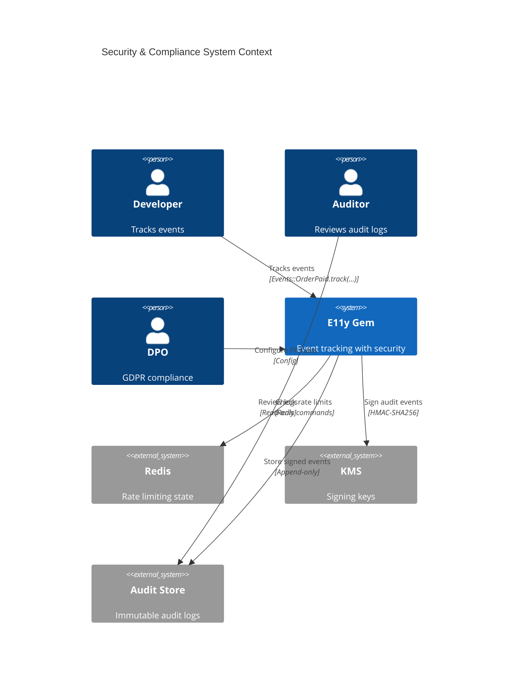
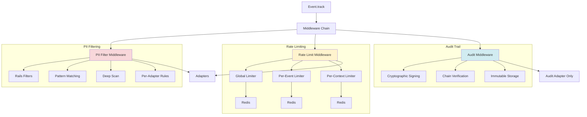
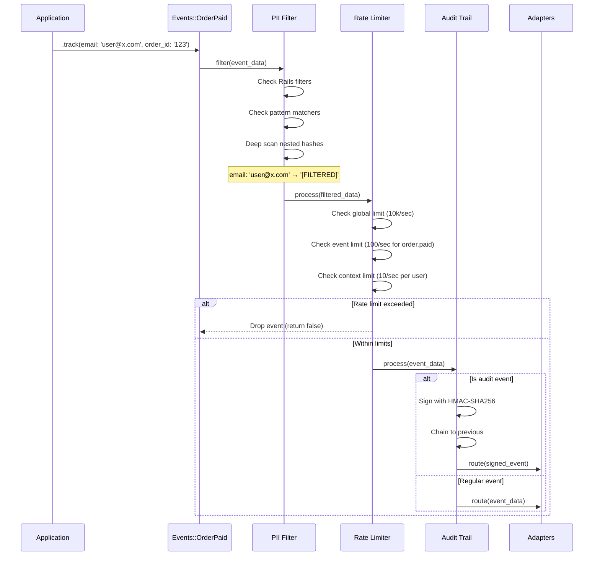
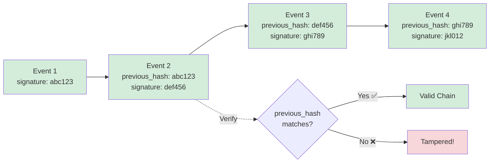

# ADR-006: Security & Compliance

**Status:** Draft  
**Date:** January 12, 2026  
**Covers:** UC-007 (PII Filtering), UC-011 (Rate Limiting), UC-012 (Audit Trail)  
**Depends On:** ADR-001 (Core Architecture), ADR-004 (Adapters)

---

## 📋 Table of Contents

1. [Context & Problem](#1-context--problem)
2. [Architecture Overview](#2-architecture-overview)
3. [PII Filtering](#3-pii-filtering)
   - 3.1. [Rails Integration](#31-rails-integration)
   - 3.2. [Pattern-Based Filtering](#32-pattern-based-filtering)
   - 3.3. [Deep Scanning](#33-deep-scanning)
   - 3.4. [Per-Adapter Rules](#34-per-adapter-rules)
   - 3.5. [Sampling for Debug](#35-sampling-for-debug)
4. [Rate Limiting](#4-rate-limiting)
   - 4.1. [Global Rate Limiting](#41-global-rate-limiting)
   - 4.2. [Per-Event Rate Limiting](#42-per-event-rate-limiting)
   - 4.3. [Per-Context Rate Limiting](#43-per-context-rate-limiting)
   - 4.4. [Redis Integration](#44-redis-integration)
5. [Audit Trail](#5-audit-trail)
   - 5.1. [Immutable Events](#51-immutable-events)
   - 5.2. [Cryptographic Signing](#52-cryptographic-signing)
   - 5.3. [Compliance Features](#53-compliance-features)
   - 5.4. [Tamper Detection](#54-tamper-detection)
   - 5.5. [OpenTelemetry Baggage PII Protection (C08 Resolution)](#55-opentelemetry-baggage-pii-protection-c08-resolution) ⚠️ CRITICAL
     - 5.5.1. The Problem: PII Leaking via OpenTelemetry Baggage
     - 5.5.2. Decision: Block PII from Baggage Entirely
     - 5.5.3. BaggageProtection Middleware Implementation
     - 5.5.4. Configuration
     - 5.5.5. Usage Examples
     - 5.5.6. Strict Mode (Development/Staging)
     - 5.5.7. Trade-offs & GDPR Compliance (C08)
   - 5.6. [PII Handling for Event Replay from DLQ (C07 Resolution)](#56-pii-handling-for-event-replay-from-dlq-c07-resolution) ⚠️ HIGH
     - 5.6.1. The Problem: Double-Hashing PII on Replay
     - 5.6.2. Decision: Skip PII Filtering for Replayed Events
     - 5.6.3. PiiFilter Middleware with Replay Detection
     - 5.6.4. DLQ Replay Service with Metadata Flags
     - 5.6.5. Configuration
     - 5.6.6. Usage Examples
     - 5.6.7. Idempotency Verification (Testing)
     - 5.6.8. Trade-offs & Audit Trail Integrity (C07)
6. [GDPR Compliance](#6-gdpr-compliance)
7. [Configuration](#7-configuration)
8. [Testing](#8-testing)
9. [Trade-offs](#9-trade-offs)

---

## 1. Context & Problem

### 1.1. Problem Statement

**Current Pain Points:**

1. **PII Exposure:**
   ```ruby
   # ❌ Sensitive data in logs
   Events::UserLogin.track(
     email: 'user@example.com',       # PII!
     password: 'secret123',            # Credentials!
     ip_address: '192.168.1.100'      # PII!
   )
   ```

2. **No Rate Limiting:**
   ```ruby
   # ❌ Event flood can overwhelm system
   1_000_000.times do
     Events::Debug.track(message: 'spam')
   end
   ```

3. **No Audit Trail:**
   ```ruby
   # ❌ Can't prove what happened
   Events::GdprDeletion.track(user_id: '123')
   # Was this really tracked? Can it be tampered?
   ```

### 1.2. Goals

**Primary Goals:**
- ✅ Rails-compatible PII filtering
- ✅ Per-adapter filtering rules
- ✅ Global + per-event + per-context rate limiting
- ✅ Cryptographically-signed audit trail
- ✅ GDPR compliance ready

**Non-Goals:**
- ❌ Perfect PII detection (false positives OK)
- ❌ Zero-impact performance (small overhead acceptable)
- ❌ Full GDPR implementation (provide tools, not guarantee)

### 1.3. Success Metrics

| Metric | Target | Critical? |
|--------|--------|-----------|
| **PII filtering overhead** | <0.2ms per event | ✅ Yes |
| **Rate limit accuracy** | >99% | ✅ Yes |
| **Audit signature time** | <1ms | ✅ Yes |
| **False positive PII** | <5% | ⚠️ Important |

---

## 2. Architecture Overview

### 2.1. System Context



### 2.2. Security Pipeline



### 2.3. Data Flow with Security



---

## 3. PII Filtering

### 3.0. PII Filtering Strategy

**Critical Design Decision:** Explicit opt-in, per-adapter filtering to minimize performance overhead.

#### 3.0.1. The Performance Problem

**Problem:** Filtering ALL events by default = massive overhead!

```ruby
# ❌ BAD: Filter every event (expensive!)
1,000,000 events/day × 0.2ms filtering = 200 seconds CPU/day = waste!

# ✅ GOOD: Filter only PII events
100,000 PII events/day × 0.2ms = 20 seconds CPU/day = acceptable
```

#### 3.0.2. Three-Tier Filtering Strategy

E11y uses a **3-tier approach** to balance security and performance:

| Tier | Strategy | Cost | Use Case | Events/sec |
|------|----------|------|----------|------------|
| **Tier 1** | Skip filtering | 0ms | Health checks, metrics, internal events | 500 |
| **Tier 2** | Rails filters only | ~0.05ms | Standard events (known PII keys) | 400 |
| **Tier 3** | Deep filtering | ~0.2ms | User data, payments, complex nested | 100 |

**Performance Budget:**
```
500 events/sec × 0ms     = 0ms CPU/sec      (Tier 1)
400 events/sec × 0.05ms  = 20ms CPU/sec     (Tier 2)
100 events/sec × 0.2ms   = 20ms CPU/sec     (Tier 3)
---
Total: 40ms CPU/sec = 4% CPU on single core ✅
```

#### 3.0.3. Explicit PII Declaration

**Rule:** Event class MUST declare PII handling explicitly.

**Option A: No PII (Skip Filtering)**
```ruby
class Events::HealthCheck < E11y::Event::Base
  schema do
    required(:status).filled(:string)
  end
  
  # ✅ Explicit: This event contains NO PII
  contains_pii false  # Skip all PII filtering (Tier 1)
end
```

**Option B: Default (Rails Filters Only)**
```ruby
class Events::OrderCreated < E11y::Event::Base
  schema do
    required(:order_id).filled(:string)
    required(:amount).filled(:float)
  end
  
  # No declaration → Rails filters applied (Tier 2, default)
  # Uses: Rails.application.config.filter_parameters
end
```

**Option C: Explicit PII (Deep Filtering)**
```ruby
class Events::UserRegistered < E11y::Event::Base
  schema do
    required(:email).filled(:string)
    required(:password).filled(:string)
    required(:address).filled(:hash)
    required(:user_id).filled(:string)
  end
  
  # ✅ Explicit: This event contains PII
  contains_pii true  # Tier 3: Deep filtering
  
  pii_filtering do
    # ✅ MANDATORY: Explicit declaration for EACH schema field
    # Linter will FAIL if any field is missing!
    
    field :email do
      strategy :hash                        # Pseudonymize for searchability
      exclude_adapters [:file_audit]        # Audit needs original (GDPR Art. 6(1)(c))
    end
    
    field :password do
      strategy :mask                        # Full mask everywhere
      # No exclude_adapters → applies to ALL adapters
    end
    
    field :address do
      strategy :redact                      # Remove completely
      exclude_adapters [:file_audit]
    end
    
    field :user_id do
      strategy :skip                        # Not PII, no filtering
    end
    
    # ❌ If you forget a field → Linter FAILS at boot:
    #    "Missing PII declaration for: [:forgotten_field]"
  end
end
```

**Option D: Audit Events (Simplified)**
```ruby
class Events::GdprDeletion < E11y::AuditEvent
  schema do
    required(:user_id).filled(:string)
    required(:email).filled(:string)
    required(:reason).filled(:string)
    required(:deleted_at).filled(:time)
  end
  
  contains_pii true
  
  pii_filtering do
    # ✅ AuditEvent automatically excludes :file_audit for all fields
    
    field :user_id do
      strategy :skip  # Not PII
    end
    
    field :email do
      strategy :hash  # For non-audit adapters (Elasticsearch, Loki)
      # exclude_adapters [:file_audit] ← AUTOMATIC for AuditEvent
    end
    
    field :reason do
      strategy :skip  # Not PII
    end
    
    field :deleted_at do
      strategy :skip  # Not PII
    end
  end
end

# Result:
# - file_audit:     { email: 'user@example.com' }  # Original (GDPR Art. 6(1)(c))
# - elasticsearch:  { email: 'a1b2c3d4...' }       # Hashed
# - loki:           { email: 'a1b2c3d4...' }       # Hashed
# - sentry:         { email: 'a1b2c3d4...' }       # Hashed
```

#### 3.0.4. Filtering Strategies

| Strategy | Example | Use Case | Reversible? | Cost |
|----------|---------|----------|-------------|------|
| **:skip** | `user@example.com` | Audit trail (compliance) | N/A | 0ms |
| **:mask** | `[FILTERED]` | External services (Sentry) | ❌ No | 0.01ms |
| **:hash** | `a1b2c3d4e5f6...` | Pseudonymization (searchable) | ❌ No | 0.05ms |
| **:truncate** | `192.168.x.x` | Partial masking (logs) | ❌ No | 0.02ms |
| **:redact** | *(removed)* | Complete removal | ❌ No | 0.01ms |
| **:encrypt** | `encrypted_blob` | Searchable encryption | ✅ Yes (with key) | 0.15ms |

#### 3.0.5. PII Declaration Linter

**Critical:** Linter ENFORCES explicit declaration for every field when `contains_pii true`.

```ruby
# lib/e11y/linters/pii_declaration_linter.rb
module E11y
  module Linters
    class PiiDeclarationLinter
      def self.validate_all!
        E11y::Registry.all_events.each do |event_class|
          validate!(event_class)
        end
      end
      
      def self.validate!(event_class)
        return unless event_class.contains_pii?
        
        # Get declared fields from pii_filtering block
        declared_fields = event_class.pii_filtering_config&.fields&.keys || []
        
        # Get all fields from schema
        schema_fields = event_class.schema.keys
        
        # Check for missing declarations
        missing = schema_fields - declared_fields
        
        if missing.any?
          raise PiiDeclarationError, build_error_message(event_class, missing)
        end
        
        # Validate each field has valid strategy
        declared_fields.each do |field|
          config = event_class.pii_filtering_config.fields[field]
          validate_field_config!(event_class, field, config)
        end
      end
      
      private
      
      def self.build_error_message(event_class, missing_fields)
        <<~ERROR
          ❌ PII Declaration Error: #{event_class.name}
          
          Event declared `contains_pii true` but missing field declarations:
          
          Missing fields: #{missing_fields.map(&:inspect).join(', ')}
          
          Fix: Add explicit PII strategy for each field in pii_filtering block:
          
          class #{event_class.name} < E11y::Event::Base
            contains_pii true
            
            pii_filtering do
              #{missing_fields.map { |f| "field :#{f} do\n      strategy :mask  # or :hash, :skip, :redact\n    end" }.join("\n    ")}
            end
          end
          
          Available strategies: :skip, :mask, :hash, :redact, :truncate, :encrypt
        ERROR
      end
      
      def self.validate_field_config!(event_class, field, config)
        valid_strategies = [:skip, :mask, :hash, :redact, :truncate, :encrypt]
        
        unless valid_strategies.include?(config[:strategy])
          raise PiiDeclarationError, <<~ERROR
            ❌ Invalid PII strategy for #{event_class.name}##{field}
            
            Strategy: #{config[:strategy].inspect}
            Valid strategies: #{valid_strategies.map(&:inspect).join(', ')}
          ERROR
        end
        
        # Validate exclude_adapters if present
        if config[:exclude_adapters]
          unless config[:exclude_adapters].is_a?(Array)
            raise PiiDeclarationError, "exclude_adapters must be an array for #{event_class.name}##{field}"
          end
        end
      end
    end
    
    class PiiDeclarationError < StandardError; end
  end
end
```

**Rake Task:**
```ruby
# lib/tasks/e11y_pii.rake
namespace :e11y do
  namespace :lint do
    desc 'Validate PII declarations for all events'
    task pii: :environment do
      puts "Checking PII declarations..."
      puts "=" * 80
      
      errors = []
      warnings = []
      
      E11y::Registry.all_events.each do |event_class|
        begin
          E11y::Linters::PiiDeclarationLinter.validate!(event_class)
          
          if event_class.contains_pii?
            puts "✅ #{event_class.name} - All #{event_class.schema.keys.size} fields declared"
          else
            puts "⚪ #{event_class.name} - No PII (skipped)"
          end
        rescue E11y::Linters::PiiDeclarationError => error
          errors << error.message
          puts "❌ #{event_class.name}"
        end
      end
      
      puts "=" * 80
      
      if errors.any?
        puts "\n❌ ERRORS:\n\n"
        errors.each { |e| puts e; puts "\n" }
        exit 1
      else
        puts "\n✅ All PII declarations are valid"
        exit 0
      end
    end
  end
end
```

**Usage:**
```bash
# Validate all events
$ bundle exec rake e11y:lint:pii

Checking PII declarations...
================================================================================
✅ Events::OrderCreated - All 3 fields declared
✅ Events::PaymentProcessed - All 5 fields declared
❌ Events::UserRegistered
⚪ Events::HealthCheck - No PII (skipped)
================================================================================

❌ ERRORS:

❌ PII Declaration Error: Events::UserRegistered

Event declared `contains_pii true` but missing field declarations:

Missing fields: :ip_address, :user_agent

Fix: Add explicit PII strategy for each field in pii_filtering block:

class Events::UserRegistered < E11y::Event::Base
  contains_pii true
  
  pii_filtering do
    field :ip_address do
      strategy :mask  # or :hash, :skip, :redact
    end
    field :user_agent do
      strategy :mask  # or :hash, :skip, :redact
    end
  end
end

Available strategies: :skip, :mask, :hash, :redact, :truncate, :encrypt
```

**Boot-time Validation:**
```ruby
# config/initializers/e11y.rb
E11y.configure do |config|
  # ... other config ...
  
  # Validate PII declarations at boot (in development/test)
  if Rails.env.development? || Rails.env.test?
    config.after_initialize do
      E11y::Linters::PiiDeclarationLinter.validate_all!
    end
  end
end
```

#### 3.0.6. Default Behavior

**If `contains_pii` not specified:**
- ✅ Apply Rails filters only (Tier 2)
- ✅ Fast (0.05ms overhead)
- ✅ Covers 90% of use cases (password, token, secret, api_key)
- ⚠️ No linter validation (assumes you know what you're doing)

**Recommended approach:**
```ruby
# For most events: don't specify (default is good)
class Events::OrderPaid < E11y::Event::Base
  # No contains_pii declaration
  # → Rails filters applied automatically
  # → No linter validation
end

# Only for internal/metrics: opt-out
class Events::HealthCheck < E11y::Event::Base
  contains_pii false  # Explicit opt-out
  # → No filtering, no validation
end

# For sensitive data: opt-in + explicit declarations
class Events::UserLogin < E11y::Event::Base
  contains_pii true   # ✅ Triggers linter validation
  
  pii_filtering do
    # ✅ MUST declare ALL schema fields
    field :email do
      strategy :hash
      exclude_adapters [:file_audit]
    end
    
    field :password do
      strategy :mask
    end
    
    field :ip_address do
      strategy :mask
    end
    
    field :session_id do
      strategy :skip  # Not PII
    end
  end
end
```

#### 3.0.6. Critical Design Decisions from Conflict Analysis

**From CONFLICT-ANALYSIS.md:**

1. **Conflict #4: Audit Trail + PII Filtering**
   - ✅ Decision: PII filtering happens **per-adapter** (not globally)
   - Rationale: Audit needs original data (GDPR Art. 6(1)(c)), Sentry needs masked
   - Implementation: Each adapter applies its own PII rules

2. **Conflict #3: PII Filtering + OpenTelemetry**
   - ✅ Decision: Per-adapter PII rules
   - OTel: pseudonymize (one-way hash)
   - Audit: skip filtering (compliance)
   - Sentry: strict masking (external service)

3. **Pipeline Order (UPDATED):**
   ```
   1. Schema Validation
   2. Context Enrichment
   3. Rate Limiting (moved before PII for efficiency)
   4. Adaptive Sampling
   5. Audit Signing (BEFORE filtering, preserves original signature)
   6. Adapter Routing
      └─→ PII Filtering (per-adapter, different rules per destination)
   ```

**Key Insight:** PII filtering is **NOT a global middleware** — it's applied **inside each adapter** with different rules!

### 3.1. Rails Integration

**Design Decision:** Use `Rails.application.config.filter_parameters` as base.

```ruby
module E11y
  module Security
    class PiiFilter
      def initialize(config)
        @rails_filters = extract_rails_filters
        @custom_patterns = config.patterns || []
        @custom_filters = config.custom_filters || []
        @allowlist = config.allowlist || []
        @deep_scan = config.deep_scan || true
      end
      
      def filter(event_data)
        filtered_data = event_data.dup
        
        # Apply Rails filters
        filtered_data[:payload] = apply_rails_filters(filtered_data[:payload])
        
        # Apply custom patterns
        filtered_data[:payload] = apply_pattern_filters(filtered_data[:payload])
        
        # Apply custom filter functions
        filtered_data[:payload] = apply_custom_filters(filtered_data[:payload])
        
        # Deep scan if enabled
        if @deep_scan
          filtered_data[:payload] = deep_scan(filtered_data[:payload])
        end
        
        filtered_data
      end
      
      private
      
      def extract_rails_filters
        return [] unless defined?(Rails)
        
        Rails.application.config.filter_parameters || []
      end
      
      def apply_rails_filters(payload)
        return payload if @rails_filters.empty?
        
        # Use Rails' parameter filter
        filter = ActiveSupport::ParameterFilter.new(@rails_filters)
        filter.filter(payload)
      end
    end
  end
end
```

**Example:**

```ruby
# config/initializers/filter_parameters.rb
Rails.application.config.filter_parameters += [
  :password,
  :password_confirmation,
  :secret,
  :token,
  :api_key,
  :credit_card_number,
  :ssn
]

# E11y automatically uses these filters!
Events::UserLogin.track(
  email: 'user@example.com',
  password: 'secret123'  # ← Automatically filtered by Rails
)

# Result in logs:
# { email: 'user@example.com', password: '[FILTERED]' }
```

---

### 3.2. Pattern-Based Filtering

**Design Decision:** Regex patterns for content scanning.

```ruby
module E11y
  module Security
    class PatternMatcher
      BUILT_IN_PATTERNS = {
        email: /\b[A-Za-z0-9._%+-]+@[A-Za-z0-9.-]+\.[A-Z|a-z]{2,}\b/,
        credit_card: /\b(?:\d{4}[-\s]?){3}\d{4}\b/,
        ssn: /\b\d{3}-\d{2}-\d{4}\b/,
        phone: /\b\d{3}[-.]?\d{3}[-.]?\d{4}\b/,
        ip_address: /\b(?:\d{1,3}\.){3}\d{1,3}\b/,
        jwt: /\beyJ[A-Za-z0-9_-]+\.[A-Za-z0-9_-]+\.[A-Za-z0-9_-]+\b/,
        api_key: /\b[A-Za-z0-9]{32,}\b/
      }.freeze
      
      def initialize(enabled_patterns: BUILT_IN_PATTERNS.keys, custom_patterns: {})
        @patterns = BUILT_IN_PATTERNS.slice(*enabled_patterns)
        @patterns.merge!(custom_patterns)
      end
      
      def filter(value)
        return value unless value.is_a?(String)
        
        filtered_value = value.dup
        
        @patterns.each do |name, pattern|
          filtered_value.gsub!(pattern, "[FILTERED:#{name.upcase}]")
        end
        
        filtered_value
      end
      
      def contains_pii?(value)
        return false unless value.is_a?(String)
        
        @patterns.any? { |_, pattern| value.match?(pattern) }
      end
    end
  end
end
```

**Example:**

```ruby
E11y.configure do |config|
  config.security.pii_filtering do
    # Enable built-in patterns
    patterns [:email, :credit_card, :ssn, :phone, :ip_address]
    
    # Add custom patterns
    custom_pattern :internal_id, /\bINT-\d{6,}\b/
    custom_pattern :license_plate, /\b[A-Z]{3}-\d{4}\b/
  end
end

# Usage:
Events::CustomerSupport.track(
  message: "Customer email is user@example.com, IP: 192.168.1.1"
)

# Result:
# {
#   message: "Customer email is [FILTERED:EMAIL], IP: [FILTERED:IP_ADDRESS]"
# }
```

---

### 3.3. Deep Scanning

**Design Decision:** Recursively scan nested hashes and arrays.

```ruby
module E11y
  module Security
    class DeepScanner
      def initialize(pattern_matcher, allowlist: [])
        @pattern_matcher = pattern_matcher
        @allowlist = allowlist
      end
      
      def scan(value, key_path: [])
        case value
        when Hash
          scan_hash(value, key_path)
        when Array
          scan_array(value, key_path)
        when String
          scan_string(value, key_path)
        else
          value
        end
      end
      
      private
      
      def scan_hash(hash, key_path)
        hash.transform_values do |v|
          new_key_path = key_path + [hash.keys.find { |k| hash[k] == v }]
          
          # Skip if in allowlist
          next v if allowlisted?(new_key_path)
          
          scan(v, key_path: new_key_path)
        end
      end
      
      def scan_array(array, key_path)
        array.map.with_index do |item, index|
          scan(item, key_path: key_path + [index])
        end
      end
      
      def scan_string(string, key_path)
        return string if allowlisted?(key_path)
        
        @pattern_matcher.filter(string)
      end
      
      def allowlisted?(key_path)
        key_path_string = key_path.join('.')
        
        @allowlist.any? do |pattern|
          case pattern
          when String
            key_path_string == pattern
          when Regexp
            key_path_string.match?(pattern)
          else
            false
          end
        end
      end
    end
  end
end
```

**Example:**

```ruby
E11y.configure do |config|
  config.security.pii_filtering do
    deep_scan true
    
    # Allowlist certain paths
    allowlist [
      'order.id',              # Exact match
      /^metadata\.internal_/,  # Regex match
      'debug.raw_request'      # Development debugging
    ]
  end
end

# Deep nested structure:
Events::OrderCreated.track(
  order: {
    id: 'ORD-123',
    customer: {
      email: 'user@example.com',  # ← Will be filtered
      phone: '555-1234'            # ← Will be filtered
    },
    metadata: {
      internal_ref: 'INT-999999',  # ← Allowlisted, kept
      note: 'Contact at user@example.com'  # ← Will be filtered
    }
  }
)

# Result:
# {
#   order: {
#     id: 'ORD-123',
#     customer: {
#       email: '[FILTERED:EMAIL]',
#       phone: '[FILTERED:PHONE]'
#     },
#     metadata: {
#       internal_ref: 'INT-999999',  # Kept
#       note: 'Contact at [FILTERED:EMAIL]'
#     }
#   }
# }
```

---

### 3.4. Per-Adapter Rules (Architecture)

**Critical Design Decision:** PII filtering happens **inside each adapter**, not globally.

#### 3.4.1. Why Per-Adapter Filtering?

**Problem with Global Filtering:**
```ruby
# ❌ BAD: Filter once globally
event_data = { email: 'user@example.com', ip: '192.168.1.1' }
filtered_event = global_pii_filter(event_data)
# → { email: '[FILTERED]', ip: '[FILTERED]' }

# Now ALL adapters get filtered data
send_to_audit_file(filtered_event)   # ❌ Audit needs ORIGINAL email!
send_to_sentry(filtered_event)        # ✅ Sentry gets filtered (correct)
send_to_loki(filtered_event)          # ❌ Loki could have kept hashed email
```

**Solution: Filter Per-Adapter:**
```ruby
# ✅ GOOD: Each adapter applies its own rules
adapters.each do |adapter|
  # Adapter decides filtering strategy
  adapter_filtered_event = adapter.apply_pii_rules(event_data)
  adapter.write(adapter_filtered_event)
end

# Result:
# - Audit File:     { email: 'user@example.com', ip: '192.168.1.1' }  (original)
# - Sentry:         { email: '[FILTERED]', ip: '[FILTERED]' }         (masked)
# - Loki:           { email: 'a1b2c3d4...', ip: '192.168.x.x' }       (hashed/truncated)
# - Elasticsearch:  { email: 'a1b2c3d4...', ip: '192.168.1.1' }       (email hashed only)
```

**Architecture Diagram:**

```mermaid
graph TB
    Event[Event Data<br/>email: user@x.com<br/>ip: 192.168.1.1] --> Router[Adapter Router]
    
    Router --> Audit[Audit Adapter]
    Router --> Sentry[Sentry Adapter]
    Router --> Loki[Loki Adapter]
    Router --> ES[Elasticsearch Adapter]
    
    subgraph "Per-Adapter PII Filtering"
        Audit --> AuditFilter[PII Filter: SKIP<br/>mode: :skip]
        Sentry --> SentryFilter[PII Filter: MASK<br/>mode: :mask]
        Loki --> LokiFilter[PII Filter: CUSTOM<br/>mode: :custom]
        ES --> ESFilter[PII Filter: HASH<br/>mode: :hash]
    end
    
    AuditFilter --> AuditStore[Audit File<br/>email: user@x.com<br/>ip: 192.168.1.1]
    SentryFilter --> SentryAPI[Sentry<br/>email: [FILTERED]<br/>ip: [FILTERED]]
    LokiFilter --> LokiAPI[Loki<br/>email: [FILTERED]<br/>ip: 192.168.x.x]
    ESFilter --> ESAPI[Elasticsearch<br/>email: a1b2c3d4...<br/>ip: 192.168.1.1]
    
    style AuditFilter fill:#d4edda
    style SentryFilter fill:#f8d7da
    style LokiFilter fill:#fff3cd
    style ESFilter fill:#d1ecf1
```

#### 3.4.2. Implementation

```ruby
module E11y
  module Adapters
    class Base
      def write(event_data)
        # Apply adapter-specific PII filtering
        filtered_data = apply_pii_rules(event_data)
        
        # Write filtered data
        write_impl(filtered_data)
      end
      
      private
      
      def apply_pii_rules(event_data)
        # Get event class
        event_class = E11y::Registry.get_class(event_data[:event_name])
        
        # Check if event has per-adapter rules
        return event_data unless event_class.respond_to?(:pii_filtering_for_adapter)
        
        # Get rules for THIS adapter
        rules = event_class.pii_filtering_for_adapter(adapter_name)
        
        # Apply filtering based on rules
        case rules[:strategy]
        when :skip
          event_data  # No filtering
        when :mask
          mask_pii_fields(event_data, rules[:fields])
        when :hash
          hash_pii_fields(event_data, rules[:fields])
        when :custom
          rules[:filter].call(event_data)
        else
          # Fallback to default Rails filters
          apply_rails_filters(event_data)
        end
      end
      
      def mask_pii_fields(event_data, fields)
        filtered = event_data.dup
        fields.each do |field|
          deep_mask(filtered[:payload], field)
        end
        filtered
      end
      
      def hash_pii_fields(event_data, fields)
        filtered = event_data.dup
        fields.each do |field|
          deep_hash(filtered[:payload], field)
        end
        filtered
      end
    end
  end
end
```

#### 3.4.3. Event Class Declaration (Simplified)

```ruby
class Events::UserLogin < E11y::Event::Base
  schema do
    required(:email).filled(:string)
    required(:ip_address).filled(:string)
    required(:session_id).filled(:string)
  end
  
  contains_pii true
  
  pii_filtering do
    # ✅ Simple per-field declaration
    field :email do
      strategy :hash                    # Apply to all adapters
      exclude_adapters [:file_audit]    # Except audit (needs original)
      hash_algorithm 'SHA256'           # Optional: specify algorithm
    end
    
    field :ip_address do
      strategy :mask                    # Mask for all adapters
      exclude_adapters [:file_audit]
    end
    
    field :session_id do
      strategy :skip                    # Not PII, no filtering
    end
  end
end

# Result across adapters:
# 
# file_audit:     { email: 'user@example.com', ip: '192.168.1.1', session_id: 's123' }
# elasticsearch:  { email: 'a1b2c3d4...', ip: '[FILTERED]', session_id: 's123' }
# loki:           { email: 'a1b2c3d4...', ip: '[FILTERED]', session_id: 's123' }
# sentry:         { email: 'a1b2c3d4...', ip: '[FILTERED]', session_id: 's123' }
```

**For complex per-adapter rules (advanced use case):**
```ruby
class Events::UserLogin < E11y::Event::Base
  contains_pii true
  
  pii_filtering do
    field :ip_address do
      # Different strategy per adapter (advanced)
      strategy :mask                    # Default for most adapters
      
      # Custom strategy for specific adapter
      custom_for_adapter :loki do
        # Truncate IP instead of full mask
        ->(value) { value.split('.')[0..2].join('.') + '.x' }
      end
      
      exclude_adapters [:file_audit]
    end
  end
end

# Result:
# loki:           { ip: '192.168.1.x' }     # Custom truncate
# sentry:         { ip: '[FILTERED]' }       # Default mask
# elasticsearch:  { ip: '[FILTERED]' }       # Default mask
```

#### 3.4.4. Configuration API (Rails-Style DSL)

```ruby
module E11y
  module Event
    class Base
      class << self
        # DSL for PII filtering (Rails-style)
        def pii_filtering(&block)
          @pii_filtering_config = PiiFilteringConfig.new(self)
          @pii_filtering_config.instance_eval(&block)
        end
        
        def pii_filtering_config
          @pii_filtering_config
        end
        
        # Get PII rules for specific field and adapter
        def pii_rule_for_field(field_name, adapter_name)
          return nil unless @pii_filtering_config
          
          field_config = @pii_filtering_config.fields[field_name]
          return nil unless field_config
          
          # Check if this adapter is excluded
          if field_config[:exclude_adapters]&.include?(adapter_name)
            return { strategy: :skip }
          end
          
          # Check if only specific adapters allowed
          if field_config[:only_adapters] && !field_config[:only_adapters].include?(adapter_name)
            return { strategy: :skip }
          end
          
          # Check for custom adapter-specific rule
          if field_config[:custom_adapters] && field_config[:custom_adapters][adapter_name]
            return { 
              strategy: :custom, 
              filter: field_config[:custom_adapters][adapter_name] 
            }
          end
          
          # Return default strategy for this field
          {
            strategy: field_config[:strategy],
            hash_algorithm: field_config[:hash_algorithm],
            truncate_to: field_config[:truncate_to],
            custom_filter: field_config[:custom_filter]
          }.compact
        end
      end
    end
    
    class PiiFilteringConfig
      attr_reader :fields
      
      def initialize(event_class)
        @event_class = event_class
        @fields = {}
      end
      
      # ===================================================================
      # RAILS-STYLE DSL: Single-line shortcuts
      # ===================================================================
      
      # Shortcut: masks(*fields)
      # Like validates :name, :email, presence: true
      def masks(*field_names, **options)
        field_names.each do |field_name|
          field(field_name) do
            strategy :mask
            apply_options(options)
          end
        end
      end
      
      # Shortcut: hashes(*fields)
      def hashes(*field_names, **options)
        field_names.each do |field_name|
          field(field_name) do
            strategy :hash
            apply_options(options)
          end
        end
      end
      
      # Shortcut: redacts(*fields)
      def redacts(*field_names, **options)
        field_names.each do |field_name|
          field(field_name) do
            strategy :redact
            apply_options(options)
          end
        end
      end
      
      # Shortcut: skips(*fields) - not PII
      def skips(*field_names, **options)
        field_names.each do |field_name|
          field(field_name) do
            strategy :skip
            apply_options(options)
          end
        end
      end
      
      # Shortcut: truncates(*fields)
      def truncates(*field_names, to:, **options)
        field_names.each do |field_name|
          field(field_name) do
            strategy :truncate
            truncate_to to
            apply_options(options)
          end
        end
      end
      
      # ===================================================================
      # CONDITIONAL FILTERING (Rails-style)
      # ===================================================================
      
      # Like validates :admin, presence: true, if: :admin?
      def masks_if(condition, *field_names, **options)
        field_names.each do |field_name|
          field(field_name) do
            strategy :mask
            only_if condition
            apply_options(options)
          end
        end
      end
      
      def hashes_if(condition, *field_names, **options)
        field_names.each do |field_name|
          field(field_name) do
            strategy :hash
            only_if condition
            apply_options(options)
          end
        end
      end
      
      # ===================================================================
      # GROUPING (Rails-style)
      # ===================================================================
      
      # Like with_options model: Post do ... end
      def with_strategy(strategy, &block)
        @current_strategy = strategy
        instance_eval(&block)
        @current_strategy = nil
      end
      
      def with_options(**options, &block)
        @current_options = options
        instance_eval(&block)
        @current_options = nil
      end
      
      # ===================================================================
      # FIELD DECLARATION
      # ===================================================================
      
      def field(name, strategy: nil, **options, &block)
        config = FieldConfig.new(name, @event_class)
        
        # Apply current context (from with_strategy/with_options)
        config.strategy(@current_strategy) if @current_strategy
        config.apply_options(@current_options) if @current_options
        
        # Apply inline options
        config.strategy(strategy) if strategy
        config.apply_options(options)
        
        # Apply block if provided
        config.instance_eval(&block) if block_given?
        
        @fields[name] = config.to_h
      end
      
      # ===================================================================
      # BULK OPERATIONS (Rails-style)
      # ===================================================================
      
      # Like validates_presence_of :name, :email
      def masks_all_except(*exceptions)
        schema_fields = @event_class.schema.keys
        (schema_fields - exceptions).each do |field_name|
          masks field_name
        end
      end
      
      def hashes_all_except(*exceptions, **options)
        schema_fields = @event_class.schema.keys
        (schema_fields - exceptions).each do |field_name|
          hashes field_name, **options
        end
      end
    end
    
    class FieldConfig
      attr_reader :field_name
      
      def initialize(field_name, event_class)
        @field_name = field_name
        @event_class = event_class
        @config = {}
      end
      
      # ===================================================================
      # CORE METHODS
      # ===================================================================
      
      def strategy(value)
        @config[:strategy] = value
      end
      
      def exclude_adapters(adapters)
        @config[:exclude_adapters] = Array(adapters)
      end
      
      def only_adapters(adapters)
        @config[:only_adapters] = Array(adapters)
      end
      
      def hash_algorithm(algo)
        @config[:hash_algorithm] = algo
      end
      
      def truncate_to(length)
        @config[:truncate_to] = length
      end
      
      def custom_for_adapter(adapter_name, &block)
        @config[:custom_adapters] ||= {}
        @config[:custom_adapters][adapter_name] = block
      end
      
      def custom_filter(&block)
        @config[:custom_filter] = block
      end
      
      # ===================================================================
      # CONDITIONAL FILTERING (Rails-style)
      # ===================================================================
      
      def only_if(condition)
        @config[:only_if] = condition
      end
      
      def unless(condition)
        @config[:unless] = condition
      end
      
      # ===================================================================
      # SHORTCUTS (Rails-style chainable)
      # ===================================================================
      
      def except(*adapters)
        exclude_adapters(adapters)
      end
      
      def only(*adapters)
        only_adapters(adapters)
      end
      
      def with_algorithm(algo)
        hash_algorithm(algo)
      end
      
      # ===================================================================
      # OPTIONS HELPERS
      # ===================================================================
      
      def apply_options(options)
        return unless options
        
        exclude_adapters(options[:except]) if options[:except]
        only_adapters(options[:only]) if options[:only]
        hash_algorithm(options[:algorithm]) if options[:algorithm]
        truncate_to(options[:to]) if options[:to]
        only_if(options[:if]) if options[:if]
        self.unless(options[:unless]) if options[:unless]
      end
      
      def to_h
        @config
      end
    end
  end
end

# AuditEvent: Automatically exclude :file_audit for all fields
module E11y
  class AuditEvent < Event::Base
    class << self
      def pii_rule_for_field(field_name, adapter_name)
        rule = super
        
        # Override: AuditEvent always skips filtering for :file_audit
        if adapter_name == :file_audit
          return { strategy: :skip }
        end
        
        rule
      end
    end
  end
end
```

**Configuration:**

```ruby
E11y.configure do |config|
  config.security.pii_filtering do
    # Global rules (apply to all adapters by default)
    patterns [:email, :phone, :ssn]
    
    # Per-adapter overrides
    adapter_rules do
      # Audit logs: keep original data (internal only)
      adapter :file_audit, mode: :skip
      
      # Sentry: extra strict filtering
      adapter :sentry, mode: :strict, additional_patterns: {
        user_agent: /Mozilla.*\(.*/,
        url_params: /\?.*$/
      }
      
      # Loki: custom filter
      adapter :loki, mode: :custom, filter: ->(event_data) {
        # Keep emails for internal Loki, but mask credit cards
        filtered = event_data.dup
        filtered[:payload] = mask_credit_cards(event_data[:payload])
        filtered
      }
    end
  end
end
```

**Use Case Diagram:**

```mermaid
graph TB
    Event[Event Data] --> Router[Adapter Router]
    
    Router --> Audit[Audit Adapter]
    Router --> Sentry[Sentry Adapter]
    Router --> Loki[Loki Adapter]
    
    subgraph "PII Filtering"
        Audit --> Skip[Skip Filtering<br/>mode: :skip]
        Sentry --> Strict[Strict Filtering<br/>mode: :strict]
        Loki --> Custom[Custom Filter<br/>mode: :custom]
    end
    
    Skip --> AuditStore[Full Data<br/>email: user@x.com]
    Strict --> SentryAPI[Heavily Filtered<br/>email: [FILTERED]<br/>user_agent: [FILTERED]]
    Custom --> LokiAPI[Custom Filtered<br/>email: user@x.com<br/>cc: [FILTERED]]
    
    style Skip fill:#d4edda
    style Strict fill:#f8d7da
    style Custom fill:#fff3cd
```

---

### 3.5. Sampling for Debug

**Design Decision:** Sample filtered values for debugging false positives.

```ruby
module E11y
  module Security
    class FilterSampler
      def initialize(sample_rate: 0.01, max_samples: 100)
        @sample_rate = sample_rate
        @max_samples = max_samples
        @samples = []
        @mutex = Mutex.new
      end
      
      def record_filter(key_path, original_value, filtered_value)
        return unless should_sample?
        
        @mutex.synchronize do
          return if @samples.size >= @max_samples
          
          @samples << {
            key_path: key_path.join('.'),
            original: truncate(original_value),
            filtered: filtered_value,
            timestamp: Time.now
          }
        end
      end
      
      def samples
        @mutex.synchronize { @samples.dup }
      end
      
      def clear!
        @mutex.synchronize { @samples.clear }
      end
      
      private
      
      def should_sample?
        rand < @sample_rate
      end
      
      def truncate(value, max_length: 100)
        str = value.to_s
        str.length > max_length ? "#{str[0...max_length]}..." : str
      end
    end
  end
end
```

**Usage:**

```ruby
# Check sampled filters in console
E11y.security.filter_sampler.samples
# [
#   {
#     key_path: 'customer.email',
#     original: 'user@example.com',
#     filtered: '[FILTERED:EMAIL]',
#     timestamp: 2026-01-12 10:30:00 UTC
#   },
#   ...
# ]

# Clear samples
E11y.security.filter_sampler.clear!
```

#### 3.4.5. Rails-Style DSL Examples

**Pattern 1: Single-line shortcuts (like Rails validations)**

```ruby
class Events::UserRegistered < E11y::Event::Base
  schema do
    required(:email).filled(:string)
    required(:password).filled(:string)
    required(:ip_address).filled(:string)
    required(:user_id).filled(:string)
  end
  
  contains_pii true
  
  pii_filtering do
    # ✅ Rails-style: masks :password, :ip_address
    masks :password, :ip_address
    
    # ✅ Rails-style: hashes :email, except: [:file_audit]
    hashes :email, except: [:file_audit]
    
    # ✅ Not PII
    skips :user_id
  end
end
```

**Pattern 2: with_options (grouping)**

```ruby
class Events::PaymentProcessed < E11y::Event::Base
  contains_pii true
  
  pii_filtering do
    # ✅ Like Rails: with_options validatable: true do
    with_options except: [:file_audit] do
      hashes :email, :user_id
      masks :ip_address
    end
    
    # Always mask (no exceptions)
    masks :credit_card_last4, :cvv
    
    skips :payment_id, :amount
  end
end
```

**Pattern 3: with_strategy (bulk)**

```ruby
class Events::GdprExport < E11y::Event::Base
  contains_pii true
  
  pii_filtering do
    # ✅ All hashed except audit
    with_strategy :hash do
      with_options except: [:file_audit] do
        field :email
        field :phone_number
        field :address
      end
    end
    
    # Sensitive data → always mask
    with_strategy :mask do
      field :ssn
      field :credit_card
    end
    
    skips :user_id, :export_id
  end
end
```

**Pattern 4: Conditional filtering (if/unless)**

```ruby
class Events::AdminAction < E11y::Event::Base
  contains_pii true
  
  pii_filtering do
    # ✅ Like Rails: validates :admin_notes, presence: true, if: :admin?
    masks_if ->(payload) { payload[:level] == 'admin' }, :admin_notes
    
    # Hash user data unless it's a system user
    hashes_if ->(payload) { !payload[:is_system] }, :email, :ip_address
    
    skips :action_type, :timestamp
  end
end
```

**Pattern 5: Custom per-adapter (advanced)**

```ruby
class Events::UserLogin < E11y::Event::Base
  contains_pii true
  
  pii_filtering do
    # Default: hash
    hashes :email, except: [:file_audit]
    
    # Custom for Loki: truncate IP
    field :ip_address do
      strategy :mask                  # Default
      except :file_audit
      
      # ✅ Custom filter for specific adapter
      custom_for_adapter :loki do |value|
        value.split('.')[0..2].join('.') + '.x'
      end
    end
    
    masks :password
    skips :session_id
  end
end
```

**Pattern 6: Bulk operations**

```ruby
class Events::UserProfileUpdated < E11y::Event::Base
  schema do
    required(:user_id).filled(:string)
    required(:email).filled(:string)
    required(:phone).filled(:string)
    required(:address).filled(:hash)
    required(:bio).filled(:string)
    required(:avatar_url).filled(:string)
  end
  
  contains_pii true
  
  pii_filtering do
    # ✅ Like Rails: validates_presence_of :all, except: [:id]
    # Hash everything except user_id and avatar_url
    hashes_all_except :user_id, :avatar_url, except: [:file_audit]
  end
end
```

**Pattern 7: Chainable methods**

```ruby
class Events::PaymentAttempt < E11y::Event::Base
  contains_pii true
  
  pii_filtering do
    # ✅ Chainable (Rails-style)
    field :email do
      strategy :hash
      except :file_audit
      with_algorithm 'SHA256'
    end
    
    field :ip_address do
      strategy :truncate
      truncate_to 10  # "192.168.1.xxx" → "192.168.1."
      except :file_audit
    end
    
    masks :card_number
    skips :payment_id
  end
end
```

**Pattern 8: Smart defaults with overrides**

```ruby
class Events::SensitiveDataAccess < E11y::Event::Base
  contains_pii true
  
  pii_filtering do
    # Default strategy for most fields
    with_strategy :hash do
      with_options algorithm: 'SHA256', except: [:file_audit] do
        field :accessed_by_email
        field :accessed_record_id
        field :ip_address
      end
    end
    
    # Override for ultra-sensitive data
    field :ssn do
      strategy :redact  # Complete removal
      only :sentry      # Only for external service
    end
    
    skips :access_timestamp, :action_type
  end
end
```

**Pattern 9: Truncation shortcuts**

```ruby
class Events::ApiRequest < E11y::Event::Base
  contains_pii true
  
  pii_filtering do
    # ✅ Truncate with inline option
    truncates :api_key, to: 8  # Show first 8 chars: "sk_live_..." → "sk_live_"
    
    hashes :user_email, except: [:file_audit]
    
    skips :request_id, :method, :path
  end
end
```

**Pattern 10: Multiple adapters (only/except)**

```ruby
class Events::SecurityIncident < E11y::Event::Base
  contains_pii true
  
  pii_filtering do
    # Send hashed to internal tools only
    field :suspect_email do
      strategy :hash
      only [:elasticsearch, :loki]  # Only these adapters
    end
    
    # Mask for external services
    field :victim_email do
      strategy :mask
      only [:sentry, :pagerduty]
    end
    
    # Audit gets everything (AuditEvent auto-skip)
    skips :incident_id, :severity
  end
end
```

---

#### 3.4.6. Rails-Style Validators & Helpers

**Custom validators (like Rails):**

```ruby
# lib/e11y/pii/validators/email_validator.rb
module E11y
  module Pii
    module Validators
      class EmailValidator
        def self.validate(value)
          return true if value =~ URI::MailTo::EMAIL_REGEXP
          
          raise E11y::Pii::ValidationError, "Invalid email format: #{value}"
        end
      end
    end
  end
end

# Usage in event:
class Events::UserRegistered < E11y::Event::Base
  pii_filtering do
    field :email do
      strategy :hash
      validate_with E11y::Pii::Validators::EmailValidator
    end
  end
end
```

**Macros (like Rails concerns):**

```ruby
# lib/e11y/pii/macros/standard_user_fields.rb
module E11y
  module Pii
    module Macros
      module StandardUserFields
        extend ActiveSupport::Concern
        
        class_methods do
          def filter_standard_user_pii
            pii_filtering do
              hashes :email, except: [:file_audit]
              masks :password
              skips :user_id
            end
          end
        end
      end
    end
  end
end

# Usage:
class Events::UserLogin < E11y::Event::Base
  include E11y::Pii::Macros::StandardUserFields
  
  contains_pii true
  filter_standard_user_pii  # ✅ Macro!
  
  pii_filtering do
    # Additional fields
    masks :ip_address
  end
end
```

---

#### 3.4.7. Testing PII Filters (RSpec Examples)

**Critical:** PII filtering MUST be tested to ensure no leaks.

```ruby
# spec/lib/e11y/security/pii_filtering_spec.rb
RSpec.describe 'PII Filtering', type: :integration do
  describe 'Per-Adapter Filtering' do
    let(:event_class) { Events::UserLogin }
    let(:payload) do
      {
        email: 'user@example.com',
        ip_address: '192.168.1.100',
        user_id: 'u123'
      }
    end
    
    before do
      # Track events sent to adapters
      E11y::Adapters.each do |adapter|
        allow(adapter).to receive(:write).and_call_original
      end
    end
    
    it 'applies different PII rules for each adapter' do
      event_class.track(payload)
      
      # Check Audit Adapter: NO filtering
      audit_event = E11y::Adapters[:file_audit].written_events.last
      expect(audit_event[:payload][:email]).to eq('user@example.com')
      expect(audit_event[:payload][:ip_address]).to eq('192.168.1.100')
      
      # Check Sentry Adapter: FULL masking
      sentry_event = E11y::Adapters[:sentry].written_events.last
      expect(sentry_event[:payload][:email]).to eq('[FILTERED]')
      expect(sentry_event[:payload][:ip_address]).to eq('[FILTERED]')
      
      # Check Loki Adapter: CUSTOM (email masked, IP truncated)
      loki_event = E11y::Adapters[:loki].written_events.last
      expect(loki_event[:payload][:email]).to eq('[FILTERED]')
      expect(loki_event[:payload][:ip_address]).to eq('192.168.1.x')
      
      # Check Elasticsearch Adapter: HASHED email only
      es_event = E11y::Adapters[:elasticsearch].written_events.last
      expect(es_event[:payload][:email]).to match(/^[a-f0-9]{64}$/)  # SHA256 hash
      expect(es_event[:payload][:ip_address]).to eq('192.168.1.100')  # Not filtered
    end
  end
  
  describe 'Tier 1: No PII (Skip Filtering)' do
    let(:event_class) { Events::HealthCheck }
    let(:payload) { { status: 'ok' } }
    
    it 'skips PII filtering entirely' do
      start = Time.now
      
      1000.times { event_class.track(payload) }
      
      duration = Time.now - start
      
      # Should be VERY fast (no filtering overhead)
      expect(duration).to be < 0.1  # <100ms for 1000 events
    end
  end
  
  describe 'Tier 2: Rails Filters Only' do
    let(:event_class) { Events::OrderCreated }
    let(:payload) do
      {
        order_id: 'o123',
        amount: 99.99,
        password: 'secret123',  # Rails filter should catch this
        api_key: 'sk_live_xxx'   # Rails filter should catch this
      }
    end
    
    it 'applies Rails.application.config.filter_parameters' do
      event_class.track(payload)
      
      event = E11y::Adapters[:loki].written_events.last
      
      # Known Rails filter keys
      expect(event[:payload][:password]).to eq('[FILTERED]')
      expect(event[:payload][:api_key]).to eq('[FILTERED]')
      
      # Not filtered
      expect(event[:payload][:order_id]).to eq('o123')
      expect(event[:payload][:amount]).to eq(99.99)
    end
  end
  
  describe 'Tier 3: Deep Filtering' do
    let(:event_class) { Events::UserRegistered }
    let(:payload) do
      {
        email: 'user@example.com',
        address: {
          street: '123 Main St',
          city: 'New York',
          zip: '10001'
        },
        metadata: {
          referrer: 'https://example.com?email=leaked@example.com'
        }
      }
    end
    
    before do
      event_class.class_eval do
        contains_pii true
        
        pii_filtering do
          deep_scan true
          patterns [:email]  # Scan for emails in all strings
        end
      end
    end
    
    it 'filters PII in nested structures' do
      event_class.track(payload)
      
      event = E11y::Adapters[:sentry].written_events.last
      
      # Top-level email filtered
      expect(event[:payload][:email]).to eq('[FILTERED]')
      
      # Nested email in string also filtered
      expect(event[:payload][:metadata][:referrer]).not_to include('leaked@example.com')
      expect(event[:payload][:metadata][:referrer]).to include('[FILTERED]')
    end
  end
  
  describe 'Performance Regression Test' do
    it 'meets performance budget for 1000 events/sec' do
      events = [
        { class: Events::HealthCheck, payload: { status: 'ok' }, count: 500 },         # Tier 1
        { class: Events::OrderCreated, payload: { id: 'o1' }, count: 400 },            # Tier 2
        { class: Events::UserLogin, payload: { email: 'u@x.com' }, count: 100 }        # Tier 3
      ]
      
      start = Time.now
      
      events.each do |batch|
        batch[:count].times { batch[:class].track(batch[:payload]) }
      end
      
      duration = Time.now - start
      
      # Total: 1000 events
      # Budget: 40ms CPU (4% of 1 second)
      # Allow 2x buffer for test overhead
      expect(duration).to be < 0.08  # 80ms
    end
  end
  
  describe 'GDPR Compliance Audit' do
    it 'logs PII filtering decisions for audit trail' do
      event_class = Events::UserLogin
      
      expect(E11y.logger).to receive(:info).with(
        hash_including(
          event: 'pii_filtering_applied',
          adapter: :sentry,
          strategy: :mask,
          fields: [:email, :ip_address]
        )
      )
      
      event_class.track(email: 'user@example.com', ip_address: '192.168.1.1')
    end
    
    it 'logs justification for skipping PII filtering (audit)' do
      event_class = Events::GdprDeletion
      
      expect(E11y.logger).to receive(:info).with(
        hash_including(
          event: 'pii_filtering_skipped',
          adapter: :file_audit,
          justification: /GDPR Art. 6\(1\)\(c\)/
        )
      )
      
      event_class.track(user_id: 'u123', email: 'user@example.com')
    end
  end
  
  describe 'Edge Cases' do
    it 'handles missing PII fields gracefully' do
      event_class = Events::UserLogin
      
      # Missing 'email' field (required by PII config)
      expect {
        event_class.track(ip_address: '192.168.1.1')
      }.not_to raise_error
    end
    
    it 'handles nil values in PII fields' do
      event_class = Events::UserLogin
      
      event_class.track(email: nil, ip_address: '192.168.1.1')
      
      event = E11y::Adapters[:sentry].written_events.last
      expect(event[:payload][:email]).to be_nil  # Not "[FILTERED]"
    end
    
    it 'handles very long PII values efficiently' do
      long_email = "#{'a' * 10_000}@example.com"
      
      event_class = Events::UserLogin
      
      start = Time.now
      event_class.track(email: long_email, ip_address: '192.168.1.1')
      duration = Time.now - start
      
      # Should not hang or be extremely slow
      expect(duration).to be < 0.5  # <500ms
    end
  end
end

# spec/support/pii_filter_matcher.rb
RSpec::Matchers.define :be_pii_filtered do
  match do |value|
    ['[FILTERED]', '[REDACTED]', '[MASKED]'].include?(value) || 
      value =~ /^[a-f0-9]{32,}$/  # Hash
  end
  
  failure_message do |value|
    "expected #{value.inspect} to be PII-filtered (e.g., '[FILTERED]' or hash)"
  end
end

RSpec::Matchers.define :be_pii_free do |original|
  match do |value|
    value == original  # Not filtered
  end
  
  failure_message do |value|
    "expected #{value.inspect} to be PII-free (original: #{original.inspect})"
  end
end

# Usage:
# expect(event[:payload][:email]).to be_pii_filtered
# expect(event[:payload][:order_id]).to be_pii_free('o123')
```

**Running PII Tests:**
```bash
# Test all PII filtering
bundle exec rspec spec/lib/e11y/security/pii_filtering_spec.rb

# Test specific tier
bundle exec rspec spec/lib/e11y/security/pii_filtering_spec.rb -e "Tier 3"

# Performance test
bundle exec rspec spec/lib/e11y/security/pii_filtering_spec.rb -e "Performance"

# GDPR compliance audit
bundle exec rspec spec/lib/e11y/security/pii_filtering_spec.rb -e "GDPR"
```

---

## 4. Rate Limiting

### 4.0. Rate Limiting + Retry Policy Resolution (Conflict #14)

**Critical Decision from CONFLICT-ANALYSIS.md:**

**Problem:** Should retry attempts count toward rate limits?

**Resolution:**
```ruby
# ✅ Retries DO count toward rate limit
# Reason: Prevent retry amplification attack

config.error_handling do
  retry_policy do
    respect_rate_limits true  # ← Retries checked
    on_retry_rate_limited :send_to_dlq  # Safety net
  end
end

# Optional: Separate limit for retries
config.rate_limiting do
  global_limit 100.per_second
  
  retry_limit do
    enabled true
    limit 20.per_second  # Additional headroom
  end
  
  # Critical events bypass
  bypass_for_severities [:error, :fatal]
  bypass_for_patterns ['audit.*']
end
```

**Pipeline Flow:**
```
Original event
  → Rate Limiting (check)
  → Adapter Write (fail)
  → Retry #1
    → Rate Limiting (check again) ← Retry counts!
    → Adapter Write (fail)
  → Retry #2 (rate limited)
    → DLQ (rate-limited retry)
```

---

### 4.1. Global Rate Limiting

**Design Decision:** System-wide rate limit for all events.

```ruby
module E11y
  module RateLimiting
    class GlobalLimiter
      def initialize(config)
        @limit = config.limit  # events per second
        @window = config.window || 1.second
        @strategy = config.strategy || :sliding_window
        @redis = config.redis
        
        @counter = initialize_counter
      end
      
      def allow?(event_data = nil)
        @counter.increment('global')
        
        current_rate = @counter.rate('global', window: @window)
        
        current_rate <= @limit
      end
      
      def current_rate
        @counter.rate('global', window: @window)
      end
      
      private
      
      def initialize_counter
        if @redis
          RedisCounter.new(@redis, strategy: @strategy)
        else
          InMemoryCounter.new(strategy: @strategy)
        end
      end
    end
  end
end
```

**Configuration:**

```ruby
E11y.configure do |config|
  config.rate_limiting do
    global do
      enabled true
      limit 10_000  # 10k events/sec
      window 1.second
      strategy :sliding_window
      
      # Overflow behavior
      on_overflow :drop  # :drop, :sample, or :queue
      
      # Monitoring
      on_limit_exceeded do |current_rate, limit|
        Rails.logger.warn "[E11y] Global rate limit exceeded: #{current_rate}/#{limit}"
      end
    end
  end
end
```

---

### 4.2. Per-Event Rate Limiting

**Design Decision:** Different limits for different event types.

```ruby
module E11y
  module RateLimiting
    class PerEventLimiter
      def initialize(config)
        @limits = config.limits || {}
        @default_limit = config.default_limit || Float::INFINITY
        @window = config.window || 1.second
        @redis = config.redis
        
        @counter = initialize_counter
      end
      
      def allow?(event_data)
        event_name = event_data[:event_name]
        limit = @limits[event_name] || @default_limit
        
        return true if limit == Float::INFINITY
        
        @counter.increment(event_name)
        
        current_rate = @counter.rate(event_name, window: @window)
        
        current_rate <= limit
      end
      
      def current_rate(event_name)
        @counter.rate(event_name, window: @window)
      end
    end
  end
end
```

**Configuration:**

```ruby
E11y.configure do |config|
  config.rate_limiting do
    per_event do
      enabled true
      
      # Specific limits per event
      limits do
        event 'order.paid', limit: 1000  # 1k/sec
        event 'user.login', limit: 500   # 500/sec
        event 'debug.*', limit: 100      # 100/sec for all debug events
      end
      
      # Default for unlisted events
      default_limit 1000
      
      window 1.second
    end
  end
end
```

---

### 4.3. Per-Context Rate Limiting

**Design Decision:** Limit per user/tenant/IP address.

```ruby
module E11y
  module RateLimiting
    class PerContextLimiter
      def initialize(config)
        @limit = config.limit
        @window = config.window || 1.minute
        @context_keys = config.context_keys || [:user_id]
        @redis = config.redis
        
        @counter = initialize_counter
      end
      
      def allow?(event_data)
        context_value = extract_context(event_data)
        
        return true unless context_value
        
        key = "context:#{context_value}"
        @counter.increment(key)
        
        current_rate = @counter.rate(key, window: @window)
        
        current_rate <= @limit
      end
      
      private
      
      def extract_context(event_data)
        @context_keys.each do |key|
          value = event_data.dig(:payload, key) || event_data[key]
          return value if value
        end
        
        nil
      end
    end
  end
end
```

**Configuration:**

```ruby
E11y.configure do |config|
  config.rate_limiting do
    per_context do
      enabled true
      
      # Limit per user
      context_key :user_id
      limit 100  # 100 events per minute per user
      window 1.minute
      
      # Multiple context keys (fallback)
      context_keys [:user_id, :session_id, :ip_address]
      
      # Allowlist (no limits)
      allowlist do
        user_ids ['admin_user', 'system']
      end
    end
  end
end
```

---

### 4.4. Redis Integration

**Design Decision:** Distributed rate limiting with Redis.

```ruby
module E11y
  module RateLimiting
    class RedisCounter
      def initialize(redis, strategy: :sliding_window)
        @redis = redis
        @strategy = strategy
      end
      
      def increment(key)
        case @strategy
        when :sliding_window
          increment_sliding_window(key)
        when :fixed_window
          increment_fixed_window(key)
        when :token_bucket
          increment_token_bucket(key)
        end
      end
      
      def rate(key, window:)
        case @strategy
        when :sliding_window
          count_sliding_window(key, window)
        when :fixed_window
          count_fixed_window(key, window)
        when :token_bucket
          tokens_remaining(key)
        end
      end
      
      private
      
      # Sliding Window (most accurate)
      def increment_sliding_window(key)
        now = Time.now.to_f
        redis_key = "e11y:rate:#{key}"
        
        @redis.multi do |multi|
          multi.zadd(redis_key, now, "#{now}:#{SecureRandom.uuid}")
          multi.expire(redis_key, 60)
        end
      end
      
      def count_sliding_window(key, window)
        now = Time.now.to_f
        cutoff = now - window.to_f
        redis_key = "e11y:rate:#{key}"
        
        # Remove old entries
        @redis.zremrangebyscore(redis_key, '-inf', cutoff)
        
        # Count remaining
        @redis.zcard(redis_key)
      end
      
      # Fixed Window (simpler, less accurate)
      def increment_fixed_window(key)
        window_key = current_window_key(key)
        
        @redis.multi do |multi|
          multi.incr(window_key)
          multi.expire(window_key, 60)
        end
      end
      
      def count_fixed_window(key, window)
        window_key = current_window_key(key)
        @redis.get(window_key).to_i
      end
      
      def current_window_key(key)
        window_start = (Time.now.to_i / 1) * 1  # 1-second windows
        "e11y:rate:fixed:#{key}:#{window_start}"
      end
      
      # Token Bucket (burst-friendly)
      def increment_token_bucket(key)
        redis_key = "e11y:rate:bucket:#{key}"
        
        # Lua script for atomic token consumption
        lua_script = <<~LUA
          local key = KEYS[1]
          local capacity = tonumber(ARGV[1])
          local refill_rate = tonumber(ARGV[2])
          local now = tonumber(ARGV[3])
          
          local tokens = tonumber(redis.call('GET', key) or capacity)
          local last_refill = tonumber(redis.call('GET', key .. ':last') or now)
          
          -- Refill tokens
          local time_passed = now - last_refill
          local tokens_to_add = time_passed * refill_rate
          tokens = math.min(capacity, tokens + tokens_to_add)
          
          -- Consume token
          if tokens >= 1 then
            tokens = tokens - 1
            redis.call('SET', key, tokens)
            redis.call('SET', key .. ':last', now)
            return 1  -- Success
          else
            return 0  -- No tokens
          end
        LUA
        
        @redis.eval(lua_script, keys: [redis_key], argv: [100, 10, Time.now.to_f])
      end
      
      def tokens_remaining(key)
        redis_key = "e11y:rate:bucket:#{key}"
        @redis.get(redis_key).to_i
      end
    end
  end
end
```

**Rate Limiting Strategies Comparison:**

```mermaid
graph TB
    subgraph "Sliding Window (Most Accurate)"
        SW1[Request at t=0] --> SW2[Request at t=0.5]
        SW2 --> SW3[Request at t=0.9]
        SW3 --> SW4[Window: 0.0-1.0s<br/>Count: 3]
    end
    
    subgraph "Fixed Window (Simpler)"
        FW1[Request at t=0.9] --> FW2[Request at t=1.1]
        FW2 --> FW3[Window 1: 1 request<br/>Window 2: 1 request]
        Note right of FW3: Burst at boundary!
    end
    
    subgraph "Token Bucket (Burst-Friendly)"
        TB1[Capacity: 100 tokens] --> TB2[Refill: 10/sec]
        TB2 --> TB3[Burst: OK if tokens available]
    end
    
    style SW4 fill:#d4edda
    style FW3 fill:#fff3cd
    style TB3 fill:#d1ecf1
```

---

## 5. Audit Trail

### 5.0. Audit Trail + PII Filtering Resolution (Conflict #4)

**Critical Decision from CONFLICT-ANALYSIS.md:**

**Problem:** Audit events need original data for compliance, but PII filtering requires masking for GDPR.

**Resolution:**
```ruby
# Option A: Audit events skip PII filtering (RECOMMENDED)
config.audit_trail do
  skip_pii_filtering true  # Legal obligation > privacy
end

# Compensating controls:
config.audit_trail do
  encryption_at_rest true
  access_control do
    read_access_role :auditor
    read_access_requires_reason true
    read_access_logged true  # Meta-audit
  end
end

# Option B: Per-adapter PII rules (more flexible)
class UserPermissionChanged < E11y::AuditEvent
  adapters [:audit_file, :elasticsearch, :sentry]
  
  pii_rules do
    # Audit file: keep all PII (compliance)
    adapter :audit_file do
      skip_filtering true
    end
    
    # Elasticsearch: pseudonymize
    adapter :elasticsearch do
      pseudonymize_fields :email, :ip_address
    end
    
    # Sentry: mask all
    adapter :sentry do
      mask_fields :email, :ip_address, :user_id
    end
  end
end
```

**GDPR Justification:**
- Art. 6(1)(c): "Legal obligation" is valid processing basis
- Audit logs = necessary for accountability (SOX, HIPAA, GDPR Art. 30)
- Mitigation: encryption + access control + retention limits

---

### 5.1. Immutable Events

**Design Decision:** Audit events are append-only, never modified.

```ruby
module E11y
  class AuditEvent < Event::Base
    # Audit events CANNOT be modified after creation
    def self.inherited(subclass)
      super
      
      subclass.class_eval do
        # Freeze payload after creation
        after_track :freeze_payload!
        
        private
        
        def freeze_payload!
          @payload.deep_freeze
        end
      end
    end
    
    # Audit-specific metadata
    def self.audit_retention(days)
      @audit_retention_days = days
    end
    
    def self.audit_reason(reason)
      @audit_reason = reason
    end
    
    def self.signing_enabled(enabled = true)
      @signing_enabled = enabled
    end
  end
end
```

**Example:**

```ruby
module Events
  class GdprDeletion < E11y::AuditEvent
    adapters [:file_audit, :elasticsearch_audit]
    
    audit_retention 2555  # 7 years
    audit_reason 'GDPR Article 17 - Right to erasure'
    signing_enabled true
    
    schema do
      required(:user_id).filled(:string)
      required(:deletion_reason).filled(:string)
      required(:requested_by).filled(:string)
      required(:approved_by).filled(:string)
    end
  end
  
  class FinancialTransaction < E11y::AuditEvent
    audit_retention 2555  # 7 years (SOX compliance)
    audit_reason 'SOX Section 802'
    signing_enabled true
    
    schema do
      required(:transaction_id).filled(:string)
      required(:amount).filled(:float)
      required(:currency).filled(:string)
      required(:from_account).filled(:string)
      required(:to_account).filled(:string)
    end
  end
end
```

---

### 5.2. Cryptographic Signing

**Design Decision:** HMAC-SHA256 signatures for tamper detection.

```ruby
module E11y
  module Security
    class EventSigner
      def initialize(config)
        @secret_key = config.secret_key || raise("Secret key required for signing")
        @algorithm = config.algorithm || 'SHA256'
        @include_chain = config.include_chain || true
        @previous_hash = nil
      end
      
      def sign(event_data)
        # Create canonical representation
        canonical = canonicalize(event_data)
        
        # Add chain if enabled
        if @include_chain && @previous_hash
          canonical[:previous_hash] = @previous_hash
        end
        
        # Generate signature
        signature = generate_signature(canonical)
        
        # Store hash for next event
        @previous_hash = signature
        
        # Add signature to event
        event_data.merge(
          signature: signature,
          signed_at: Time.now.utc.iso8601,
          signature_algorithm: "HMAC-#{@algorithm}"
        )
      end
      
      def verify(event_data)
        stored_signature = event_data[:signature]
        return false unless stored_signature
        
        # Remove signature for verification
        data_without_sig = event_data.except(:signature, :signed_at, :signature_algorithm)
        
        # Canonicalize
        canonical = canonicalize(data_without_sig)
        
        # Generate expected signature
        expected_signature = generate_signature(canonical)
        
        # Constant-time comparison
        secure_compare(expected_signature, stored_signature)
      end
      
      def verify_chain(events)
        events.each_cons(2).all? do |prev_event, current_event|
          # Check if current event references previous
          current_event[:previous_hash] == prev_event[:signature]
        end
      end
      
      private
      
      def canonicalize(data)
        # Sort keys recursively for deterministic output
        case data
        when Hash
          data.sort.to_h.transform_values { |v| canonicalize(v) }
        when Array
          data.map { |item| canonicalize(item) }
        else
          data
        end
      end
      
      def generate_signature(canonical_data)
        json = JSON.generate(canonical_data)
        OpenSSL::HMAC.hexdigest(@algorithm, @secret_key, json)
      end
      
      def secure_compare(a, b)
        return false if a.bytesize != b.bytesize
        
        l = a.unpack("C*")
        r = b.unpack("C*")
        
        result = 0
        l.zip(r) { |x, y| result |= x ^ y }
        result == 0
      end
    end
  end
end
```

**Signature Chain Visualization:**



---

### 5.3. Compliance Features

**GDPR, HIPAA, SOX, PCI DSS Requirements:**

```ruby
module E11y
  module Compliance
    class AuditConfig
      # GDPR Article 30 - Records of processing activities
      def gdpr_compliant!
        audit_retention 2555  # 7 years
        audit_reason 'GDPR Article 30'
        signing_enabled true
        
        # Log who accessed what
        log_access true
        access_control do
          require_justification true
          require_approval true
        end
        
        # Right to be forgotten
        support_deletion_requests true
        deletion_proof_required true
      end
      
      # HIPAA - Health Insurance Portability and Accountability Act
      def hipaa_compliant!
        audit_retention 2190  # 6 years
        audit_reason 'HIPAA 45 CFR 164.312'
        signing_enabled true
        
        # PHI access logging
        log_phi_access true
        encrypt_at_rest true
        
        # Breach notification
        breach_detection true
        notification_within 60.days
      end
      
      # SOX - Sarbanes-Oxley Act
      def sox_compliant!
        audit_retention 2555  # 7 years
        audit_reason 'SOX Section 802'
        signing_enabled true
        
        # Financial records
        tamper_proof true
        dual_approval_required true
        
        # Retention enforcement
        prevent_deletion true
        archive_after 2555.days
      end
      
      # PCI DSS - Payment Card Industry Data Security Standard
      def pci_dss_compliant!
        audit_retention 365  # 1 year minimum
        audit_reason 'PCI DSS Requirement 10'
        signing_enabled true
        
        # Card data events
        log_all_access true
        log_failed_attempts true
        
        # Time synchronization
        ntp_sync_required true
        
        # Review
        daily_log_review true
      end
    end
  end
end
```

**Configuration:**

```ruby
E11y.configure do |config|
  config.compliance do
    # Enable GDPR compliance
    gdpr do
      enabled true
      data_controller 'Company Inc.'
      dpo_email 'dpo@company.com'
      
      # Consent tracking
      track_consent true
      consent_required_for [:analytics, :marketing]
    end
    
    # Enable SOX compliance
    sox do
      enabled true
      dual_approval_required true
      
      # Audit settings
      audit_settings do
        retention_period 7.years
        tamper_proof true
      end
    end
  end
end
```

---

### 5.4. Tamper Detection

**Design Decision:** Automated verification and alerting.

```ruby
module E11y
  module Security
    class TamperDetector
      def initialize(signer, alert_handler)
        @signer = signer
        @alert_handler = alert_handler
      end
      
      def verify_event(event_data)
        valid = @signer.verify(event_data)
        
        unless valid
          alert_tampering!(event_data)
        end
        
        valid
      end
      
      def verify_batch(events)
        # Verify each signature
        signature_results = events.map do |event|
          { event: event, valid: @signer.verify(event) }
        end
        
        # Verify chain
        chain_valid = @signer.verify_chain(events)
        
        # Check for tampering
        tampered_events = signature_results.reject { |r| r[:valid] }
        
        if tampered_events.any? || !chain_valid
          alert_batch_tampering!(tampered_events, chain_valid)
        end
        
        {
          total: events.size,
          valid: signature_results.count { |r| r[:valid] },
          invalid: tampered_events.size,
          chain_valid: chain_valid
        }
      end
      
      private
      
      def alert_tampering!(event_data)
        @alert_handler.call(
          type: :single_event_tampered,
          event_id: event_data[:event_id],
          event_name: event_data[:event_name],
          timestamp: event_data[:timestamp],
          severity: :critical
        )
      end
      
      def alert_batch_tampering!(tampered_events, chain_valid)
        @alert_handler.call(
          type: :batch_tampered,
          tampered_count: tampered_events.size,
          chain_valid: chain_valid,
          event_ids: tampered_events.map { |e| e[:event][:event_id] },
          severity: :critical
        )
      end
    end
  end
end
```

**Monitoring:**

```ruby
E11y.configure do |config|
  config.security.tamper_detection do
    enabled true
    
    # Verify on read
    verify_on_read true
    
    # Periodic verification
    periodic_verification do
      enabled true
      interval 1.hour
      sample_size 1000
    end
    
    # Alerting
    on_tampering_detected do |alert|
      # Critical alert
      PagerDuty.trigger(
        service: 'e11y-audit',
        incident_key: "tamper-#{alert[:type]}",
        description: "Audit log tampering detected: #{alert[:tampered_count]} events",
        severity: 'critical'
      )
      
      # Log
      Rails.logger.error "[E11y] TAMPERING DETECTED: #{alert.inspect}"
      
      # Disable writes (safety)
      E11y.emergency_readonly_mode!
    end
  end
end
```

---

## 5.5. OpenTelemetry Baggage PII Protection (C08 Resolution)

> **⚠️ CRITICAL: C08 Conflict Resolution - PII × OpenTelemetry Baggage**  
> **See:** [CONFLICT-ANALYSIS.md C08](researches/CONFLICT-ANALYSIS.md#c08-pii-filtering--opentelemetry-baggage) for detailed analysis  
> **Problem:** OpenTelemetry Baggage automatically propagates via HTTP headers and can leak PII to downstream services  
> **Solution:** Block PII from baggage entirely with safe key allowlist

### 5.5.1. The Problem: PII Leaking via OpenTelemetry Baggage

**Scenario - GDPR Violation:**

```ruby
# Service A: User registration
Events::UserRegistered.track(
  user_id: '123',
  email: 'user@example.com',  # ← PII, filtered in event payload ✅
  name: 'John Doe'             # ← PII, filtered in event payload ✅
)

# Developer accidentally sets PII in baggage:
OpenTelemetry::Baggage.set_value('user_email', 'user@example.com')  # ❌ PII in baggage!
OpenTelemetry::Baggage.set_value('user_name', 'John Doe')            # ❌ PII in baggage!

# Service A → Service B (HTTP call)
# HTTP headers AUTOMATICALLY include baggage:
# baggage: user_email=user@example.com,user_name=John Doe

# Service B receives baggage with PII!
# Service B logs baggage → PII LEAKED to downstream service!

# Result: PII BYPASS!
# - Event payload: PII filtered ✅
# - Baggage: PII NOT filtered ❌ ← GDPR violation!
```

**Why This Is Critical:**
- ✅ OpenTelemetry Baggage is **W3C standard** for trace context propagation
- ❌ Baggage is **automatically transmitted** via HTTP headers (`baggage: key=value`)
- ❌ Downstream services **receive PII without filtering**
- ❌ Logs, metrics, traces in downstream services **contain PII**
- ❌ **GDPR Article 5(1)(c) violation:** PII transmitted beyond necessary scope

### 5.5.2. Decision: Block PII from Baggage Entirely

**Strategy:** Allowlist-only mode for safe keys, block all others.

**Safe Keys (Allowed):**
- `trace_id` - OpenTelemetry trace ID (not PII)
- `span_id` - OpenTelemetry span ID (not PII)
- `environment` - Environment name (production, staging, etc.)
- `version` - Application version (deployment ID)
- `service_name` - Service identifier
- `deployment_id` - Deployment identifier
- `request_id` - Internal request ID (UUID, not PII)

**Blocked Keys (PII Risk):**
- `user_id`, `user_email`, `user_name` - User identifiers
- `ip_address`, `client_ip` - IP addresses (GDPR Article 4(1))
- `session_id`, `session_token` - Session identifiers (can be PII)
- `api_key`, `token`, `password` - Credentials
- Any custom keys not in allowlist

### 5.5.3. BaggageProtection Middleware Implementation

```ruby
module E11y
  module Middleware
    class BaggageProtection
      # Safe keys that can be set in baggage
      ALLOWED_KEYS = %w[
        trace_id
        span_id
        environment
        version
        service_name
        deployment_id
        request_id
      ].freeze
      
      def initialize(config)
        @enabled = config.baggage_protection_enabled || true
        @allowed_keys = config.baggage_allowed_keys || ALLOWED_KEYS
        @block_mode = config.baggage_block_mode || :silent  # :silent, :warn, :raise
        @logger = E11y.logger
      end
      
      def call(event_data)
        return event_data unless @enabled
        
        # Intercept OpenTelemetry::Baggage.set_value calls
        protect_baggage!
        
        event_data
      end
      
      private
      
      def protect_baggage!
        # Monkey-patch OpenTelemetry::Baggage (runtime protection)
        OpenTelemetry::Baggage.singleton_class.prepend(BaggageInterceptor.new(
          allowed_keys: @allowed_keys,
          block_mode: @block_mode,
          logger: @logger
        ))
      end
    end
    
    # Interceptor for OpenTelemetry::Baggage.set_value
    module BaggageInterceptor
      def initialize(allowed_keys:, block_mode:, logger:)
        @allowed_keys = allowed_keys
        @block_mode = block_mode
        @logger = logger
        super()
      end
      
      def set_value(key, value, context = nil)
        # Check if key is allowed
        unless @allowed_keys.include?(key.to_s)
          handle_blocked_key(key, value)
          return context || OpenTelemetry::Context.current
        end
        
        # Key is safe, proceed
        super(key, value, context)
      end
      
      private
      
      def handle_blocked_key(key, value)
        message = "[E11y] Blocked PII from OpenTelemetry baggage: key=#{key.inspect}"
        
        case @block_mode
        when :silent
          # Block silently (default)
          @logger.debug(message)
        when :warn
          # Block with warning
          @logger.warn(message)
        when :raise
          # Block with exception (strict mode)
          raise BaggagePiiError, "#{message}. Only allowed keys: #{@allowed_keys.join(', ')}"
        end
      end
    end
    
    class BaggagePiiError < StandardError; end
  end
end
```

### 5.5.4. Configuration

```ruby
# config/initializers/e11y.rb
E11y.configure do |config|
  config.security.baggage_protection do
    enabled true  # ✅ CRITICAL: Always enable in production
    
    # Allowlist: Only these keys allowed in baggage
    allowed_keys [
      'trace_id',
      'span_id',
      'environment',
      'version',
      'service_name',
      'deployment_id',
      'request_id',
      # Custom safe keys (optional):
      'feature_flag_id',   # Feature flag identifier (not PII)
      'ab_test_variant'    # A/B test variant (not PII)
    ]
    
    # Block mode (how to handle violations)
    block_mode :silent   # Options: :silent, :warn, :raise
    
    # Monitoring
    on_blocked_key do |key, value, caller_location|
      # Track violations for security audit
      Yabeda.e11y_baggage_pii_blocked.increment(
        key: key,
        service: ENV['SERVICE_NAME']
      )
      
      # Alert on critical violations
      if key.match?(/email|password|ssn|credit_card/)
        Sentry.capture_message(
          "Critical PII blocked from baggage: #{key}",
          level: :warning,
          extra: { caller: caller_location }
        )
      end
    end
  end
end
```

### 5.5.5. Usage Examples

**❌ BAD: Blocked PII Keys**

```ruby
# Service A:
OpenTelemetry::Baggage.set_value('user_email', 'user@example.com')
# → BLOCKED (not in allowlist)
# → Logged: "[E11y] Blocked PII from OpenTelemetry baggage: key='user_email'"

OpenTelemetry::Baggage.set_value('ip_address', '192.168.1.100')
# → BLOCKED (not in allowlist)

OpenTelemetry::Baggage.set_value('session_id', 'abc123')
# → BLOCKED (not in allowlist)

# HTTP call to Service B:
# baggage: (empty - all blocked)
```

**✅ GOOD: Allowed Safe Keys**

```ruby
# Service A:
OpenTelemetry::Baggage.set_value('trace_id', 'abc123def456')
# → ALLOWED ✅

OpenTelemetry::Baggage.set_value('environment', 'production')
# → ALLOWED ✅

OpenTelemetry::Baggage.set_value('version', 'v2.1.0')
# → ALLOWED ✅

OpenTelemetry::Baggage.set_value('feature_flag_id', 'new_checkout_v2')
# → ALLOWED ✅ (custom safe key)

# HTTP call to Service B:
# baggage: trace_id=abc123def456,environment=production,version=v2.1.0,feature_flag_id=new_checkout_v2
# → All safe keys propagated ✅
```

**✅ ALTERNATIVE: Use Non-PII Identifiers**

```ruby
# Instead of user_email in baggage:
OpenTelemetry::Baggage.set_value('user_id_hash', Digest::SHA256.hexdigest(user.email))
# → Pseudonymized, no PII ✅

# Instead of session_id:
OpenTelemetry::Baggage.set_value('request_id', SecureRandom.uuid)
# → Non-PII identifier ✅
```

### 5.5.6. Strict Mode (Development/Staging)

**Recommended for non-production environments:**

```ruby
# config/environments/development.rb
E11y.configure do |config|
  config.security.baggage_protection do
    enabled true
    
    # RAISE exception on blocked keys (fail fast)
    block_mode :raise  # ← Developer sees error immediately
    
    allowed_keys E11y::Middleware::BaggageProtection::ALLOWED_KEYS
  end
end

# Developer tries to set PII in baggage:
OpenTelemetry::Baggage.set_value('user_email', 'test@example.com')
# → RAISES BaggagePiiError:
#    "[E11y] Blocked PII from OpenTelemetry baggage: key='user_email'.
#     Only allowed keys: trace_id, span_id, environment, version, ..."
```

### 5.5.7. Trade-offs & GDPR Compliance (C08)

**Trade-offs:**

| Decision | Pro | Con | Rationale |
|----------|-----|-----|-----------|
| **Allowlist-only mode** | No PII can leak | Less flexible | GDPR compliance > flexibility |
| **Block at runtime** | No code changes needed | Performance overhead (~0.01ms) | Security > performance |
| **Silent mode default** | No breaking changes | Harder to debug | Gradual rollout safer |
| **Raise mode (dev)** | Fail fast | Breaks tests | Catch violations early |

**GDPR Compliance:**

✅ **Article 5(1)(c) - Data minimisation:**  
Baggage protection ensures PII is not transmitted beyond necessary scope.

✅ **Article 5(1)(f) - Integrity and confidentiality:**  
Blocking PII from automatic propagation protects data integrity.

✅ **Article 32 - Security of processing:**  
Technical measure to prevent PII leakage via trace context.

**Monitoring Metrics:**

```ruby
# Track baggage protection effectiveness
Yabeda.e11y_baggage_pii_blocked.increment(
  key: 'user_email',
  service: 'api-gateway'
)

# Alert on repeated violations (indicates developer education needed)
Yabeda.e11y_baggage_pii_violations_total.increment(
  caller_service: 'user-service',
  blocked_key_pattern: 'user_*'
)
```

**Related Conflicts:**
- **C07:** DLQ replay with PII filtering (see §5.6 below)
- **C01:** Audit trail signing with PII (see ADR-015 §3.3)

---

## 5.6. PII Handling for Event Replay from DLQ (C07 Resolution)

> **⚠️ HIGH: C07 Conflict Resolution - PII Pseudonymization × DLQ Replay**  
> **See:** [CONFLICT-ANALYSIS.md C07](researches/CONFLICT-ANALYSIS.md#c07-pii-pseudonymization--dlq-replay) for detailed analysis  
> **Problem:** Replayed events from DLQ go through pipeline again and get double-hashed PII  
> **Solution:** Mark events as already filtered to prevent idempotency violations

### 5.6.1. The Problem: Double-Hashing PII on Replay

**Scenario - Data Corruption:**

```ruby
# Original event (first processing):
Events::UserLogin.track(
  user_id: '123',
  email: 'user@example.com',  # ← Original PII
  ip_address: '192.168.1.1'   # ← Original PII
)

# Pipeline step 2: PII Filtering (ADR-015)
# → email: 'user@example.com' → SHA256 hash → 'a1b2c3d4...'
# → ip_address: '192.168.1.1' → SHA256 hash → 'e5f6g7h8...'

# Event sent to adapters, but Loki adapter fails
# → Event goes to Dead Letter Queue (DLQ)

# UC-021: DLQ Replay
# Event replayed from DLQ → goes through pipeline AGAIN

# Pipeline step 2: PII Filtering runs AGAIN!
# → email: 'a1b2c3d4...' (already hashed!) → SHA256 hash → 'x9y8z7w6...'
#   ❌ DOUBLE-HASHED! Original: a1b2c3d4, Replay: x9y8z7w6

# Result: DATA CORRUPTION!
# - Original event: { email: 'a1b2c3d4...', ip: 'e5f6g7h8...' }
# - Replayed event: { email: 'x9y8z7w6...', ip: 'k9l8m7n6...' }
# - Same user, DIFFERENT hashes!
```

**Why This Breaks:**
- ❌ **Idempotency violated:** Replay produces different output than original
- ❌ **Audit trail corrupted:** Can't correlate original event with replayed event
- ❌ **Forensics impossible:** User tracking broken (different email hashes)
- ❌ **GDPR violation:** Can't fulfill data deletion requests (can't find all user data)

### 5.6.2. Decision: Skip PII Filtering for Replayed Events

**Strategy:** Metadata flag prevents double-processing.

**Metadata Flags:**
- `:pii_filtered` - Event already went through PII filtering (set by PII filter middleware)
- `:replayed` - Event is being replayed from DLQ (set by DLQ replay service)

**When to Skip PII Filtering:**
1. Event has `:pii_filtered => true` (already processed)
2. Event has `:replayed => true` (replay scenario)
3. Both flags present → skip PII filtering entirely

### 5.6.3. PiiFilter Middleware with Replay Detection

```ruby
module E11y
  module Middleware
    class PiiFilter < Base
      def initialize(config)
        @config = config
        @rails_filter = Rails::ParameterFilter.new(Rails.application.config.filter_parameters)
        @pattern_matcher = PatternMatcher.new(config.patterns)
      end
      
      def call(event_data)
        # ✅ CRITICAL: Check if already filtered (replay scenario)
        if already_filtered?(event_data)
          E11y.logger.debug "[E11y] Skipping PII filtering for replayed event: #{event_data[:event_id]}"
          return event_data  # Skip filtering!
        end
        
        # Get event class
        event_class = E11y::Registry.get_class(event_data[:event_name])
        
        # Check if event contains PII
        unless event_class.contains_pii?
          # No PII declared, skip filtering (Tier 1)
          return event_data
        end
        
        # Apply PII filtering
        filtered_data = apply_pii_rules(event_class, event_data)
        
        # ✅ Mark as filtered (prevents double-processing)
        filtered_data[:metadata] ||= {}
        filtered_data[:metadata][:pii_filtered] = true
        
        filtered_data
      end
      
      private
      
      def already_filtered?(event_data)
        metadata = event_data[:metadata] || {}
        
        # Check for replay flag
        return true if metadata[:replayed]
        
        # Check for already-filtered flag
        return true if metadata[:pii_filtered]
        
        false
      end
      
      def apply_pii_rules(event_class, event_data)
        # Per-field PII filtering logic
        # (implementation details in §3.4)
        #...
      end
    end
  end
end
```

### 5.6.4. DLQ Replay Service with Metadata Flags

```ruby
module E11y
  module DLQ
    class ReplayService
      def replay_event(dlq_event)
        # Extract original event data
        event_data = dlq_event[:event_data]
        
        # ✅ CRITICAL: Mark as replayed (skip transformations)
        event_data[:metadata] ||= {}
        event_data[:metadata][:replayed] = true
        event_data[:metadata][:pii_filtered] = true  # Already filtered!
        event_data[:metadata][:replayed_at] = Time.now.utc.iso8601
        event_data[:metadata][:original_event_id] = event_data[:event_id]
        event_data[:metadata][:replay_reason] = dlq_event[:failure_reason]
        
        # Send through pipeline
        # PII filter middleware will skip (already_filtered? returns true)
        E11y::Pipeline.process(event_data)
        
        # Log successful replay
        E11y.logger.info "[E11y] Replayed event from DLQ: #{event_data[:event_id]}"
      end
      
      def replay_batch(dlq_events)
        dlq_events.each do |event|
          begin
            replay_event(event)
          rescue StandardError => e
            E11y.logger.error "[E11y] Failed to replay event: #{e.message}"
            # Re-queue to DLQ with updated metadata
          end
        end
      end
    end
  end
end
```

### 5.6.5. Configuration

```ruby
# config/initializers/e11y.rb
E11y.configure do |config|
  config.security.pii_filtering do
    enabled true
    
    # Replay handling
    replay_handling do
      # Skip PII filtering for replayed events (default: true)
      skip_on_replay true
      
      # Validate metadata flags (safety check)
      validate_replay_flags true
      
      # Warn if replayed event missing pii_filtered flag
      warn_on_missing_flag :warn  # Options: :silent, :warn, :raise
    end
  end
  
  config.dlq.replay do
    # Metadata flags for replayed events
    set_metadata_flags do
      replayed true
      pii_filtered true
      replay_timestamp true
      original_event_id true
    end
  end
end
```

### 5.6.6. Usage Examples

**✅ CORRECT: Replay from DLQ with Metadata**

```ruby
# UC-021: Event failed to write to adapter
original_event = {
  event_id: 'evt_123',
  event_name: 'user.login',
  payload: {
    user_id: '123',
    email: 'a1b2c3d4...',  # Already hashed by first pass
    ip_address: 'e5f6g7h8...'  # Already hashed
  },
  metadata: {
    pii_filtered: true  # ✅ Set during first pass
  }
}

# Event sent to DLQ after adapter failure
DLQ.enqueue(original_event)

# Later: Replay from DLQ
replay_service = E11y::DLQ::ReplayService.new
replay_service.replay_event(original_event)

# ✅ Result: PII filter skipped, email hash unchanged
# Replayed event: { email: 'a1b2c3d4...' } (same as original!)
```

**❌ BAD: Replay without Metadata (Double-Hashing)**

```ruby
# Hypothetical scenario: Replayed event missing metadata
replayed_event = {
  event_id: 'evt_123',
  event_name: 'user.login',
  payload: {
    email: 'a1b2c3d4...',  # Already hashed!
  },
  metadata: {}  # ❌ Missing pii_filtered flag!
}

# Pipeline processes event
# PII filter middleware does NOT skip (no flag)
# → email: 'a1b2c3d4...' → SHA256 hash → 'x9y8z7w6...'
# ❌ DOUBLE-HASHED!

# UC-021 MUST set metadata flags to prevent this!
```

**✅ ALTERNATIVE: Separate Replay Pipeline**

```ruby
# Optional: Dedicated pipeline for replays (skip all transformations)
E11y.configure do |config|
  config.pipeline_order do
    # Standard pipeline (for new events)
    standard_pipeline do
      step :validation
      step :pii_filtering      # ← Runs for NEW events
      step :rate_limiting
      step :sampling
      step :trace_context
      step :buffer
      step :adapters
    end
    
    # Replay pipeline (skip transformations)
    replay_pipeline do
      step :validation         # ← Still validate schema
      # NO pii_filtering       # ← Skip! Already filtered
      # NO rate_limiting       # ← Skip! Already passed
      # NO sampling            # ← Skip! Already sampled
      step :trace_context      # ← Restore trace context
      step :buffer
      step :adapters           # ← Write to adapters
    end
  end
  
  # Use replay pipeline for DLQ events
  config.dlq.replay do
    use_pipeline :replay_pipeline
  end
end
```

### 5.6.7. Idempotency Verification (Testing)

**Critical:** Verify replay produces identical output.

```ruby
# spec/lib/e11y/dlq/replay_service_spec.rb
RSpec.describe E11y::DLQ::ReplayService do
  describe '#replay_event' do
    it 'produces identical output for replayed events (idempotency)' do
      # Original event with PII
      original_event = Events::UserLogin.track(
        user_id: '123',
        email: 'user@example.com',
        ip_address: '192.168.1.1'
      )
      
      # Capture filtered output (first pass)
      first_pass_output = E11y::Adapters[:elasticsearch].written_events.last
      
      # Simulate DLQ scenario
      dlq_event = {
        event_data: original_event.to_h,
        failure_reason: 'Adapter timeout'
      }
      
      # Replay event
      replay_service = described_class.new
      replay_service.replay_event(dlq_event)
      
      # Capture replayed output (second pass)
      second_pass_output = E11y::Adapters[:elasticsearch].written_events.last
      
      # ✅ CRITICAL: Hashes must be IDENTICAL
      expect(second_pass_output[:payload][:email]).to eq(first_pass_output[:payload][:email])
      expect(second_pass_output[:payload][:ip_address]).to eq(first_pass_output[:payload][:ip_address])
      
      # Verify no double-hashing
      expect(second_pass_output[:payload][:email]).not_to match(/x9y8z7w6/)  # Wrong hash
      expect(second_pass_output[:payload][:email]).to match(/^[a-f0-9]{64}$/)  # SHA256
    end
    
    it 'skips PII filtering for replayed events' do
      # Event already processed
      processed_event = {
        event_id: 'evt_123',
        event_name: 'user.login',
        payload: {
          email: 'a1b2c3d4...',  # Already hashed
        },
        metadata: {
          pii_filtered: true
        }
      }
      
      # Spy on PII filter middleware
      pii_filter = E11y::Middleware::PiiFilter.instance
      allow(pii_filter).to receive(:apply_pii_rules).and_call_original
      
      # Replay event
      replay_service = described_class.new
      replay_service.replay_event({ event_data: processed_event })
      
      # ✅ PII filter should NOT be called (already filtered)
      expect(pii_filter).not_to have_received(:apply_pii_rules)
    end
  end
end
```

### 5.6.8. Trade-offs & Audit Trail Integrity (C07)

**Trade-offs:**

| Decision | Pro | Con | Rationale |
|----------|-----|-----|-----------|
| **Skip PII on replay** | Idempotent replay | Complexity (metadata flags) | Audit integrity > simplicity |
| **Metadata flag check** | Prevents double-hashing | Runtime overhead (~0.01ms) | Data correctness > performance |
| **Separate replay pipeline** | Clear separation | More configuration | Optional advanced feature |
| **Validate flags** | Catches missing metadata | May raise errors | Safety > convenience |

**Audit Trail Integrity:**

✅ **Idempotency guarantee:**  
Replay produces identical output → audit trail remains consistent.

✅ **User tracking:**  
Email hashes remain stable across replays → GDPR data deletion requests work correctly.

✅ **Forensic analysis:**  
Can correlate original event with replayed event using `original_event_id` metadata.

**Monitoring Metrics:**

```ruby
# Track replay operations
Yabeda.e11y_dlq_replays_total.increment(
  event_type: 'user.login',
  pii_filtered_skipped: true
)

# Alert on potential double-hashing
Yabeda.e11y_pii_double_hash_prevented.increment(
  event_id: 'evt_123'
)
```

**Related Conflicts:**
- **C08:** OpenTelemetry Baggage PII protection (see §5.5 above)
- **C01:** Audit trail signing (see ADR-015 §3.3)
- **C15:** Event versioning × replay (see ADR-012 - user responsibility for schema migrations)

---

## 6. GDPR Compliance

### 6.1. GDPR Features

```ruby
module E11y
  module Compliance
    class GdprSupport
      def initialize(config)
        @enabled = config.enabled
        @data_controller = config.data_controller
        @dpo_email = config.dpo_email
      end
      
      # Article 15 - Right of access
      def export_user_data(user_id)
        events = E11y::Storage.find_by_user(user_id)
        
        {
          data_controller: @data_controller,
          dpo_contact: @dpo_email,
          export_date: Time.now.utc,
          user_id: user_id,
          events: events.map { |e| sanitize_for_export(e) }
        }
      end
      
      # Article 17 - Right to erasure
      def delete_user_data(user_id, reason:, requested_by:)
        # Log deletion (immutable audit)
        Events::GdprDeletion.track(
          user_id: user_id,
          deletion_reason: reason,
          requested_by: requested_by,
          approved_by: current_user_id
        )
        
        # Mark for deletion (not immediate)
        E11y::Storage.mark_for_deletion(user_id)
        
        # Return proof
        {
          deletion_requested_at: Time.now.utc,
          deletion_effective_date: 30.days.from_now,
          deletion_proof_id: SecureRandom.uuid
        }
      end
      
      # Article 20 - Right to data portability
      def portable_format(user_id)
        data = export_user_data(user_id)
        
        # Convert to portable JSON
        {
          format: 'JSON',
          version: '1.0',
          data: data
        }.to_json
      end
    end
  end
end
```

---

## 7. Configuration

### 7.1. Complete Configuration

```ruby
# config/initializers/e11y.rb
E11y.configure do |config|
  # ============================================================================
  # PII Filtering
  # ============================================================================
  config.security.pii_filtering do
    enabled true
    
    # Rails integration
    use_rails_filters true
    
    # Pattern matching
    patterns [:email, :phone, :ssn, :credit_card, :ip_address]
    
    # Custom patterns
    custom_pattern :internal_id, /\bINT-\d{6,}\b/
    
    # Deep scanning
    deep_scan true
    
    # Allowlist
    allowlist [
      'order.id',
      /^metadata\.internal_/
    ]
    
    # Per-adapter rules
    adapter_rules do
      adapter :file_audit, mode: :skip
      adapter :sentry, mode: :strict
    end
    
    # Sampling for debug
    sampling do
      enabled true
      sample_rate 0.01
      max_samples 100
    end
  end
  
  # ============================================================================
  # Rate Limiting
  # ============================================================================
  config.rate_limiting do
    # Global limit
    global do
      enabled true
      limit 10_000
      window 1.second
      strategy :sliding_window
      redis Redis.current
      
      on_overflow :drop
    end
    
    # Per-event limits
    per_event do
      enabled true
      
      limits do
        event 'order.paid', limit: 1000
        event 'user.login', limit: 500
        event 'debug.*', limit: 100
      end
      
      default_limit 1000
    end
    
    # Per-context limits
    per_context do
      enabled true
      context_keys [:user_id, :session_id, :ip_address]
      limit 100
      window 1.minute
      
      allowlist do
        user_ids ['admin', 'system']
      end
    end
  end
  
  # ============================================================================
  # Audit Trail
  # ============================================================================
  config.security.audit do
    enabled true
    
    # Signing
    signing do
      enabled true
      secret_key ENV['E11Y_AUDIT_SECRET']
      algorithm 'SHA256'
      include_chain true
    end
    
    # Tamper detection
    tamper_detection do
      enabled true
      verify_on_read true
      
      periodic_verification do
        enabled true
        interval 1.hour
        sample_size 1000
      end
      
      on_tampering_detected do |alert|
        PagerDuty.trigger(alert)
        E11y.emergency_readonly_mode!
      end
    end
    
    # Retention
    default_retention 2555.days  # 7 years
  end
  
  # ============================================================================
  # GDPR Compliance
  # ============================================================================
  config.compliance.gdpr do
    enabled true
    data_controller 'Company Inc.'
    dpo_email 'dpo@company.com'
    
    # Consent
    track_consent true
    consent_required_for [:analytics, :marketing]
    
    # Data subject rights
    support_access_requests true
    support_deletion_requests true
    support_portability true
    
    # Deletion
    deletion_delay 30.days
    permanent_deletion_after 90.days
  end
end
```

---

## 8. Testing

### 8.1. RSpec Examples

```ruby
RSpec.describe E11y::Security::PiiFilter do
  describe 'PII filtering' do
    it 'filters email addresses' do
      event = Events::UserLogin.track(
        email: 'user@example.com',
        password: 'secret123'
      )
      
      expect(event.payload[:email]).to eq('[FILTERED:EMAIL]')
      expect(event.payload[:password]).to eq('[FILTERED]')
    end
    
    it 'deep scans nested data' do
      event = Events::OrderCreated.track(
        order: {
          customer: {
            email: 'user@example.com'
          }
        }
      )
      
      expect(event.payload[:order][:customer][:email]).to eq('[FILTERED:EMAIL]')
    end
  end
end

RSpec.describe E11y::RateLimiting do
  describe 'global rate limiting' do
    it 'enforces global limit' do
      # Track 100 events (within limit)
      100.times do
        expect(Events::Test.track(message: 'test')).to be_truthy
      end
      
      # Exceed limit
      E11y.config.rate_limiting.global.limit = 100
      
      expect(Events::Test.track(message: 'over limit')).to be_falsey
    end
  end
end

RSpec.describe E11y::Security::EventSigner do
  describe 'cryptographic signing' do
    it 'signs events' do
      event = Events::AuditEvent.track(action: 'delete_user')
      
      expect(event.signature).to be_present
      expect(event.signed_at).to be_present
    end
    
    it 'detects tampering' do
      event = Events::AuditEvent.track(action: 'delete_user')
      
      # Tamper with event
      event.payload[:action] = 'create_user'
      
      expect(E11y.security.signer.verify(event)).to be_falsey
    end
    
    it 'verifies signature chain' do
      events = 3.times.map { Events::AuditEvent.track(action: 'test') }
      
      expect(E11y.security.signer.verify_chain(events)).to be_truthy
    end
  end
end
```

---

## 9. Trade-offs

### 9.1. Key Decisions

| Decision | Pro | Con | Rationale |
|----------|-----|-----|-----------|
| **Rails filter integration** | Zero config | Rails dependency | Most teams use Rails |
| **Pattern-based PII** | Flexible | False positives | Good enough for 95% |
| **Per-adapter rules** | Fine-grained | Complexity | Critical for compliance |
| **Redis rate limiting** | Distributed | External dep | Required for scale |
| **HMAC signatures** | Fast | Not PKI | Speed > PKI for logs |
| **Chain verification** | Detects gaps | Memory overhead | Critical for audit |
| **Audit skip PII** | Compliance | Privacy risk | Legal obligation wins |
| **Retry count toward limit** | System safety | Less delivery | Prevent amplification |
| **Baggage allowlist (C08)** | No PII leaks | Less flexible | GDPR compliance > flexibility |
| **Block baggage at runtime** | No code changes | 0.01ms overhead | Security > performance |

### 9.2. Pipeline Order (From CONFLICT-ANALYSIS.md)

**Definitive processing order:**

```ruby
track(event)
  ↓
1. Schema Validation (fail fast)
  ↓
2. Context Enrichment (trace_id, user_id)
  ↓
3. PII Filtering (security first)
  ↓  [Per-adapter: different rules]
  ↓
4. Rate Limiting (system protection) ← Retries also checked here
  ↓  [Drop if exceeded → DLQ if retry]
  ↓
5. Adaptive Sampling (cost optimization)
  ↓  [Drop if not sampled]
  ↓
6. Buffer Routing (debug vs. main)
  ↓
7. Adapters (with circuit breakers)
```

**Key Insight:** Rate limiting BEFORE sampling (Conflict #2 resolution)
- Rate limiting = system stability (higher priority)
- Sampling = cost optimization (lower priority)

### 9.3. Precedence Rules (From CONFLICT-ANALYSIS.md)

**When multiple configs apply:**

1. **Event-level config** (highest priority)
   - `event.retention = 7.years`
   - `event.adapters = [:audit_file]`
   - `event.skip_pii_filtering = true`

2. **Per-event-type config**
   - `per_event 'payment.*' { sample_rate: 1.0 }`

3. **Per-severity config**
   - `per_severity :fatal { adapters: [:sentry, :pagerduty] }`

4. **Global config** (lowest priority)
   - `config.default_adapters = [:loki]`

### 9.4. Alternatives Considered

**A) No PII filtering**
- ❌ Rejected: GDPR violations

**B) ML-based PII detection**
- ❌ Rejected: Too slow, over-engineering for v1.0

**C) Token bucket only**
- ❌ Rejected: Need sliding window for accuracy

**D) PKI signatures**
- ❌ Rejected: Overkill, HMAC sufficient

---

**Status:** ✅ Draft Complete  
**Next:** ADR-008 (Rails Integration) or ADR-011 (Testing Strategy)  
**Estimated Implementation:** 3 weeks
