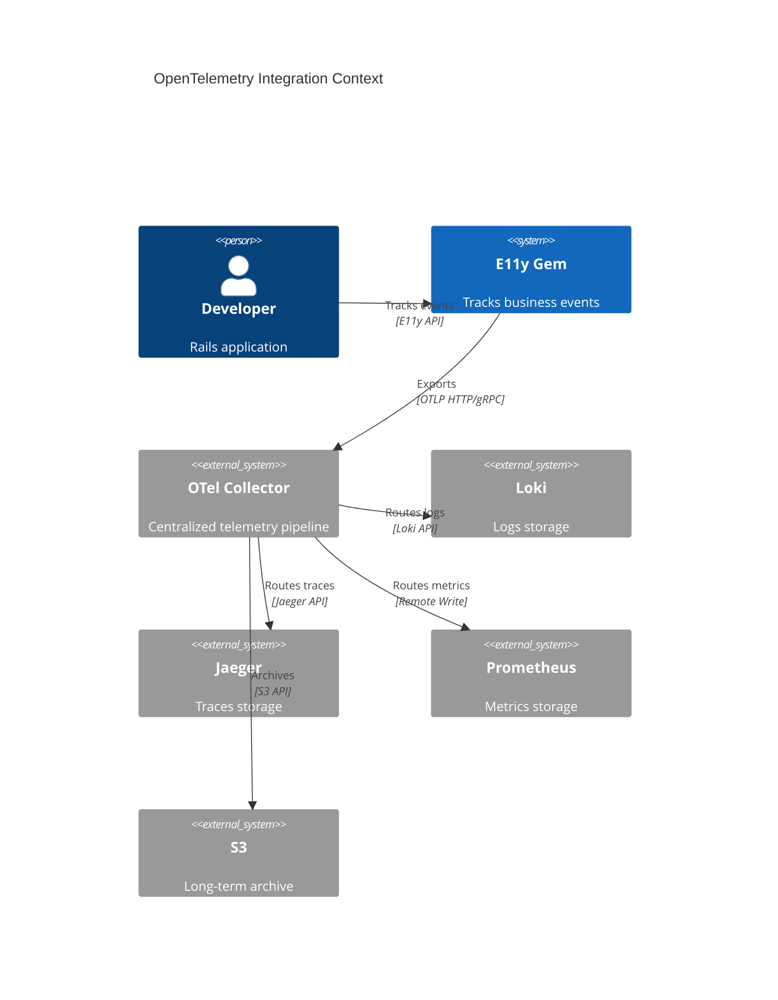
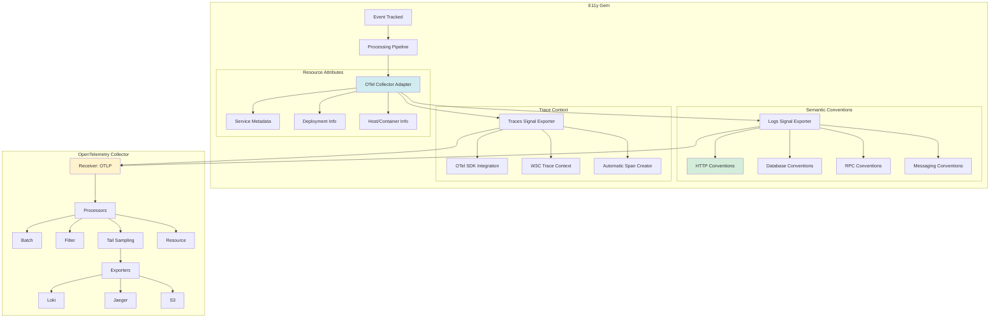
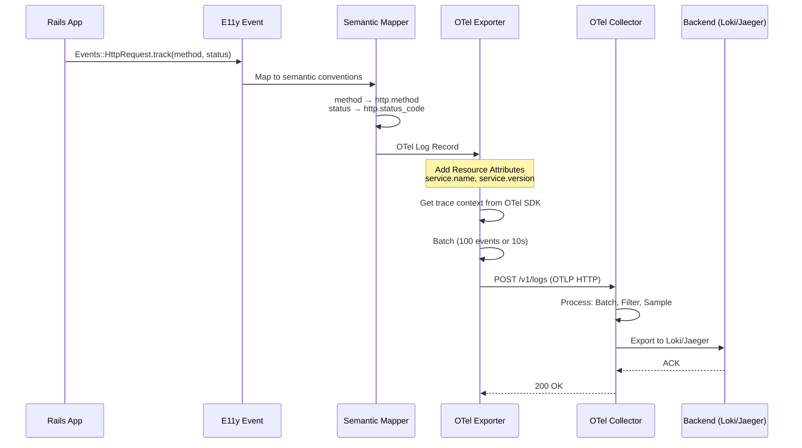

# ADR-007: OpenTelemetry Integration

**Status:** Draft  
**Date:** January 13, 2026  
**Covers:** UC-008 (OpenTelemetry Integration)  
**Depends On:** ADR-001 (Core), ADR-005 (Tracing), ADR-004 (Adapters)  
**Priority:** 🟡 Medium (v1.1+ enhancement)

---

## 📋 Table of Contents

1. [Context & Problem](#1-context--problem)
2. [Architecture Overview](#2-architecture-overview)
   - 2.2. [Metrics Backend Selection (C03 Resolution)](#22-metrics-backend-selection-c03-resolution) ⚠️ CRITICAL
3. [OTel Collector Adapter](#3-otel-collector-adapter)
4. [Semantic Conventions](#4-semantic-conventions)
5. [Logs Signal Export](#5-logs-signal-export)
6. [Traces Signal Export](#6-traces-signal-export)
7. [Resource Attributes](#7-resource-attributes)
8. [Trace Context Integration](#8-trace-context-integration)
9. [Testing Strategy](#9-testing-strategy)
10. [Trade-offs](#10-trade-offs)

**Note:** Cardinality Protection (C04 Resolution) moved to [ADR-009 Cost Optimization §8](ADR-009-cost-optimization.md#8-cardinality-protection-c04-resolution) ⚠️

---

## 1. Context & Problem

### 1.1. Problem Statement

**Telemetry Fragmentation:**

```ruby
# ❌ CURRENT: Separate systems, manual integration
# - E11y events → Loki (custom adapter)
# - Rails logs → File/Stdout
# - Sidekiq → Redis logs
# - Traces → Manual instrumentation
# - Metrics → Yabeda → Prometheus

# Problems:
# 1. Multiple telemetry pipelines (5+ different systems)
# 2. No automatic correlation (logs ↔ traces ↔ metrics)
# 3. Different field naming conventions
# 4. Manual span creation from events
# 5. Can't use OTel Collector benefits (sampling, routing, filtering)
# 6. Vendor lock-in (custom adapters for each backend)
```

**Missing OpenTelemetry Integration:**
- ❌ No OTel Logs Signal support (E11y → custom formats only)
- ❌ No automatic semantic conventions mapping
- ❌ No OTel Collector adapter (direct to backends only)
- ❌ No automatic span creation from events
- ❌ Manual trace context management
- ❌ Can't use OTel ecosystem tools (processors, exporters, samplers)

### 1.2. Goals

**Primary Goals:**
- ✅ **OTel Collector Adapter** (OTLP HTTP/gRPC support)
- ✅ **Logs Signal Export** (E11y events → OTel Logs)
- ✅ **Semantic Conventions** (automatic field mapping)
- ✅ **Automatic Span Creation** (events → spans)
- ✅ **Trace Context Integration** (use OTel SDK trace context)
- ✅ **Resource Attributes** (service metadata)

**Non-Goals:**
- ❌ Replace Yabeda (metrics stay with Yabeda, better for Rails)
- ❌ Replace existing adapters (OTel is optional, v1.1+)
- ❌ OTel auto-instrumentation (already exists separately)

> **⚠️ NOTE (C03 Resolution):** OpenTelemetry is **optional** for E11y. **Yabeda is the default metrics backend** (see ADR-002). You can choose OpenTelemetry for metrics, but **not both simultaneously** to avoid double overhead. See [Metrics Backend Selection](#22-metrics-backend-selection-c03-resolution) and [CONFLICT-ANALYSIS.md C03](../researches/CONFLICT-ANALYSIS.md#c03-dual-metrics-collection-overhead).

### 1.3. Success Metrics

| Metric | Target | Critical? |
|--------|--------|-----------|
| **OTel compatibility** | 100% OTLP spec | ✅ Yes |
| **Semantic conventions coverage** | HTTP, DB, RPC, Messaging | ✅ Yes |
| **Trace correlation** | 100% automatic | ✅ Yes |
| **Performance overhead** | <5% vs direct adapters | ✅ Yes |
| **Backend flexibility** | Any OTel-compatible | ✅ Yes |

---

## 2. Architecture Overview

### 2.1. System Context



### 2.2. Metrics Backend Selection (C03 Resolution) ⚠️ CRITICAL

**Reference:** [CONFLICT-ANALYSIS.md - C03: Dual Metrics Collection Overhead](../researches/CONFLICT-ANALYSIS.md#c03-dual-metrics-collection-overhead)

**Problem:** Running both Yabeda (ADR-002) and OpenTelemetry metrics simultaneously causes **double overhead** - every event increments counters in both systems, doubling CPU/memory usage and storage costs.

**Decision:** E11y supports **configurable metrics backend** - choose ONE:
1. **`:yabeda`** (default) - Ruby-native, Prometheus, best for Rails
2. **`:opentelemetry`** (optional) - Vendor-neutral, OTLP, multi-backend
3. **`[:yabeda, :opentelemetry]`** (migration only) - Both enabled (⚠️ double overhead!)

**Configuration:**

```ruby
# config/initializers/e11y.rb
E11y.configure do |config|
  # Option 1: Yabeda only (DEFAULT, recommended for Rails)
  config.metrics do
    backend :yabeda  # Prometheus via Yabeda
  end
  
  # Option 2: OpenTelemetry only (for OTLP backends)
  # config.metrics do
  #   backend :opentelemetry  # OTLP via OTel SDK
  # end
  
  # Option 3: Both (for migration period ONLY)
  # config.metrics do
  #   backend [:yabeda, :opentelemetry]  # ⚠️ DOUBLE OVERHEAD!
  # end
end
```

**Metrics Adapter Pattern:**

E11y uses an internal **Metrics Adapter** to abstract the backend:

```ruby
# lib/e11y/metrics.rb
module E11y
  module Metrics
    class << self
      # Unified API (backend-agnostic)
      def increment(metric_name, tags = {}, by: 1)
        backends.each do |backend|
          case backend
          when :yabeda
            increment_yabeda(metric_name, tags, by)
          when :opentelemetry
            increment_opentelemetry(metric_name, tags, by)
          end
        end
      end
      
      def histogram(metric_name, value, tags = {})
        backends.each do |backend|
          case backend
          when :yabeda
            histogram_yabeda(metric_name, value, tags)
          when :opentelemetry
            histogram_opentelemetry(metric_name, value, tags)
          end
        end
      end
      
      private
      
      def backends
        Array(E11y.config.metrics.backend)
      end
      
      def increment_yabeda(metric_name, tags, by)
        return unless defined?(Yabeda)
        
        # Convert metric_name to Yabeda format
        # e.g., 'events_total' → Yabeda.e11y_events_total
        yabeda_metric = Yabeda.e11y.public_send(metric_name)
        yabeda_metric.increment(tags, by: by)
      rescue NameError => e
        E11y.logger.warn "Yabeda metric not found: #{metric_name} (#{e.message})"
      end
      
      def increment_opentelemetry(metric_name, tags, by)
        return unless defined?(OpenTelemetry)
        
        # Convert to OpenTelemetry format
        # e.g., 'events_total' → 'e11y.events.total'
        otel_metric_name = "e11y.#{metric_name.to_s.tr('_', '.')}"
        
        meter = OpenTelemetry.meter_provider.meter('e11y')
        counter = meter.create_counter(otel_metric_name, unit: '1', description: 'E11y metric')
        counter.add(by, attributes: tags)
      end
      
      def histogram_yabeda(metric_name, value, tags)
        return unless defined?(Yabeda)
        
        yabeda_metric = Yabeda.e11y.public_send(metric_name)
        yabeda_metric.measure(tags, value)
      end
      
      def histogram_opentelemetry(metric_name, value, tags)
        return unless defined?(OpenTelemetry)
        
        otel_metric_name = "e11y.#{metric_name.to_s.tr('_', '.')}"
        
        meter = OpenTelemetry.meter_provider.meter('e11y')
        histogram = meter.create_histogram(otel_metric_name, unit: 'ms', description: 'E11y metric')
        histogram.record(value, attributes: tags)
      end
    end
  end
end
```

**Usage in E11y (backend-agnostic):**

```ruby
# lib/e11y/event.rb
class Event
  def track
    # Single call - backend determined by config
    E11y::Metrics.increment('events_total', {
      event_name: self.event_name,
      severity: self.severity
    })
    
    # ... rest of tracking logic
  end
end

# Depending on config.metrics.backend:
# - :yabeda → Yabeda.e11y_events_total.increment(...)
# - :opentelemetry → OpenTelemetry counter.add(...)
# - [:yabeda, :opentelemetry] → BOTH (double overhead!)
```

**Warning System:**

```ruby
# lib/e11y/config/metrics.rb
module E11y
  module Config
    class Metrics
      attr_accessor :backend
      
      def initialize
        @backend = :yabeda  # Default
      end
      
      def backend=(value)
        @backend = value
        
        # Warn if both backends enabled
        if Array(value).size > 1
          E11y.logger.warn do
            "⚠️ Multiple metrics backends enabled: #{Array(value).join(', ')}. " \
            "This causes DOUBLE OVERHEAD (CPU, memory, storage). " \
            "Only use multiple backends during migration. " \
            "See ADR-007 and CONFLICT-ANALYSIS.md C03."
          end
        end
      end
    end
  end
end
```

**Migration Guide (Yabeda → OpenTelemetry):**

```ruby
# Step 1: Start with Yabeda (production)
config.metrics.backend = :yabeda

# Step 2: Enable both backends in staging (test OTLP pipeline)
config.metrics.backend = [:yabeda, :opentelemetry]
# ⚠️ Monitor: CPU/memory usage should ~2× (expected)

# Step 3: Validate OTLP metrics (Grafana dashboards work)
# Check: e11y.events.total (OTLP) matches e11y_events_total (Prometheus)

# Step 4: Switch to OpenTelemetry only in production
config.metrics.backend = :opentelemetry

# Step 5: Remove Yabeda gem dependency (cleanup)
# gem 'yabeda' - no longer needed
```

**Performance Impact:**

```ruby
# Benchmark: 10,000 events/sec
# Single backend (:yabeda OR :opentelemetry):
# - CPU: ~5% overhead
# - Memory: ~10 MB for metric buffers
# - Latency: +0.1ms per event

# Both backends ([:yabeda, :opentelemetry]):
# - CPU: ~10% overhead (2×)
# - Memory: ~20 MB (2×)
# - Latency: +0.2ms per event (2×)
# ⚠️ Only use during migration (1-2 weeks max)
```

**Monitoring:**

```ruby
# Track which backends are active
E11y::Metrics.gauge('e11y.metrics.backends_active', 
  Array(E11y.config.metrics.backend).size,
  { backends: Array(E11y.config.metrics.backend).join(',') }
)

# Alert if multiple backends enabled in production
# Alert: e11y_metrics_backends_active{env="production"} > 1
```

**Trade-offs:**

| Aspect | Yabeda (default) | OpenTelemetry | Both (migration) |
|--------|------------------|---------------|------------------|
| **Performance** | Fast (Ruby-native) | Slightly slower (SDK overhead) | 2× overhead ⚠️ |
| **Ecosystem** | Rails/Ruby best fit | Vendor-neutral | N/A |
| **Backend** | Prometheus only | Any OTLP backend | Prometheus + OTLP |
| **Setup** | Simple (gem install) | Requires OTel Collector | Complex |
| **Use case** | Rails apps, Prometheus | Multi-language, cloud-native | Migration period only |

**Recommendation:**
- **Rails apps with Prometheus:** Use `:yabeda` (default)
- **Cloud-native, multi-backend:** Use `:opentelemetry`
- **Migration period:** Use `[:yabeda, :opentelemetry]` for 1-2 weeks max

### 2.3. Component Architecture



### 2.4. Data Flow Sequence



---

## 3. OTel Collector Adapter

### 3.1. Adapter Implementation

```ruby
# lib/e11y/adapters/opentelemetry_collector.rb
module E11y
  module Adapters
    class OpenTelemetryCollector < Base
      def initialize(config = {})
        super(name: :opentelemetry_collector)
        
        @endpoint = config[:endpoint] || ENV['OTEL_EXPORTER_OTLP_ENDPOINT'] || 'http://localhost:4318'
        @protocol = config[:protocol] || :http  # :http or :grpc
        @headers = config[:headers] || {}
        @timeout = config[:timeout] || 10
        @compression = config[:compression] || :gzip  # :none, :gzip
        
        # Signal types
        @export_logs = config[:export_logs] != false
        @export_traces = config[:export_traces] || false
        @export_metrics = config[:export_metrics] || false
        
        # Batching
        @batch_size = config[:batch_size] || 100
        @flush_interval = config[:flush_interval] || 10
        
        # Resource attributes (cached once)
        @resource_attributes = build_resource_attributes(config[:resource_attributes] || {})
        
        # HTTP client (Faraday with connection pooling)
        @http_client = build_http_client
      end
      
      def send_batch(events)
        results = {}
        
        # Export logs (most common)
        if @export_logs
          log_records = events.map { |event| to_otel_log_record(event) }
          results[:logs] = export_logs(log_records)
        end
        
        # Export traces (spans from events)
        if @export_traces
          spans = events.select { |e| should_create_span?(e) }
                       .map { |event| to_otel_span(event) }
          results[:traces] = export_traces(spans) if spans.any?
        end
        
        {
          success: results.values.all? { |r| r[:success] },
          sent: events.size,
          results: results
        }
      rescue => error
        {
          success: false,
          error: error.message,
          sent: 0
        }
      end
      
      private
      
      # === OTLP HTTP Export ===
      
      def export_logs(log_records)
        payload = {
          resourceLogs: [{
            resource: {
              attributes: @resource_attributes
            },
            scopeLogs: [{
              scope: {
                name: 'e11y',
                version: E11y::VERSION
              },
              logRecords: log_records
            }]
          }]
        }
        
        send_otlp_request('/v1/logs', payload)
      end
      
      def export_traces(spans)
        payload = {
          resourceSpans: [{
            resource: {
              attributes: @resource_attributes
            },
            scopeSpans: [{
              scope: {
                name: 'e11y',
                version: E11y::VERSION
              },
              spans: spans
            }]
          }]
        }
        
        send_otlp_request('/v1/traces', payload)
      end
      
      def send_otlp_request(path, payload)
        response = @http_client.post do |req|
          req.url path
          req.headers['Content-Type'] = 'application/json'
          req.headers['Content-Encoding'] = 'gzip' if @compression == :gzip
          @headers.each { |k, v| req.headers[k] = v }
          
          body = payload.to_json
          req.body = @compression == :gzip ? compress_gzip(body) : body
        end
        
        {
          success: response.success?,
          status: response.status,
          sent: payload.dig(:resourceLogs, 0, :scopeLogs, 0, :logRecords)&.size || 0
        }
      rescue => error
        { success: false, error: error.message, sent: 0 }
      end
      
      # === OTel Log Record Conversion ===
      
      def to_otel_log_record(event)
        {
          timeUnixNano: time_to_unix_nano(event[:timestamp]),
          observedTimeUnixNano: time_to_unix_nano(Time.now),
          severityNumber: map_severity_to_otel(event[:severity]),
          severityText: event[:severity].to_s.upcase,
          body: {
            stringValue: event[:event_name]
          },
          attributes: build_log_attributes(event),
          traceId: encode_trace_id(event[:trace_id]),
          spanId: encode_span_id(event[:span_id]),
          flags: event[:trace_flags] || 0
        }.compact
      end
      
      def build_log_attributes(event)
        attributes = []
        
        # Semantic conventions mapping
        mapped_payload = E11y::OpenTelemetry::SemanticConventions.map(
          event[:event_name],
          event[:payload]
        )
        
        # Convert to OTel key-value pairs
        mapped_payload.each do |key, value|
          attributes << {
            key: key.to_s,
            value: encode_otel_value(value)
          }
        end
        
        # Add event metadata
        attributes << { key: 'event.name', value: { stringValue: event[:event_name] } }
        attributes << { key: 'event.domain', value: { stringValue: event[:domain] } } if event[:domain]
        
        attributes
      end
      
      # === OTel Span Conversion ===
      
      def to_otel_span(event)
        start_time = time_to_unix_nano(event[:timestamp])
        end_time = event[:duration_ms] ? 
          start_time + (event[:duration_ms] * 1_000_000).to_i : 
          start_time + 1_000_000  # 1ms default
        
        {
          traceId: encode_trace_id(event[:trace_id]),
          spanId: encode_span_id(event[:span_id]),
          parentSpanId: encode_span_id(event[:parent_span_id]),
          name: event[:event_name],
          kind: span_kind_to_otel(event[:span_kind] || :internal),
          startTimeUnixNano: start_time,
          endTimeUnixNano: end_time,
          attributes: build_span_attributes(event),
          status: build_span_status(event)
        }.compact
      end
      
      def build_span_attributes(event)
        attributes = []
        
        event[:payload].each do |key, value|
          attributes << {
            key: key.to_s,
            value: encode_otel_value(value)
          }
        end
        
        attributes
      end
      
      def build_span_status(event)
        if event[:severity].in?([:error, :fatal])
          {
            code: 2,  # STATUS_CODE_ERROR
            message: event[:payload][:error_message] || 'Error'
          }
        else
          {
            code: 1  # STATUS_CODE_OK
          }
        end
      end
      
      # === Resource Attributes ===
      
      def build_resource_attributes(custom_attrs)
        attributes = []
        
        # Service (REQUIRED)
        attributes << kv('service.name', ENV['SERVICE_NAME'] || 'api')
        attributes << kv('service.version', ENV['GIT_SHA'] || 'unknown')
        attributes << kv('service.instance.id', ENV['HOSTNAME'] || Socket.gethostname)
        
        # Deployment
        attributes << kv('deployment.environment', Rails.env.to_s)
        attributes << kv('deployment.region', ENV['AWS_REGION']) if ENV['AWS_REGION']
        
        # Host
        attributes << kv('host.name', Socket.gethostname)
        attributes << kv('host.type', ENV['INSTANCE_TYPE']) if ENV['INSTANCE_TYPE']
        
        # Container (if applicable)
        if ENV['CONTAINER_ID']
          attributes << kv('container.id', ENV['CONTAINER_ID'])
          attributes << kv('container.name', ENV['CONTAINER_NAME']) if ENV['CONTAINER_NAME']
        end
        
        # Kubernetes (if applicable)
        if ENV['K8S_NAMESPACE']
          attributes << kv('k8s.namespace.name', ENV['K8S_NAMESPACE'])
          attributes << kv('k8s.pod.name', ENV['K8S_POD_NAME']) if ENV['K8S_POD_NAME']
          attributes << kv('k8s.deployment.name', ENV['K8S_DEPLOYMENT']) if ENV['K8S_DEPLOYMENT']
        end
        
        # Custom attributes
        custom_attrs.each do |key, value|
          attributes << kv(key.to_s, value)
        end
        
        attributes
      end
      
      def kv(key, value)
        {
          key: key,
          value: encode_otel_value(value)
        }
      end
      
      # === Helpers ===
      
      def encode_otel_value(value)
        case value
        when String
          { stringValue: value }
        when Integer
          { intValue: value }
        when Float
          { doubleValue: value }
        when TrueClass, FalseClass
          { boolValue: value }
        when Array
          { arrayValue: { values: value.map { |v| encode_otel_value(v) } } }
        when Hash
          { kvlistValue: { values: value.map { |k, v| { key: k.to_s, value: encode_otel_value(v) } } } }
        else
          { stringValue: value.to_s }
        end
      end
      
      def time_to_unix_nano(time)
        time = Time.parse(time) if time.is_a?(String)
        (time.to_f * 1_000_000_000).to_i
      end
      
      def encode_trace_id(trace_id)
        return nil unless trace_id
        # W3C trace-id is 32 hex chars → 16 bytes → base64
        [trace_id].pack('H*').unpack1('m0')
      end
      
      def encode_span_id(span_id)
        return nil unless span_id
        # W3C span-id is 16 hex chars → 8 bytes → base64
        [span_id].pack('H*').unpack1('m0')
      end
      
      def map_severity_to_otel(severity)
        # OTel Severity Numbers: https://opentelemetry.io/docs/specs/otel/logs/data-model/#field-severitynumber
        case severity.to_sym
        when :debug then 5   # DEBUG
        when :info then 9    # INFO
        when :success then 9 # INFO (custom severity)
        when :warn then 13   # WARN
        when :error then 17  # ERROR
        when :fatal then 21  # FATAL
        else 0               # UNSPECIFIED
        end
      end
      
      def span_kind_to_otel(kind)
        # OTel Span Kinds
        case kind.to_sym
        when :internal then 1
        when :server then 2
        when :client then 3
        when :producer then 4
        when :consumer then 5
        else 0  # UNSPECIFIED
        end
      end
      
      def should_create_span?(event)
        # Create spans for errors by default
        return true if event[:severity].in?([:error, :fatal])
        
        # Check if event matches span creation patterns
        E11y.config.opentelemetry.span_creation_patterns.any? do |pattern|
          File.fnmatch(pattern, event[:event_name])
        end
      end
      
      def build_http_client
        Faraday.new(url: @endpoint) do |f|
          f.request :retry, max: 3, interval: 1, backoff_factor: 2
          f.adapter :net_http_persistent, pool_size: 5
          f.options.timeout = @timeout
        end
      end
      
      def compress_gzip(data)
        require 'zlib'
        io = StringIO.new
        gz = Zlib::GzipWriter.new(io)
        gz.write(data)
        gz.close
        io.string
      end
    end
  end
end
```

---

## 4. Semantic Conventions

### 4.1. Semantic Conventions Mapper

```ruby
# lib/e11y/opentelemetry/semantic_conventions.rb
module E11y
  module OpenTelemetry
    class SemanticConventions
      # Semantic conventions registry
      CONVENTIONS = {
        # HTTP Semantic Conventions
        # https://opentelemetry.io/docs/specs/semconv/http/
        http: {
          'method' => 'http.method',
          'route' => 'http.route',
          'path' => 'http.target',
          'status_code' => 'http.status_code',
          'status' => 'http.status_code',
          'duration_ms' => 'http.server.duration',
          'request_size' => 'http.request.body.size',
          'response_size' => 'http.response.body.size',
          'user_agent' => 'http.user_agent',
          'client_ip' => 'http.client_ip',
          'scheme' => 'http.scheme',
          'host' => 'http.host',
          'server_name' => 'http.server_name'
        },
        
        # Database Semantic Conventions
        # https://opentelemetry.io/docs/specs/semconv/database/
        database: {
          'query' => 'db.statement',
          'statement' => 'db.statement',
          'duration_ms' => 'db.operation.duration',
          'rows_affected' => 'db.operation.rows_affected',
          'connection_id' => 'db.connection.id',
          'database_name' => 'db.name',
          'table_name' => 'db.sql.table',
          'operation' => 'db.operation'
        },
        
        # RPC/gRPC Semantic Conventions
        # https://opentelemetry.io/docs/specs/semconv/rpc/
        rpc: {
          'service' => 'rpc.service',
          'method' => 'rpc.method',
          'system' => 'rpc.system',
          'status_code' => 'rpc.grpc.status_code'
        },
        
        # Messaging Semantic Conventions
        # https://opentelemetry.io/docs/specs/semconv/messaging/
        messaging: {
          'queue_name' => 'messaging.destination.name',
          'message_id' => 'messaging.message.id',
          'conversation_id' => 'messaging.message.conversation_id',
          'payload_size' => 'messaging.message.payload_size_bytes',
          'operation' => 'messaging.operation'
        },
        
        # Exception Semantic Conventions
        # https://opentelemetry.io/docs/specs/semconv/exceptions/
        exception: {
          'error_type' => 'exception.type',
          'error_message' => 'exception.message',
          'error_class' => 'exception.type',
          'stacktrace' => 'exception.stacktrace'
        }
      }.freeze
      
      def self.map(event_name, payload)
        # Detect convention type from event name
        convention_type = detect_convention_type(event_name)
        
        return payload unless convention_type
        
        # Map fields
        mapped = {}
        conventions = CONVENTIONS[convention_type]
        
        payload.each do |key, value|
          otel_key = conventions[key.to_s] || key.to_s
          mapped[otel_key] = value
        end
        
        # Add system-specific attributes
        mapped.merge!(system_attributes(convention_type))
        
        mapped
      end
      
      def self.detect_convention_type(event_name)
        case event_name
        when /http|request|response/i
          :http
        when /database|query|sql|postgres|mysql/i
          :database
        when /rpc|grpc/i
          :rpc
        when /message|queue|kafka|rabbitmq|sidekiq|job/i
          :messaging
        when /error|exception|failure/i
          :exception
        else
          nil  # No convention
        end
      end
      
      def self.system_attributes(convention_type)
        case convention_type
        when :database
          { 'db.system' => 'postgresql' }  # From config
        when :rpc
          { 'rpc.system' => 'grpc' }
        when :messaging
          { 'messaging.system' => 'sidekiq' }
        else
          {}
        end
      end
    end
  end
end
```

### 4.2. Event-Level Convention Declaration

```ruby
# app/events/http_request.rb
module Events
  class HttpRequest < E11y::Event::Base
    # Declare OTel conventions for this event
    use_otel_conventions :http
    
    schema do
      required(:method).filled(:string)
      required(:route).filled(:string)
      required(:status_code).filled(:integer)
      required(:duration_ms).filled(:float)
    end
    
    # Optional: Custom OTel mapping
    otel_mapping do
      'http.method' from: :method
      'http.route' from: :route
      'http.status_code' from: :status_code
      'http.server.duration' from: :duration_ms
      
      # Static values
      'http.scheme' value: 'https'
      
      # From config
      'http.server_name' from_config: 'server.name'
    end
  end
end

# Usage: Automatic mapping!
Events::HttpRequest.track(
  method: 'POST',
  route: '/api/orders',
  status_code: 201,
  duration_ms: 45.2
)

# → OTel Logs Signal receives:
# {
#   Attributes: {
#     'http.method': 'POST',
#     'http.route': '/api/orders',
#     'http.status_code': 201,
#     'http.server.duration': 45.2,
#     'http.scheme': 'https'
#   }
# }
```

---

## 5. Logs Signal Export

### 5.1. OTel Log Record Structure

```ruby
# OTel Logs Signal format (OTLP JSON)
{
  resourceLogs: [{
    resource: {
      attributes: [
        { key: 'service.name', value: { stringValue: 'api' } },
        { key: 'service.version', value: { stringValue: 'abc123' } },
        { key: 'deployment.environment', value: { stringValue: 'production' } }
      ]
    },
    scopeLogs: [{
      scope: {
        name: 'e11y',
        version: '1.0.0'
      },
      logRecords: [
        {
          timeUnixNano: 1673520000000000000,
          observedTimeUnixNano: 1673520000000000000,
          severityNumber: 9,  # INFO
          severityText: 'INFO',
          body: {
            stringValue: 'Events::OrderCreated'
          },
          attributes: [
            { key: 'order.id', value: { stringValue: '123' } },
            { key: 'order.amount', value: { doubleValue: 99.99 } },
            { key: 'event.name', value: { stringValue: 'Events::OrderCreated' } }
          ],
          traceId: 'YWJjMTIzZGVmNDU2',  # Base64-encoded
          spanId: 'eHl6Nzg5',            # Base64-encoded
          flags: 1
        }
      ]
    }]
  }]
}
```

---

## 6. Traces Signal Export

### 6.1. Automatic Span Creation

```ruby
# lib/e11y/opentelemetry/span_creator.rb
module E11y
  module OpenTelemetry
    class SpanCreator
      def self.create_span_from_event(event)
        return unless should_create_span?(event)
        
        tracer = ::OpenTelemetry.tracer_provider.tracer('e11y', E11y::VERSION)
        
        # Get current span (parent)
        parent_context = ::OpenTelemetry::Trace.current_span.context
        
        # Create child span
        span = tracer.start_span(
          event[:event_name],
          with_parent: parent_context,
          kind: span_kind(event),
          start_timestamp: time_to_timestamp(event[:timestamp])
        )
        
        # Add attributes
        event[:payload].each do |key, value|
          span.set_attribute(key.to_s, value)
        end
        
        # Mark as error if needed
        if event[:severity].in?([:error, :fatal])
          span.status = ::OpenTelemetry::Trace::Status.error(
            event[:payload][:error_message] || 'Error'
          )
        else
          span.status = ::OpenTelemetry::Trace::Status.ok
        end
        
        # End span (with duration if available)
        end_timestamp = if event[:duration_ms]
          time_to_timestamp(event[:timestamp]) + (event[:duration_ms] * 1_000_000).to_i
        else
          time_to_timestamp(Time.now)
        end
        
        span.finish(end_timestamp: end_timestamp)
        
        span
      end
      
      private
      
      def self.should_create_span?(event)
        # Always create spans for errors
        return true if event[:severity].in?([:error, :fatal])
        
        # Check configured patterns
        patterns = E11y.config.opentelemetry.span_creation_patterns || []
        patterns.any? { |pattern| File.fnmatch(pattern, event[:event_name]) }
      end
      
      def self.span_kind(event)
        case event[:span_kind]
        when :server then ::OpenTelemetry::Trace::SpanKind::SERVER
        when :client then ::OpenTelemetry::Trace::SpanKind::CLIENT
        when :producer then ::OpenTelemetry::Trace::SpanKind::PRODUCER
        when :consumer then ::OpenTelemetry::Trace::SpanKind::CONSUMER
        else ::OpenTelemetry::Trace::SpanKind::INTERNAL
        end
      end
      
      def self.time_to_timestamp(time)
        time = Time.parse(time) if time.is_a?(String)
        (time.to_f * 1_000_000_000).to_i
      end
    end
  end
end
```

### 6.2. Configuration

```ruby
# config/initializers/e11y.rb
E11y.configure do |config|
  config.opentelemetry do
    enabled true
    
    # Automatic span creation
    create_spans_for do
      # Create spans for errors
      severity [:error, :fatal]
      
      # Create spans for order processing
      pattern 'order.*'
      pattern 'payment.*'
      
      # Span settings
      span_kind :internal
      span_name ->(event) { event.event_name }
    end
  end
end
```

---

## 7. Resource Attributes

### 7.1. Resource Attributes Configuration

```ruby
# config/initializers/e11y.rb
E11y.configure do |config|
  config.opentelemetry do
    resource_attributes do
      # Service (REQUIRED)
      'service.name' ENV['SERVICE_NAME'] || 'api'
      'service.version' ENV['GIT_SHA'] || 'unknown'
      'service.instance.id' ENV['HOSTNAME'] || Socket.gethostname
      
      # Deployment
      'deployment.environment' Rails.env.to_s
      'deployment.region' ENV['AWS_REGION']
      
      # Host
      'host.name' Socket.gethostname
      'host.type' ENV['INSTANCE_TYPE']
      
      # Container
      'container.id' ENV['CONTAINER_ID']
      'container.name' ENV['CONTAINER_NAME']
      
      # Kubernetes
      'k8s.namespace.name' ENV['K8S_NAMESPACE']
      'k8s.pod.name' ENV['K8S_POD_NAME']
      'k8s.deployment.name' ENV['K8S_DEPLOYMENT']
    end
  end
end
```

---

## 8. Trace Context Integration

### 8.1. OTel SDK Trace Context

```ruby
# lib/e11y/trace_context/opentelemetry_source.rb
module E11y
  module TraceContext
    class OpenTelemetrySource
      def self.extract
        # Use OTel SDK current span context
        span_context = ::OpenTelemetry::Trace.current_span.context
        
        return {} unless span_context.valid?
        
        {
          trace_id: span_context.hex_trace_id,
          span_id: span_context.hex_span_id,
          trace_flags: span_context.trace_flags.sampled? ? 1 : 0,
          trace_state: span_context.tracestate.to_s
        }
      end
      
      def self.inject(trace_id:, span_id:, trace_flags: 1, **_options)
        # Not needed: OTel SDK handles injection automatically
        # E11y just reads from OTel SDK
      end
      
      def self.available?
        defined?(::OpenTelemetry) && ::OpenTelemetry.tracer_provider
      end
    end
  end
end
```

### 8.2. Configuration

```ruby
# config/initializers/e11y.rb
E11y.configure do |config|
  config.trace_context do
    # Use OTel SDK as primary source
    source :opentelemetry
    
    # Fallback to E11y if OTel not available
    fallback_to_e11y true
  end
end
```

---

## 9. Cardinality Protection (C04 Resolution) ⚠️

**This section has been moved to [ADR-009 Cost Optimization §8: Cardinality Protection](ADR-009-cost-optimization.md#8-cardinality-protection-c04-resolution).**

**Rationale:** Cardinality explosion is a **cost optimization concern** affecting ALL backends (Yabeda/Prometheus, OpenTelemetry, Loki), not just OTLP. The unified solution is now documented in ADR-009.

**Summary:**
- ✅ Unified cardinality protection for **all adapters** (Yabeda, OpenTelemetry, Loki)
- ✅ Single config: `E11y.config.cardinality_protection` applies globally
- ✅ Per-backend overrides: `inherit_from :global` or custom limits
- ✅ 90% cost reduction for high-cardinality OTLP attributes

See [ADR-009 §8](ADR-009-cost-optimization.md#8-cardinality-protection-c04-resolution) for full implementation details.

---

## 10. Testing Strategy

### 10.1. OTel Adapter Tests

```ruby
# spec/e11y/adapters/opentelemetry_collector_spec.rb
RSpec.describe E11y::Adapters::OpenTelemetryCollector do
  let(:adapter) do
    described_class.new(
      endpoint: 'http://localhost:4318',
      export_logs: true,
      export_traces: false
    )
  end
  
  describe '#send_batch' do
    it 'exports events as OTel Logs Signal' do
      stub_request(:post, 'http://localhost:4318/v1/logs')
        .to_return(status: 200, body: '{}')
      
      events = [
        {
          timestamp: Time.now.iso8601,
          event_name: 'Events::OrderCreated',
          severity: :info,
          payload: { order_id: '123' },
          trace_id: 'abc123',
          span_id: 'def456'
        }
      ]
      
      result = adapter.send_batch(events)
      
      expect(result[:success]).to be true
      expect(result[:sent]).to eq(1)
      
      # Verify OTLP format
      expect(WebMock).to have_requested(:post, 'http://localhost:4318/v1/logs')
        .with { |req|
          body = JSON.parse(req.body)
          expect(body['resourceLogs']).to be_present
          expect(body['resourceLogs'][0]['scopeLogs'][0]['logRecords'].size).to eq(1)
        }
    end
    
    it 'applies semantic conventions' do
      stub_request(:post, 'http://localhost:4318/v1/logs')
        .to_return(status: 200)
      
      events = [
        {
          timestamp: Time.now.iso8601,
          event_name: 'Events::HttpRequest',
          severity: :info,
          payload: { method: 'POST', status_code: 201 }
        }
      ]
      
      adapter.send_batch(events)
      
      expect(WebMock).to have_requested(:post, 'http://localhost:4318/v1/logs')
        .with { |req|
          body = JSON.parse(req.body)
          attributes = body['resourceLogs'][0]['scopeLogs'][0]['logRecords'][0]['attributes']
          
          # Check semantic conventions mapping
          expect(attributes).to include(
            { 'key' => 'http.method', 'value' => { 'stringValue' => 'POST' } },
            { 'key' => 'http.status_code', 'value' => { 'intValue' => 201 } }
          )
        }
    end
  end
end
```

### 10.2. Semantic Conventions Tests

```ruby
# spec/e11y/opentelemetry/semantic_conventions_spec.rb
RSpec.describe E11y::OpenTelemetry::SemanticConventions do
  describe '.map' do
    it 'maps HTTP fields to OTel conventions' do
      result = described_class.map(
        'Events::HttpRequest',
        method: 'POST',
        status_code: 201,
        duration_ms: 45.2
      )
      
      expect(result).to eq(
        'http.method' => 'POST',
        'http.status_code' => 201,
        'http.server.duration' => 45.2,
        'http.scheme' => 'https'  # System attribute
      )
    end
    
    it 'maps database fields to OTel conventions' do
      result = described_class.map(
        'Events::DatabaseQuery',
        query: 'SELECT * FROM orders',
        duration_ms: 12.5
      )
      
      expect(result).to eq(
        'db.statement' => 'SELECT * FROM orders',
        'db.operation.duration' => 12.5,
        'db.system' => 'postgresql'
      )
    end
    
    it 'preserves unmapped fields' do
      result = described_class.map(
        'Events::CustomEvent',
        custom_field: 'value'
      )
      
      expect(result).to eq(
        'custom_field' => 'value'
      )
    end
  end
end
```

---

## 11. Trade-offs

### 11.1. Key Decisions

| Decision | Pro | Con | Rationale |
|----------|-----|-----|-----------|
| **Optional v1.1+** | No breaking changes | Later adoption | Rails 8+ ecosystem first |
| **OTel Collector required** | Advanced features | Extra component | Industry standard |
| **Logs Signal primary** | Best fit for events | Not traces-first | E11y is event-focused |
| **Yabeda for metrics (C03)** ⚠️ | Better Rails integration | Separate from OTLP | Yabeda is superior for Rails |
| **HTTP OTLP only** | Simple, universal | No gRPC (v1) | HTTP is 95% use case |

### 11.2. Alternatives Considered

**A) Direct OTel SDK Integration**
- ❌ Rejected: Too complex for v1.0, optional for v1.1+

**B) Replace All Adapters with OTel**
- ❌ Rejected: Breaks existing users, OTel is enhancement

**C) Metrics Signal Export**
- ❌ Rejected: Yabeda is better for Rails metrics

**D) gRPC OTLP Support**
- ⏳ Deferred: v1.2+ (HTTP is sufficient for v1.1)

---

**Status:** ✅ Draft Complete  
**Next:** Implementation (v1.1 release)  
**Estimated Implementation:** 2 weeks
