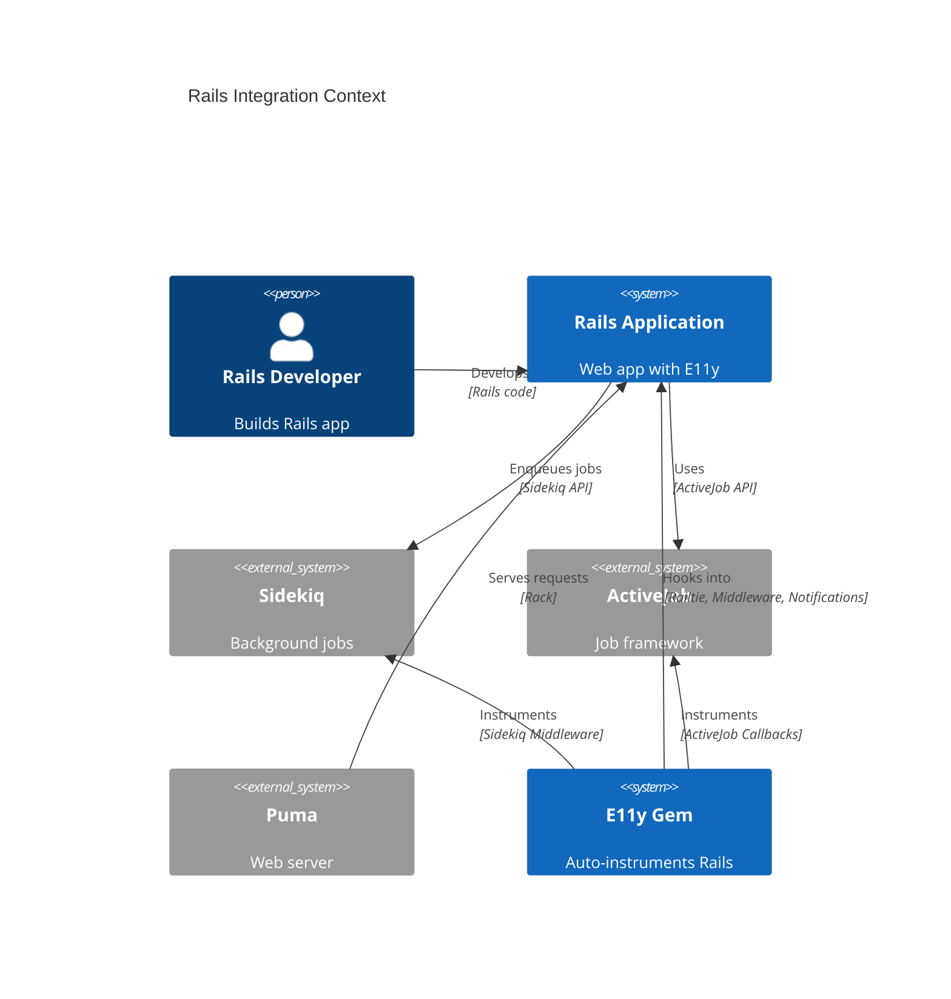
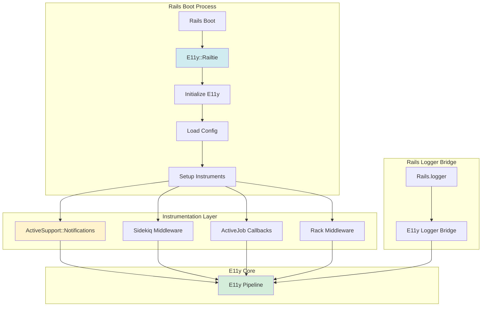
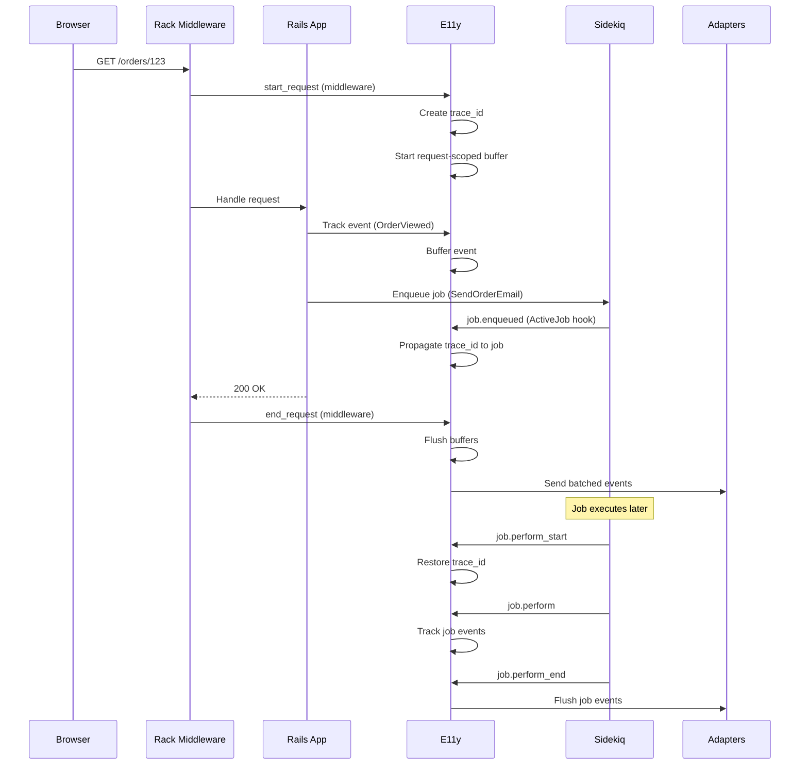
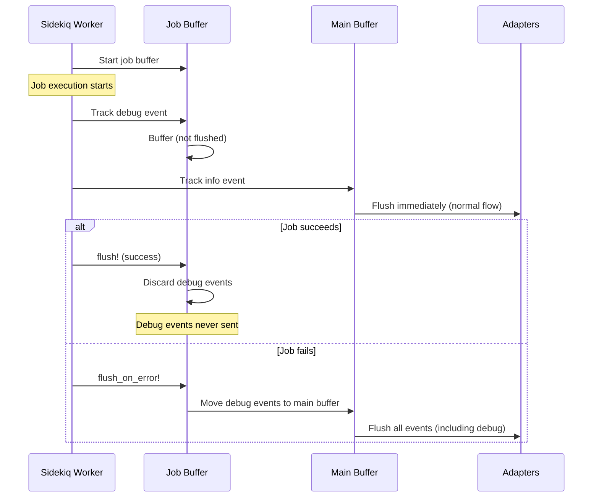
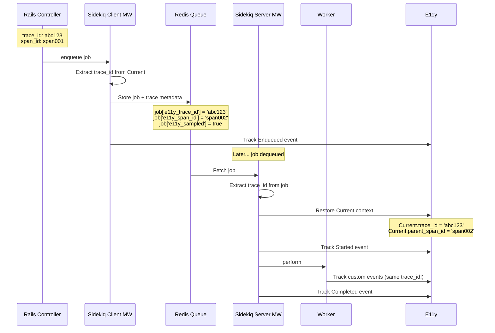
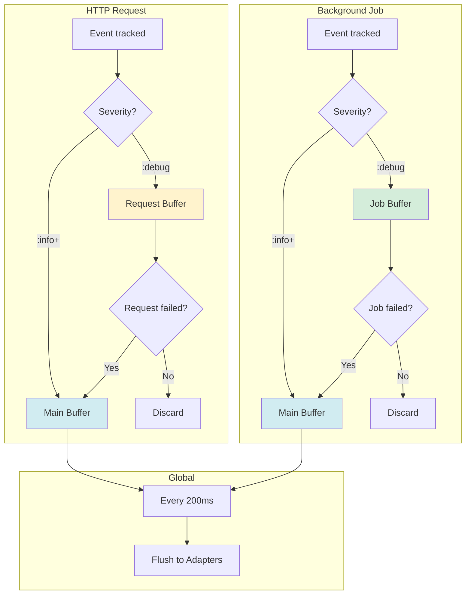

# ADR-008: Rails Integration

**Status:** Draft  
**Date:** January 12, 2026  
**Covers:** UC-010 (Background Job Tracking), UC-016 (Rails Logger Migration)  
**Depends On:** ADR-001 (Core), ADR-004 (Adapters), ADR-006 (Security)

---

## 📋 Table of Contents

1. [Context & Problem](#1-context--problem)
2. [Architecture Overview](#2-architecture-overview)
3. [Railtie & Initialization](#3-railtie--initialization)
4. [ActiveSupport::Notifications Integration](#4-activesupportnotifications-integration)
5. [Sidekiq Integration](#5-sidekiq-integration)
6. [ActiveJob Integration](#6-activejob-integration)
7. [Rails.logger Migration](#7-railslogger-migration)
8. [Middleware Integration](#8-middleware-integration)
9. [Console & Development](#9-console--development)
10. [Testing in Rails](#10-testing-in-rails)
11. [Trade-offs](#11-trade-offs)

---

## 1. Context & Problem

### 1.1. Problem Statement

**Current Pain Points:**

1. **Manual Instrumentation:**
   ```ruby
   # ❌ Manual tracking everywhere
   def create
     Events::OrderCreated.track(order_id: order.id)
     order.save
   end
   ```

2. **No Rails Integration:**
   - Can't leverage ActiveSupport::Notifications
   - No automatic Sidekiq/ActiveJob tracking
   - No Rails.logger compatibility

3. **Complex Setup:**
   ```ruby
   # ❌ Boilerplate in every Rails app
   config/initializers/e11y.rb  # Manual setup
   app/events/...               # Manual event definitions
   config/environments/*.rb     # Environment-specific config
   ```

### 1.2. Goals

**Primary Goals:**
- ✅ Zero-config Rails integration via Railtie
- ✅ Auto-instrument Sidekiq & ActiveJob
- ✅ Bidirectional ActiveSupport::Notifications
- ✅ Drop-in Rails.logger replacement
- ✅ Development-friendly (console, debugging)

**Non-Goals:**
- ❌ Support non-Rails Ruby apps (Rails 8.0+ only)
- ❌ Backwards compatibility with Rails < 8.0
- ❌ Auto-instrument every possible gem

### 1.3. Success Metrics

| Metric | Target | Critical? |
|--------|--------|-----------|
| **Setup time** | <5 minutes | ✅ Yes |
| **Auto-instrumentation coverage** | >80% Rails events | ✅ Yes |
| **Performance overhead** | <5% | ✅ Yes |
| **Rails.logger compatibility** | 100% | ✅ Yes |

---

## 2. Architecture Overview

### 2.1. System Context



### 2.2. Component Architecture



### 2.3. Request Lifecycle



---

## 3. Railtie & Initialization

### 3.1. Railtie Implementation

```ruby
# lib/e11y/railtie.rb
module E11y
  class Railtie < Rails::Railtie
    # Run before framework initialization
    config.before_initialize do
      # Set up basic configuration
      E11y.configure do |config|
        config.environment = Rails.env
        config.service_name = Rails.application.class.module_parent_name.underscore
      end
    end
    
    # Run after framework initialization
    config.after_initialize do
      next unless E11y.config.enabled
      
      # Setup instruments (each can be enabled/disabled separately)
      if E11y.config.instruments.active_support_notifications.enabled
        E11y::Instruments::ActiveSupportNotifications.setup!
      end
      
      if E11y.config.instruments.sidekiq.enabled
        E11y::Instruments::Sidekiq.setup!
      end
      
      if E11y.config.instruments.active_job.enabled
        E11y::Instruments::ActiveJob.setup!
      end
      
      if E11y.config.instruments.rack_middleware.enabled
        E11y::Instruments::RackMiddleware.setup!
      end
      
      # Setup logger bridge
      E11y::Logger::Bridge.setup! if E11y.config.logger_bridge.enabled
      
      # Setup development tools
      E11y::Console.setup! if Rails.env.development?
    end
    
    # Middleware insertion
    initializer 'e11y.middleware' do |app|
      app.middleware.insert_before(
        Rails::Rack::Logger,
        E11y::Middleware::Request
      )
    end
    
    # ActiveSupport::Notifications subscribers
    initializer 'e11y.notifications' do
      ActiveSupport::Notifications.subscribe(/.*/) do |name, start, finish, id, payload|
        E11y::Instruments::NotificationSubscriber.handle(
          name: name,
          started_at: start,
          finished_at: finish,
          transaction_id: id,
          payload: payload
        )
      end
    end
    
    # Sidekiq integration
    initializer 'e11y.sidekiq' do
      if defined?(Sidekiq)
        require 'e11y/instruments/sidekiq'
        
        Sidekiq.configure_server do |config|
          config.server_middleware do |chain|
            chain.add E11y::Instruments::Sidekiq::ServerMiddleware
          end
        end
        
        Sidekiq.configure_client do |config|
          config.client_middleware do |chain|
            chain.add E11y::Instruments::Sidekiq::ClientMiddleware
          end
        end
      end
    end
    
    # ActiveJob integration
    initializer 'e11y.active_job' do
      ActiveSupport.on_load(:active_job) do
        require 'e11y/instruments/active_job'
        
        include E11y::Instruments::ActiveJob::Callbacks
      end
    end
    
    # Console helpers
    console do
      E11y::Console.enable!
      
      puts "E11y loaded. Try: E11y.stats"
    end
    
    # Rake task helpers
    rake_tasks do
      load 'e11y/tasks.rake'
    end
  end
end
```

### 3.2. Configuration Loading

```ruby
# lib/e11y/configuration/rails.rb
module E11y
  module Configuration
    class Rails < Base
      def initialize
        super
        
        # Rails-specific defaults
        @environment = ::Rails.env
        @service_name = derive_service_name
        @enabled = !::Rails.env.test?  # Disabled in tests by default
        
        # Auto-detect adapters
        @adapters = auto_detect_adapters
        
        # Rails logger bridge
        @logger_bridge = LoggerBridgeConfig.new
      end
      
      private
      
      def derive_service_name
        ::Rails.application.class.module_parent_name.underscore
      rescue
        'rails_app'
      end
      
      def auto_detect_adapters
        adapters = []
        
        # Always include stdout in development
        adapters << :stdout if ::Rails.env.development?
        
        # Auto-detect file logging
        adapters << :file if ::Rails.root.join('log').directory?
        
        # Auto-detect Sentry
        adapters << :sentry if defined?(Sentry)
        
        # Auto-detect Loki
        adapters << :loki if ENV['LOKI_URL'].present?
        
        adapters
      end
    end
  end
end
```

---

## 4. ActiveSupport::Notifications Integration

### 4.1. Bidirectional Bridge

**Design Decision:** E11y events → ASN, ASN events → E11y.

```ruby
# lib/e11y/instruments/notifications_bridge.rb
module E11y
  module Instruments
    class NotificationsBridge
      # E11y → ActiveSupport::Notifications
      def self.publish_to_asn(event_data)
        ActiveSupport::Notifications.instrument(
          event_data[:event_name],
          event_data[:payload].merge(
            trace_id: event_data[:trace_id],
            severity: event_data[:severity]
          )
        )
      end
      
      # ActiveSupport::Notifications → E11y
      def self.subscribe_from_asn
        # Map important Rails events to E11y events
        RAILS_EVENT_MAPPING.each do |asn_pattern, e11y_event_class|
          ActiveSupport::Notifications.subscribe(asn_pattern) do |name, start, finish, id, payload|
            duration = (finish - start) * 1000  # Convert to ms
            
            e11y_event_class.track(
              event_name: name,
              duration: duration,
              **extract_relevant_payload(payload)
            )
          end
        end
      end
      
      # Built-in event mappings (can be overridden in config)
      DEFAULT_RAILS_EVENT_MAPPING = {
        'sql.active_record' => Events::Rails::Database::Query,
        'process_action.action_controller' => Events::Rails::Http::Request,
        'render_template.action_view' => Events::Rails::View::Render,
        'send_file.action_controller' => Events::Rails::Http::SendFile,
        'redirect_to.action_controller' => Events::Rails::Http::Redirect,
        'start_processing.action_controller' => Events::Rails::Http::StartProcessing,
        'cache_read.active_support' => Events::Rails::Cache::Read,
        'cache_write.active_support' => Events::Rails::Cache::Write,
        'cache_delete.active_support' => Events::Rails::Cache::Delete,
        'enqueue.active_job' => Events::Rails::Job::Enqueued,
        'enqueue_at.active_job' => Events::Rails::Job::Scheduled,
        'perform_start.active_job' => Events::Rails::Job::Started,
        'perform.active_job' => Events::Rails::Job::Completed
      }.freeze
      
      def self.event_mapping
        @event_mapping ||= DEFAULT_RAILS_EVENT_MAPPING.merge(
          E11y.config.instruments.active_support_notifications.custom_mappings || {}
        )
      end
    end
  end
end
```

### 4.2. Configuration: Enable/Disable & Selective Instrumentation

```ruby
# config/initializers/e11y.rb
E11y.configure do |config|
  config.instruments do
    # ========================================
    # ActiveSupport::Notifications
    # ========================================
    active_support_notifications do
      # Enable/disable entire ASN integration
      enabled true  # Set to false to completely disable
      
      # Built-in event classes (auto-created by E11y)
      # Located in Events::Rails namespace
      use_built_in_events true  # If false, no auto-mapping
      
      # Which Rails events to track
      track_patterns [
        'sql.active_record',
        'process_action.action_controller',
        'render_template.action_view',
        'cache_*.active_support'
      ]
      
      # Which to ignore (too noisy)
      ignore_patterns [
        'render_partial.action_view',  # Too frequent
        'SCHEMA'                        # Schema queries
      ]
      
      # Sampling for high-volume events
      sample_patterns do
        pattern 'sql.active_record', sample_rate: 0.1  # 10% of SQL queries
        pattern 'cache_read.active_support', sample_rate: 0.01  # 1% of cache reads
      end
      
      # Custom event mappings (override built-in)
      custom_mappings do
        map 'sql.active_record', to: MyCustom::SqlEvent
        map 'process_action.action_controller', to: MyCustom::RequestEvent
      end
      
      # Enrich with custom data
      enrich do |asn_event|
        {
          controller: asn_event.payload[:controller],
          action: asn_event.payload[:action],
          format: asn_event.payload[:format]
        }
      end
    end
    
    # ========================================
    # Sidekiq
    # ========================================
    sidekiq do
      enabled true  # Set to false to disable Sidekiq integration
      
      # Server middleware (job execution)
      server_middleware do
        enabled true
        track_start true
        track_complete true
        track_failure true
      end
      
      # Client middleware (job enqueuing)
      client_middleware do
        enabled true
        track_enqueue true
      end
      
      # Trace propagation
      propagate_trace_context true
      trace_context_keys ['e11y_trace_id', 'e11y_span_id', 'e11y_sampled']
    end
    
    # ========================================
    # ActiveJob
    # ========================================
    active_job do
      enabled true  # Set to false to disable ActiveJob integration
      
      track_enqueue true
      track_start true
      track_complete true
      track_failure true
      
      # Trace propagation
      propagate_trace_context true
      
      # Job-scoped buffer (like request-scoped buffer for HTTP)
      use_job_buffer true
      
      job_buffer do
        buffer_severities [:debug]
        flush_on do
          error true       # Flush debug events if job fails
          success false    # Discard debug events if job succeeds
        end
        max_events 1000
      end
    end
    
    # ========================================
    # Rack Middleware
    # ========================================
    rack_middleware do
      enabled true  # Set to false to disable Rack middleware
      
      track_request_start true
      track_request_complete true
      track_request_failure true
      
      # Request-scoped buffer
      use_request_buffer true
    end
  end
end
```

**Example: Disable specific instruments:**

```ruby
# Disable ASN but keep Sidekiq
E11y.configure do |config|
  config.instruments.active_support_notifications.enabled = false
  config.instruments.sidekiq.enabled = true
  config.instruments.active_job.enabled = true
end

# Minimal setup: only Sidekiq
E11y.configure do |config|
  config.instruments do
    active_support_notifications { enabled false }
    sidekiq { enabled true }
    active_job { enabled false }
    rack_middleware { enabled false }
  end
end
```

---

## 4.3. Built-in Event Classes

**Design Decision:** E11y provides built-in event classes for standard Rails events.

**Location:** `Events::Rails` namespace (auto-loaded by gem)

```ruby
# app/events/rails/ (provided by E11y gem)
module Events
  module Rails
    module Database
      class Query < E11y::Event::Base
        schema do
          required(:name).filled(:string)
          required(:sql).filled(:string)
          required(:duration).filled(:float)
          optional(:binds).array(:hash)
        end
        
        severity :debug
        adapters [:stdout, :loki]  # Default adapters for SQL queries
      end
    end
    
    module Http
      class Request < E11y::Event::Base
        schema do
          required(:controller).filled(:string)
          required(:action).filled(:string)
          required(:method).filled(:string)
          required(:path).filled(:string)
          required(:format).filled(:string)
          required(:status).filled(:integer)
          required(:duration).filled(:float)
          optional(:view_runtime).filled(:float)
          optional(:db_runtime).filled(:float)
        end
        
        severity :info
      end
    end
    
    module Cache
      class Read < E11y::Event::Base
        schema do
          required(:key).filled(:string)
          required(:hit).filled(:bool)
          optional(:duration).filled(:float)
        end
        
        severity :debug
      end
    end
    
    module Job
      class Enqueued < E11y::Event::Base
        schema do
          required(:job_class).filled(:string)
          required(:job_id).filled(:string)
          required(:queue).filled(:string)
          optional(:scheduled_at).filled(:time)
        end
        
        severity :info
      end
      
      class Started < E11y::Event::Base
        schema do
          required(:job_class).filled(:string)
          required(:job_id).filled(:string)
          required(:queue).filled(:string)
        end
        
        severity :info
      end
      
      class Completed < E11y::Event::Base
        schema do
          required(:job_class).filled(:string)
          required(:job_id).filled(:string)
          required(:duration).filled(:float)
        end
        
        severity :success  # Extended severity
      end
      
      class Failed < E11y::Event::Base
        schema do
          required(:job_class).filled(:string)
          required(:job_id).filled(:string)
          required(:duration).filled(:float)
          required(:error_class).filled(:string)
          required(:error_message).filled(:string)
        end
        
        severity :error
        adapters [:loki, :sentry]  # Send failures to Sentry
      end
    end
  end
end
```

**User can override:**

```ruby
# config/initializers/e11y.rb
E11y.configure do |config|
  config.instruments.active_support_notifications do
    # Disable built-in events
    use_built_in_events false
    
    # Use custom events instead
    custom_mappings do
      map 'sql.active_record', to: MyApp::Events::DatabaseQuery
      map 'process_action.action_controller', to: MyApp::Events::HttpRequest
    end
  end
end
```

---

## 5. Sidekiq Integration

### 5.1. Server Middleware (Job Execution)

```ruby
# lib/e11y/instruments/sidekiq/server_middleware.rb
module E11y
  module Instruments
    module Sidekiq
      class ServerMiddleware
        def call(worker, job, queue)
          # Extract trace context from job metadata
          trace_id = job['e11y_trace_id'] || E11y::TraceContext.generate_id
          parent_span_id = job['e11y_span_id']
          
          # Restore trace context
          E11y::Current.set(
            trace_id: trace_id,
            parent_span_id: parent_span_id,
            job_id: job['jid'],
            job_class: worker.class.name,
            queue: queue
          )
          
          # Start job-scoped buffer (optional, configurable)
          if E11y.config.instruments.sidekiq.use_job_buffer
            E11y::JobBuffer.start!
          end
          
          # Track job start
          Events::Rails::Job::Started.track(
            job_class: worker.class.name,
            job_id: job['jid'],
            queue: queue,
            args: sanitize_args(job['args']),
            enqueued_at: Time.at(job['enqueued_at'])
          )
          
          start_time = Time.now
          
          begin
            result = yield
            
            # Track job success
            Events::Rails::Job::Completed.track(
              job_class: worker.class.name,
              job_id: job['jid'],
              duration: (Time.now - start_time) * 1000,
              queue: queue
            )
            
            # Flush job buffer (success case)
            E11y::JobBuffer.flush! if E11y.config.instruments.sidekiq.use_job_buffer
            
            result
          rescue => error
            # Track job failure
            Events::Rails::Job::Failed.track(
              job_class: worker.class.name,
              job_id: job['jid'],
              duration: (Time.now - start_time) * 1000,
              queue: queue,
              error_class: error.class.name,
              error_message: error.message,
              backtrace: error.backtrace&.first(10)
            )
            
            # Flush job buffer on error (includes debug events)
            E11y::JobBuffer.flush_on_error! if E11y.config.instruments.sidekiq.use_job_buffer
            
            raise
          ensure
            E11y::Current.reset
          end
        end
        
        private
        
        def sanitize_args(args)
          # Limit size and filter PII
          args.first(5).map { |arg| truncate(arg.inspect, 100) }
        end
        
        def truncate(string, max_length)
          string.length > max_length ? "#{string[0...max_length]}..." : string
        end
      end
    end
  end
end
```

### 5.2. Client Middleware (Job Enqueuing)

```ruby
# lib/e11y/instruments/sidekiq/client_middleware.rb
module E11y
  module Instruments
    module Sidekiq
      class ClientMiddleware
        def call(worker_class, job, queue, redis_pool)
          # Propagate trace context to job
          job['e11y_trace_id'] = E11y::Current.trace_id
          job['e11y_span_id'] = E11y::TraceContext.generate_span_id
          job['e11y_sampled'] = E11y::Current.sampled  # Trace-consistent sampling
          
          # Track job enqueued
          Events::Rails::Job::Enqueued.track(
            job_class: worker_class.to_s,
            job_id: job['jid'],
            queue: queue,
            scheduled_at: job['at'] ? Time.at(job['at']) : nil
          )
          
          yield
        end
      end
    end
  end
end
```

### 5.3. Job-Scoped Buffer (Optional Feature)

**Design Decision:** Similar to request-scoped buffer, jobs can have their own buffer for debug events.

```ruby
# config/initializers/e11y.rb
E11y.configure do |config|
  config.instruments.sidekiq do
    # Enable job-scoped buffer (like request-scoped buffer)
    use_job_buffer true
    
    job_buffer do
      # Buffer debug events during job execution
      buffer_severities [:debug]
      
      # Flush conditions
      flush_on do
        error true           # Flush debug events if job fails
        success false        # Discard debug events if job succeeds
        interval 5.seconds   # Or flush every 5 seconds
      end
      
      # Max buffer size per job
      max_events 1000
    end
  end
end
```

**How it works:**

```ruby
class InvoiceGenerationWorker
  include Sidekiq::Worker
  
  def perform(order_id)
    # Debug events are buffered
    Events::Debug::FetchOrder.track(order_id: order_id)
    
    order = Order.find(order_id)
    
    Events::Debug::ValidateOrder.track(order_id: order_id, valid: order.valid?)
    
    if order.invalid?
      # Job fails → debug events are flushed to adapters
      raise "Invalid order"
    end
    
    # Job succeeds → debug events are discarded
    Events::InvoiceGenerated.track(order_id: order_id)
  end
end
```

**Job Buffer Lifecycle:**



---

### 5.4. Trace Propagation Diagram



---

## 6. ActiveJob Integration

### 6.1. Callbacks Integration

```ruby
# lib/e11y/instruments/active_job/callbacks.rb
module E11y
  module Instruments
    module ActiveJob
      module Callbacks
        extend ActiveSupport::Concern
        
        included do
          around_perform :e11y_track_job_execution
          after_enqueue :e11y_track_job_enqueued
        end
        
        private
        
        def e11y_track_job_execution
          # Extract trace context
          trace_id = job_metadata['e11y_trace_id'] || E11y::TraceContext.generate_id
          parent_span_id = job_metadata['e11y_span_id']
          
          E11y::Current.set(
            trace_id: trace_id,
            parent_span_id: parent_span_id,
            job_id: job_id,
            job_class: self.class.name
          )
          
          # Start job-scoped buffer (optional, configurable)
          if E11y.config.instruments.active_job.use_job_buffer
            E11y::JobBuffer.start!
          end
          
          Events::Rails::Job::Started.track(
            job_class: self.class.name,
            job_id: job_id,
            queue_name: queue_name,
            arguments: sanitized_arguments
          )
          
          start_time = Time.now
          
          begin
            yield
            
            Events::Rails::Job::Completed.track(
              job_class: self.class.name,
              job_id: job_id,
              duration: (Time.now - start_time) * 1000
            )
            
            # Flush job buffer (success case)
            E11y::JobBuffer.flush! if E11y.config.instruments.active_job.use_job_buffer
          rescue => error
            Events::Rails::Job::Failed.track(
              job_class: self.class.name,
              job_id: job_id,
              duration: (Time.now - start_time) * 1000,
              error_class: error.class.name,
              error_message: error.message
            )
            
            # Flush job buffer on error (includes debug events)
            E11y::JobBuffer.flush_on_error! if E11y.config.instruments.active_job.use_job_buffer
            
            raise
          ensure
            E11y::Current.reset
          end
        end
        
        def e11y_track_job_enqueued
          # Store trace context in job metadata
          job_metadata['e11y_trace_id'] = E11y::Current.trace_id
          job_metadata['e11y_span_id'] = E11y::TraceContext.generate_span_id
          job_metadata['e11y_sampled'] = E11y::Current.sampled
          
          Events::Rails::Job::Enqueued.track(
            job_class: self.class.name,
            job_id: job_id,
            queue_name: queue_name,
            scheduled_at: scheduled_at
          )
        end
        
        def job_metadata
          @e11y_metadata ||= (provider_job_id || {})
        end
        
        def sanitized_arguments
          arguments.map { |arg| E11y::Sanitizer.sanitize(arg) }
        end
      end
    end
  end
end
```

---

## 7. Rails.logger Migration

### 7.1. Logger Bridge

**Design Decision:** Drop-in replacement for Rails.logger.

```ruby
# lib/e11y/logger/bridge.rb
module E11y
  module Logger
    class Bridge
      def self.setup!
        return unless E11y.config.logger_bridge.enabled
        
        # Replace Rails.logger
        Rails.logger = Bridge.new(Rails.logger)
      end
      
      def initialize(original_logger = nil)
        @original_logger = original_logger
        @severity_mapping = {
          Logger::DEBUG => :debug,
          Logger::INFO => :info,
          Logger::WARN => :warn,
          Logger::ERROR => :error,
          Logger::FATAL => :fatal
        }
      end
      
      # Standard logger methods
      def debug(message = nil, &block)
        log(:debug, message, &block)
      end
      
      def info(message = nil, &block)
        log(:info, message, &block)
      end
      
      def warn(message = nil, &block)
        log(:warn, message, &block)
      end
      
      def error(message = nil, &block)
        log(:error, message, &block)
      end
      
      def fatal(message = nil, &block)
        log(:fatal, message, &block)
      end
      
      # Generic log method
      def add(severity, message = nil, progname = nil, &block)
        e11y_severity = @severity_mapping[severity] || :info
        log(e11y_severity, message || progname, &block)
      end
      
      alias_method :log, :add
      
      # Compatibility methods
      def level
        @original_logger&.level || Logger::DEBUG
      end
      
      def level=(new_level)
        @original_logger&.level = new_level if @original_logger
      end
      
      def formatter
        @original_logger&.formatter
      end
      
      def formatter=(new_formatter)
        @original_logger.formatter = new_formatter if @original_logger
      end
      
      private
      
      def log(severity, message = nil, &block)
        # Extract message
        msg = message || (block_given? ? block.call : nil)
        
        # Track via E11y
        Events::RailsLogger.track(
          severity: severity,
          message: msg.to_s,
          caller_location: extract_caller_location
        )
        
        # Also log to original logger (dual logging)
        if @original_logger && E11y.config.logger_bridge.dual_logging
          @original_logger.public_send(severity, msg)
        end
      end
      
      def extract_caller_location
        # Find first caller outside E11y
        caller_locations.find { |loc|
          !loc.path.include?('e11y')
        }&.then { |loc|
          "#{loc.path}:#{loc.lineno}:in `#{loc.label}'"
        }
      end
    end
  end
end
```

### 7.2. Migration Strategy

```ruby
# config/initializers/e11y.rb
E11y.configure do |config|
  config.logger_bridge do
    enabled true
    
    # Dual logging (E11y + original Rails.logger)
    dual_logging true  # Keep writing to log/production.log
    
    # Which severities to track
    track_severities [:info, :warn, :error, :fatal]
    
    # Skip noisy log messages
    ignore_patterns [
      /Started GET/,
      /Completed \d+ OK/,
      /CACHE/
    ]
    
    # Sample high-volume logs
    sample_rate 0.1  # 10% of logs
    
    # Enrich with Rails context
    enrich_with_context true
    context_fields [:controller, :action, :request_id]
  end
end
```

---

## 8. Middleware Integration

### 8.0. Three Buffer Types (Summary)

**E11y has 3 independent buffer types:**

| Buffer Type | Purpose | Lifecycle | Use Case |
|-------------|---------|-----------|----------|
| **Main Buffer** | All events (info+) | Global, flush every 200ms | Normal event tracking |
| **Request Buffer** | Debug events in HTTP requests | Per-request, flush on error | HTTP request debugging |
| **Job Buffer** | Debug events in background jobs | Per-job, flush on error | Background job debugging |

**Diagram:**



**Configuration:**

```ruby
E11y.configure do |config|
  # Main buffer (always enabled)
  config.buffer.flush_interval = 200.milliseconds
  config.buffer.max_size = 10_000
  
  # Request-scoped buffer (HTTP only)
  config.instruments.rack_middleware.use_request_buffer = true
  
  # Job-scoped buffer (Sidekiq + ActiveJob)
  config.instruments.sidekiq.use_job_buffer = true
  config.instruments.active_job.use_job_buffer = true
end
```

---

### 8.1. Request Middleware

```ruby
# lib/e11y/middleware/request.rb
module E11y
  module Middleware
    class Request
      def initialize(app)
        @app = app
      end
      
      def call(env)
        request = Rack::Request.new(env)
        
        # Extract or generate trace_id
        trace_id = extract_trace_id(request) || TraceContext.generate_id
        span_id = TraceContext.generate_span_id
        
        # Set context
        Current.set(
          trace_id: trace_id,
          span_id: span_id,
          request_id: request_id(env),
          user_id: extract_user_id(env),
          ip_address: request.ip,
          user_agent: request.user_agent
        )
        
        # Start request-scoped buffer (for debug events)
        # Note: This is ONLY for HTTP requests, not for jobs
        # Jobs have their own JobBuffer (see Sidekiq/ActiveJob sections)
        if E11y.config.instruments.rack_middleware.use_request_buffer
          E11y::RequestBuffer.start!
        end
        
        # Track request start
        start_time = Time.now
        
        Events::Http::RequestStarted.track(
          method: request.request_method,
          path: request.path,
          query: request.query_string,
          format: request.format
        )
        
        begin
          status, headers, body = @app.call(env)
          
          # Track request completed
          Events::Http::RequestCompleted.track(
            method: request.request_method,
            path: request.path,
            status: status,
            duration: (Time.now - start_time) * 1000
          )
          
          # Add trace headers to response
          headers['X-E11y-Trace-Id'] = trace_id
          headers['X-E11y-Span-Id'] = span_id
          
          [status, headers, body]
        rescue => error
          # Track request failed
          Events::Http::RequestFailed.track(
            method: request.request_method,
            path: request.path,
            duration: (Time.now - start_time) * 1000,
            error_class: error.class.name,
            error_message: error.message
          )
          
          # Flush request buffer (includes debug events on error)
          if E11y.config.instruments.rack_middleware.use_request_buffer
            E11y::RequestBuffer.flush_on_error!
          end
          
          raise
        ensure
          # Flush request buffer (success case)
          if E11y.config.instruments.rack_middleware.use_request_buffer && !error
            E11y::RequestBuffer.flush!
          end
          
          # Reset context
          Current.reset
        end
      end
      
      private
      
      def extract_trace_id(request)
        # W3C Trace Context
        request.get_header('HTTP_TRACEPARENT')&.split('-')&.[](1) ||
        # X-Request-ID
        request.get_header('HTTP_X_REQUEST_ID') ||
        # X-Trace-Id
        request.get_header('HTTP_X_TRACE_ID')
      end
      
      def request_id(env)
        env['action_dispatch.request_id'] || SecureRandom.uuid
      end
      
      def extract_user_id(env)
        # Try to extract from Warden (Devise)
        env['warden']&.user&.id ||
        # Try to extract from session
        env['rack.session']&.[]('user_id')
      end
    end
  end
end
```

---

## 9. Console & Development

### 9.1. Console Helpers

```ruby
# lib/e11y/console.rb
module E11y
  module Console
    def self.enable!
      define_helper_methods
      configure_for_console
    end
    
    def self.define_helper_methods
      # E11y.stats
      def E11y.stats
        {
          events_tracked: Registry.all_events.sum { |e| e.track_count },
          events_in_buffer: Buffer.size,
          adapters: Adapters::Registry.all.map { |a| 
            { name: a.name, healthy: a.healthy? }
          },
          rate_limiter: {
            current_rate: RateLimiter.current_rate,
            limit: RateLimiter.limit
          }
        }
      end
      
      # E11y.test_event
      def E11y.test_event
        Events::Console::Test.track(
          message: 'Test event from console',
          timestamp: Time.now
        )
        
        puts "✅ Test event tracked!"
        puts "Check adapters: E11y.stats"
      end
      
      # E11y.events
      def E11y.events
        Registry.all_events.map(&:name).sort
      end
      
      # E11y.adapters
      def E11y.adapters
        Adapters::Registry.all.map do |adapter|
          {
            name: adapter.name,
            class: adapter.class.name,
            healthy: adapter.healthy?,
            capabilities: adapter.capabilities
          }
        end
      end
      
      # E11y.reset!
      def E11y.reset!
        Buffer.clear!
        RequestBuffer.clear!
        puts "✅ Buffers cleared"
      end
    end
    
    def self.configure_for_console
      E11y.configure do |config|
        # Console-friendly output
        config.adapters.clear
        config.adapters.register :stdout, Adapters::Stdout.new(
          colorize: true,
          pretty_print: true
        )
        
        # Disable rate limiting in console
        config.rate_limiting.enabled = false
        
        # Show all severities
        config.severity_threshold = :debug
      end
    end
  end
end
```

### 9.2. Development Web UI

```ruby
# lib/e11y/web_ui.rb
module E11y
  class WebUI
    def self.mount!(app)
      app.mount E11y::WebUI::Engine, at: '/e11y'
    end
  end
  
  module WebUI
    class Engine < Rails::Engine
      isolate_namespace E11y::WebUI
      
      # Routes
      initializer 'e11y_web_ui.routes' do
        E11y::WebUI::Engine.routes.draw do
          root to: 'dashboard#index'
          
          resources :events, only: [:index, :show]
          resources :adapters, only: [:index, :show]
          
          get '/stats', to: 'stats#index'
          get '/registry', to: 'registry#index'
        end
      end
    end
  end
end
```

---

## 10. Testing in Rails

### 10.1. RSpec Integration

```ruby
# lib/e11y/testing/rspec.rb
module E11y
  module Testing
    module RSpec
      def self.setup!
        ::RSpec.configure do |config|
          # Use in-memory adapter for tests
          config.before(:suite) do
            E11y.configure do |e11y_config|
              e11y_config.adapters.clear
              e11y_config.adapters.register :test, E11y::Adapters::InMemory.new
            end
          end
          
          # Clear events between tests
          config.after(:each) do
            E11y.test_adapter.clear!
          end
          
          # Include helpers
          config.include E11y::Testing::Matchers
        end
      end
    end
    
    module Matchers
      # have_tracked_event matcher
      def have_tracked_event(event_class_or_name)
        HaveTrackedEventMatcher.new(event_class_or_name)
      end
      
      class HaveTrackedEventMatcher
        def initialize(event_class_or_name)
          @event_class_or_name = event_class_or_name
          @payload_matchers = {}
        end
        
        def with(payload)
          @payload_matchers = payload
          self
        end
        
        def matches?(actual = nil)
          events = E11y.test_adapter.find_events(event_pattern)
          
          return false if events.empty?
          
          if @payload_matchers.any?
            events.any? { |event| payload_matches?(event) }
          else
            true
          end
        end
        
        def failure_message
          if E11y.test_adapter.events.empty?
            "expected #{@event_class_or_name} to be tracked, but no events were tracked"
          else
            tracked = E11y.test_adapter.events.map { |e| e[:event_name] }.join(', ')
            "expected #{@event_class_or_name} to be tracked, but only tracked: #{tracked}"
          end
        end
        
        private
        
        def event_pattern
          if @event_class_or_name.is_a?(Class)
            @event_class_or_name.event_name
          else
            @event_class_or_name
          end
        end
        
        def payload_matches?(event)
          @payload_matchers.all? do |key, expected|
            event[:payload][key] == expected
          end
        end
      end
    end
  end
end
```

### 10.2. Test Examples

```ruby
RSpec.describe OrdersController, type: :controller do
  describe 'POST #create' do
    it 'tracks order creation event' do
      post :create, params: { order: { item: 'Book', price: 29.99 } }
      
      expect(response).to have_tracked_event(Events::OrderCreated)
        .with(item: 'Book', price: 29.99)
    end
    
    it 'propagates trace_id to background job' do
      expect {
        post :create, params: { order: { item: 'Book' } }
      }.to have_enqueued_job(SendOrderEmailJob)
      
      job = ActiveJob::Base.queue_adapter.enqueued_jobs.last
      expect(job[:args].first['e11y_trace_id']).to be_present
    end
  end
end
```

---

## 11. Trade-offs

### 11.1. Key Decisions

| Decision | Pro | Con | Rationale |
|----------|-----|-----|-----------|
| **Railtie auto-setup** | Zero config | Less control | DX > control |
| **Granular enable/disable** | Flexibility | More config | Production needs |
| **Built-in event classes** | Ready to use | Opinionated | Common Rails patterns |
| **ASN bidirectional** | Rich integration | Overhead | Leverage Rails |
| **Job-scoped buffer** | Debug on error | Memory overhead | Same as request buffer |
| **Dual logging** | Gradual migration | Duplication | Safety net |
| **In-memory test adapter** | Fast tests | Different from prod | Speed matters |
| **Web UI in gem** | Convenient | Gem bloat | Dev experience |

### 11.2. Alternatives Considered

**A) Manual initialization (no Railtie)**
- ❌ Rejected: Poor DX, error-prone

**B) Subscribe to ALL ASN events**
- ❌ Rejected: Too much noise, performance impact

**C) Replace Rails.logger completely**
- ❌ Rejected: Breaking change, risky migration

**D) Separate gem for Rails integration**
- ❌ Rejected: Complexity, most users are Rails

---

## 12. FAQ

### Q1: Can I disable specific Rails integrations?

**Yes!** Each instrument can be enabled/disabled independently:

```ruby
E11y.configure do |config|
  config.instruments.active_support_notifications.enabled = false  # Disable ASN
  config.instruments.sidekiq.enabled = true                       # Keep Sidekiq
  config.instruments.active_job.enabled = true                    # Keep ActiveJob
  config.instruments.rack_middleware.enabled = true               # Keep HTTP tracking
end
```

### Q2: Do you provide built-in event classes for Rails?

**Yes!** E11y includes `Events::Rails` namespace with common Rails events:

- `Events::Rails::Database::Query` (sql.active_record)
- `Events::Rails::Http::Request` (process_action.action_controller)
- `Events::Rails::Cache::Read/Write/Delete`
- `Events::Rails::Job::Enqueued/Started/Completed/Failed`

**You can:**
- Use them as-is (default)
- Override them with `custom_mappings`
- Disable them with `use_built_in_events false`

### Q3: Is ActiveSupport::Notifications integration always on?

**No!** It's configurable:

```ruby
config.instruments.active_support_notifications do
  enabled false  # Completely disable ASN integration
end
```

You can also filter which ASN events to track:

```ruby
config.instruments.active_support_notifications do
  track_patterns ['sql.active_record', 'process_action.*']
  ignore_patterns ['render_partial.*', 'SCHEMA']
end
```

### Q4: Does request-scoped buffer work for Sidekiq/ActiveJob?

**No, they have their own job-scoped buffer!**

- **Request Buffer** → HTTP requests only (Rack middleware)
- **Job Buffer** → Sidekiq + ActiveJob (separate buffer per job)
- **Main Buffer** → Global buffer for all info+ events

All 3 buffers are independent and configurable:

```ruby
config.instruments.rack_middleware.use_request_buffer = true   # HTTP
config.instruments.sidekiq.use_job_buffer = true              # Sidekiq
config.instruments.active_job.use_job_buffer = true           # ActiveJob
```

### Q5: How do I customize built-in Rails events?

**Option A: Override with custom event class:**

```ruby
config.instruments.active_support_notifications do
  custom_mappings do
    map 'sql.active_record', to: MyApp::Events::CustomDatabaseQuery
  end
end
```

**Option B: Disable built-in events entirely:**

```ruby
config.instruments.active_support_notifications do
  use_built_in_events false  # No automatic mapping
  
  # Manually handle ASN events
  enrich do |asn_event|
    MyCustomHandler.call(asn_event)
  end
end
```

### Q6: Can I use E11y without Rails?

**No.** E11y requires Rails 8.0+ and Ruby 3.3+. For non-Rails apps, consider other telemetry solutions.

---

**Status:** ✅ Draft Complete  
**Next:** ADR-011 (Testing Strategy) or ADR-013 (Reliability & Error Handling)  
**Estimated Implementation:** 2 weeks
