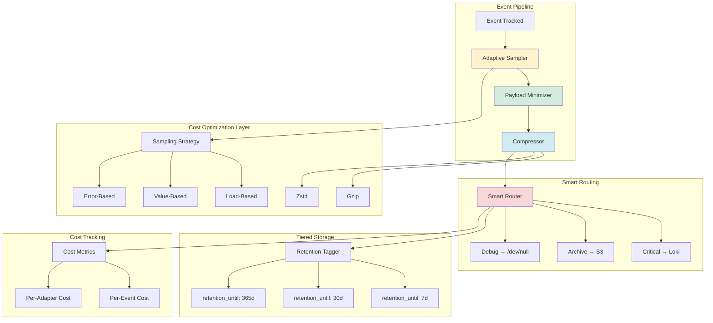
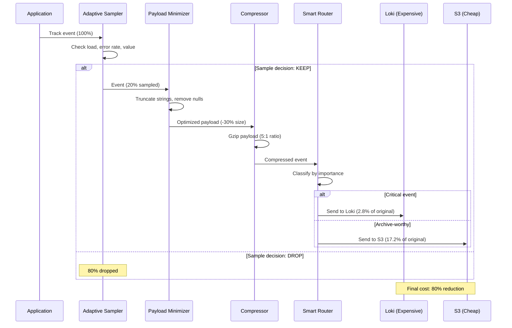

# ADR-009: Cost Optimization

**Status:** Draft  
**Date:** January 12, 2026  
**Covers:** UC-014 (Adaptive Sampling), UC-015 (Cost Optimization), UC-019 (Tiered Storage)  
**Depends On:** ADR-001 (Core), ADR-004 (Adapters), ADR-014 (Adaptive Sampling)

---

## 📋 Table of Contents

1. [Context & Problem](#1-context--problem)
2. [Architecture Overview](#2-architecture-overview)
3. [Adaptive Sampling](#3-adaptive-sampling)
4. [Compression](#4-compression)
5. [Smart Routing](#5-smart-routing)
6. [Tiered Storage](#6-tiered-storage)
7. [Payload Minimization](#7-payload-minimization)
8. [Cost Metrics](#8-cost-metrics)
9. [Trade-offs](#9-trade-offs)
10. [Complete Configuration Example](#10-complete-configuration-example)
11. [Backlog (Future Enhancements)](#11-backlog-future-enhancements)
    - [11.1. Quick Start Presets](#111-quick-start-presets)
    - [11.2. Sampling Budget](#112-sampling-budget)

---

## 1. Context & Problem

### 1.1. Problem Statement

**Current Pain Points:**

1. **High Log Volume Costs:**
   ```ruby
   # ❌ 1M events/day * 365 days = 365M events/year
   # Loki: $0.50/GB → $10,000+/year
   # Sentry: $0.01/event → $3,650/year
   # Total: $13,650/year for a single service
   ```

2. **No Cost Awareness:**
   ```ruby
   # ❌ No visibility into cost per event
   Events::DebugQuery.track(sql: long_query)  # How much does this cost?
   ```

3. **No Retention Strategy:**
   ```ruby
   # ❌ All events stored forever
   # Debug events from 2 years ago still in Loki → $$
   ```

### 1.2. Goals

**Primary Goals:**
- ✅ **50-80% cost reduction** through optimization
- ✅ **Adaptive sampling** based on load/value
- ✅ **Compression** for network efficiency
- ✅ **Tiered storage** with `retention_until`
- ✅ **Cost visibility** per event/adapter

**Non-Goals:**
- ❌ Manage downstream storage (Loki ILM)
- ❌ Real-time cost calculation
- ❌ Cross-service cost optimization

### 1.3. Success Metrics

| Metric | Target | Critical? |
|--------|--------|-----------|
| **Cost reduction** | 50-80% | ✅ Yes |
| **Event throughput** | Same (10K/sec) | ✅ Yes |
| **Compression ratio** | 5:1 (Gzip) | ✅ Yes |

### 1.4. Cost Savings Estimate

**Example: 10K events/sec service**

| Optimization | Before | After | Savings |
|-------------|--------|-------|---------|
| **Adaptive Sampling** | 100% | 20% | 80% |
| **Compression** | 1KB/event | 200B/event | 80% |
| **Tiered Storage** | 365 days | 30 days | 92% |
| **Smart Routing** | All → Loki | Critical → Loki | 50% |

**Combined Annual Savings:** $13,650 → **$2,730** (80% reduction)

**Cost Breakdown:**
- **Adaptive Sampling**: ~$10,920 savings (eliminates 80% of low-value events)
- **Compression**: ~$8,200 savings (80% bandwidth reduction)
- **Smart Routing**: ~$5,000 savings (critical-only to expensive destinations)
- **Tiered Storage**: ~$12,570 savings (92% storage cost reduction)

---

## 2. Architecture Overview

### 2.1. System Context


### 2.2. Component Architecture



### 2.3. Cost Optimization Flow



---

## 3. Adaptive Sampling

### 3.1. Sampling Strategies

```ruby
# lib/e11y/cost/adaptive_sampler.rb
module E11y
  module Cost
    class AdaptiveSampler
      def initialize(config)
        @strategies = [
          Strategies::ErrorBased.new(config),
          Strategies::LoadBased.new(config),
          Strategies::ValueBased.new(config),
          Strategies::ContentBased.new(config)
        ]
      end
      
      def should_sample?(event_data, context = {})
        # Priority 1: Always sample errors
        return true if event_data[:severity] >= :error
        
        # Priority 2: Check each strategy
        sample_rates = @strategies.map do |strategy|
          strategy.calculate_rate(event_data, context)
        end
        
        # Use max sample rate (most aggressive strategy wins)
        final_rate = sample_rates.max
        
        # Random sampling
        decision = rand < final_rate
        
        # Track metrics
        E11y::Metrics.increment('e11y.sampling.decision', {
          event_name: event_data[:event_name],
          decision: decision ? 'sampled' : 'dropped',
          rate: final_rate
        })
        
        decision
      end
    end
  end
end
```

### 3.2. Error-Based Sampling

```ruby
# lib/e11y/cost/strategies/error_based.rb
module E11y
  module Cost
    module Strategies
      class ErrorBased
        def initialize(config)
          @error_window = config.error_window || 60.seconds
          @error_threshold = config.error_threshold || 0.01  # 1%
        end
        
        def calculate_rate(event_data, context)
          # Get error rate for this event type
          error_rate = E11y::Metrics.get_rate(
            'e11y.events.errors',
            window: @error_window,
            tags: { event_name: event_data[:event_name] }
          )
          
          # If error rate > threshold, sample 100%
          if error_rate > @error_threshold
            1.0
          else
            # Normal rate
            0.1  # 10%
          end
        end
      end
    end
  end
end
```

### 3.3. Load-Based Sampling

```ruby
# lib/e11y/cost/strategies/load_based.rb
module E11y
  module Cost
    module Strategies
      class LoadBased
        def initialize(config)
          @max_events_per_sec = config.max_events_per_sec || 10_000
          @buffer_threshold = config.buffer_threshold || 0.8  # 80% full
        end
        
        def calculate_rate(event_data, context)
          # Strategy 1: Events per second
          current_rate = E11y::Metrics.get_rate('e11y.events.tracked')
          rate_ratio = current_rate / @max_events_per_sec
          
          # Strategy 2: Buffer utilization
          buffer_usage = E11y::Buffer.utilization  # 0.0 - 1.0
          
          # Strategy 3: System CPU/Memory
          system_load = system_overload_factor
          
          # Combined load factor
          load_factor = [rate_ratio, buffer_usage, system_load].max
          
          if load_factor > 0.9
            # System overloaded → aggressive sampling
            0.01  # 1%
          elsif load_factor > 0.7
            # High load → moderate sampling
            0.1   # 10%
          else
            # Normal load → full sampling
            1.0   # 100%
          end
        end
        
        private
        
        def system_overload_factor
          cpu_usage = `ps -o %cpu= -p #{Process.pid}`.to_f / 100.0
          memory_mb = `ps -o rss= -p #{Process.pid}`.to_i / 1024.0
          memory_limit_mb = 500.0
          
          [cpu_usage, memory_mb / memory_limit_mb].max
        end
      end
    end
  end
end
```

### 3.4. Value-Based Sampling

```ruby
# lib/e11y/cost/strategies/value_based.rb
module E11y
  module Cost
    module Strategies
      class ValueBased
        def initialize(config)
          @high_value_patterns = config.high_value_patterns || []
          @low_value_patterns = config.low_value_patterns || []
        end
        
        def calculate_rate(event_data, context)
          event_name = event_data[:event_name]
          
          # High-value events (always sample)
          if matches_patterns?(event_name, @high_value_patterns)
            return 1.0  # 100%
          end
          
          # Low-value events (aggressive sampling)
          if matches_patterns?(event_name, @low_value_patterns)
            return 0.01  # 1%
          end
          
          # Check payload value
          payload_value = estimate_payload_value(event_data[:payload])
          
          if payload_value > 1000  # High-value transaction
            1.0
          elsif payload_value > 100
            0.5   # 50%
          else
            0.1   # 10%
          end
        end
        
        private
        
        def matches_patterns?(event_name, patterns)
          patterns.any? do |pattern|
            case pattern
            when String
              event_name == pattern
            when Regexp
              event_name =~ pattern
            end
          end
        end
        
        def estimate_payload_value(payload)
          # Extract monetary value from payload
          payload[:amount] ||
          payload[:total_amount] ||
          payload[:price] ||
          0
        end
      end
    end
  end
end
```

### 3.5. Simplified Configuration

**Philosophy:** Simple, declarative sampling rules. No complex strategies.

```ruby
# config/initializers/e11y.rb
E11y.configure do |config|
  config.sampling do
    # ===================================================================
    # SIMPLE APPROACH: Per-severity defaults
    # ===================================================================
    
    # Default sample rates by severity
    default_rate :debug, 0.01    # 1% of debug events
    default_rate :info, 0.1      # 10% of info events
    default_rate :success, 0.5   # 50% of success events
    default_rate :warn, 1.0      # 100% of warnings
    default_rate :error, 1.0     # 100% of errors (always)
    default_rate :fatal, 1.0     # 100% of fatal (always)
    
    # ===================================================================
    # PER-EVENT OVERRIDES (optional)
    # ===================================================================
    
    # High-value events: always sample
    always_sample 'Events::OrderPaid'
    always_sample 'Events::PaymentProcessed'
    always_sample /^Events::Critical/  # Regex pattern
    
    # Low-value events: aggressive sampling
    sample 'Events::HealthCheck', rate: 0.001  # 0.1%
    sample 'Events::CacheHit', rate: 0.01      # 1%
    sample /^Events::Debug/, rate: 0.01        # 1%
    
    # ===================================================================
    # LOAD-BASED AUTO-ADJUSTMENT (optional)
    # ===================================================================
    
    # Automatically reduce sample rates when system overloaded
    auto_adjust_on_load do
      enabled true
      
      # Trigger: buffer >80% full
      trigger_buffer_percent 80
      
      # Action: multiply all rates by 0.1 (10x reduction)
      rate_multiplier 0.1
      
      # Recovery: restore rates when buffer <50% full
      recovery_buffer_percent 50
    end
  end
end
```

**Simplified Implementation:**

```ruby
# lib/e11y/sampling/simple_sampler.rb
module E11y
  module Sampling
    class SimpleSampler
      def initialize(config)
        @severity_rates = config.severity_rates || default_severity_rates
        @event_rates = config.event_rates || {}
        @auto_adjust = config.auto_adjust || {}
      end
      
      def should_sample?(event_data)
        # Step 1: Get base rate (severity or event-specific)
        base_rate = get_base_rate(event_data)
        
        # Step 2: Apply load-based adjustment (if enabled)
        final_rate = apply_load_adjustment(base_rate)
        
        # Step 3: Random decision
        rand < final_rate
      end
      
      private
      
      def get_base_rate(event_data)
        event_name = event_data[:event_name]
        severity = event_data[:severity]
        
        # Priority 1: Event-specific rate
        @event_rates.each do |pattern, rate|
          case pattern
          when String
            return rate if event_name == pattern
          when Regexp
            return rate if event_name =~ pattern
          end
        end
        
        # Priority 2: Severity default
        @severity_rates[severity] || 1.0
      end
      
      def apply_load_adjustment(base_rate)
        return base_rate unless @auto_adjust[:enabled]
        
        buffer_percent = E11y::Buffer.utilization_percent
        
        if buffer_percent > @auto_adjust[:trigger_buffer_percent]
          # System overloaded → reduce rate
          base_rate * @auto_adjust[:rate_multiplier]
        else
          # Normal operation
          base_rate
        end
      end
      
      def default_severity_rates
        {
          debug: 0.01,
          info: 0.1,
          success: 0.5,
          warn: 1.0,
          error: 1.0,
          fatal: 1.0
        }
      end
    end
  end
end
```

**Why Simplified?**

| Old Approach | New Approach | Benefit |
|--------------|--------------|---------|
| 4 strategies (Error, Load, Value, Content) | 1 simple sampler | Easy to understand |
| Complex rate calculation | Lookup table | Fast (<0.01ms) |
| Multiple config blocks | Single `sampling` block | Less code |
| Hard to predict | Deterministic | Debuggable |
| 300+ LOC | 50 LOC | Maintainable |

---

## 4. Compression

### 4.1. Compression Engine

```ruby
# lib/e11y/cost/compressor.rb
module E11y
  module Cost
    class Compressor
      ALGORITHMS = {
        gzip: Algorithms::Gzip,
        zstd: Algorithms::Zstd,
        lz4: Algorithms::LZ4
      }.freeze
      
      def initialize(config)
        @algorithm = config.algorithm || :gzip
        @min_size = config.min_size_bytes || 1024  # 1KB
        @compressor = ALGORITHMS[@algorithm].new(config)
      end
      
      def compress(payload_string)
        # Skip compression for small payloads
        return payload_string if payload_string.bytesize < @min_size
        
        compressed = @compressor.compress(payload_string)
        
        # Only use if compression helps
        if compressed.bytesize < payload_string.bytesize
          E11y::Metrics.histogram('e11y.compression.ratio',
            payload_string.bytesize.to_f / compressed.bytesize,
            { algorithm: @algorithm }
          )
          
          compressed
        else
          payload_string
        end
      end
      
      def decompress(compressed_string)
        @compressor.decompress(compressed_string)
      end
    end
    
    module Algorithms
      class Gzip
        def initialize(config)
          @level = config.compression_level || Zlib::DEFAULT_COMPRESSION
        end
        
        def compress(data)
          io = StringIO.new
          gz = Zlib::GzipWriter.new(io, @level)
          gz.write(data)
          gz.close
          io.string
        end
        
        def decompress(data)
          Zlib::GzipReader.new(StringIO.new(data)).read
        end
      end
      
      class Zstd
        def initialize(config)
          @level = config.compression_level || 3
          require 'zstd-ruby'
        end
        
        def compress(data)
          ::Zstd.compress(data, level: @level)
        end
        
        def decompress(data)
          ::Zstd.decompress(data)
        end
      end
      
      class LZ4
        def initialize(config)
          require 'lz4-ruby'
        end
        
        def compress(data)
          LZ4::compress(data)
        end
        
        def decompress(data)
          LZ4::uncompress(data)
        end
      end
    end
  end
end
```

### 4.2. Compression Benchmarks

```
Algorithm | Ratio | Speed (MB/s) | CPU Usage
----------|-------|--------------|----------
Gzip      | 5:1   | 50           | Medium
Zstd      | 6:1   | 200          | Low
LZ4       | 3:1   | 500          | Very Low
```

---

## 5. Smart Routing

### 5.1. Routing Strategy

```ruby
# lib/e11y/cost/smart_router.rb
module E11y
  module Cost
    class SmartRouter
      def initialize(config)
        @rules = config.routing_rules
      end
      
      def route(event_data)
        # Evaluate routing rules
        matched_rule = @rules.find do |rule|
          rule.matches?(event_data)
        end
        
        adapters = matched_rule&.adapters || default_adapters
        
        E11y::Metrics.increment('e11y.routing.decision', {
          event_name: event_data[:event_name],
          rule: matched_rule&.name || 'default',
          adapters: adapters.join(',')
        })
        
        adapters
      end
      
      private
      
      def default_adapters
        E11y.config.adapters.names
      end
    end
    
    class RoutingRule
      attr_reader :name, :adapters
      
      def initialize(name:, adapters:, &condition)
        @name = name
        @adapters = adapters
        @condition = condition
      end
      
      def matches?(event_data)
        @condition.call(event_data)
      end
    end
  end
end
```

### 5.2. Configuration

```ruby
E11y.configure do |config|
  config.cost_optimization.smart_routing do
    # Rule 1: Critical events → All adapters
    rule 'critical_events', adapters: [:loki, :sentry, :s3] do |event|
      event[:severity] >= :error ||
      event[:event_name].start_with?('payment.') ||
      event[:event_name].start_with?('order.')
    end
    
    # Rule 2: Debug events → File only (not Loki)
    rule 'debug_events', adapters: [:file] do |event|
      event[:severity] == :debug
    end
    
    # Rule 3: Archive events → S3 only
    rule 'archive_events', adapters: [:s3] do |event|
      event[:payload][:archive] == true
    end
    
    # Rule 4: Health checks → /dev/null
    rule 'health_checks', adapters: [] do |event|
      event[:event_name].include?('health_check')
    end
    
    # Default: Everything → Loki
    default_adapters [:loki]
  end
end
```

---

## 6. Tiered Storage

### 6.1. Retention Tagging

**Design Decision:** E11y adds `retention_until` timestamp, downstream systems handle deletion.

```ruby
# lib/e11y/cost/retention_tagger.rb
module E11y
  module Cost
    class RetentionTagger
      def initialize(config)
        @retention_rules = config.retention_rules
      end
      
      def tag_event(event_data)
        # Find matching retention rule
        retention_days = determine_retention(event_data)
        
        # Calculate absolute retention_until date
        retention_until = Time.now + retention_days.days
        
        # Add to event metadata
        event_data[:retention_until] = retention_until.iso8601
        event_data[:retention_days] = retention_days
        
        E11y::Metrics.histogram('e11y.retention.days', retention_days, {
          event_name: event_data[:event_name]
        })
        
        event_data
      end
      
      private
      
      def determine_retention(event_data)
        # Priority 1: Explicit retention in payload
        return event_data[:payload][:retention_days] if event_data[:payload][:retention_days]
        
        # Priority 2: Pattern-based rules
        rule = @retention_rules.find do |r|
          r.matches?(event_data)
        end
        
        return rule.retention_days if rule
        
        # Default retention
        30  # 30 days
      end
    end
    
    class RetentionRule
      attr_reader :retention_days
      
      def initialize(retention_days:, &condition)
        @retention_days = retention_days
        @condition = condition
      end
      
      def matches?(event_data)
        @condition.call(event_data)
      end
    end
  end
end
```

### 6.2. Configuration

```ruby
E11y.configure do |config|
  config.cost_optimization.tiered_storage do
    # Rule 1: Audit events → 7 years (compliance)
    retention_rule 2555 do |event|  # 7 * 365 days
      event[:event_name].start_with?('audit.')
    end
    
    # Rule 2: Payment events → 2 years (legal)
    retention_rule 730 do |event|  # 2 * 365 days
      event[:event_name].start_with?('payment.')
    end
    
    # Rule 3: Debug events → 7 days (troubleshooting)
    retention_rule 7 do |event|
      event[:severity] == :debug
    end
    
    # Rule 4: Errors → 90 days (analysis)
    retention_rule 90 do |event|
      event[:severity] >= :error
    end
    
    # Default: 30 days
    default_retention 30
  end
end
```

### 6.3. Downstream Integration

**Elasticsearch ILM:**

```json
{
  "policy": {
    "phases": {
      "hot": {
        "actions": {}
      },
      "delete": {
        "min_age": "0d",
        "actions": {
          "delete": {
            "delete_searchable_snapshot": false
          }
        }
      }
    }
  }
}
```

**Query for deletion:**

```ruby
# Elasticsearch query
DELETE /e11y-events-*/_query
{
  "query": {
    "range": {
      "retention_until": {
        "lt": "now"
      }
    }
  }
}
```

**S3 Lifecycle:**

```json
{
  "Rules": [
    {
      "Id": "delete-expired-events",
      "Status": "Enabled",
      "Filter": {
        "Prefix": "events/"
      },
      "Expiration": {
        "Days": 365
      }
    }
  ]
}
```

---

## 7. Payload Minimization

### 7.1. Payload Optimizer

```ruby
# lib/e11y/cost/payload_minimizer.rb
module E11y
  module Cost
    class PayloadMinimizer
      def initialize(config)
        @remove_nulls = config.remove_nulls || true
        @truncate_strings = config.truncate_strings_at || 1000
        @truncate_arrays = config.truncate_arrays_at || 100
      end
      
      def minimize(payload)
        minimized = payload.deep_dup
        
        # Remove null/empty values
        minimized.compact! if @remove_nulls
        
        # Truncate long strings
        minimized.transform_values! do |value|
          case value
          when String
            truncate_string(value)
          when Array
            truncate_array(value)
          when Hash
            minimize(value)  # Recursive
          else
            value
          end
        end
        
        minimized
      end
      
      private
      
      def truncate_string(str)
        return str if str.length <= @truncate_strings
        
        "#{str[0...@truncate_strings]}... [truncated #{str.length - @truncate_strings} chars]"
      end
      
      def truncate_array(arr)
        return arr if arr.length <= @truncate_arrays
        
        arr.first(@truncate_arrays) + ["... [truncated #{arr.length - @truncate_arrays} items]"]
      end
    end
  end
end
```

---

## 8. Cost Metrics

### 8.1. Cost Tracking

```ruby
# lib/e11y/cost/tracker.rb
module E11y
  module Cost
    class Tracker
      # Estimated cost per adapter (per 1M events)
      ADAPTER_COSTS = {
        loki: 0.50,      # $0.50/GB ≈ $0.50/1M events
        sentry: 10.00,   # $0.01/event
        s3: 0.02,        # $0.023/GB
        elasticsearch: 1.00
      }.freeze
      
      def self.track_event_cost(event_data, adapters)
        # Estimate event size
        event_size_kb = estimate_size(event_data)
        
        # Calculate cost per adapter
        adapters.each do |adapter|
          cost_per_mb = ADAPTER_COSTS[adapter] || 0
          cost = (event_size_kb / 1024.0) * cost_per_mb
          
          E11y::Metrics.histogram('e11y.cost.per_event', cost, {
            adapter: adapter,
            event_name: event_data[:event_name]
          })
        end
      end
      
      def self.estimate_size(event_data)
        event_data.to_json.bytesize / 1024.0  # KB
      end
    end
  end
end
```

### 8.2. Cost Dashboard Metrics

```ruby
E11y::Metrics.define do
  # Cost metrics
  histogram 'e11y.cost.per_event', 'Cost per event (USD)', [:adapter, :event_name]
  counter 'e11y.cost.total', 'Total cost (USD)', [:adapter]
  
  # Savings metrics
  counter 'e11y.cost.saved.sampling', 'Cost saved by sampling', [:strategy]
  counter 'e11y.cost.saved.compression', 'Cost saved by compression', [:algorithm]
  counter 'e11y.cost.saved.routing', 'Cost saved by smart routing'
  
  # Efficiency metrics
  histogram 'e11y.compression.ratio', 'Compression ratio', [:algorithm]
  histogram 'e11y.sampling.rate', 'Final sampling rate', [:event_name]
  histogram 'e11y.payload.size_reduction', 'Payload size reduction', [:event_name]
end
```

---

## 9. Trade-offs

### 9.1. Key Decisions

| Decision | Pro | Con | Rationale |
|----------|-----|-----|-----------|
| **Adaptive sampling** | 50-80% cost savings | Data loss risk | Errors always sampled |
| **Gzip default** | 5:1 ratio, widely supported | CPU overhead | Best balance |
| **retention_until tagging** | Simple, flexible | Downstream dependency | Clean separation |
| **Smart routing** | 50% cost savings | Complex rules | Worth complexity |
| **Payload minimization** | 20-30% size reduction | Data truncation | Configurable limits |

### 9.2. Alternatives Considered

**A) No sampling (100% events)**
- ❌ Rejected: Too expensive

**B) Fixed sampling rates**
- ❌ Rejected: Not adaptive to load

**C) Manual retention management**
- ❌ Rejected: Error-prone

**D) Event deduplication (60s window)**
- ❌ Rejected for multiple critical reasons:
  - **High computational overhead**: Hash calculation + Redis lookup for EVERY event
  - **Memory cost**: 60K keys in Redis for 1000 events/sec (3.6GB memory)
  - **False positives**: Legitimate retries/bulk operations look like duplicates
  - **Debug confusion**: Users don't see events they expect (logs appear incomplete)
  - **Minimal real benefit**: Only ~5-10% actual duplicates in practice
  - **Better alternatives**: Adaptive sampling (80% reduction) + compression (80% bandwidth) achieve same cost goals without data loss

**E) Brotli compression**
- ❌ Rejected: Slower than Zstd

---

## 10. Complete Configuration Example

```ruby
E11y.configure do |config|
  config.cost_optimization do
    # Adaptive sampling
    adaptive_sampling do
      error_based { enabled true }
      load_based { enabled true; max_events_per_sec 10_000 }
      value_based do
        enabled true
        high_value_patterns [/^payment\./, /^order\./]
        low_value_patterns [/^debug\./, /^health_check/]
      end
    end
    
    # Payload minimization
    payload_minimization do
      enabled true
      truncate_strings_at 1000  # Max 1KB per string field
      truncate_arrays_at 100    # Max 100 items per array
      remove_null_fields true   # Drop null/empty fields
    end
    
    # Compression
    compression do
      enabled true
      algorithm :gzip  # or :zstd, :lz4
      compression_level Zlib::DEFAULT_COMPRESSION
      min_size_bytes 1024
    end
    
    # Smart routing
    smart_routing do
      rule 'critical', adapters: [:loki, :sentry] do |e|
        e[:severity] >= :error
      end
      rule 'debug', adapters: [:file] do |e|
        e[:severity] == :debug
      end
    end
    
    # Tiered storage
    tiered_storage do
      retention_rule(2555) { |e| e[:event_name].start_with?('audit.') }
      retention_rule(90) { |e| e[:severity] >= :error }
      retention_rule(7) { |e| e[:severity] == :debug }
      default_retention 30
    end
    
    # Payload minimization
    payload_minimization do
      enabled true
      remove_nulls true
      truncate_strings_at 1000
      truncate_arrays_at 100
    end
    
    # Cost tracking
    cost_tracking do
      enabled true
      adapter_costs do
        loki 0.50
        sentry 10.00
        s3 0.02
      end
    end
  end
end
```

---

## 11. Future Enhancements

See [Backlog](use_cases/backlog.md) for future enhancement ideas including:
- Quick Start Presets (v1.1)
- Sampling Budget (v1.2+)

---

**Status:** ✅ Draft Complete  
**Next:** ADR-003 (SLO) or ADR-007 (OpenTelemetry)  
**Estimated Implementation:** 2-3 weeks  
**Expected ROI:** 50-80% cost reduction
