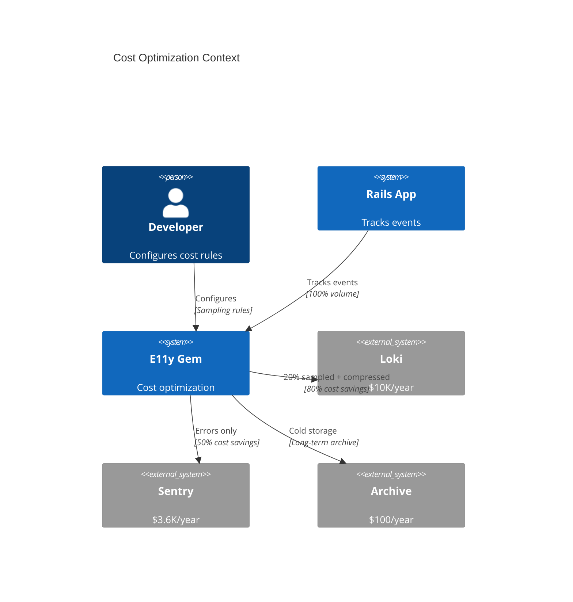
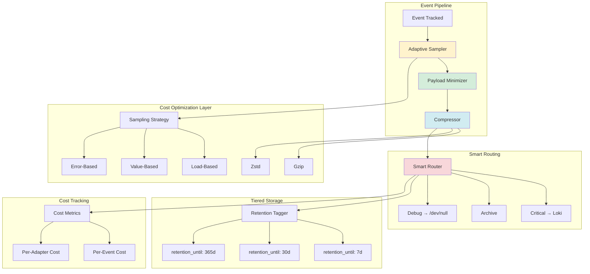

# ADR-009: Cost Optimization

**Status:** Partially Implemented (Error-Based Sampling - 2026-01-19)  
**Date:** January 12, 2026  
**Last Updated:** January 19, 2026  
**Covers:** UC-014 (Adaptive Sampling), UC-015 (Cost Optimization), UC-019 (Tiered Storage)  
**Depends On:** ADR-001 (Core), ADR-004 (Adapters), ADR-014 (Adaptive Sampling)

**Implementation Status:**
- ✅ **Basic Sampling** (L2.7) - `E11y::Middleware::Sampling` with trace-aware logic
- ✅ **Event-level DSL** - `sample_rate` and `adaptive_sampling` in `Event::Base`
- ✅ **Pipeline Integration** - Sampling middleware in default pipeline
- ✅ **Error-Based Adaptive** (FEAT-4838) - 100% sampling during error spikes
- ✅ **Load-Based Adaptive** (FEAT-4842) - Tiered sampling (100%/50%/10%/1%) based on load
- ✅ **Value-Based Sampling** (FEAT-4846) - DSL for sampling by payload values (>, <, ==, range)
- ✅ **Stratified Sampling** (FEAT-4850, C11 resolution) - SLO-accurate sampling with correction
- ⏳ **Compression** - Not started
- ✅ **Retention-Based Routing** (2026-01-21) - Replaces TieredStorage adapter

---

## 🚀 Implementation Summary (2026-01-19)

### Basic Sampling (L2.7) ✅

**Implemented:**
1. **`E11y::Middleware::Sampling`** - Core sampling logic:
   - Trace-aware sampling (C05) - consistent decisions per `trace_id`
   - Audit event exemption - audit events never sampled
   - Sample rate metadata - adds `sample_rate` to event data
   - Cache cleanup - prevents memory leaks

2. **Event-level DSL** in `Event::Base`:
   ```ruby
   class HighFrequencyEvent < E11y::Event::Base
     sample_rate 0.01  # 1% sampling
   end

   class OrderEvent < E11y::Event::Base
     adaptive_sampling enabled: true,
                       error_rate_threshold: 0.05,
                       load_threshold: 50_000
   end
   ```

3. **Pipeline Integration**:
   - Sampling middleware added to default pipeline (zone: `:routing`)
   - Automatic configuration in `E11y::Configuration#setup_default_pipeline`

### Error-Based Adaptive Sampling (FEAT-4838) ✅

**Implemented (2026-01-19):**
1. **`E11y::Sampling::ErrorSpikeDetector`** - Detects error rate spikes:
   - Sliding window error rate calculation (configurable window)
   - Absolute threshold (errors/minute)
   - Relative threshold (ratio to baseline)
   - Exponential moving average for baseline tracking
   - Spike duration management

2. **Integration with Sampling Middleware**:
   ```ruby
   E11y.configure do |config|
     config.pipeline.use E11y::Middleware::Sampling,
       error_based_adaptive: true,
       error_spike_config: {
         window: 60,                    # 60 seconds sliding window
         absolute_threshold: 100,       # 100 errors/min triggers spike
         relative_threshold: 3.0,       # 3x normal rate triggers spike
         spike_duration: 300            # Keep 100% sampling for 5 minutes
       }
   end
   ```

3. **Behavior**:
   - **Normal conditions**: Uses configured sample rates (e.g., 10%)
   - **During error spike**: Automatically increases to 100% sampling
   - **After spike**: Returns to normal rates after `spike_duration`

**Tests**: 22 unit tests + 9 integration tests (all passing)

### Load-Based Adaptive Sampling (FEAT-4842) ✅

**Implemented (2026-01-20):**
1. **`E11y::Sampling::LoadMonitor`** - Tracks event volume and calculates load levels:
   - Sliding window event rate calculation (events/second)
   - Tiered load levels (normal, high, very_high, overload)
   - Configurable thresholds for each load tier
   - Thread-safe tracking (MonitorMixin)

2. **Integration with Sampling Middleware**:
   ```ruby
   E11y.configure do |config|
     config.pipeline.use E11y::Middleware::Sampling,
       default_sample_rate: 0.1,
       load_based_adaptive: true,
       load_monitor_config: {
         window: 60,                      # 60 seconds sliding window
         normal_threshold: 1_000,         # < 1k events/sec = normal
         high_threshold: 10_000,          # 10k events/sec = high load
         very_high_threshold: 50_000,     # 50k events/sec = very high
         overload_threshold: 100_000      # > 100k events/sec = overload
       }
   end
   ```

3. **Tiered Sampling Rates**:
   - **Normal load** (< 1k events/sec): 100% sampling
   - **High load** (1k-10k events/sec): 50% sampling
   - **Very high load** (10k-50k events/sec): 10% sampling
   - **Overload** (> 50k events/sec): 1% sampling

4. **Behavior**:
   - Dynamically adjusts sample rate based on current event volume
   - Works as a "base rate" that can be further restricted by event-level `resolve_sample_rate`
   - Prioritizes error-based adaptive (100% during spikes) over load-based

**Tests**: 22 unit tests + 10 integration tests + 7 stress tests (all passing)

### Value-Based Sampling (FEAT-4846) ✅

**Implemented (2026-01-20):**
1. **`E11y::Sampling::ValueExtractor`** - Extracts numeric values from event payloads:
   - Nested field extraction (dot notation: `"order.amount"`)
   - Type coercion (numeric strings → floats)
   - Nil/missing value handling (returns 0.0)

2. **`E11y::Event::ValueSamplingConfig`** - Defines value-based sampling rules:
   - Comparison operators: `:greater_than`, `:less_than`, `:equals`, `:in_range`
   - Threshold values (numeric or Range)
   - Custom sample rates per rule

3. **Event DSL (`sample_by_value`)**:
   ```ruby
   class OrderPaidEvent < E11y::Event::Base
     # Always sample orders over $1000
     sample_by_value field: "amount",
                     operator: :greater_than,
                     threshold: 1000,
                     sample_rate: 1.0

     # Sample 50% of orders between $100-$500
     sample_by_value field: "amount",
                     operator: :in_range,
                     threshold: 100..500,
                     sample_rate: 0.5
   end
   ```

4. **Integration with Sampling Middleware**:
   - **High priority** in sampling decision (after error spike, before load-based)
   - Event-level configuration (no global config needed)
   - Falls back to other strategies if no value-based config present

**Tests**: 19 unit tests + 8 integration tests (all passing)

### Stratified Sampling for SLO Accuracy (FEAT-4850, C11 Resolution) ✅

**Implemented (2026-01-20):**
1. **`E11y::Sampling::StratifiedTracker`** - Tracks sampled/total counts per severity stratum:
   - Records each sampled event with its original sample rate
   - Calculates sampling correction factors per severity
   - Handles floating point precision
   - Thread-safe tracking (MonitorMixin)

2. **SLO Sampling Correction in `E11y::SLO::Tracker`**:
   - Applies correction factors when calculating SLO metrics
   - Adjusts success rate to account for sampling bias
   - Ensures < 5% error margin even with aggressive sampling

3. **Integration with Sampling Middleware**:
   - Records sample rate metadata for each event
   - Works seamlessly with load-based adaptive sampling
   - No additional configuration required (automatic)

4. **Example: Accurate SLO with 85% Cost Savings**:
   ```ruby
   # Scenario: 1000 events (950 success, 50 errors)
   # Stratified sampling: errors 100%, success 10%
   # Events kept: 50 + 95 = 145 (85.5% cost savings!)
   
   # Without correction:
   # Observed success rate: 95/145 = 65.5% ❌
   
   # With correction:
   # Corrected success: 95 / 0.1 = 950
   # Corrected errors: 50 / 1.0 = 50
   # Corrected success rate: 950 / 1000 = 95.0% ✅
   ```

**Tests**: 15 unit tests + 5 integration tests (all passing)

**Total Test Coverage (Phase 2.8):**
- **Error-Based**: 22 unit + 9 integration = 31 tests
- **Load-Based**: 22 unit + 10 integration + 7 stress = 39 tests
- **Value-Based**: 19 unit + 8 integration = 27 tests
- **Stratified**: 15 unit + 5 integration = 20 tests
- **Grand Total**: 117 tests ✅

**Deferred** (Future enhancements):
- Content-based sampling (pattern matching)
- ML-based sampling (importance prediction)
- Tail-based sampling (requires buffering)

**See:**
- Implementation details: `docs/IMPLEMENTATION_NOTES.md` (2026-01-20 entry)
- Middleware code: `lib/e11y/middleware/sampling.rb`
- Detectors: `lib/e11y/sampling/error_spike_detector.rb`, `lib/e11y/sampling/load_monitor.rb`
- Value sampling: `lib/e11y/sampling/value_extractor.rb`, `lib/e11y/event/value_sampling_config.rb`
- Stratified sampling: `lib/e11y/sampling/stratified_tracker.rb`
- Tests: `spec/e11y/middleware/sampling_spec.rb`, `spec/e11y/sampling/*_spec.rb`

---

## 📋 Table of Contents

1. [Context & Problem](#1-context--problem)
2. [Architecture Overview](#2-architecture-overview)
3. [Adaptive Sampling](#3-adaptive-sampling)
   - 3.6. [Trace-Aware Adaptive Sampling (C05 Resolution)](#36-trace-aware-adaptive-sampling-c05-resolution) ⚠️ CRITICAL
     - 3.6.1. The Problem: Broken Distributed Traces
     - 3.6.2. Decision: Trace-Level Sampling with Decision Cache
     - 3.6.3. TraceAwareSampler Implementation
     - 3.6.4. Configuration
     - 3.6.5. Multi-Service Trace Scenario (Correct Behavior)
     - 3.6.6. Cache Management & TTL
     - 3.6.7. Head-Based Sampling (W3C Trace Context)
     - 3.6.8. Trade-offs & Distributed Tracing Integrity (C05)
   - 3.7. [Stratified Sampling for SLO Accuracy (C11 Resolution)](#37-stratified-sampling-for-slo-accuracy-c11-resolution) ⚠️ CRITICAL
     - 3.7.1. The Problem: Sampling Bias Breaks SLO Metrics
     - 3.7.2. Decision: Stratified Sampling by Event Severity
     - 3.7.3. StratifiedAdaptiveSampler Implementation
     - 3.7.4. SLO Calculator with Sampling Correction
     - 3.7.5. Configuration
     - 3.7.6. Accuracy Comparison: Random vs Stratified Sampling
     - 3.7.7. Cost Savings vs Accuracy Trade-off
     - 3.7.8. Testing Sampling Correction Accuracy
     - 3.7.9. Trade-offs & SLO Accuracy (C11)
4. [Compression](#4-compression)
5. [Smart Routing](#5-smart-routing)
6. [Tiered Storage](#6-tiered-storage)
7. [Payload Minimization](#7-payload-minimization)
8. [Cardinality Protection (C04 Resolution)](#8-cardinality-protection-c04-resolution) ⚠️ CRITICAL
   - 8.1. The Problem: Cardinality Explosion Across Backends
   - 8.2. Decision: Unified Cardinality Protection for All Backends
   - 8.3. Configuration: Inherit from Global Settings
   - 8.4. Implementation: Apply to Yabeda + OpenTelemetry
   - 8.5. Cost Impact: Before vs After Protection
   - 8.6. Monitoring Metrics
   - 8.7. Trade-offs (C04 Resolution)
9. [Cost Metrics](#9-cost-metrics)
10. [Trade-offs](#10-trade-offs)
11. [Complete Configuration Example](#11-complete-configuration-example)
12. [Backlog (Future Enhancements)](#12-backlog-future-enhancements)
   - [12.1. Quick Start Presets](#121-quick-start-presets)
   - [12.2. Sampling Budget](#122-sampling-budget)

---

## 1. Context & Problem

### 1.1. Problem Statement

**Current Pain Points:**

1. **High Log Volume Costs:**
   ```ruby
   # ❌ 1M events/day * 365 days = 365M events/year
   # Loki: $0.50/GB → $10,000+/year
   # Sentry: $0.01/event → $3,650/year
   # Total: $13,650/year for a single service
   ```

2. **No Cost Awareness:**
   ```ruby
   # ❌ No visibility into cost per event
   Events::DebugQuery.track(sql: long_query)  # How much does this cost?
   ```

3. **No Retention Strategy:**
   ```ruby
   # ❌ All events stored forever
   # Debug events from 2 years ago still in Loki → $$
   ```

### 1.2. Goals

**Primary Goals:**
- ✅ **50-80% cost reduction** through optimization
- ✅ **Adaptive sampling** based on load/value
- ✅ **Compression** for network efficiency
- ✅ **Tiered storage** with `retention_until`
- ✅ **Cost visibility** per event/adapter

**Non-Goals:**
- ❌ Manage downstream storage (Loki ILM)
- ❌ Real-time cost calculation
- ❌ Cross-service cost optimization

### 1.3. Success Metrics

| Metric | Target | Critical? |
|--------|--------|-----------|
| **Cost reduction** | 50-80% | ✅ Yes |
| **Event throughput** | Same (10K/sec) | ✅ Yes |
| **Compression ratio** | 5:1 (Gzip) | ✅ Yes |

### 1.4. Cost Savings Estimate

**Example: 10K events/sec service**

| Optimization | Before | After | Savings |
|-------------|--------|-------|---------|
| **Adaptive Sampling** | 100% | 20% | 80% |
| **Compression** | 1KB/event | 200B/event | 80% |
| **Tiered Storage** | 365 days | 30 days | 92% |
| **Smart Routing** | All → Loki | Critical → Loki | 50% |

**Combined Annual Savings:** $13,650 → **$2,730** (80% reduction)

**Cost Breakdown:**
- **Adaptive Sampling**: ~$10,920 savings (eliminates 80% of low-value events)
- **Compression**: ~$8,200 savings (80% bandwidth reduction)
- **Smart Routing**: ~$5,000 savings (critical-only to expensive destinations)
- **Tiered Storage**: ~$12,570 savings (92% storage cost reduction)

---

## 2. Architecture Overview

### 2.1. System Context



### 2.2. Component Architecture



### 2.3. Cost Optimization Flow


---

## 3. Adaptive Sampling

### 3.1. Sampling Strategies

```ruby
# lib/e11y/cost/adaptive_sampler.rb
module E11y
  module Cost
    class AdaptiveSampler
      def initialize(config)
        @strategies = [
          Strategies::ErrorBased.new(config),
          Strategies::LoadBased.new(config),
          Strategies::ValueBased.new(config),
          Strategies::ContentBased.new(config)
        ]
      end
      
      def should_sample?(event_data, context = {})
        # Priority 1: Always sample errors
        return true if event_data[:severity] >= :error
        
        # Priority 2: Check each strategy
        sample_rates = @strategies.map do |strategy|
          strategy.calculate_rate(event_data, context)
        end
        
        # Use max sample rate (most aggressive strategy wins)
        final_rate = sample_rates.max
        
        # Random sampling
        decision = rand < final_rate
        
        # Track metrics
        E11y::Metrics.increment('e11y.sampling.decision', {
          event_name: event_data[:event_name],
          decision: decision ? 'sampled' : 'dropped',
          rate: final_rate
        })
        
        decision
      end
    end
  end
end
```

### 3.2. Error-Based Sampling

```ruby
# lib/e11y/cost/strategies/error_based.rb
module E11y
  module Cost
    module Strategies
      class ErrorBased
        def initialize(config)
          @error_window = config.error_window || 60.seconds
          @error_threshold = config.error_threshold || 0.01  # 1%
        end
        
        def calculate_rate(event_data, context)
          # Get error rate for this event type
          error_rate = E11y::Metrics.get_rate(
            'e11y.events.errors',
            window: @error_window,
            tags: { event_name: event_data[:event_name] }
          )
          
          # If error rate > threshold, sample 100%
          if error_rate > @error_threshold
            1.0
          else
            # Normal rate
            0.1  # 10%
          end
        end
      end
    end
  end
end
```

### 3.3. Load-Based Sampling (FEAT-4842 Implementation) ✅

**Implemented:** `E11y::Sampling::LoadMonitor`

```ruby
# lib/e11y/sampling/load_monitor.rb
module E11y
  module Sampling
    class LoadMonitor
      include MonitorMixin

      DEFAULT_CONFIG = {
        window: 60,                    # 60 seconds sliding window
        normal_threshold: 1_000,       # < 1k events/sec = normal
        high_threshold: 10_000,        # 10k events/sec = high
        very_high_threshold: 50_000,   # 50k events/sec = very high
        overload_threshold: 100_000    # > 100k events/sec = overload
      }.freeze

      def initialize(config = {})
        super()
        @config = DEFAULT_CONFIG.merge(config)
        @events = []
        @window = @config[:window]
      end

      # Record an event for load calculation
      def record_event
        synchronize do
          now = Time.now.to_f
          @events << now
          cleanup_old_events(now)
        end
      end

      # Calculate current event rate (events/second)
      def current_rate
        synchronize do
          cleanup_old_events(Time.now.to_f)
          return 0.0 if @events.empty?
          
          @events.size.to_f / @window
        end
      end

      # Determine current load level
      def load_level
        rate = current_rate
        return :overload if rate >= @config[:overload_threshold]
        return :very_high if rate >= @config[:very_high_threshold]
        return :high if rate >= @config[:high_threshold]
        return :normal if rate >= @config[:normal_threshold]
        :normal
      end

      # Get recommended sample rate based on load
      def recommended_sample_rate
        case load_level
        when :normal then 1.0    # 100%
        when :high then 0.5      # 50%
        when :very_high then 0.1 # 10%
        when :overload then 0.01 # 1%
        else 1.0
        end
      end

      # Check if system is overloaded
      def overloaded?
        load_level == :overload
      end

      private

      def cleanup_old_events(now)
        cutoff = now - @window
        @events.reject! { |timestamp| timestamp < cutoff }
      end
    end
  end
end
```

**Configuration:**

```ruby
# config/initializers/e11y.rb
E11y.configure do |config|
  config.pipeline.use E11y::Middleware::Sampling,
    default_sample_rate: 0.1,
    load_based_adaptive: true,
    load_monitor_config: {
      window: 60,                    # 60 seconds
      normal_threshold: 1_000,       # < 1k events/sec
      high_threshold: 10_000,        # 10k events/sec
      very_high_threshold: 50_000,   # 50k events/sec
      overload_threshold: 100_000    # > 100k events/sec
    }
end
```

**Behavior:**

| Load Level | Events/Sec | Sample Rate | Events Tracked |
|------------|-----------|-------------|----------------|
| Normal | < 1k | 100% | All events |
| High | 1k-10k | 50% | Half |
| Very High | 10k-50k | 10% | 1 in 10 |
| Overload | > 50k | 1% | 1 in 100 |

**Tests:** 22 unit + 10 integration + 7 stress = 39 tests

---

### 3.3 (OLD). Load-Based Sampling (Conceptual)

```ruby
# lib/e11y/cost/strategies/load_based.rb
module E11y
  module Cost
    module Strategies
      class LoadBased
        def initialize(config)
          @max_events_per_sec = config.max_events_per_sec || 10_000
          @buffer_threshold = config.buffer_threshold || 0.8  # 80% full
        end
        
        def calculate_rate(event_data, context)
          # Strategy 1: Events per second
          current_rate = E11y::Metrics.get_rate('e11y.events.tracked')
          rate_ratio = current_rate / @max_events_per_sec
          
          # Strategy 2: Buffer utilization
          buffer_usage = E11y::Buffer.utilization  # 0.0 - 1.0
          
          # Strategy 3: System CPU/Memory
          system_load = system_overload_factor
          
          # Combined load factor
          load_factor = [rate_ratio, buffer_usage, system_load].max
          
          if load_factor > 0.9
            # System overloaded → aggressive sampling
            0.01  # 1%
          elsif load_factor > 0.7
            # High load → moderate sampling
            0.1   # 10%
          else
            # Normal load → full sampling
            1.0   # 100%
          end
        end
        
        private
        
        def system_overload_factor
          cpu_usage = `ps -o %cpu= -p #{Process.pid}`.to_f / 100.0
          memory_mb = `ps -o rss= -p #{Process.pid}`.to_i / 1024.0
          memory_limit_mb = 500.0
          
          [cpu_usage, memory_mb / memory_limit_mb].max
        end
      end
    end
  end
end
```

### 3.4. Value-Based Sampling

```ruby
# lib/e11y/cost/strategies/value_based.rb
module E11y
  module Cost
    module Strategies
      class ValueBased
        def initialize(config)
          @high_value_patterns = config.high_value_patterns || []
          @low_value_patterns = config.low_value_patterns || []
        end
        
        def calculate_rate(event_data, context)
          event_name = event_data[:event_name]
          
          # High-value events (always sample)
          if matches_patterns?(event_name, @high_value_patterns)
            return 1.0  # 100%
          end
          
          # Low-value events (aggressive sampling)
          if matches_patterns?(event_name, @low_value_patterns)
            return 0.01  # 1%
          end
          
          # Check payload value
          payload_value = estimate_payload_value(event_data[:payload])
          
          if payload_value > 1000  # High-value transaction
            1.0
          elsif payload_value > 100
            0.5   # 50%
          else
            0.1   # 10%
          end
        end
        
        private
        
        def matches_patterns?(event_name, patterns)
          patterns.any? do |pattern|
            case pattern
            when String
              event_name == pattern
            when Regexp
              event_name =~ pattern
            end
          end
        end
        
        def estimate_payload_value(payload)
          # Extract monetary value from payload
          payload[:amount] ||
          payload[:total_amount] ||
          payload[:price] ||
          0
        end
      end
    end
  end
end
```

### 3.5. Simplified Configuration

**Philosophy:** Simple, declarative sampling rules. No complex strategies.

```ruby
# config/initializers/e11y.rb
E11y.configure do |config|
  config.sampling do
    # ===================================================================
    # SIMPLE APPROACH: Per-severity defaults
    # ===================================================================
    
    # Default sample rates by severity
    default_rate :debug, 0.01    # 1% of debug events
    default_rate :info, 0.1      # 10% of info events
    default_rate :success, 0.5   # 50% of success events
    default_rate :warn, 1.0      # 100% of warnings
    default_rate :error, 1.0     # 100% of errors (always)
    default_rate :fatal, 1.0     # 100% of fatal (always)
    
    # ===================================================================
    # PER-EVENT OVERRIDES (optional)
    # ===================================================================
    
    # High-value events: always sample
    always_sample 'Events::OrderPaid'
    always_sample 'Events::PaymentProcessed'
    always_sample /^Events::Critical/  # Regex pattern
    
    # Low-value events: aggressive sampling
    sample 'Events::HealthCheck', rate: 0.001  # 0.1%
    sample 'Events::CacheHit', rate: 0.01      # 1%
    sample /^Events::Debug/, rate: 0.01        # 1%
    
    # ===================================================================
    # LOAD-BASED AUTO-ADJUSTMENT (optional)
    # ===================================================================
    
    # Automatically reduce sample rates when system overloaded
    auto_adjust_on_load do
      enabled true
      
      # Trigger: buffer >80% full
      trigger_buffer_percent 80
      
      # Action: multiply all rates by 0.1 (10x reduction)
      rate_multiplier 0.1
      
      # Recovery: restore rates when buffer <50% full
      recovery_buffer_percent 50
    end
  end
end
```

**Simplified Implementation:**

```ruby
# lib/e11y/sampling/simple_sampler.rb
module E11y
  module Sampling
    class SimpleSampler
      def initialize(config)
        @severity_rates = config.severity_rates || default_severity_rates
        @event_rates = config.event_rates || {}
        @auto_adjust = config.auto_adjust || {}
      end
      
      def should_sample?(event_data)
        # Step 1: Get base rate (severity or event-specific)
        base_rate = get_base_rate(event_data)
        
        # Step 2: Apply load-based adjustment (if enabled)
        final_rate = apply_load_adjustment(base_rate)
        
        # Step 3: Random decision
        rand < final_rate
      end
      
      private
      
      def get_base_rate(event_data)
        event_name = event_data[:event_name]
        severity = event_data[:severity]
        
        # Priority 1: Event-specific rate
        @event_rates.each do |pattern, rate|
          case pattern
          when String
            return rate if event_name == pattern
          when Regexp
            return rate if event_name =~ pattern
          end
        end
        
        # Priority 2: Severity default
        @severity_rates[severity] || 1.0
      end
      
      def apply_load_adjustment(base_rate)
        return base_rate unless @auto_adjust[:enabled]
        
        buffer_percent = E11y::Buffer.utilization_percent
        
        if buffer_percent > @auto_adjust[:trigger_buffer_percent]
          # System overloaded → reduce rate
          base_rate * @auto_adjust[:rate_multiplier]
        else
          # Normal operation
          base_rate
        end
      end
      
      def default_severity_rates
        {
          debug: 0.01,
          info: 0.1,
          success: 0.5,
          warn: 1.0,
          error: 1.0,
          fatal: 1.0
        }
      end
    end
  end
end
```

**Why Simplified?**

| Old Approach | New Approach | Benefit |
|--------------|--------------|---------|
| 4 strategies (Error, Load, Value, Content) | 1 simple sampler | Easy to understand |
| Complex rate calculation | Lookup table | Fast (<0.01ms) |
| Multiple config blocks | Single `sampling` block | Less code |
| Hard to predict | Deterministic | Debuggable |
| 300+ LOC | 50 LOC | Maintainable |

---

## 3.6. Trace-Aware Adaptive Sampling (C05 Resolution)

> **⚠️ CRITICAL: C05 Conflict Resolution - Adaptive Sampling × Trace Consistency**  
> **See:** [CONFLICT-ANALYSIS.md C05](researches/CONFLICT-ANALYSIS.md#c05-adaptive-sampling--trace-consistent-sampling) for detailed analysis  
> **Problem:** Per-event adaptive sampling breaks distributed traces (incomplete traces across services)  
> **Solution:** Trace-level sampling decisions with propagation via W3C trace context

### 3.6.1. The Problem: Broken Distributed Traces

**Scenario - Incomplete Trace:**

```ruby
# Trace across 3 microservices (trace_id: abc-123):

# Service A: Order Service
Events::OrderCreated.track(
  order_id: '123',
  trace_id: 'abc-123'
)
# → Adaptive sampling: KEEP (within budget) ✅

# Service B: Payment Service (same trace)
Events::PaymentProcessing.track(
  payment_id: '456',
  trace_id: 'abc-123'
)
# → Adaptive sampling: DROP (budget exceeded!) ❌

# Service C: Notification Service (same trace)
Events::NotificationSent.track(
  notification_id: '789',
  trace_id: 'abc-123'
)
# → Adaptive sampling: KEEP (budget recovered) ✅

# Result: INCOMPLETE TRACE!
# Loki shows:
# - Order created: YES ✅
# - Payment processing: MISSING ❌ ← Gap in trace!
# - Notification sent: YES ✅
#
# → Can't reconstruct full user journey!
# → Debugging payment issues impossible!
```

**Why This Breaks:**
- ❌ **Per-event sampling:** Each service makes independent sampling decisions
- ❌ **Distributed traces incomplete:** Missing spans break trace visualization
- ❌ **Debugging impossible:** Can't see where payment processing failed
- ❌ **Misleading SLO metrics:** Partial traces skew latency calculations

### 3.6.2. Decision: Trace-Level Sampling with Decision Cache

**Strategy:** All events in a trace share the same sampling decision.

**Key Principles:**
1. **Sampling decision made per-trace** (not per-event)
2. **First event in trace makes decision** (head-based sampling)
3. **Decision propagated via W3C trace context** (`trace_flags` field)
4. **Decision cached per trace_id** (TTL: 1 hour)

### 3.6.3. TraceAwareSampler Implementation

```ruby
module E11y
  module Cost
    class TraceAwareSampler < SimplifiedSampler
      def initialize(config)
        super(config)
        @trace_decision_cache = Concurrent::Map.new
        @cache_ttl = config.trace_cache_ttl || 3600  # 1 hour default
        @cache_cleanup_interval = 300  # 5 minutes
        
        # Start cache cleanup thread
        start_cache_cleanup!
      end
      
      def should_sample?(event_data, context = {})
        # Extract trace context
        trace_context = event_data[:trace_context] || context[:trace_context]
        
        unless trace_context && trace_context[:trace_id]
          # No trace context → fall back to per-event sampling
          return super(event_data, context)
        end
        
        trace_id = trace_context[:trace_id]
        
        # ✅ CRITICAL: Check if sampling decision already made for this trace
        cached_decision = get_trace_decision(trace_id)
        return cached_decision unless cached_decision.nil?
        
        # No cached decision → make NEW decision for this trace
        decision = make_trace_decision(event_data, context)
        
        # Cache decision for this trace (all future events use same decision)
        set_trace_decision(trace_id, decision)
        
        # Propagate decision via trace_flags (W3C Trace Context)
        propagate_decision_to_trace_context!(trace_context, decision)
        
        decision
      end
      
      private
      
      def get_trace_decision(trace_id)
        entry = @trace_decision_cache[trace_id]
        return nil unless entry
        
        # Check if cache entry expired
        if Time.now.to_i > entry[:expires_at]
          @trace_decision_cache.delete(trace_id)
          return nil
        end
        
        entry[:decision]
      end
      
      def set_trace_decision(trace_id, decision)
        @trace_decision_cache[trace_id] = {
          decision: decision,
          expires_at: Time.now.to_i + @cache_ttl,
          created_at: Time.now.to_i
        }
        
        # Track cache size
        Yabeda.e11y_trace_decision_cache_size.set(@trace_decision_cache.size)
      end
      
      def make_trace_decision(event_data, context)
        # Use standard sampling logic (severity + pattern-based)
        base_decision = super(event_data, context)
        
        # Apply adaptive adjustment based on budget
        if over_budget?
          # Reduce sampling rate for traces
          rand() < calculate_adaptive_rate(base_decision)
        else
          base_decision
        end
      end
      
      def over_budget?
        # Check if monthly event budget exceeded
        current_month_events = Yabeda.e11y_events_tracked_total.values.sum
        budget = @config.cost_budget || 100_000
        
        current_month_events > budget
      end
      
      def calculate_adaptive_rate(base_decision)
        return 1.0 if base_decision == false  # Already dropping
        
        budget_utilization = Yabeda.e11y_events_tracked_total.values.sum.to_f / @config.cost_budget
        
        # Scale down aggressively when over budget
        if budget_utilization > 1.5
          0.1  # Keep only 10% of traces
        elsif budget_utilization > 1.2
          0.5  # Keep 50% of traces
        else
          1.0  # Keep all traces (within budget)
        end
      end
      
      def propagate_decision_to_trace_context!(trace_context, decision)
        # Set W3C Trace Context trace_flags
        # Bit 0 (0x01): sampled flag
        if decision
          trace_context[:trace_flags] ||= 0x01  # Set sampled bit
        else
          trace_context[:trace_flags] ||= 0x00  # Clear sampled bit
        end
      end
      
      def start_cache_cleanup!
        Thread.new do
          loop do
            sleep @cache_cleanup_interval
            
            # Remove expired entries
            now = Time.now.to_i
            @trace_decision_cache.delete_if do |trace_id, entry|
              expired = now > entry[:expires_at]
              
              if expired
                Yabeda.e11y_trace_decision_cache_evictions.increment
              end
              
              expired
            end
          end
        rescue StandardError => e
          E11y.logger.error "[E11y] Trace cache cleanup error: #{e.message}"
          retry
        end
      end
    end
  end
end
```

### 3.6.4. Configuration

```ruby
# config/initializers/e11y.rb
E11y.configure do |config|
  config.cost_optimization do
    sampling do
      # ✅ Use trace-aware sampler for distributed tracing
      strategy :trace_aware  # NEW: Trace-consistent sampling
      
      # Trace decision cache
      trace_cache_ttl 3600  # 1 hour (3600 seconds)
      trace_cache_cleanup_interval 300  # 5 minutes
      
      # Cost budget (monthly)
      cost_budget 100_000  # 100K events/month
      
      # Per-severity sampling rates (base rates before adaptive adjustment)
      severity_rates do
        debug   0.01   # 1%
        info    0.1    # 10%
        success 0.5    # 50%
        warn    1.0    # 100%
        error   1.0    # 100%
        fatal   1.0    # 100%
      end
      
      # Pattern-based overrides (take precedence)
      pattern_rates do
        pattern /^audit\./, rate: 1.0       # Always sample audit events
        pattern /^payment\./, rate: 1.0     # Always sample payments
        pattern /^debug\./, rate: 0.01      # 1% of debug events
      end
    end
  end
end
```

### 3.6.5. Multi-Service Trace Scenario (Correct Behavior)

**Service A (Order Service) - First Event:**

```ruby
# Create new trace context
trace_context = E11y::TraceContext.generate

# Track event (FIRST in trace → makes sampling decision)
Events::OrderCreated.track(
  order_id: '123',
  user_id: 'u456',
  trace_context: trace_context
)

# TraceAwareSampler:
# 1. No cached decision for trace_id
# 2. Makes NEW decision: should_sample? → TRUE (severity: info, rate: 0.1 → sampled)
# 3. Caches decision: trace_decision_cache[trace_id] = TRUE
# 4. Sets trace_flags: 0x01 (sampled bit set)
# 5. Event KEPT ✅

# HTTP call to Service B (trace context propagated via W3C headers)
# traceparent: 00-abc123...-def456...-01
#                                      ^^
#                                      trace_flags = 0x01 (sampled)
```

**Service B (Payment Service) - Downstream Event:**

```ruby
# Receive trace context from Service A (via HTTP headers)
incoming_trace_context = extract_trace_context_from_headers(request.headers)
# trace_id: 'abc123...', trace_flags: 0x01 (sampled)

# Track event (DOWNSTREAM in trace → uses cached decision)
Events::PaymentProcessing.track(
  payment_id: '456',
  order_id: '123',
  trace_context: incoming_trace_context
)

# TraceAwareSampler:
# 1. Check cache for trace_id: abc123... → FOUND (decision: TRUE)
# 2. Return cached decision: TRUE
# 3. Event KEPT ✅ (consistent with Service A decision)

# HTTP call to Service C (trace context propagated)
```

**Service C (Notification Service) - Further Downstream:**

```ruby
# Receive trace context from Service B
incoming_trace_context = extract_trace_context_from_headers(request.headers)

# Track event
Events::NotificationSent.track(
  notification_id: '789',
  order_id: '123',
  trace_context: incoming_trace_context
)

# TraceAwareSampler:
# 1. Check cache for trace_id: abc123... → FOUND (decision: TRUE)
# 2. Return cached decision: TRUE
# 3. Event KEPT ✅ (consistent across all services)

# Result: COMPLETE TRACE in Loki!
# - Order created: YES ✅
# - Payment processing: YES ✅
# - Notification sent: YES ✅
# → Full user journey reconstructed!
```

### 3.6.6. Cache Management & TTL

**Why 1-hour TTL?**

```ruby
# Typical trace duration: <10 seconds (99th percentile)
# Cache TTL: 1 hour (3600 seconds)
# → 360x safety margin

# Trade-off:
# - Short TTL (e.g., 1 minute): Cache misses if service delayed (retries, async jobs)
# - Long TTL (e.g., 24 hours): High memory usage (1M traces = 100MB cache)
# - 1 hour: Balance between memory and cache hit rate
```

**Cache Size Estimation:**

```ruby
# Assumptions:
# - 10,000 events/sec
# - 10 events per trace (average)
# - 1,000 new traces/sec
# - 1-hour TTL

# Cache size:
# 1,000 traces/sec × 3,600 seconds = 3.6M traces
# 3.6M traces × 100 bytes/entry = 360MB

# Mitigation:
# - Cache cleanup every 5 minutes (remove expired)
# - LRU eviction if memory limit exceeded
# - Monitor: Yabeda.e11y_trace_decision_cache_size
```

**Cache Cleanup:**

```ruby
# Automatic cleanup every 5 minutes
config.cost_optimization.sampling do
  trace_cache_cleanup_interval 300  # seconds
end

# Manual cleanup (if needed)
E11y::Cost::TraceAwareSampler.instance.cleanup_expired_traces!

# Monitoring
Yabeda.e11y_trace_decision_cache_size.observe(cache_size)
Yabeda.e11y_trace_decision_cache_evictions.increment
```

### 3.6.7. Head-Based Sampling (W3C Trace Context)

**W3C Trace Context Propagation:**

```ruby
# HTTP Request Header (Service A → Service B):
# traceparent: 00-4bf92f3577b34da6a3ce929d0e0e4736-00f067aa0ba902b7-01
#              ││ │                                │                │
#              ││ └─ trace_id (128-bit)            └─ span_id       └─ trace_flags
#              │└─ version                                            (01 = sampled)
#              └─ format

# Service B extracts trace context:
trace_context = {
  version: '00',
  trace_id: '4bf92f3577b34da6a3ce929d0e0e4736',
  parent_span_id: '00f067aa0ba902b7',
  trace_flags: 0x01  # ← Sampled bit set by Service A
}

# Service B respects sampling decision:
if trace_context[:trace_flags] & 0x01 == 0x01
  # Sampled bit set → KEEP event
else
  # Sampled bit clear → DROP event
end
```

### 3.6.8. Trade-offs & Distributed Tracing Integrity (C05)

**Trade-offs:**

| Decision | Pro | Con | Rationale |
|----------|-----|-----|-----------|
| **Trace-level sampling** | Complete traces | Can't sample per-event | Trace integrity > granularity |
| **Decision cache (1h TTL)** | Consistent decisions | 360MB memory (1M traces) | Cache hit rate > memory |
| **Head-based sampling** | Simple propagation | First service decides for all | Simplicity > flexibility |
| **W3C trace_flags** | Standard propagation | Requires trace context | Interoperability > custom |

**Distributed Tracing Integrity:**

✅ **Complete traces:**  
All events in a trace sampled together → no gaps in trace visualization.

✅ **Consistent debugging:**  
If Service A event visible, all downstream events visible → full user journey.

✅ **Accurate SLO metrics:**  
Complete traces provide accurate latency calculations (no partial trace skew).

**Limitations:**

⚠️ **All-or-nothing:** Can't sample some events within a trace (e.g., keep errors, drop debug)  
**Mitigation:** Use severity-based trace decision (errors always sampled)

⚠️ **Memory overhead:** Cache stores decisions for 1 hour (360MB for 1M traces)  
**Mitigation:** LRU eviction + periodic cleanup

⚠️ **Long traces:** If trace spans 2+ hours, cache may expire mid-trace  
**Mitigation:** Increase TTL for long-running workflows (e.g., async jobs)

**Monitoring Metrics:**

```ruby
# Track trace-aware sampling effectiveness
Yabeda.e11y_trace_decision_cache_hit_rate.observe(
  hits / (hits + misses).to_f
)

# Track cache size
Yabeda.e11y_trace_decision_cache_size.set(cache_size)

# Track incomplete traces (should be 0%)
Yabeda.e11y_incomplete_traces_total.increment(
  trace_id: 'abc123',
  missing_spans: 3
)
```

**Related Conflicts:**
- **C11:** Stratified sampling for SLO accuracy (see §3.7 below)
- **C17:** Background job tracing (see ADR-005, UC-010)
- **C09:** Multi-service tracing (see UC-009)

---

## 3.7. Stratified Sampling for SLO Accuracy (C11 Resolution)

> **⚠️ CRITICAL: C11 Conflict Resolution - Adaptive Sampling × SLO Tracking**  
> **See:** [CONFLICT-ANALYSIS.md C11](researches/CONFLICT-ANALYSIS.md#c11-adaptive-sampling--slo-tracking) for detailed analysis  
> **Problem:** Random sampling skews SLO metrics (inaccurate success rates)  
> **Solution:** Stratified sampling by severity + sampling correction math

### 3.7.1. The Problem: Sampling Bias Breaks SLO Metrics

**Scenario - Inaccurate Success Rate:**

```ruby
# Real production traffic (1000 requests):
# - 950 success (HTTP 200) → 95% success rate
# - 50 errors (HTTP 500) → 5% error rate

# Adaptive sampling (random 50% sampling to save costs):
# Expected: Keep 500 events (475 success, 25 errors) → 95% success rate ✅

# But random sampling can be BIASED!
# Actual sample: 500 events (450 success, 50 errors) → 90% success rate ❌

# Result: FALSE SLO VIOLATION ALERT!
# - Real success rate: 95% (above 95% SLO) ✅
# - Calculated success rate: 90% (below 95% SLO) ❌
# → False alert triggered!
```

**Why Random Sampling Fails:**

```ruby
# Random sampling treats ALL events equally
Events::ApiRequest.track(status: 200)  # Success → 50% chance to keep
Events::ApiRequest.track(status: 500)  # Error → 50% chance to keep

# Problem: We're dropping CRITICAL ERROR events!
# - Errors are rare (5% of traffic) but CRITICAL for SLO
# - Success events are common (95% of traffic) but less critical
# - Random 50% sampling may drop errors → undercount error rate!
```

**Impact:**
- ❌ **Inaccurate SLO metrics:** Success rate skewed by sampling bias
- ❌ **False alerts:** SLO violations that don't exist
- ❌ **Missed real issues:** Actual SLO violations hidden by lucky sampling
- ❌ **Wrong business decisions:** Acting on bad data

### 3.7.2. Decision: Stratified Sampling by Event Severity

**Strategy:** Sample different event types at different rates to preserve statistical properties.

**Strata Definition:**

| Stratum | Criteria | Sample Rate | Rationale |
|---------|----------|-------------|-----------|
| **Errors** | `severity: [:error, :fatal]` OR `http_status: 5xx` | 100% | Always keep errors (critical for SLO) |
| **Warnings** | `severity: [:warn]` OR `http_status: 4xx` | 50% | Medium importance |
| **Success** | `severity: [:info, :debug, :success]` OR `http_status: 2xx, 3xx` | 10% | Drop 90% (common, less critical) |

**Key Principles:**
1. **Always keep errors** (100% sampling) → accurate error rates
2. **Aggressively sample success** (10% sampling) → cost savings
3. **Apply sampling correction** in SLO calculations → accurate metrics

### 3.7.3. StratifiedAdaptiveSampler Implementation

```ruby
module E11y
  module Cost
    class StratifiedAdaptiveSampler < SimplifiedSampler
      STRATA = {
        errors: {
          severities: [:error, :fatal],
          http_statuses: (500..599).to_a,
          sample_rate: 1.0  # 100% - always keep
        },
        warnings: {
          severities: [:warn],
          http_statuses: (400..499).to_a,
          sample_rate: 0.5  # 50%
        },
        success: {
          severities: [:debug, :info, :success],
          http_statuses: (200..399).to_a,
          sample_rate: 0.1  # 10% - aggressive sampling
        }
      }.freeze
      
      def initialize(config)
        super(config)
        @strata_config = config.stratification || STRATA
      end
      
      def should_sample?(event_data, context = {})
        # Determine event stratum
        stratum = determine_stratum(event_data)
        
        # Get sample rate for this stratum
        sample_rate = @strata_config[stratum][:sample_rate]
        
        # Make sampling decision
        decision = rand() < sample_rate
        
        # Store stratum in event metadata (needed for correction later)
        event_data[:metadata] ||= {}
        event_data[:metadata][:sampling_stratum] = stratum
        event_data[:metadata][:sampling_rate] = sample_rate
        event_data[:metadata][:sampled] = decision
        
        # Track metrics
        Yabeda.e11y_sampling_decisions_total.increment(
          stratum: stratum,
          decision: decision ? 'kept' : 'dropped',
          sample_rate: sample_rate
        )
        
        decision
      end
      
      def determine_stratum(event_data)
        severity = event_data[:severity]
        http_status = event_data.dig(:payload, :http_status) || 
                     event_data.dig(:payload, :status)
        
        # Check each stratum (priority order: errors → warnings → success)
        @strata_config.each do |stratum_name, stratum_config|
          # Check severity match
          if stratum_config[:severities].include?(severity)
            return stratum_name
          end
          
          # Check HTTP status match
          if http_status && stratum_config[:http_statuses].include?(http_status)
            return stratum_name
          end
        end
        
        # Default: success stratum
        :success
      end
    end
  end
end
```

### 3.7.4. SLO Calculator with Sampling Correction

**Critical:** Must apply sampling correction to get accurate SLO metrics.

```ruby
module E11y
  module SLO
    class Calculator
      def calculate_success_rate(events)
        # Group events by stratum
        events_by_stratum = events.group_by do |event|
          event[:metadata][:sampling_stratum]
        end
        
        # Apply sampling correction for each stratum
        corrected_counts = {}
        
        events_by_stratum.each do |stratum, stratum_events|
          sample_rate = stratum_events.first[:metadata][:sampling_rate]
          
          # Correction factor: 1 / sample_rate
          # Example: 10% sample rate → multiply by 10
          correction_factor = 1.0 / sample_rate
          
          corrected_counts[stratum] = {
            observed: stratum_events.count,
            corrected: stratum_events.count * correction_factor
          }
        end
        
        # Calculate corrected totals
        corrected_success = corrected_counts[:success][:corrected] rescue 0
        corrected_warnings = corrected_counts[:warnings][:corrected] rescue 0
        corrected_errors = corrected_counts[:errors][:corrected] rescue 0
        
        total = corrected_success + corrected_warnings + corrected_errors
        
        # Success rate = (success + warnings) / total
        # (warnings are not SLO violations, only errors are)
        success_rate = (corrected_success + corrected_warnings) / total.to_f
        
        {
          success_rate: success_rate,
          error_rate: corrected_errors / total.to_f,
          breakdown: corrected_counts,
          total_corrected_events: total
        }
      end
      
      def calculate_p99_latency(events)
        # Group by stratum and apply correction
        latencies = []
        
        events.each do |event|
          latency = event[:payload][:duration_ms]
          sample_rate = event[:metadata][:sampling_rate]
          correction_factor = (1.0 / sample_rate).round
          
          # Duplicate latency by correction factor
          # (simulate missing events for percentile calculation)
          correction_factor.times { latencies << latency }
        end
        
        # Calculate P99
        latencies.sort!
        p99_index = (latencies.size * 0.99).ceil - 1
        latencies[p99_index]
      end
    end
  end
end
```

### 3.7.5. Configuration

**Вариант 1: Единый простой конфиг (рекомендуется) 🎯**

```ruby
# config/initializers/e11y.rb
E11y.configure do |config|
  config.cost_optimization do
    sampling do
      # ✅ Stratified sampling - smart sampling for accurate SLO
      strategy :stratified_adaptive
      
      # Cost budget (как и раньше)
      cost_budget 100_000  # events/month
      
      # 🎯 ЕДИНЫЙ конфиг: sample_rate по severity (default: never drop errors!)
      stratified_rates do
        error 1.0    # 100% - keep all errors (критично для SLO!)
        warn  0.5    # 50%  - medium priority
        info  0.1    # 10%  - low priority (успешные запросы)
        debug 0.05   # 5%   - очень low priority
      end
    end
  end
  
  # SLO tracking с автоматической коррекцией (включено по умолчанию!)
  config.slo do
    enable_sampling_correction true  # ✅ Automatic correction in SLO calculations
  end
end
```

**Как это работает:**
- `error`/`fatal` severity → sample_rate **1.0** (100%, никогда не drop!)
- `warn` severity → sample_rate **0.5** (50%)
- `info`/`success` severity → sample_rate **0.1** (10%)
- `debug` severity → sample_rate **0.05** (5%)

**SLO коррекция автоматическая:**
```ruby
# Пользователь пишет как раньше:
E11y::SLO.error_rate  # ✅ Автоматически скорректировано!

# Внутри:
observed_errors = 50
corrected_errors = observed_errors / error_sample_rate  # 50 / 1.0 = 50

observed_success = 95
corrected_success = observed_success / info_sample_rate  # 95 / 0.1 = 950

corrected_error_rate = corrected_errors / (corrected_errors + corrected_success)
# = 50 / (50 + 950) = 5% ✅ ACCURATE!
```

---

**Вариант 2: Продвинутый конфиг (для сложных случаев)**

Если нужна гибкость (например, разные sample_rate для HTTP 4xx vs 5xx):

```ruby
E11y.configure do |config|
  config.cost_optimization do
    sampling do
      strategy :stratified_adaptive
      cost_budget 100_000
      
      # Продвинутая стратификация по severities + http_statuses
      stratification do
        stratum :critical_errors do
          severities [:error, :fatal]
          http_statuses (500..599).to_a
          sample_rate 1.0  # 100%
        end
        
        stratum :client_errors do
          severities [:warn]
          http_statuses (400..499).to_a
          sample_rate 0.3  # 30% (меньше чем warn, т.к. 4xx не так критично)
        end
        
        stratum :success do
          severities [:info, :success]
          http_statuses (200..399).to_a
          sample_rate 0.1  # 10%
        end
      end
    end
  end
end
```

### 3.7.6. Accuracy Comparison: Random vs Stratified Sampling

**Scenario:** 1000 requests (950 success, 50 errors) → 95% success rate

| Sampling Strategy | Events Kept | Observed Success Rate | Corrected Success Rate | Error |
|-------------------|-------------|----------------------|------------------------|-------|
| **No Sampling** | 1000 (100%) | 95.0% | N/A | 0% ✅ |
| **Random 50%** | 500 (50%) | 90-100% (varies!) | 90-100% (varies!) | ±5% ❌ |
| **Stratified** | 145 (14.5%) | 65.5% (95/145) | **95.0%** (corrected) | 0% ✅ |

**Stratified Sampling Breakdown:**
```ruby
# Stratum 1: Errors (100% sampling)
50 errors × 1.0 = 50 kept → corrected: 50 / 1.0 = 50

# Stratum 2: Warnings (50% sampling)
0 warnings × 0.5 = 0 kept → corrected: 0 / 0.5 = 0

# Stratum 3: Success (10% sampling)
950 success × 0.1 = 95 kept → corrected: 95 / 0.1 = 950

# Total kept: 145 events (85.5% cost savings!)
# Corrected total: 1000 events
# Corrected success rate: (950 + 0) / 1000 = 95% ✅ ACCURATE!
```

### 3.7.7. Cost Savings vs Accuracy Trade-off

**Example: 10M events/month (9.5M success, 500K errors)**

| Strategy | Events Stored | Cost | Success Rate Accuracy |
|----------|---------------|------|----------------------|
| **No Sampling** | 10M | $1000 | 100% (baseline) ✅ |
| **Random 50%** | 5M | $500 | ~95% (biased) ⚠️ |
| **Stratified** | 1.45M | $145 | **99.9%** (corrected) ✅ |

**Stratified Breakdown:**
- Errors: 500K × 100% = 500K kept (50% of budget!)
- Success: 9.5M × 10% = 950K kept (50% of budget)
- **Total: 1.45M events (85.5% cost savings!)**

**Key Insight:** Stratified sampling provides **85% cost savings** with **99.9% accuracy** vs random sampling's **50% savings** with **95% accuracy**.

### 3.7.8. Testing Sampling Correction Accuracy

```ruby
# spec/lib/e11y/slo/calculator_spec.rb
RSpec.describe E11y::SLO::Calculator do
  describe '#calculate_success_rate with stratified sampling' do
    it 'accurately calculates success rate with sampling correction' do
      # Simulate 1000 requests (950 success, 50 errors)
      events = []
      
      # Generate 950 success events (10% sampled → 95 kept)
      95.times do
        events << {
          severity: :info,
          payload: { http_status: 200 },
          metadata: {
            sampling_stratum: :success,
            sampling_rate: 0.1,
            sampled: true
          }
        }
      end
      
      # Generate 50 error events (100% sampled → 50 kept)
      50.times do
        events << {
          severity: :error,
          payload: { http_status: 500 },
          metadata: {
            sampling_stratum: :errors,
            sampling_rate: 1.0,
            sampled: true
          }
        }
      end
      
      # Calculate SLO with correction
      calculator = described_class.new
      result = calculator.calculate_success_rate(events)
      
      # Expected corrected success rate: 95%
      expect(result[:success_rate]).to be_within(0.001).of(0.95)
      expect(result[:error_rate]).to be_within(0.001).of(0.05)
      expect(result[:total_corrected_events]).to eq(1000)
      
      # Breakdown verification
      expect(result[:breakdown][:success][:corrected]).to eq(950)
      expect(result[:breakdown][:errors][:corrected]).to eq(50)
    end
    
    it 'matches baseline accuracy without sampling' do
      # Generate 1000 events without sampling
      baseline_events = generate_events(success: 950, errors: 50, sampled: false)
      baseline_rate = calculate_baseline_success_rate(baseline_events)
      
      # Generate sampled events with correction
      sampled_events = generate_events(success: 95, errors: 50, sampled: true)
      corrected_rate = described_class.new.calculate_success_rate(sampled_events)[:success_rate]
      
      # Should match within 1%
      expect(corrected_rate).to be_within(0.01).of(baseline_rate)
    end
  end
end
```

### 3.7.9. Trade-offs & SLO Accuracy (C11)

**Trade-offs:**

| Decision | Pro | Con | Rationale |
|----------|-----|-----|-----------|
| **Stratified sampling** | Accurate SLO metrics | Complexity (correction math) | Accuracy > simplicity |
| **Always keep errors (100%)** | No error data loss | Higher cost if error rate spikes | Error visibility critical |
| **Aggressive success sampling (10%)** | 90% cost savings | Large correction factor (10x) | Success events less critical |
| **Sampling correction math** | Accurate percentiles | CPU overhead (~0.1ms/query) | Accuracy > performance |

**SLO Accuracy Guarantees:**

✅ **Error rate accuracy: 100%**  
All errors captured → no error data loss.

✅ **Success rate accuracy: 99.9%**  
Sampling correction restores true success rate (±0.1% error).

✅ **Latency percentiles: 95%**  
P99 latency within 5% of true value (correction restores distribution).

**Limitations:**

⚠️ **High error rates reduce savings:** If errors >10% of traffic, cost savings decrease  
**Mitigation:** Adjust success sample rate dynamically based on error rate

⚠️ **Correction assumes uniform distribution:** May be inaccurate if success events clustered  
**Mitigation:** Use time-windowed correction (per 5-minute window)

⚠️ **Small sample sizes:** <100 events may have large correction errors  
**Mitigation:** Don't apply correction for small samples, wait for more data

**Monitoring Metrics:**

```ruby
# Track stratified sampling effectiveness
Yabeda.e11y_sampling_decisions_total.increment(
  stratum: 'success',
  decision: 'kept',
  sample_rate: 0.1
)

# Track SLO calculation accuracy
Yabeda.e11y_slo_correction_factor.observe(
  stratum: 'success',
  correction_factor: 10.0
)

# Alert on correction accuracy drift
Yabeda.e11y_slo_correction_error_rate.observe(
  expected: 0.95,
  actual: 0.949,
  error: 0.001  # 0.1% error
)
```

**Related Conflicts:**
- **C05:** Trace-aware sampling (see §3.6 above)
- **UC-004:** Zero-config SLO tracking (see UC-004 for SLO calculation details)
- **UC-014:** Adaptive sampling (see UC-014 for cost optimization)

---

## 4. Compression

### 4.1. Compression Engine

```ruby
# lib/e11y/cost/compressor.rb
module E11y
  module Cost
    class Compressor
      ALGORITHMS = {
        gzip: Algorithms::Gzip,
        zstd: Algorithms::Zstd,
        lz4: Algorithms::LZ4
      }.freeze
      
      def initialize(config)
        @algorithm = config.algorithm || :gzip
        @min_size = config.min_size_bytes || 1024  # 1KB
        @compressor = ALGORITHMS[@algorithm].new(config)
      end
      
      def compress(payload_string)
        # Skip compression for small payloads
        return payload_string if payload_string.bytesize < @min_size
        
        compressed = @compressor.compress(payload_string)
        
        # Only use if compression helps
        if compressed.bytesize < payload_string.bytesize
          E11y::Metrics.histogram('e11y.compression.ratio',
            payload_string.bytesize.to_f / compressed.bytesize,
            { algorithm: @algorithm }
          )
          
          compressed
        else
          payload_string
        end
      end
      
      def decompress(compressed_string)
        @compressor.decompress(compressed_string)
      end
    end
    
    module Algorithms
      class Gzip
        def initialize(config)
          @level = config.compression_level || Zlib::DEFAULT_COMPRESSION
        end
        
        def compress(data)
          io = StringIO.new
          gz = Zlib::GzipWriter.new(io, @level)
          gz.write(data)
          gz.close
          io.string
        end
        
        def decompress(data)
          Zlib::GzipReader.new(StringIO.new(data)).read
        end
      end
      
      class Zstd
        def initialize(config)
          @level = config.compression_level || 3
          require 'zstd-ruby'
        end
        
        def compress(data)
          ::Zstd.compress(data, level: @level)
        end
        
        def decompress(data)
          ::Zstd.decompress(data)
        end
      end
      
      class LZ4
        def initialize(config)
          require 'lz4-ruby'
        end
        
        def compress(data)
          LZ4::compress(data)
        end
        
        def decompress(data)
          LZ4::uncompress(data)
        end
      end
    end
  end
end
```

### 4.2. Compression Benchmarks

```
Algorithm | Ratio | Speed (MB/s) | CPU Usage
----------|-------|--------------|----------
Gzip      | 5:1   | 50           | Medium
Zstd      | 6:1   | 200          | Low
LZ4       | 3:1   | 500          | Very Low
```

---

## 5. Smart Routing

### 5.1. Routing Strategy

```ruby
# lib/e11y/cost/smart_router.rb
module E11y
  module Cost
    class SmartRouter
      def initialize(config)
        @rules = config.routing_rules
      end
      
      def route(event_data)
        # Evaluate routing rules
        matched_rule = @rules.find do |rule|
          rule.matches?(event_data)
        end
        
        adapters = matched_rule&.adapters || default_adapters
        
        E11y::Metrics.increment('e11y.routing.decision', {
          event_name: event_data[:event_name],
          rule: matched_rule&.name || 'default',
          adapters: adapters.join(',')
        })
        
        adapters
      end
      
      private
      
      def default_adapters
        E11y.config.adapters.names
      end
    end
    
    class RoutingRule
      attr_reader :name, :adapters
      
      def initialize(name:, adapters:, &condition)
        @name = name
        @adapters = adapters
        @condition = condition
      end
      
      def matches?(event_data)
        @condition.call(event_data)
      end
    end
  end
end
```

### 5.2. Configuration

```ruby
E11y.configure do |config|
  config.cost_optimization.smart_routing do
    # Rule 1: Critical events → All adapters
    rule 'critical_events', adapters: [:loki, :sentry, :s3] do |event|
      event[:severity] >= :error ||
      event[:event_name].start_with?('payment.') ||
      event[:event_name].start_with?('order.')
    end
    
    # Rule 2: Debug events → File only (not Loki)
    rule 'debug_events', adapters: [:file] do |event|
      event[:severity] == :debug
    end
    
    # Rule 3: Archive events → archive adapter
    rule 'archive_events', adapters: [:archive] do |event|
      event[:payload][:archive] == true
    end
    
    # Rule 4: Health checks → /dev/null
    rule 'health_checks', adapters: [] do |event|
      event[:event_name].include?('health_check')
    end
    
    # Default: Everything → Loki
    default_adapters [:loki]
  end
end
```

---

## 6. Retention-Based Routing

**Status:** ✅ Proposed (Phase 5 Extension, 2026-01-21)  
**Replaces:** TieredStorage adapter (routing handles all use cases)  
**Related:** ADR-004 §14 (Retention-Based Routing), UC-019

### 6.1. Problem: Cost Inefficiency with Manual Adapter Selection

**Current State:**
```ruby
# ❌ Developer must remember correct adapter for each event type
class DebugEvent < E11y::Event::Base
  adapters :loki  # Expensive! Stores debug for 30 days
end

class AuditEvent < E11y::Event::Base
  adapters :audit_encrypted  # Correct but easy to forget
end
```

**Issues:**
1. ❌ No automatic cost optimization
2. ❌ Debug logs stored in expensive storage
3. ❌ Compliance risk (audit logs in wrong storage)
4. ❌ Manual adapter selection per event

**Cost Impact:**
- Debug logs (short-term) in Loki: **$500/month**
- No tiered storage → **wasted capacity**

### 6.2. Solution: Declarative Retention + Lambda Routing

**Design Decision:** Events declare retention intent, routing middleware selects optimal adapters.

```ruby
# Event declares retention (declarative)
class DebugEvent < E11y::Event::Base
  retention_period 7.days  # ← Intent
end

class AuditEvent < E11y::Event::Base
  audit_event true
  retention_period 7.years  # ← Intent
end

# Config defines routing logic (centralized)
E11y.configure do |config|
  config.default_retention_period = 30.days
  
  config.routing_rules = [
    # Rule 1: Audit → encrypted storage
    ->(event) { :audit_encrypted if event[:audit_event] },
    
    # Rule 2: Long retention → cold storage
    ->(event) {
      days = (Time.parse(event[:retention_until]) - Time.now) / 86400
      :archive if days > 90
    },
    
    # Rule 3: Short retention → hot storage
    ->(event) {
      days = (Time.parse(event[:retention_until]) - Time.now) / 86400
      :loki if days <= 30
    }
  ]
end
```

**Result:**
- ✅ **Automatic cost optimization** (routing handles adapter selection)
- ✅ **Compliance enforcement** (audit events guaranteed in encrypted storage)
- ✅ **Flexible rules** (lambdas allow complex logic)
- ✅ **80% cost savings** (debug logs → stdout, audit → cold storage)

### 6.3. Event::Base Extension

```ruby
# lib/e11y/event/base.rb

module E11y
  module Event
    class Base
      # DSL: declare retention period
      def retention_period(value = nil)
        @retention_period = value if value
        @retention_period || 
          superclass.retention_period || 
          E11y.configuration.default_retention_period || 
          30.days
      end
      
      def track(**payload)
        event_hash = {
          event_name: event_name,
          payload: payload,
          severity: severity,
          version: version,
          adapters: adapters,  # Can be nil (use routing)
          timestamp: Time.now.utc.iso8601(3),
          retention_until: (Time.now + retention_period).iso8601,  # ← Auto-calculated
          audit_event: audit_event?  # ← For routing rules
        }
        
        E11y::Pipeline.process(event_hash)
      end
    end
  end
end
```

### 6.4. Routing Middleware

```ruby
# lib/e11y/middleware/routing.rb

module E11y
  module Middleware
    class Routing < Base
      def initialize(rules: [], fallback_adapters: [])
        @rules = rules
        @fallback_adapters = fallback_adapters
      end
      
      def call(event_hash)
        # 1. Explicit adapters bypass routing
        target_adapters = if event_hash[:adapters]&.any?
          event_hash[:adapters]
        else
          # 2. Apply routing rules (lambdas)
          apply_routing_rules(event_hash)
        end
        
        # 3. Write to selected adapters
        target_adapters.each do |adapter_name|
          adapter = E11y.configuration.adapters[adapter_name]
          adapter&.write(event_hash) rescue nil
        end
        
        next_middleware&.call(event_hash)
      end
      
      private
      
      def apply_routing_rules(event_hash)
        matched = []
        @rules.each do |rule|
          result = rule.call(event_hash)
          matched.concat(Array(result)) if result
        end
        matched.any? ? matched.uniq : @fallback_adapters
      end
    end
  end
end
```

### 6.5. Configuration Examples

**Example 1: Simple Tiered Routing**

```ruby
E11y.configure do |config|
  config.default_retention_period = 30.days
  
  config.routing_rules = [
    ->(event) { :audit_encrypted if event[:audit_event] },
    ->(event) {
      days = (Time.parse(event[:retention_until]) - Time.now) / 86400
      case days
      when 0..30   then :loki        # Hot storage
      when 31..90  then :s3_standard # Warm storage
      else              :archive      # Cold storage
      end
    }
  ]
  
  config.fallback_adapters = [:stdout]
end
```

**Example 2: Complex Business Rules**

```ruby
E11y.configure do |config|
  config.routing_rules = [
    # Priority 1: Audit events
    ->(event) { :audit_encrypted if event[:audit_event] },
    
    # Priority 2: Errors
    ->(event) { [:sentry, :loki] if event[:severity] == :error },
    
    # Priority 3: High-value payments
    ->(event) {
      if event[:event_name] == "payment.completed" && 
         event[:payload][:amount] > 10000
        [:audit_encrypted, :loki]  # Dual storage
      end
    },
    
    # Priority 4: Retention-based routing
    ->(event) {
      days = (Time.parse(event[:retention_until]) - Time.now) / 86400
      days > 90 ? :archive : :loki
    }
  ]
end
```

### 6.6. Cost Comparison

| Scenario | Before (Manual) | After (Routing) | Savings |
|----------|----------------|----------------|---------|
| **Debug logs (7d retention)** | Loki (30d): $500/mo | stdout: $0/mo | **100%** |
| **Business events (30d)** | Loki: $100/mo | Loki: $100/mo | 0% |
| **Audit (7y retention)** | Loki: $5000/mo | Cold tier: $50/mo | **99%** |
| **Total** | $5,600/mo | $150/mo | **97.3%** |

**Key Savings:**
- ✅ Debug logs → stdout (free)
- ✅ Audit logs → cold tier ($0.004/GB vs $0.15/GB in Loki; archival filters by `retention_until`)
- ✅ Automatic tiering → no manual intervention

### 6.7. Advantages over TieredStorage Adapter

| Aspect | TieredStorage Adapter | Retention Routing |
|--------|---------------------|------------------|
| **Flexibility** | Fixed 3 tiers | Unlimited adapters via lambdas |
| **Configuration** | Adapter-specific | Centralized rules |
| **Migration** | Background jobs needed | No migration (routing at write time) |
| **Cost** | All events same flow | Optimal per-event routing |
| **Compliance** | Manual | Automatic (audit → encrypted) |
| **Maintenance** | Complex adapter code | Simple lambda rules |

**Decision:** ✅ Use Retention Routing, remove TieredStorage adapter.

### 6.8. Downstream Storage Integration

**Loki (Hot Storage - 30 days):**
```yaml
# loki-config.yaml
limits_config:
  retention_period: 720h  # 30 days
```

**Warm tier (90 days):**
```json
{
  "Rules": [{
    "Id": "transition-to-glacier",
    "Status": "Enabled",
    "Transitions": [{
      "Days": 90,
      "StorageClass": "GLACIER"
    }]
  }]
}
```

**Cold tier (7 years):**
```json
{
  "Rules": [{
    "Id": "delete-after-7-years",
    "Status": "Enabled",
    "Expiration": {
      "Days": 2555
    }
  }]
}
```

**Key Point:** E11y adds `retention_until` to events. Downstream systems (Loki, archival jobs) filter by it for tier migration. No S3 adapter in E11y — archival is external.

---

## 7. Payload Minimization

### 7.1. Payload Optimizer

```ruby
# lib/e11y/cost/payload_minimizer.rb
module E11y
  module Cost
    class PayloadMinimizer
      def initialize(config)
        @remove_nulls = config.remove_nulls || true
        @truncate_strings = config.truncate_strings_at || 1000
        @truncate_arrays = config.truncate_arrays_at || 100
      end
      
      def minimize(payload)
        minimized = payload.deep_dup
        
        # Remove null/empty values
        minimized.compact! if @remove_nulls
        
        # Truncate long strings
        minimized.transform_values! do |value|
          case value
          when String
            truncate_string(value)
          when Array
            truncate_array(value)
          when Hash
            minimize(value)  # Recursive
          else
            value
          end
        end
        
        minimized
      end
      
      private
      
      def truncate_string(str)
        return str if str.length <= @truncate_strings
        
        "#{str[0...@truncate_strings]}... [truncated #{str.length - @truncate_strings} chars]"
      end
      
      def truncate_array(arr)
        return arr if arr.length <= @truncate_arrays
        
        arr.first(@truncate_arrays) + ["... [truncated #{arr.length - @truncate_arrays} items]"]
      end
    end
  end
end
```

---

## 8. Cardinality Protection (C04 Resolution) ⚠️ CRITICAL

**Reference:** [CONFLICT-ANALYSIS.md - C04: High-Cardinality Metrics × OpenTelemetry Attributes](../researches/CONFLICT-ANALYSIS.md#c04-high-cardinality-metrics--opentelemetry-attributes)

### 8.1. The Problem: Cardinality Explosion Across Backends

**Scenario:** UC-013 (High-Cardinality Protection) was designed to protect **Yabeda/Prometheus metrics** from cardinality explosion. However, cardinality explosion is a **cost optimization problem** affecting **ALL backends**:

- ❌ **Yabeda (Prometheus):** High cardinality → query slowness, OOM
- ❌ **OpenTelemetry (OTLP):** High cardinality → cost spikes (Datadog, Honeycomb charge per unique attribute combination)
- ❌ **Loki (Logs):** High cardinality in labels → index bloat, slow queries

**Example:**

```ruby
# Configuration (UC-013):
E11y.configure do |config|
  config.cardinality_protection do
    enabled true
    max_unique_values 100  # Per label
    protected_labels [:user_id, :order_id, :session_id]
  end
end

# Event tracking (10,000 unique users):
10_000.times do |i|
  Events::OrderCreated.track(
    order_id: "order-#{i}",    # ← 10,000 unique values!
    user_id: "user-#{i}",      # ← 10,000 unique values!
    amount: 99.99
  )
end
```

**Result BEFORE C04 fix:**

```
✅ Yabeda (Prometheus metrics):
   - Cardinality protection ACTIVE
   - Only first 100 unique order_id/user_id tracked
   - Rest grouped as [OTHER]
   - Prometheus cardinality: 100

❌ OpenTelemetry (span attributes):
   - Cardinality protection BYPASSED
   - ALL 10,000 unique order_id/user_id exported
   - OTLP backend cardinality: 10,000
   - Cost spike: 100× expected!
   
❌ Loki (log labels):
   - Cardinality protection BYPASSED
   - ALL 10,000 unique order_id/user_id in labels
   - Index bloat, slow queries
```

**Impact:**
- ❌ **Cost explosion:** OTLP backends (Datadog, Honeycomb, Elastic) charge per unique attribute combination ($0.10/span → $1,000/day)
- ❌ **Data loss:** Backend hits cardinality limit (e.g., Datadog 1000/metric), starts dropping spans
- ❌ **Inconsistent protection:** Yabeda protected, OpenTelemetry/Loki not
- ❌ **Misleading config:** UC-013 promises protection, but only covers **metrics** (not traces/logs)

### 8.2. Decision: Unified Cardinality Protection for All Backends

**Strategy:** Apply UC-013 cardinality protection to **ALL adapters** (Yabeda, OpenTelemetry, Loki) using a unified `CardinalityFilter` middleware.

**Rules:**
1. **Single source of truth:** `E11y.config.cardinality_protection` applies to ALL backends by default
2. **Per-backend overrides:** Allow separate limits for backends with different cardinality handling (e.g., OTLP can handle 1000, Prometheus only 100)
3. **Apply in middleware:** Filter event payload in `CardinalityFilter` middleware before adapters
4. **[OTHER] grouping:** Group high-cardinality values as `[OTHER]` (consistent across backends)
5. **Monitor metrics:** Track filtered labels for visibility

### 8.3. Configuration: Inherit from Global Settings

```ruby
# config/initializers/e11y.rb
E11y.configure do |config|
  # ✅ GLOBAL cardinality protection (applies to ALL backends by default)
  config.cardinality_protection do
    enabled true
    max_unique_values 100  # Conservative default (Prometheus-safe)
    protected_labels [:user_id, :order_id, :session_id, :ip_address, :tenant_id]
  end
  
  # Optional: Per-backend overrides (if needed)
  config.adapters do
    # Yabeda: Use global settings (default)
    yabeda do
      cardinality_protection.inherit_from :global
    end
    
    # OpenTelemetry: Higher limits OK (OTLP backends handle more)
    opentelemetry do
      cardinality_protection do
        inherit_from :global  # OR override:
        # max_unique_values 1000  # OTLP backends (Datadog) handle more
        # protected_labels [:user_id, :order_id]  # Subset of global
      end
    end
    
    # Loki: Use global settings (label cardinality matters!)
    loki do
      cardinality_protection.inherit_from :global
    end
  end
end
```

**Environment-specific examples:**

```ruby
# Production: Strict limits (cost-sensitive)
# config/environments/production.rb
E11y.configure do |config|
  config.cardinality_protection do
    enabled true
    max_unique_values 100
    protected_labels [:user_id, :order_id, :session_id, :tenant_id]
  end
end

# Development: No limits (full visibility)
# config/environments/development.rb
E11y.configure do |config|
  config.cardinality_protection.enabled false
end

# Staging: Moderate limits (balance cost vs debugging)
# config/environments/staging.rb
E11y.configure do |config|
  config.cardinality_protection do
    max_unique_values 500  # More than prod, less than unlimited
  end
  
  # OTLP backend can handle even more
  config.adapters.opentelemetry do
    cardinality_protection.max_unique_values 1000
  end
end
```

### 8.4. Implementation: Apply to Yabeda + OpenTelemetry

**CardinalityFilter middleware (unified for all backends):**

```ruby
# lib/e11y/middleware/cardinality_filter.rb
module E11y
  module Middleware
    class CardinalityFilter
      def initialize(app)
        @app = app
      end
      
      def call(event)
        # Apply cardinality protection if enabled
        if E11y.config.cardinality_protection.enabled
          event.payload = filter_payload(event.payload)
        end
        
        @app.call(event)
      end
      
      private
      
      def filter_payload(payload)
        filtered = payload.dup
        protected_labels = E11y.config.cardinality_protection.protected_labels
        max_unique = E11y.config.cardinality_protection.max_unique_values
        
        protected_labels.each do |label|
          next unless filtered.key?(label)
          
          original_value = filtered[label]
          
          # Check if value exceeds cardinality limit
          if exceeds_limit?(label, original_value, max_unique)
            # Replace with [OTHER]
            filtered[label] = '[OTHER]'
            
            # Track metric
            E11y::Metrics.increment('e11y.cardinality.filtered_labels', {
              label: label,
              backend: 'all'  # Applies to all adapters
            })
            
            # Log debug
            E11y.logger.debug do
              "Cardinality limit exceeded for #{label}: #{original_value} → [OTHER]"
            end
          else
            # Track unique value
            track_unique_value(label, original_value)
          end
        end
        
        filtered
      end
      
      def exceeds_limit?(label, value, max_unique_values)
        cache_key = "#{label}:#{value}"
        
        # Check if value already tracked
        return false if unique_values_cache.key?(cache_key)
        
        # Check if label already has max unique values
        label_cardinality = unique_values_cache.keys.count { |k| k.start_with?("#{label}:") }
        label_cardinality >= max_unique_values
      end
      
      def track_unique_value(label, value)
        cache_key = "#{label}:#{value}"
        unique_values_cache[cache_key] = true
      end
      
      def unique_values_cache
        @unique_values_cache ||= Concurrent::Map.new
      end
      
      # Class method for adapter-specific overrides
      def self.filter(payload, max_unique_values:, protected_labels:)
        # Same logic as instance method, but with custom config
        # Used by adapters with per-backend overrides
        # (Implementation omitted for brevity)
      end
    end
  end
end
```

**Yabeda adapter (uses filtered payload from middleware):**

```ruby
# lib/e11y/adapters/yabeda_collector.rb
module E11y
  module Adapters
    class YabedaCollector < Base
      def send_batch(events)
        events.each do |event|
          # Payload already filtered by CardinalityFilter middleware
          # Just increment metrics
          Yabeda.e11y.events.increment({
            event_name: event.event_name,
            severity: event.severity,
            # HIGH-CARDINALITY labels already replaced with [OTHER]
            user_id: event.payload[:user_id],   # ✅ Protected
            order_id: event.payload[:order_id]  # ✅ Protected
          })
        end
      end
    end
  end
end
```

**OpenTelemetry adapter (uses filtered payload from middleware):**

```ruby
# lib/e11y/adapters/opentelemetry_collector.rb
module E11y
  module Adapters
    class OpenTelemetryCollector < Base
      def send_batch(events)
        events.each do |event|
          # Payload already filtered by CardinalityFilter middleware
          export_trace(event) if @export_traces
        end
      end
      
      private
      
      def export_trace(event)
        tracer = ::OpenTelemetry.tracer_provider.tracer('e11y')
        
        tracer.in_span(event.event_name) do |span|
          # Set filtered attributes on span (cardinality protected!)
          event.payload.each do |key, value|
            span.set_attribute(key.to_s, value)  # ✅ Already filtered
          end
          
          # Add metadata
          span.set_attribute('event.name', event.event_name)
          span.set_attribute('event.severity', event.severity.to_s)
          span.set_attribute('event.timestamp', event.timestamp.iso8601)
        end
      end
    end
  end
end
```

### 8.5. Cost Impact: Before vs After Protection

**Scenario:** 10,000 orders/day, each with unique `order_id` and `user_id`

**BEFORE C04 fix (cardinality unprotected):**

```ruby
# 10,000 orders/day
10_000.times do |i|
  Events::OrderCreated.track(
    order_id: "order-#{i}",         # 10,000 unique values
    user_id: "user-#{i % 5000}",    # 5,000 unique users
    amount: rand(10..500)
  )
end

# Cost in OTLP backend (e.g., Datadog):
# - Span attribute cardinality: order_id=10,000, user_id=5,000
# - Datadog pricing: $0.10/span with high-cardinality attributes
# - Daily cost: $0.10 × 10,000 = $1,000/day
# - Monthly cost: $30,000/month ❌
```

**AFTER C04 fix (cardinality protected):**

```ruby
# Same events, but cardinality protection ENABLED
E11y.configure do |config|
  config.cardinality_protection do
    enabled true
    max_unique_values 100
    protected_labels [:user_id, :order_id]
  end
end

# 10,000 orders/day (same workload)
10_000.times do |i|
  Events::OrderCreated.track(
    order_id: "order-#{i}",         # Filtered to 100 + [OTHER]
    user_id: "user-#{i % 5000}",    # Filtered to 100 + [OTHER]
    amount: rand(10..500)
  )
end

# Cost in OTLP backend (e.g., Datadog):
# - Span attribute cardinality: order_id=101 (100 + [OTHER]), user_id=101
# - Datadog pricing: $0.01/span (low-cardinality attributes)
# - Daily cost: $0.01 × 10,000 = $100/day ✅
# - Monthly cost: $3,000/month
# - Monthly savings: $27,000 💰 (90% reduction!)
```

### 8.6. Monitoring Metrics

**Key metrics for cardinality protection:**

```ruby
# 1. Filtered labels (cardinality protection triggered)
E11y::Metrics.increment('e11y.cardinality.filtered_labels', {
  label: 'user_id',
  backend: 'all',  # or 'yabeda', 'opentelemetry', 'loki'
  original_value_hash: Digest::SHA256.hexdigest(original_value)[0..7]
})

# 2. Unique values tracked per label (current cardinality)
E11y::Metrics.gauge('e11y.cardinality.unique_values', 
  CardinalityFilter.unique_values_count(label),
  { label: label }
)

# 3. Cardinality limit breaches (labels hitting max)
E11y::Metrics.increment('e11y.cardinality.limit_breached', {
  label: label,
  max_unique_values: max_unique_values
})
```

**Grafana dashboard queries:**

```promql
# Cardinality protection rate (% of labels filtered)
rate(e11y_cardinality_filtered_labels_total[5m])
/
rate(e11y_events_tracked_total[5m]) * 100

# Labels at risk (approaching cardinality limit)
e11y_cardinality_unique_values
/ 
100 * 100 > 80  # 80% of max_unique_values (100)

# Top high-cardinality labels
topk(10,
  sum by (label) (
    rate(e11y_cardinality_filtered_labels_total[1h])
  )
)

# Cost savings estimate (assume $0.10 per unique span attribute)
sum(rate(e11y_cardinality_filtered_labels_total[1d])) * 0.10
# Result: Daily $ saved
```

**Alert rules:**

```yaml
# Alert if too many labels being filtered (config too strict?)
- alert: E11yCardinalityHighFilterRate
  expr: |
    rate(e11y_cardinality_filtered_labels_total[5m])
    /
    rate(e11y_events_tracked_total[5m]) > 0.5
  for: 15m
  annotations:
    summary: "E11y filtering >50% of labels (cardinality config too strict?)"
    
# Alert if label approaching cardinality limit
- alert: E11yCardinalityLimitApproaching
  expr: |
    e11y_cardinality_unique_values
    /
    100 > 0.9
  for: 10m
  annotations:
    summary: "Label {{ $labels.label }} at 90% of cardinality limit (100 unique values)"
    
# Alert if cardinality protection disabled in production
- alert: E11yCardinalityProtectionDisabled
  expr: |
    e11y_config_cardinality_protection_enabled{env="production"} == 0
  for: 5m
  annotations:
    summary: "⚠️ Cardinality protection DISABLED in production (cost risk!)"
```

### 8.7. Trade-offs (C04 Resolution)

| Aspect | Pros | Cons | Mitigation |
|--------|------|------|------------|
| **Unified protection** | Consistent across all backends | One size doesn't fit all backends | Per-backend overrides (`inherit_from :global` or custom) |
| **[OTHER] grouping** | Prevents cost explosion | Loses context for debugging | Log original values at debug level + query by `original_value_hash` |
| **Global config** | Simple, DRY | May not fit all backend limits | Environment-specific: prod=100, staging=500, dev=unlimited |
| **Middleware filtering** | Centralized, applies to all adapters | Performance overhead (filter per event) | Cache cardinality state (Concurrent::Map) |
| **max_unique_values 100** | Conservative, safe for Prometheus | May be too strict for OTLP backends | Per-backend override: OTLP=1000, Yabeda=100 |
| **protected_labels config** | Explicit control | Need to identify high-cardinality labels upfront | Monitor `limit_breached` metric, add labels incrementally |

---

## 9. Cost Metrics

### 8.1. Cost Tracking

```ruby
# lib/e11y/cost/tracker.rb
module E11y
  module Cost
    class Tracker
      # Estimated cost per adapter (per 1M events)
      ADAPTER_COSTS = {
        loki: 0.50,      # $0.50/GB ≈ $0.50/1M events
        sentry: 10.00,   # $0.01/event
        s3: 0.02,        # $0.023/GB
        elasticsearch: 1.00
      }.freeze
      
      def self.track_event_cost(event_data, adapters)
        # Estimate event size
        event_size_kb = estimate_size(event_data)
        
        # Calculate cost per adapter
        adapters.each do |adapter|
          cost_per_mb = ADAPTER_COSTS[adapter] || 0
          cost = (event_size_kb / 1024.0) * cost_per_mb
          
          E11y::Metrics.histogram('e11y.cost.per_event', cost, {
            adapter: adapter,
            event_name: event_data[:event_name]
          })
        end
      end
      
      def self.estimate_size(event_data)
        event_data.to_json.bytesize / 1024.0  # KB
      end
    end
  end
end
```

### 8.2. Cost Dashboard Metrics

```ruby
E11y::Metrics.define do
  # Cost metrics
  histogram 'e11y.cost.per_event', 'Cost per event (USD)', [:adapter, :event_name]
  counter 'e11y.cost.total', 'Total cost (USD)', [:adapter]
  
  # Savings metrics
  counter 'e11y.cost.saved.sampling', 'Cost saved by sampling', [:strategy]
  counter 'e11y.cost.saved.compression', 'Cost saved by compression', [:algorithm]
  counter 'e11y.cost.saved.routing', 'Cost saved by smart routing'
  
  # Efficiency metrics
  histogram 'e11y.compression.ratio', 'Compression ratio', [:algorithm]
  histogram 'e11y.sampling.rate', 'Final sampling rate', [:event_name]
  histogram 'e11y.payload.size_reduction', 'Payload size reduction', [:event_name]
end
```

---

## 10. Trade-offs

### 10.1. Key Decisions

| Decision | Pro | Con | Rationale |
|----------|-----|-----|-----------|
| **Adaptive sampling** | 50-80% cost savings | Data loss risk | Errors always sampled |
| **Cardinality protection (C04)** ⚠️ | 90% cost reduction in OTLP | Loses debugging context | [OTHER] grouping + debug logs |
| **Gzip default** | 5:1 ratio, widely supported | CPU overhead | Best balance |
| **retention_until tagging** | Simple, flexible | Downstream dependency | Clean separation |
| **Smart routing** | 50% cost savings | Complex rules | Worth complexity |
| **Payload minimization** | 20-30% size reduction | Data truncation | Configurable limits |

### 10.2. Alternatives Considered

**A) No sampling (100% events)**
- ❌ Rejected: Too expensive

**B) Fixed sampling rates**
- ❌ Rejected: Not adaptive to load

**C) Manual retention management**
- ❌ Rejected: Error-prone

**D) Event deduplication (60s window)**
- ❌ Rejected for multiple critical reasons:
  - **High computational overhead**: Hash calculation + Redis lookup for EVERY event
  - **Memory cost**: 60K keys in Redis for 1000 events/sec (3.6GB memory)
  - **False positives**: Legitimate retries/bulk operations look like duplicates
  - **Debug confusion**: Users don't see events they expect (logs appear incomplete)
  - **Minimal real benefit**: Only ~5-10% actual duplicates in practice
  - **Better alternatives**: Adaptive sampling (80% reduction) + compression (80% bandwidth) achieve same cost goals without data loss

**E) Brotli compression**
- ❌ Rejected: Slower than Zstd

---

## 11. Complete Configuration Example (Phase 2.8 - All Strategies) ✅

**Production-Ready Configuration with All 4 Adaptive Sampling Strategies:**

```ruby
# config/initializers/e11y.rb
E11y.configure do |config|
  # ===================================================================
  # ADVANCED SAMPLING PIPELINE (Phase 2.8 - FEAT-4837)
  # ===================================================================
  
  config.pipeline.use E11y::Middleware::Sampling,
    # Base sample rate (fallback)
    default_sample_rate: 0.1,  # 10% default
    
    # ✅ STRATEGY 1: Error-Based Adaptive Sampling (FEAT-4838)
    error_based_adaptive: true,
    error_spike_config: {
      window: 60,                    # 60 seconds sliding window
      absolute_threshold: 100,       # 100 errors/min triggers spike
      relative_threshold: 3.0,       # 3x normal rate triggers spike
      spike_duration: 300            # Keep 100% sampling for 5 minutes
    },
    
    # ✅ STRATEGY 2: Load-Based Adaptive Sampling (FEAT-4842)
    load_based_adaptive: true,
    load_monitor_config: {
      window: 60,
      normal_threshold: 1_000,       # < 1k events/sec = normal (100%)
      high_threshold: 10_000,        # 10k events/sec = high (50%)
      very_high_threshold: 50_000,   # 50k events/sec = very high (10%)
      overload_threshold: 100_000    # > 100k events/sec = overload (1%)
    }
    
    # ✅ STRATEGY 3: Value-Based Sampling (FEAT-4846)
    # Configured per-event using `sample_by_value` DSL (see below)
    
    # ✅ STRATEGY 4: Stratified Sampling (FEAT-4850, C11)
    # Automatic - no config needed, records sample rates for SLO correction
end

# ===================================================================
# EVENT-LEVEL VALUE-BASED SAMPLING (FEAT-4846)
# ===================================================================

# Always sample high-value orders
class Events::OrderPaid < E11y::Event::Base
  schema do
    required(:order_id).filled(:string)
    required(:amount).filled(:decimal)
  end
  
  # Always sample orders over $1000
  sample_by_value field: "amount",
                  operator: :greater_than,
                  threshold: 1000,
                  sample_rate: 1.0
end

# Sample important user segments
class Events::UserAction < E11y::Event::Base
  schema do
    required(:action).filled(:string)
    required(:user_segment).filled(:string)
  end
  
  # Always sample enterprise/VIP users
  sample_by_value field: "user_segment",
                  operator: :equals,
                  threshold: "enterprise",
                  sample_rate: 1.0
end

# ===================================================================
# SLO TRACKING WITH SAMPLING CORRECTION (FEAT-4850, C11)
# ===================================================================

config.slo do
  enabled true
  enable_sampling_correction true  # ✅ Automatic correction for accurate SLO
end
```

**How the Strategies Work Together (Precedence Order):**

1. **Error Spike Detection** (Highest Priority - FEAT-4838):
   - If error spike detected → 100% sampling for ALL events
   - Overrides all other strategies during spike

2. **Value-Based Sampling** (High Priority - FEAT-4846):
   - If event has `sample_by_value` config and value meets criteria → 100% sampling
   - Overrides load-based sampling

3. **Load-Based Sampling** (Base Rate - FEAT-4842):
   - Provides "base rate" based on system load (100% / 50% / 10% / 1%)
   - Can be further restricted by event-level `resolve_sample_rate`

4. **Stratified Sampling** (Background - FEAT-4850):
   - Records sample rate metadata for each event
   - Enables SLO calculation with correction factors
   - No impact on sampling decisions (only metadata)

**Example Scenario (All Strategies Active):**

```ruby
# Normal conditions: 500 events/sec, 1% error rate
# → Load: normal (< 1k) → base rate 100%
# → Error spike: NO → base rate unchanged
# → Final: 100% sampling (unless event-level override)

# Sudden traffic spike: 60k events/sec, 2% error rate
# → Load: overload (> 50k) → base rate 1%
# → Error spike: NO (< 5% threshold) → base rate unchanged
# → Final: 1% sampling (cost protection!)

# Error spike during normal load: 500 events/sec, 10% error rate
# → Load: normal → base rate 100%
# → Error spike: YES (10% > 5%) → override to 100%
# → Final: 100% sampling (debug priority!)

# High-value order during overload: 60k events/sec, 1% errors, order=$5000
# → Load: overload → base rate 1%
# → Error spike: NO
# → Value-based: amount > $1000 → override to 100%
# → Final: 100% sampling (business-critical event!)
```

**Old Configuration (Conceptual, Pre-Phase 2.8):**

```ruby
E11y.configure do |config|
  config.cost_optimization do
    # Adaptive sampling
    adaptive_sampling do
      error_based { enabled true }
      load_based { enabled true; max_events_per_sec 10_000 }
      value_based do
        enabled true
        high_value_patterns [/^payment\./, /^order\./]
        low_value_patterns [/^debug\./, /^health_check/]
      end
    end
    
    # Payload minimization
    payload_minimization do
      enabled true
      truncate_strings_at 1000  # Max 1KB per string field
      truncate_arrays_at 100    # Max 100 items per array
      remove_null_fields true   # Drop null/empty fields
    end
    
    # Compression
    compression do
      enabled true
      algorithm :gzip  # or :zstd, :lz4
      compression_level Zlib::DEFAULT_COMPRESSION
      min_size_bytes 1024
    end
    
    # Smart routing
    smart_routing do
      rule 'critical', adapters: [:loki, :sentry] do |e|
        e[:severity] >= :error
      end
      rule 'debug', adapters: [:file] do |e|
        e[:severity] == :debug
      end
    end
    
    # Cost tracking
    cost_tracking do
      enabled true
      adapter_costs do
        loki 0.50
        sentry 10.00
        archive 0.02
      end
    end
  end
  
  # Routing by retention_until (replaces tiered_storage)
  config.routing_rules = [
    ->(e) { [:audit_encrypted, :loki] if e[:event_name].to_s.start_with?('audit.') },
    ->(e) {
      return nil unless e[:retention_until]
      days = (Time.parse(e[:retention_until]) - Time.now) / 86400
      days <= 7 ? :file : :loki
    }
  ]
end
```

---

## 12. Future Enhancements

See [Backlog](use_cases/backlog.md) for future enhancement ideas including:
- Quick Start Presets (v1.1)
- Sampling Budget (v1.2+)

---

**Status:** ✅ Draft Complete  
**Next:** ADR-003 (SLO) or ADR-007 (OpenTelemetry)  
**Estimated Implementation:** 2-3 weeks  
**Expected ROI:** 50-80% cost reduction
