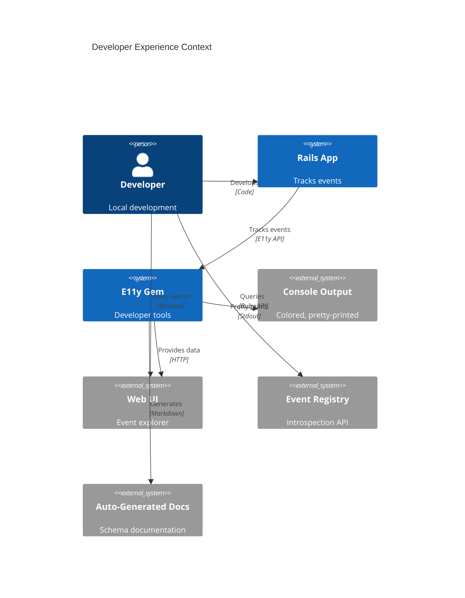
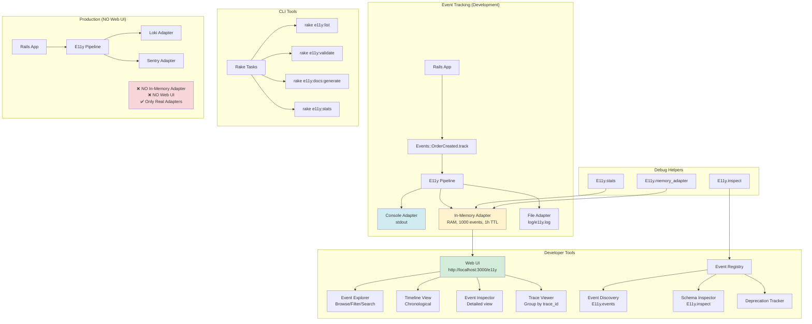
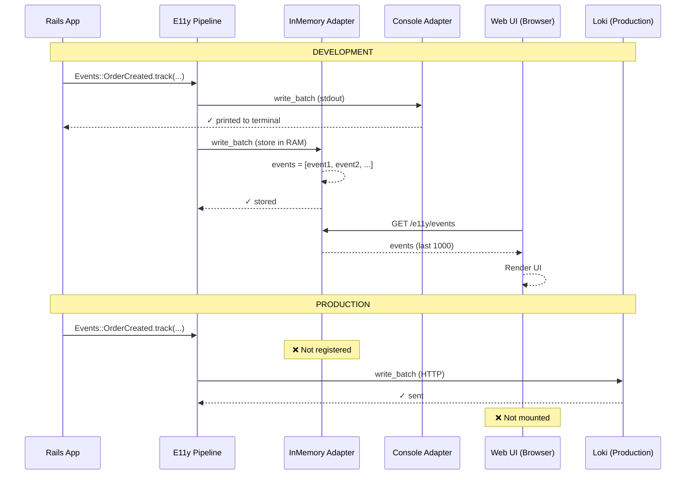

# ADR-010: Developer Experience

**Status:** Draft  
**Date:** January 12, 2026  
**Covers:** UC-017 (Local Development), UC-022 (Event Registry)  
**Depends On:** ADR-001 (Core), ADR-011 (Testing), ADR-012 (Event Evolution)

---

## 📋 Table of Contents

1. [Context & Problem](#1-context--problem)
2. [Architecture Overview](#2-architecture-overview)
3. [Console Output](#3-console-output)
4. [Web UI](#4-web-ui)
5. [Event Registry](#5-event-registry)
6. [Debug Helpers](#6-debug-helpers)
7. [CLI Tools](#7-cli-tools)
8. [Documentation Generation](#8-documentation-generation)
9. [Trade-offs](#9-trade-offs)

---

## 1. Context & Problem

### 1.1. Problem Statement

**Current Pain Points:**

1. **Poor Local Development:**
   ```ruby
   # ❌ No visibility into tracked events
   Events::OrderCreated.track(order_id: 123)
   # Where did this event go? 🤷
   # Check logs? Database? Nothing!
   ```

2. **No Event Discovery:**
   ```ruby
   # ❌ How do I know what events exist?
   # What's the schema for OrderCreated?
   # Which events are deprecated?
   ```

3. **Debug Difficulty:**
   ```ruby
   # ❌ Can't inspect event pipeline
   # What adapters received the event?
   # Was it sampled? Filtered?
   ```

4. **No Visual Tools:**
   ```ruby
   # ❌ Command-line only
   # No UI to browse events
   # No timeline view
   ```

### 1.1.1. Architecture Decision: File-Based Event Store (JSONL)

**Key Insight:** Web UI runs **ONLY in development/test**, using structured JSONL log file:

```ruby
# Development: Events stored in JSONL file (Web UI accessible)
# Production: NO dev log, NO Web UI

# config/environments/development.rb
E11y.configure do |config|
  # ✅ File-based adapter for Web UI (dev only!)
  config.adapters.register :dev_log, E11y::Adapters::DevLog.new(
    path: Rails.root.join('log', 'e11y_dev.jsonl'),
    max_lines: 10_000,      # Keep last 10K events
    max_size: 10.megabytes, # Auto-rotate at 10MB
    enable_watcher: true    # File watching for near-realtime
  )
  
  # Console adapter for immediate feedback
  config.adapters.register :console, E11y::Adapters::Console.new(
    colorize: true,
    pretty_print: true
  )
end

# config/environments/production.rb
E11y.configure do |config|
  # ❌ NO dev_log adapter in production!
  # ❌ NO Web UI in production!
  
  # Real adapters only
  config.adapters.register :loki, E11y::Adapters::Loki.new(...)
  config.adapters.register :sentry, E11y::Adapters::Sentry.new(...)
end
```

**Why File-Based (JSONL)?**

| Approach | Pros | Cons | Decision |
|----------|------|------|----------|
| **A) Query Loki/ES** | Real data | Slow, requires infrastructure | ❌ Too complex |
| **B) Store in Redis** | Fast, real-time | Requires Redis in dev | ❌ Extra dependency |
| **C) Store in DB** | Persistent | Pollutes DB | ❌ Not isolated |
| **D) In-Memory** | Fast | **Broken for multi-process** | ❌ Doesn't work |
| **E) File (JSONL)** | Multi-process, zero deps, persistent | Read overhead (~50ms) | ✅ **CHOSEN** |

**Why JSONL format?**
- ✅ **Multi-process safe** (append-only writes)
- ✅ **Zero dependencies** (just filesystem)
- ✅ **Persistence** (survives restarts)
- ✅ **Greppable**: `tail -f log/e11y_dev.jsonl | jq`
- ✅ **Near-realtime** (3-second polling)
- ✅ **Auto-rotation** (won't grow infinitely)

**Trade-off:** ~50ms read latency vs zero dependencies + multi-process support.

### 1.2. Goals

**Primary Goals:**
- ✅ **Beautiful console output** (colored, pretty-printed)
- ✅ **Web UI** for event exploration
- ✅ **Event Registry** API (find, event_classes, where, to_documentation)
- ✅ **Debug helpers** (E11y.stats, E11y.events)
- ✅ **CLI tools** (rake tasks)
- ✅ **Auto-generated docs** from event schemas

**Non-Goals:**
- ❌ Production-grade Web UI (dev only)
- ❌ Complex event filtering (v1.0 basic)
- ❌ Real-time event streaming

### 1.3. Success Metrics

| Metric | Target | Critical? |
|--------|--------|-----------|
| **Setup time** | <1 minute | ✅ Yes |
| **Event discovery** | 100% visible | ✅ Yes |
| **Debug speed** | <30 seconds | ✅ Yes |
| **Documentation coverage** | 100% auto-generated | ✅ Yes |

---

## 2. Architecture Overview

### 2.1. System Context



### 2.2. Component Architecture (Development Environment)



---

### 2.3. Data Flow: Development vs Production



---

## 3. Console Output

### 3.1. Pretty Console Adapter

```ruby
# lib/e11y/adapters/console.rb
module E11y
  module Adapters
    class Console < Base
      def initialize(config = {})
        super(name: :console)
        @colorize = config[:colorize] != false
        @pretty_print = config[:pretty_print] != false
        @show_payload = config[:show_payload] != false
        @show_metadata = config[:show_metadata] || false
      end
      
      def write_batch(events)
        events.each do |event|
          print_event(event)
        end
        
        { success: true, sent: events.size }
      end
      
      private
      
      def print_event(event)
        output = []
        
        # Header with timestamp and severity
        output << format_header(event)
        
        # Event name
        output << format_event_name(event)
        
        # Payload (if enabled)
        if @show_payload
          output << format_payload(event[:payload])
        end
        
        # Metadata (if enabled)
        if @show_metadata
          output << format_metadata(event)
        end
        
        # Separator
        output << colorize('─' * 80, :gray)
        
        puts output.join("\n")
      end
      
      def format_header(event)
        timestamp = Time.parse(event[:timestamp]).strftime('%H:%M:%S.%L')
        severity = event[:severity].to_s.upcase.ljust(8)
        
        colorize("#{timestamp} #{severity}", severity_color(event[:severity]))
      end
      
      def format_event_name(event)
        event_name = event[:event_name]
        
        "  #{colorize('→', :cyan)} #{colorize(event_name, :white, :bold)}"
      end
      
      def format_payload(payload)
        return '' if payload.empty?
        
        lines = []
        lines << "  #{colorize('Payload:', :yellow)}"
        
        payload.each do |key, value|
          formatted_value = format_value(value)
          lines << "    #{colorize(key.to_s, :green)}: #{formatted_value}"
        end
        
        lines.join("\n")
      end
      
      def format_metadata(event)
        lines = []
        lines << "  #{colorize('Metadata:', :yellow)}"
        
        metadata = {
          trace_id: event[:trace_id],
          span_id: event[:span_id],
          adapters: event[:adapters]&.join(', ')
        }.compact
        
        metadata.each do |key, value|
          lines << "    #{colorize(key.to_s, :magenta)}: #{value}"
        end
        
        lines.join("\n")
      end
      
      def format_value(value)
        case value
        when String
          colorize("\"#{truncate(value, 50)}\"", :cyan)
        when Numeric
          colorize(value.to_s, :blue)
        when TrueClass, FalseClass
          colorize(value.to_s, :yellow)
        when NilClass
          colorize('nil', :gray)
        when Array
          colorize("[#{value.size} items]", :magenta)
        when Hash
          colorize("{#{value.size} keys}", :magenta)
        else
          value.to_s
        end
      end
      
      def severity_color(severity)
        case severity.to_sym
        when :debug then :gray
        when :info then :white
        when :success then :green
        when :warn then :yellow
        when :error then :red
        when :fatal then :red
        else :white
        end
      end
      
      def colorize(text, color, style = nil)
        return text unless @colorize
        
        codes = []
        
        # Colors
        codes << case color
        when :gray then 90
        when :red then 31
        when :green then 32
        when :yellow then 33
        when :blue then 34
        when :magenta then 35
        when :cyan then 36
        when :white then 37
        else 0
        end
        
        # Styles
        codes << 1 if style == :bold
        codes << 4 if style == :underline
        
        "\e[#{codes.join(';')}m#{text}\e[0m"
      end
      
      def truncate(string, length)
        string.length > length ? "#{string[0...length]}..." : string
      end
    end
  end
end
```

### 3.2. Example Output

```
18:42:31.123 INFO    
  → Events::OrderCreated
  Payload:
    order_id: 12345
    user_id: 678
    amount: 99.99
    currency: "USD"
  Metadata:
    trace_id: 0af7651916cd43dd8448eb211c80319c
    adapters: loki, sentry
────────────────────────────────────────────────────────────────────────────────
```

### 3.3. Configuration

```ruby
# config/environments/development.rb
E11y.configure do |config|
  config.adapters.register :console, E11y::Adapters::Console.new(
    colorize: true,
    pretty_print: true,
    show_payload: true,
    show_metadata: true
  )
end
```

---

## 4. Web UI

### 4.0. DevLog Adapter (File-Based JSONL Data Source)

**Web UI reads events from structured JSONL log file:**

```ruby
# lib/e11y/adapters/dev_log.rb
module E11y
  module Adapters
    class DevLog < Base
      attr_reader :file_path
      
      def initialize(config = {})
        super(name: :dev_log)
        @file_path = config[:path] || Rails.root.join('log', 'e11y_dev.jsonl')
        @max_lines = config[:max_lines] || 10_000
        @max_size = config[:max_size] || 10.megabytes
        @enable_watcher = config[:enable_watcher] != false
        @mutex = Mutex.new
        
        # Cache for Web UI (invalidated on file change)
        @cache = nil
        @cache_mtime = nil
        
        setup_file_watcher if @enable_watcher
      end
      
      # ===================================================================
      # ADAPTER INTERFACE (Write events)
      # ===================================================================
      
      def write_batch(events)
        @mutex.synchronize do
          FileUtils.mkdir_p(File.dirname(@file_path))
          
          File.open(@file_path, 'a') do |f|
            # Exclusive lock for multi-process safety
            f.flock(File::LOCK_EX)
            
            events.each do |event|
              # JSONL format: one JSON object per line
              f.puts({
                id: SecureRandom.uuid,
                timestamp: event[:timestamp],
                event_name: event[:event_name],
                severity: event[:severity],
                payload: event[:payload],
                trace_id: event[:trace_id],
                span_id: event[:span_id],
                metadata: event[:metadata]
              }.to_json)
            end
            
            f.flock(File::LOCK_UN)
          end
          
          # Auto-rotate if needed
          rotate_if_needed!
          
          # Invalidate cache
          @cache = nil
        end
        
        { success: true, sent: events.size }
      end
      
      # ===================================================================
      # WEB UI API (Read events)
      # ===================================================================
      
      # Get all events (cached for performance)
      def stored_events(limit: 1000)
        # Check if file changed
        if cache_valid?
          return @cache
        end
        
        # Read and parse file
        @cache = read_events(limit)
        @cache_mtime = file_mtime
        @cache
      rescue Errno::ENOENT
        []
      end
      
      # Get event by ID (scan file)
      def find_event(id)
        return nil unless File.exist?(@file_path)
        
        # Reverse scan for better performance (recent events first)
        File.readlines(@file_path).reverse.each do |line|
          event = JSON.parse(line, symbolize_names: true)
          return event if event[:id] == id
        end
        
        nil
      rescue JSON::ParserError
        nil
      end
      
      # Filter by event name
      def events_by_name(event_name, limit: 1000)
        stored_events(limit: limit * 2).select { |e| e[:event_name] == event_name }.first(limit)
      end
      
      # Filter by severity
      def events_by_severity(severity, limit: 1000)
        stored_events(limit: limit * 2).select { |e| e[:severity] == severity }.first(limit)
      end
      
      # Filter by trace_id
      def events_by_trace(trace_id)
        stored_events(limit: 10_000).select { |e| e[:trace_id] == trace_id }
      end
      
      # Search in payload
      def search(query, limit: 1000)
        query_downcase = query.downcase
        stored_events(limit: limit * 2).select do |event|
          event.to_json.downcase.include?(query_downcase)
        end.first(limit)
      end
      
      # Clear all events (for Web UI "Clear" button)
      def clear!
        @mutex.synchronize do
          File.delete(@file_path) if File.exist?(@file_path)
          @cache = nil
        end
      end
      
      # Statistics
      def stats
        events = stored_events(limit: 10_000)
        
        {
          total_events: events.size,
          file_size: file_size_human,
          by_severity: events.group_by { |e| e[:severity] }.transform_values(&:count),
          by_event_name: events.group_by { |e| e[:event_name] }.transform_values(&:count),
          oldest_event: events.first&.dig(:timestamp),
          newest_event: events.last&.dig(:timestamp)
        }
      end
      
      # Near-realtime: check if file updated since last read
      def updated_since?(timestamp)
        file_mtime > timestamp
      rescue Errno::ENOENT
        false
      end
      
      private
      
      # ===================================================================
      # CACHE & PERFORMANCE
      # ===================================================================
      
      def cache_valid?
        @cache && @cache_mtime && file_mtime == @cache_mtime
      end
      
      def file_mtime
        File.mtime(@file_path)
      rescue Errno::ENOENT
        Time.at(0)
      end
      
      def read_events(limit)
        return [] unless File.exist?(@file_path)
        
        # Read last N lines (most recent events)
        lines = File.readlines(@file_path).last(limit)
        
        # Parse JSON (with error handling for corrupted lines)
        lines.map do |line|
          JSON.parse(line, symbolize_names: true)
        rescue JSON::ParserError => e
          Rails.logger.warn("E11y: Failed to parse event line: #{e.message}")
          nil
        end.compact.reverse  # Reverse for newest-first
      end
      
      # ===================================================================
      # AUTO-ROTATION
      # ===================================================================
      
      def rotate_if_needed!
        return unless File.exist?(@file_path)
        
        # Check file size
        if File.size(@file_path) > @max_size
          rotate_file!
        end
      end
      
      def rotate_file!
        # Read last 50% of lines
        lines = File.readlines(@file_path)
        keep_lines = lines.last(@max_lines / 2)
        
        # Backup old file
        backup_path = "#{@file_path}.#{Time.now.to_i}.old"
        FileUtils.mv(@file_path, backup_path)
        
        # Write kept lines to new file
        File.write(@file_path, keep_lines.join)
        
        Rails.logger.info("E11y: Rotated log file (kept #{keep_lines.size} events)")
      end
      
      def file_size_human
        size = File.size(@file_path)
        units = ['B', 'KB', 'MB', 'GB']
        unit = 0
        
        while size > 1024 && unit < units.size - 1
          size /= 1024.0
          unit += 1
        end
        
        "#{size.round(2)} #{units[unit]}"
      rescue Errno::ENOENT
        '0 B'
      end
      
      # ===================================================================
      # FILE WATCHER (Near-Realtime Updates)
      # ===================================================================
      
      def setup_file_watcher
        # Use Listen gem for file watching (if available)
        return unless defined?(Listen)
        
        dir = File.dirname(@file_path)
        filename = File.basename(@file_path)
        
        @listener = Listen.to(dir, only: /#{Regexp.escape(filename)}/) do |modified, added, removed|
          # Invalidate cache on file change
          @cache = nil if modified.any? || added.any?
        end
        
        @listener.start
      rescue => e
        Rails.logger.warn("E11y: File watcher setup failed: #{e.message}")
      end
    end
  end
end
```

**Automatic Registration in Development:**

```ruby
# lib/e11y/railtie.rb
module E11y
  class Railtie < Rails::Railtie
    initializer 'e11y.setup_development', after: :load_config_initializers do
      if Rails.env.development? || Rails.env.test?
        # Auto-register file-based adapter for Web UI
        unless E11y.config.adapters[:dev_log]
          E11y.config.adapters.register :dev_log, E11y::Adapters::DevLog.new(
            path: Rails.root.join('log', 'e11y_dev.jsonl'),
            max_lines: ENV['E11Y_MAX_EVENTS']&.to_i || 10_000,
            max_size: (ENV['E11Y_MAX_SIZE']&.to_i || 10).megabytes,
            enable_watcher: true
          )
        end
        
        # Mount Web UI
        Rails.application.routes.prepend do
          mount E11y::WebUI::Engine, at: '/e11y', as: 'e11y_web_ui'
        end
      end
    end
  end
end
```

**Access in Console/Web UI:**

```ruby
# Rails console
>> E11y.dev_log_adapter
=> #<E11y::Adapters::DevLog @file_path="log/e11y_dev.jsonl">

>> E11y.dev_log_adapter.stored_events
=> [{ event_name: 'Events::OrderCreated', payload: {...}, ... }, ...]

>> E11y.dev_log_adapter.clear!
=> nil

# CLI: grep events
$ tail -f log/e11y_dev.jsonl | jq 'select(.severity == "error")'
$ grep "OrderCreated" log/e11y_dev.jsonl | jq .
```

---

### 4.1. Web UI Engine

```ruby
# lib/e11y/web_ui/engine.rb
module E11y
  module WebUI
    class Engine < Rails::Engine
      isolate_namespace E11y::WebUI
      
      config.generators.api_only = false
      
      initializer 'e11y_web_ui.assets' do |app|
        app.config.assets.precompile += %w[e11y_web_ui.css e11y_web_ui.js]
      end
      
      # Mount at /e11y in development
      initializer 'e11y_web_ui.mount', before: :add_routing_paths do |app|
        if Rails.env.development? || Rails.env.test?
          app.routes.prepend do
            mount E11y::WebUI::Engine, at: '/e11y', as: 'e11y_web_ui'
          end
        end
      end
    end
  end
end
```

### 4.2. Web UI Controller

```ruby
# app/controllers/e11y/web_ui/events_controller.rb
module E11y
  module WebUI
    class EventsController < ApplicationController
      layout 'e11y/web_ui/application'
      
      before_action :ensure_development_environment!
      before_action :ensure_dev_log_adapter!
      
      def index
        # ✅ Read from file-based adapter
        @events = dev_log_adapter.stored_events(limit: 1000)
        @event_names = @events.map { |e| e[:event_name] }.uniq.sort
        
        # Filter by event name
        if params[:event_name].present?
          @events = dev_log_adapter.events_by_name(params[:event_name])
        end
        
        # Filter by severity
        if params[:severity].present?
          @events = dev_log_adapter.events_by_severity(params[:severity].to_sym)
        end
        
        # Search
        if params[:q].present?
          @events = dev_log_adapter.search(params[:q])
        end
        
        # Already sorted newest-first by adapter
        
        # Paginate
        @page = params[:page]&.to_i || 1
        @per_page = 50
        @total = @events.size
        @events = @events.drop((@page - 1) * @per_page).first(@per_page)
        
        # Stats for dashboard
        @stats = dev_log_adapter.stats
        
        # For near-realtime polling
        @last_check = Time.now.to_f
      end
      
      def show
        # ✅ Find by ID in file
        @event = dev_log_adapter.find_event(params[:id])
        
        if @event.nil?
          redirect_to events_path, alert: 'Event not found'
        end
      end
      
      def trace
        # Show all events for specific trace_id
        trace_id = params[:trace_id]
        @events = dev_log_adapter.events_by_trace(trace_id)
        
        render :index
      end
      
      def clear
        # ✅ Clear file
        dev_log_adapter.clear!
        redirect_to events_path, notice: 'All events cleared'
      end
      
      def export
        @events = dev_log_adapter.stored_events(limit: 10_000)
        
        respond_to do |format|
          format.json { render json: @events }
          format.csv do
            send_data generate_csv(@events), filename: "events-#{Time.now.to_i}.csv"
          end
        end
      end
      
      # ===================================================================
      # NEAR-REALTIME POLLING
      # ===================================================================
      
      def poll
        # Check if file updated since last check
        last_check_time = Time.at(params[:since].to_f)
        
        if dev_log_adapter.updated_since?(last_check_time)
          # File updated → return new events
          @events = dev_log_adapter.stored_events(limit: 100)
          
          render json: {
            updated: true,
            events: @events,
            timestamp: Time.now.to_f
          }
        else
          # No updates
          render json: {
            updated: false,
            timestamp: Time.now.to_f
          }
        end
      end
      
      private
      
      def ensure_development_environment!
        unless Rails.env.development? || Rails.env.test?
          raise ActionController::RoutingError, 'E11y Web UI is only available in development/test'
        end
      end
      
      def ensure_dev_log_adapter!
        unless dev_log_adapter
          raise 'E11y dev_log adapter not configured. Add to config/environments/development.rb'
        end
      end
      
      def dev_log_adapter
        @dev_log_adapter ||= E11y.config.adapters[:dev_log]
      end
      
      def generate_csv(events)
        require 'csv'
        
        CSV.generate do |csv|
          csv << ['Timestamp', 'Event Name', 'Severity', 'Trace ID', 'Payload']
          
          events.each do |event|
            csv << [
              event[:timestamp],
              event[:event_name],
              event[:severity],
              event[:trace_id],
              event[:payload].to_json
            ]
          end
        end
      end
    end
  end
end
```

**Helper for accessing dev_log adapter:**

```ruby
# lib/e11y.rb
module E11y
  def self.dev_log_adapter
    config.adapters[:dev_log]
  end
  
  # Alias for backward compatibility
  def self.test_adapter
    dev_log_adapter
  end
end
```

### 4.3. Near-Realtime Polling (JavaScript)

```javascript
// app/assets/javascripts/e11y/web_ui/realtime.js
// Near-realtime event polling (every 3 seconds)

class E11yRealtimePoller {
  constructor() {
    this.lastCheck = Date.now() / 1000;  // Unix timestamp
    this.polling = false;
    this.interval = 3000;  // Poll every 3 seconds
    this.pollerId = null;
  }
  
  start() {
    if (this.polling) return;
    
    this.polling = true;
    console.log('[E11y] Starting realtime polling...');
    
    this.pollerId = setInterval(() => {
      this.poll();
    }, this.interval);
  }
  
  stop() {
    if (!this.polling) return;
    
    this.polling = false;
    clearInterval(this.pollerId);
    console.log('[E11y] Stopped realtime polling');
  }
  
  async poll() {
    try {
      const response = await fetch(`/e11y/poll?since=${this.lastCheck}`);
      const data = await response.json();
      
      if (data.updated) {
        console.log('[E11y] New events detected, refreshing...');
        this.onUpdate(data.events);
      }
      
      this.lastCheck = data.timestamp;
    } catch (error) {
      console.error('[E11y] Polling error:', error);
    }
  }
  
  onUpdate(events) {
    // Show notification badge
    const badge = document.querySelector('.e11y-new-events-badge');
    if (badge) {
      badge.textContent = `${events.length} new`;
      badge.style.display = 'inline-block';
    }
    
    // Optional: Auto-refresh page
    const autoRefresh = document.querySelector('[data-e11y-auto-refresh]');
    if (autoRefresh && autoRefresh.checked) {
      window.location.reload();
    }
  }
}

// Auto-start on page load
document.addEventListener('DOMContentLoaded', () => {
  const eventsPage = document.querySelector('[data-e11y-events-page]');
  
  if (eventsPage) {
    window.e11yPoller = new E11yRealtimePoller();
    window.e11yPoller.start();
    
    // Stop polling when page hidden (save resources)
    document.addEventListener('visibilitychange', () => {
      if (document.hidden) {
        window.e11yPoller.stop();
      } else {
        window.e11yPoller.start();
      }
    });
  }
});
```

### 4.4. Web UI Routes

```ruby
# config/routes.rb (E11y::WebUI::Engine)
E11y::WebUI::Engine.routes.draw do
  root to: 'dashboard#index'
  
  resources :events, only: [:index, :show] do
    collection do
      delete :clear
      get :export
      get :poll  # ← Near-realtime polling endpoint
    end
  end
  
  resources :registry, only: [:index, :show]
  resources :stats, only: [:index]
  
  get '/timeline', to: 'timeline#index'
  get '/inspector/:id', to: 'inspector#show', as: :inspector
end
```

### 4.5. Web UI Views (Simplified)

```erb
<!-- app/views/e11y/web_ui/events/index.html.erb -->
<div class="e11y-container" data-e11y-events-page>
  <header>
    <h1>
      E11y Event Explorer
      <span class="e11y-new-events-badge" style="display: none;">
        0 new
      </span>
    </h1>
    
    <div class="actions">
      <label class="e11y-auto-refresh">
        <input type="checkbox" data-e11y-auto-refresh />
        Auto-refresh on new events
      </label>
      
      <%= link_to 'Refresh Now', events_path, class: 'btn btn-primary' %>
      <%= link_to 'Clear All', clear_events_path, method: :delete, 
          data: { confirm: 'Clear all events?' }, class: 'btn btn-danger' %>
      <%= link_to 'Export JSON', export_events_path(format: :json), class: 'btn btn-secondary' %>
      <%= link_to 'Export CSV', export_events_path(format: :csv), class: 'btn btn-secondary' %>
    </div>
  </header>
  
  <div class="filters">
    <%= form_with url: events_path, method: :get, local: true do |f| %>
      <%= f.select :event_name, @event_names, { include_blank: 'All Events' }, 
          class: 'form-select', onchange: 'this.form.submit()' %>
    <% end %>
  </div>
  
  <div class="events-list">
    <% @events.each do |event| %>
      <div class="event-card <%= event[:severity] %>">
        <div class="event-header">
          <span class="event-time"><%= event[:timestamp] %></span>
          <span class="event-severity <%= event[:severity] %>">
            <%= event[:severity].to_s.upcase %>
          </span>
          <span class="event-name"><%= event[:event_name] %></span>
        </div>
        
        <div class="event-payload">
          <pre><%= JSON.pretty_generate(event[:payload]) %></pre>
        </div>
        
        <div class="event-meta">
          <span>Trace: <%= event[:trace_id] %></span>
          <%= link_to 'Inspect', inspector_path(event[:id]), class: 'btn-link' %>
        </div>
      </div>
    <% end %>
  </div>
  
  <div class="pagination">
    <%= link_to_previous_page @events, 'Previous' %>
    Page <%= @page %>
    <%= link_to_next_page @events, 'Next' %>
  </div>
  
  <!-- CSS for near-realtime badge -->
  <style>
    .e11y-new-events-badge {
      background: #28a745;
      color: white;
      padding: 4px 12px;
      border-radius: 16px;
      font-size: 0.75em;
      font-weight: 600;
      margin-left: 12px;
      animation: pulse 1.5s ease-in-out infinite;
      box-shadow: 0 2px 8px rgba(40, 167, 69, 0.3);
    }
    
    @keyframes pulse {
      0%, 100% { 
        opacity: 1; 
        transform: scale(1);
      }
      50% { 
        opacity: 0.6; 
        transform: scale(1.05);
      }
    }
    
    .e11y-auto-refresh {
      display: inline-flex;
      align-items: center;
      gap: 8px;
      padding: 8px 16px;
      background: #f8f9fa;
      border-radius: 6px;
      cursor: pointer;
      transition: background 0.2s;
    }
    
    .e11y-auto-refresh:hover {
      background: #e9ecef;
    }
    
    .e11y-auto-refresh input[type="checkbox"] {
      cursor: pointer;
    }
  </style>
</div>
```

**CLI Usage:**

```bash
# Watch events in realtime
$ tail -f log/e11y_dev.jsonl | jq

# Filter by severity
$ grep '"severity":"error"' log/e11y_dev.jsonl | jq

# Filter by event name
$ grep 'OrderCreated' log/e11y_dev.jsonl | jq

# Count events by severity
$ cat log/e11y_dev.jsonl | jq -r '.severity' | sort | uniq -c

# Last 10 events
$ tail -10 log/e11y_dev.jsonl | jq
```

---

## 5. Event Registry

### 5.1. Registry API (Extended from ADR-012)

```ruby
# lib/e11y/registry.rb
module E11y
  class Registry
    # Core methods (implemented)
    def self.find(event_name, version: nil)      # Find event class by name
    def self.event_classes                       # All registered event classes
    def self.where(severity:, adapter:, version:) # Filter by criteria
    def self.to_documentation                    # Documentation hash for all events
    def self.size                                # Number of unique event names
  end
end
```

### 5.2. Registry Console API

```ruby
# Rails console helpers
# E11y.events — delegates to Registry.event_classes (event names)
# E11y.stats  — config info (enabled, adapters, buffer)
# E11y.adapters — list registered adapters
```

### 5.3. Usage Examples

```ruby
# Rails console
>> E11y.events
=> ["order.created", "order.paid", "payment.processed"]

>> E11y.registry.find("order.created")
=> Events::OrderCreated

>> E11y.registry.where(severity: :error)
=> [Events::PaymentFailed, ...]
```

---

## 6. Debug Helpers

### 6.1. Pipeline Inspector

```ruby
# lib/e11y/debug/pipeline_inspector.rb
module E11y
  module Debug
    class PipelineInspector
      def self.trace_event(event_class, payload)
        puts colorize("🔍 Tracing Event Pipeline", :cyan, :bold)
        puts ""
        
        # Step 1: Validation
        trace_step("Validation") do
          event_class.validate_payload(payload)
        end
        
        # Step 2: PII Filtering
        trace_step("PII Filtering") do
          filtered = E11y::Security::PIIFilter.filter(payload)
          puts "  Filtered fields: #{filtered.keys.join(', ')}" if filtered.any?
        end
        
        # Step 3: Sampling
        trace_step("Sampling") do
          sampled = E11y::Sampler.should_sample?(event_class, payload)
          puts "  Decision: #{sampled ? 'SAMPLED' : 'DROPPED'}"
        end
        
        # Step 4: Rate Limiting
        trace_step("Rate Limiting") do
          allowed = E11y::RateLimiter.allow?(event_class, payload)
          puts "  Decision: #{allowed ? 'ALLOWED' : 'RATE LIMITED'}"
        end
        
        # Step 5: Adapter Routing
        trace_step("Adapter Routing") do
          adapters = E11y::Router.route(event_class, payload)
          puts "  Target adapters: #{adapters.join(', ')}"
        end
        
        # Step 6: Buffering
        trace_step("Buffering") do
          buffer_size = E11y::Buffer.size
          puts "  Current buffer: #{buffer_size} events"
        end
        
        puts ""
        puts colorize("✅ Pipeline trace complete", :green, :bold)
      end
      
      private
      
      def self.trace_step(name, &block)
        print colorize("  #{name}... ", :yellow)
        
        begin
          block.call
          puts colorize("✓", :green)
        rescue => error
          puts colorize("✗ #{error.message}", :red)
        end
      end
      
      def self.colorize(text, color, style = nil)
        # Same as Console adapter
      end
    end
  end
end
```

### 6.2. Usage

```ruby
# Rails console
>> E11y::Debug::PipelineInspector.trace_event(Events::OrderCreated, {
     order_id: 123,
     user_id: 456,
     amount: 99.99,
     credit_card: '4111-1111-1111-1111'  # PII
   })

🔍 Tracing Event Pipeline

  Validation... ✓
  PII Filtering... ✓
    Filtered fields: credit_card
  Sampling... ✓
    Decision: SAMPLED
  Rate Limiting... ✓
    Decision: ALLOWED
  Adapter Routing... ✓
    Target adapters: loki, sentry
  Buffering... ✓
    Current buffer: 5 events

✅ Pipeline trace complete
```

---

## 7. CLI Tools

### 7.1. Rake Tasks

```ruby
# lib/tasks/e11y.rake
namespace :e11y do
  desc 'List all registered events'
  task list: :environment do
    puts "E11y Event Registry"
    puts "=" * 80
    puts ""
    
    E11y::Registry.event_classes.each do |event_class|
      name = event_class.respond_to?(:event_name) ? event_class.event_name : event_class.name
      severity = event_class.respond_to?(:severity) ? event_class.severity : "—"
      adapters = event_class.respond_to?(:adapters) ? Array(event_class.adapters).join(", ") : "—"
      puts "#{event_class.name} (#{name})"
      puts "  Severity: #{severity}, Adapters: #{adapters}"
      puts ""
    end
    
    puts "=" * 80
    puts "Total: #{E11y::Registry.size} event names, #{E11y::Registry.event_classes.size} classes"
  end
  
  desc 'Validate all event schemas'
  task validate: :environment do
    puts "Validating E11y Event Schemas"
    puts "=" * 80
    
    errors = []
    
    E11y::Registry.event_classes.each do |event_class|
      begin
        # Check if schema is defined
        unless event_class.respond_to?(:schema)
          errors << "#{event_class.name}: Missing schema definition"
          next
        end
        
        # Validate schema syntax
        schema = event_class.schema
        
        puts "✓ #{event_class.name}"
      rescue => error
        errors << "#{event_class.name}: #{error.message}"
        puts "✗ #{event_class.name}: #{error.message}"
      end
    end
    
    puts ""
    puts "=" * 80
    
    if errors.empty?
      puts "✅ All schemas valid"
    else
      puts "❌ #{errors.size} errors found:"
      errors.each { |e| puts "  - #{e}" }
      exit 1
    end
  end
  
  desc 'Generate event documentation'
  task 'docs:generate' => :environment do
    require 'e11y/documentation/generator'
    
    puts "Generating E11y Documentation"
    puts "=" * 80
    
    output_dir = Rails.root.join('docs', 'events')
    FileUtils.mkdir_p(output_dir)
    
    E11y::Documentation::Generator.generate(output_dir)
    
    puts ""
    puts "✅ Documentation generated in #{output_dir}"
  end
  
  desc 'Show E11y statistics'
  task stats: :environment do
    puts "E11y Statistics"
    puts "=" * 80
    puts ""
    puts "Event names: #{E11y::Registry.size}"
    puts "Event classes: #{E11y::Registry.event_classes.size}"
  end
end
```

---

## 8. Documentation Generation

### 8.1. Documentation Generator

```ruby
# lib/e11y/documentation/generator.rb
module E11y
  module Documentation
    class Generator
      def self.generate(output_dir)
        # Generate index
        generate_index(output_dir)
        
        # Generate per-event documentation
        generate_event_docs(output_dir)
        
        # Generate catalog
        generate_catalog(output_dir)
      end
      
      private
      
      def self.generate_index(output_dir)
        content = <<~MARKDOWN
          # E11y Event Documentation
          
          Auto-generated documentation for all events in this application.
          
          **Last updated:** #{Time.now}
          
          ## Statistics
          
          - Event names: #{E11y::Registry.size}
          - Event classes: #{E11y::Registry.event_classes.size}
          
          ## Events
          
          #{generate_event_list}
        MARKDOWN
        
        File.write(output_dir.join('README.md'), content)
      end
      
      def self.generate_event_list
        E11y::Registry.to_documentation.map do |doc|
          name = doc[:name] || doc[:class]
          "- [#{doc[:class]}](#{doc[:class].gsub('::', '_')}.md)"
        end.join("\n")
      end
      
      def self.generate_event_docs(output_dir)
        E11y::Registry.event_classes.each do |event_class|
          content = <<~MARKDOWN
            # #{event_class.name}
            
            **Severity:** #{event_class.respond_to?(:severity) ? event_class.severity : "—"}  
            **Adapters:** #{event_class.respond_to?(:adapters) ? Array(event_class.adapters).join(", ") : "—"}
            
            ## Schema
            
            ```ruby
            #{generate_schema_example(event_class)}
            ```
            
            ## Usage
            
            ```ruby
            #{event_class.name}.track(
              #{generate_payload_example(event_class)}
            )
            ```
          MARKDOWN
            
          filename = event_class.name.gsub("::", "_") + ".md"
          File.write(output_dir.join(filename), content)
        end
      end
      
      def self.generate_schema_example(event_class)
        doc = E11y::Registry.to_documentation.find { |d| d[:class] == event_class.name }
        return "" unless doc && doc[:schema_keys]
        
        doc[:schema_keys].map { |key| "required(:#{key}).filled(:string)" }.join("\n")
      end
      
      def self.generate_payload_example(event_class)
        doc = E11y::Registry.to_documentation.find { |d| d[:class] == event_class.name }
        return "" unless doc && doc[:schema_keys]
        
        doc[:schema_keys].map { |key| "#{key}: 'example'" }.join(",\n  ")
      end
      
      def self.generate_version_history(versions)
        versions.reverse.map do |version|
          deprecated = version.deprecated? ? ' **(DEPRECATED)**' : ''
          "- **v#{version.event_version}**#{deprecated}"
        end.join("\n")
      end
      
      def self.generate_examples(event_class)
        <<~MARKDOWN
          ### Basic Example
          
          ```ruby
          #{event_class.name}.track(
            #{generate_payload_example(event_class)}
          )
          ```
          
          ### With Duration
          
          ```ruby
          #{event_class.name}.track_with_duration do
            # Your code here
          end
          ```
        MARKDOWN
      end
      
      def self.generate_catalog(output_dir)
        content = <<~MARKDOWN
          # Event Catalog
          
          Complete catalog of all events grouped by severity and adapter.
          
          ## By Severity
          
          #{generate_by_severity}
          
          ## By Adapter
          
          #{generate_by_adapter}
        MARKDOWN
        
        File.write(output_dir.join('CATALOG.md'), content)
      end
      
      def self.generate_by_severity
        %i[debug info warn error fatal].map do |severity|
          events = E11y::Registry.where(severity: severity)
          next if events.empty?
          
          <<~MARKDOWN
            ### #{severity.to_s.capitalize} (#{events.size})
            
            #{events.map { |e| "- #{e.name}" }.join("\n")}
          MARKDOWN
        end.compact.join("\n")
      end
      
      def self.generate_by_adapter
        adapters = E11y::Registry.event_classes.flat_map { |e| Array(e.adapters) }.uniq
        adapters.map do |adapter|
          events = E11y::Registry.where(adapter: adapter)
          <<~MARKDOWN
            ### #{adapter} (#{events.size})
            
            #{events.map { |e| "- #{e.name}" }.join("\n")}
          MARKDOWN
        end.join("\n")
      end
    end
  end
end
```

---

## 9. Trade-offs

### 9.1. Key Decisions

| Decision | Pro | Con | Rationale |
|----------|-----|-----|-----------|
| **Console adapter** | Beautiful DX | Performance overhead | Dev only |
| **Web UI** | Visual exploration | Maintenance burden | Critical for DX |
| **File-based JSONL** | Multi-process, persistent, zero deps | ~50ms read latency | Multi-process support > speed |
| **Near-realtime (3s)** | Simple, no WebSocket | 3s delay | Good enough for dev |
| **Event Registry** | find, event_classes, where, to_documentation | — | Core DX |
| **Auto-generated docs** | Always up-to-date | Limited customization | Consistency |
| **Dev-only features** | Safe | Not in production | Clear separation |
| **Max 10K events** | Auto-rotation | Limited history | Enough for debugging |
| **Auto-rotate at 10MB** | Controlled size | File ops overhead | Prevents infinite growth |

### 9.2. Alternatives Considered

**A) In-Memory adapter**
```ruby
# ❌ REJECTED: Broken for multi-process!
Puma 4 workers → 4 separate memory stores
Web UI request → random worker → sees only 25% of events
```
- ❌ Rejected: Doesn't work with Puma/Unicorn
- ✅ Chosen: File-based (multi-process safe)

**B) Query Loki/Elasticsearch for Web UI**
```ruby
# ❌ REJECTED
def index
  @events = Loki.query('...')  # Requires Loki in dev!
end
```
- ❌ Requires infrastructure in dev (Loki, ES)
- ❌ Slow queries (HTTP, parsing)
- ❌ Complex setup for developers
- ❌ Can't work offline

**C) Store events in Redis**
```ruby
# ❌ REJECTED
config.adapters.register :redis, E11y::Adapters::Redis.new
```
- ✅ Persistent across restarts
- ✅ Multi-process safe
- ❌ Requires Redis in dev
- ❌ Extra dependency

**D) Store events in Database**
```ruby
# ❌ REJECTED
create_table :e11y_events do |t|
  t.string :event_name
  t.json :payload
  ...
end
```
- ✅ Persistent
- ✅ Multi-process safe
- ❌ Pollutes application database
- ❌ Migration needed
- ❌ Not isolated from app data

**E) File-Based JSONL (CHOSEN) ✅**
```ruby
# ✅ CHOSEN
config.adapters.register :dev_log, E11y::Adapters::DevLog.new(
  path: Rails.root.join('log', 'e11y_dev.jsonl'),
  max_lines: 10_000,
  max_size: 10.megabytes
)
```
- ✅ Zero dependencies
- ✅ Multi-process safe (append-only file)
- ✅ Persistent across restarts
- ✅ Isolated (no DB pollution)
- ✅ Greppable: `tail -f | jq`
- ✅ Auto-rotation
- ✅ Thread-safe (mutex + file locking)
- ⚠️ ~50ms read latency (acceptable for dev)

**F) WebSocket for realtime**
```ruby
# ❌ REJECTED: Too complex for dev
# Requires Action Cable, Redis, WebSocket setup
```
- ❌ Rejected: Overkill for development
- ✅ **CHOSEN**: Polling every 3 seconds (simple, good enough)

**G) No Web UI**
- ❌ Rejected: Too important for DX

**H) Separate gem for Web UI**
- ❌ Rejected: Adds complexity

**G) Manual documentation**
- ❌ Rejected: Gets out of sync

**H) No console output**
- ❌ Rejected: Critical for debugging

---

### 9.3. Why In-Memory is Right Choice for Development

**Development Workflow:**
```
1. Developer changes code
2. Server restarts (automatically)
3. Developer tests feature
4. Views events in Web UI ← Fresh data from current session
5. Repeats
```

**Key Insight:** File-based storage provides persistence across restarts!
- Events survive server restarts (helpful for debugging)
- Multi-process safe (works with Puma/Unicorn)
- Auto-rotation keeps file size manageable
- 10K events + 10MB limit → sufficient for dev sessions

**Disk Usage:**
```bash
# Typical:
10,000 events × ~500 bytes/event = ~5MB disk
```
→ Negligible overhead

**Comparison:**

| Metric | File-Based JSONL | Redis | Database | Loki Query |
|--------|------------------|-------|----------|------------|
| **Setup** | 0 min | 5 min | 2 min | 30 min |
| **Dependencies** | None | Redis | Migration | Loki + Docker |
| **Write** | ~0.1ms | ~1ms | ~20ms | ~500ms |
| **Read** | ~50ms | ~5ms | ~30ms | ~500ms |
| **Persistence** | ✅ | ✅ | ✅ | ✅ |
| **Multi-process** | ✅ | ✅ | ✅ | ✅ |
| **Offline** | ✅ | ❌ | ✅ | ❌ |
| **Disk/Memory** | ~5MB | ~10MB | ~10MB | 0MB |
| **Cleanup** | Auto | Manual | Manual | N/A |
| **CLI friendly** | ✅ `tail -f` | ❌ | ❌ | ❌ |

**Winner:** File-Based JSONL (best DX, zero friction, multi-process safe)

---

### 9.4. Production Safety

**How we prevent dev_log adapter in production:**

```ruby
# lib/e11y/railtie.rb
initializer 'e11y.setup_development' do
  # ✅ Only auto-register in dev/test
  if Rails.env.development? || Rails.env.test?
    E11y.config.adapters.register :dev_log, E11y::Adapters::DevLog.new(
      path: Rails.root.join('log', 'e11y_dev.jsonl')
    )
  end
end

# lib/e11y/web_ui/engine.rb
initializer 'e11y_web_ui.mount' do |app|
  # ✅ Only mount Web UI in dev/test
  if Rails.env.development? || Rails.env.test?
    app.routes.prepend do
      mount E11y::WebUI::Engine, at: '/e11y'
    end
  end
end
```

**What happens if someone tries to mount in production?**

```ruby
# config/routes.rb (production)
mount E11y::WebUI::Engine, at: '/e11y'  # ❌ Will raise error!

# app/controllers/e11y/web_ui/events_controller.rb
before_action :ensure_development_environment!

def ensure_development_environment!
  unless Rails.env.development? || Rails.env.test?
    raise ActionController::RoutingError, 
          'E11y Web UI is only available in development/test'
  end
end
```

→ **Fail-safe:** Web UI physically cannot work in production

---

## 10. FAQ: File-Based Adapter & Web UI

### Q1: Why do events persist across server restarts?

**A:** This is a **feature!** File-based storage provides persistence:
- Events survive server restarts (helpful for debugging)
- Can review events from previous sessions
- No data loss on server restart

If you want to clear old events:
```bash
rm log/e11y_dev.jsonl
# or via Web UI: "Clear All" button
```

### Q2: What if I need >10,000 events?

**A:** Increase limits:
```ruby
config.adapters.register :dev_log, E11y::Adapters::DevLog.new(
  path: Rails.root.join('log', 'e11y_dev.jsonl'),
  max_lines: 50_000,    # 50K events
  max_size: 50.megabytes # 50MB
)
```

But note: **10K events is sufficient for 99% dev use cases**.

### Q3: Can I use Web UI in production?

**A:** **NO!** Web UI is physically blocked in production:
- `before_action :ensure_development_environment!` → raises error
- dev_log adapter not registered in production
- Web UI routes not mounted in production

For production → use Grafana + Loki.

### Q4: What if I want to query Loki from Web UI?

**A:** Possible, but not recommended for v1.0:

```ruby
# lib/e11y/adapters/loki_query.rb (future feature)
module E11y
  module Adapters
    class LokiQuery
      def stored_events(limit: 1000)
        Loki.query('{app="myapp"}', limit: limit)
      end
    end
  end
end

# Web UI controller (future)
def index
  if params[:source] == 'loki'
    @events = E11y::Adapters::LokiQuery.new.stored_events
  else
    @events = memory_adapter.events  # Default (InMemory)
  end
end
```

**Trade-off:**
- ✅ Real production data
- ❌ Requires Loki setup in dev
- ❌ Slow queries (~500ms)
- ❌ Complex auth

→ **Decision:** Deferred to v1.1+ (YAGNI for v1.0)

### Q5: How do events appear in Web UI?

**A:** Flow:
```
1. Events::OrderCreated.track(...)
2. → E11y Pipeline
3. → DevLog Adapter (if registered)
4. → adapter.write_batch([event])
5. → Append to log/e11y_dev.jsonl
6. → Web UI reads file (cached)
```

Web UI **does not create** events, it only **reads** from JSONL file.

### Q6: Is it thread-safe and multi-process safe?

**A:** **Yes!** DevLog adapter uses:
- Append-only writes (atomic on most filesystems)
- File locking (`File::LOCK_EX`) during writes
- Multi-process safe (shared file)
- Thread-safe (mutex for writes)

Safe for multi-threaded servers (Puma, Falcon) and multi-process (Unicorn).

### Q7: What if file grows too large during viewing?

**A:** Auto-rotation kicks in:
```ruby
def rotate_if_needed!
  if File.size(@file_path) > @max_size
    # Keep last 50% of events
    rotate_file!
  end
end
```

Rotation happens on next write, Web UI continues working with current file.

### Q8: Can I use dev_log adapter in tests?

**A:** **Yes!** Auto-registered in test environment:

```ruby
# spec/support/e11y.rb
RSpec.configure do |config|
  config.before(:each) do
    E11y.dev_log_adapter.clear!  # Clear file before each test
  end
end

# spec/features/order_spec.rb
it 'tracks order creation' do
  visit new_order_path
  click_button 'Create Order'
  
  events = E11y.dev_log_adapter.events_by_name('Events::OrderCreated')
  expect(events.size).to eq(1)
  expect(events.first[:payload][:order_id]).to be_present
end
```

### Q9: Can I export events from Web UI?

**A:** **Yes!**
- JSON: `GET /e11y/events.json`
- CSV: `GET /e11y/events.csv`
- Copy-paste from UI

For automation:
```bash
curl http://localhost:3000/e11y/events.json > events.json
```

### Q10: How does debugging pipeline work with Web UI?

**A:** Combo approach:
1. **Console output** → immediate feedback (stdout)
2. **Web UI** → browse history, filter, inspect
3. **E11y.inspect** → trace pipeline (console)

```ruby
# Terminal: immediate feedback
18:42:31.123 INFO → Events::OrderCreated

# Browser: later inspection
http://localhost:3000/e11y/events?event_name=Events::OrderCreated

# Console: deep dive
>> E11y::Debug::PipelineInspector.trace_event(Events::OrderCreated, {...})
```

→ **Best of both worlds!**

---

**Status:** ✅ Complete with File-Based JSONL Architecture  
**Next:** ADR-007 (OpenTelemetry) or Begin Implementation  
**Estimated Implementation:** 1 week

**Key Takeaway:** File-based JSONL adapter = multi-process safe DX in development, with near-realtime updates and zero dependencies.
