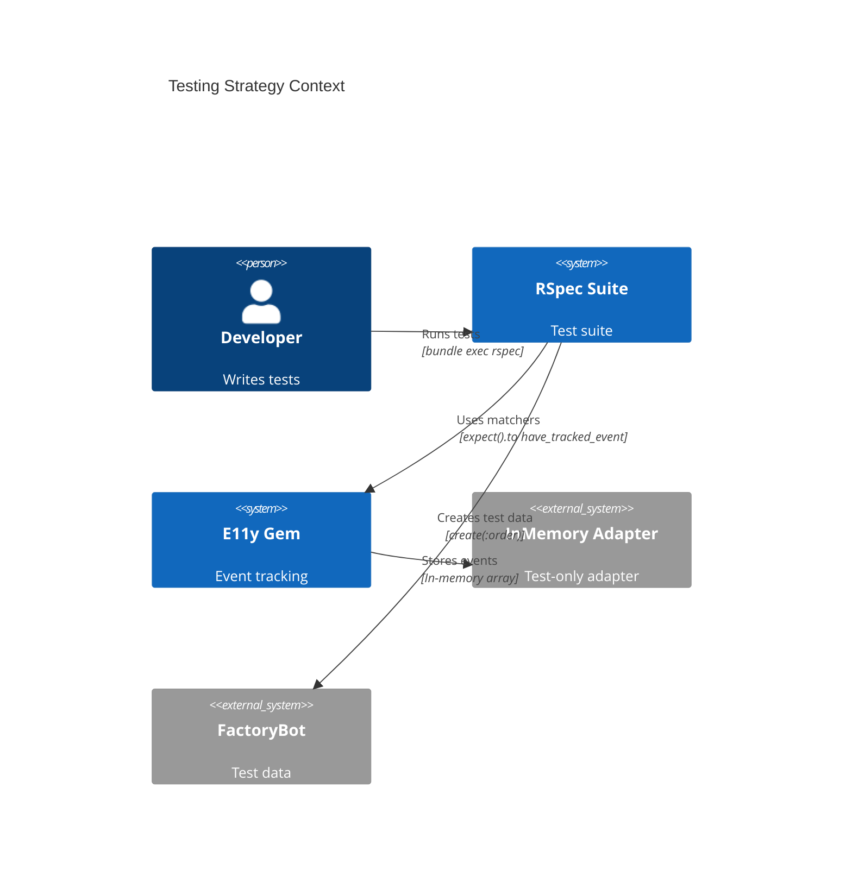
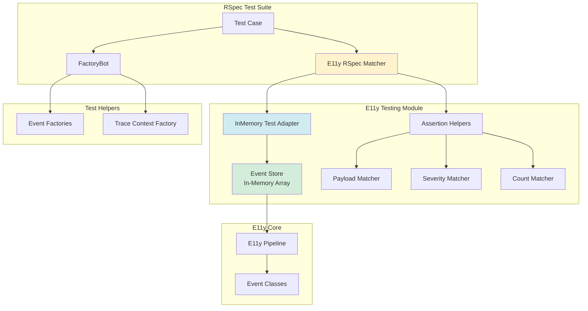
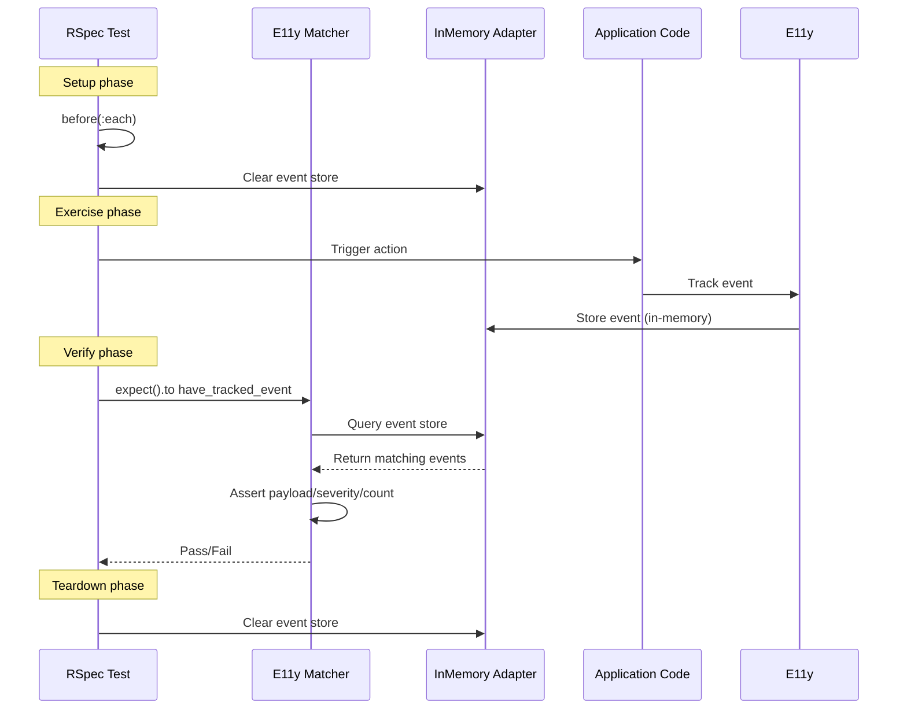
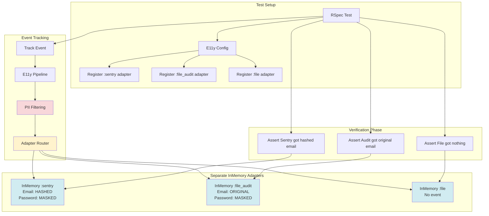

# ADR-011: Testing Strategy

**Status:** Draft  
**Date:** January 12, 2026  
**Covers:** UC-018 (Testing Events)  
**Depends On:** ADR-001 (Core), ADR-008 (Rails Integration)

---

## 📋 Table of Contents

1. [Context & Problem](#1-context--problem)
2. [Architecture Overview](#2-architecture-overview)
3. [RSpec Matchers](#3-rspec-matchers)
4. [Test Adapters](#4-test-adapters)
5. [Factory Integration](#5-factory-integration)
6. [Snapshot Testing](#6-snapshot-testing)
7. [Performance Testing](#7-performance-testing)
8. [Integration Testing](#8-integration-testing)
9. [Contract Testing](#9-contract-testing)
10. [Security & Compliance Testing](#10-security--compliance-testing)
11. [Trade-offs](#11-trade-offs)
12. [Complete Example](#12-complete-example)
13. [Summary & Key Takeaways](#13-summary--key-takeaways)

---

## 1. Context & Problem

### 1.1. Problem Statement

**Current Pain Points:**

1. **No Test Helpers:**
   ```ruby
   # ❌ Manual verification, brittle
   it 'tracks order created event' do
     order = create(:order)
     
     # How to verify event was tracked?
     # Check logs? Mock adapters? 🤷
   end
   ```

2. **Adapter Pollution:**
   ```ruby
   # ❌ Test events go to real adapters
   RSpec.describe OrdersController do
     it 'creates order' do
       post :create
       # Event sent to Loki, Sentry in test! 😱
     end
   end
   ```

3. **No Event Assertions:**
   ```ruby
   # ❌ Can't verify event payload
   it 'tracks with correct data' do
     Events::OrderCreated.track(order_id: 123)
     
     # How to assert payload[:order_id] == 123?
   end
   ```

4. **Hard to Test Edge Cases:**
   ```ruby
   # ❌ How to test retry logic? Circuit breaker?
   it 'retries on failure' do
     # Simulate adapter failure?
     # Verify retry attempts?
   end
   ```

### 1.2. Goals

**Primary Goals:**
- ✅ **RSpec matchers** for event assertions
- ✅ **InMemory test adapter** (zero I/O)
- ✅ **Factory integration** (FactoryBot)
- ✅ **Snapshot testing** for payloads
- ✅ **Performance benchmarks**
- ✅ **Contract testing** for adapters

**Non-Goals:**
- ❌ Support other test frameworks (Minitest, etc.)
- ❌ Full mocking of E11y internals
- ❌ Production-like test environment

### 1.3. Success Metrics

| Metric | Target | Critical? |
|--------|--------|-----------|
| **Test execution speed** | <1ms per event assertion | ✅ Yes |
| **Setup complexity** | <5 lines in spec_helper | ✅ Yes |
| **Matcher coverage** | 100% of common patterns | ✅ Yes |
| **False positive rate** | <1% | ✅ Yes |

---

## 2. Architecture Overview

### 2.1. System Context



### 2.2. Component Architecture



### 2.3. Test Flow



---

## 3. RSpec Matchers

### 3.1. Core Matchers

```ruby
# lib/e11y/testing/rspec_matchers.rb
module E11y
  module Testing
    module RSpecMatchers
      # Main matcher: have_tracked_event
      def have_tracked_event(event_class_or_pattern)
        HaveTrackedEventMatcher.new(event_class_or_pattern)
      end
      
      # Alias for readability
      alias_method :track_event, :have_tracked_event
      
      class HaveTrackedEventMatcher
        def initialize(event_class_or_pattern)
          @event_class_or_pattern = event_class_or_pattern
          @payload_matchers = {}
          @severity_matcher = nil
          @count_matcher = nil
          @trace_id_matcher = nil
        end
        
        # Chain: with payload
        def with(payload_hash)
          @payload_matchers = payload_hash
          self
        end
        
        # Chain: with severity
        def with_severity(severity)
          @severity_matcher = severity
          self
        end
        
        # Chain: exactly N times
        def exactly(count)
          @count_matcher = count
          self
        end
        
        # Chain: at_least N times
        def at_least(count)
          @count_matcher = [:at_least, count]
          self
        end
        
        # Chain: at_most N times
        def at_most(count)
          @count_matcher = [:at_most, count]
          self
        end
        
        # Chain: once
        def once
          exactly(1)
        end
        
        # Chain: twice
        def twice
          exactly(2)
        end
        
        # Chain: with trace_id
        def with_trace_id(trace_id)
          @trace_id_matcher = trace_id
          self
        end
        
        # Matcher implementation
        def matches?(actual = nil)
          @events = find_matching_events
          
          return false if @events.empty?
          return false unless count_matches?
          return false unless payload_matches?
          return false unless severity_matches?
          return false unless trace_id_matches?
          
          true
        end
        
        def failure_message
          if @events.empty?
            no_events_message
          elsif !count_matches?
            count_mismatch_message
          elsif !payload_matches?
            payload_mismatch_message
          elsif !severity_matches?
            severity_mismatch_message
          else
            trace_id_mismatch_message
          end
        end
        
        def failure_message_when_negated
          "expected not to have tracked #{event_name}, but it was tracked"
        end
        
        def supports_block_expectations?
          true
        end
        
        private
        
        def find_matching_events
          E11y.test_adapter.find_events(event_pattern)
        end
        
        def event_pattern
          case @event_class_or_pattern
          when Class
            @event_class_or_pattern.event_name
          when String, Regexp
            @event_class_or_pattern
          else
            raise ArgumentError, "Invalid event pattern: #{@event_class_or_pattern}"
          end
        end
        
        def event_name
          case @event_class_or_pattern
          when Class
            @event_class_or_pattern.name
          else
            @event_class_or_pattern.to_s
          end
        end
        
        def count_matches?
          return true unless @count_matcher
          
          case @count_matcher
          when Integer
            @events.size == @count_matcher
          when Array
            operator, expected = @count_matcher
            case operator
            when :at_least
              @events.size >= expected
            when :at_most
              @events.size <= expected
            end
          end
        end
        
        def payload_matches?
          return true if @payload_matchers.empty?
          
          @events.any? do |event|
            @payload_matchers.all? do |key, expected_value|
              actual_value = event[:payload][key]
              
              case expected_value
              when RSpec::Matchers::BuiltIn::BaseMatcher
                expected_value.matches?(actual_value)
              when Proc
                expected_value.call(actual_value)
              else
                actual_value == expected_value
              end
            end
          end
        end
        
        def severity_matches?
          return true unless @severity_matcher
          
          @events.any? { |event| event[:severity] == @severity_matcher }
        end
        
        def trace_id_matches?
          return true unless @trace_id_matcher
          
          @events.any? { |event| event[:trace_id] == @trace_id_matcher }
        end
        
        def no_events_message
          events = E11y.test_adapter.events
          
          if events.empty?
            "expected to have tracked #{event_name}, but no events were tracked at all"
          else
            tracked_names = events.map { |e| e[:event_name] }.uniq.join(', ')
            "expected to have tracked #{event_name}, but only tracked: #{tracked_names}"
          end
        end
        
        def count_mismatch_message
          expected_count = case @count_matcher
          when Integer
            "exactly #{@count_matcher}"
          when Array
            operator, count = @count_matcher
            "#{operator.to_s.gsub('_', ' ')} #{count}"
          end
          
          "expected to track #{event_name} #{expected_count} times, but tracked #{@events.size} times"
        end
        
        def payload_mismatch_message
          "expected #{event_name} with payload #{@payload_matchers.inspect}, " \
          "but got:\n#{format_events(@events)}"
        end
        
        def severity_mismatch_message
          severities = @events.map { |e| e[:severity] }.uniq.join(', ')
          "expected #{event_name} with severity :#{@severity_matcher}, " \
          "but got severities: #{severities}"
        end
        
        def trace_id_mismatch_message
          trace_ids = @events.map { |e| e[:trace_id] }.uniq.join(', ')
          "expected #{event_name} with trace_id #{@trace_id_matcher}, " \
          "but got trace_ids: #{trace_ids}"
        end
        
        def format_events(events)
          events.map.with_index do |event, index|
            "  [#{index + 1}] #{event[:payload].inspect}"
          end.join("\n")
        end
      end
    end
  end
end
```

### 3.2. Usage Examples

```ruby
RSpec.describe OrdersController, type: :controller do
  describe 'POST #create' do
    it 'tracks order created event' do
      expect {
        post :create, params: { order: { item: 'Book', price: 29.99 } }
      }.to have_tracked_event(Events::OrderCreated)
    end
    
    it 'tracks with correct payload' do
      post :create, params: { order: { item: 'Book', price: 29.99 } }
      
      expect(Events::OrderCreated).to have_been_tracked
        .with(item: 'Book', price: 29.99)
    end
    
    it 'tracks with correct severity' do
      post :create
      
      expect(Events::OrderCreated).to have_been_tracked
        .with_severity(:info)
    end
    
    it 'tracks exactly once' do
      post :create
      
      expect(Events::OrderCreated).to have_been_tracked.once
    end
    
    it 'tracks multiple times' do
      3.times { post :create }
      
      expect(Events::OrderCreated).to have_been_tracked
        .exactly(3)
    end
    
    it 'uses RSpec matchers in payload' do
      post :create, params: { order: { price: 29.99 } }
      
      expect(Events::OrderCreated).to have_been_tracked
        .with(
          order_id: be_a(Integer),
          price: be_within(0.01).of(29.99),
          created_at: be_a(Time)
        )
    end
    
    it 'uses custom matchers' do
      post :create
      
      expect(Events::OrderCreated).to have_been_tracked
        .with(
          amount: ->(val) { val > 0 }
        )
    end
    
    it 'verifies trace context' do
      post :create
      
      expect(Events::OrderCreated).to have_been_tracked
        .with_trace_id(E11y::Current.trace_id)
    end
  end
end
```

---

## 4. Test Adapters

### 4.1. InMemory Adapter

```ruby
# lib/e11y/adapters/in_memory.rb
# API: write, write_batch (adapter contract), events, find_events, clear!, any_event?
module E11y
  module Adapters
    class InMemory < Base
      attr_reader :events

      def write(event_data)
        @mutex.synchronize { @events << event_data }
        true
      end

      def write_batch(events)
        @mutex.synchronize { @events.concat(events) }
        true
      end

      # Test helper methods
      def find_events(pattern)  # pattern: String or Regexp
        pattern = Regexp.new(Regexp.escape(pattern)) if pattern.is_a?(String)
        @events.select { |e| e[:event_name].to_s.match?(pattern) }
      end

      def event_count(event_name = nil)
        event_name ? @events.count { |e| e[:event_name] == event_name } : @events.size
      end

      def clear!
        @events.clear
      end

      def any_event?(pattern)  # true if any events match pattern
        find_events(pattern).any?
      end
    end
  end
end
```

### 4.2. Mock Adapter (For Failure Testing)

```ruby
# lib/e11y/adapters/mock.rb
module E11y
  module Adapters
    class Mock < Base
      attr_accessor :should_fail, :failure_error, :delay_ms
      
      def initialize(config = {})
        super(name: :mock)
        @should_fail = config[:should_fail] || false
        @failure_error = config[:failure_error] || StandardError.new('Mock failure')
        @delay_ms = config[:delay_ms] || 0
        @call_count = 0
      end
      
      def write_batch(events)
        @call_count += 1
        
        # Simulate delay
        sleep(@delay_ms / 1000.0) if @delay_ms > 0
        
        # Simulate failure
        raise @failure_error if @should_fail
        
        { success: true, sent: events.size }
      end
      
      def health_check
        !@should_fail
      end
      
      def call_count
        @call_count
      end
      
      def reset!
        @call_count = 0
        @should_fail = false
      end
    end
  end
end
```

### 4.3. RSpec Configuration

```ruby
# spec/support/e11y.rb
RSpec.configure do |config|
  # Use InMemory adapter for all tests
  config.before(:suite) do
    E11y.configure do |e11y_config|
      # Clear all adapters
      e11y_config.adapters.clear
      
      # Register only test adapter
      e11y_config.adapters.register :test, E11y::Adapters::InMemory.new
      
      # Disable rate limiting in tests
      e11y_config.rate_limiting_enabled = false
      
      # Disable sampling (track everything)
      e11y_config.sampling.default_sample_rate = 1.0
      
      # Fast buffer flush (no delays)
      e11y_config.buffer.flush_interval = 0.milliseconds
    end
  end
  
  # Clear events between tests
  config.before(:each) do
    E11y.test_adapter.clear!
  end
  
  # Reset trace context
  config.after(:each) do
    E11y::Current.reset
  end
  
  # Include matchers
  config.include E11y::Testing::RSpecMatchers
  
  # Alias for convenience
  config.alias_example_group_to :describe_event, type: :event
end

# Convenience method to access test adapter (uses config.adapters[:test] or [:memory])
module E11y
  def self.test_adapter
    configuration.adapters[:test] || configuration.adapters[:memory]
  end
end
```

---

## 5. Factory Integration

### 5.1. Event Factories

```ruby
# spec/factories/events.rb
FactoryBot.define do
  # Base event factory
  factory :event, class: Hash do
    transient do
      event_class { Events::Generic }
    end
    
    event_name { event_class.event_name }
    severity { :info }
    timestamp { Time.now }
    trace_id { E11y::TraceContext.generate_id }
    payload { {} }
    
    initialize_with { attributes }
    
    # Specific event factories
    factory :order_created_event do
      event_class { Events::OrderCreated }
      payload do
        {
          order_id: Faker::Number.number(digits: 10),
          user_id: Faker::Number.number(digits: 5),
          amount: Faker::Commerce.price,
          currency: 'USD'
        }
      end
    end
    
    factory :payment_processed_event do
      event_class { Events::PaymentProcessed }
      severity { :success }
      payload do
        {
          payment_id: Faker::Alphanumeric.alphanumeric(number: 20),
          order_id: Faker::Number.number(digits: 10),
          amount: Faker::Commerce.price,
          status: 'completed'
        }
      end
    end
    
    factory :error_event do
      event_class { Events::ErrorOccurred }
      severity { :error }
      payload do
        {
          error_class: 'StandardError',
          error_message: Faker::Lorem.sentence,
          backtrace: Faker::Lorem.paragraphs(number: 3)
        }
      end
    end
  end
  
  # Trace context factory
  factory :trace_context, class: Hash do
    trace_id { E11y::TraceContext.generate_id }
    span_id { E11y::TraceContext.generate_span_id }
    sampled { true }
    user_id { Faker::Number.number(digits: 5) }
    
    initialize_with { attributes }
  end
end
```

### 5.2. Usage with Factories

```ruby
RSpec.describe 'Event tracking with factories' do
  it 'builds event payload' do
    payload = build(:order_created_event)[:payload]
    
    Events::OrderCreated.track(payload)
    
    expect(Events::OrderCreated).to have_been_tracked
      .with(order_id: payload[:order_id])
  end
  
  it 'sets up trace context' do
    context = build(:trace_context)
    
    E11y::Current.set(context)
    
    Events::OrderCreated.track(order_id: 123)
    
    expect(Events::OrderCreated).to have_been_tracked
      .with_trace_id(context[:trace_id])
  end
end
```

---

## 6. Snapshot Testing

### 6.1. Snapshot Matcher

```ruby
# lib/e11y/testing/snapshot_matcher.rb
module E11y
  module Testing
    module SnapshotMatcher
      def match_snapshot(snapshot_name)
        SnapshotMatcher.new(snapshot_name)
      end
      
      class SnapshotMatcher
        def initialize(snapshot_name)
          @snapshot_name = snapshot_name
          @snapshot_dir = Rails.root.join('spec', 'snapshots', 'events')
          @snapshot_file = @snapshot_dir.join("#{@snapshot_name}.yml")
        end
        
        def matches?(actual)
          @actual = normalize_event(actual)
          
          if File.exist?(@snapshot_file)
            @expected = YAML.load_file(@snapshot_file)
            @actual == @expected
          else
            # First run: save snapshot
            save_snapshot(@actual)
            true
          end
        end
        
        def failure_message
          "Expected event to match snapshot #{@snapshot_name}\n\n" \
          "Expected:\n#{@expected.to_yaml}\n\n" \
          "Actual:\n#{@actual.to_yaml}\n\n" \
          "Run UPDATE_SNAPSHOTS=1 rspec to update snapshot"
        end
        
        private
        
        def normalize_event(event)
          event = event.deep_symbolize_keys if event.respond_to?(:deep_symbolize_keys)
          
          # Remove volatile fields
          event.except(:timestamp, :trace_id, :span_id)
        end
        
        def save_snapshot(data)
          FileUtils.mkdir_p(@snapshot_dir)
          File.write(@snapshot_file, data.to_yaml)
        end
      end
    end
  end
end
```

### 6.2. Snapshot Usage

```ruby
RSpec.describe Events::OrderCreated do
  it 'matches expected structure' do
    Events::OrderCreated.track(
      order_id: 123,
      user_id: 456,
      amount: 99.99,
      currency: 'USD'
    )
    
    event = E11y.test_adapter.find_event(Events::OrderCreated)
    
    expect(event).to match_snapshot('order_created_event')
  end
end

# First run: creates spec/snapshots/events/order_created_event.yml
# Subsequent runs: compares against saved snapshot
# Update snapshots: UPDATE_SNAPSHOTS=1 bundle exec rspec
```

---

## 7. Performance Testing

### 7.1. Performance Benchmarks

```ruby
# spec/performance/event_tracking_spec.rb
RSpec.describe 'Event tracking performance', type: :performance do
  it 'tracks 1000 events in < 100ms' do
    elapsed = Benchmark.realtime do
      1000.times do |i|
        Events::OrderCreated.track(order_id: i)
      end
    end
    
    expect(elapsed).to be < 0.1  # 100ms
  end
  
  it 'handles concurrent tracking' do
    threads = 10.times.map do |thread_id|
      Thread.new do
        100.times do |i|
          Events::OrderCreated.track(
            order_id: "#{thread_id}-#{i}"
          )
        end
      end
    end
    
    threads.each(&:join)
    
    expect(E11y.test_adapter.event_count).to eq(1000)
  end
  
  it 'has low memory overhead' do
    before_memory = memory_usage
    
    1000.times { Events::OrderCreated.track(order_id: 1) }
    
    after_memory = memory_usage
    memory_increase = after_memory - before_memory
    
    # Should use < 1MB for 1000 events
    expect(memory_increase).to be < 1.megabyte
  end
  
  private
  
  def memory_usage
    `ps -o rss= -p #{Process.pid}`.to_i * 1024  # bytes
  end
end
```

### 7.2. Benchmark Helpers

```ruby
# spec/support/benchmark_helpers.rb
module BenchmarkHelpers
  def benchmark(label = nil, &block)
    label ||= caller_locations(1, 1).first.label
    
    result = nil
    elapsed = Benchmark.realtime { result = block.call }
    
    puts "#{label}: #{(elapsed * 1000).round(2)}ms"
    
    result
  end
  
  def profile_memory(&block)
    before = memory_usage
    result = block.call
    after = memory_usage
    
    increase = ((after - before) / 1024.0).round(2)
    puts "Memory increase: #{increase} KB"
    
    result
  end
end

RSpec.configure do |config|
  config.include BenchmarkHelpers, type: :performance
end
```

---

## 8. Integration Testing

### 8.1. Full Stack Integration Tests

```ruby
# spec/integration/order_flow_spec.rb
RSpec.describe 'Order flow integration', type: :integration do
  it 'tracks all events in order creation flow' do
    user = create(:user)
    
    # Simulate full order flow
    order = nil
    
    expect {
      order = create_order_as(user, items: [{ name: 'Book', price: 29.99 }])
    }.to have_tracked_event(Events::OrderCreated)
      .and have_tracked_event(Events::PaymentProcessed)
      .and have_tracked_event(Events::EmailQueued)
    
    # Verify event sequence
    events = E11y.test_adapter.events
    event_names = events.map { |e| e[:event_name] }
    
    expect(event_names).to eq([
      'Events::OrderCreated',
      'Events::PaymentProcessed',
      'Events::EmailQueued'
    ])
    
    # Verify trace context propagation
    trace_ids = events.map { |e| e[:trace_id] }.uniq
    expect(trace_ids.size).to eq(1)  # All events share same trace_id
  end
  
  it 'propagates trace to background jobs' do
    order = create(:order)
    
    expect {
      SendOrderEmailJob.perform_later(order.id)
    }.to have_tracked_event(Events::Rails::Job::Enqueued)
    
    # Execute job
    perform_enqueued_jobs
    
    # Verify job tracked event with same trace_id
    enqueued_event = E11y.test_adapter.find_event(Events::Rails::Job::Enqueued)
    completed_event = E11y.test_adapter.find_event(Events::Rails::Job::Completed)
    
    expect(completed_event[:trace_id]).to eq(enqueued_event[:trace_id])
  end
end
```

### 8.2. Adapter Integration Tests

```ruby
# spec/integration/adapters_spec.rb
RSpec.describe 'Adapter integration', type: :integration do
  it 'sends events to multiple adapters' do
    # Reconfigure with multiple test adapters
    adapter1 = E11y::Adapters::InMemory.new
    adapter2 = E11y::Adapters::InMemory.new
    
    E11y.configure do |config|
      config.adapters.clear
      config.adapters.register :adapter1, adapter1
      config.adapters.register :adapter2, adapter2
    end
    
    Events::OrderCreated.track(order_id: 123)
    
    # Verify both adapters received event
    expect(adapter1.event_count).to eq(1)
    expect(adapter2.event_count).to eq(1)
  end
  
  it 'handles adapter failures gracefully' do
    failing_adapter = E11y::Adapters::Mock.new(should_fail: true)
    working_adapter = E11y::Adapters::InMemory.new
    
    E11y.configure do |config|
      config.adapters.clear
      config.adapters.register :failing, failing_adapter
      config.adapters.register :working, working_adapter
    end
    
    # Should not raise, working adapter should receive event
    expect {
      Events::OrderCreated.track(order_id: 123)
    }.not_to raise_error
    
    expect(working_adapter.event_count).to eq(1)
  end
end
```

---

## 9. Contract Testing

### 9.1. Adapter Contract Tests

```ruby
# spec/contracts/adapter_contract_spec.rb
RSpec.shared_examples 'an E11y adapter' do
  let(:adapter) { described_class.new }
  
  describe '#write_batch' do
    it 'accepts array of events' do
      events = [build(:event)]
      
      expect { adapter.write_batch(events) }.not_to raise_error
    end
    
    it 'returns success hash' do
      events = [build(:event)]
      result = adapter.write_batch(events)
      
      expect(result).to be_a(Hash)
      expect(result).to have_key(:success)
      expect(result[:success]).to be_in([true, false])
    end
    
    it 'handles empty batch' do
      expect { adapter.write_batch([]) }.not_to raise_error
    end
    
    it 'raises on invalid input' do
      expect { adapter.write_batch(nil) }.to raise_error(ArgumentError)
    end
  end
  
  describe '#health_check' do
    it 'returns boolean' do
      result = adapter.health_check
      expect(result).to be_in([true, false])
    end
  end
  
  describe '#capabilities' do
    it 'returns array of symbols' do
      capabilities = adapter.capabilities
      
      expect(capabilities).to be_an(Array)
      expect(capabilities).to all(be_a(Symbol))
    end
  end
end

# Use in adapter specs
RSpec.describe E11y::Adapters::Loki do
  it_behaves_like 'an E11y adapter'
end

RSpec.describe E11y::Adapters::Sentry do
  it_behaves_like 'an E11y adapter'
end
```

### 9.2. Event Contract Tests

```ruby
# spec/contracts/event_contract_spec.rb
RSpec.shared_examples 'an E11y event' do
  describe '.track' do
    it 'accepts payload hash' do
      expect { described_class.track({}) }.not_to raise_error
    end
    
    it 'validates schema' do
      invalid_payload = { invalid_key: 'value' }
      
      expect {
        described_class.track(invalid_payload)
      }.to raise_error(E11y::SchemaValidationError)
    end
    
    it 'returns nil' do
      result = described_class.track(valid_payload)
      expect(result).to be_nil
    end
  end
  
  describe '.event_name' do
    it 'returns string' do
      expect(described_class.event_name).to be_a(String)
    end
    
    it 'matches class name pattern' do
      expect(described_class.event_name).to match(/^Events::/)
    end
  end
  
  describe '.schema' do
    it 'is defined' do
      expect(described_class.schema).to be_present
    end
  end
end

# Use in event specs
RSpec.describe Events::OrderCreated do
  let(:valid_payload) do
    {
      order_id: 123,
      user_id: 456,
      amount: 99.99
    }
  end
  
  it_behaves_like 'an E11y event'
end
```

---

## 10. Security & Compliance Testing

### 10.1. Problem: Critical Features Need User Verification

**Why This Matters:**

```ruby
# ❌ GDPR violation if PII filtering broken:
# Company: $50M fine for data breach
# Reputation: Destroyed

# ❌ Cost overrun if routing broken:
# Expected: $100/month (debug → file)
# Actual: $10,000/month (debug → Sentry)

# Users MUST be able to verify these features work!
```

### 10.2. Architecture: Multiple InMemory Adapters

**Design Decision:** Use separate `InMemory` adapters per destination to verify:
1. ✅ PII filtering per-adapter
2. ✅ Event routing to correct adapters
3. ✅ Rate limiting behavior
4. ✅ Sampling behavior



### 10.3. PII Filtering Test Helpers

```ruby
# lib/e11y/testing/pii_helpers.rb
module E11y
  module Testing
    module PiiHelpers
      # Verify field was filtered with specific strategy
      def have_field_filtered(field, strategy, options = {})
        PiiFilterMatcher.new(field, strategy, options)
      end
      
      class PiiFilterMatcher
        def initialize(field, strategy, options)
          @field = field
          @strategy = strategy
          @adapter = options[:for_adapter]
          @algorithm = options[:algorithm]
        end
        
        def matches?(event)
          @actual_value = event.dig(:payload, @field)
          
          case @strategy
          when :mask
            @actual_value == '[FILTERED]'
          when :hash
            verify_hash
          when :skip
            !event[:payload].key?(@field)
          when :truncate
            @actual_value.length <= (event[:metadata][:pii_truncate_length] || 100)
          when :redact
            @actual_value == '[REDACTED]'
          else
            false
          end
        end
        
        def failure_message
          "expected field '#{@field}' to be filtered with strategy :#{@strategy}, " \
          "but got: #{@actual_value.inspect}"
        end
        
        def failure_message_when_negated
          "expected field '#{@field}' NOT to be filtered with :#{@strategy}, " \
          "but it was"
        end
        
        private
        
        def verify_hash
          return false unless @actual_value.is_a?(String)
          
          case @algorithm || :sha256
          when :sha256
            @actual_value =~ /^[a-f0-9]{64}$/
          when :md5
            @actual_value =~ /^[a-f0-9]{32}$/
          else
            false
          end
        end
      end
      
      # Verify event was sent to specific adapters only
      def be_routed_to(*adapter_names)
        AdapterRoutingMatcher.new(adapter_names)
      end
      
      class AdapterRoutingMatcher
        def initialize(expected_adapters)
          @expected_adapters = expected_adapters.map(&:to_sym).sort
          @only = false
        end
        
        def only
          @only = true
          self
        end
        
        def matches?(event_class)
          @actual_adapters = event_class.adapters.sort
          
          if @only
            @actual_adapters == @expected_adapters
          else
            (@expected_adapters - @actual_adapters).empty?
          end
        end
        
        def failure_message
          if @only
            "expected event to be routed to ONLY #{@expected_adapters.inspect}, " \
            "but configured for: #{@actual_adapters.inspect}"
          else
            "expected event to be routed to #{@expected_adapters.inspect}, " \
            "but only configured for: #{@actual_adapters.inspect}"
          end
        end
      end
      
      # Helper to setup multiple test adapters
      def setup_test_adapters(*adapter_names)
        adapters = {}
        
        adapter_names.each do |name|
          adapters[name] = E11y::Adapters::InMemory.new
        end
        
        E11y.configure do |config|
          config.adapters.clear
          adapters.each do |name, adapter|
            config.adapters.register name, adapter
          end
        end
        
        adapters
      end
    end
  end
end
```

### 10.4. PII Filtering Test Examples

```ruby
# spec/events/user_login_spec.rb
RSpec.describe Events::UserLogin, type: :event do
  # Setup separate adapters to verify per-adapter PII filtering
  let(:adapters) { setup_test_adapters(:sentry, :file_audit, :file) }
  
  describe 'PII filtering' do
    context 'password field' do
      it 'masks password for ALL adapters' do
        Events::UserLogin.track(
          email: 'user@example.com',
          password: 'secret123',
          ip_address: '192.168.1.1'
        )
        
        # ✅ Sentry: password masked
        sentry_event = adapters[:sentry].find_event(Events::UserLogin)
        expect(sentry_event).to have_field_filtered(:password, :mask)
        
        # ✅ Audit: password masked (sensitive data)
        audit_event = adapters[:file_audit].find_event(Events::UserLogin)
        expect(audit_event).to have_field_filtered(:password, :mask)
        
        # ✅ File: password masked
        file_event = adapters[:file].find_event(Events::UserLogin)
        expect(file_event).to have_field_filtered(:password, :mask)
      end
    end
    
    context 'email field (per-adapter rules)' do
      it 'hashes email for Sentry, keeps original for audit' do
        Events::UserLogin.track(
          email: 'user@example.com',
          password: 'secret123'
        )
        
        # ✅ Sentry: email hashed (compliance + privacy)
        sentry_event = adapters[:sentry].find_event(Events::UserLogin)
        expect(sentry_event).to have_field_filtered(:email, :hash, algorithm: :sha256)
        expect(sentry_event[:payload][:email]).not_to eq('user@example.com')
        
        # ✅ Audit: email ORIGINAL (for investigation)
        audit_event = adapters[:file_audit].find_event(Events::UserLogin)
        expect(audit_event[:payload][:email]).to eq('user@example.com')
        expect(audit_event).not_to have_field_filtered(:email, :hash)
      end
      
      it 'uses consistent hash for same email' do
        # Track twice with same email
        2.times do
          Events::UserLogin.track(
            email: 'user@example.com',
            password: 'secret123'
          )
        end
        
        events = adapters[:sentry].find_events(Events::UserLogin)
        hashes = events.map { |e| e[:payload][:email] }
        
        # ✅ Same email → same hash (for correlation)
        expect(hashes.uniq.size).to eq(1)
      end
    end
    
    context 'ip_address field (conditional filtering)' do
      it 'masks IP for non-admin users, skips for audit' do
        Events::UserLogin.track(
          email: 'user@example.com',
          password: 'secret123',
          ip_address: '192.168.1.1',
          is_admin: false
        )
        
        # ✅ Sentry: IP masked (PII for regular users)
        sentry_event = adapters[:sentry].find_event(Events::UserLogin)
        expect(sentry_event).to have_field_filtered(:ip_address, :mask)
        
        # ✅ Audit: IP kept (security investigation)
        audit_event = adapters[:file_audit].find_event(Events::UserLogin)
        expect(audit_event[:payload][:ip_address]).to eq('192.168.1.1')
      end
    end
  end
  
  describe 'GDPR compliance' do
    it 'never leaks PII to non-audit adapters' do
      Events::UserLogin.track(
        email: 'user@example.com',
        password: 'secret123',
        session_id: 'sess_abc123'
      )
      
      sentry_event = adapters[:sentry].find_event(Events::UserLogin)
      
      # ✅ No plain-text PII in Sentry
      expect(sentry_event[:payload].values).not_to include('user@example.com')
      expect(sentry_event[:payload].values).not_to include('secret123')
    end
    
    it 'logs PII filtering activity (for audit trail)' do
      Events::UserLogin.track(
        email: 'user@example.com',
        password: 'secret123'
      )
      
      # ✅ Metadata tracks PII filtering
      sentry_event = adapters[:sentry].find_event(Events::UserLogin)
      expect(sentry_event[:metadata][:pii_filtered]).to be true
      expect(sentry_event[:metadata][:pii_fields]).to include(:email, :password)
    end
  end
end
```

### 10.5. Adapter Routing Test Examples

```ruby
# spec/events/routing_spec.rb
RSpec.describe 'Event routing', type: :integration do
  let(:adapters) { setup_test_adapters(:sentry, :loki, :file, :pagerduty) }
  
  describe Events::DebugQuery do
    it 'routes ONLY to file adapter (cost optimization)' do
      Events::DebugQuery.track(sql: 'SELECT * FROM users')
      
      # ✅ File got event (cheap)
      expect(adapters[:file].event_count).to eq(1)
      
      # ✅ Sentry did NOT get event (expensive!)
      expect(adapters[:sentry].event_count).to eq(0)
      expect(adapters[:loki].event_count).to eq(0)
      expect(adapters[:pagerduty].event_count).to eq(0)
    end
    
    it 'uses routing matcher for cleaner assertions' do
      expect(Events::DebugQuery).to be_routed_to(:file).only
    end
  end
  
  describe Events::PaymentFraudDetected do
    it 'routes to critical adapters (Sentry, PagerDuty, Audit)' do
      Events::PaymentFraudDetected.track(
        transaction_id: 'tx_123',
        fraud_score: 0.95
      )
      
      # ✅ Critical adapters got event
      expect(adapters[:sentry].event_count).to eq(1)
      expect(adapters[:pagerduty].event_count).to eq(1)
      
      # ✅ Low-priority adapters did NOT get event
      expect(adapters[:file].event_count).to eq(0)
    end
  end
  
  describe Events::HealthCheckPassed do
    it 'routes NOWHERE (excluded from all adapters)' do
      Events::HealthCheckPassed.track
      
      # ✅ No adapters got event (noise reduction)
      expect(adapters.values.sum(&:event_count)).to eq(0)
    end
  end
  
  context 'cost verification' do
    it 'prevents expensive routing mistakes' do
      # Track 1000 debug events
      1000.times { Events::DebugQuery.track(sql: 'SELECT 1') }
      
      # ✅ If routed to Sentry: $10/1000 events = $10 cost
      # ✅ If routed to File: $0 cost
      expect(adapters[:sentry].event_count).to eq(0), 
        'Debug events leaked to Sentry! Cost impact: ~$10'
    end
  end
end
```

### 10.6. Rate Limiting Test Examples

```ruby
# spec/features/rate_limiting_spec.rb
RSpec.describe 'Rate limiting', type: :integration do
  let(:adapters) { setup_test_adapters(:file) }
  
  before do
    E11y.configure do |config|
      config.rate_limiting_enabled = true
      config.rate_limiting_global_limit = 10  # 10 events/sec
    end
  end
  
  it 'drops events exceeding global rate limit' do
    # Track 15 events (exceeds limit of 10)
    15.times { Events::DebugQuery.track(sql: 'SELECT 1') }
    
    # ✅ Only 10 events tracked
    expect(adapters[:file].event_count).to eq(10)
    
    # ✅ 5 events dropped
    expect(E11y::Metrics.get('e11y.rate_limit.dropped_total')).to eq(5)
  end
  
  it 'never drops critical events (bypass rate limit)' do
    E11y.config.rate_limiting_global_limit = 1  # Extremely low
    
    # Track 10 critical events
    10.times { Events::PaymentFailed.track(payment_id: 'p123') }
    
    # ✅ ALL critical events tracked (bypass)
    expect(adapters[:file].event_count).to eq(10)
  end
  
  it 'applies per-event rate limits' do
    E11y.config.add_rate_limit_per_event('Events::DebugQuery', limit: 5)  # Max 5 per second
    
    10.times { Events::DebugQuery.track(sql: 'SELECT 1') }
    
    # ✅ Only 5 DebugQuery events tracked
    debug_events = adapters[:file].find_events(Events::DebugQuery)
    expect(debug_events.size).to eq(5)
  end
end
```

### 10.7. Sampling Test Examples

```ruby
# spec/features/sampling_spec.rb
RSpec.describe 'Adaptive sampling', type: :integration do
  let(:adapters) { setup_test_adapters(:file) }
  
  before do
    E11y.configure do |config|
      config.sampling.enabled = true
      config.sampling.default_sample_rate = 0.1  # 10%
    end
  end
  
  it 'samples debug events at configured rate' do
    # Track 1000 debug events
    1000.times { Events::DebugQuery.track(sql: 'SELECT 1') }
    
    # ✅ ~100 events tracked (10% ± margin of error)
    expect(adapters[:file].event_count).to be_within(30).of(100)
  end
  
  it 'NEVER samples error/fatal events (always 100%)' do
    E11y.config.sampling.default_sample_rate = 0.01  # 1%
    
    # Track 100 error events
    100.times { Events::ErrorOccurred.track(error: 'Boom!') }
    
    # ✅ ALL 100 error events tracked (no sampling)
    expect(adapters[:file].event_count).to eq(100)
  end
  
  it 'NEVER samples audit events (compliance requirement)' do
    E11y.config.sampling.default_sample_rate = 0.01  # 1%
    
    # Track 50 audit events
    50.times { Events::GdprDeletion.audit(user_id: 123) }
    
    # ✅ ALL 50 audit events tracked (never sampled)
    expect(adapters[:file].event_count).to eq(50)
  end
  
  it 'uses trace-consistent sampling (same trace_id)' do
    E11y::Current.set(trace_id: 'trace-123')
    
    # Track 100 events with same trace_id
    sampled = 0
    100.times do
      Events::DebugQuery.track(sql: 'SELECT 1')
      sampled += 1 if adapters[:file].event_count > 0
      adapters[:file].clear!  # Reset for next iteration
    end
    
    # ✅ Either ALL sampled or NONE sampled (consistent)
    expect([0, 100]).to include(sampled)
  end
end
```

### 10.8. Configuration for Security Tests

```ruby
# spec/support/e11y_security.rb
RSpec.configure do |config|
  # Include PII helpers
  config.include E11y::Testing::PiiHelpers, type: :event
  config.include E11y::Testing::PiiHelpers, type: :integration
  
  # Global before hook for security tests
  config.before(:each, type: :event) do
    # Enable strict PII validation in tests
    E11y.configure do |e11y_config|
      e11y_config.pii.strict_mode = true  # Fail on unfiltered PII
      e11y_config.pii.validate_on_track = true  # Validate immediately
    end
  end
  
  # Verify no PII leaks in ANY test (global check)
  config.after(:each) do
    next unless E11y.config.pii.strict_mode
    
    # Get all events from all adapters
    events = E11y.config.adapters.all.flat_map do |adapter|
      adapter.respond_to?(:events) ? adapter.events : []
    end
    
    # Verify no plain-text PII (if event declares contains_pii)
    events.each do |event|
      event_class = E11y::Registry.get(event[:event_name])
      
      if event_class&.contains_pii?
        # Check for common PII patterns
        payload_str = event[:payload].values.join(' ')
        
        # ❌ Email pattern
        if payload_str =~ /@.+\./
          raise "SECURITY: Plain-text email detected in #{event[:event_name]}"
        end
        
        # ❌ Credit card pattern
        if payload_str =~ /\d{4}[- ]?\d{4}[- ]?\d{4}[- ]?\d{4}/
          raise "SECURITY: Credit card detected in #{event[:event_name]}"
        end
      end
    end
  end
end
```

### 10.9. Trade-offs: Security Testing

| Decision | Pro | Con | Rationale |
|----------|-----|-----|-----------|
| **Multiple InMemory adapters** | Real per-adapter verification | More test setup | Critical for PII/routing |
| **Strict mode in tests** | Catches PII leaks early | Slower tests | Security > speed |
| **Per-adapter assertions** | Precise verification | Verbose tests | Compliance requirement |
| **Global PII leak detector** | Safety net | False positives | Better safe than sorry |
| **Routing matchers** | Prevents cost overruns | Extra DSL | Clear intent |

---

## 11. Trade-offs

### 11.1. Key Decisions

| Decision | Pro | Con | Rationale |
|----------|-----|-----|-----------|
| **InMemory adapter** | Fast, zero I/O | Not production-like | Test speed > realism |
| **RSpec-only** | Deep integration | No Minitest support | Focus on one framework |
| **Snapshot testing** | Easy updates | Brittle on schema changes | Opt-in feature |
| **No auto-mocking** | Explicit tests | More setup | Clarity > magic |
| **Event factories** | Reusable | Extra maintenance | DRY test data |
| **Contract tests** | Enforces API | Boilerplate | Adapter quality |

### 11.2. Alternatives Considered

**A) VCR for adapter recording**
- ❌ Rejected: Too complex for unit tests

**B) Minitest support**
- ❌ Rejected: Limited by time, RSpec is majority

**C) Automatic mocking**
- ❌ Rejected: Hides test intent

**D) Database-backed test adapter**
- ❌ Rejected: Too slow

**E) Spy pattern (track all calls)**
- ✅ Partially adopted: InMemory adapter tracks calls

---

## 12. Complete Example

```ruby
# spec/models/order_spec.rb
RSpec.describe Order, type: :model do
  describe '#complete!' do
    let(:order) { create(:order, status: 'pending') }
    
    it 'tracks order completed event' do
      expect {
        order.complete!
      }.to have_tracked_event(Events::OrderCompleted)
        .with(
          order_id: order.id,
          total_amount: order.total_amount,
          items_count: order.items.count
        )
        .with_severity(:success)
        .once
    end
    
    it 'includes trace context' do
      E11y::Current.set(trace_id: 'test-trace-123')
      
      order.complete!
      
      expect(Events::OrderCompleted).to have_been_tracked
        .with_trace_id('test-trace-123')
    end
    
    it 'matches expected payload structure' do
      order.complete!
      
      event = E11y.test_adapter.find_event(Events::OrderCompleted)
      
      expect(event[:payload]).to match_snapshot('order_completed')
    end
  end
end
```

---

## 13. Summary & Key Takeaways

### 13.1. What We Achieved

✅ **Comprehensive testing strategy**: RSpec matchers, test adapters, factories, snapshots  
✅ **Performance testing**: Benchmarks for <1ms p99 latency  
✅ **Integration testing**: Full Rails stack with RSpec & factories  
✅ **Contract testing**: Shared examples for custom adapters  
✅ **Security & compliance testing**: PII filtering, adapter routing, rate limiting verification  

### 13.2. Critical Testing Priorities

**Tier 1 (Must Test - Security/Cost Impact):**
1. ✅ PII filtering per-adapter (GDPR compliance)
2. ✅ Adapter routing (cost optimization)
3. ✅ Rate limiting (system protection)
4. ✅ Sampling (critical events never dropped)

**Tier 2 (Should Test - Functionality):**
5. ✅ Event tracking & payload validation
6. ✅ Trace context propagation
7. ✅ Schema validation

**Tier 3 (Nice to Test - Performance):**
8. ✅ Performance benchmarks (<1ms p99)
9. ✅ Memory allocation (zero-allocation pattern)

### 13.3. Testing Architecture Decision

**✅ Multiple InMemory Adapters** - Winner for security/compliance testing:
- ✅ Real per-adapter verification
- ✅ Separate event stores per destination
- ✅ Verifies PII filtering independently
- ✅ Verifies routing correctness
- ✅ Simple to setup & use

### 13.4. Key Testing Helpers

```ruby
# PII filtering verification
expect(event).to have_field_filtered(:password, :mask)
expect(event).to have_field_filtered(:email, :hash, for_adapter: :sentry)

# Adapter routing verification
expect(Events::DebugQuery).to be_routed_to(:file).only
expect(Events::PaymentFailed).to be_routed_to(:sentry, :pagerduty)

# Setup test adapters
adapters = setup_test_adapters(:sentry, :file_audit, :file)
```

---

**Status:** ✅ Complete (with Security & Compliance Testing)  
**Next:** Implementation + Integration with CI/CD  
**Estimated Implementation:** 2 weeks  
**Impact:**
- GDPR compliance verification (critical!)
- Cost overrun prevention (routing tests)
- Developer confidence (comprehensive testing)
- Security audit trail (PII filtering proof)
