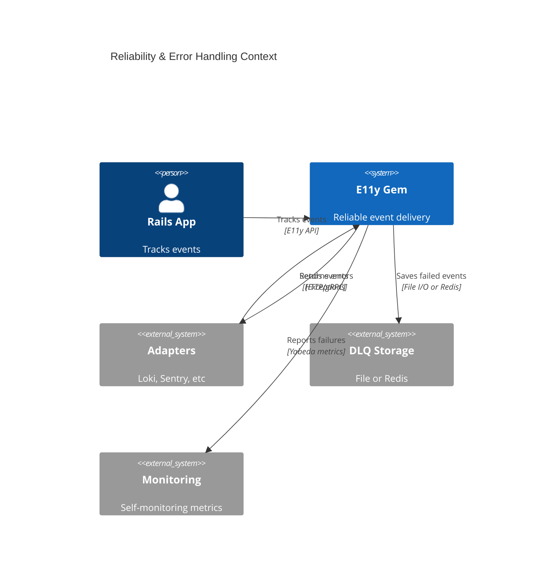
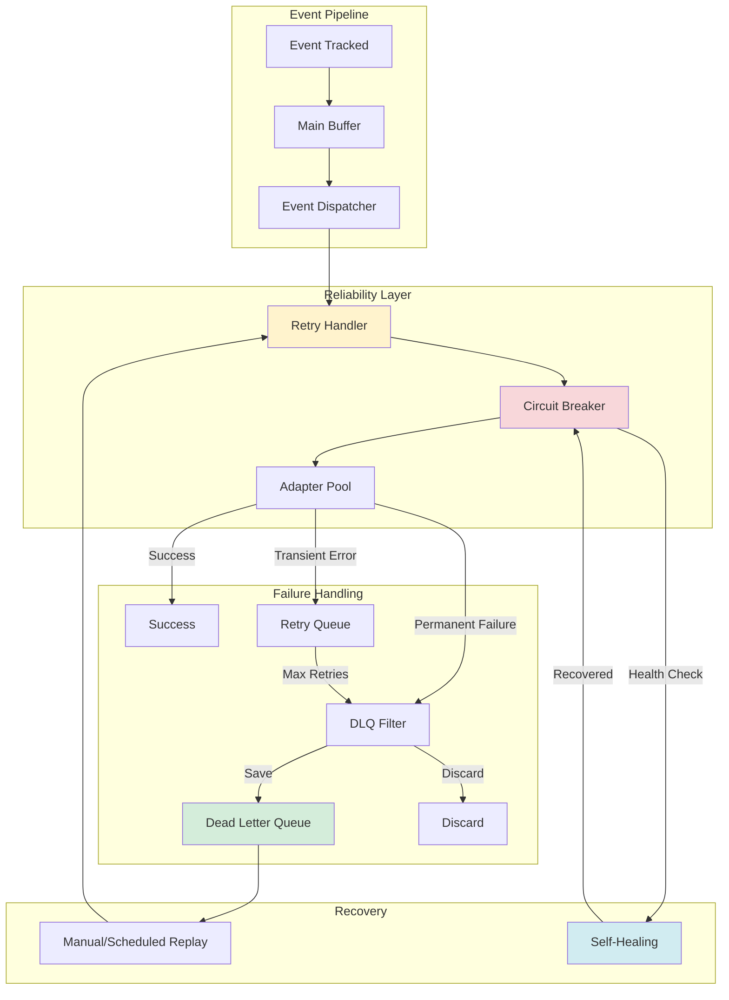
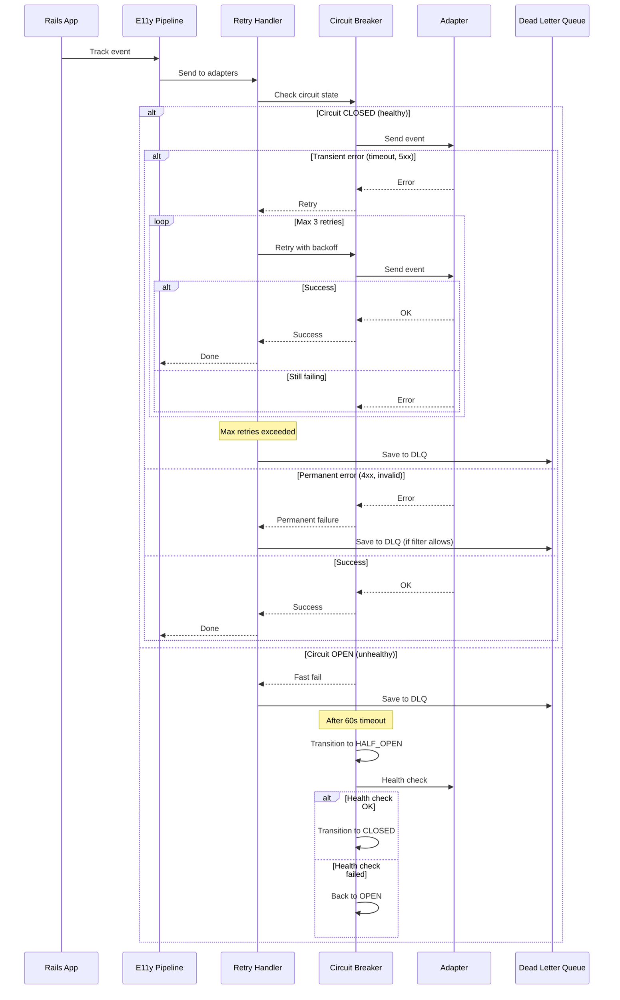
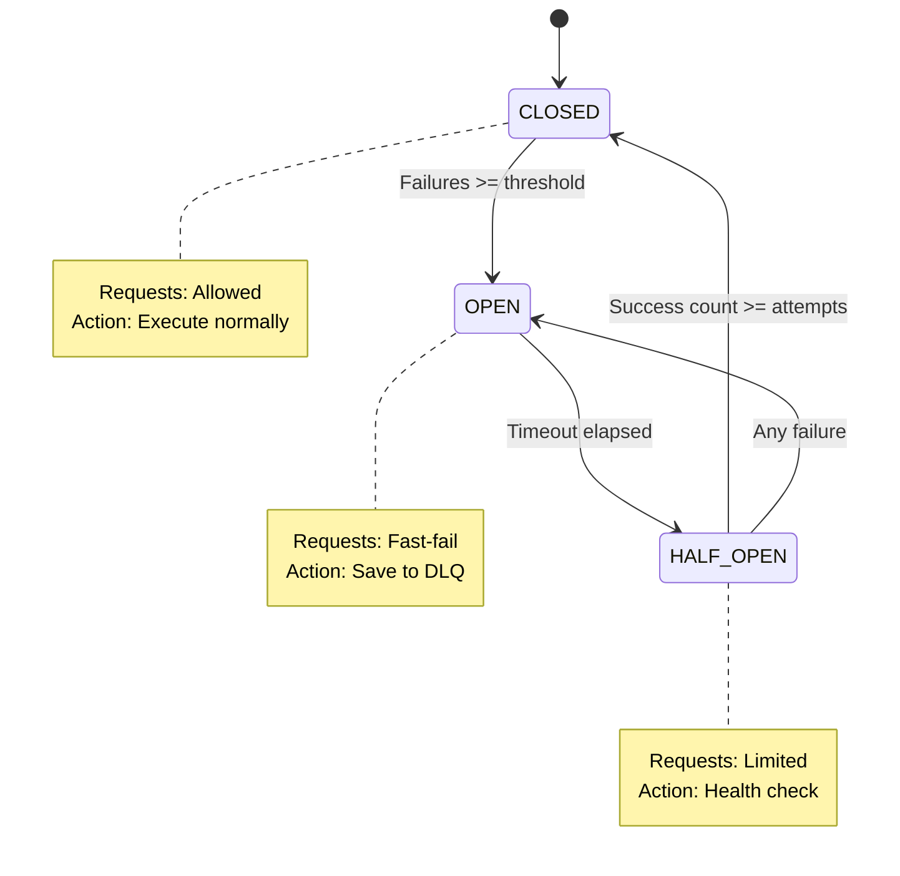

# ADR-013: Reliability & Error Handling

**Status:** Draft  
**Date:** January 12, 2026  
**Covers:** UC-021 (Error Handling, Retry Policy, DLQ)  
**Depends On:** ADR-001 (Core), ADR-004 (Adapters), ADR-006 (Security)

---

## 📋 Table of Contents

1. [Context & Problem](#1-context--problem)
2. [Architecture Overview](#2-architecture-overview)
3. [Retry Policy](#3-retry-policy)
   - 3.5. [Retry Rate Limiting (C06 Resolution)](#35-retry-rate-limiting-c06-resolution) ⚠️ CRITICAL
     - 3.5.1. The Problem: Thundering Herd on Adapter Recovery
     - 3.5.2. Decision: Separate Retry Rate Limiter with Staged Batching
     - 3.5.3. RetryHandler with Rate Limiting
     - 3.5.4. Configuration
     - 3.5.5. Staged Retry Batching
     - 3.5.6. Retry Storm Scenario (Without Rate Limiting)
     - 3.5.7. Monitoring Metrics
     - 3.5.8. Trade-offs (C06 Resolution)
   - 3.6. [Event Tracking in Background Jobs (C18 Resolution)](#36-event-tracking-in-background-jobs-c18-resolution) ⚠️ CRITICAL
     - 3.6.1. The Problem: Observability Blocking Business Logic
     - 3.6.2. Decision: Non-Failing Event Tracking in Jobs
     - 3.6.3. SidekiqErrorHandlingMiddleware
     - 3.6.4. Event Tracking with Error Handling
     - 3.6.5. Configuration
     - 3.6.6. Job Success Despite Event Tracking Failure
     - 3.6.7. Alternative Approach: Separate Event Tracking Job
     - 3.6.8. Monitoring & Alerting
     - 3.6.9. Trade-offs (C18 Resolution)
4. [Dead Letter Queue (DLQ)](#4-dead-letter-queue-dlq)
   - 4.6. [Rate Limiting × DLQ Filter Interaction (C02 Resolution)](#46-rate-limiting--dlq-filter-interaction-c02-resolution) ⚠️ CRITICAL
     - 4.6.1. The Problem: Critical Events Silently Dropped
     - 4.6.2. Decision: Rate Limiter Respects DLQ Filter
     - 4.6.3. Configuration: Bypass Rate Limiting for Critical Events
     - 4.6.4. Rate-Limited Payment Event Example
     - 4.6.5. Trade-offs: Bypass vs DLQ
     - 4.6.6. Monitoring Metrics
     - 4.6.7. Trade-offs (C02 Resolution)
5. [Circuit Breaker](#5-circuit-breaker)
6. [Graceful Degradation](#6-graceful-degradation)
7. [Self-Healing](#7-self-healing)
8. [Monitoring & Alerting](#8-monitoring--alerting)
9. [Trade-offs](#9-trade-offs)

---

## 1. Context & Problem

### 1.1. Problem Statement

**Failure Scenarios:**

1. **Adapter Failures:**
   ```ruby
   # ❌ Loki is down → events are lost
   Events::OrderPaid.track(order_id: 123)
   # Loki: Connection refused
   # → Event disappears forever
   ```

2. **Transient Errors:**
   ```ruby
   # ❌ Network timeout → no retry
   Adapters::Loki.send(events)
   # → 1 timeout = event lost
   ```

3. **Cascading Failures:**
   ```ruby
   # ❌ One adapter failure blocks others
   adapters = [loki, sentry, elasticsearch]
   adapters.each { |a| a.send(event) }  # Loki hangs → Sentry never called
   ```

4. **No Persistent Storage:**
   ```ruby
   # ❌ Critical events lost on failure
   Events::PaymentProcessed.track(amount: 100_000)
   # → If all adapters fail, event is gone
   ```

### 1.2. Goals

**Primary Goals:**
- ✅ **Zero event loss** for critical events
- ✅ **Automatic retry** with exponential backoff
- ✅ **Circuit breaker** to prevent cascading failures
- ✅ **Dead Letter Queue** for persistent storage
- ✅ **Graceful degradation** when adapters fail
- ✅ **Self-healing** when adapters recover

**Non-Goals:**
- ❌ Guaranteed ordering (at-least-once, not exactly-once)
- ❌ Distributed transactions across adapters
- ❌ Real-time replay from DLQ (manual/scheduled only)

### 1.3. Success Metrics

| Metric | Target | Critical? |
|--------|--------|-----------|
| **Event loss rate** | <0.01% | ✅ Yes |
| **Recovery time** | <60s (circuit breaker) | ✅ Yes |
| **Retry overhead** | <10ms p99 | ✅ Yes |
| **DLQ write latency** | <5ms p99 | ✅ Yes |

---

## 2. Architecture Overview

### 2.1. System Context



### 2.2. Component Architecture



### 2.3. Error Flow Sequence



---

## 3. Retry Policy

### 3.1. Exponential Backoff with Jitter

```ruby
# lib/e11y/reliability/retry_handler.rb
module E11y
  module Reliability
    class RetryHandler
      def initialize(config)
        @max_retries = config.max_retries
        @base_delay = config.base_delay_ms
        @max_delay = config.max_delay_ms
        @jitter = config.jitter
        @retry_on = config.retry_on_errors
      end
      
      def with_retry(adapter, event, &block)
        attempt = 0
        last_error = nil
        
        loop do
          begin
            result = yield
            
            # Track success metric
            E11y::Metrics.increment('e11y.retry.success', {
              adapter: adapter.name,
              attempt: attempt
            })
            
            return result
            
          rescue => error
            attempt += 1
            last_error = error
            
            # Check if error is retryable
            unless retryable_error?(error)
              E11y::Metrics.increment('e11y.retry.permanent_failure', {
                adapter: adapter.name,
                error_class: error.class.name
              })
              
              raise RetryExhausted.new(error, permanent: true)
            end
            
            # Check max retries
            if attempt > @max_retries
              E11y::Metrics.increment('e11y.retry.exhausted', {
                adapter: adapter.name,
                attempts: attempt
              })
              
              raise RetryExhausted.new(error, attempts: attempt)
            end
            
            # Calculate backoff delay
            delay = calculate_delay(attempt)
            
            E11y::Metrics.increment('e11y.retry.attempt', {
              adapter: adapter.name,
              attempt: attempt,
              delay_ms: delay
            })
            
            # Sleep with backoff
            sleep(delay / 1000.0)
          end
        end
      end
      
      private
      
      def retryable_error?(error)
        case error
        when *@retry_on
          true
        when Net::HTTPRetriableError, Net::OpenTimeout, Net::ReadTimeout
          true
        when Faraday::TimeoutError, Faraday::ConnectionFailed
          true
        when HTTP::TimeoutError, HTTP::ConnectionError
          true
        else
          # Check HTTP status code if available
          if error.respond_to?(:response)
            status = error.response[:status] rescue nil
            return status && (status >= 500 || status == 429)
          end
          
          false
        end
      end
      
      def calculate_delay(attempt)
        # Exponential backoff: base * 2^(attempt-1)
        delay = @base_delay * (2 ** (attempt - 1))
        
        # Cap at max_delay
        delay = [@max_delay, delay].min
        
        # Add jitter (± jitter%)
        if @jitter > 0
          jitter_amount = delay * @jitter
          delay = delay + rand(-jitter_amount..jitter_amount)
        end
        
        delay.to_i
      end
    end
    
    class RetryExhausted < StandardError
      attr_reader :original_error, :attempts, :permanent
      
      def initialize(original_error, attempts: nil, permanent: false)
        @original_error = original_error
        @attempts = attempts
        @permanent = permanent
        
        message = if permanent
          "Permanent failure: #{original_error.message}"
        else
          "Retry exhausted after #{attempts} attempts: #{original_error.message}"
        end
        
        super(message)
      end
    end
  end
end
```

### 3.2. Configuration

```ruby
# config/initializers/e11y.rb
E11y.configure do |config|
  config.error_handling.retry_policy do
    # Max retry attempts (default: 3)
    max_retries 3
    
    # Base delay in milliseconds (default: 100ms)
    base_delay_ms 100
    
    # Max delay cap (default: 5000ms = 5s)
    max_delay_ms 5000
    
    # Jitter percentage (default: 0.1 = ±10%)
    jitter 0.1
    
    # Custom retryable errors
    retry_on [
      Net::HTTPRetriableError,
      Faraday::TimeoutError,
      Faraday::ConnectionFailed,
      YourCustomError
    ]
    
    # Per-adapter retry config
    adapter_overrides do
      adapter :loki do
        max_retries 5        # More retries for critical adapter
        base_delay_ms 200
      end
      
      adapter :sentry do
        max_retries 2        # Fewer retries for non-critical
        base_delay_ms 50
      end
    end
  end
end
```

### 3.3. Retry Timeline Example

```
Attempt 1: Immediate (0ms)
  └─ Error (timeout)

Attempt 2: 100ms backoff (± 10ms jitter) = ~95-105ms
  └─ Error (timeout)

Attempt 3: 200ms backoff (± 20ms jitter) = ~180-220ms
  └─ Error (timeout)

Attempt 4: 400ms backoff (± 40ms jitter) = ~360-440ms
  └─ Success! Total time: ~800ms
```

### 3.4. Integration with Rate Limiting

**Critical:** Retries count toward rate limits (see Conflict #14 in CONFLICT-ANALYSIS.md).

```ruby
# lib/e11y/reliability/retry_handler.rb (extended)
def with_retry(adapter, event, &block)
  attempt = 0
  
  loop do
    # Check rate limit BEFORE each attempt (including retries)
    unless E11y::RateLimiter.allow?(event, adapter)
      E11y::Metrics.increment('e11y.retry.rate_limited', {
        adapter: adapter.name,
        attempt: attempt
      })
      
      # Rate limited → save to DLQ (bypass retries)
      raise RateLimitExceeded.new("Rate limit exceeded for #{adapter.name}")
    end
    
    begin
      return yield
    rescue => error
      attempt += 1
      # ... retry logic ...
    end
  end
rescue RateLimitExceeded => e
  # DLQ filter will decide if this should be saved
  raise RetryExhausted.new(e, permanent: true)
end
```

### 3.5. Retry Rate Limiting (C06 Resolution)

> **⚠️ CRITICAL: C06 Conflict Resolution - Retry Storm Prevention**  
> **See:** [CONFLICT-ANALYSIS.md C06](researches/CONFLICT-ANALYSIS.md#c06-rate-limiting--retry-storm-thundering-herd) for detailed analysis  
> **Problem:** Retry storms overwhelm adapters after recovery (thundering herd)  
> **Solution:** Separate rate limiter for retries with staged batching + jitter

#### 3.5.1. The Problem: Thundering Herd on Adapter Recovery

**When an adapter (Loki/Sentry) goes down and comes back up:**

```ruby
# Scenario: Loki down for 10 seconds
# - 1000 events buffered during outage
# - Each event configured for 3 retries
# - Loki recovers at t=10s

# WITHOUT retry rate limiting:
# t=10s: Loki comes back online
# t=10.1s: Retry wave 1 → 1000 events × 3 retries = 3000 requests
# t=10.2s: Retry wave 2 (backoff) → another 3000 requests
# Result: 6000 requests in 1 second → Loki CRASHES AGAIN!

# Problem: Main rate limiter (UC-011) applies to NEW events only
# Retries bypass rate limiter (happen after adapter write failure)
# → Adapter overload, cascade failure, longer downtime
```

**Architectural Trade-off:**
- ✅ **Retries needed** for reliability (zero event loss)
- ❌ **Retry storm** overwhelms recovering adapter
- ⚠️ **Main rate limiter ineffective** (retries bypass pipeline step 3)

#### 3.5.2. Decision: Separate Retry Rate Limiter with Staged Batching

**Approved Solution:**  
Implement **separate rate limiter** for retries with **staged batching** and **jitter**.

```ruby
# lib/e11y/reliability/retry_rate_limiter.rb
module E11y
  module Reliability
    class RetryRateLimiter
      # Token bucket algorithm for retry rate limiting
      def initialize(limit:, on_limit_exceeded:, jitter_range: 1.0)
        @limit = limit  # Max retries/sec (e.g., 100)
        @on_limit_exceeded = on_limit_exceeded  # :delay, :drop, :dlq
        @jitter_range = jitter_range  # ±100% jitter (spread timing)
        
        @bucket = TokenBucket.new(
          capacity: limit,
          refill_rate: limit,  # Refill per second
          refill_interval: 1.0  # 1 second
        )
      end
      
      # Check if retry is allowed
      def allow?(event, adapter)
        if @bucket.take(1)
          # Retry allowed
          E11y::Metrics.increment('e11y.retry.rate_limiter.allowed', {
            adapter: adapter.name
          })
          true
        else
          # Rate limit exceeded
          E11y::Metrics.increment('e11y.retry.rate_limiter.limited', {
            adapter: adapter.name,
            action: @on_limit_exceeded
          })
          false
        end
      end
      
      # Calculate retry delay with exponential backoff + jitter
      def calculate_delay(attempt)
        # Base delay: 2^attempt seconds
        base_delay = 2 ** attempt
        
        # Add jitter: ±jitter_range%
        jitter = rand(-@jitter_range..@jitter_range)
        final_delay = base_delay * (1 + jitter)
        
        # Cap at max delay (e.g., 60 seconds)
        [final_delay, 60.0].min
      end
    end
  end
end
```

#### 3.5.3. RetryHandler with Rate Limiting

**Updated RetryHandler implementation:**

```ruby
# lib/e11y/reliability/retry_handler.rb
module E11y
  module Reliability
    class RetryHandler
      def initialize(config)
        @config = config
        
        # NEW: Separate retry rate limiter
        @retry_rate_limiter = RetryRateLimiter.new(
          limit: config.retry_rate_limit.limit,
          on_limit_exceeded: config.retry_rate_limit.on_limit_exceeded,
          jitter_range: config.retry_rate_limit.jitter_range
        )
      end
      
      def with_retry(adapter, event, &block)
        attempt = 0
        
        loop do
          # NEW: Check retry rate limit BEFORE attempting
          unless @retry_rate_limiter.allow?(event, adapter)
            # Rate limit exceeded → handle according to strategy
            handle_rate_limit_exceeded(event, adapter, attempt)
            return  # Exit retry loop
          end
          
          begin
            # Attempt delivery
            result = yield
            
            # Success → track metrics
            E11y::Metrics.increment('e11y.retry.success', {
              adapter: adapter.name,
              attempt: attempt
            })
            
            return result
          rescue => error
            attempt += 1
            
            # Max retries exceeded?
            if attempt >= @config.max_retries
              handle_retry_exhausted(event, adapter, error, attempt)
              return
            end
            
            # Calculate backoff delay with jitter
            delay = @retry_rate_limiter.calculate_delay(attempt)
            
            # Log retry
            E11y.logger.warn(
              "Retry attempt #{attempt}/#{@config.max_retries} " \
              "for adapter #{adapter.name} after #{delay}s",
              error: error.class.name,
              event_type: event.type
            )
            
            # Wait before retry (with jitter)
            sleep(delay)
          end
        end
      end
      
      private
      
      def handle_rate_limit_exceeded(event, adapter, attempt)
        case @config.retry_rate_limit.on_limit_exceeded
        when :delay
          # Add to delayed retry queue (process later)
          delay = @retry_rate_limiter.calculate_delay(attempt)
          
          E11y::Reliability::DelayedRetryQueue.add(
            event: event,
            adapter: adapter,
            delay: delay,
            attempt: attempt
          )
          
          E11y.logger.warn(
            "Retry rate limited, delaying retry by #{delay}s",
            adapter: adapter.name,
            event_type: event.type
          )
          
        when :drop
          # Drop event (don't retry, don't save to DLQ)
          E11y.logger.error(
            "Retry rate limited, dropping event",
            adapter: adapter.name,
            event_type: event.type
          )
          
          E11y::Metrics.increment('e11y.retry.dropped', {
            adapter: adapter.name,
            reason: 'retry_rate_limited'
          })
          
        when :dlq
          # Send to DLQ (manual replay later)
          E11y::Reliability::DLQ.save(
            event,
            reason: 'retry_rate_limited',
            adapter: adapter.name,
            attempt: attempt
          )
          
          E11y.logger.warn(
            "Retry rate limited, saving to DLQ",
            adapter: adapter.name,
            event_type: event.type
          )
        end
      end
      
      def handle_retry_exhausted(event, adapter, error, attempt)
        # All retries exhausted → send to DLQ
        E11y::Reliability::DLQ.save(
          event,
          reason: 'retry_exhausted',
          adapter: adapter.name,
          attempt: attempt,
          last_error: error.message
        )
        
        E11y.logger.error(
          "Retry exhausted after #{attempt} attempts",
          adapter: adapter.name,
          event_type: event.type,
          error: error.message
        )
        
        E11y::Metrics.increment('e11y.retry.exhausted', {
          adapter: adapter.name
        })
      end
    end
  end
end
```

#### 3.5.4. Configuration

**Retry rate limiting configuration:**

```ruby
# config/initializers/e11y.rb
E11y.configure do |config|
  config.error_handling.retry_policy do
    enabled true
    max_retries 3
    
    # NEW: Retry rate limiting (C06 resolution)
    retry_rate_limit do
      enabled true
      
      # Max retries per second (separate from main rate limit)
      limit 100  # ← 100 retries/sec (prevents thundering herd)
      
      # What to do when retry rate limit exceeded:
      # - :delay (default) → Add to delayed retry queue (process later)
      # - :drop → Drop event immediately (no DLQ)
      # - :dlq → Save to DLQ for manual replay
      on_limit_exceeded :delay
      
      # Jitter range for spreading retry timing (avoid synchronized retries)
      # 1.0 = ±100% jitter (retry delay varies from 0.5x to 1.5x base delay)
      jitter_range 1.0
    end
  end
end
```

**Example configuration for different environments:**

```ruby
# Production: Conservative (prevent adapter overload)
config.error_handling.retry_policy.retry_rate_limit do
  limit 50  # Low limit (50 retries/sec)
  on_limit_exceeded :delay  # Delay retries (don't drop!)
  jitter_range 1.5  # High jitter (spread retries widely)
end

# Staging: Balanced (test retry behavior)
config.error_handling.retry_policy.retry_rate_limit do
  limit 100  # Medium limit
  on_limit_exceeded :delay
  jitter_range 1.0  # Standard jitter
end

# Development: Permissive (fast feedback)
config.error_handling.retry_policy.retry_rate_limit do
  limit 1000  # High limit (rarely hit)
  on_limit_exceeded :dlq  # Save to DLQ (inspect manually)
  jitter_range 0.5  # Low jitter (faster retries)
end
```

#### 3.5.5. Staged Retry Batching

**Alternative approach: Batch retries over time window:**

```ruby
# lib/e11y/reliability/staged_retry_batcher.rb
module E11y
  module Reliability
    class StagedRetryBatcher
      # Retry events in controlled batches
      def initialize(batch_size:, batch_interval:)
        @batch_size = batch_size  # Max events per batch (e.g., 100)
        @batch_interval = batch_interval  # Time between batches (e.g., 1s)
        @queue = Queue.new
        
        start_background_processor
      end
      
      # Add event to retry queue
      def enqueue(event, adapter, attempt)
        @queue << { event: event, adapter: adapter, attempt: attempt }
        
        E11y::Metrics.gauge('e11y.retry.queue_size', @queue.size)
      end
      
      private
      
      def start_background_processor
        Thread.new do
          loop do
            # Wait for batch interval
            sleep(@batch_interval)
            
            # Process batch
            process_batch
          end
        end
      end
      
      def process_batch
        batch = []
        
        # Collect up to batch_size events
        @batch_size.times do
          break if @queue.empty?
          batch << @queue.pop
        end
        
        return if batch.empty?
        
        # Process batch in parallel
        batch.each do |item|
          # Attempt retry (with rate limiting)
          retry_handler.with_retry(item[:adapter], item[:event]) do
            item[:adapter].write(item[:event])
          end
        end
        
        E11y::Metrics.increment('e11y.retry.batch_processed', {
          batch_size: batch.size
        })
      end
    end
  end
end

# Configuration:
config.error_handling.retry_policy.staged_retry do
  enabled true
  batch_size 100  # Process 100 events per batch
  batch_interval 1.0  # 1 batch per second → 100 events/sec
end
```

#### 3.5.6. Retry Storm Scenario (Without Rate Limiting)

**Concrete example showing the problem:**

```ruby
# Scenario: Loki outage + recovery
# Timeline:

# t=0s: Loki goes DOWN
# - Events start buffering (in-memory ring buffer)
# - Buffer size: 10,000 events capacity
# - Incoming rate: 100 events/sec

# t=0s to t=10s: Loki is DOWN
# - 1000 events buffered (100 events/sec × 10s)
# - All retries failing → circuit breaker OPEN

# t=10s: Loki comes BACK UP
# - Circuit breaker detects recovery → state: HALF_OPEN
# - Retry wave begins for 1000 buffered events

# WITHOUT retry rate limiting (C06):
# t=10.000s: Retry attempt #1 for 1000 events → 1000 requests in parallel
# t=10.100s: Retry attempt #2 (backoff 0.1s) → 1000 requests
# t=10.300s: Retry attempt #3 (backoff 0.2s) → 1000 requests
# Result: 3000 requests in 1 second
# → Loki: Connection pool exhausted! 502 Bad Gateway
# → Loki CRASHES AGAIN at t=10.5s (thundering herd!)

# WITH retry rate limiting (C06 resolution):
# t=10.000s: Retry rate limiter allows 100 events/sec
# t=10.000s: Batch 1 (100 events) → 100 requests (ALLOWED)
# t=11.000s: Batch 2 (100 events) → 100 requests (ALLOWED)
# t=12.000s: Batch 3 (100 events) → 100 requests (ALLOWED)
# ... continues for 10 seconds ...
# t=20.000s: All 1000 events retried (100 events/sec × 10s)
# Result: Controlled recovery, Loki STABLE! ✅

# Metrics comparison:
# Without rate limiting:
# - Peak throughput: 3000 req/sec (spike!)
# - Loki downtime: 10s (initial) + 60s (cascade) = 70s total
# - Events lost: 0 (but long recovery)

# With rate limiting:
# - Peak throughput: 100 req/sec (smooth)
# - Loki downtime: 10s (initial only)
# - Events lost: 0
# - Recovery time: 10s (staged batching)
```

#### 3.5.7. Monitoring Metrics

**Key metrics for retry rate limiting:**

```ruby
# Retry rate limiter metrics
e11y.retry.rate_limiter.allowed (counter)
  # Retry allowed by rate limiter
  labels: adapter

e11y.retry.rate_limiter.limited (counter)
  # Retry blocked by rate limiter
  labels: adapter, action (:delay/:drop/:dlq)

e11y.retry.queue_size (gauge)
  # Number of retries waiting in delayed queue

e11y.retry.batch_processed (counter)
  # Number of retry batches processed
  labels: batch_size

e11y.retry.delay_seconds (histogram)
  # Actual delay before retry (with jitter)
  labels: adapter, attempt

e11y.retry.dropped (counter)
  # Retries dropped due to rate limiting
  labels: adapter, reason
```

**Grafana dashboard queries:**

```promql
# Retry rate (retries/sec)
rate(e11y_retry_rate_limiter_allowed_total[1m])

# Retry rate limit hit rate (%)
rate(e11y_retry_rate_limiter_limited_total[1m]) 
/ 
(rate(e11y_retry_rate_limiter_allowed_total[1m]) + rate(e11y_retry_rate_limiter_limited_total[1m]))

# Retry queue backlog
e11y_retry_queue_size

# Average retry delay (seconds)
rate(e11y_retry_delay_seconds_sum[1m]) / rate(e11y_retry_delay_seconds_count[1m])
```

#### 3.5.8. Trade-offs (C06 Resolution)

| Aspect | With Retry Rate Limiting | Without Retry Rate Limiting |
|--------|--------------------------|------------------------------|
| **Adapter Protection** | ✅ Protected (smooth recovery) | ❌ Vulnerable (thundering herd) |
| **Recovery Time** | ⚠️ Slower (staged batching) | ✅ Faster (if adapter survives) |
| **Cascade Failure Risk** | ✅ Low (controlled load) | ❌ High (retry storm → crash) |
| **Complexity** | ⚠️ Higher (separate limiter) | ✅ Lower (no limiter) |
| **Event Loss Risk** | ✅ Zero (delayed, not dropped) | ⚠️ Medium (cascade → longer outage) |
| **Memory Footprint** | ⚠️ Higher (delayed queue) | ✅ Lower (immediate retry) |
| **Configuration Tuning** | ⚠️ Required (limit, jitter) | ✅ None needed |

**Why Retry Rate Limiting is Default:**
1. ✅ **Prevents cascade failures** - Adapter recovers smoothly without crashing again
2. ✅ **Zero event loss** - Retries delayed, not dropped (`:delay` strategy)
3. ✅ **Configurable** - Can adjust `limit` per environment (prod: 50, staging: 100)
4. ✅ **Jitter prevents synchronization** - Retries spread over time (avoid lock-step)
5. ⚠️ **Trade-off: Slower recovery** - But SAFER recovery (no cascade)

**Related Conflicts:**
- **C02:** Rate Limiting × DLQ Filter (see §4.4 below)
- **C18:** Non-failing event tracking in jobs (see §3.6 below)
- **UC-011:** Rate Limiting (main rate limiter)
- **UC-021:** DLQ Replay interaction

### 3.6. Event Tracking in Background Jobs (C18 Resolution)

> **⚠️ CRITICAL: C18 Conflict Resolution - Event Tracking Should Not Fail Jobs**  
> **See:** [CONFLICT-ANALYSIS.md C18](researches/CONFLICT-ANALYSIS.md#c18-background-job-tracking--circuit-breaker-open) for detailed analysis  
> **Problem:** Event tracking failures cause background jobs to fail (business logic blocked)  
> **Solution:** Disable `fail_on_error` for Sidekiq/ActiveJob contexts, wrap tracking in rescue

#### 3.6.1. The Problem: Observability Blocking Business Logic

**When circuit breaker opens during a background job:**

```ruby
# Scenario: Loki circuit breaker OPEN (adapter down)
# Background job attempts to track event

class SendOrderEmailJob < ApplicationJob
  def perform(order_id)
    order = Order.find(order_id)
    
    # Send email (business logic)
    OrderMailer.confirmation(order).deliver_now  # ✅ SUCCESS
    
    # Track event (observability)
    Events::EmailSent.track(order_id: order_id)  # ❌ FAILS!
    # → Circuit breaker open → raises CircuitBreakerOpen exception
    # → Job FAILS and retries!
    
    # Problem:
    # - Email ALREADY SENT (business logic succeeded)
    # - But job is marked as FAILED (due to event tracking)
    # - Job retries → sends DUPLICATE EMAIL!
  end
end

# Result:
# - Customer receives 3 duplicate emails (3 retries)
# - Job fails despite email sent successfully
# - Observability failure blocks business logic!
```

**Architectural Conflict:**
- ✅ **Circuit breaker needed** for adapter protection
- ❌ **Circuit breaker blocks jobs** when event tracking fails
- ⚠️ **Business logic success ≠ observability success**

#### 3.6.2. Decision: Non-Failing Event Tracking in Jobs

**Approved Solution:**  
Event tracking failures should **NOT** fail background jobs. Observability is **secondary** to business logic.

```ruby
# lib/e11y/config.rb
module E11y
  class Config
    attr_accessor :error_handling
    
    def initialize
      @error_handling = ErrorHandlingConfig.new
    end
  end
  
  class ErrorHandlingConfig
    # Should event tracking errors raise exceptions?
    # Default: true (for web requests - fast feedback)
    # Exception: false (for background jobs - don't fail business logic)
    attr_accessor :fail_on_error
    
    def initialize
      @fail_on_error = true  # Default: raise errors
    end
  end
end
```

#### 3.6.3. SidekiqErrorHandlingMiddleware

**Sidekiq server middleware to disable `fail_on_error`:**

```ruby
# lib/e11y/middleware/sidekiq_error_handling_middleware.rb
module E11y
  module Middleware
    class SidekiqErrorHandlingMiddleware
      def call(worker, job, queue)
        # Save original setting
        original_fail_on_error = E11y.config.error_handling.fail_on_error
        
        # Disable failing on errors for this job
        # Observability should NOT block business logic!
        E11y.config.error_handling.fail_on_error = false
        
        E11y.logger.debug(
          "Sidekiq job starting with fail_on_error=false",
          job_class: worker.class.name,
          job_id: job['jid']
        )
        
        yield
      ensure
        # Restore original setting
        E11y.config.error_handling.fail_on_error = original_fail_on_error
      end
    end
  end
end

# Configure Sidekiq server
Sidekiq.configure_server do |config|
  config.server_middleware do |chain|
    # Add BEFORE E11y tracing middleware
    chain.add E11y::Middleware::SidekiqErrorHandlingMiddleware
  end
end
```

#### 3.6.4. Event Tracking with Error Handling

**Updated Event.track method with conditional error handling:**

```ruby
# lib/e11y/event.rb
module E11y
  class Event
    def self.track(attributes = {})
      event = new(attributes)
      
      # Validate event
      unless event.valid?
        handle_error(ValidationError.new(event.errors))
        return nil
      end
      
      # Send through pipeline
      begin
        E11y::Pipeline.process(event)
      rescue CircuitBreakerOpen, AdapterTimeout, RateLimitExceeded => e
        # Adapter failure → handle according to fail_on_error setting
        handle_error(e)
        return nil
      rescue => e
        # Unexpected error → always log
        E11y.logger.error(
          "Unexpected error in E11y event tracking",
          error: e.class.name,
          message: e.message,
          event_type: event.type
        )
        
        handle_error(e)
        return nil
      end
      
      event
    end
    
    private
    
    def self.handle_error(error)
      # Should we raise or swallow?
      if E11y.config.error_handling.fail_on_error
        # Web request context: RAISE (fast feedback!)
        raise error
      else
        # Background job context: SWALLOW (don't fail job!)
        E11y.logger.warn(
          "E11y event tracking failed (fail_on_error=false)",
          error: error.class.name,
          message: error.message,
          context: :background_job
        )
        
        # Send to DLQ for later replay
        E11y::Reliability::DLQ.save(
          event,
          reason: 'event_tracking_failed_in_job',
          error: error.message
        )
        
        # Track metric
        E11y::Metrics.increment('e11y.event.tracking_failed_silent', {
          error_class: error.class.name,
          context: :background_job
        })
        
        # DON'T re-raise!
        nil
      end
    end
  end
end
```

#### 3.6.5. Configuration

**Global configuration:**

```ruby
# config/initializers/e11y.rb
E11y.configure do |config|
  config.error_handling do |error_handling|
    # Default: raise errors in web requests (fast feedback)
    # Automatically disabled in Sidekiq/ActiveJob (via middleware)
    error_handling.fail_on_error = true
    
    # Alternative: Manually control per context
    # error_handling.fail_on_error_contexts do
    #   web_requests true   # Raise errors
    #   background_jobs false  # Swallow errors (don't fail job)
    #   rake_tasks true     # Raise errors (CLI feedback)
    # end
  end
end
```

**Per-job override (if needed):**

```ruby
# app/jobs/critical_job.rb
class CriticalReportJob < ApplicationJob
  # Override: This job SHOULD fail if event tracking fails
  # (because tracking is part of compliance requirements)
  
  def perform(report_id)
    # Temporarily enable fail_on_error
    E11y.config.error_handling.fail_on_error = true
    
    # Generate report
    report = Report.generate(report_id)
    
    # Track event (MUST succeed for compliance!)
    Events::ReportGenerated.track(
      report_id: report_id,
      user_id: report.user_id
    )
    # ↑ If this fails, job SHOULD fail (retry later)
  ensure
    # Restore default (will be restored by middleware anyway)
    E11y.config.error_handling.fail_on_error = false
  end
end
```

#### 3.6.6. Job Success Despite Event Tracking Failure

**Example showing job succeeding even when circuit breaker open:**

```ruby
# Scenario: Loki circuit breaker OPEN

class ProcessPaymentJob < ApplicationJob
  def perform(payment_id)
    payment = Payment.find(payment_id)
    
    # 1. Charge credit card (business logic)
    result = StripeGateway.charge(
      amount: payment.amount,
      token: payment.token
    )
    # ✅ SUCCESS: $100 charged
    
    # 2. Update payment status (business logic)
    payment.update!(
      status: :completed,
      charged_at: Time.current,
      stripe_charge_id: result.id
    )
    # ✅ SUCCESS: Database updated
    
    # 3. Track event (observability)
    Events::PaymentCompleted.track(
      payment_id: payment.id,
      amount: payment.amount,
      stripe_charge_id: result.id
    )
    # ❌ FAILS: Circuit breaker OPEN
    # BUT: Error swallowed! (fail_on_error = false)
    # Event saved to DLQ for later replay
    
    # 4. Send confirmation email (business logic)
    PaymentMailer.confirmation(payment).deliver_now
    # ✅ SUCCESS: Email sent
    
    # JOB RESULT: ✅ SUCCESS!
    # - Payment charged
    # - Database updated
    # - Email sent
    # - Event tracking failed BUT job did NOT fail
    # - Event in DLQ (will replay when Loki recovers)
  end
end

# Job metrics:
# - Job status: ✅ SUCCESS
# - Business logic: 100% success rate
# - Observability: ⚠️ Event missed (in DLQ)
# - Customer experience: ✅ Perfect (no issues)
```

#### 3.6.7. Alternative Approach: Separate Event Tracking Job

**Decouple business logic from event tracking:**

```ruby
# Don't track events inline in jobs
# Instead: Enqueue separate event tracking job

class SendEmailJob < ApplicationJob
  def perform(order_id)
    order = Order.find(order_id)
    
    # Business logic: Send email
    OrderMailer.confirmation(order).deliver_now
    
    # DON'T track event here!
    # Instead: Enqueue event tracking job (can fail independently)
    TrackEventJob.perform_async(
      event_type: 'email.sent',
      payload: {
        order_id: order.id,
        email: order.email,
        sent_at: Time.current.iso8601
      }
    )
  end
end

# Separate job for event tracking (lower priority)
class TrackEventJob < ApplicationJob
  queue_as :events  # ← Separate queue (lower priority than business logic)
  
  # Fewer retries (observability less critical than business logic)
  retry_on StandardError, wait: :exponentially_longer, attempts: 3
  
  def perform(event_type, payload)
    # This job CAN fail without affecting business logic
    Events::Base.track(event_type, **payload)
  end
end
```

**Trade-offs of separate job approach:**

| Aspect | Inline Tracking (§3.6.4) | Separate Job (§3.6.7) |
|--------|---------------------------|------------------------|
| **Coupling** | ⚠️ Coupled (same job) | ✅ Decoupled (separate jobs) |
| **Latency** | ✅ Immediate (sync) | ⚠️ Delayed (async) |
| **Failure Isolation** | ✅ Silent failure (DLQ) | ✅ Complete isolation (separate queue) |
| **Complexity** | ✅ Simple (one job) | ⚠️ Higher (two jobs) |
| **Queue Management** | ✅ Same queue | ⚠️ Must manage events queue |
| **Cost** | ✅ Lower (one job) | ⚠️ Higher (two jobs) |

**Recommendation:**  
Use **inline tracking with `fail_on_error=false`** (§3.6.4) as default. Reserve **separate job** (§3.6.7) for:
- High-volume jobs (millions/day)
- Critical jobs where ANY failure is unacceptable
- Jobs with strict latency requirements

#### 3.6.8. Monitoring & Alerting

**Key metrics for background job event tracking:**

```ruby
# Silent failures (event tracking failed but job succeeded)
e11y.event.tracking_failed_silent (counter)
  # Event tracking failed in background job (error swallowed)
  labels: error_class, context

# Job context detection
e11y.event.tracked_in_job (counter)
  # Event tracked successfully in background job
  labels: job_class

e11y.event.dlq_from_job (counter)
  # Event sent to DLQ from background job
  labels: job_class, reason
```

**Alert rules:**

```yaml
# Alert: High rate of silent failures in jobs
- alert: E11yJobTrackingFailureHigh
  expr: |
    rate(e11y_event_tracking_failed_silent_total{context="background_job"}[5m]) > 10
  for: 5m
  annotations:
    summary: "E11y event tracking failing in background jobs"
    description: "{{ $value }} events/sec failing silently in jobs"
  
# Alert: Circuit breaker blocking job events
- alert: E11yJobEventsBlockedByCircuitBreaker
  expr: |
    rate(e11y_event_tracking_failed_silent_total{error_class="CircuitBreakerOpen",context="background_job"}[5m]) > 5
  for: 2m
  annotations:
    summary: "E11y circuit breaker blocking job events"
    description: "Circuit breaker open - job events going to DLQ"
```

#### 3.6.9. Trade-offs (C18 Resolution)

| Aspect | fail_on_error=false (Jobs) | fail_on_error=true (Default) |
|--------|----------------------------|------------------------------|
| **Job Success Rate** | ✅ High (observability doesn't block) | ❌ Low (event failures → job failures) |
| **Business Logic** | ✅ Never blocked | ❌ Blocked by event tracking issues |
| **Fast Feedback** | ⚠️ Silent failures (no exception) | ✅ Immediate exceptions |
| **Event Loss Risk** | ✅ Zero (DLQ saves all) | ⚠️ Medium (job retries may skip) |
| **Debugging** | ⚠️ Harder (check DLQ + logs) | ✅ Easier (job fails immediately) |
| **Customer Impact** | ✅ None (business logic succeeds) | ❌ High (duplicate emails, failed orders) |
| **Observability Gaps** | ⚠️ Possible (events in DLQ) | ⚠️ Possible (job doesn't retry events) |

**Why fail_on_error=false for Jobs:**
1. ✅ **Business logic > observability** - Payment success > event tracking
2. ✅ **Prevents duplicate actions** - No duplicate emails/charges on retry
3. ✅ **Circuit breaker doesn't block jobs** - Jobs succeed during adapter outage
4. ✅ **Events preserved in DLQ** - Can replay when adapter recovers
5. ⚠️ **Trade-off: Silent failures** - But business logic succeeds (acceptable)

**Related Conflicts:**
- **C06:** Retry rate limiting (see §3.5 above)
- **C17:** Background job tracing (see ADR-005 §8.3)
- **UC-010:** Background Job Tracking
- **UC-021:** DLQ Replay

---

## 4. Dead Letter Queue (DLQ)

### 4.1. DLQ Storage Interface

```ruby
# lib/e11y/reliability/dlq/base.rb
module E11y
  module Reliability
    module DLQ
      class Base
        def save(event_data, metadata)
          raise NotImplementedError
        end
        
        def list(limit: 100, offset: 0, filters: {})
          raise NotImplementedError
        end
        
        def replay(event_id)
          raise NotImplementedError
        end
        
        def replay_batch(event_ids)
          raise NotImplementedError
        end
        
        def delete(event_id)
          raise NotImplementedError
        end
        
        def stats
          raise NotImplementedError
        end
      end
    end
  end
end
```

### 4.2. File-based DLQ (Default)

```ruby
# lib/e11y/reliability/dlq/file_storage.rb
module E11y
  module Reliability
    module DLQ
      class FileStorage < Base
        def initialize(config)
          @directory = config.directory || Rails.root.join('tmp', 'e11y', 'dlq')
          @max_file_size = config.max_file_size || 10.megabytes
          @retention_days = config.retention_days || 30
          
          FileUtils.mkdir_p(@directory)
        end
        
        def save(event_data, metadata)
          event_id = SecureRandom.uuid
          timestamp = Time.now.utc
          
          dlq_entry = {
            id: event_id,
            timestamp: timestamp.iso8601,
            event_name: event_data[:event_name],
            event_data: event_data,
            metadata: metadata.merge(
              failed_at: timestamp.iso8601,
              retry_count: metadata[:retry_count] || 0,
              last_error: metadata[:error]&.message,
              error_class: metadata[:error]&.class&.name
            )
          }
          
          # Partition by date for efficient cleanup
          date_partition = timestamp.strftime('%Y-%m-%d')
          partition_dir = @directory.join(date_partition)
          FileUtils.mkdir_p(partition_dir)
          
          # Append to daily file
          file_path = partition_dir.join('events.jsonl')
          
          File.open(file_path, 'a') do |f|
            f.flock(File::LOCK_EX)
            f.puts(JSON.generate(dlq_entry))
          end
          
          # Track metric
          E11y::Metrics.increment('e11y.dlq.saved', {
            event_name: event_data[:event_name],
            adapter: metadata[:adapter]
          })
          
          event_id
        end
        
        def list(limit: 100, offset: 0, filters: {})
          entries = []
          
          Dir.glob(@directory.join('*', 'events.jsonl')).sort.reverse.each do |file|
            File.readlines(file).drop(offset).first(limit).each do |line|
              entry = JSON.parse(line, symbolize_names: true)
              
              # Apply filters
              next if filters[:event_name] && entry[:event_name] != filters[:event_name]
              next if filters[:after] && Time.parse(entry[:timestamp]) < filters[:after]
              
              entries << entry
              break if entries.size >= limit
            end
            
            break if entries.size >= limit
          end
          
          entries
        end
        
        def replay(event_id)
          entry = find_entry(event_id)
          return nil unless entry
          
          # Re-dispatch event through normal pipeline
          E11y::Pipeline.dispatch(
            entry[:event_data],
            metadata: entry[:metadata].merge(dlq_replayed: true)
          )
          
          # Delete from DLQ after successful replay
          delete(event_id)
          
          E11y::Metrics.increment('e11y.dlq.replayed', {
            event_name: entry[:event_name]
          })
          
          true
        rescue => error
          # Replay failed → keep in DLQ, increment retry count
          E11y::Metrics.increment('e11y.dlq.replay_failed', {
            event_name: entry[:event_name],
            error: error.class.name
          })
          
          false
        end
        
        def stats
          total_events = 0
          oldest_event = nil
          newest_event = nil
          
          Dir.glob(@directory.join('*', 'events.jsonl')).each do |file|
            lines = File.readlines(file)
            total_events += lines.size
            
            first_entry = JSON.parse(lines.first, symbolize_names: true) rescue nil
            last_entry = JSON.parse(lines.last, symbolize_names: true) rescue nil
            
            oldest_event ||= first_entry[:timestamp] if first_entry
            newest_event = last_entry[:timestamp] if last_entry
          end
          
          {
            total_events: total_events,
            oldest_event: oldest_event,
            newest_event: newest_event,
            storage_path: @directory.to_s,
            disk_usage: disk_usage_mb
          }
        end
        
        def cleanup_old_entries!
          cutoff_date = @retention_days.days.ago.to_date
          
          Dir.glob(@directory.join('*')).each do |partition_dir|
            partition_date = Date.parse(File.basename(partition_dir)) rescue nil
            next unless partition_date
            
            if partition_date < cutoff_date
              FileUtils.rm_rf(partition_dir)
              E11y::Metrics.increment('e11y.dlq.partition_deleted', {
                date: partition_date.to_s
              })
            end
          end
        end
        
        private
        
        def find_entry(event_id)
          Dir.glob(@directory.join('*', 'events.jsonl')).each do |file|
            File.readlines(file).each do |line|
              entry = JSON.parse(line, symbolize_names: true)
              return entry if entry[:id] == event_id
            end
          end
          
          nil
        end
        
        def disk_usage_mb
          total_size = Dir.glob(@directory.join('**', '*'))
            .select { |f| File.file?(f) }
            .sum { |f| File.size(f) }
          
          (total_size / 1.megabyte.to_f).round(2)
        end
      end
    end
  end
end
```

### 4.3. Redis-based DLQ (Optional)

```ruby
# lib/e11y/reliability/dlq/redis_storage.rb
module E11y
  module Reliability
    module DLQ
      class RedisStorage < Base
        DLQ_KEY = 'e11y:dlq:events'
        DLQ_INDEX_KEY = 'e11y:dlq:index'
        
        def initialize(config)
          @redis = config.redis_client || Redis.new(url: config.redis_url)
          @ttl = config.retention_days.days.to_i
        end
        
        def save(event_data, metadata)
          event_id = SecureRandom.uuid
          timestamp = Time.now.utc.to_i
          
          dlq_entry = {
            id: event_id,
            timestamp: timestamp,
            event_name: event_data[:event_name],
            event_data: event_data,
            metadata: metadata
          }
          
          @redis.pipelined do |pipeline|
            # Store event data (with TTL)
            pipeline.setex(
              "#{DLQ_KEY}:#{event_id}",
              @ttl,
              JSON.generate(dlq_entry)
            )
            
            # Add to sorted set (by timestamp)
            pipeline.zadd(DLQ_INDEX_KEY, timestamp, event_id)
          end
          
          E11y::Metrics.increment('e11y.dlq.saved', {
            event_name: event_data[:event_name],
            storage: 'redis'
          })
          
          event_id
        end
        
        def list(limit: 100, offset: 0, filters: {})
          # Get event IDs from sorted set (newest first)
          event_ids = @redis.zrevrange(DLQ_INDEX_KEY, offset, offset + limit - 1)
          
          return [] if event_ids.empty?
          
          # Fetch event data in bulk
          entries = @redis.mget(*event_ids.map { |id| "#{DLQ_KEY}:#{id}" })
            .compact
            .map { |json| JSON.parse(json, symbolize_names: true) }
          
          # Apply filters
          if filters[:event_name]
            entries.select! { |e| e[:event_name] == filters[:event_name] }
          end
          
          entries
        end
        
        def replay(event_id)
          json = @redis.get("#{DLQ_KEY}:#{event_id}")
          return nil unless json
          
          entry = JSON.parse(json, symbolize_names: true)
          
          # Re-dispatch
          E11y::Pipeline.dispatch(
            entry[:event_data],
            metadata: entry[:metadata].merge(dlq_replayed: true)
          )
          
          # Delete from DLQ
          delete(event_id)
          
          true
        rescue => error
          E11y::Metrics.increment('e11y.dlq.replay_failed', {
            error: error.class.name
          })
          
          false
        end
        
        def delete(event_id)
          @redis.pipelined do |pipeline|
            pipeline.del("#{DLQ_KEY}:#{event_id}")
            pipeline.zrem(DLQ_INDEX_KEY, event_id)
          end
        end
        
        def stats
          {
            total_events: @redis.zcard(DLQ_INDEX_KEY),
            storage: 'redis',
            redis_memory: @redis.info('memory')['used_memory_human']
          }
        end
      end
    end
  end
end
```

### 4.4. DLQ Filter (Selective Storage)

```ruby
# lib/e11y/reliability/dlq/filter.rb
module E11y
  module Reliability
    module DLQ
      class Filter
        def initialize(config)
          @always_save_patterns = config.always_save_patterns || []
          @never_save_patterns = config.never_save_patterns || []
          @save_if_block = config.save_if_block
        end
        
        def should_save?(event_data, metadata)
          event_name = event_data[:event_name]
          
          # Priority 1: Never save (explicit exclusion)
          return false if matches_any?(@never_save_patterns, event_name)
          
          # Priority 2: Always save (explicit inclusion)
          return true if matches_any?(@always_save_patterns, event_name)
          
          # Priority 3: Custom filter block
          if @save_if_block
            context = FilterContext.new(event_data, metadata)
            return @save_if_block.call(context)
          end
          
          # Default: save all failed events
          true
        end
        
        private
        
        def matches_any?(patterns, event_name)
          patterns.any? do |pattern|
            case pattern
            when String
              event_name == pattern
            when Regexp
              event_name =~ pattern
            when Proc
              pattern.call(event_name)
            end
          end
        end
        
        class FilterContext
          attr_reader :event_data, :metadata
          
          def initialize(event_data, metadata)
            @event_data = event_data
            @metadata = metadata
          end
          
          def event_name
            @event_data[:event_name]
          end
          
          def payload
            @event_data[:payload]
          end
          
          def error
            @metadata[:error]
          end
          
          def adapter
            @metadata[:adapter]
          end
          
          def retry_count
            @metadata[:retry_count] || 0
          end
        end
      end
    end
  end
end
```

### 4.4.1. DLQ Filter: Event DSL (Implemented)

The DLQ filter uses **Event DSL** with a single `use_dlq` flag:

```ruby
# Audit events (Presets::AuditEvent) have use_dlq true by default
class Events::UserDeleted < E11y::Events::BaseAuditEvent
  # use_dlq true from preset — always saved to DLQ
end

# Explicit opt-in for critical business events
class Events::PaymentFailed < E11y::Event::Base
  use_dlq true
end

# Explicit opt-out for noise
class Events::DebugTrace < E11y::Event::Base
  use_dlq false
end

# Default (nil): severity-based (error/fatal saved) + default_behavior
```

**Priority order:** 1) `use_dlq false` → 2) `use_dlq true` → 3) severity → 4) default.

### 4.5. DLQ Configuration

```ruby
# config/initializers/e11y.rb
E11y.configure do |config|
  config.error_handling.dead_letter_queue do
    # Storage backend
    storage :file  # or :redis
    
    # File storage options
    file_storage do
      directory Rails.root.join('tmp', 'e11y', 'dlq')
      max_file_size 10.megabytes
      retention_days 30
    end
    
    # Redis storage options (alternative)
    redis_storage do
      redis_url ENV['REDIS_URL']
      retention_days 7  # Shorter for Redis (expensive)
    end
    
    # DLQ Filter: which events to save
    filter do
      # Always save critical events
      always_save_patterns [
        /^payment\./,
        /^order\./,
        /^audit\./,
        'Events::CriticalEvent'
      ]
      
      # Never save health checks or metrics
      never_save_patterns [
        /^health_check\./,
        /^metrics\./,
        'Events::DebugEvent'
      ]
      
      # Custom logic
      save_if do |context|
        # Save if payment amount > $100
        if context.event_name.include?('payment')
          (context.payload[:amount] || 0) > 100
        else
          # Save if > 2 retries (indicates persistent issue)
          context.retry_count > 2
        end
      end
    end
    
    # Auto-cleanup old entries
    auto_cleanup do
      enabled true
      schedule '0 2 * * *'  # Daily at 2 AM
    end
  end
end
```

### 4.6. Rate Limiting × DLQ Filter Interaction (C02 Resolution)

> **⚠️ CRITICAL: C02 Conflict Resolution - Rate Limiting Respects DLQ Filter**  
> **See:** [CONFLICT-ANALYSIS.md C02](researches/CONFLICT-ANALYSIS.md#c02-rate-limiting--dlq-filter-uc-021) for detailed analysis  
> **Problem:** Rate-limited critical events dropped despite `always_save` DLQ filter  
> **Solution:** Rate limiter checks DLQ filter before dropping, critical events bypass to DLQ

#### 4.6.1. The Problem: Critical Events Silently Dropped

**When rate limiting interacts with DLQ filter:**

```ruby
# Configuration:
config.rate_limiting do
  enabled true
  limit 1000  # events/sec
end

config.error_handling.dead_letter_queue.filter do
  always_save_patterns [/^payment\./]  # ← Always save payment events!
end

# Scenario: Traffic spike (1500 events/sec)
1500.times do |i|
  Events::PaymentFailed.track(
    order_id: i,
    amount: 100,
    error: 'card_declined'
  )
end

# WITHOUT C02 resolution:
# - First 1000 events: PROCESSED ✅
# - Next 500 events: RATE LIMITED → DROPPED ❌
# Problem: Payment events DROPPED despite `always_save` filter!
# DLQ filter never sees rate-limited events (rate limiting happens BEFORE DLQ)
```

**Architectural Conflict:**
- ✅ **Rate limiting needed** for adapter protection
- ✅ **DLQ filter needed** for critical event preservation
- ❌ **Pipeline order:** Rate limiting (step 3) → DLQ (step 7, after adapter failure)
- ⚠️ **Rate-limited events never reach DLQ filter!**

#### 4.6.2. Decision: Rate Limiter Respects DLQ Filter

**Approved Solution:**  
Rate limiter must **check DLQ filter** before dropping events. Critical events go to DLQ instead of being dropped.

```ruby
# lib/e11y/middleware/rate_limiter.rb
module E11y
  module Middleware
    class RateLimiter < Base
      def call(event, next_middleware)
        # Check rate limit
        unless @limiter.allow?(event)
          # Rate limit exceeded!
          E11y::Metrics.increment('e11y.rate_limiter.limited', {
            event_type: event.type
          })
          
          # NEW: Check DLQ filter BEFORE dropping
          if should_save_to_dlq?(event)
            # Critical event → Send to DLQ (don't drop!)
            E11y::Reliability::DLQ.save(
              event,
              reason: 'rate_limited',
              metadata: {
                rate_limit: @config.limit,
                exceeded_at: Time.current.iso8601
              }
            )
            
            E11y.logger.warn(
              "Rate-limited critical event saved to DLQ",
              event_type: event.type,
              rate_limit: @config.limit
            )
            
            E11y::Metrics.increment('e11y.rate_limiter.dlq_saved', {
              event_type: event.type
            })
            
            # DON'T process event (rate limited), but saved to DLQ
            return nil
          else
            # Non-critical event → Drop silently
            E11y.logger.debug(
              "Rate-limited event dropped",
              event_type: event.type
            )
            
            E11y::Metrics.increment('e11y.rate_limiter.dropped', {
              event_type: event.type
            })
            
            # Event dropped (not saved)
            return nil
          end
        end
        
        # Rate limit OK → continue pipeline
        next_middleware.call(event)
      end
      
      private
      
      def should_save_to_dlq?(event)
        # Check DLQ filter (if enabled)
        return false unless E11y.config.error_handling.dead_letter_queue.enabled
        
        # Get DLQ filter
        dlq_filter = E11y::Reliability::DLQ::Filter.new(
          E11y.config.error_handling.dead_letter_queue.filter_config
        )
        
        # Ask filter: Should this event be saved?
        dlq_filter.should_save?(
          event.to_h,
          { reason: 'rate_limited' }
        )
      end
    end
  end
end
```

#### 4.6.3. Configuration: Bypass Rate Limiting for Critical Events

**Alternative approach: Bypass rate limiting entirely for critical events:**

```ruby
# config/initializers/e11y.rb
E11y.configure do |config|
  config.rate_limiting do
    enabled true
    limit 1000  # events/sec
    
    # NEW: Bypass rate limiting for critical patterns (C02 resolution)
    bypass_for do
      # Bypass by severity
      severity [:error, :fatal]
      
      # Bypass by event pattern
      event_patterns [
        /^payment\./,    # All payment events
        /^audit\./,      # All audit events
        /^order\.failed/ # Specific critical events
      ]
      
      # Bypass by custom logic
      custom_check do |event|
        # Example: High-value payments
        event.type.start_with?('payment.') && 
          event.payload[:amount].to_i > 10_000
      end
    end
  end
  
  config.error_handling.dead_letter_queue do
    enabled true
    
    filter do
      # Always save patterns (aligned with bypass_for above)
      always_save_patterns [/^payment\./, /^audit\./]
    end
  end
end
```

#### 4.6.4. Rate-Limited Payment Event Example

**Concrete example showing critical event preservation:**

```ruby
# Scenario: Payment service under DDoS attack
# Normal rate: 100 payments/sec
# Attack rate: 5000 req/sec (mixed: 1000 payments + 4000 junk)

# Rate limit: 1000 events/sec total
config.rate_limiting.limit = 1000

# Events arriving:
# - 1000 legitimate payment events
# - 4000 junk events (bots, scrapers)

# Processing (WITH C02 resolution):

# Batch 1 (first 1000 events/sec):
# - 600 legitimate payments → PROCESSED ✅
# - 400 junk events → PROCESSED ✅ (consumed rate limit)

# Batch 2 (next 4000 events/sec):
# - 400 legitimate payments → RATE LIMITED
#   → Check DLQ filter → Match `/^payment\./` pattern
#   → SAVED TO DLQ ✅ (not dropped!)
# - 3600 junk events → RATE LIMITED → DROPPED ❌ (not critical)

# Result:
# - Legitimate payments: 1000 total
#   → 600 processed immediately
#   → 400 saved to DLQ (can replay later)
#   → ZERO payment data loss! ✅
# - Junk events: 4000 total
#   → 400 processed (wasted capacity)
#   → 3600 dropped (correct behavior)

# WITHOUT C02 resolution:
# - 400 legitimate payments LOST! ❌
# - No forensics, no replay, compliance violation
```

#### 4.6.5. Trade-offs: Bypass vs DLQ

| Approach | Bypass Rate Limiting (§4.6.3) | Save to DLQ (§4.6.2) |
|----------|-------------------------------|----------------------|
| **Adapter Protection** | ⚠️ Partial (critical events can overload) | ✅ Full (all events rate-limited) |
| **Critical Event Loss** | ✅ Zero (always processed) | ✅ Zero (saved to DLQ) |
| **Attack Surface** | ❌ High (attacker can fake critical events) | ✅ Low (all events limited) |
| **Latency** | ✅ Immediate (no delay) | ⚠️ Delayed (replay from DLQ) |
| **Complexity** | ⚠️ Higher (bypass logic) | ⚠️ Higher (DLQ check) |
| **Cost** | ⚠️ Higher (more events processed) | ✅ Lower (fewer events processed) |

**Recommendation:**  
Use **Save to DLQ** (§4.6.2) as default. Reserve **Bypass** (§4.6.3) for:
- Audit events (compliance requirement - MUST process immediately)
- High-severity alerts (operational safety)
- Events with authentication (can't be faked by attackers)

**Warning about Bypass:**
```ruby
# ⚠️ SECURITY RISK: Bypass can be exploited!
config.rate_limiting.bypass_for.event_patterns [/^payment\./]

# Attack scenario:
# Attacker sends 10,000 fake payment events with pattern:
Events::PaymentProcessed.track(amount: 1)  # ← Matches bypass pattern!
# → ALL events bypass rate limiting
# → Adapter OVERLOADED despite rate limiter enabled
# → DDoS successful! ❌

# Solution: Require authentication for bypass
config.rate_limiting.bypass_for.custom_check do |event|
  event.type.start_with?('payment.') && 
    event.metadata[:authenticated] == true  # ← Verify authenticity
end
```

#### 4.6.6. Monitoring Metrics

**Key metrics for rate limiting × DLQ interaction:**

```ruby
# Rate limiter saved to DLQ (instead of dropped)
e11y.rate_limiter.dlq_saved (counter)
  # Critical event rate-limited but saved to DLQ
  labels: event_type

# Rate limiter dropped events
e11y.rate_limiter.dropped (counter)
  # Non-critical event rate-limited and dropped
  labels: event_type

# DLQ entries by reason
e11y.dlq.entries_by_reason (counter)
  # Track why events went to DLQ
  labels: reason  # 'rate_limited', 'retry_exhausted', 'circuit_breaker_open'
```

**Alert rules:**

```yaml
# Alert: Critical events being rate-limited
- alert: E11yCriticalEventsRateLimited
  expr: |
    rate(e11y_rate_limiter_dlq_saved_total[5m]) > 10
  for: 2m
  annotations:
    summary: "E11y rate limiting critical events"
    description: "{{ $value }} critical events/sec rate-limited (saved to DLQ)"
  
# Alert: High DLQ entries from rate limiting
- alert: E11yDlqRateLimitedHigh
  expr: |
    rate(e11y_dlq_entries_by_reason_total{reason="rate_limited"}[5m]) > 50
  for: 5m
  annotations:
    summary: "E11y DLQ filling from rate-limited events"
    description: "{{ $value }} events/sec going to DLQ due to rate limiting"
```

#### 4.6.7. Trade-offs (C02 Resolution)

| Aspect | With DLQ Filter Check | Without DLQ Filter Check |
|--------|------------------------|---------------------------|
| **Critical Event Loss** | ✅ Zero (saved to DLQ) | ❌ High (dropped silently) |
| **DLQ Filter Guarantee** | ✅ Respected (`always_save` works) | ❌ Violated (filter never sees events) |
| **Adapter Protection** | ✅ Full (rate limiting works) | ✅ Full (rate limiting works) |
| **Complexity** | ⚠️ Higher (filter check in rate limiter) | ✅ Lower (simple drop) |
| **Performance** | ⚠️ Slower (filter evaluation) | ✅ Faster (immediate drop) |
| **Forensics** | ✅ Available (DLQ replay) | ❌ Lost (no record) |
| **Compliance** | ✅ Meets (audit trail preserved) | ❌ Fails (data loss) |

**Why DLQ Filter Check is Default:**
1. ✅ **Zero critical data loss** - Payment/audit events never lost
2. ✅ **DLQ filter works as documented** - `always_save` guarantee respected
3. ✅ **Forensics preserved** - Can replay rate-limited events when load drops
4. ✅ **Compliance met** - Audit trail complete (no silent drops)
5. ⚠️ **Trade-off: Complexity** - But SAFETY > simplicity for critical events

**Related Conflicts:**
- **C06:** Retry rate limiting (see §3.5 above)
- **C18:** Non-failing job tracking (see §3.6 above)
- **UC-011:** Rate Limiting
- **UC-021:** DLQ & Replay

---

## 5. Circuit Breaker

### 5.1. Circuit Breaker Implementation

```ruby
# lib/e11y/reliability/circuit_breaker.rb
module E11y
  module Reliability
    class CircuitBreaker
      STATE_CLOSED = :closed
      STATE_OPEN = :open
      STATE_HALF_OPEN = :half_open
      
      def initialize(adapter_name, config)
        @adapter_name = adapter_name
        @threshold = config.failure_threshold
        @timeout = config.timeout_seconds
        @half_open_attempts = config.half_open_attempts
        
        @state = STATE_CLOSED
        @failure_count = 0
        @success_count = 0
        @last_failure_time = nil
        @opened_at = nil
        @mutex = Mutex.new
      end
      
      def call
        check_state_transition
        
        case @state
        when STATE_CLOSED
          execute_with_closed_circuit { yield }
        when STATE_OPEN
          handle_open_circuit
        when STATE_HALF_OPEN
          execute_with_half_open_circuit { yield }
        end
      end
      
      def healthy?
        @state == STATE_CLOSED
      end
      
      def stats
        {
          adapter: @adapter_name,
          state: @state,
          failure_count: @failure_count,
          success_count: @success_count,
          last_failure: @last_failure_time,
          opened_at: @opened_at
        }
      end
      
      private
      
      def execute_with_closed_circuit
        begin
          result = yield
          on_success
          result
        rescue => error
          on_failure(error)
          raise
        end
      end
      
      def execute_with_half_open_circuit
        begin
          result = yield
          on_half_open_success
          result
        rescue => error
          on_half_open_failure(error)
          raise
        end
      end
      
      def handle_open_circuit
        E11y::Metrics.increment('e11y.circuit_breaker.rejected', {
          adapter: @adapter_name
        })
        
        raise CircuitOpenError.new(@adapter_name, @opened_at)
      end
      
      def on_success
        @mutex.synchronize do
          @failure_count = 0
          @success_count += 1
          @last_failure_time = nil
        end
      end
      
      def on_failure(error)
        @mutex.synchronize do
          @failure_count += 1
          @last_failure_time = Time.now
          
          if @failure_count >= @threshold
            transition_to_open
          end
          
          E11y::Metrics.increment('e11y.circuit_breaker.failure', {
            adapter: @adapter_name,
            count: @failure_count
          })
        end
      end
      
      def on_half_open_success
        @mutex.synchronize do
          @success_count += 1
          
          if @success_count >= @half_open_attempts
            transition_to_closed
          end
        end
      end
      
      def on_half_open_failure(error)
        @mutex.synchronize do
          transition_to_open
        end
      end
      
      def transition_to_open
        @state = STATE_OPEN
        @opened_at = Time.now
        @failure_count = 0
        @success_count = 0
        
        E11y::Metrics.gauge('e11y.circuit_breaker.state', 2, {
          adapter: @adapter_name,
          state: 'open'
        })
        
        # Log warning
        E11y.logger.warn(
          "Circuit breaker OPENED for adapter: #{@adapter_name}"
        )
      end
      
      def transition_to_half_open
        @state = STATE_HALF_OPEN
        @success_count = 0
        
        E11y::Metrics.gauge('e11y.circuit_breaker.state', 1, {
          adapter: @adapter_name,
          state: 'half_open'
        })
        
        E11y.logger.info(
          "Circuit breaker HALF-OPEN for adapter: #{@adapter_name}"
        )
      end
      
      def transition_to_closed
        @state = STATE_CLOSED
        @opened_at = nil
        @failure_count = 0
        @success_count = 0
        
        E11y::Metrics.gauge('e11y.circuit_breaker.state', 0, {
          adapter: @adapter_name,
          state: 'closed'
        })
        
        E11y.logger.info(
          "Circuit breaker CLOSED for adapter: #{@adapter_name}"
        )
      end
      
      def check_state_transition
        return unless @state == STATE_OPEN
        
        @mutex.synchronize do
          if Time.now - @opened_at >= @timeout
            transition_to_half_open
          end
        end
      end
      
      class CircuitOpenError < StandardError
        attr_reader :adapter_name, :opened_at
        
        def initialize(adapter_name, opened_at)
          @adapter_name = adapter_name
          @opened_at = opened_at
          
          super("Circuit breaker is OPEN for adapter '#{adapter_name}' (opened at #{opened_at})")
        end
      end
    end
  end
end
```

### 5.2. Circuit Breaker Configuration

```ruby
# config/initializers/e11y.rb
E11y.configure do |config|
  config.error_handling.circuit_breaker do
    # Enable circuit breaker
    enabled true
    
    # Failure threshold (consecutive failures to trip)
    failure_threshold 5
    
    # Timeout before attempting recovery (seconds)
    timeout_seconds 60
    
    # Successful attempts in HALF_OPEN before closing
    half_open_attempts 3
    
    # Per-adapter overrides
    adapter_overrides do
      adapter :loki do
        failure_threshold 10  # More tolerant for Loki
        timeout_seconds 120   # Longer recovery time
      end
      
      adapter :sentry do
        failure_threshold 3   # Less tolerant for Sentry
        timeout_seconds 30    # Faster recovery
      end
    end
  end
end
```

### 5.3. Circuit Breaker State Diagram



---

## 6. Graceful Degradation

### 6.1. Partial Delivery Strategy

**Design Decision:** If one adapter fails, others should still succeed.

```ruby
# lib/e11y/pipeline/dispatcher.rb (extended)
module E11y
  module Pipeline
    class Dispatcher
      def dispatch_to_adapters(event_data, adapters)
        results = {}
        errors = {}
        
        # Dispatch to all adapters in parallel (Thread pool)
        futures = adapters.map do |adapter|
          Concurrent::Future.execute do
            begin
              circuit_breaker = CircuitBreaker.for(adapter.name)
              
              circuit_breaker.call do
                retry_handler.with_retry(adapter, event_data) do
                  adapter.send(event_data)
                end
              end
              
              [adapter.name, :success]
            rescue CircuitBreaker::CircuitOpenError => e
              # Circuit open → fast fail to DLQ
              [adapter.name, :circuit_open]
            rescue RetryHandler::RetryExhausted => e
              # Retries exhausted → save to DLQ
              [adapter.name, :retry_exhausted]
            rescue => e
              # Unexpected error → save to DLQ
              [adapter.name, :error, e]
            end
          end
        end
        
        # Wait for all futures (with timeout)
        futures.each_with_index do |future, index|
          adapter_name, status, error = future.value!(5.seconds) rescue [:timeout]
          
          case status
          when :success
            results[adapter_name] = :ok
          when :circuit_open, :retry_exhausted, :error, :timeout
            errors[adapter_name] = error || status
            
            # Save to DLQ if filter allows
            save_to_dlq_if_allowed(event_data, adapter_name, error)
          end
        end
        
        # Track metrics
        E11y::Metrics.histogram('e11y.dispatch.success_rate', 
          results.size.to_f / adapters.size,
          { total_adapters: adapters.size }
        )
        
        # Partial success is still considered success
        # (Graceful degradation)
        {
          success: results.size > 0,
          results: results,
          errors: errors
        }
      end
      
      private
      
      def save_to_dlq_if_allowed(event_data, adapter_name, error)
        metadata = {
          adapter: adapter_name,
          error: error,
          retry_count: 3,  # Assume max retries
          timestamp: Time.now.utc
        }
        
        if dlq_filter.should_save?(event_data, metadata)
          dlq_storage.save(event_data, metadata)
        else
          E11y::Metrics.increment('e11y.dlq.filtered_out', {
            event_name: event_data[:event_name],
            adapter: adapter_name
          })
        end
      end
    end
  end
end
```

---

## 7. Self-Healing

### 7.1. Background Health Checker

```ruby
# lib/e11y/reliability/health_checker.rb
module E11y
  module Reliability
    class HealthChecker
      def initialize(config)
        @interval = config.check_interval_seconds
        @thread = nil
        @running = false
      end
      
      def start!
        return if @running
        
        @running = true
        @thread = Thread.new { run_health_checks }
      end
      
      def stop!
        @running = false
        @thread&.join(5.seconds)
      end
      
      private
      
      def run_health_checks
        loop do
          break unless @running
          
          check_all_adapters
          sleep(@interval)
        end
      rescue => error
        E11y.logger.error("Health checker error: #{error.message}")
        retry
      end
      
      def check_all_adapters
        E11y.config.adapters.each do |name, adapter|
          circuit_breaker = CircuitBreaker.for(name)
          
          # Only check adapters with open/half-open circuits
          next if circuit_breaker.healthy?
          
          begin
            adapter.health_check
            
            E11y::Metrics.increment('e11y.health_check.success', {
              adapter: name
            })
          rescue => error
            E11y::Metrics.increment('e11y.health_check.failure', {
              adapter: name,
              error: error.class.name
            })
          end
        end
      end
    end
  end
end
```

### 7.2. Automatic DLQ Replay (Optional)

```ruby
# lib/e11y/reliability/auto_replayer.rb
module E11y
  module Reliability
    class AutoReplayer
      def initialize(config)
        @enabled = config.enabled
        @schedule = config.schedule  # Cron expression
        @batch_size = config.batch_size
        @max_age = config.max_age_hours
      end
      
      def replay_old_events
        return unless @enabled
        
        cutoff_time = @max_age.hours.ago
        
        events = DLQ.list(
          limit: @batch_size,
          filters: { after: cutoff_time }
        )
        
        success_count = 0
        failure_count = 0
        
        events.each do |event|
          if DLQ.replay(event[:id])
            success_count += 1
          else
            failure_count += 1
          end
        end
        
        E11y::Metrics.histogram('e11y.dlq.auto_replay.success_rate',
          success_count.to_f / (success_count + failure_count),
          { batch_size: events.size }
        )
        
        {
          total: events.size,
          success: success_count,
          failure: failure_count
        }
      end
    end
  end
end
```

---

## 8. Monitoring & Alerting

### 8.1. Key Metrics

```ruby
# Self-monitoring metrics for reliability
E11y::Metrics.define do
  # Retry metrics
  counter 'e11y.retry.attempt', 'Retry attempt', [:adapter, :attempt, :delay_ms]
  counter 'e11y.retry.success', 'Retry succeeded', [:adapter, :attempt]
  counter 'e11y.retry.exhausted', 'Retry exhausted', [:adapter, :attempts]
  counter 'e11y.retry.permanent_failure', 'Permanent failure', [:adapter, :error_class]
  
  # Circuit breaker metrics
  gauge 'e11y.circuit_breaker.state', 'Circuit state (0=closed, 1=half_open, 2=open)', [:adapter]
  counter 'e11y.circuit_breaker.opened', 'Circuit opened', [:adapter]
  counter 'e11y.circuit_breaker.closed', 'Circuit closed', [:adapter]
  counter 'e11y.circuit_breaker.rejected', 'Requests rejected (circuit open)', [:adapter]
  
  # DLQ metrics
  counter 'e11y.dlq.saved', 'Events saved to DLQ', [:event_name, :adapter]
  counter 'e11y.dlq.replayed', 'Events replayed from DLQ', [:event_name]
  counter 'e11y.dlq.replay_failed', 'DLQ replay failed', [:event_name, :error]
  counter 'e11y.dlq.filtered_out', 'Events filtered out (not saved)', [:event_name, :adapter]
  gauge 'e11y.dlq.size', 'Total events in DLQ', []
  
  # Health check metrics
  counter 'e11y.health_check.success', 'Health check succeeded', [:adapter]
  counter 'e11y.health_check.failure', 'Health check failed', [:adapter, :error]
  
  # Dispatch metrics
  histogram 'e11y.dispatch.success_rate', 'Adapter success rate', [:total_adapters]
end
```

### 8.2. Alert Rules (Prometheus/Grafana)

```yaml
# Alert when circuit breaker opens
- alert: E11yCircuitBreakerOpen
  expr: e11y_circuit_breaker_state == 2
  for: 1m
  labels:
    severity: warning
  annotations:
    summary: "E11y circuit breaker open for {{ $labels.adapter }}"

# Alert when DLQ grows too large
- alert: E11yDLQSizeHigh
  expr: e11y_dlq_size > 10000
  for: 5m
  labels:
    severity: critical
  annotations:
    summary: "E11y DLQ has {{ $value }} events (threshold: 10000)"

# Alert when retry rate is high
- alert: E11yHighRetryRate
  expr: rate(e11y_retry_attempt[5m]) > 100
  for: 2m
  labels:
    severity: warning
  annotations:
    summary: "E11y retry rate is {{ $value }}/s (threshold: 100/s)"
```

---

## 9. Trade-offs

### 9.1. Key Decisions

| Decision | Pro | Con | Rationale |
|----------|-----|-----|-----------|
| **Exponential backoff** | Adaptive recovery | Longer delays | Industry best practice |
| **Jitter** | Avoid thundering herd | Complexity | Prevent simultaneous retries |
| **Per-adapter circuit breaker** | Isolation | Memory overhead | Independent failure domains |
| **File-based DLQ (default)** | No dependencies | Slower | Simple, reliable |
| **Redis DLQ (optional)** | Faster | Requires Redis | For high-volume |
| **DLQ filter** | Cost control | Event loss risk | Critical events prioritized |
| **Graceful degradation** | Partial success | Complexity | Availability > consistency |
| **Retries count toward rate limit** | Prevent abuse | May discard events | DLQ safety net |
| **Retry rate limiting (C06)** ⚠️ | Prevents cascade failures | Slower recovery | Protects recovering adapters |
| **Non-failing job tracking (C18)** ⚠️ | Business logic never blocked | Silent failures | Observability < business logic |
| **Rate limiter checks DLQ (C02)** ⚠️ | Zero critical data loss | Higher complexity | `always_save` guarantee respected |

### 9.2. Alternatives Considered

**A) No retry policy**
- ❌ Rejected: Too many transient failures

**B) Fixed backoff delay**
- ❌ Rejected: Not adaptive to failure severity

**C) Global circuit breaker**
- ❌ Rejected: One adapter failure affects all

**D) Database-backed DLQ**
- ❌ Rejected: Added dependency, slower writes

**E) Immediate DLQ replay**
- ❌ Rejected: Could overwhelm recovering adapters

---

**Status:** ✅ Draft Complete  
**Next:** ADR-011 (Testing Strategy) or ADR-005 (Tracing & Context)  
**Estimated Implementation:** 3 weeks
