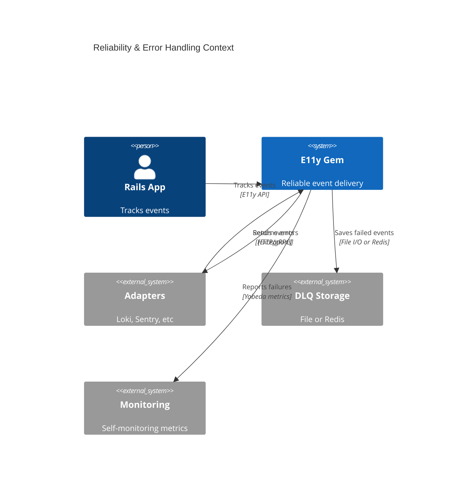
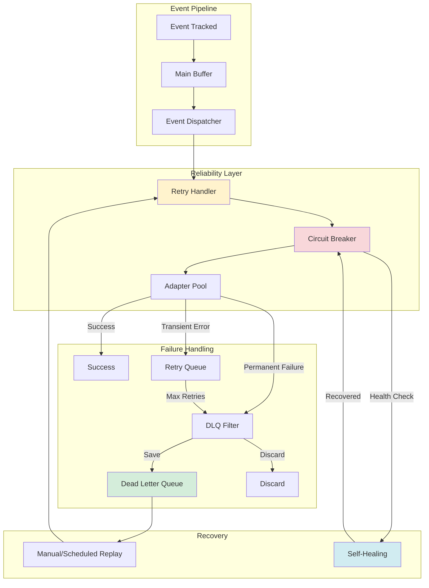
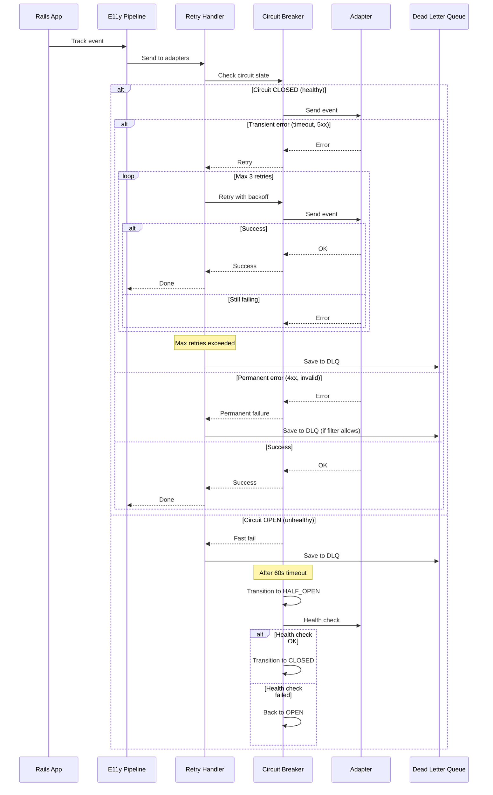
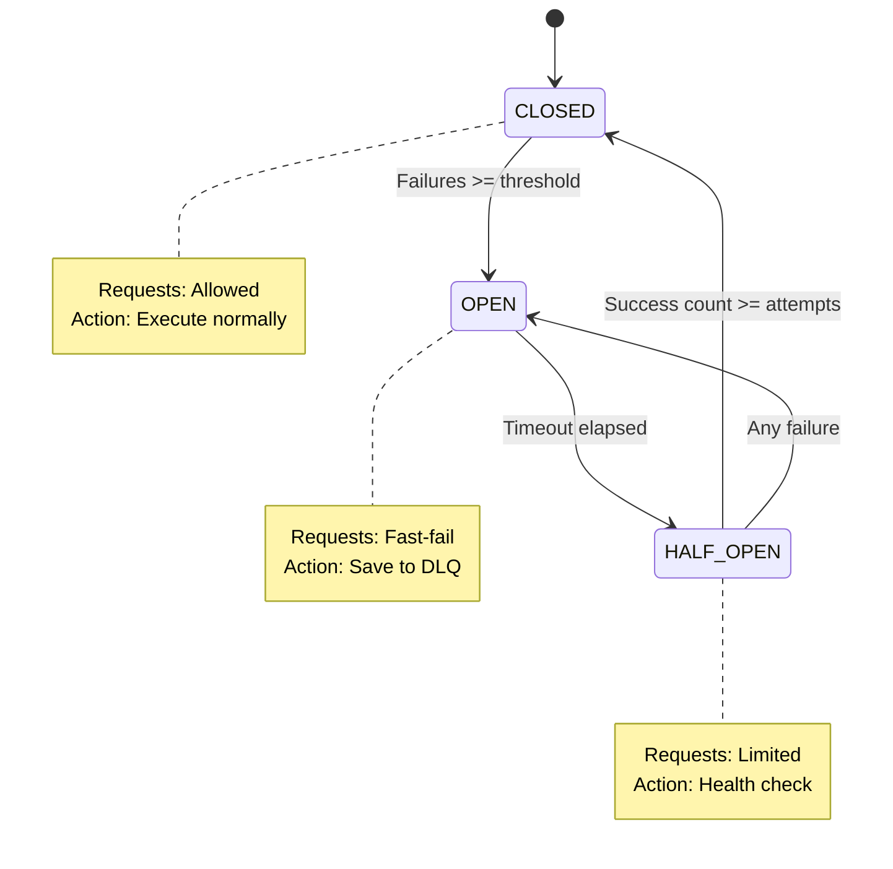

# ADR-013: Reliability & Error Handling

**Status:** Draft  
**Date:** January 12, 2026  
**Covers:** UC-021 (Error Handling, Retry Policy, DLQ)  
**Depends On:** ADR-001 (Core), ADR-004 (Adapters), ADR-006 (Security)

---

## 📋 Table of Contents

1. [Context & Problem](#1-context--problem)
2. [Architecture Overview](#2-architecture-overview)
3. [Retry Policy](#3-retry-policy)
4. [Dead Letter Queue (DLQ)](#4-dead-letter-queue-dlq)
5. [Circuit Breaker](#5-circuit-breaker)
6. [Graceful Degradation](#6-graceful-degradation)
7. [Self-Healing](#7-self-healing)
8. [Monitoring & Alerting](#8-monitoring--alerting)
9. [Trade-offs](#9-trade-offs)

---

## 1. Context & Problem

### 1.1. Problem Statement

**Failure Scenarios:**

1. **Adapter Failures:**
   ```ruby
   # ❌ Loki is down → events are lost
   Events::OrderPaid.track(order_id: 123)
   # Loki: Connection refused
   # → Event disappears forever
   ```

2. **Transient Errors:**
   ```ruby
   # ❌ Network timeout → no retry
   Adapters::Loki.send(events)
   # → 1 timeout = event lost
   ```

3. **Cascading Failures:**
   ```ruby
   # ❌ One adapter failure blocks others
   adapters = [loki, sentry, elasticsearch]
   adapters.each { |a| a.send(event) }  # Loki hangs → Sentry never called
   ```

4. **No Persistent Storage:**
   ```ruby
   # ❌ Critical events lost on failure
   Events::PaymentProcessed.track(amount: 100_000)
   # → If all adapters fail, event is gone
   ```

### 1.2. Goals

**Primary Goals:**
- ✅ **Zero event loss** for critical events
- ✅ **Automatic retry** with exponential backoff
- ✅ **Circuit breaker** to prevent cascading failures
- ✅ **Dead Letter Queue** for persistent storage
- ✅ **Graceful degradation** when adapters fail
- ✅ **Self-healing** when adapters recover

**Non-Goals:**
- ❌ Guaranteed ordering (at-least-once, not exactly-once)
- ❌ Distributed transactions across adapters
- ❌ Real-time replay from DLQ (manual/scheduled only)

### 1.3. Success Metrics

| Metric | Target | Critical? |
|--------|--------|-----------|
| **Event loss rate** | <0.01% | ✅ Yes |
| **Recovery time** | <60s (circuit breaker) | ✅ Yes |
| **Retry overhead** | <10ms p99 | ✅ Yes |
| **DLQ write latency** | <5ms p99 | ✅ Yes |

---

## 2. Architecture Overview

### 2.1. System Context



### 2.2. Component Architecture



### 2.3. Error Flow Sequence



---

## 3. Retry Policy

### 3.1. Exponential Backoff with Jitter

```ruby
# lib/e11y/reliability/retry_handler.rb
module E11y
  module Reliability
    class RetryHandler
      def initialize(config)
        @max_retries = config.max_retries
        @base_delay = config.base_delay_ms
        @max_delay = config.max_delay_ms
        @jitter = config.jitter
        @retry_on = config.retry_on_errors
      end
      
      def with_retry(adapter, event, &block)
        attempt = 0
        last_error = nil
        
        loop do
          begin
            result = yield
            
            # Track success metric
            E11y::Metrics.increment('e11y.retry.success', {
              adapter: adapter.name,
              attempt: attempt
            })
            
            return result
            
          rescue => error
            attempt += 1
            last_error = error
            
            # Check if error is retryable
            unless retryable_error?(error)
              E11y::Metrics.increment('e11y.retry.permanent_failure', {
                adapter: adapter.name,
                error_class: error.class.name
              })
              
              raise RetryExhausted.new(error, permanent: true)
            end
            
            # Check max retries
            if attempt > @max_retries
              E11y::Metrics.increment('e11y.retry.exhausted', {
                adapter: adapter.name,
                attempts: attempt
              })
              
              raise RetryExhausted.new(error, attempts: attempt)
            end
            
            # Calculate backoff delay
            delay = calculate_delay(attempt)
            
            E11y::Metrics.increment('e11y.retry.attempt', {
              adapter: adapter.name,
              attempt: attempt,
              delay_ms: delay
            })
            
            # Sleep with backoff
            sleep(delay / 1000.0)
          end
        end
      end
      
      private
      
      def retryable_error?(error)
        case error
        when *@retry_on
          true
        when Net::HTTPRetriableError, Net::OpenTimeout, Net::ReadTimeout
          true
        when Faraday::TimeoutError, Faraday::ConnectionFailed
          true
        when HTTP::TimeoutError, HTTP::ConnectionError
          true
        else
          # Check HTTP status code if available
          if error.respond_to?(:response)
            status = error.response[:status] rescue nil
            return status && (status >= 500 || status == 429)
          end
          
          false
        end
      end
      
      def calculate_delay(attempt)
        # Exponential backoff: base * 2^(attempt-1)
        delay = @base_delay * (2 ** (attempt - 1))
        
        # Cap at max_delay
        delay = [@max_delay, delay].min
        
        # Add jitter (± jitter%)
        if @jitter > 0
          jitter_amount = delay * @jitter
          delay = delay + rand(-jitter_amount..jitter_amount)
        end
        
        delay.to_i
      end
    end
    
    class RetryExhausted < StandardError
      attr_reader :original_error, :attempts, :permanent
      
      def initialize(original_error, attempts: nil, permanent: false)
        @original_error = original_error
        @attempts = attempts
        @permanent = permanent
        
        message = if permanent
          "Permanent failure: #{original_error.message}"
        else
          "Retry exhausted after #{attempts} attempts: #{original_error.message}"
        end
        
        super(message)
      end
    end
  end
end
```

### 3.2. Configuration

```ruby
# config/initializers/e11y.rb
E11y.configure do |config|
  config.error_handling.retry_policy do
    # Max retry attempts (default: 3)
    max_retries 3
    
    # Base delay in milliseconds (default: 100ms)
    base_delay_ms 100
    
    # Max delay cap (default: 5000ms = 5s)
    max_delay_ms 5000
    
    # Jitter percentage (default: 0.1 = ±10%)
    jitter 0.1
    
    # Custom retryable errors
    retry_on [
      Net::HTTPRetriableError,
      Faraday::TimeoutError,
      Faraday::ConnectionFailed,
      YourCustomError
    ]
    
    # Per-adapter retry config
    adapter_overrides do
      adapter :loki do
        max_retries 5        # More retries for critical adapter
        base_delay_ms 200
      end
      
      adapter :sentry do
        max_retries 2        # Fewer retries for non-critical
        base_delay_ms 50
      end
    end
  end
end
```

### 3.3. Retry Timeline Example

```
Attempt 1: Immediate (0ms)
  └─ Error (timeout)

Attempt 2: 100ms backoff (± 10ms jitter) = ~95-105ms
  └─ Error (timeout)

Attempt 3: 200ms backoff (± 20ms jitter) = ~180-220ms
  └─ Error (timeout)

Attempt 4: 400ms backoff (± 40ms jitter) = ~360-440ms
  └─ Success! Total time: ~800ms
```

### 3.4. Integration with Rate Limiting

**Critical:** Retries count toward rate limits (see Conflict #14 in CONFLICT-ANALYSIS.md).

```ruby
# lib/e11y/reliability/retry_handler.rb (extended)
def with_retry(adapter, event, &block)
  attempt = 0
  
  loop do
    # Check rate limit BEFORE each attempt (including retries)
    unless E11y::RateLimiter.allow?(event, adapter)
      E11y::Metrics.increment('e11y.retry.rate_limited', {
        adapter: adapter.name,
        attempt: attempt
      })
      
      # Rate limited → save to DLQ (bypass retries)
      raise RateLimitExceeded.new("Rate limit exceeded for #{adapter.name}")
    end
    
    begin
      return yield
    rescue => error
      attempt += 1
      # ... retry logic ...
    end
  end
rescue RateLimitExceeded => e
  # DLQ filter will decide if this should be saved
  raise RetryExhausted.new(e, permanent: true)
end
```

---

## 4. Dead Letter Queue (DLQ)

### 4.1. DLQ Storage Interface

```ruby
# lib/e11y/reliability/dlq/base.rb
module E11y
  module Reliability
    module DLQ
      class Base
        def save(event_data, metadata)
          raise NotImplementedError
        end
        
        def list(limit: 100, offset: 0, filters: {})
          raise NotImplementedError
        end
        
        def replay(event_id)
          raise NotImplementedError
        end
        
        def replay_batch(event_ids)
          raise NotImplementedError
        end
        
        def delete(event_id)
          raise NotImplementedError
        end
        
        def stats
          raise NotImplementedError
        end
      end
    end
  end
end
```

### 4.2. File-based DLQ (Default)

```ruby
# lib/e11y/reliability/dlq/file_storage.rb
module E11y
  module Reliability
    module DLQ
      class FileStorage < Base
        def initialize(config)
          @directory = config.directory || Rails.root.join('tmp', 'e11y', 'dlq')
          @max_file_size = config.max_file_size || 10.megabytes
          @retention_days = config.retention_days || 30
          
          FileUtils.mkdir_p(@directory)
        end
        
        def save(event_data, metadata)
          event_id = SecureRandom.uuid
          timestamp = Time.now.utc
          
          dlq_entry = {
            id: event_id,
            timestamp: timestamp.iso8601,
            event_name: event_data[:event_name],
            event_data: event_data,
            metadata: metadata.merge(
              failed_at: timestamp.iso8601,
              retry_count: metadata[:retry_count] || 0,
              last_error: metadata[:error]&.message,
              error_class: metadata[:error]&.class&.name
            )
          }
          
          # Partition by date for efficient cleanup
          date_partition = timestamp.strftime('%Y-%m-%d')
          partition_dir = @directory.join(date_partition)
          FileUtils.mkdir_p(partition_dir)
          
          # Append to daily file
          file_path = partition_dir.join('events.jsonl')
          
          File.open(file_path, 'a') do |f|
            f.flock(File::LOCK_EX)
            f.puts(JSON.generate(dlq_entry))
          end
          
          # Track metric
          E11y::Metrics.increment('e11y.dlq.saved', {
            event_name: event_data[:event_name],
            adapter: metadata[:adapter]
          })
          
          event_id
        end
        
        def list(limit: 100, offset: 0, filters: {})
          entries = []
          
          Dir.glob(@directory.join('*', 'events.jsonl')).sort.reverse.each do |file|
            File.readlines(file).drop(offset).first(limit).each do |line|
              entry = JSON.parse(line, symbolize_names: true)
              
              # Apply filters
              next if filters[:event_name] && entry[:event_name] != filters[:event_name]
              next if filters[:after] && Time.parse(entry[:timestamp]) < filters[:after]
              
              entries << entry
              break if entries.size >= limit
            end
            
            break if entries.size >= limit
          end
          
          entries
        end
        
        def replay(event_id)
          entry = find_entry(event_id)
          return nil unless entry
          
          # Re-dispatch event through normal pipeline
          E11y::Pipeline.dispatch(
            entry[:event_data],
            metadata: entry[:metadata].merge(replayed: true)
          )
          
          # Delete from DLQ after successful replay
          delete(event_id)
          
          E11y::Metrics.increment('e11y.dlq.replayed', {
            event_name: entry[:event_name]
          })
          
          true
        rescue => error
          # Replay failed → keep in DLQ, increment retry count
          E11y::Metrics.increment('e11y.dlq.replay_failed', {
            event_name: entry[:event_name],
            error: error.class.name
          })
          
          false
        end
        
        def stats
          total_events = 0
          oldest_event = nil
          newest_event = nil
          
          Dir.glob(@directory.join('*', 'events.jsonl')).each do |file|
            lines = File.readlines(file)
            total_events += lines.size
            
            first_entry = JSON.parse(lines.first, symbolize_names: true) rescue nil
            last_entry = JSON.parse(lines.last, symbolize_names: true) rescue nil
            
            oldest_event ||= first_entry[:timestamp] if first_entry
            newest_event = last_entry[:timestamp] if last_entry
          end
          
          {
            total_events: total_events,
            oldest_event: oldest_event,
            newest_event: newest_event,
            storage_path: @directory.to_s,
            disk_usage: disk_usage_mb
          }
        end
        
        def cleanup_old_entries!
          cutoff_date = @retention_days.days.ago.to_date
          
          Dir.glob(@directory.join('*')).each do |partition_dir|
            partition_date = Date.parse(File.basename(partition_dir)) rescue nil
            next unless partition_date
            
            if partition_date < cutoff_date
              FileUtils.rm_rf(partition_dir)
              E11y::Metrics.increment('e11y.dlq.partition_deleted', {
                date: partition_date.to_s
              })
            end
          end
        end
        
        private
        
        def find_entry(event_id)
          Dir.glob(@directory.join('*', 'events.jsonl')).each do |file|
            File.readlines(file).each do |line|
              entry = JSON.parse(line, symbolize_names: true)
              return entry if entry[:id] == event_id
            end
          end
          
          nil
        end
        
        def disk_usage_mb
          total_size = Dir.glob(@directory.join('**', '*'))
            .select { |f| File.file?(f) }
            .sum { |f| File.size(f) }
          
          (total_size / 1.megabyte.to_f).round(2)
        end
      end
    end
  end
end
```

### 4.3. Redis-based DLQ (Optional)

```ruby
# lib/e11y/reliability/dlq/redis_storage.rb
module E11y
  module Reliability
    module DLQ
      class RedisStorage < Base
        DLQ_KEY = 'e11y:dlq:events'
        DLQ_INDEX_KEY = 'e11y:dlq:index'
        
        def initialize(config)
          @redis = config.redis_client || Redis.new(url: config.redis_url)
          @ttl = config.retention_days.days.to_i
        end
        
        def save(event_data, metadata)
          event_id = SecureRandom.uuid
          timestamp = Time.now.utc.to_i
          
          dlq_entry = {
            id: event_id,
            timestamp: timestamp,
            event_name: event_data[:event_name],
            event_data: event_data,
            metadata: metadata
          }
          
          @redis.pipelined do |pipeline|
            # Store event data (with TTL)
            pipeline.setex(
              "#{DLQ_KEY}:#{event_id}",
              @ttl,
              JSON.generate(dlq_entry)
            )
            
            # Add to sorted set (by timestamp)
            pipeline.zadd(DLQ_INDEX_KEY, timestamp, event_id)
          end
          
          E11y::Metrics.increment('e11y.dlq.saved', {
            event_name: event_data[:event_name],
            storage: 'redis'
          })
          
          event_id
        end
        
        def list(limit: 100, offset: 0, filters: {})
          # Get event IDs from sorted set (newest first)
          event_ids = @redis.zrevrange(DLQ_INDEX_KEY, offset, offset + limit - 1)
          
          return [] if event_ids.empty?
          
          # Fetch event data in bulk
          entries = @redis.mget(*event_ids.map { |id| "#{DLQ_KEY}:#{id}" })
            .compact
            .map { |json| JSON.parse(json, symbolize_names: true) }
          
          # Apply filters
          if filters[:event_name]
            entries.select! { |e| e[:event_name] == filters[:event_name] }
          end
          
          entries
        end
        
        def replay(event_id)
          json = @redis.get("#{DLQ_KEY}:#{event_id}")
          return nil unless json
          
          entry = JSON.parse(json, symbolize_names: true)
          
          # Re-dispatch
          E11y::Pipeline.dispatch(
            entry[:event_data],
            metadata: entry[:metadata].merge(replayed: true)
          )
          
          # Delete from DLQ
          delete(event_id)
          
          true
        rescue => error
          E11y::Metrics.increment('e11y.dlq.replay_failed', {
            error: error.class.name
          })
          
          false
        end
        
        def delete(event_id)
          @redis.pipelined do |pipeline|
            pipeline.del("#{DLQ_KEY}:#{event_id}")
            pipeline.zrem(DLQ_INDEX_KEY, event_id)
          end
        end
        
        def stats
          {
            total_events: @redis.zcard(DLQ_INDEX_KEY),
            storage: 'redis',
            redis_memory: @redis.info('memory')['used_memory_human']
          }
        end
      end
    end
  end
end
```

### 4.4. DLQ Filter (Selective Storage)

```ruby
# lib/e11y/reliability/dlq/filter.rb
module E11y
  module Reliability
    module DLQ
      class Filter
        def initialize(config)
          @always_save_patterns = config.always_save_patterns || []
          @never_save_patterns = config.never_save_patterns || []
          @save_if_block = config.save_if_block
        end
        
        def should_save?(event_data, metadata)
          event_name = event_data[:event_name]
          
          # Priority 1: Never save (explicit exclusion)
          return false if matches_any?(@never_save_patterns, event_name)
          
          # Priority 2: Always save (explicit inclusion)
          return true if matches_any?(@always_save_patterns, event_name)
          
          # Priority 3: Custom filter block
          if @save_if_block
            context = FilterContext.new(event_data, metadata)
            return @save_if_block.call(context)
          end
          
          # Default: save all failed events
          true
        end
        
        private
        
        def matches_any?(patterns, event_name)
          patterns.any? do |pattern|
            case pattern
            when String
              event_name == pattern
            when Regexp
              event_name =~ pattern
            when Proc
              pattern.call(event_name)
            end
          end
        end
        
        class FilterContext
          attr_reader :event_data, :metadata
          
          def initialize(event_data, metadata)
            @event_data = event_data
            @metadata = metadata
          end
          
          def event_name
            @event_data[:event_name]
          end
          
          def payload
            @event_data[:payload]
          end
          
          def error
            @metadata[:error]
          end
          
          def adapter
            @metadata[:adapter]
          end
          
          def retry_count
            @metadata[:retry_count] || 0
          end
        end
      end
    end
  end
end
```

### 4.5. DLQ Configuration

```ruby
# config/initializers/e11y.rb
E11y.configure do |config|
  config.error_handling.dead_letter_queue do
    # Storage backend
    storage :file  # or :redis
    
    # File storage options
    file_storage do
      directory Rails.root.join('tmp', 'e11y', 'dlq')
      max_file_size 10.megabytes
      retention_days 30
    end
    
    # Redis storage options (alternative)
    redis_storage do
      redis_url ENV['REDIS_URL']
      retention_days 7  # Shorter for Redis (expensive)
    end
    
    # DLQ Filter: which events to save
    filter do
      # Always save critical events
      always_save_patterns [
        /^payment\./,
        /^order\./,
        /^audit\./,
        'Events::CriticalEvent'
      ]
      
      # Never save health checks or metrics
      never_save_patterns [
        /^health_check\./,
        /^metrics\./,
        'Events::DebugEvent'
      ]
      
      # Custom logic
      save_if do |context|
        # Save if payment amount > $100
        if context.event_name.include?('payment')
          (context.payload[:amount] || 0) > 100
        else
          # Save if > 2 retries (indicates persistent issue)
          context.retry_count > 2
        end
      end
    end
    
    # Auto-cleanup old entries
    auto_cleanup do
      enabled true
      schedule '0 2 * * *'  # Daily at 2 AM
    end
  end
end
```

---

## 5. Circuit Breaker

### 5.1. Circuit Breaker Implementation

```ruby
# lib/e11y/reliability/circuit_breaker.rb
module E11y
  module Reliability
    class CircuitBreaker
      STATE_CLOSED = :closed
      STATE_OPEN = :open
      STATE_HALF_OPEN = :half_open
      
      def initialize(adapter_name, config)
        @adapter_name = adapter_name
        @threshold = config.failure_threshold
        @timeout = config.timeout_seconds
        @half_open_attempts = config.half_open_attempts
        
        @state = STATE_CLOSED
        @failure_count = 0
        @success_count = 0
        @last_failure_time = nil
        @opened_at = nil
        @mutex = Mutex.new
      end
      
      def call
        check_state_transition
        
        case @state
        when STATE_CLOSED
          execute_with_closed_circuit { yield }
        when STATE_OPEN
          handle_open_circuit
        when STATE_HALF_OPEN
          execute_with_half_open_circuit { yield }
        end
      end
      
      def healthy?
        @state == STATE_CLOSED
      end
      
      def stats
        {
          adapter: @adapter_name,
          state: @state,
          failure_count: @failure_count,
          success_count: @success_count,
          last_failure: @last_failure_time,
          opened_at: @opened_at
        }
      end
      
      private
      
      def execute_with_closed_circuit
        begin
          result = yield
          on_success
          result
        rescue => error
          on_failure(error)
          raise
        end
      end
      
      def execute_with_half_open_circuit
        begin
          result = yield
          on_half_open_success
          result
        rescue => error
          on_half_open_failure(error)
          raise
        end
      end
      
      def handle_open_circuit
        E11y::Metrics.increment('e11y.circuit_breaker.rejected', {
          adapter: @adapter_name
        })
        
        raise CircuitOpenError.new(@adapter_name, @opened_at)
      end
      
      def on_success
        @mutex.synchronize do
          @failure_count = 0
          @success_count += 1
          @last_failure_time = nil
        end
      end
      
      def on_failure(error)
        @mutex.synchronize do
          @failure_count += 1
          @last_failure_time = Time.now
          
          if @failure_count >= @threshold
            transition_to_open
          end
          
          E11y::Metrics.increment('e11y.circuit_breaker.failure', {
            adapter: @adapter_name,
            count: @failure_count
          })
        end
      end
      
      def on_half_open_success
        @mutex.synchronize do
          @success_count += 1
          
          if @success_count >= @half_open_attempts
            transition_to_closed
          end
        end
      end
      
      def on_half_open_failure(error)
        @mutex.synchronize do
          transition_to_open
        end
      end
      
      def transition_to_open
        @state = STATE_OPEN
        @opened_at = Time.now
        @failure_count = 0
        @success_count = 0
        
        E11y::Metrics.gauge('e11y.circuit_breaker.state', 2, {
          adapter: @adapter_name,
          state: 'open'
        })
        
        # Log warning
        E11y.logger.warn(
          "Circuit breaker OPENED for adapter: #{@adapter_name}"
        )
      end
      
      def transition_to_half_open
        @state = STATE_HALF_OPEN
        @success_count = 0
        
        E11y::Metrics.gauge('e11y.circuit_breaker.state', 1, {
          adapter: @adapter_name,
          state: 'half_open'
        })
        
        E11y.logger.info(
          "Circuit breaker HALF-OPEN for adapter: #{@adapter_name}"
        )
      end
      
      def transition_to_closed
        @state = STATE_CLOSED
        @opened_at = nil
        @failure_count = 0
        @success_count = 0
        
        E11y::Metrics.gauge('e11y.circuit_breaker.state', 0, {
          adapter: @adapter_name,
          state: 'closed'
        })
        
        E11y.logger.info(
          "Circuit breaker CLOSED for adapter: #{@adapter_name}"
        )
      end
      
      def check_state_transition
        return unless @state == STATE_OPEN
        
        @mutex.synchronize do
          if Time.now - @opened_at >= @timeout
            transition_to_half_open
          end
        end
      end
      
      class CircuitOpenError < StandardError
        attr_reader :adapter_name, :opened_at
        
        def initialize(adapter_name, opened_at)
          @adapter_name = adapter_name
          @opened_at = opened_at
          
          super("Circuit breaker is OPEN for adapter '#{adapter_name}' (opened at #{opened_at})")
        end
      end
    end
  end
end
```

### 5.2. Circuit Breaker Configuration

```ruby
# config/initializers/e11y.rb
E11y.configure do |config|
  config.error_handling.circuit_breaker do
    # Enable circuit breaker
    enabled true
    
    # Failure threshold (consecutive failures to trip)
    failure_threshold 5
    
    # Timeout before attempting recovery (seconds)
    timeout_seconds 60
    
    # Successful attempts in HALF_OPEN before closing
    half_open_attempts 3
    
    # Per-adapter overrides
    adapter_overrides do
      adapter :loki do
        failure_threshold 10  # More tolerant for Loki
        timeout_seconds 120   # Longer recovery time
      end
      
      adapter :sentry do
        failure_threshold 3   # Less tolerant for Sentry
        timeout_seconds 30    # Faster recovery
      end
    end
  end
end
```

### 5.3. Circuit Breaker State Diagram



---

## 6. Graceful Degradation

### 6.1. Partial Delivery Strategy

**Design Decision:** If one adapter fails, others should still succeed.

```ruby
# lib/e11y/pipeline/dispatcher.rb (extended)
module E11y
  module Pipeline
    class Dispatcher
      def dispatch_to_adapters(event_data, adapters)
        results = {}
        errors = {}
        
        # Dispatch to all adapters in parallel (Thread pool)
        futures = adapters.map do |adapter|
          Concurrent::Future.execute do
            begin
              circuit_breaker = CircuitBreaker.for(adapter.name)
              
              circuit_breaker.call do
                retry_handler.with_retry(adapter, event_data) do
                  adapter.send(event_data)
                end
              end
              
              [adapter.name, :success]
            rescue CircuitBreaker::CircuitOpenError => e
              # Circuit open → fast fail to DLQ
              [adapter.name, :circuit_open]
            rescue RetryHandler::RetryExhausted => e
              # Retries exhausted → save to DLQ
              [adapter.name, :retry_exhausted]
            rescue => e
              # Unexpected error → save to DLQ
              [adapter.name, :error, e]
            end
          end
        end
        
        # Wait for all futures (with timeout)
        futures.each_with_index do |future, index|
          adapter_name, status, error = future.value!(5.seconds) rescue [:timeout]
          
          case status
          when :success
            results[adapter_name] = :ok
          when :circuit_open, :retry_exhausted, :error, :timeout
            errors[adapter_name] = error || status
            
            # Save to DLQ if filter allows
            save_to_dlq_if_allowed(event_data, adapter_name, error)
          end
        end
        
        # Track metrics
        E11y::Metrics.histogram('e11y.dispatch.success_rate', 
          results.size.to_f / adapters.size,
          { total_adapters: adapters.size }
        )
        
        # Partial success is still considered success
        # (Graceful degradation)
        {
          success: results.size > 0,
          results: results,
          errors: errors
        }
      end
      
      private
      
      def save_to_dlq_if_allowed(event_data, adapter_name, error)
        metadata = {
          adapter: adapter_name,
          error: error,
          retry_count: 3,  # Assume max retries
          timestamp: Time.now.utc
        }
        
        if dlq_filter.should_save?(event_data, metadata)
          dlq_storage.save(event_data, metadata)
        else
          E11y::Metrics.increment('e11y.dlq.filtered_out', {
            event_name: event_data[:event_name],
            adapter: adapter_name
          })
        end
      end
    end
  end
end
```

---

## 7. Self-Healing

### 7.1. Background Health Checker

```ruby
# lib/e11y/reliability/health_checker.rb
module E11y
  module Reliability
    class HealthChecker
      def initialize(config)
        @interval = config.check_interval_seconds
        @thread = nil
        @running = false
      end
      
      def start!
        return if @running
        
        @running = true
        @thread = Thread.new { run_health_checks }
      end
      
      def stop!
        @running = false
        @thread&.join(5.seconds)
      end
      
      private
      
      def run_health_checks
        loop do
          break unless @running
          
          check_all_adapters
          sleep(@interval)
        end
      rescue => error
        E11y.logger.error("Health checker error: #{error.message}")
        retry
      end
      
      def check_all_adapters
        E11y::Adapters::Registry.all.each do |adapter|
          circuit_breaker = CircuitBreaker.for(adapter.name)
          
          # Only check adapters with open/half-open circuits
          next if circuit_breaker.healthy?
          
          begin
            adapter.health_check
            
            E11y::Metrics.increment('e11y.health_check.success', {
              adapter: adapter.name
            })
          rescue => error
            E11y::Metrics.increment('e11y.health_check.failure', {
              adapter: adapter.name,
              error: error.class.name
            })
          end
        end
      end
    end
  end
end
```

### 7.2. Automatic DLQ Replay (Optional)

```ruby
# lib/e11y/reliability/auto_replayer.rb
module E11y
  module Reliability
    class AutoReplayer
      def initialize(config)
        @enabled = config.enabled
        @schedule = config.schedule  # Cron expression
        @batch_size = config.batch_size
        @max_age = config.max_age_hours
      end
      
      def replay_old_events
        return unless @enabled
        
        cutoff_time = @max_age.hours.ago
        
        events = DLQ.list(
          limit: @batch_size,
          filters: { after: cutoff_time }
        )
        
        success_count = 0
        failure_count = 0
        
        events.each do |event|
          if DLQ.replay(event[:id])
            success_count += 1
          else
            failure_count += 1
          end
        end
        
        E11y::Metrics.histogram('e11y.dlq.auto_replay.success_rate',
          success_count.to_f / (success_count + failure_count),
          { batch_size: events.size }
        )
        
        {
          total: events.size,
          success: success_count,
          failure: failure_count
        }
      end
    end
  end
end
```

---

## 8. Monitoring & Alerting

### 8.1. Key Metrics

```ruby
# Self-monitoring metrics for reliability
E11y::Metrics.define do
  # Retry metrics
  counter 'e11y.retry.attempt', 'Retry attempt', [:adapter, :attempt, :delay_ms]
  counter 'e11y.retry.success', 'Retry succeeded', [:adapter, :attempt]
  counter 'e11y.retry.exhausted', 'Retry exhausted', [:adapter, :attempts]
  counter 'e11y.retry.permanent_failure', 'Permanent failure', [:adapter, :error_class]
  
  # Circuit breaker metrics
  gauge 'e11y.circuit_breaker.state', 'Circuit state (0=closed, 1=half_open, 2=open)', [:adapter]
  counter 'e11y.circuit_breaker.opened', 'Circuit opened', [:adapter]
  counter 'e11y.circuit_breaker.closed', 'Circuit closed', [:adapter]
  counter 'e11y.circuit_breaker.rejected', 'Requests rejected (circuit open)', [:adapter]
  
  # DLQ metrics
  counter 'e11y.dlq.saved', 'Events saved to DLQ', [:event_name, :adapter]
  counter 'e11y.dlq.replayed', 'Events replayed from DLQ', [:event_name]
  counter 'e11y.dlq.replay_failed', 'DLQ replay failed', [:event_name, :error]
  counter 'e11y.dlq.filtered_out', 'Events filtered out (not saved)', [:event_name, :adapter]
  gauge 'e11y.dlq.size', 'Total events in DLQ', []
  
  # Health check metrics
  counter 'e11y.health_check.success', 'Health check succeeded', [:adapter]
  counter 'e11y.health_check.failure', 'Health check failed', [:adapter, :error]
  
  # Dispatch metrics
  histogram 'e11y.dispatch.success_rate', 'Adapter success rate', [:total_adapters]
end
```

### 8.2. Alert Rules (Prometheus/Grafana)

```yaml
# Alert when circuit breaker opens
- alert: E11yCircuitBreakerOpen
  expr: e11y_circuit_breaker_state == 2
  for: 1m
  labels:
    severity: warning
  annotations:
    summary: "E11y circuit breaker open for {{ $labels.adapter }}"

# Alert when DLQ grows too large
- alert: E11yDLQSizeHigh
  expr: e11y_dlq_size > 10000
  for: 5m
  labels:
    severity: critical
  annotations:
    summary: "E11y DLQ has {{ $value }} events (threshold: 10000)"

# Alert when retry rate is high
- alert: E11yHighRetryRate
  expr: rate(e11y_retry_attempt[5m]) > 100
  for: 2m
  labels:
    severity: warning
  annotations:
    summary: "E11y retry rate is {{ $value }}/s (threshold: 100/s)"
```

---

## 9. Trade-offs

### 9.1. Key Decisions

| Decision | Pro | Con | Rationale |
|----------|-----|-----|-----------|
| **Exponential backoff** | Adaptive recovery | Longer delays | Industry best practice |
| **Jitter** | Avoid thundering herd | Complexity | Prevent simultaneous retries |
| **Per-adapter circuit breaker** | Isolation | Memory overhead | Independent failure domains |
| **File-based DLQ (default)** | No dependencies | Slower | Simple, reliable |
| **Redis DLQ (optional)** | Faster | Requires Redis | For high-volume |
| **DLQ filter** | Cost control | Event loss risk | Critical events prioritized |
| **Graceful degradation** | Partial success | Complexity | Availability > consistency |
| **Retries count toward rate limit** | Prevent abuse | May discard events | DLQ safety net |

### 9.2. Alternatives Considered

**A) No retry policy**
- ❌ Rejected: Too many transient failures

**B) Fixed backoff delay**
- ❌ Rejected: Not adaptive to failure severity

**C) Global circuit breaker**
- ❌ Rejected: One adapter failure affects all

**D) Database-backed DLQ**
- ❌ Rejected: Added dependency, slower writes

**E) Immediate DLQ replay**
- ❌ Rejected: Could overwhelm recovering adapters

---

**Status:** ✅ Draft Complete  
**Next:** ADR-011 (Testing Strategy) or ADR-005 (Tracing & Context)  
**Estimated Implementation:** 3 weeks
