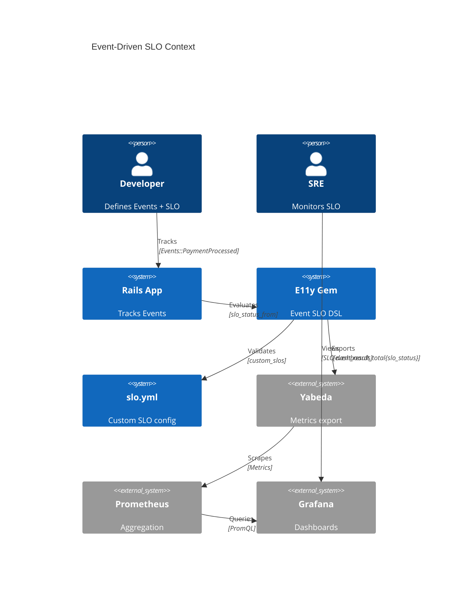
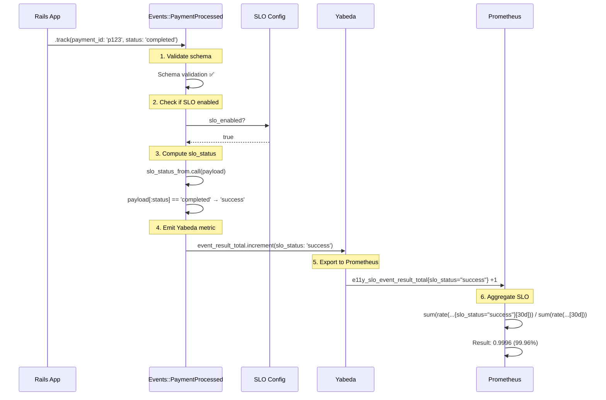

# ADR-014: Event-Driven SLO

**Status:** Draft  
**Date:** January 13, 2026  
**Covers:** Integration between Event System (ADR-001) and SLO (ADR-003)  
**Depends On:** ADR-001 (Core), ADR-002 (Metrics), ADR-003 (SLO)

**Related ADRs:**
- 📊 **ADR-003: SLO & Observability** - HTTP/Job SLO (infrastructure reliability)
- 🔗 **Integration:** See `ADR-003-014-INTEGRATION.md` for detailed integration analysis

---

## 🔍 Scope of This ADR

This ADR covers **Event-based SLO** (business logic reliability):
- ✅ Custom SLO based on E11y Events (e.g., `Events::PaymentProcessed`)
- ✅ Explicit opt-in via `slo { enabled true }` in Event class
- ✅ Auto-calculation of `slo_status` from event payload
- ✅ Configuration in `slo.yml` under `custom_slos` section
- ✅ App-Wide Aggregated SLO (combines HTTP + Event metrics)

**For HTTP/Job SLO** (zero-config infrastructure monitoring), see **ADR-003**.

**Key Difference:**
- **ADR-003**: "Is the server responding?" (HTTP 200 vs 500, job success vs failure)
- **ADR-014**: "Is the business logic working?" (payment processed vs failed, order created vs rejected)

---

## 📋 Table of Contents

1. [Context & Problem](#1-context--problem)
2. [Architecture Overview](#2-architecture-overview)
3. [Event SLO DSL](#3-event-slo-dsl)
4. [SLO Status Calculation](#4-slo-status-calculation)
5. [Custom SLO Configuration](#5-custom-slo-configuration)
6. [Metrics Export](#6-metrics-export)
7. [Validation & Linting](#7-validation--linting)
8. [Prometheus Integration](#8-prometheus-integration)
9. [App-Wide SLO Aggregation](#9-app-wide-slo-aggregation)
10. [Real-World Examples](#10-real-world-examples)
11. [Trade-offs](#11-trade-offs)

---

## 1. Context & Problem

### 1.1. Problem Statement

**HTTP SLO is insufficient for business metrics:**

```ruby
# === PROBLEM 1: HTTP 200 ≠ Business Success ===
# POST /orders → HTTP 200 (infrastructure success)
# but Events::OrderCreationFailed.track(...) (business logic fail)
# → HTTP SLO shows 100%, but actually 50% of orders fail to create!

# === PROBLEM 2: Background Jobs SLO ===
# Sidekiq job completed (no exception)
# but Events::PaymentFailed.track(...) (payment actually failed)
# → Job SLO shows 100%, but payments are not processing!

# === PROBLEM 3: Complex Business Logic SLO ===
# SLO: "Order fulfillment within 24h"
# Events::OrderPaid → Events::OrderShipped (time diff < 24h)
# → How to track such SLO?
```

### 1.2. Design Decisions

**Decision 1: Independent HTTP + Event SLO**
```ruby
# ✅ HTTP SLO = Infrastructure reliability (200 vs 500)
# ✅ Event SLO = Business logic reliability (order created vs failed)
# ✅ App-Wide SLO = Aggregation of both (for overall health)
# → All three are important!
```

**Decision 2: Explicit opt-in for Event SLO**
```ruby
# ✅ By default Events do NOT participate in SLO
# ✅ Must explicitly declare `slo { enabled true }`
# ✅ Must explicitly define `slo_status_from`
```

**Decision 3: Auto-calculation slo_status (with override)**
```ruby
# ✅ slo_status computed from payload (e.g., status == 'completed')
# ✅ Can override: track(status: 'completed', slo_status: 'failure')
# ✅ If slo_status = nil → event not counted in SLO
```

**Decision 4: Aggregation in Prometheus (not in application)**
```ruby
# ✅ E11y exports raw metrics: event_result_total{slo_status="success|failure"}
# ✅ Prometheus calculates SLO via PromQL
# ✅ Flexibility (can recalculate for any time period)
```

**Decision 5: Linters for explicitness**
```ruby
# ✅ Linter 1: Every Event must have `slo { ... }` or `slo false`
# ✅ Linter 2: If `slo { enabled true }` → `slo_status_from` is required
# ✅ Linter 3: If Event in slo.yml → must have `slo { enabled true }`
```

### 1.3. Goals

**Primary Goals:**
- ✅ **Custom SLO based on Events** (business logic)
- ✅ **Explicit configuration** (no magic)
- ✅ **Auto-calculation slo_status** (DRY)
- ✅ **Independent HTTP + Event SLO**
- ✅ **App-Wide SLO aggregation** (overall health)
- ✅ **Prometheus aggregation** (flexible)
- ✅ **Linters for consistency**

**Non-Goals:**
- ❌ Automatic linking HTTP SLO + Event SLO (magic)
- ❌ Multi-event SLO in v1.0 (e.g., OrderPaid → OrderShipped within 24h)
- ❌ ML-based SLO prediction

### 1.4. Success Metrics

| Metric | Target | Critical? |
|--------|--------|-----------|
| **Event SLO accuracy** | 100% (matches business logic) | ✅ Yes |
| **Explicit slo declaration** | 100% of Events | ✅ Yes |
| **slo_status calculation overhead** | <0.1ms p99 | ✅ Yes |
| **Prometheus query performance** | <500ms for 30d window | ✅ Yes |

---

## 2. Architecture Overview

### 2.1. System Context



### 2.2. Component Architecture

```mermaid
graph TB
    subgraph "Event Class Definition"
        EventDef[Event Class<br/>PaymentProcessed]
        SLOBlock[slo do<br/>enabled true<br/>slo_status_from]
    end
    
    subgraph "Event Tracking"
        Track[.track&#40;payload&#41;]
        Validate[Validate Schema]
        ComputeSLO[Compute slo_status]
        EmitMetric[Emit Yabeda Metric]
    end
    
    subgraph "SLO Configuration"
        SLOConfig[slo.yml]
        CustomSLO[custom_slos]
        EventList[events: PaymentProcessed]
    end
    
    subgraph "Metrics Export"
        YabedaMetric[Yabeda.e11y_slo<br/>.event_result_total]
        PrometheusMetric[e11y_slo_event_result_total&#123;<br/>slo_status='success'&#125;]
    end
    
    subgraph "Validation & Linting"
        Linter1[Explicit slo declaration]
        Linter2[slo_status_from required]
        Linter3[slo.yml consistency]
    end
    
    EventDef --> SLOBlock
    SLOBlock --> Track
    Track --> Validate
    Validate --> ComputeSLO
    ComputeSLO --> EmitMetric
    
    SLOConfig --> CustomSLO
    CustomSLO --> EventList
    EventList -.validates.-> SLOBlock
    
    EmitMetric --> YabedaMetric
    YabedaMetric --> PrometheusMetric
    
    SLOBlock -.validates.-> Linter1
    SLOBlock -.validates.-> Linter2
    CustomSLO -.validates.-> Linter3
    
    style ComputeSLO fill:#d1ecf1
    style EmitMetric fill:#fff3cd
    style Linter1 fill:#f8d7da
    style Linter2 fill:#f8d7da
    style Linter3 fill:#f8d7da
```



### 2.3. Event SLO Flow Sequence



---

## 3. Event SLO DSL

### 3.1. Basic Event SLO (enabled)

```ruby
# app/events/payment_processed.rb
module Events
  class PaymentProcessed < E11y::Event::Base
    schema do
      required(:payment_id).filled(:string)
      required(:amount).filled(:float)
      required(:status).filled(:string)  # 'completed', 'failed', 'pending'
      optional(:slo_status).filled(:string)  # Optional explicit override
    end
    
    # ============================================================
    # SLO CONFIGURATION (explicit, opt-in)
    # ============================================================
    slo do
      # 1. Enable SLO tracking for this Event
      enabled true
      
      # 2. Calculate slo_status from payload
      slo_status_from do |payload|
        # Priority 1: Explicit override (if provided)
        return payload[:slo_status] if payload[:slo_status]
        
        # Priority 2: Auto-calculate from status
        case payload[:status]
        when 'completed' then 'success'
        when 'failed' then 'failure'
        when 'pending' then nil  # Not counted in SLO
        else nil
        end
      end
      
      # 3. Which custom SLO does this contribute to?
      contributes_to 'payment_success_rate'
      
      # 4. Optional: Group by label (for per-type SLO)
      group_by :payment_method  # Separate SLO for 'card', 'bank', 'paypal'
    end
  end
end

# Usage 1: Auto-calculation (normal case)
Events::PaymentProcessed.track(
  payment_id: 'p123',
  amount: 99.99,
  status: 'completed',  # → slo_status = 'success'
  payment_method: 'card'
)

# Usage 2: Explicit override (edge case)
Events::PaymentProcessed.track(
  payment_id: 'p456',
  amount: 50.00,
  status: 'completed',  # Status completed
  slo_status: 'failure',  # But business logic says failure (e.g., fraud detected)
  payment_method: 'card'
)

# Usage 3: Not counted in SLO
Events::PaymentProcessed.track(
  payment_id: 'p789',
  amount: 25.00,
  status: 'pending',  # → slo_status = nil (not counted)
  payment_method: 'bank'
)
```

### 3.2. Event SLO Disabled

```ruby
# app/events/health_check_pinged.rb
module Events
  class HealthCheckPinged < E11y::Event::Base
    schema do
      required(:status).filled(:string)
      required(:response_time_ms).filled(:integer)
    end
    
    # ============================================================
    # SLO DISABLED (explicit opt-out)
    # ============================================================
    slo false  # ← Explicit: does NOT participate in SLO
  end
end

# Usage: Normal event tracking (no SLO metrics emitted)
Events::HealthCheckPinged.track(
  status: 'ok',
  response_time_ms: 15
)
```

### 3.3. Event SLO with Latency

```ruby
# app/events/api_request_completed.rb
module Events
  class ApiRequestCompleted < E11y::Event::Base
    schema do
      required(:endpoint).filled(:string)
      required(:status_code).filled(:integer)
      required(:duration_ms).filled(:integer)
      optional(:slo_status).filled(:string)
    end
    
    slo do
      enabled true
      
      slo_status_from do |payload|
        return payload[:slo_status] if payload[:slo_status]
        
        payload[:status_code] < 500 ? 'success' : 'failure'
      end
      
      contributes_to 'api_latency_slo'
      
      # Optional: Extract latency for histogram
      latency_field :duration_ms  # E11y will emit histogram metric
      
      group_by :endpoint  # Per-endpoint latency SLO
    end
  end
end
```

### 3.4. Complex SLO Status Calculation

```ruby
# app/events/order_created.rb
module Events
  class OrderCreated < E11y::Event::Base
    schema do
      required(:order_id).filled(:string)
      required(:user_id).filled(:string)
      required(:items).array(:hash)
      required(:total_amount).filled(:float)
      required(:validation_result).hash do
        required(:passed).filled(:bool)
        optional(:errors).array(:string)
      end
      optional(:slo_status).filled(:string)
    end
    
    slo do
      enabled true
      
      # Complex business logic for slo_status
      slo_status_from do |payload|
        return payload[:slo_status] if payload[:slo_status]
        
        # Validation passed AND amount > 0 → success
        if payload[:validation_result][:passed] && payload[:total_amount] > 0
          'success'
        elsif payload[:validation_result][:passed]
          nil  # Passed but $0 order → not counted (test order)
        else
          'failure'  # Validation failed
        end
      end
      
      contributes_to 'order_creation_success_rate'
    end
  end
end
```

---

## 4. SLO Status Calculation

### 4.1. Implementation (Full Code)

```ruby
# lib/e11y/event/base.rb (extended for SLO)
module E11y
  module Event
    class Base
      class << self
        # SLO configuration DSL
        def slo(value = nil, &block)
          if value == false
            # Explicit opt-out: slo false
            @slo_disabled = true
            @slo_config = nil
          elsif block_given?
            # Explicit opt-in: slo do ... end
            @slo_config = SLOConfig.new(self)
            @slo_config.instance_eval(&block)
            @slo_disabled = false
          end
        end
        
        def slo_enabled?
          !@slo_disabled && @slo_config&.enabled?
        end
        
        def slo_disabled?
          @slo_disabled == true
        end
        
        def slo_config
          @slo_config
        end
        
        # Override track to integrate SLO
        def track(payload, **options)
          # 1. Normal event tracking
          event_data = build_event(payload, **options)
          deliver_to_adapters(event_data)
          
          # 2. SLO tracking (if enabled)
          if slo_enabled?
            track_slo(payload, event_data)
          end
          
          event_data
        end
        
        private
        
        def track_slo(payload, event_data)
          # Compute slo_status
          slo_status = @slo_config.compute_slo_status(payload)
          
          # Skip if slo_status is nil (not counted in SLO)
          return unless slo_status
          
          # Validate slo_status value
          unless ['success', 'failure'].include?(slo_status)
            E11y.logger.error(
              "Invalid slo_status for #{name}: '#{slo_status}' (must be 'success', 'failure', or nil)"
            )
            return
          end
          
          # Build labels
          labels = {
            event_class: name,
            slo_name: @slo_config.contributes_to,
            slo_status: slo_status
          }
          
          # Add group_by label (if configured)
          if @slo_config.group_by
            group_value = payload[@slo_config.group_by]
            labels[@slo_config.group_by] = group_value if group_value
          end
          
          # Emit availability metric
          Yabeda.e11y_slo.event_result_total.increment(labels, by: 1)
          
          # Emit latency metric (if latency_field configured)
          if @slo_config.latency_field
            latency_value = payload[@slo_config.latency_field]
            
            if latency_value
              Yabeda.e11y_slo.event_duration_seconds.observe(
                labels.except(:slo_status),
                latency_value / 1000.0  # ms → seconds
              )
            end
          end
          
          # Log SLO tracking (debug)
          E11y.logger.debug(
            "SLO tracked: #{name} → #{@slo_config.contributes_to} (#{slo_status})"
          )
        rescue => error
          E11y.logger.error("SLO tracking failed for #{name}: #{error.message}")
          E11y.logger.error(error.backtrace.first(5).join("\n"))
          # Don't raise - SLO tracking should not break event tracking
        end
      end
    end
  end
end
```

### 4.2. SLOConfig Class

```ruby
# lib/e11y/event/slo_config.rb
module E11y
  module Event
    class SLOConfig
      attr_reader :event_class
      attr_accessor :enabled, :slo_status_from_proc, :contributes_to, :group_by, :latency_field
      
      def initialize(event_class)
        @event_class = event_class
        @enabled = false
        @slo_status_from_proc = nil
        @contributes_to = nil
        @group_by = nil
        @latency_field = nil
      end
      
      # DSL methods
      def enabled(value = true)
        @enabled = value
      end
      
      def enabled?
        @enabled == true
      end
      
      def slo_status_from(&block)
        unless block_given?
          raise ArgumentError, "slo_status_from requires a block"
        end
        
        @slo_status_from_proc = block
      end
      
      def contributes_to(slo_name)
        @contributes_to = slo_name
      end
      
      def group_by(field)
        @group_by = field
      end
      
      def latency_field(field)
        @latency_field = field
      end
      
      # Compute slo_status from payload
      def compute_slo_status(payload)
        unless @slo_status_from_proc
          raise "Event #{@event_class.name} has slo enabled but no slo_status_from block!"
        end
        
        @slo_status_from_proc.call(payload)
      end
      
      # Validate configuration
      def validate!
        errors = []
        
        if enabled? && !@slo_status_from_proc
          errors << "slo_status_from block is required when slo is enabled"
        end
        
        if enabled? && !@contributes_to
          errors << "contributes_to is required when slo is enabled"
        end
        
        if @latency_field && !@event_class.schema.rules.key?(@latency_field)
          errors << "latency_field :#{@latency_field} not found in schema"
        end
        
        if @group_by && !@event_class.schema.rules.key?(@group_by)
          errors << "group_by :#{@group_by} not found in schema"
        end
        
        if errors.any?
          raise E11y::SLO::ConfigurationError, 
                "SLO configuration errors for #{@event_class.name}:\n#{errors.join("\n")}"
        end
        
        true
      end
    end
  end
end
```

---

## 5. Custom SLO Configuration

### 5.1. slo.yml Schema for Event-Based SLO

```yaml
# config/slo.yml
version: 1

# ============================================================================
# CUSTOM EVENT-BASED SLO
# ============================================================================
custom_slos:
  # Simple availability SLO
  - name: "payment_success_rate"
    description: "Payment success rate (business SLO)"
    type: event_based
    
    # Which Events contribute to this SLO?
    events:
      - Events::PaymentProcessed
    
    # SLO target
    target: 0.999  # 99.9%
    window: 30d
    
    # Validation: Ensure Event has slo { enabled true }
    require_explicit_slo_config: true
    
    # Prometheus metric name (auto-generated if omitted)
    metric_name: "e11y_slo_payment_success_rate"
    
    # Burn rate alerts (same as HTTP SLO)
    burn_rate_alerts:
      fast:
        enabled: true
        threshold: 14.4
        alert_after: 5m
        severity: critical
      medium:
        enabled: true
        threshold: 6.0
        alert_after: 30m
        severity: warning
      slow:
        enabled: true
        threshold: 1.0
        alert_after: 6h
        severity: info
  
  # Latency SLO (with histogram)
  - name: "api_latency_slo"
    description: "API request latency SLO"
    type: event_based
    
    events:
      - Events::ApiRequestCompleted
    
    # Availability target
    target: 0.999  # 99.9% requests < 500ms
    window: 30d
    
    # Latency target (Prometheus computes p99 from histogram)
    latency:
      enabled: true
      p99_target: 500  # ms
      p95_target: 300  # ms
      field: :duration_ms  # Which field in Event payload
    
    # Group by endpoint (per-endpoint SLO)
    group_by: :endpoint
  
  # Multi-event SLO (v2.0 feature, not implemented in v1.0)
  - name: "order_fulfillment_slo"
    description: "Order shipped within 24h of payment"
    type: event_sequence  # Future feature
    
    events:
      start: Events::OrderPaid
      end: Events::OrderShipped
      max_duration: 86400  # 24 hours in seconds
    
    target: 0.95  # 95%
    window: 30d
    
    # v1.0: Not implemented, placeholder for future

# ============================================================================
# HTTP SLO (unchanged, for reference)
# ============================================================================
endpoints:
  - name: "Create Order"
    pattern: "POST /api/orders"
    controller: "Api::OrdersController"
    action: "create"
    slo:
      availability:
        target: 0.999  # HTTP 2xx/3xx vs 5xx (independent from Event SLO)
      latency:
        p99_target: 500

# ============================================================================
# APP-WIDE FALLBACK
# ============================================================================
app_wide:
  http:
    availability:
      target: 0.999
    latency:
      p99_target: 500
  
  events:
    # NEW: App-wide Event SLO (aggregation of all Event SLOs)
    enabled: true
    target: 0.999  # 99.9%
    window: 30d
```

---

## 6. Metrics Export

### 6.1. Yabeda Metrics Definition

```ruby
Yabeda.configure do
  group :e11y_slo do
    counter :event_result_total,
            comment: "Event SLO results (success/failure)",
            tags: [:event_class, :slo_name, :slo_status]
    histogram :event_duration_seconds,
              comment: "Event processing duration (seconds)",
              tags: [:event_class, :slo_name],
              buckets: [0.01, 0.05, 0.1, 0.5, 1.0, 2.0, 5.0, 10.0, 30.0, 60.0]
  end
end
```

### 6.2. Prometheus Metrics Output

```
# Availability metrics
e11y_slo_event_result_total{event_class="Events::PaymentProcessed",slo_name="payment_success_rate",slo_status="success"} 1234
e11y_slo_event_result_total{event_class="Events::PaymentProcessed",slo_name="payment_success_rate",slo_status="failure"} 5

# Latency metrics (histogram)
e11y_slo_event_duration_seconds_bucket{event_class="Events::ApiRequestCompleted",slo_name="api_latency_slo",le="0.1"} 500
e11y_slo_event_duration_seconds_bucket{event_class="Events::ApiRequestCompleted",slo_name="api_latency_slo",le="0.5"} 1200
e11y_slo_event_duration_seconds_bucket{event_class="Events::ApiRequestCompleted",slo_name="api_latency_slo",le="1.0"} 1234
e11y_slo_event_duration_seconds_sum{event_class="Events::ApiRequestCompleted",slo_name="api_latency_slo"} 450.67
e11y_slo_event_duration_seconds_count{event_class="Events::ApiRequestCompleted",slo_name="api_latency_slo"} 1239

# With group_by (per-payment-method)
e11y_slo_event_result_total{event_class="Events::PaymentProcessed",slo_name="payment_success_rate",slo_status="success",payment_method="card"} 1000
e11y_slo_event_result_total{event_class="Events::PaymentProcessed",slo_name="payment_success_rate",slo_status="success",payment_method="bank"} 200
e11y_slo_event_result_total{event_class="Events::PaymentProcessed",slo_name="payment_success_rate",slo_status="success",payment_method="paypal"} 34
```

---

## 7. Validation & Linting

### 7.1. Linter 1: Explicit SLO Declaration

**Rule:** Every Event class MUST have explicit `slo` declaration.

```ruby
# lib/e11y/slo/linters/explicit_declaration_linter.rb
module E11y
  module SLO
    module Linters
      class ExplicitDeclarationLinter
        def self.validate!
          errors = []
          
          E11y::Registry.event_classes.each do |event_class|
            # Check: Has slo declaration?
            has_slo_enabled = event_class.slo_enabled?
            has_slo_disabled = event_class.slo_disabled?
            
            unless has_slo_enabled || has_slo_disabled
              errors << "Event #{event_class.name} missing explicit SLO declaration! " \
                        "Add `slo do ... end` or `slo false`"
            end
          end
          
          if errors.any?
            raise E11y::SLO::LinterError, "SLO Linter 1 failed:\n#{errors.join("\n")}"
          end
          
          E11y.logger.info("✅ Linter 1: Explicit SLO declaration (passed)")
        end
      end
    end
  end
end
```

### 7.2. Linter 2: slo_status_from Required

**Rule:** If `slo { enabled true }`, then `slo_status_from` is REQUIRED.

```ruby
# lib/e11y/slo/linters/slo_status_from_linter.rb
module E11y
  module SLO
    module Linters
      class SloStatusFromLinter
        def self.validate!
          errors = []
          
          E11y::Registry.event_classes.each do |event_class|
            next unless event_class.slo_enabled?
            
            # Check: Has slo_status_from block?
            unless event_class.slo_config.slo_status_from_proc
              errors << "Event #{event_class.name} has `slo { enabled true }`, " \
                        "but missing `slo_status_from` block!"
            end
            
            # Check: Has contributes_to?
            unless event_class.slo_config.contributes_to
              errors << "Event #{event_class.name} has `slo { enabled true }`, " \
                        "but missing `contributes_to` declaration!"
            end
          end
          
          if errors.any?
            raise E11y::SLO::LinterError, "SLO Linter 2 failed:\n#{errors.join("\n")}"
          end
          
          E11y.logger.info("✅ Linter 2: slo_status_from required (passed)")
        end
      end
    end
  end
end
```

### 7.3. Linter 3: slo.yml Consistency

**Rule:** If Event is referenced in `slo.yml`, it MUST have `slo { enabled true }`.

```ruby
# lib/e11y/slo/linters/config_consistency_linter.rb
module E11y
  module SLO
    module Linters
      class ConfigConsistencyLinter
        def self.validate!
          errors = []
          config = E11y::SLO::ConfigLoader.config
          
          # Check each custom_slo in slo.yml
          config.custom_slos.each do |slo|
            slo_name = slo['name']
            events = slo['events'] || []
            
            events.each do |event_class_name|
              # Check: Event class exists?
              begin
                event_class = event_class_name.constantize
              rescue NameError
                errors << "SLO '#{slo_name}' references Event #{event_class_name}, " \
                          "but class not found!"
                next
              end
              
              # Check: Event has slo { enabled true }?
              unless event_class.slo_enabled?
                errors << "SLO '#{slo_name}' references Event #{event_class_name}, " \
                          "but Event has `slo false` or missing slo declaration!"
              end
              
              # Check: Event contributes_to matches slo_name?
              if event_class.slo_enabled? && event_class.slo_config.contributes_to != slo_name
                errors << "Event #{event_class_name} contributes_to " \
                          "'#{event_class.slo_config.contributes_to}', " \
                          "but slo.yml defines SLO '#{slo_name}'! Mismatch!"
              end
            end
          end
          
          # Check reverse: Events with slo enabled but NOT in slo.yml
          E11y::Registry.event_classes.each do |event_class|
            next unless event_class.slo_enabled?
            
            slo_name = event_class.slo_config.contributes_to
            slo_config = config.resolve_custom_slo(slo_name)
            
            unless slo_config
              errors << "Event #{event_class.name} contributes_to '#{slo_name}', " \
                        "but this SLO not found in slo.yml!"
            end
          end
          
          if errors.any?
            raise E11y::SLO::LinterError, "SLO Linter 3 failed:\n#{errors.join("\n")}"
          end
          
          E11y.logger.info("✅ Linter 3: slo.yml consistency (passed)")
        end
      end
    end
  end
end
```

### 7.4. Auto-validation on Boot

```ruby
# config/initializers/e11y_slo.rb
Rails.application.config.after_initialize do
  if E11y.config.slo.enabled
    begin
      # Run all linters
      E11y::SLO::Linters::ExplicitDeclarationLinter.validate!
      E11y::SLO::Linters::SloStatusFromLinter.validate!
      E11y::SLO::Linters::ConfigConsistencyLinter.validate!
      
      E11y.logger.info("✅ All SLO linters passed")
    rescue E11y::SLO::LinterError => error
      if E11y.config.slo.strict_validation
        # Strict mode: Fail hard
        raise error
      else
        # Lenient mode: Log warning and continue
        E11y.logger.error("❌ SLO Linters failed (continuing in lenient mode):")
        E11y.logger.error(error.message)
      end
    end
  end
end
```

---

## 8. Prometheus Integration

### 8.1. PromQL for Availability SLO

```promql
# Payment Success Rate (30 days)
sum(rate(e11y_slo_event_result_total{
  slo_name="payment_success_rate",
  slo_status="success"
}[30d]))
/
sum(rate(e11y_slo_event_result_total{
  slo_name="payment_success_rate"
}[30d]))

# Result: 0.9996 (99.96%)
```

### 8.2. PromQL for Latency SLO

```promql
# API Latency p99 (30 days)
histogram_quantile(0.99,
  sum(rate(e11y_slo_event_duration_seconds_bucket{
    slo_name="api_latency_slo"
  }[30d])) by (le)
)

# Result: 0.450 (450ms)
```

### 8.3. PromQL for Grouped SLO (per payment_method)

```promql
# Payment Success Rate per payment_method
sum(rate(e11y_slo_event_result_total{
  slo_name="payment_success_rate",
  slo_status="success"
}[30d])) by (payment_method)
/
sum(rate(e11y_slo_event_result_total{
  slo_name="payment_success_rate"
}[30d])) by (payment_method)

# Result:
# {payment_method="card"} 0.9998
# {payment_method="bank"} 0.9950
# {payment_method="paypal"} 0.9970
```

### 8.4. Burn Rate Alerts (same as HTTP SLO)

```yaml
# prometheus/alerts/e11y_event_slo.yml
groups:
  - name: e11y_event_slo
    interval: 30s
    rules:
      # Fast burn (1h window, 5 min alert)
      - alert: E11yEventSLOFastBurn_PaymentSuccessRate
        expr: |
          (
            sum(rate(e11y_slo_event_result_total{
              slo_name="payment_success_rate",
              slo_status="failure"
            }[1h]))
            /
            sum(rate(e11y_slo_event_result_total{
              slo_name="payment_success_rate"
            }[1h]))
          )
          /
          0.001  # Error budget per hour (0.1% / 720h)
          > 14.4  # 14.4x burn rate = 2% of 30-day budget in 1h
        for: 5m
        labels:
          severity: critical
          slo_name: "payment_success_rate"
          burn_window: "1h"
        annotations:
          summary: "CRITICAL: Fast burn on payment_success_rate SLO"
          description: |
            Payment failure rate is 14.4x higher than sustainable rate.
            Burning 2% of 30-day error budget in 1 hour.
            
            Current burn rate: {{ $value | humanize }}x
            
            Dashboard: https://grafana/d/e11y-event-slo?var-slo=payment_success_rate
```

---

## 9. App-Wide SLO Aggregation

### 9.1. Problem: Need Overall Health Metric

**Separate HTTP + Event SLO is good, but SRE wants single number:**

```
SRE: "What's our overall application health?"

Current state:
- HTTP SLO: 99.95%
- Event SLO (payment): 99.96%
- Event SLO (orders): 99.92%

❌ Which one to report? Need AGGREGATION!
```

### 9.2. Solution: Weighted App-Wide SLO

```yaml
# config/slo.yml (extended)
app_wide:
  # NEW: Aggregated SLO (combines HTTP + Events)
  aggregated_slo:
    enabled: true
    
    # How to combine?
    strategy: "weighted_average"  # or "min" (worst), "max" (best)
    
    # Weights for each component
    components:
      - name: "http_slo"
        weight: 0.4  # 40% weight (infrastructure)
        metric: |
          sum(rate(http_requests_total{status=~"2..|3.."}[30d]))
          /
          sum(rate(http_requests_total[30d]))
      
      - name: "event_slo_payment"
        weight: 0.4  # 40% weight (critical business logic)
        metric: |
          sum(rate(e11y_slo_event_result_total{
            slo_name="payment_success_rate",
            slo_status="success"
          }[30d]))
          /
          sum(rate(e11y_slo_event_result_total{
            slo_name="payment_success_rate"
          }[30d]))
      
      - name: "event_slo_orders"
        weight: 0.2  # 20% weight (important business logic)
        metric: |
          sum(rate(e11y_slo_event_result_total{
            slo_name="order_creation_success_rate",
            slo_status="success"
          }[30d]))
          /
          sum(rate(e11y_slo_event_result_total{
            slo_name="order_creation_success_rate"
          }[30d]))
    
    # Overall target
    target: 0.999  # 99.9%
    window: 30d
```

### 9.3. PromQL for Aggregated SLO

```promql
# Weighted Average App-Wide SLO
(
  # HTTP SLO (40% weight)
  0.4 * (
    sum(rate(http_requests_total{status=~"2..|3.."}[30d]))
    /
    sum(rate(http_requests_total[30d]))
  )
  
  +
  
  # Payment Event SLO (40% weight)
  0.4 * (
    sum(rate(e11y_slo_event_result_total{
      slo_name="payment_success_rate",
      slo_status="success"
    }[30d]))
    /
    sum(rate(e11y_slo_event_result_total{
      slo_name="payment_success_rate"
    }[30d]))
  )
  
  +
  
  # Order Event SLO (20% weight)
  0.2 * (
    sum(rate(e11y_slo_event_result_total{
      slo_name="order_creation_success_rate",
      slo_status="success"
    }[30d]))
    /
    sum(rate(e11y_slo_event_result_total{
      slo_name="order_creation_success_rate"
    }[30d]))
  )
)

# Example Result:
# HTTP: 99.95%, Payment: 99.96%, Orders: 99.92%
# → (0.4 * 0.9995) + (0.4 * 0.9996) + (0.2 * 0.9992)
# → 0.39980 + 0.39984 + 0.19984
# → 0.99948 (99.948%)
```

### 9.4. Alternative: "Worst Case" Strategy

```yaml
# config/slo.yml
app_wide:
  aggregated_slo:
    strategy: "min"  # Take worst SLO
    
    components:
      - name: "http_slo"
        metric: ...
      - name: "event_slo_payment"
        metric: ...
      - name: "event_slo_orders"
        metric: ...
```

```promql
# Min (Worst) SLO
min(
  # HTTP SLO
  sum(rate(http_requests_total{status=~"2..|3.."}[30d]))
  / sum(rate(http_requests_total[30d])),
  
  # Payment SLO
  sum(rate(e11y_slo_event_result_total{slo_name="payment_success_rate",slo_status="success"}[30d]))
  / sum(rate(e11y_slo_event_result_total{slo_name="payment_success_rate"}[30d])),
  
  # Orders SLO
  sum(rate(e11y_slo_event_result_total{slo_name="order_creation_success_rate",slo_status="success"}[30d]))
  / sum(rate(e11y_slo_event_result_total{slo_name="order_creation_success_rate"}[30d]))
)

# Result: 99.92% (worst of the three)
```

### 9.5. Grafana Dashboard: Aggregated SLO

```json
{
  "dashboard": {
    "title": "E11y App-Wide SLO Dashboard",
    "panels": [
      {
        "title": "Overall Application Health (Aggregated SLO)",
        "type": "gauge",
        "targets": [
          {
            "expr": "# Weighted average PromQL from above",
            "legendFormat": "App-Wide SLO"
          },
          {
            "expr": "0.999",
            "legendFormat": "Target (99.9%)"
          }
        ],
        "fieldConfig": {
          "defaults": {
            "min": 0.99,
            "max": 1.0,
            "thresholds": {
              "mode": "absolute",
              "steps": [
                { "value": 0.99, "color": "red" },
                { "value": 0.995, "color": "yellow" },
                { "value": 0.999, "color": "green" }
              ]
            }
          }
        }
      },
      {
        "title": "SLO Components Breakdown",
        "type": "timeseries",
        "targets": [
          { "expr": "# HTTP SLO", "legendFormat": "HTTP (40%)" },
          { "expr": "# Payment SLO", "legendFormat": "Payment Events (40%)" },
          { "expr": "# Orders SLO", "legendFormat": "Order Events (20%)" }
        ]
      }
    ]
  }
}
```

---

## 10. Real-World Examples

### 10.1. E-Commerce Platform

```ruby
# === Payment Success Rate SLO ===
module Events
  class PaymentProcessed < E11y::Event::Base
    schema do
      required(:payment_id).filled(:string)
      required(:order_id).filled(:string)
      required(:amount).filled(:float)
      required(:currency).filled(:string)
      required(:payment_method).filled(:string)  # 'card', 'bank', 'paypal'
      required(:status).filled(:string)  # 'completed', 'failed', 'pending'
      required(:error_code).maybe(:string)  # Present if status = 'failed'
      optional(:slo_status).filled(:string)
    end
    
    slo do
      enabled true
      
      slo_status_from do |payload|
        return payload[:slo_status] if payload[:slo_status]
        
        case payload[:status]
        when 'completed' then 'success'
        when 'failed' then 'failure'
        when 'pending' then nil  # Not counted
        end
      end
      
      contributes_to 'payment_success_rate'
      group_by :payment_method  # Per-method SLO
    end
  end
end

# === Order Creation Success Rate SLO ===
module Events
  class OrderCreated < E11y::Event::Base
    schema do
      required(:order_id).filled(:string)
      required(:user_id).filled(:string)
      required(:items).array(:hash)
      required(:total_amount).filled(:float)
      optional(:slo_status).filled(:string)
    end
    
    slo do
      enabled true
      
      slo_status_from do |payload|
        return payload[:slo_status] if payload[:slo_status]
        
        # All OrderCreated events = success
        'success'
      end
      
      contributes_to 'order_creation_success_rate'
    end
  end
end

module Events
  class OrderCreationFailed < E11y::Event::Base
    schema do
      required(:user_id).filled(:string)
      required(:reason).filled(:string)
      required(:validation_errors).maybe(:array)
      optional(:slo_status).filled(:string)
    end
    
    slo do
      enabled true
      
      slo_status_from do |payload|
        return payload[:slo_status] if payload[:slo_status]
        
        # All OrderCreationFailed events = failure
        'failure'
      end
      
      contributes_to 'order_creation_success_rate'
    end
  end
end
```

```yaml
# config/slo.yml (E-commerce)
custom_slos:
  - name: "payment_success_rate"
    description: "Payment processing success rate"
    type: event_based
    events:
      - Events::PaymentProcessed
    target: 0.999  # 99.9%
    window: 30d
    group_by: :payment_method
    
    burn_rate_alerts:
      fast: { enabled: true, threshold: 14.4, alert_after: 5m }
  
  - name: "order_creation_success_rate"
    description: "Order creation success rate"
    type: event_based
    events:
      - Events::OrderCreated
      - Events::OrderCreationFailed
    target: 0.999
    window: 30d

# App-Wide SLO (combines HTTP + Events)
app_wide:
  aggregated_slo:
    enabled: true
    strategy: "weighted_average"
    components:
      - name: "http_slo"
        weight: 0.3  # 30%
        metric: "sum(rate(http_requests_total{status=~\"2..|3..\"}[30d])) / sum(rate(http_requests_total[30d]))"
      - name: "payment_slo"
        weight: 0.5  # 50% (most critical!)
        metric: "sum(rate(e11y_slo_event_result_total{slo_name=\"payment_success_rate\",slo_status=\"success\"}[30d])) / sum(rate(e11y_slo_event_result_total{slo_name=\"payment_success_rate\"}[30d]))"
      - name: "orders_slo"
        weight: 0.2  # 20%
        metric: "sum(rate(e11y_slo_event_result_total{slo_name=\"order_creation_success_rate\",slo_status=\"success\"}[30d])) / sum(rate(e11y_slo_event_result_total{slo_name=\"order_creation_success_rate\"}[30d]))"
    target: 0.999
```

---

## 11. Trade-offs

### 11.1. Key Decisions

| Decision | Pro | Con | Rationale |
|----------|-----|-----|-----------|
| **Explicit slo declaration** | No magic, clear intent | Boilerplate in every Event | Clarity > brevity |
| **slo_status_from auto-calc** | DRY, flexible | Extra method call | Performance acceptable (<0.1ms) |
| **Prometheus aggregation** | Flexible, standard | Complex PromQL | Industry standard (Google SRE) |
| **Separate HTTP + Event SLO** | Clear separation | Two SLOs to manage | Reflects reality (infra ≠ business) |
| **App-Wide aggregated SLO** | Single health metric | More config | SRE needs one number |
| **Linters at boot** | Early failure detection | Startup time +50ms | Worth it for consistency |
| **Optional override** | Edge case support | Potential for abuse | Trust developers |

### 11.2. Alternatives Considered

**A) Auto-detect SLO from severity**
```ruby
# ❌ REJECTED: Too implicit
# severity :error → slo_status = 'failure'
# severity :success → slo_status = 'success'
```
- ❌ Not flexible (business logic ≠ severity)
- ❌ Magic behavior
- ✅ **CHOSEN:** Explicit `slo_status_from`

**B) SLO status as required field**
```ruby
# ❌ REJECTED: Too rigid
schema do
  required(:slo_status).filled(:string)
end
```
- ❌ Forces manual calculation at call site
- ❌ Not DRY
- ✅ **CHOSEN:** Optional override + auto-calc

**C) SLO calculation in application**
```ruby
# ❌ REJECTED: Not flexible
# E11y calculates SLO percentage internally
Yabeda.e11y_slo.payment_success_rate.set({}, 0.9996)
```
- ❌ Can't recalculate for different time windows
- ❌ State lost on restart
- ✅ **CHOSEN:** Prometheus aggregation

---

## 12. Summary & Next Steps

### 12.1. What We Achieved

✅ **Event-Driven SLO**: Custom SLO based on business events  
✅ **Explicit Configuration**: No magic, all visible in Event class  
✅ **Auto-calculation**: `slo_status_from` with optional override  
✅ **Prometheus Integration**: Standard aggregation, flexible queries  
✅ **3 Linters**: Ensure consistency at boot time  
✅ **Independent HTTP + Event SLO**: Clear separation of concerns  
✅ **App-Wide SLO Aggregation**: Single health metric for SRE  
✅ **Group by support**: Per-label SLO (e.g., per payment_method)  
✅ **Latency SLO**: Histogram metrics for p99/p95  
✅ **Real-world examples**: E-commerce, SaaS API, Admin tool  

### 12.2. Integration with ADR-003

| Aspect | ADR-003 (HTTP SLO) | ADR-014 (Event SLO) | Integration |
|--------|-------------------|---------------------|-------------|
| **Metrics Source** | HTTP requests/jobs | Event tracking | Independent |
| **Config Location** | `slo.yml` endpoints | `slo.yml` custom_slos | Same file |
| **Linters** | Route validation | Event validation | Run together |
| **Burn Rate Alerts** | Multi-window | Multi-window | Same strategy |
| **Prometheus** | PromQL aggregation | PromQL aggregation | Same approach |
| **App-Wide SLO** | ❌ Not defined | ✅ Aggregated SLO | NEW feature |

### 12.3. Implementation Checklist

**Phase 1: Core (Week 1-2)**
- [ ] Implement `E11y::Event::Base.slo` DSL
- [ ] Implement `E11y::Event::SLOConfig` class
- [ ] Add `slo_status_from` computation
- [ ] Integrate with `track` method
- [ ] Emit Yabeda metrics (`event_result_total`)

**Phase 2: Configuration (Week 3)**
- [ ] Extend `slo.yml` schema for `custom_slos`
- [ ] Implement `ConfigLoader.resolve_custom_slo`
- [ ] Add `app_wide.aggregated_slo` config
- [ ] Add validation for custom SLO config

**Phase 3: Linters (Week 4)**
- [ ] Implement Linter 1 (explicit slo declaration)
- [ ] Implement Linter 2 (slo_status_from required)
- [ ] Implement Linter 3 (slo.yml consistency)
- [ ] Add auto-validation on boot
- [ ] Add `strict_validation` config option

**Phase 4: Prometheus (Week 5)**
- [ ] Document PromQL queries
- [ ] Add app-wide aggregated SLO query
- [ ] Create Grafana dashboard templates
- [ ] Add burn rate alerts for Event SLO
- [ ] Test with real Event tracking

**Phase 5: Documentation (Week 6)**
- [ ] Write Event SLO guide
- [ ] Add real-world examples
- [ ] Document migration from HTTP-only SLO
- [ ] Add troubleshooting guide

**Phase 6: Testing (Week 7)**
- [ ] RSpec for `slo_status_from` computation
- [ ] RSpec for Yabeda metric emission
- [ ] RSpec for all 3 linters
- [ ] Integration tests (end-to-end)
- [ ] Performance benchmarks (<0.1ms p99)

---

**Status:** ✅ Fully Designed  
**Next:** Implementation (Phases 1-6)  
**Estimated Implementation:** 7 weeks  
**Impact:** 
- Business-logic SLO visibility (not just infrastructure)
- Explicit, no-magic configuration
- Flexible Prometheus-based aggregation
- App-wide health metric for SRE
- Consistency enforced by linters
