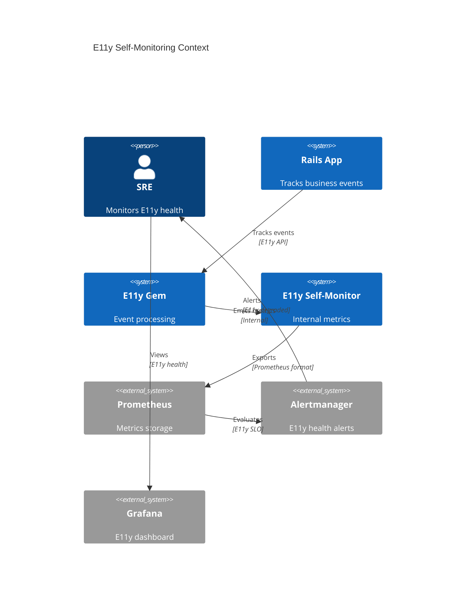
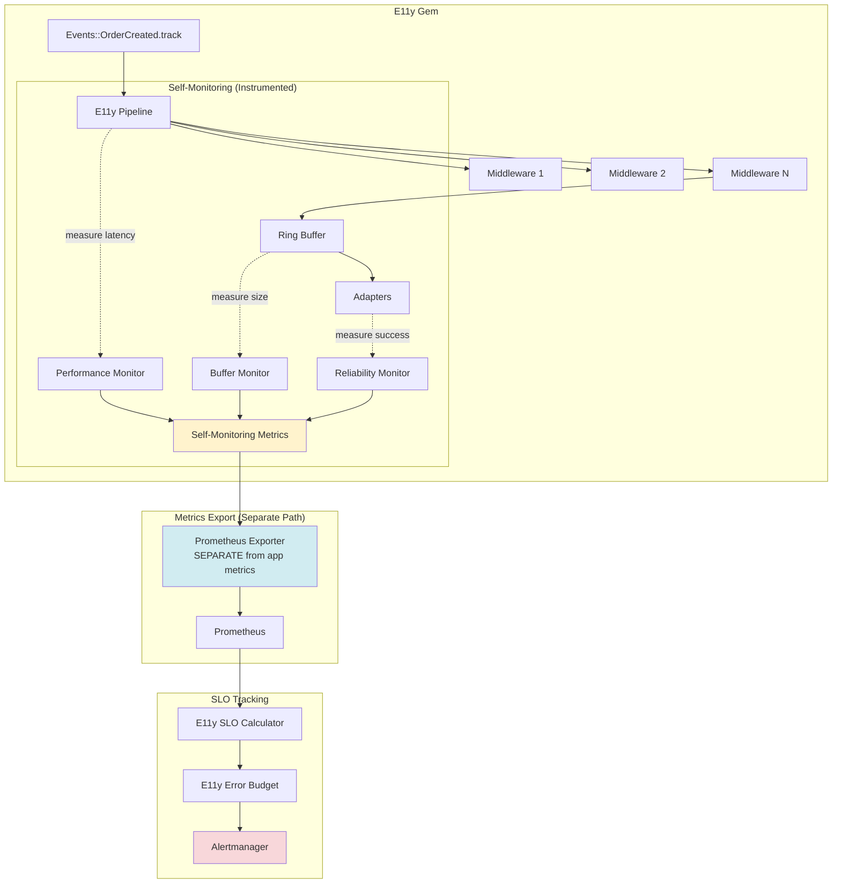
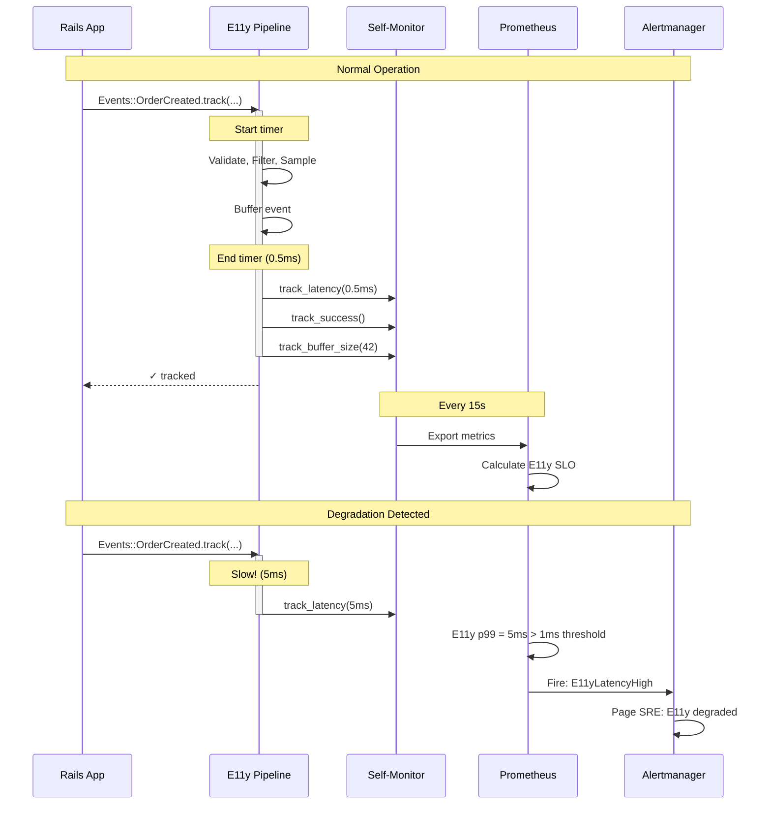

# ADR-016: Self-Monitoring & SLO for E11y Gem

**Status:** Draft  
**Date:** January 15, 2026  
**Covers:** Internal observability and reliability of E11y gem itself  
**Depends On:** ADR-001 (Core), ADR-002 (Metrics), ADR-003 (SLO)

---

## 📋 Table of Contents

1. [Context & Problem](#1-context--problem)
2. [Architecture Overview](#2-architecture-overview)
3. [Self-Monitoring Metrics](#3-self-monitoring-metrics)
4. [Internal SLO Tracking](#4-internal-slo-tracking)
5. [Performance Budget](#5-performance-budget)
6. [Health Checks](#6-health-checks)
7. [Alerting Strategy](#7-alerting-strategy)
8. [Trade-offs](#8-trade-offs)

---

## 1. Context & Problem

### 1.1. Problem Statement

**E11y is critical infrastructure** - if it fails, the entire observability stack is blind.

**Current Pain Points:**

```ruby
# ❌ PROBLEM 1: No visibility into E11y itself
# E11y tracks app events, but who tracks E11y?
# If E11y buffer is full → events dropped → no alert!
# If E11y adapter fails → silent failure → no alert!
```

```ruby
# ❌ PROBLEM 2: No performance guarantees
# E11y.track() should be <1ms p99
# But how do we know if it's slow?
# How do we detect regressions?
```

```ruby
# ❌ PROBLEM 3: No reliability SLO
# E11y should deliver 99.9% of events
# But we don't measure this!
# How many events are dropped?
```

```ruby
# ❌ PROBLEM 4: No cost visibility
# E11y processes millions of events
# How much CPU/memory does it use?
# Is it worth the overhead?
```

### 1.2. Design Principles

**1. Self-Monitoring Must Be Lightweight**
```ruby
# E11y self-monitoring should use <1% of E11y's own overhead
# Otherwise, we create a monitoring-of-monitoring spiral
```

**2. Self-Monitoring Must Be Reliable**
```ruby
# If E11y fails, self-monitoring must still work
# Use separate, independent metrics path
```

**3. Self-Monitoring Must Be Actionable**
```ruby
# Every metric must have:
# - Clear threshold
# - Runbook link
# - Automatic alert
```

### 1.3. Goals

**Primary Goals:**
- ✅ **Track E11y performance** (latency, throughput)
- ✅ **Track E11y reliability** (success rate, dropped events)
- ✅ **Track E11y resource usage** (CPU, memory, buffer)
- ✅ **Define E11y SLO** (99.9% delivery, <1ms p99)
- ✅ **Alert on E11y degradation** (before it impacts app)

**Non-Goals:**
- ❌ Monitoring application events (that's ADR-003)
- ❌ Complex ML-based anomaly detection
- ❌ Full distributed tracing of E11y internals

### 1.4. Success Metrics

| Metric | Target | Critical? |
|--------|--------|-----------|
| **E11y latency p99** | <1ms | ✅ Yes |
| **E11y success rate** | >99.9% | ✅ Yes |
| **E11y overhead** | <2% CPU | ✅ Yes |
| **E11y memory** | <100MB | ✅ Yes |
| **Buffer utilization** | <80% | ✅ Yes |

---

## 2. Architecture Overview

### 2.1. System Context



### 2.2. Component Architecture



### 2.3. Self-Monitoring Flow



---

## 3. Self-Monitoring Metrics

### 3.1. Performance Metrics

```ruby
# lib/e11y/self_monitoring/performance_monitor.rb
module E11y
  module SelfMonitoring
    class PerformanceMonitor
      # Track E11y.track() latency
      def self.track_latency(duration_ms, event_class:, severity:)
        E11y::Metrics.histogram(
          :e11y_track_duration_seconds,
          duration_ms / 1000.0,
          labels: {
            event_class: event_class.name,
            severity: severity
          },
          buckets: [0.0001, 0.0005, 0.001, 0.005, 0.01, 0.05, 0.1]  # 0.1ms to 100ms
        )
      end
      
      # Track middleware execution time
      def self.track_middleware_latency(middleware_name, duration_ms)
        E11y::Metrics.histogram(
          :e11y_middleware_duration_seconds,
          duration_ms / 1000.0,
          labels: { middleware: middleware_name },
          buckets: [0.00001, 0.0001, 0.0005, 0.001, 0.005]  # 0.01ms to 5ms
        )
      end
      
      # Track adapter send latency
      def self.track_adapter_latency(adapter_name, duration_ms)
        E11y::Metrics.histogram(
          :e11y_adapter_send_duration_seconds,
          duration_ms / 1000.0,
          labels: { adapter: adapter_name },
          buckets: [0.001, 0.01, 0.05, 0.1, 0.5, 1.0, 5.0]  # 1ms to 5s
        )
      end
      
      # Track buffer flush latency
      def self.track_flush_latency(duration_ms, event_count)
        E11y::Metrics.histogram(
          :e11y_buffer_flush_duration_seconds,
          duration_ms / 1000.0,
          labels: { event_count_bucket: bucket_event_count(event_count) },
          buckets: [0.001, 0.01, 0.05, 0.1, 0.5, 1.0]
        )
      end
      
      private
      
      def self.bucket_event_count(count)
        case count
        when 0..10 then '1-10'
        when 11..50 then '11-50'
        when 51..100 then '51-100'
        when 101..500 then '101-500'
        else '500+'
        end
      end
    end
  end
end
```

### 3.2. Reliability Metrics

```ruby
# lib/e11y/self_monitoring/reliability_monitor.rb
module E11y
  module SelfMonitoring
    class ReliabilityMonitor
      # Track successful event tracking
      def self.track_success(event_class:, severity:, adapters:)
        E11y::Metrics.counter(
          :e11y_events_tracked_total,
          labels: {
            event_class: event_class.name,
            severity: severity,
            result: 'success'
          }
        )
        
        # Per-adapter success
        adapters.each do |adapter|
          E11y::Metrics.counter(
            :e11y_adapter_events_total,
            labels: {
              adapter: adapter,
              result: 'success'
            }
          )
        end
      end
      
      # Track dropped events (sampling, rate limiting)
      def self.track_dropped(event_class:, reason:)
        E11y::Metrics.counter(
          :e11y_events_dropped_total,
          labels: {
            event_class: event_class.name,
            reason: reason  # 'sampled', 'rate_limited', 'buffer_full', 'validation_failed'
          }
        )
      end
      
      # Track adapter failures
      def self.track_adapter_failure(adapter_name, error_class)
        E11y::Metrics.counter(
          :e11y_adapter_errors_total,
          labels: {
            adapter: adapter_name,
            error_class: error_class.name
          }
        )
      end
      
      # Track circuit breaker state
      def self.track_circuit_breaker_state(adapter_name, state)
        E11y::Metrics.gauge(
          :e11y_circuit_breaker_state,
          state == :open ? 1 : 0,
          labels: { adapter: adapter_name }
        )
      end
      
      # Track retry attempts
      def self.track_retry(adapter_name, attempt_number)
        E11y::Metrics.counter(
          :e11y_adapter_retries_total,
          labels: {
            adapter: adapter_name,
            attempt: attempt_number
          }
        )
      end
    end
  end
end
```

### 3.3. Resource Usage Metrics

```ruby
# lib/e11y/self_monitoring/resource_monitor.rb
module E11y
  module SelfMonitoring
    class ResourceMonitor
      # Track buffer utilization
      def self.track_buffer_size(current_size, max_size)
        E11y::Metrics.gauge(
          :e11y_buffer_size,
          current_size,
          labels: { type: 'main' }
        )
        
        utilization = (current_size.to_f / max_size * 100).round(2)
        E11y::Metrics.gauge(
          :e11y_buffer_utilization_percent,
          utilization,
          labels: { type: 'main' }
        )
      end
      
      # Track request-scoped debug buffer
      def self.track_debug_buffer_size(current_size, max_size)
        E11y::Metrics.gauge(
          :e11y_buffer_size,
          current_size,
          labels: { type: 'debug' }
        )
      end
      
      # Track memory usage (approximate)
      def self.track_memory_usage
        # Use ObjectSpace to estimate E11y memory
        e11y_objects = ObjectSpace.each_object.select do |obj|
          obj.class.name&.start_with?('E11y::')
        end
        
        # Rough estimate: 100 bytes per object
        memory_mb = (e11y_objects.size * 100.0 / 1024 / 1024).round(2)
        
        E11y::Metrics.gauge(
          :e11y_memory_usage_mb,
          memory_mb
        )
      end
      
      # Track GC pressure (events allocated)
      def self.track_gc_pressure(objects_allocated)
        E11y::Metrics.counter(
          :e11y_gc_objects_allocated_total,
          objects_allocated
        )
      end
      
      # Track CPU time (thread-level)
      def self.track_cpu_time(cpu_seconds)
        E11y::Metrics.counter(
          :e11y_cpu_seconds_total,
          cpu_seconds
        )
      end
    end
  end
end
```

### 3.4. Cardinality Metrics (from ADR-002)

```ruby
# lib/e11y/self_monitoring/cardinality_monitor.rb
module E11y
  module SelfMonitoring
    class CardinalityMonitor
      # Track unique label values per metric
      def self.track_metric_cardinality(metric_name, label_name, unique_values_count)
        E11y::Metrics.gauge(
          :e11y_metric_cardinality,
          unique_values_count,
          labels: {
            metric: metric_name,
            label: label_name
          }
        )
      end
      
      # Track cardinality protection actions
      def self.track_cardinality_action(action, metric_name, label_name)
        E11y::Metrics.counter(
          :e11y_cardinality_actions_total,
          labels: {
            action: action,  # 'dropped', 'relabeled', 'aggregated', 'alerted'
            metric: metric_name,
            label: label_name
          }
        )
      end
      
      # Track total metrics count
      def self.track_total_metrics(count)
        E11y::Metrics.gauge(
          :e11y_total_metrics,
          count
        )
      end
    end
  end
end
```

---

## 4. Internal SLO Tracking

### 4.1. E11y SLO Definition

**E11y has its own SLO** (separate from application SLO):

```yaml
# config/e11y_slo.yml
# 
# E11y Gem Internal SLO
# 
# This defines reliability targets for E11y itself.
# If E11y violates its SLO → alert SRE immediately!

version: 1

e11y_slo:
  # === LATENCY SLO ===
  # E11y.track() must be fast (<1ms p99)
  latency:
    enabled: true
    p99_target: 0.001  # 1ms
    p95_target: 0.0005 # 0.5ms
    p50_target: 0.0001 # 0.1ms
    window: 30d
    
    # Multi-window burn rate alerts
    burn_rate_alerts:
      fast:
        enabled: true
        window: 1h
        threshold: 14.4
        alert_after: 5m
        severity: critical
      medium:
        enabled: true
        window: 6h
        threshold: 6.0
        alert_after: 30m
        severity: warning
  
  # === RELIABILITY SLO ===
  # E11y must deliver 99.9% of events
  reliability:
    enabled: true
    success_rate_target: 0.999  # 99.9%
    window: 30d
    
    # What counts as "success"?
    success_criteria:
      - event_tracked: true
      - not_dropped: true
      - adapter_delivered: true  # At least 1 adapter succeeded
    
    # What counts as "failure"?
    failure_criteria:
      - validation_failed: true
      - all_adapters_failed: true
      - buffer_overflow: true
    
    burn_rate_alerts:
      fast:
        enabled: true
        window: 1h
        threshold: 14.4
        alert_after: 5m
  
  # === RESOURCE SLO ===
  # E11y must use <2% CPU, <100MB memory
  resources:
    enabled: true
    
    cpu_percent_target: 2.0  # <2% CPU
    memory_mb_target: 100    # <100MB
    
    buffer_utilization_target: 80  # <80% full
    
    alerts:
      cpu_high:
        threshold: 5.0  # Alert if >5% CPU
        duration: 5m
      memory_high:
        threshold: 200  # Alert if >200MB
        duration: 5m
      buffer_high:
        threshold: 90  # Alert if >90% full
        duration: 1m

# === ERROR BUDGET ===
error_budget:
  enabled: true
  
  # Latency budget: 0.1% of requests can be >1ms
  latency_budget: 0.001
  
  # Reliability budget: 0.1% of events can be dropped
  reliability_budget: 0.001
  
  # Alert thresholds
  alert_at_percent_consumed: [50, 80, 90, 100]
```

### 4.2. SLO Calculator

```ruby
# lib/e11y/self_monitoring/slo_calculator.rb
module E11y
  module SelfMonitoring
    class SLOCalculator
      def self.calculate_latency_slo(window: 30.days)
        # Query Prometheus for E11y latency p99
        query = <<~PROMQL
          histogram_quantile(0.99,
            sum(rate(e11y_track_duration_seconds_bucket[#{window}])) by (le)
          )
        PROMQL
        
        p99_latency = E11y::Metrics.query_prometheus(query)
        target = 0.001  # 1ms
        
        {
          current_p99: p99_latency,
          target_p99: target,
          slo_met: p99_latency <= target,
          error_budget_consumed: calculate_latency_budget_consumed(p99_latency, target, window)
        }
      end
      
      def self.calculate_reliability_slo(window: 30.days)
        # Query Prometheus for E11y success rate
        query = <<~PROMQL
          sum(rate(e11y_events_tracked_total{result="success"}[#{window}]))
          /
          sum(rate(e11y_events_tracked_total[#{window}]))
        PROMQL
        
        success_rate = E11y::Metrics.query_prometheus(query)
        target = 0.999  # 99.9%
        
        {
          current_success_rate: success_rate,
          target_success_rate: target,
          slo_met: success_rate >= target,
          error_budget_consumed: calculate_reliability_budget_consumed(success_rate, target)
        }
      end
      
      def self.calculate_resource_slo
        # Query Prometheus for E11y resource usage
        cpu_query = 'avg(rate(e11y_cpu_seconds_total[5m])) * 100'
        memory_query = 'e11y_memory_usage_mb'
        buffer_query = 'e11y_buffer_utilization_percent'
        
        cpu_percent = E11y::Metrics.query_prometheus(cpu_query)
        memory_mb = E11y::Metrics.query_prometheus(memory_query)
        buffer_percent = E11y::Metrics.query_prometheus(buffer_query)
        
        {
          cpu: {
            current: cpu_percent,
            target: 2.0,
            slo_met: cpu_percent <= 2.0
          },
          memory: {
            current: memory_mb,
            target: 100,
            slo_met: memory_mb <= 100
          },
          buffer: {
            current: buffer_percent,
            target: 80,
            slo_met: buffer_percent <= 80
          }
        }
      end
      
      private
      
      def self.calculate_latency_budget_consumed(current, target, window)
        # Simplified: % of requests exceeding target
        # In reality, use Prometheus query for exact calculation
        return 0.0 if current <= target
        
        excess = current - target
        budget = target * 0.001  # 0.1% budget
        
        (excess / budget * 100).round(2)
      end
      
      def self.calculate_reliability_budget_consumed(current, target)
        error_rate = 1.0 - current
        error_budget = 1.0 - target
        
        return 0.0 if error_rate <= error_budget
        
        (error_rate / error_budget * 100).round(2)
      end
    end
  end
end
```

---

## 5. Performance Budget

### 5.1. Performance Targets

**E11y Performance Budget:**

| Operation | p50 | p95 | p99 | p99.9 | Critical? |
|-----------|-----|-----|-----|-------|-----------|
| **E11y.track()** | <0.1ms | <0.5ms | <1ms | <5ms | ✅ Yes |
| **Middleware (each)** | <0.01ms | <0.05ms | <0.1ms | <0.5ms | ✅ Yes |
| **Validation** | <0.01ms | <0.05ms | <0.1ms | <0.5ms | ✅ Yes |
| **PII Filtering** | <0.05ms | <0.1ms | <0.5ms | <1ms | ✅ Yes |
| **Buffer write** | <0.001ms | <0.01ms | <0.05ms | <0.1ms | ✅ Yes |
| **Buffer flush** | <10ms | <50ms | <100ms | <500ms | ✅ Yes |
| **Adapter send** | <10ms | <50ms | <100ms | <1s | ⚠️ Async |

### 5.2. Performance Instrumentation

```ruby
# lib/e11y/instrumentation/performance.rb
module E11y
  module Instrumentation
    module Performance
      # Instrument E11y.track()
      def self.instrument_track(event_class, &block)
        start_time = Process.clock_gettime(Process::CLOCK_MONOTONIC, :float_millisecond)
        
        result = block.call
        
        duration_ms = Process.clock_gettime(Process::CLOCK_MONOTONIC, :float_millisecond) - start_time
        
        # Track latency
        E11y::SelfMonitoring::PerformanceMonitor.track_latency(
          duration_ms,
          event_class: event_class,
          severity: event_class.severity
        )
        
        # Alert if >1ms (p99 budget exceeded)
        if duration_ms > 1.0
          E11y.logger.warn("E11y.track() slow: #{duration_ms.round(2)}ms for #{event_class.name}")
        end
        
        result
      end
      
      # Instrument middleware
      def self.instrument_middleware(middleware_name, &block)
        start_time = Process.clock_gettime(Process::CLOCK_MONOTONIC, :float_millisecond)
        
        result = block.call
        
        duration_ms = Process.clock_gettime(Process::CLOCK_MONOTONIC, :float_millisecond) - start_time
        
        E11y::SelfMonitoring::PerformanceMonitor.track_middleware_latency(
          middleware_name,
          duration_ms
        )
        
        result
      end
      
      # Instrument adapter send
      def self.instrument_adapter_send(adapter_name, event_count, &block)
        start_time = Process.clock_gettime(Process::CLOCK_MONOTONIC, :float_millisecond)
        
        result = block.call
        
        duration_ms = Process.clock_gettime(Process::CLOCK_MONOTONIC, :float_millisecond) - start_time
        
        E11y::SelfMonitoring::PerformanceMonitor.track_adapter_latency(
          adapter_name,
          duration_ms
        )
        
        # Track per-event latency
        per_event_ms = duration_ms / event_count
        
        # Alert if adapter is slow (>100ms per event)
        if per_event_ms > 100
          E11y.logger.warn("Adapter #{adapter_name} slow: #{per_event_ms.round(2)}ms per event")
        end
        
        result
      end
    end
  end
end
```

---

## 6. Health Checks

### 6.1. Health Check API

```ruby
# lib/e11y/health_check.rb
module E11y
  class HealthCheck
    def self.status
      {
        status: overall_status,
        timestamp: Time.now.iso8601,
        checks: {
          latency: check_latency,
          reliability: check_reliability,
          resources: check_resources,
          adapters: check_adapters,
          buffer: check_buffer
        },
        slo: {
          latency: SelfMonitoring::SLOCalculator.calculate_latency_slo,
          reliability: SelfMonitoring::SLOCalculator.calculate_reliability_slo,
          resources: SelfMonitoring::SLOCalculator.calculate_resource_slo
        }
      }
    end
    
    def self.healthy?
      status[:status] == :healthy
    end
    
    private
    
    def self.overall_status
      checks = [
        check_latency[:status],
        check_reliability[:status],
        check_resources[:status],
        check_adapters[:status],
        check_buffer[:status]
      ]
      
      return :unhealthy if checks.include?(:unhealthy)
      return :degraded if checks.include?(:degraded)
      :healthy
    end
    
    def self.check_latency
      slo = SelfMonitoring::SLOCalculator.calculate_latency_slo(window: 5.minutes)
      
      {
        status: slo[:slo_met] ? :healthy : :degraded,
        current_p99: slo[:current_p99],
        target_p99: slo[:target_p99],
        message: slo[:slo_met] ? 'Latency within SLO' : 'Latency exceeds SLO'
      }
    end
    
    def self.check_reliability
      slo = SelfMonitoring::SLOCalculator.calculate_reliability_slo(window: 5.minutes)
      
      {
        status: slo[:slo_met] ? :healthy : :unhealthy,
        current_success_rate: slo[:current_success_rate],
        target_success_rate: slo[:target_success_rate],
        message: slo[:slo_met] ? 'Reliability within SLO' : 'Reliability below SLO'
      }
    end
    
    def self.check_resources
      slo = SelfMonitoring::SLOCalculator.calculate_resource_slo
      
      cpu_ok = slo[:cpu][:slo_met]
      memory_ok = slo[:memory][:slo_met]
      buffer_ok = slo[:buffer][:slo_met]
      
      status = (cpu_ok && memory_ok && buffer_ok) ? :healthy : :degraded
      
      {
        status: status,
        cpu_percent: slo[:cpu][:current],
        memory_mb: slo[:memory][:current],
        buffer_percent: slo[:buffer][:current],
        message: status == :healthy ? 'Resources within limits' : 'Resource usage high'
      }
    end
    
    def self.check_adapters
      # Check circuit breaker states
      adapters = E11y.config.adapters.all
      
      failed_adapters = adapters.select do |name, adapter|
        adapter.circuit_breaker&.open?
      end
      
      {
        status: failed_adapters.empty? ? :healthy : :degraded,
        total_adapters: adapters.size,
        failed_adapters: failed_adapters.keys,
        message: failed_adapters.empty? ? 'All adapters healthy' : "#{failed_adapters.size} adapters failed"
      }
    end
    
    def self.check_buffer
      buffer = E11y::Buffer.instance
      utilization = (buffer.size.to_f / buffer.max_size * 100).round(2)
      
      status = case utilization
      when 0..80 then :healthy
      when 81..90 then :degraded
      else :unhealthy
      end
      
      {
        status: status,
        current_size: buffer.size,
        max_size: buffer.max_size,
        utilization_percent: utilization,
        message: "Buffer #{utilization}% full"
      }
    end
  end
end
```

### 6.2. Health Check Endpoint

```ruby
# config/routes.rb (for Web UI)
E11y::WebUI::Engine.routes.draw do
  # ... existing routes ...
  
  get '/health', to: 'health#show'
  get '/health/detailed', to: 'health#detailed'
end

# app/controllers/e11y/web_ui/health_controller.rb
module E11y
  module WebUI
    class HealthController < ApplicationController
      def show
        status = E11y::HealthCheck.status
        
        render json: {
          status: status[:status],
          timestamp: status[:timestamp]
        }, status: status[:status] == :healthy ? 200 : 503
      end
      
      def detailed
        status = E11y::HealthCheck.status
        
        render json: status, status: status[:status] == :healthy ? 200 : 503
      end
    end
  end
end
```

---

## 7. Alerting Strategy

### 7.1. Prometheus Alert Rules

```yaml
# prometheus/alerts/e11y_self_monitoring.yml
groups:
  - name: e11y_self_monitoring
    interval: 30s
    rules:
      # ===================================================================
      # LATENCY ALERTS
      # ===================================================================
      
      - alert: E11yLatencyHigh
        expr: |
          histogram_quantile(0.99,
            sum(rate(e11y_track_duration_seconds_bucket[5m])) by (le)
          ) > 0.001  # >1ms p99
        for: 5m
        labels:
          severity: critical
          component: e11y
        annotations:
          summary: "E11y latency exceeds SLO"
          description: |
            E11y.track() p99 latency is {{ $value | humanize }}s (target: 1ms).
            This will slow down the entire application!
            
            Runbook: https://wiki/runbooks/e11y-latency-high
      
      - alert: E11yMiddlewareSlow
        expr: |
          histogram_quantile(0.99,
            sum(rate(e11y_middleware_duration_seconds_bucket[5m])) by (le, middleware)
          ) > 0.0005  # >0.5ms p99
        for: 5m
        labels:
          severity: warning
          component: e11y
        annotations:
          summary: "E11y middleware {{ $labels.middleware }} is slow"
          description: "Middleware latency: {{ $value | humanize }}s (target: 0.5ms)"
      
      # ===================================================================
      # RELIABILITY ALERTS
      # ===================================================================
      
      - alert: E11yReliabilityLow
        expr: |
          sum(rate(e11y_events_tracked_total{result="success"}[5m]))
          /
          sum(rate(e11y_events_tracked_total[5m]))
          < 0.999  # <99.9%
        for: 5m
        labels:
          severity: critical
          component: e11y
        annotations:
          summary: "E11y reliability below SLO"
          description: |
            E11y success rate is {{ $value | humanizePercentage }} (target: 99.9%).
            Events are being dropped!
            
            Runbook: https://wiki/runbooks/e11y-reliability-low
      
      - alert: E11yEventsDropped
        expr: |
          rate(e11y_events_dropped_total[5m]) > 10
        for: 1m
        labels:
          severity: warning
          component: e11y
        annotations:
          summary: "E11y is dropping events"
          description: |
            Dropping {{ $value }} events/sec.
            Reason: {{ $labels.reason }}
      
      - alert: E11yAdapterFailing
        expr: |
          rate(e11y_adapter_errors_total[5m]) > 1
        for: 5m
        labels:
          severity: warning
          component: e11y
        annotations:
          summary: "E11y adapter {{ $labels.adapter }} is failing"
          description: "Error rate: {{ $value }} errors/sec"
      
      - alert: E11yCircuitBreakerOpen
        expr: |
          e11y_circuit_breaker_state == 1
        for: 1m
        labels:
          severity: critical
          component: e11y
        annotations:
          summary: "E11y circuit breaker open for {{ $labels.adapter }}"
          description: "Adapter {{ $labels.adapter }} is unavailable"
      
      # ===================================================================
      # RESOURCE ALERTS
      # ===================================================================
      
      - alert: E11yCPUHigh
        expr: |
          avg(rate(e11y_cpu_seconds_total[5m])) * 100 > 5.0
        for: 5m
        labels:
          severity: warning
          component: e11y
        annotations:
          summary: "E11y CPU usage high"
          description: "CPU usage: {{ $value }}% (target: <2%)"
      
      - alert: E11yMemoryHigh
        expr: |
          e11y_memory_usage_mb > 200
        for: 5m
        labels:
          severity: warning
          component: e11y
        annotations:
          summary: "E11y memory usage high"
          description: "Memory usage: {{ $value }}MB (target: <100MB)"
      
      - alert: E11yBufferFull
        expr: |
          e11y_buffer_utilization_percent > 90
        for: 1m
        labels:
          severity: critical
          component: e11y
        annotations:
          summary: "E11y buffer nearly full"
          description: |
            Buffer utilization: {{ $value }}% (target: <80%).
            Events will be dropped soon!
            
            Runbook: https://wiki/runbooks/e11y-buffer-full
      
      # ===================================================================
      # CARDINALITY ALERTS
      # ===================================================================
      
      - alert: E11yCardinalityHigh
        expr: |
          e11y_metric_cardinality > 1000
        for: 5m
        labels:
          severity: warning
          component: e11y
        annotations:
          summary: "E11y metric cardinality high"
          description: |
            Metric {{ $labels.metric }} label {{ $labels.label }} has {{ $value }} unique values.
            This may cause Prometheus performance issues.
```

### 7.2. Grafana Dashboard

```json
{
  "dashboard": {
    "title": "E11y Self-Monitoring Dashboard",
    "panels": [
      {
        "title": "E11y Latency (p99)",
        "targets": [
          {
            "expr": "histogram_quantile(0.99, sum(rate(e11y_track_duration_seconds_bucket[5m])) by (le))",
            "legendFormat": "p99"
          },
          {
            "expr": "0.001",
            "legendFormat": "SLO Target (1ms)"
          }
        ],
        "yaxis": {
          "format": "s",
          "max": 0.005
        }
      },
      {
        "title": "E11y Success Rate",
        "targets": [
          {
            "expr": "sum(rate(e11y_events_tracked_total{result=\"success\"}[5m])) / sum(rate(e11y_events_tracked_total[5m]))",
            "legendFormat": "Success Rate"
          },
          {
            "expr": "0.999",
            "legendFormat": "SLO Target (99.9%)"
          }
        ],
        "yaxis": {
          "format": "percentunit",
          "min": 0.99,
          "max": 1.0
        }
      },
      {
        "title": "E11y Buffer Utilization",
        "targets": [
          {
            "expr": "e11y_buffer_utilization_percent",
            "legendFormat": "Buffer %"
          }
        ],
        "thresholds": [
          { "value": 80, "color": "yellow" },
          { "value": 90, "color": "red" }
        ]
      },
      {
        "title": "E11y Resource Usage",
        "targets": [
          {
            "expr": "avg(rate(e11y_cpu_seconds_total[5m])) * 100",
            "legendFormat": "CPU %"
          },
          {
            "expr": "e11y_memory_usage_mb",
            "legendFormat": "Memory MB"
          }
        ]
      },
      {
        "title": "E11y Events Dropped",
        "targets": [
          {
            "expr": "sum(rate(e11y_events_dropped_total[5m])) by (reason)",
            "legendFormat": "{{ reason }}"
          }
        ]
      },
      {
        "title": "E11y Adapter Health",
        "targets": [
          {
            "expr": "sum(rate(e11y_adapter_events_total{result=\"success\"}[5m])) by (adapter)",
            "legendFormat": "{{ adapter }} success"
          },
          {
            "expr": "sum(rate(e11y_adapter_errors_total[5m])) by (adapter)",
            "legendFormat": "{{ adapter }} errors"
          }
        ]
      }
    ]
  }
}
```

---

## 8. Trade-offs

### 8.1. Key Decisions

| Decision | Pro | Con | Rationale |
|----------|-----|-----|-----------|
| **Separate metrics path** | Reliable | Complexity | E11y metrics must survive E11y failure |
| **<1% overhead** | Minimal impact | Limited detail | Self-monitoring shouldn't slow E11y |
| **99.9% SLO** | High reliability | Strict | E11y is critical infrastructure |
| **Multi-window alerts** | Fast detection | More alerts | Same as app SLO (ADR-003) |
| **Health check API** | Easy monitoring | Extra endpoint | K8s liveness/readiness |
| **Performance budget** | Clear targets | Hard to meet | Forces optimization |

### 8.2. Alternatives Considered

**A) No self-monitoring**
- ❌ Rejected: Blind to E11y failures

**B) Log-based monitoring**
- ❌ Rejected: Too slow, not actionable

**C) Self-monitoring via E11y itself**
- ❌ Rejected: Circular dependency (if E11y fails, self-monitoring fails)

**D) Separate metrics path (CHOSEN) ✅**
- ✅ Reliable (independent of E11y)
- ✅ Low overhead (<1%)
- ✅ Actionable (Prometheus alerts)

---

**Status:** ✅ Complete  
**Next:** Implementation  
**Estimated Implementation:** 1 week

**Key Takeaway:** E11y must monitor itself with the same rigor as it monitors the application. Separate metrics path ensures reliability even during E11y failures.
