# ADR-001: E11y Gem Architecture & Implementation Design

**Status:** Draft  
**Date:** January 12, 2026  
**Decision Makers:** Core Team  
**Technical Level:** Implementation

---

## 📋 Table of Contents

1. [Context & Goals](#1-context--goals)
2. [Architecture Overview](#2-architecture-overview)
   - 2.0. C4 Diagrams (Context, Container, Component, Code)
   - 2.1. High-Level Architecture
   - 2.2. Layered Architecture
   - 2.6. Component Interaction Diagram
   - 2.7. Memory Layout Diagram
   - 2.8. Thread Model Diagram
   - 2.9. Configuration Lifecycle
3. [Core Components](#3-core-components)
   - 3.1. Event Class (Zero-Allocation)
   - 3.2. Pipeline (Middleware Chain)
   - 3.3. Ring Buffer Implementation with Adaptive Memory Management ⚠️ C20
     - 3.3.1. Base Ring Buffer (Lock-Free)
     - 3.3.2. Adaptive Buffer with Memory Limits (C20 Resolution)
     - 3.3.3. Configuration Examples
     - 3.3.4. Trade-offs & Monitoring (C20)
   - 3.4. Request-Scoped Buffer
   - 3.5. Adapter Base Class
   - 3.7. Request-Scoped Debug Buffer Flow
   - 3.8. DLQ & Retry Flow
   - 3.9. Adaptive Sampling Decision Tree
   - 3.10. Cardinality Protection Flow
4. [Processing Pipeline](#4-processing-pipeline)
   - 4.1. Middleware Execution Order ⚠️ CRITICAL
5. [Memory Optimization Strategy](#5-memory-optimization-strategy)
6. [Thread Safety & Concurrency](#6-thread-safety--concurrency)
7. [Extension Points](#7-extension-points)
8. [Performance Requirements](#8-performance-requirements)
9. [Testing Strategy](#9-testing-strategy)
10. [Dependencies](#10-dependencies)
    - 10.4. Deployment View
    - 10.5. Multi-Environment Configuration
11. [Deployment & Versioning](#11-deployment--versioning)
12. [Trade-offs & Decisions](#12-trade-offs--decisions)

---

## 1. Context & Goals

### 1.1. Problem Statement

Modern Rails applications need:
- Structured business event tracking
- Debug-on-error capabilities
- Built-in metrics & SLO tracking
- Multi-adapter routing (Loki, Sentry, etc.)
- GDPR-compliant PII filtering
- High performance (<1ms p99, <100MB memory)

### 1.2. Goals

**Primary Goals:**
- ✅ 22 use cases as unified system
- ✅ Zero-allocation event tracking (class methods only)
- ✅ <1ms p99 latency @ 1000 events/sec
- ✅ <100MB memory footprint
- ✅ Rails 7.0+ (7.x, 8.x)
- ✅ Open-source extensibility

**Non-Goals:**
- ❌ Plain Ruby support (Rails only)
- ❌ Rails 6.x and earlier
- ❌ Hot configuration reload
- ❌ Distributed tracing coordination (only propagation)

### 1.3. Success Metrics

| Metric | Target | Critical? |
|--------|--------|-----------|
| **p99 Latency** | <1ms | ✅ Yes |
| **Memory** | <100MB @ steady state | ✅ Yes |
| **Throughput** | 1000 events/sec | ✅ Yes |
| **Test Coverage** | >90% | ✅ Yes |
| **Documentation** | All APIs documented | ⚠️ Important |
| **Adoption** | Community feedback | 🟡 Nice-to-have |

---

## 2. Architecture Overview

### 2.0. C4 Diagrams

#### Level 1: System Context

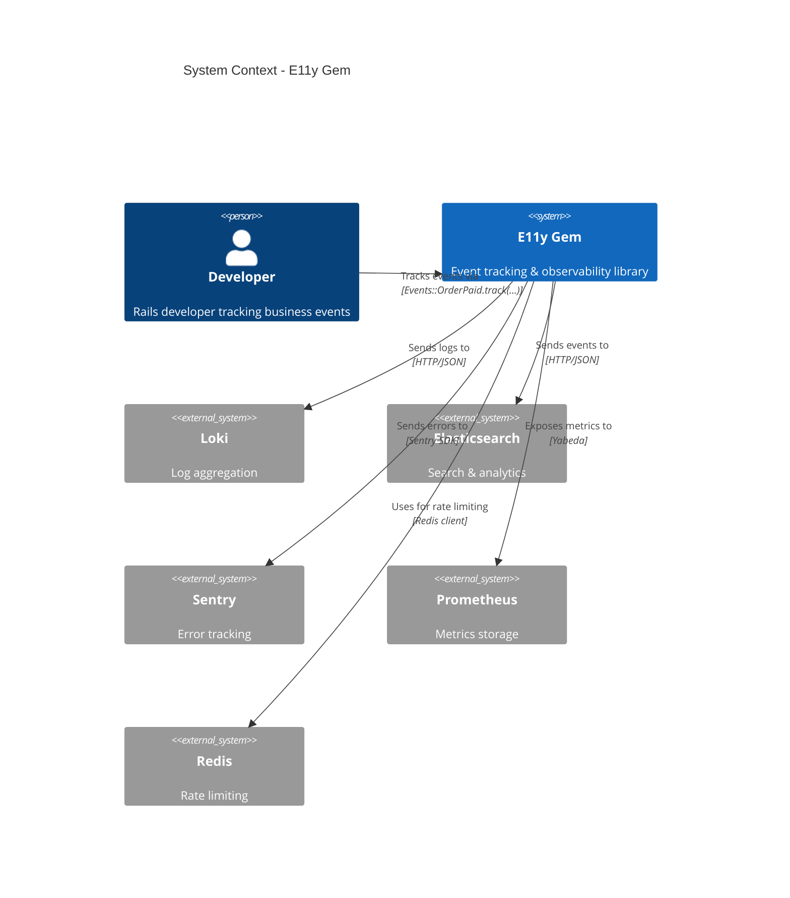

#### Level 2: Container Diagram

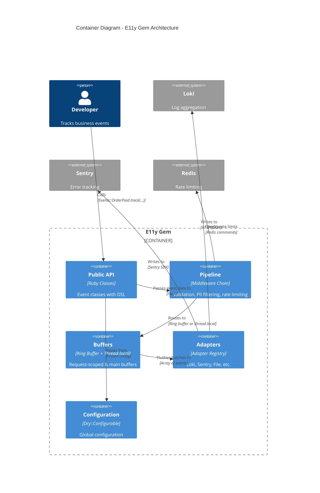

#### Level 3: Component Diagram - Pipeline

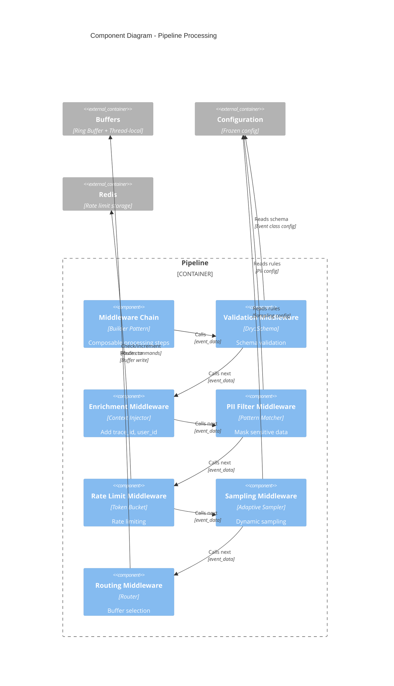

#### Level 4: Code Diagram - Event Tracking Flow

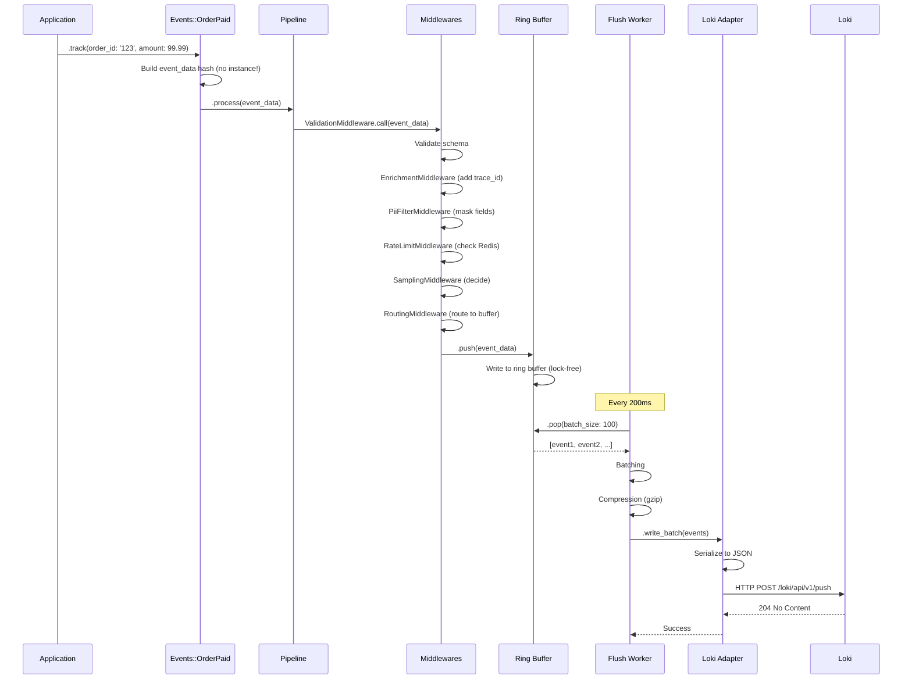

### 2.1. High-Level Architecture

```
┌─────────────────────────────────────────────────────────────────┐
│ Application Layer                                                │
│                                                                  │
│  Events::OrderPaid.track(order_id: '123', amount: 99.99)        │
│                                                                  │
└────────────────────────────┬────────────────────────────────────┘
                             ↓
┌─────────────────────────────────────────────────────────────────┐
│ E11y::Pipeline (Middleware Chain)                               │
│                                                                  │
│  1. TraceContextMiddleware  ← Add trace_id, span_id, timestamp  │
│  2. ValidationMiddleware    ← Schema validation (original class)│
│  3. PiiFilterMiddleware     ← PII filtering (original class)    │
│  4. RateLimitMiddleware     ← Rate limiting (original class)    │
│  5. SamplingMiddleware      ← Adaptive sampling (original class)│
│  6. VersioningMiddleware    ← Normalize event_name (LAST!)      │
│  7. RoutingMiddleware       ← Buffer routing (debug vs main)    │
│                                                                  │
└────────────────────────────┬────────────────────────────────────┘
                             ↓
                    ┌────────┴────────┐
                    │                 │
         ┌──────────▼─────┐   ┌──────▼──────────┐
         │ Request Buffer │   │  Main Buffer    │
         │ (Thread-local) │   │  (Ring Buffer)  │
         │                │   │                  │
         │ :debug only    │   │ :info+ events   │
         │ Flush on error │   │ Flush 200ms     │
         └──────────┬─────┘   └──────┬──────────┘
                    │                │
                    └────────┬───────┘
                             ↓
         ┌───────────────────────────────────────┐
         │ Flush Worker (Concurrent::TimerTask)  │
         │                                        │
         │  - Batching                           │
         │  - Payload minimization               │
         │  - Compression                        │
         └───────────────────┬───────────────────┘
                             ↓
         ┌───────────────────────────────────────┐
         │ Adapter Registry                      │
         │                                        │
         │  - Circuit breakers                   │
         │  - Retry policy                       │
         │  - Dead letter queue                  │
         └───────────────────┬───────────────────┘
                             ↓
         ┌────────────────────────────────────────┐
         │ Adapters (fan-out)                     │
         │                                         │
         │  → Loki Adapter                        │
         │  → Sentry Adapter                      │
         │  → File Adapter                        │
         │  → Custom Adapters                     │
         └─────────────────────────────────────────┘
```

### 2.2. Layered Architecture

```
┌─────────────────────────────────────────────────────────────────┐
│ Layer 1: Public API                                             │
│  - Event classes (DSL)                                          │
│  - Configuration (E11y.configure)                               │
│  - Helper methods (E11y.with_context)                           │
└─────────────────────────────────────────────────────────────────┘
┌─────────────────────────────────────────────────────────────────┐
│ Layer 2: Pipeline Processing                                    │
│  - Middleware chain                                             │
│  - Validation, PII filtering, rate limiting                     │
│  - Context enrichment                                           │
└─────────────────────────────────────────────────────────────────┘
┌─────────────────────────────────────────────────────────────────┐
│ Layer 3: Buffering & Batching                                   │
│  - Request-scoped buffer (thread-local)                         │
│  - Main ring buffer (concurrent)                                │
│  - Flush worker (timer task)                                    │
└─────────────────────────────────────────────────────────────────┘
┌─────────────────────────────────────────────────────────────────┐
│ Layer 4: Adapter Layer                                          │
│  - Adapter registry                                             │
│  - Circuit breakers, retry logic                                │
│  - Dead letter queue                                            │
└─────────────────────────────────────────────────────────────────┘
┌─────────────────────────────────────────────────────────────────┐
│ Layer 5: External Systems                                       │
│  - Loki, Elasticsearch, Sentry                                  │
│  - File system, S3                                              │
│  - Custom destinations                                          │
└─────────────────────────────────────────────────────────────────┘
```

---

### 2.6. Component Interaction Diagram - Buffers & Workers

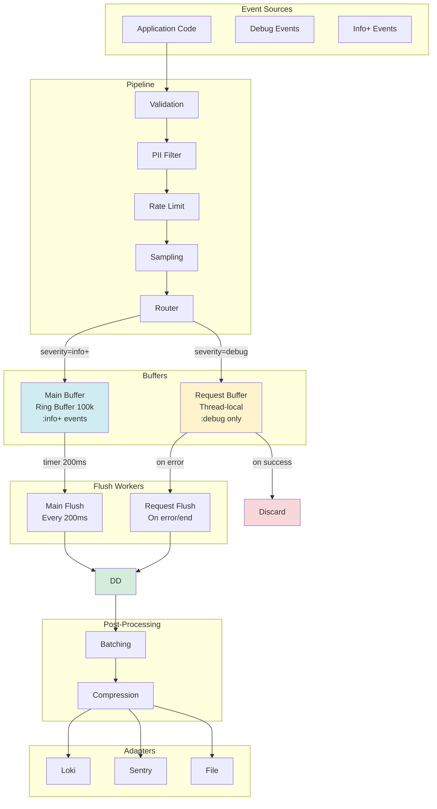

### 2.7. Memory Layout Diagram

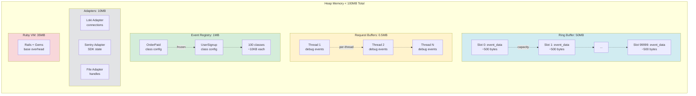

### 2.8. Thread Model Diagram

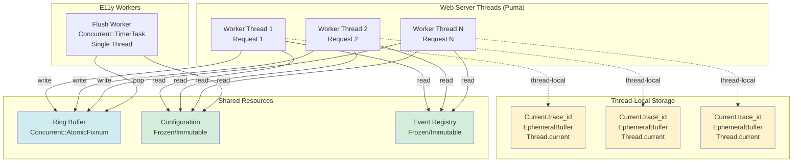

### 2.9. Configuration Lifecycle

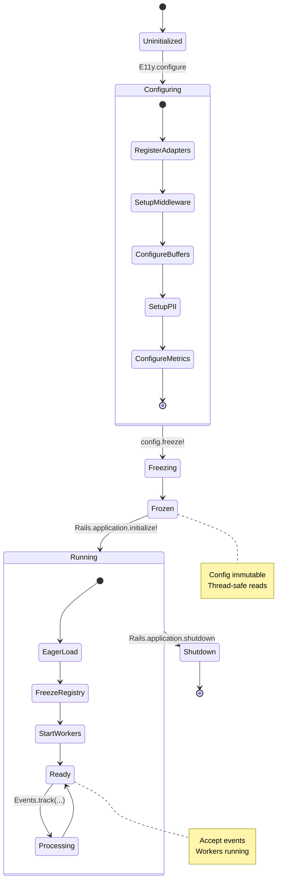

---

## 3. Core Components

### 3.1. Event Class (Zero-Allocation)

**Design Decision:** No instance creation, class methods only.

```ruby
module E11y
  class Event
    class Base
      class << self
        # Class-level configuration storage
        attr_reader :_config
        
        def inherited(subclass)
          super
          subclass.instance_variable_set(:@_config, {
            adapters: [],
            schema: nil,
            metrics: [],
            version: 1,
            pii_rules: {},
            retry_policy: {}
          })
          
          # Auto-register in registry
          Registry.register(subclass)
        end
        
        # DSL methods (store config in @_config)
        def adapters(list = nil)
          return @_config[:adapters] if list.nil?
          @_config[:adapters] = list
        end
        
        def schema(&block)
          return @_config[:schema] if block.nil?
          @_config[:schema] = Dry::Schema.define(&block)
        end
        
        def version(v = nil)
          return @_config[:version] if v.nil?
          @_config[:version] = v
        end
        
        # Main tracking method (NO INSTANCE CREATED!)
        def track(**payload)
          # Create event hash (not object)
          event_data = {
            event_class: self,
            event_name: event_name,
            event_version: @_config[:version],
            payload: payload,
            timestamp: Time.now.utc,
            context: current_context
          }
          
          # Pass through pipeline (hash-based)
          Pipeline.process(event_data)
        end
        
        def event_name
          @event_name ||= name.demodulize.underscore.gsub('_v', '.v')
          # Events::OrderPaid → 'order.paid'
          # Events::OrderPaidV2 → 'order.paid.v2'
        end
        
        private
        
        def current_context
          {
            trace_id: Current.trace_id,
            user_id: Current.user_id,
            request_id: Current.request_id
            # ... other context
          }
        end
      end
    end
  end
end
```

**Key Points:**
- ✅ No `new` calls → zero allocation
- ✅ All data in Hash (not object)
- ✅ Class methods only
- ✅ Thread-safe (@_config frozen after definition)

---

### 3.2. Pipeline (Middleware Chain)

**Design Decision:** Middleware chain (Rails-familiar, extensible).

```ruby
module E11y
  class Pipeline
    class << self
      attr_accessor :middlewares
      
      def use(middleware_class, *args, **options)
        @middlewares ||= []
        @middlewares << [middleware_class, args, options]
      end
      
      def process(event_data)
        # Build middleware chain
        chain = build_chain
        
        # Execute chain
        chain.call(event_data)
      rescue => error
        handle_pipeline_error(error, event_data)
      end
      
      private
      
      def build_chain
        # Reverse to build chain from inside out
        @middlewares.reverse.reduce(final_handler) do |next_middleware, (klass, args, options)|
          klass.new(next_middleware, *args, **options)
        end
      end
      
      def final_handler
        ->(event_data) { Router.route(event_data) }
      end
      
      def handle_pipeline_error(error, event_data)
        case Config.on_error
        when :raise
          raise error
        when :log
          Rails.logger.error("E11y pipeline error", error: error, event: event_data)
        when :ignore
          # Silent
        end
        
        # Call custom error handler
        Config.error_handler&.call(error, event_data) if Config.error_handler
      end
    end
  end
  
  # Middleware base class
  class Middleware
    def initialize(app)
      @app = app
    end
    
    def call(event_data)
      # Subclass implements logic
      @app.call(event_data)
    end
  end
end
```

**Built-in Middlewares (in execution order):**

```ruby
# 1. Trace Context Middleware (Enrichment)
class TraceContextMiddleware < E11y::Middleware
  def call(event_data)
    event_data[:trace_id] ||= E11y::Current.trace_id || SecureRandom.uuid
    event_data[:span_id] ||= SecureRandom.hex(8)
    event_data[:timestamp] ||= Time.now.utc.iso8601(3)
    
    @app.call(event_data)
  end
end

# 2. Validation Middleware
class ValidationMiddleware < E11y::Middleware
  def call(event_data)
    schema = event_data[:event_class]._config[:schema]
    
    if schema
      result = schema.call(event_data[:payload])
      
      if result.failure?
        raise E11y::ValidationError, result.errors.to_h
      end
    end
    
    @app.call(event_data)
  end
end

# 3. PII Filter Middleware
class PiiFilterMiddleware < E11y::Middleware
  def call(event_data)
    # Get PII rules for event class (uses ORIGINAL class name!)
    pii_rules = event_data[:event_class]._config[:pii_rules]
    
    # Apply filtering
    event_data[:payload] = PiiFilter.filter(
      event_data[:payload],
      rules: pii_rules
    )
    
    @app.call(event_data)
  end
end

# 4. Rate Limit Middleware
class RateLimitMiddleware < E11y::Middleware
  def call(event_data)
    # Check limit for ORIGINAL class name (V1 vs V2 may differ!)
    unless RateLimiter.allowed?(event_data)
      # Drop event
      Metrics.increment('e11y.events.rate_limited')
      return :rate_limited
    end
    
    @app.call(event_data)
  end
end

# 5. Sampling Middleware
class SamplingMiddleware < E11y::Middleware
  def call(event_data)
    unless Sampler.should_sample?(event_data)
      Metrics.increment('e11y.events.sampled')
      return :sampled
    end
    
    @app.call(event_data)
  end
end

# 6. Versioning Middleware (LAST! Normalize for adapters)
class VersioningMiddleware < E11y::Middleware
  def call(event_data)
    # Extract version from class name (Events::OrderPaidV2 → 2)
    class_name = event_data[:event_name]
    version = extract_version(class_name)
    
    # Normalize event_name (Events::OrderPaidV2 → Events::OrderPaid)
    event_data[:event_name] = extract_base_name(class_name)
    
    # Add v: field only if version > 1
    event_data[:payload][:v] = version if version > 1
    
    @app.call(event_data)
  end
  
  private
  
  def extract_version(class_name)
    class_name =~ /V(\d+)$/ ? $1.to_i : 1
  end
  
  def extract_base_name(class_name)
    class_name.sub(/V\d+$/, '')  # Remove V2, V3, etc.
  end
end

# 7. Routing Middleware (final)
class RoutingMiddleware < E11y::Middleware
  def call(event_data)
    severity = event_data[:payload][:severity] || :info
    
    if severity == :debug
      # Route to request-scoped buffer
      EphemeralBuffer.add_event(event_data)
    else
      # Route to main buffer
      MainBuffer.add(event_data)
    end
  end
end
```

---

### 3.3. Ring Buffer Implementation with Adaptive Memory Management

> **⚠️ CRITICAL: C20 Resolution - Memory Exhaustion Prevention**  
> **See:** [CONFLICT-ANALYSIS.md C20](researches/CONFLICT-ANALYSIS.md#c20-memory-pressure--high-throughput) for detailed conflict analysis  
> **Problem:** At high throughput (10K+ events/sec), fixed-size buffers can exhaust memory (up to 1GB+ per worker)  
> **Solution:** Adaptive buffering with memory limits + backpressure mechanism

**Design Decision:** Lock-free SPSC ring buffer with adaptive memory management.

#### 3.3.1. Base Ring Buffer (Lock-Free)

```ruby
module E11y
  class RingBuffer
    def initialize(capacity = 100_000)
      @capacity = capacity
      @buffer = Array.new(capacity)
      @write_index = Concurrent::AtomicFixnum.new(0)
      @read_index = Concurrent::AtomicFixnum.new(0)
      @size = Concurrent::AtomicFixnum.new(0)
    end
    
    # Producer (single thread)
    def push(item)
      current_size = @size.value
      
      if current_size >= @capacity
        # Buffer full - handle backpressure
        handle_backpressure(item)
        return false
      end
      
      # Write to buffer
      write_pos = @write_index.value % @capacity
      @buffer[write_pos] = item
      
      # Increment write index and size
      @write_index.increment
      @size.increment
      
      true
    end
    
    # Consumer (single thread)
    def pop(batch_size = 100)
      items = []
      current_size = @size.value
      
      batch_size = [batch_size, current_size].min
      
      batch_size.times do
        read_pos = @read_index.value % @capacity
        item = @buffer[read_pos]
        
        items << item if item
        
        @buffer[read_pos] = nil  # Clear slot
        @read_index.increment
        @size.decrement
      end
      
      items
    end
    
    def size
      @size.value
    end
    
    def empty?
      @size.value.zero?
    end
    
    def full?
      @size.value >= @capacity
    end
    
    private
    
    def handle_backpressure(item)
      case Config.backpressure_strategy
      when :drop_oldest
        pop(1)  # Drop one old event
        push(item)  # Retry push
      when :drop_new
        # Drop current item
        Metrics.increment('e11y.buffer.overflow')
      when :block
        # Wait until space available (risky!)
        sleep 0.001 until !full?
        push(item)
      end
    end
  end
end
```

#### 3.3.2. Adaptive Buffer with Memory Limits (C20 Resolution)

**Key Innovation:** Track memory usage across ALL buffers, enforce global limit.

```ruby
module E11y
  # Adaptive buffer manager with memory tracking
  class AdaptiveBuffer
    def initialize
      @buffers = {}  # Per-adapter buffer (Hash)
      @total_memory_bytes = Concurrent::AtomicFixnum.new(0)
      @memory_limit_bytes = (Config.buffering.memory_limit_mb || 100) * 1024 * 1024
      @memory_warning_threshold = @memory_limit_bytes * 0.8  # 80% threshold
      @flush_mutex = Mutex.new
    end
    
    # Add event with memory tracking
    def add_event(event_data)
      event_size = estimate_size(event_data)
      current_memory = @total_memory_bytes.value
      
      # Check memory limit
      if current_memory + event_size > @memory_limit_bytes
        return handle_memory_exhaustion(event_data, event_size)
      end
      
      # Warning threshold (trigger early flush)
      if current_memory + event_size > @memory_warning_threshold
        trigger_early_flush
      end
      
      # Add to appropriate buffer
      adapter_key = event_data[:adapter] || :default
      @buffers[adapter_key] ||= []
      @buffers[adapter_key] << event_data
      
      # Track memory
      @total_memory_bytes.update { |v| v + event_size }
      
      # Increment metrics
      Metrics.gauge('e11y.buffer.memory_bytes', current_memory + event_size)
      Metrics.increment('e11y.buffer.events_added')
      
      true
    end
    
    # Memory estimation (C20 requirement)
    def estimate_size(event_data)
      # Estimate memory footprint:
      # 1. Payload JSON size
      # 2. Ruby object overhead (~200 bytes per Hash)
      # 3. String overhead (~40 bytes per String)
      
      payload_size = begin
        event_data[:payload].to_json.bytesize
      rescue
        500  # Fallback estimate
      end
      
      base_overhead = 200  # Hash object
      string_overhead = event_data.keys.size * 40  # Keys
      
      payload_size + base_overhead + string_overhead
    end
    
    # Flush buffers and return events
    def flush
      @flush_mutex.synchronize do
        events = []
        memory_freed = 0
        
        @buffers.each do |adapter_key, buffer|
          events.concat(buffer)
          
          # Estimate memory freed
          buffer.each { |event| memory_freed += estimate_size(event) }
          
          buffer.clear
        end
        
        # Update memory tracking
        @total_memory_bytes.update { |v| [v - memory_freed, 0].max }
        
        # Metrics
        Metrics.gauge('e11y.buffer.memory_bytes', @total_memory_bytes.value)
        Metrics.increment('e11y.buffer.flushes')
        
        events
      end
    end
    
    # Memory stats for monitoring
    def memory_stats
      {
        current_bytes: @total_memory_bytes.value,
        limit_bytes: @memory_limit_bytes,
        utilization: (@total_memory_bytes.value.to_f / @memory_limit_bytes * 100).round(2),
        buffer_counts: @buffers.transform_values(&:size)
      }
    end
    
    private
    
    # Handle memory exhaustion (C20 backpressure)
    def handle_memory_exhaustion(event_data, event_size)
      strategy = Config.buffering.backpressure.strategy
      
      case strategy
      when :block
        # Block event ingestion until space available
        max_wait = Config.buffering.backpressure.max_block_time || 1.0
        wait_start = Time.now
        
        loop do
          # Trigger immediate flush
          flush_all_buffers!
          
          # Check if space available
          break if @total_memory_bytes.value + event_size <= @memory_limit_bytes
          
          # Check timeout
          if Time.now - wait_start > max_wait
            # Timeout exceeded - drop event
            Metrics.increment('e11y.buffer.memory_exhaustion.dropped')
            Rails.logger.warn "[E11y] Buffer memory exhausted, dropped event: #{event_data[:event_name]}"
            return false
          end
          
          sleep 0.01  # Wait 10ms before retry
        end
        
        # Space available - retry add
        Metrics.increment('e11y.buffer.memory_exhaustion.blocked')
        add_event(event_data)
        
      when :drop
        # Drop new event
        Metrics.increment('e11y.buffer.memory_exhaustion.dropped')
        Rails.logger.warn "[E11y] Buffer memory full, dropping event: #{event_data[:event_name]}"
        false
        
      when :throttle
        # Trigger immediate flush, then drop if still full
        flush_all_buffers!
        
        if @total_memory_bytes.value + event_size <= @memory_limit_bytes
          Metrics.increment('e11y.buffer.memory_exhaustion.throttled')
          add_event(event_data)
        else
          Metrics.increment('e11y.buffer.memory_exhaustion.dropped')
          Rails.logger.warn "[E11y] Buffer memory full after flush, dropping event: #{event_data[:event_name]}"
          false
        end
      end
    end
    
    # Trigger early flush (80% threshold)
    def trigger_early_flush
      # Notify flush worker to flush NOW (not wait for timer)
      FlushWorker.trigger_immediate_flush
      Metrics.increment('e11y.buffer.early_flush_triggered')
    end
    
    # Emergency flush (memory exhaustion)
    def flush_all_buffers!
      FlushWorker.flush_now!
      Metrics.increment('e11y.buffer.emergency_flush')
    end
  end
  
  # Main buffer (singleton) with adaptive memory management
  class MainBuffer
    class << self
      def buffer
        @buffer ||= if Config.buffering.adaptive.enabled
                      AdaptiveBuffer.new
                    else
                      RingBuffer.new(Config.buffer_capacity)
                    end
      end
      
      def add(event_data)
        buffer.add_event(event_data) rescue buffer.push(event_data)
      end
      
      def flush
        buffer.flush
      end
      
      # Memory stats (for monitoring)
      def memory_stats
        buffer.respond_to?(:memory_stats) ? buffer.memory_stats : {}
      end
    end
  end
end
```

#### 3.3.3. Configuration Examples

**Production (High Throughput):**
```ruby
E11y.configure do |config|
  config.buffering do
    adaptive do
      enabled true
      memory_limit_mb 100  # Max 100 MB per worker
      
      # Backpressure strategy
      backpressure do
        enabled true
        strategy :block  # Block event ingestion when full
        max_block_time 1.second  # Max wait time before dropping
      end
    end
    
    # Standard flush triggers still apply
    flush_interval 200.milliseconds
    max_buffer_size 1000
  end
end
```

**Load Test Scenario (C20 Validation):**
```ruby
# Test setup:
# - Throughput: 10,000 events/sec
# - Event size: ~5 KB average
# - Memory limit: 100 MB
# - Expected behavior: Buffer stays under 100 MB, backpressure activates

require 'benchmark'

# Generate high-throughput events
events_per_second = 10_000
duration_seconds = 60

total_events = events_per_second * duration_seconds

puts "Starting load test: #{events_per_second} events/sec for #{duration_seconds}s"
puts "Memory limit: #{E11y::Config.buffering.memory_limit_mb} MB"

start_memory = GC.stat(:heap_live_slots) * GC::INTERNAL_CONSTANTS[:RVALUE_SIZE]
start_time = Time.now

# Generate events
total_events.times do |i|
  Events::OrderPaid.track(
    order_id: "order-#{i}",
    amount: rand(10..1000),
    customer_id: "customer-#{rand(1..10_000)}",
    items: Array.new(rand(1..10)) { { sku: "SKU-#{rand(1000)}", qty: rand(1..5) } }
  )
  
  # Report progress every 10k events
  if (i + 1) % 10_000 == 0
    stats = E11y::MainBuffer.memory_stats
    puts "[#{Time.now - start_time}s] Events: #{i + 1}, Memory: #{stats[:current_bytes] / 1024 / 1024} MB (#{stats[:utilization]}%)"
  end
  
  # Throttle to match target rate
  sleep(1.0 / events_per_second) if i % 100 == 0
end

end_time = Time.now
end_memory = GC.stat(:heap_live_slots) * GC::INTERNAL_CONSTANTS[:RVALUE_SIZE]

# Results
puts "\n=== Load Test Results ==="
puts "Duration: #{(end_time - start_time).round(2)}s"
puts "Events: #{total_events}"
puts "Rate: #{(total_events / (end_time - start_time)).round} events/sec"
puts "Memory increase: #{((end_memory - start_memory) / 1024 / 1024).round(2)} MB"

stats = E11y::MainBuffer.memory_stats
puts "Final buffer memory: #{stats[:current_bytes] / 1024 / 1024} MB (#{stats[:utilization]}%)"

# Assertions
raise "Memory limit exceeded!" if stats[:current_bytes] > 105 * 1024 * 1024  # 5% tolerance
puts "\n✅ Load test passed: Memory stayed under 100 MB limit"
```

#### 3.3.4. Trade-offs & Monitoring (C20)

**Trade-offs:**

| Aspect | Pro | Con | Mitigation |
|--------|-----|-----|------------|
| **Memory Safety** | ✅ Bounded memory usage | ⚠️ May drop events under extreme load | Monitor drop rate, alert if > 1% |
| **Backpressure** | ✅ Prevents overload | ⚠️ Can slow request processing | Set max_block_time = 1s, then drop |
| **Complexity** | ⚠️ Memory estimation overhead | ⚠️ ~50 bytes overhead per event | Acceptable for safety guarantee |
| **Throughput** | ✅ Handles 10K+ events/sec | ⚠️ Early flush may increase I/O | Tune warning threshold (default 80%) |

**Monitoring (Critical for C20):**

```ruby
# Prometheus/Yabeda metrics
Yabeda.configure do
  group :e11y_buffer do
    gauge :memory_bytes, comment: 'Current buffer memory usage in bytes'
    gauge :memory_utilization, comment: 'Buffer memory utilization %'
    
    counter :events_added, comment: 'Events added to buffer'
    counter :flushes, comment: 'Buffer flushes triggered'
    counter :early_flush_triggered, comment: 'Early flushes (80% threshold)'
    counter :emergency_flush, comment: 'Emergency flushes (memory exhaustion)'
    
    counter :memory_exhaustion_blocked, comment: 'Events blocked due to memory limit', tags: [:strategy]
    counter :memory_exhaustion_dropped, comment: 'Events dropped due to memory limit', tags: [:strategy]
    counter :memory_exhaustion_throttled, comment: 'Events throttled due to memory limit', tags: [:strategy]
  end
end

# Alert rules (Grafana)
# Alert: Buffer memory utilization > 90%
# Alert: Drop rate > 1% of ingestion rate
# Alert: Emergency flushes > 10/min
```

**Related Conflicts:**
- **C14:** Development buffer tuning (see ADR-010)
- **C18:** Non-failing event tracking in background jobs (see ADR-013)

---

### 3.4. Request-Scoped Buffer

**Design Decision:** Thread-local storage via `EphemeralBuffer` with `Thread.current[:e11y_ephemeral_buffer]`. Context (trace_id, request_id) in `E11y::Current` (ActiveSupport::CurrentAttributes); buffer is separate.

```ruby
module E11y
  class Current < ActiveSupport::CurrentAttributes
    # Thread-local context attributes (no buffer here)
    attribute :trace_id
    attribute :user_id
    attribute :request_id
    attribute :sampled  # Sampling decision
  end

  module Buffers
    class EphemeralBuffer
      THREAD_KEY_BUFFER = :e11y_ephemeral_buffer

      def self.initialize!(request_id: nil, buffer_limit: nil)
        Thread.current[THREAD_KEY_BUFFER] = []
      end

      def self.add_event(event_data)
        buf = Thread.current[THREAD_KEY_BUFFER]
        return false unless buf
        buf << event_data if buf.size < (buffer_limit || Config.buffer (job_buffer_limit))
      end

      def self.flush_on_error
        # Flush buffered events to adapters
      end

      def self.discard
        Thread.current[THREAD_KEY_BUFFER] = nil
      end
    end
  end
end
```

Rails integration: `Middleware::Request` and Sidekiq/ActiveJob instruments call `EphemeralBuffer.initialize!`, `flush_on_error`, `discard` at request/job boundaries.

---

### 3.5. Adapter Base Class

**Design Decision:** Abstract base class with contract tests.

```ruby
module E11y
  module Adapters
    class Base
      # Required interface methods
      def write_batch(events)
        raise NotImplementedError, "#{self.class}#write_batch not implemented"
      end
      
      def close
        # Optional: cleanup connections
      end
      
      # Contract validation (for tests)
      def self.validate_contract!
        raise "Adapter must respond to :write_batch" unless instance_methods.include?(:write_batch)
      end
      
      protected
      
      # Helper for serialization
      def serialize(events)
        events.map { |e| serialize_event(e) }
      end
      
      def serialize_event(event_data)
        {
          '@timestamp' => event_data[:timestamp].iso8601,
          'event.name' => event_data[:event_name],
          'event.version' => event_data[:event_version],
          'trace.id' => event_data[:context][:trace_id],
          'user.id' => event_data[:context][:user_id],
          **event_data[:payload]
        }
      end
    end
    
    # Example: Loki Adapter
    class LokiAdapter < Base
      def initialize(url:, labels: {}, **options)
        @url = url
        @labels = labels
        @http = Faraday.new(url: url) do |f|
          f.request :json
          f.response :raise_error
          f.adapter Faraday.default_adapter
        end
      end
      
      def write_batch(events)
        payload = {
          streams: [{
            stream: @labels,
            values: events.map { |e|
              [
                (e[:timestamp].to_f * 1_000_000_000).to_i.to_s,  # Nanoseconds
                serialize_event(e).to_json
              ]
            }
          }]
        }
        
        @http.post('/loki/api/v1/push', payload)
      rescue => error
        raise E11y::AdapterError, "Loki write failed: #{error.message}"
      end
    end
  end
end
```

---

### 3.7. Request-Scoped Debug Buffer Flow

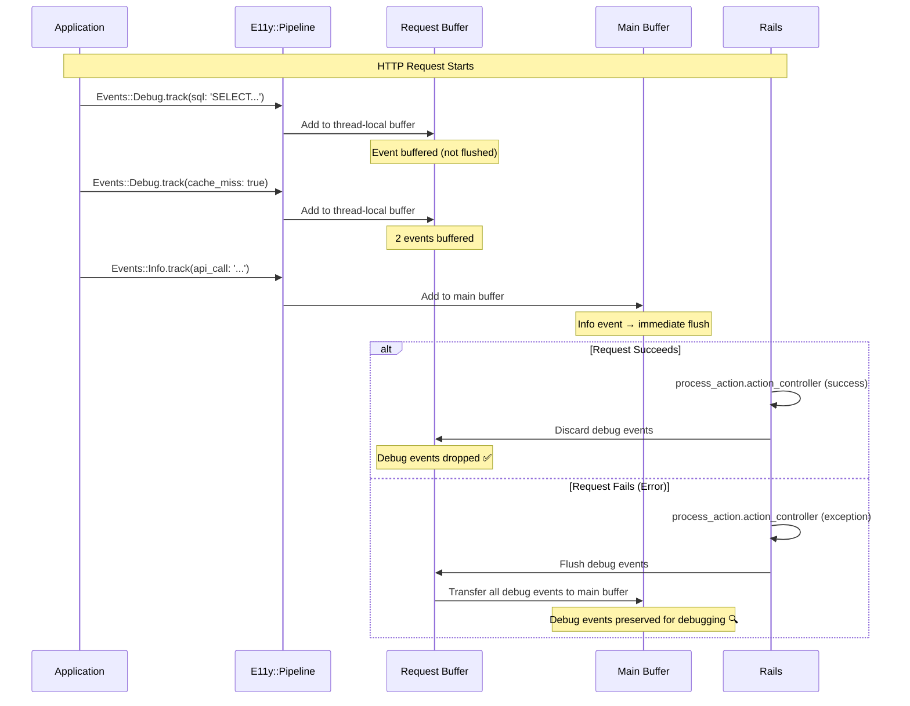

### 3.8. DLQ & Retry Flow

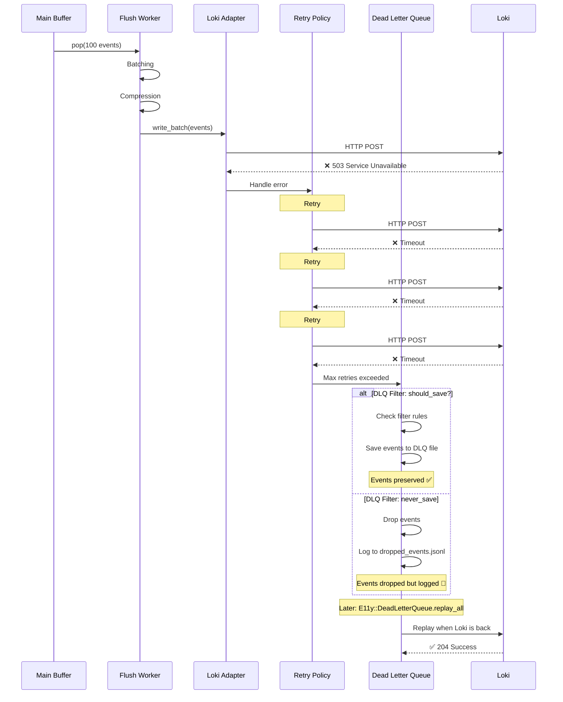

### 3.9. Adaptive Sampling Decision Tree

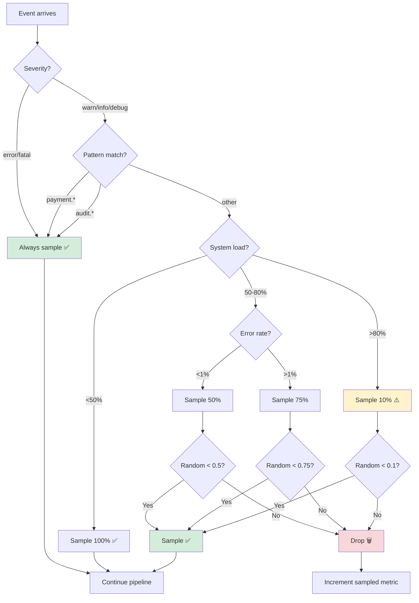

### 3.10. Cardinality Protection Flow

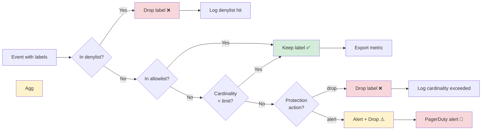

---

## 4. Processing Pipeline

> ⚠️ **CRITICAL:** Middleware execution order is critical for correct operation!  
> 📖 **See:** [ADR-015: Middleware Order](ADR-015-middleware-order.md) for detailed reference guide

### 4.1. Middleware Execution Order (CRITICAL!)

```ruby
# config/initializers/e11y.rb
E11y.configure do |config|
  # Pipeline order (CRITICAL: Versioning MUST be last!)
  config.pipeline.use TraceContextMiddleware    # 1. Add trace_id, timestamp
  config.pipeline.use ValidationMiddleware      # 2. Fail fast (uses original class)
  config.pipeline.use PiiFilterMiddleware       # 3. Security first (uses original class)
  config.pipeline.use RateLimitMiddleware       # 4. System protection (uses original class)
  config.pipeline.use SamplingMiddleware        # 5. Cost optimization (uses original class)
  config.pipeline.use VersioningMiddleware      # 6. Normalize event_name (LAST!)
  config.pipeline.use RoutingMiddleware         # 7. Buffer routing (final)
end
```

### 4.2. Pipeline Execution Flow

```
Event.track(payload)
  ↓
Pipeline.process(event_data)
  ↓
1. TraceContextMiddleware
   ├─ Add trace_id (from Current or generate)
   ├─ Add span_id
   ├─ Add timestamp
   └─ next
  ↓
2. ValidationMiddleware (uses ORIGINAL class: Events::OrderPaidV2)
   ├─ Schema validation
   ├─ FAIL → raise ValidationError
   └─ PASS → next
  ↓
3. PiiFilterMiddleware (uses ORIGINAL class: Events::OrderPaidV2)
   ├─ Get PII rules (class-level, may differ V1 vs V2!)
   ├─ Apply filtering (per-adapter if configured)
   └─ next
  ↓
4. RateLimitMiddleware (uses ORIGINAL class: Events::OrderPaidV2)
   ├─ Check rate limit (Redis or local, may differ V1 vs V2!)
   ├─ EXCEEDED → return :rate_limited
   └─ ALLOWED → next
  ↓
5. SamplingMiddleware (uses ORIGINAL class: Events::OrderPaidV2)
   ├─ Check sampling rules (adaptive, trace-consistent)
   ├─ NOT SAMPLED → return :sampled
   └─ SAMPLED → next
  ↓
6. VersioningMiddleware (LAST! Normalize for adapters)
   ├─ Extract version from class name (V2 → 2)
   ├─ Normalize event_name (Events::OrderPaidV2 → Events::OrderPaid)
   ├─ Add v: 2 to payload (only if > 1)
   └─ next
  ↓
7. RoutingMiddleware
   ├─ severity == :debug? → EphemeralBuffer
   └─ severity == :info+? → MainBuffer
  ↓
Buffer → Adapters (receive normalized event_name)
```

---

### 4.3. Why Middleware Order Matters

**Key Rule:** All business logic (validation, PII filtering, rate limiting, sampling) MUST use the **ORIGINAL class name** (e.g., `Events::OrderPaidV2`), not the normalized one.

**Why?**
- V2 may have different schema than V1
- V2 may have different PII rules than V1
- V2 may have different rate limits than V1
- V2 may have different sample rates than V1

**Versioning Middleware** is purely cosmetic normalization for external systems (adapters, Loki, Grafana). It MUST be the last middleware before routing.

**📖 For detailed explanation, examples, and troubleshooting, see:**
- **[ADR-015: Middleware Order](ADR-015-middleware-order.md)** - Complete reference guide
- **[ADR-012: Event Evolution](ADR-012-event-evolution.md)** - Versioning design

---

## 5. Memory Optimization Strategy

> **📖 For full design, implementation details, and trade-offs, see:**
> **[ADR-018: Memory Optimization](ADR-018-memory-optimization.md)**

### 5.1. Zero-Allocation Pattern

**Key Principle:** No object instances, only hashes.

```ruby
# ❌ BAD (creates instance):
class OrderPaid < E11y::Event::Base
  def self.track(**payload)
    instance = new(payload)  # ← Creates object!
    instance.process
  end
end

# ✅ GOOD (zero allocation):
class OrderPaid < E11y::Event::Base
  def self.track(**payload)
    event_data = {  # ← Just a hash!
      event_class: self,
      payload: payload,
      timestamp: Time.now.utc
    }
    
    Pipeline.process(event_data)  # ← Pass hash through
  end
end
```

### 5.2. Memory Budget Breakdown

> **⚠️ C20 Update:** Memory budget now enforced via adaptive buffering (see §3.3.2)

**Target: <100MB @ steady state (1000 events/sec)**

```
Component Breakdown:

1. Ring Buffer (main) - ADAPTIVE:
   - Capacity: Dynamic (memory-limited)
   - Memory limit: 100 MB (configurable)
   - Size per event: ~500 bytes (hash)
   - Max events: ~200k events @ 500 bytes each
   - Actual usage: Adaptive based on throughput
   - Total: ≤ 50MB (enforced by AdaptiveBuffer)

2. Request Buffers (threads):
   - Threads: 10 concurrent requests
   - Events per request: 100 debug events
   - Size per event: ~500 bytes
   - Total: 10 × 100 × 500 = 500KB

3. Event Classes (registry):
   - Classes: 100 event types
   - Size per class: ~10KB (metadata)
   - Total: 100 × 10KB = 1MB

4. Adapters (connections):
   - Adapters: 5 (Loki, File, Sentry, etc.)
   - Connection overhead: ~2MB each
   - Total: 5 × 2MB = 10MB

5. Ruby VM overhead:
   - Base Rails app: ~30MB
   - E11y gem code: ~5MB
   - Total: 35MB

TOTAL: 50 + 0.5 + 1 + 10 + 35 = 96.5MB
```

✅ **Within budget: <100MB**

**C20 Safety Guarantee:**
- Adaptive buffer enforces hard memory limit (default 100 MB)
- At high throughput (10K+ events/sec), backpressure prevents overflow
- Early flush triggered at 80% memory utilization
- Emergency flush at 100% memory utilization
- Monitoring alerts when memory > 90% for > 1 minute

**See:** §3.3.2 for adaptive buffer implementation details

### 5.3. GC Optimization

```ruby
# Minimize GC pressure
module E11y
  class Pipeline
    # Reuse hash instead of creating new
    SHARED_CONTEXT = {}
    
    def self.process(event_data)
      # Don't merge! Mutate instead (if safe)
      event_data[:processed_at] = Time.now.utc
      
      # ...
    end
  end
end

# Pool objects where possible
module E11y
  class StringPool
    @pool = {}
    
    def self.intern(string)
      @pool[string] ||= string.freeze
    end
  end
end
```

---

## 6. Thread Safety & Concurrency

### 6.1. Concurrency Model

**Components:**

1. **Thread-local (no sync needed):**
   - Request-scoped buffer (EphemeralBuffer + Thread.current[:e11y_ephemeral_buffer])
   - Context (Current.trace_id, request_id, etc.)

2. **Concurrent (thread-safe):**
   - Main ring buffer (Concurrent::AtomicFixnum)
   - Adapter registry (frozen after boot)

3. **Single-threaded (no contention):**
   - Flush worker (one timer task)
   - Event registry (immutable)

### 6.2. Thread Safety Guarantees

```ruby
module E11y
  class Config
    def self.configure
      raise "Already configured" if @configured
      
      yield configuration
      
      # Freeze after configuration
      configuration.freeze!
      @configured = true
    end
    
    class Configuration
      def freeze!
        @adapters.freeze
        @middlewares.freeze
        @pii_rules.freeze
        # ... freeze all config
      end
    end
  end
  
  class Registry
    def self.register(event_class)
      @mutex.synchronize do
        @events[event_class.event_name] ||= {}
        @events[event_class.event_name][event_class.version] = event_class
      end
    end
    
    def self.freeze!
      @events.freeze
      @mutex = nil  # No more registration
    end
  end
end

# After Rails boot:
Rails.application.config.after_initialize do
  E11y::Registry.freeze!
end
```

---

## 7. Extension Points

### 7.1. Custom Middleware

```ruby
# Developers can add custom middleware
class CustomMiddleware < E11y::Middleware
  def call(event_data)
    # Custom logic
    if event_data[:payload][:user_role] == 'admin'
      event_data[:payload][:priority] = 'high'
    end
    
    @app.call(event_data)
  end
end

# Register
E11y.configure do |config|
  config.pipeline.use CustomMiddleware
end
```

### 7.2. Custom Adapters

```ruby
# Developers can write custom adapters
class MyCustomAdapter < E11y::Adapters::Base
  def initialize(**options)
    @options = options
  end
  
  def write_batch(events)
    # Custom logic
    events.each do |event_data|
      puts serialize_event(event_data).to_json
    end
  end
end

# Register
E11y.configure do |config|
  config.adapters.register :my_custom, MyCustomAdapter.new(...)
end
```

### 7.3. Custom Event Fields

```ruby
# Developers can add custom fields to events
class OrderPaid < E11y::Event::Base
  schema do
    required(:order_id).filled(:string)
    required(:amount).filled(:decimal)
    
    # Custom field
    optional(:internal_metadata).hash
  end
  
  # Custom class method
  def self.track_with_metadata(**payload)
    track(**payload.merge(
      internal_metadata: {
        source: 'api',
        version: 'v2'
      }
    ))
  end
end
```

---

## 8. Performance Requirements

### 8.1. Latency Targets

| Operation | p50 | p95 | p99 | Max |
|-----------|-----|-----|-----|-----|
| **Event.track()** | <0.1ms | <0.5ms | <1ms | <5ms |
| **Pipeline processing** | <0.05ms | <0.2ms | <0.5ms | <2ms |
| **Buffer write** | <0.01ms | <0.05ms | <0.1ms | <1ms |
| **Adapter write (batch)** | <10ms | <50ms | <100ms | <500ms |

### 8.2. Throughput Targets

- **Sustained:** 1000 events/sec
- **Burst:** 5000 events/sec (5 seconds)
- **Peak:** 10000 events/sec (1 second)

### 8.3. Resource Limits

- **Memory:** <100MB @ steady state
- **CPU:** <5% @ 1000 events/sec
- **GC time:** <10ms per minor GC
- **Threads:** <5 (1 main + 4 workers)

---

## 9. Testing Strategy

### 9.1. Test Pyramid

```
       ┌─────────────┐
       │   Manual    │  1% - Exploratory
       │   Testing   │
       ├─────────────┤
       │     E2E     │  4% - Full pipeline
       ├─────────────┤
       │ Integration │  15% - Multi-component
       ├─────────────┤
       │    Unit     │  80% - Individual components
       └─────────────┘
```

### 9.2. Test Coverage Requirements

| Component | Coverage | Critical? |
|-----------|----------|-----------|
| **Pipeline** | 95% | ✅ Yes |
| **Buffers** | 90% | ✅ Yes |
| **Adapters** | 85% | ✅ Yes |
| **Middlewares** | 90% | ✅ Yes |
| **Event DSL** | 95% | ✅ Yes |
| **Configuration** | 80% | ⚠️ Important |

### 9.3. Adapter Contract Tests

```ruby
# Shared contract tests for all adapters
RSpec.shared_examples 'adapter contract' do
  describe '#write_batch' do
    it 'accepts array of event hashes' do
      events = [{ event_name: 'test', payload: {} }]
      expect { adapter.write_batch(events) }.not_to raise_error
    end
    
    it 'returns success result' do
      events = [{ event_name: 'test', payload: {} }]
      result = adapter.write_batch(events)
      expect(result).to be_success
    end
    
    it 'handles empty array' do
      expect { adapter.write_batch([]) }.not_to raise_error
    end
    
    it 'raises AdapterError on failure' do
      allow(adapter).to receive(:http).and_raise(StandardError)
      events = [{ event_name: 'test', payload: {} }]
      expect { adapter.write_batch(events) }.to raise_error(E11y::AdapterError)
    end
  end
end

# Usage in adapter specs
RSpec.describe E11y::Adapters::LokiAdapter do
  it_behaves_like 'adapter contract'
  
  # Adapter-specific tests
end
```

### 9.4. Performance Benchmarks

```ruby
# spec/performance/event_tracking_spec.rb
RSpec.describe 'Event tracking performance' do
  it 'tracks 1000 events in <1 second' do
    elapsed = Benchmark.realtime do
      1000.times do |i|
        Events::OrderPaid.track(order_id: i, amount: 99.99)
      end
    end
    
    expect(elapsed).to be < 1.0
  end
  
  it 'has <1ms p99 latency' do
    latencies = []
    
    1000.times do
      latency = Benchmark.realtime do
        Events::OrderPaid.track(order_id: '123', amount: 99.99)
      end
      latencies << latency
    end
    
    p99 = latencies.sort[990]
    expect(p99).to be < 0.001  # <1ms
  end
  
  it 'uses <100MB memory @ steady state' do
    GC.start
    before = GC.stat(:heap_live_slots) * GC::INTERNAL_CONSTANTS[:RVALUE_SIZE]
    
    10_000.times do
      Events::OrderPaid.track(order_id: '123', amount: 99.99)
    end
    
    GC.start
    after = GC.stat(:heap_live_slots) * GC::INTERNAL_CONSTANTS[:RVALUE_SIZE]
    
    memory_increase = (after - before) / 1024 / 1024  # MB
    expect(memory_increase).to be < 100
  end
end
```

---

## 10. Dependencies

### 10.1. Required Dependencies

```ruby
# e11y.gemspec
Gem::Specification.new do |spec|
  spec.name = 'e11y'
  spec.version = E11y::VERSION
  spec.required_ruby_version = '>= 3.3.0'
  
  # Required
  spec.add_dependency 'rails', '>= 7.0'
  spec.add_dependency 'dry-schema', '~> 1.13'
  spec.add_dependency 'dry-configurable', '~> 1.1'
  spec.add_dependency 'concurrent-ruby', '~> 1.2'
  
  # Development
  spec.add_development_dependency 'rspec', '~> 3.12'
  spec.add_development_dependency 'rspec-rails', '~> 6.0'
  spec.add_development_dependency 'benchmark-ips', '~> 2.12'
end
```

### 10.2. Optional Dependencies (Features)

```ruby
# Gemfile
group :e11y_optional do
  gem 'yabeda', '~> 0.12'  # Metrics (UC-003)
  gem 'sentry-ruby', '~> 5.0'  # Sentry adapter (UC-005)
  gem 'faraday', '~> 2.0'  # HTTP adapters
  gem 'redis', '~> 5.0'  # Rate limiting (UC-011)
end
```

### 10.3. Dependency Validation

```ruby
# Check dry-configurable version
dry_configurable_version = Gem.loaded_specs['dry-configurable'].version
if dry_configurable_version < Gem::Version.new('1.0.0')
  raise 'dry-configurable >= 1.0 required'
end

# Verify actively maintained
# Last release: 2024-01-15 (✅ active)
```

---

### 10.4. Deployment View

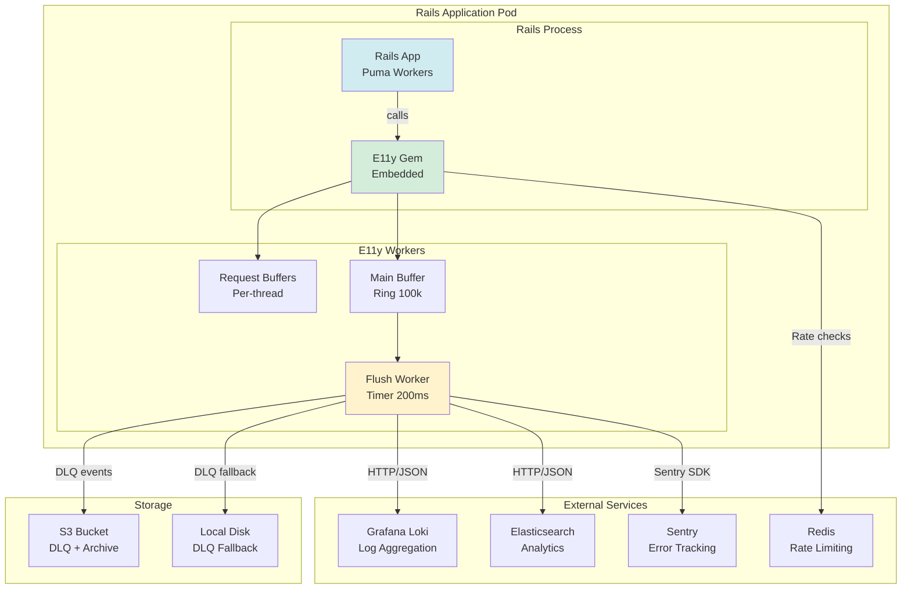

### 10.5. Multi-Environment Configuration

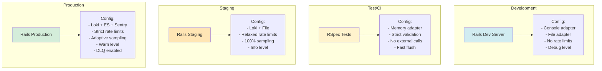

---

## 11. Deployment & Versioning

### 11.1. Semantic Versioning

```
Version Format: MAJOR.MINOR.PATCH

Examples:
- 0.1.0 - Initial release (all 22 use cases)
- 1.1.0 - New adapter (backward compatible)
- 1.0.1 - Bug fix
- 2.0.0 - Breaking change (API change, Rails 9 support)
```

### 11.2. Breaking Change Policy

**Breaking changes only in MAJOR versions:**

- ✅ Allowed in MAJOR:
  - Change public API
  - Remove deprecated features
  - Change configuration format
  - Drop Rails version support

- ❌ Not allowed in MINOR/PATCH:
  - Remove public methods
  - Change method signatures
  - Remove configuration options

### 11.3. Deprecation Policy

```ruby
# Deprecate in v1.x, remove in v2.0
class OrderPaid < E11y::Event::Base
  def self.track_legacy(**payload)
    warn '[DEPRECATED] Use .track instead. Will be removed in v2.0'
    track(**payload)
  end
end
```

---

## 12. Trade-offs & Decisions

### 12.1. Key Trade-offs

| Decision | Pro | Con | Rationale |
|----------|-----|-----|-----------|
| **Rails-only** | Simpler code, use Rails features | Smaller audience | Target Rails devs |
| **Zero-allocation** | Low memory, fast | More complex code | Performance critical |
| **Adaptive buffer (C20)** | Memory safety, prevents exhaustion | May drop events under extreme load | Safety > throughput (see §3.3.2) |
| **Ring buffer** | Lock-free, fast | Fixed size, complex | Throughput matters |
| **Middleware chain** | Extensible, familiar | Slower than direct | Extensibility > speed |
| **Strict validation** | Fail fast | Less forgiving | Correctness matters |
| **No hot reload** | Simpler, safer | Requires restart | Config changes rare |

### 12.2. Alternative Architectures Considered

**A) Actor Model (Concurrent::Actor)**
- ✅ Pro: Cleaner concurrency
- ❌ Con: More complex, unfamiliar
- ❌ **Rejected:** Too complex for Ruby devs

**B) Evented I/O (EventMachine)**
- ✅ Pro: High throughput
- ❌ Con: Blocking calls problematic
- ❌ **Rejected:** EventMachine unmaintained

**C) Simple Queue (Array + Mutex)**
- ✅ Pro: Simple
- ❌ Con: Lock contention @ high load
- ❌ **Rejected:** Performance target not met

**D) Sidekiq Jobs**
- ✅ Pro: Battle-tested
- ❌ Con: Redis dependency, latency
- ❌ **Rejected:** <1ms p99 impossible

### 12.3. Future Considerations

**v1.x (stable):**
- All 22 use cases
- Performance targets met
- Documentation complete

**v2.x (enhancements):**
- Rails 9 support
- Additional adapters (DataDog, New Relic)
- OpenTelemetry full integration

**v3.x (possible breaking changes):**
- Plain Ruby support (non-Rails)
- Different buffer strategies
- Distributed tracing coordination

---

## 12. Opt-In Features Pattern (C05: TRIZ #10 Extension)

> **🎯 CONTRADICTION_05 Resolution Extension:** Extend opt-in pattern to PII filtering and rate limiting for maximum performance flexibility.

### 12.1. Motivation

**Problem:**
- PII filtering adds ~0.2ms latency per event
- Rate limiting adds ~0.01ms latency per event
- Many events don't need these features (e.g., public page views have no PII, rare admin actions don't need rate limiting)
- Disabling globally removes protection for events that need it

**Solution (TRIZ #10: Prior Action):**
- Features enabled by default (safety first)
- Allow opt-out per event for performance optimization
- Follow Rails conventions (simple DSL)

**Benefit:**
- Events without PII save ~0.2ms (20% of 1ms budget!)
- Rare events without rate limiting save ~0.01ms
- 90% of events use defaults (no code needed)
- 10% edge cases opt-out for performance

---

### 12.2. Opt-Out DSL

**Pattern:**
```ruby
class Events::OptimizedEvent < E11y::Event::Base
  # Opt-out of PII filtering (no PII in this event)
  pii_filtering false
  
  # Opt-out of rate limiting (rare event, no need to limit)
  rate_limiting false
  
  # Opt-out of sampling (critical event, always capture)
  sampling false
  
  schema do
    # No PII fields here!
    required(:page_url).filled(:string)
    required(:referrer).filled(:string)
  end
end
```

---

### 12.3. Use Cases

#### Use Case 1: Public Page View (No PII)

**Problem:** Page views have no PII, but PII filtering still runs (0.2ms wasted)

```ruby
class Events::PublicPageView < E11y::Event::Base
  severity :debug
  pii_filtering false  # ← Opt-out (no PII fields!)
  
  schema do
    required(:page_url).filled(:string)
    required(:referrer).filled(:string)
    required(:user_agent).filled(:string)  # Not PII (public info)
  end
end
```

**Performance gain:** 0.2ms per event × 1000 events/sec = 200ms/sec saved!

---

#### Use Case 2: Rare Admin Action (No Rate Limiting)

**Problem:** Admin actions are rare (1/hour), but rate limiting still checks (0.01ms wasted)

```ruby
class Events::AdminServerRestart < E11y::Event::Base
  severity :warn
  rate_limiting false  # ← Opt-out (rare event, <10/day)
  
  schema do
    required(:admin_id).filled(:string)
    required(:reason).filled(:string)
    required(:downtime_seconds).filled(:integer)
  end
end
```

**Performance gain:** 0.01ms per event (small, but adds up)

---

#### Use Case 3: Critical Payment Event (No Sampling)

**Problem:** Payment events must be 100% captured, but sampling still checks (0.01ms wasted)

```ruby
class Events::PaymentProcessed < E11y::Event::Base
  severity :success
  sampling false  # ← Opt-out (NEVER sample payments!)
  
  schema do
    required(:payment_id).filled(:string)
    required(:amount).filled(:decimal)
    required(:currency).filled(:string)
  end
end
```

**Performance gain:** 0.01ms per event + 100% capture guarantee

---

### 12.4. Implementation

**Middleware checks opt-out flag before processing:**

```ruby
# E11y::Middleware::PIIFiltering
def call(event_data)
  event_class = event_data[:event_class]
  
  # Check opt-out flag
  if event_class.pii_filtering_enabled?
    # Apply PII filtering
    filter_pii!(event_data[:payload])
  else
    # Skip PII filtering (0.2ms saved!)
  end
  
  @app.call(event_data)
end
```

**Event DSL:**

```ruby
class E11y::Event::Base
  # Default: enabled (safety first)
  class_attribute :pii_filtering_enabled, default: true
  class_attribute :rate_limiting_enabled, default: true
  class_attribute :sampling_enabled, default: true
  
  def self.pii_filtering(enabled)
    self.pii_filtering_enabled = enabled
  end
  
  def self.rate_limiting(enabled)
    self.rate_limiting_enabled = enabled
  end
  
  def self.sampling(enabled)
    self.sampling_enabled = enabled
  end
end
```

---

### 12.5. Validation & Safety

**Prevent dangerous opt-outs:**

```ruby
# Validate PII opt-out (must have no PII fields)
class Events::PublicPageView < E11y::Event::Base
  pii_filtering false
  
  schema do
    required(:email).filled(:string)  # ← ERROR: PII field with pii_filtering disabled!
  end
end

# E11y::Validators::PIIOptOutValidator
def validate!
  if !pii_filtering_enabled? && schema_has_pii_fields?
    raise ConfigurationError, <<~ERROR
      Event #{event_class} has pii_filtering disabled but schema contains PII fields: #{pii_fields.join(', ')}
      
      Either:
      1. Enable PII filtering: pii_filtering true
      2. Remove PII fields from schema
    ERROR
  end
end

# PII field detection (via naming convention)
def schema_has_pii_fields?
  schema.keys.any? { |field|
    field.to_s.match?(/email|phone|ip_address|ssn|passport/)
  }
end
```

---

### 12.6. Already Implemented Opt-Ins

**1. Versioning Middleware (already opt-in):**
```ruby
class Events::ApiRequest < E11y::Event::Base
  version 1  # ← Explicitly enable versioning (opt-in)
end
```

**2. Adaptive Sampling (opt-in via conventions):**
```ruby
class Events::PageView < E11y::Event::Base
  severity :debug
  # sample_rate 0.01 ← Auto from severity (convention)
  
  # Override (opt-in):
  sample_rate 0.1  # ← Custom rate
end
```

---

### 12.7. Performance Impact

**Without opt-out:**
- PII filtering: 0.2ms per event
- Rate limiting: 0.01ms per event
- Sampling: 0.01ms per event
- **Total:** 0.22ms per event

**With opt-out (edge cases):**
- Public page views (no PII): 0.2ms saved
- Rare admin actions (no rate limit): 0.01ms saved
- Critical payments (no sampling): 0.01ms saved

**Performance budget:**
- Target: <1ms p99
- Middleware chain: 0.15-0.3ms
- With opt-outs: **0.15-0.3ms - 0.22ms = saves up to 70% of middleware overhead!**

---

### 12.8. Trade-Offs

| Decision | Pro | Con | Rationale |
|----------|-----|-----|-----------|
| **Default: enabled** | Safety first | Slight overhead for edge cases | 90% of events need protection |
| **Opt-out pattern** | Performance flexibility | Requires explicit opt-out | Edge cases (10%) benefit most |
| **Validation at class load** | Catch errors early | Stricter enforcement | Prevent accidental PII exposure |

---

### 12.9. Migration Path

**Identify candidates for opt-out:**

```bash
# Find events with no PII fields
bin/rails runner '
  events_without_pii = E11y::EventRegistry.all.select do |event_class|
    !event_class.schema.keys.any? { |field|
      field.to_s.match?(/email|phone|ip_address|ssn|passport/)
    }
  end
  
  puts "Events without PII (#{events_without_pii.count}):"
  events_without_pii.each do |event_class|
    puts "- #{event_class.name}"
  end
'

# Output:
# Events without PII (15):
# - Events::PublicPageView
# - Events::StaticAssetLoaded
# - Events::HealthCheckPing
# ...
```

**Add opt-out incrementally:**
```ruby
# Before:
class Events::PublicPageView < E11y::Event::Base
  # PII filtering enabled by default (0.2ms overhead)
end

# After:
class Events::PublicPageView < E11y::Event::Base
  pii_filtering false  # ← Opt-out (no PII fields)
  # 0.2ms saved! ✅
end
```

---

### 12.10. Related

**See also:**
- **ADR-006: Security & Compliance** - PII filtering architecture
- **ADR-006 Section 4: Rate Limiting** - Rate limiting implementation
- **UC-014: Adaptive Sampling** - Sampling conventions and opt-in overrides
- **CONTRADICTION_05** - Performance vs. Features (TRIZ #10: Opt-In Features)

---

## 13. Next Steps

### 13.1. Implementation Plan

**Phase 1: Core (Weeks 1-2)**
- [ ] Event::Base class (zero-allocation)
- [ ] Pipeline & middleware chain
- [ ] Ring buffer implementation
- [ ] Request-scoped buffer

**Phase 2: Features (Weeks 3-6)**
- [ ] All 22 use cases
- [ ] Adapters (Loki, File, Sentry, Stdout)
- [ ] Configuration (dry-configurable)
- [ ] Error handling

**Phase 3: Polish (Weeks 7-8)**
- [ ] Performance optimization
- [ ] Documentation
- [ ] Testing (>90% coverage)
- [ ] Example Rails app

### 13.2. Success Criteria

- ✅ All 22 use cases working
- ✅ <1ms p99 latency @ 1000 events/sec
- ✅ <100MB memory
- ✅ >90% test coverage
- ✅ All APIs documented
- ✅ Example app demonstrating features

---

## 📚 Related Documents

**Architecture & Design:**
- **[ADR-015: Middleware Order](ADR-015-middleware-order.md)** ⚠️ CRITICAL - Middleware execution order reference
- **[ADR-012: Event Evolution](ADR-012-event-evolution.md)** - Event versioning & schema evolution
- **[ADR-002: Metrics & Yabeda](ADR-002-metrics-yabeda.md)** - Metrics integration
- **[ADR-004: Adapter Architecture](ADR-004-adapter-architecture.md)** - Adapter design
- **[ADR-006: Security & Compliance](ADR-006-security-compliance.md)** - PII filtering, rate limiting
- **[ADR-011: Testing Strategy](ADR-011-testing-strategy.md)** - Testing approach

**Use Cases:**
- **[docs/use_cases/](use_cases/)** - All 22 use cases documented

---

**Status:** ✅ ADR Complete  
**Ready for:** Implementation  
**Estimated Effort:** 8 weeks (1 developer)

