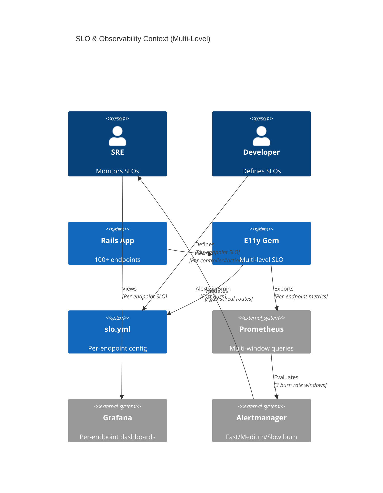
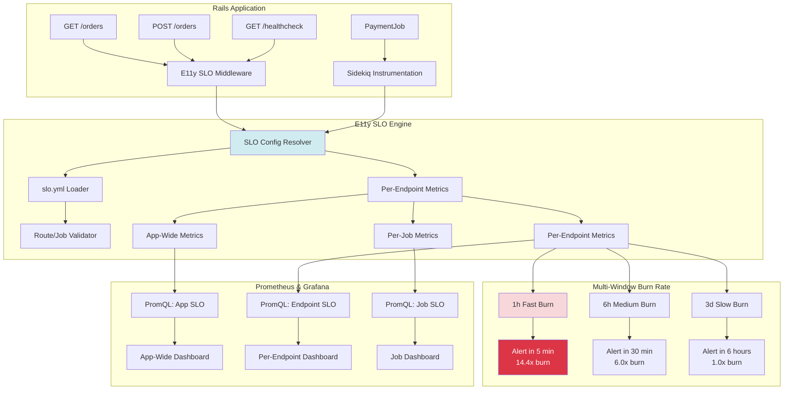
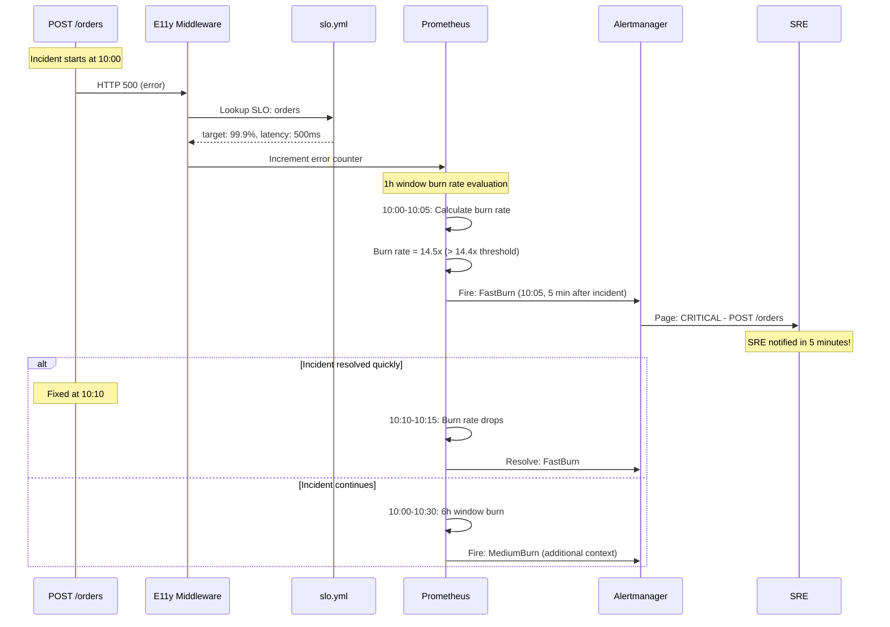

# ADR-003: SLO & Observability

**Status:** Draft  
**Date:** January 13, 2026  
**Covers:** UC-004 (Zero-Config SLO Tracking)  
**Depends On:** ADR-001 (Core), ADR-008 (Rails Integration), ADR-002 (Metrics)

**Related ADRs:**
- 📊 **ADR-014: Event-Driven SLO** - Custom SLO based on business events (e.g., payment success rate)
- 🔗 **Integration:** See `ADR-003-014-INTEGRATION.md` for detailed integration analysis

---

## 🔍 Scope of This ADR

This ADR covers **HTTP/Job SLO** (infrastructure reliability):
- ✅ Zero-config SLO for HTTP requests (99.9% availability)
- ✅ Zero-config SLO for Sidekiq/ActiveJob (99.5% success rate)
- ✅ Per-endpoint SLO configuration in `slo.yml`
- ✅ PromQL queries and alert rules — see [SLO-PROMQL-ALERTS.md](../SLO-PROMQL-ALERTS.md)

**For Event-based SLO** (business logic reliability like "order creation success rate"), see **ADR-014**.

**For App-Wide SLO** (aggregating HTTP + Event metrics into single health score), see **ADR-014 Section 9**.

---

## 📋 Table of Contents

1. [Context & Problem](#1-context--problem)
2. [Architecture Overview](#2-architecture-overview)
3. [Multi-Level SLO Strategy](#3-multi-level-slo-strategy)
4. [Per-Endpoint SLO Configuration](#4-per-endpoint-slo-configuration)
5. [PromQL & Alerts](#5-promql--alerts)
6. [SLO Config Validation & Linting](#6-slo-config-validation--linting)
7. [Dashboard & Reporting](#7-dashboard--reporting)
8. [Production Best Practices & Edge Cases](#8-production-best-practices--edge-cases)
9. [Trade-offs](#9-trade-offs)
10. [Real-World Configuration Examples](#10-real-world-configuration-examples)
11. [Summary & Next Steps](#11-summary--next-steps)

---

## 1. Context & Problem

### 1.1. Problem Statement

**Current Pain Points:**

```ruby
# === PROBLEM 1: Overly Broad SLO (App-Wide) ===
# ❌ One SLO for entire app is too coarse
# GET /healthcheck (should be 99.99%)
# POST /orders (should be 99.9%)
# GET /admin/reports (should be 95%)
# → All treated the same! Critical endpoints hidden by non-critical ones!
```

```ruby
# === PROBLEM 2: Slow Alert Detection ===
# ❌ 30-day window = slow reaction
# Incident at 10:00 AM
# First alert at 10:45 AM (45 minutes later!)
# → Customers already affected!
```

```ruby
# === PROBLEM 3: No Configuration Management ===
# ❌ SLOs hardcoded in code
# Need to deploy to change SLO targets
# No validation against real routes
# → Drift between config and reality
```

```ruby
# === PROBLEM 4: Alert Fatigue ===
# ❌ Single threshold alerting
# Minor blip → Page SRE
# Sustained issue → Same alert
# → Can't distinguish severity!
```

### 1.2. Design Decisions (Based on Google SRE 2026)

**Decision 1: Multi-Level SLO Strategy**
```yaml
# 3 levels of SLO granularity:
1. Application-wide (default, zero-config)
2. Service-level (Sidekiq, ActiveJob)
3. Per-endpoint (controller#action specific)
```

**Decision 2: Multi-Window Multi-Burn Rate (Google SRE Standard)**
```yaml
# Alert windows (not SLO windows!):
- Fast burn:  1 hour window,  5 min alert,  14.4x burn rate → 2% budget consumed
- Medium burn: 6 hour window, 30 min alert, 6.0x burn rate  → 5% budget consumed
- Slow burn:  3 day window,   6 hour alert, 1.0x burn rate  → 10% budget consumed

# SLO window: Still 30 days (industry standard)
# But ALERTS react in 5 minutes!
```

**Decision 3: YAML-Based Configuration**
```yaml
# config/slo.yml - version controlled, validated
# Separate from code deployment
# Linter validates against real routes/jobs
```

**Decision 4: Optional Latency SLO**
```yaml
# Not all endpoints need latency SLO:
- Healthcheck: availability only (latency not critical)
- File upload: availability + custom latency (5s)
- API: availability + p99 latency (500ms)
```

### 1.3. Goals

**Primary Goals:**
- ✅ **Per-endpoint SLO** (controller#action level)
- ✅ **5-minute alert detection** (fast burn rate)
- ✅ **YAML-based configuration** with validation
- ✅ **Flexible latency SLO** (optional per endpoint)
- ✅ **Multi-window burn rate** (Google SRE standard)

**Non-Goals:**
- ❌ Per-user SLO (too granular for v1.0)
- ❌ Automatic SLO adjustment (manual for v1.0)
- ❌ SLO enforcement (alerts only, no blocking)

### 1.4. Success Metrics

| Metric | Target | Critical? |
|--------|--------|-----------|
| **Alert detection time** | <5 minutes | ✅ Yes |
| **Per-endpoint coverage** | 100% (all routes) | ✅ Yes |
| **Config validation** | 100% (no drift) | ✅ Yes |
| **False positive rate** | <1% | ✅ Yes |
| **Alert precision** | >95% | ✅ Yes |

---

## 2. Architecture Overview

### 2.1. System Context



### 2.2. Component Architecture



### 2.3. Multi-Window Alert Flow



---

## 3. Multi-Level SLO Strategy

### 3.1. Level 1: Application-Wide SLO (Zero-Config)

**Automatic for all Rails apps:**

```ruby
# Shipped knobs (see lib/e11y/configuration.rb, lib/e11y/slo/)
E11y.configure do |config|
  config.slo_tracking_enabled = true # default
  config.rails_instrumentation_enabled = true
  config.sidekiq_enabled = true      # job SLO signals from Sidekiq middleware
  config.active_job_enabled = true   # job SLO signals from Active Job callbacks
end
```

**Metrics emitted:**
```ruby
# App-wide availability
http_requests_total{status="2xx|3xx|4xx|5xx"}
slo_app_availability{window="30d"}  # Calculated SLO

# App-wide latency
http_request_duration_seconds{quantile="0.99"}
slo_app_latency_p99{window="30d"}
```

### 3.2. Level 2: Service-Level SLO (Per-Service)

**Per-service overrides:**

```yaml
# config/slo.yml
services:
  sidekiq:
    default:
      success_rate_target: 0.995  # 99.5%
      window: 30d
    
    # Override for critical jobs
    jobs:
      PaymentProcessingJob:
        success_rate_target: 0.9999  # 99.99% (critical!)
        alert_on_single_failure: true
      
      EmailNotificationJob:
        success_rate_target: 0.95  # 95% (non-critical)
        latency: null  # No latency SLO
```

### 3.3. Level 3: Per-Endpoint SLO (Controller#Action)

**Most granular level:**

```yaml
# config/slo.yml
endpoints:
  # CRITICAL endpoints (99.99%)
  - name: "Health Check"
    pattern: "GET /healthcheck"
    controller: "HealthController"
    action: "index"
    slo:
      availability_target: 0.9999  # 99.99%
      latency: null  # No latency SLO for healthcheck
      window: 30d
  
  # HIGH priority endpoints (99.9%)
  - name: "Create Order"
    pattern: "POST /api/orders"
    controller: "Api::OrdersController"
    action: "create"
    slo:
      availability_target: 0.999  # 99.9%
      latency_p99_target: 500  # 500ms p99
      latency_p95_target: 300  # 300ms p95 (optional)
      window: 30d
      
      # Multi-burn rate alert config
      burn_rate_alerts:
        fast:
          enabled: true
          window: 1h
          threshold: 14.4  # 2% budget in 1h
          alert_after: 5m
        medium:
          enabled: true
          window: 6h
          threshold: 6.0   # 5% budget in 6h
          alert_after: 30m
        slow:
          enabled: true
          window: 3d
          threshold: 1.0   # 10% budget in 3d
          alert_after: 6h
  
  # SLOW endpoints (99.9% but higher latency acceptable)
  - name: "Generate Report"
    pattern: "POST /admin/reports"
    controller: "Admin::ReportsController"
    action: "create"
    slo:
      availability_target: 0.999  # 99.9%
      latency_p99_target: 5000  # 5s (slow, but acceptable)
      window: 30d
  
  # LOW priority endpoints (99%)
  - name: "Admin Dashboard"
    pattern: "GET /admin/dashboard"
    controller: "Admin::DashboardController"
    action: "index"
    slo:
      availability_target: 0.99  # 99% (less critical)
      latency: null
      window: 30d
  
  # NO SLO (exclude from tracking)
  - name: "Development Tools"
    pattern: "GET /rails/info/*"
    slo: null  # No SLO
```

---

## 4. Per-Endpoint SLO Configuration

### 4.1. Complete slo.yml Schema with All Options

```yaml
# config/slo.yml
# 
# E11y SLO Configuration
# 
# This file defines Service Level Objectives for your application at multiple levels:
# 1. App-wide defaults (fallback for unconfigured endpoints)
# 2. Endpoint-specific SLOs (per controller#action)
# 3. Service-specific SLOs (Sidekiq, ActiveJob)
#
# Lint / validation (see §6 — e11y:slo:validate aliases e11y:lint):
#   $ bundle exec rake e11y:lint
#   $ bundle exec rake e11y:slo:validate
# Dashboard JSON from slo.yml:
#   $ bundle exec rake e11y:slo:dashboard
#
# Documentation: https://github.com/arturseletskiy/e11y/docs/slo-configuration.md

version: 1

# ============================================================================
# GLOBAL DEFAULTS
# ============================================================================
# Applied to all endpoints unless overridden
# These are CONSERVATIVE defaults - tune based on your needs
defaults:
  window: 30d  # SLO evaluation window (7d, 30d, 90d)
  
  # Availability SLO (required)
  availability:
    enabled: true
    target: 0.999  # 99.9% = 43.2 minutes downtime per month
  
  # Latency SLO (optional)
  latency:
    enabled: true
    p99_target: 500   # milliseconds
    p95_target: 300   # milliseconds (optional)
    p50_target: null  # median (optional, null = disabled)
  
  # Throughput SLO (optional, for high-traffic endpoints)
  throughput:
    enabled: false  # Disabled by default
    min_rps: null   # Minimum requests per second (null = no minimum)
    max_rps: null   # Maximum requests per second (null = no maximum)
  
  # Multi-window burn rate alerts (Google SRE recommended)
  burn_rate_alerts:
    fast:
      enabled: true
      window: 1h      # Alert window
      threshold: 14.4 # 14.4x burn rate = 2% of 30-day budget in 1h
      alert_after: 5m # Fire alert after 5 minutes
      severity: critical
    medium:
      enabled: true
      window: 6h
      threshold: 6.0  # 6x burn rate = 5% of 30-day budget in 6h
      alert_after: 30m
      severity: warning
    slow:
      enabled: true
      window: 3d
      threshold: 1.0  # 1x burn rate = 10% of 30-day budget in 3d
      alert_after: 6h
      severity: info

# ============================================================================
# ENDPOINT-SPECIFIC SLOs
# ============================================================================
# Define SLOs per controller#action
# Pattern matching supported: "/api/orders/:id", "/users/*"
endpoints:
  # -------------------------------------------------------------------------
  # CRITICAL ENDPOINTS (99.99% availability)
  # -------------------------------------------------------------------------
  - name: "Health Check"
    description: "K8s liveness/readiness probe"
    pattern: "GET /healthcheck"
    controller: "HealthController"
    action: "index"
    tags:
      - critical
      - infrastructure
    slo:
      window: 30d
      availability:
        enabled: true
        target: 0.9999  # 99.99% = 4.32 minutes downtime per month
      latency:
        enabled: false  # No latency SLO for healthcheck (should be instant)
      throughput:
        enabled: false
      burn_rate_alerts:
        fast:
          enabled: true
          threshold: 14.4
          alert_after: 2m  # Override: faster alert for critical endpoint
  
  # -------------------------------------------------------------------------
  # HIGH PRIORITY ENDPOINTS (99.9% availability + strict latency)
  # -------------------------------------------------------------------------
  - name: "Create Order"
    description: "Primary checkout flow"
    pattern: "POST /api/orders"
    controller: "Api::OrdersController"
    action: "create"
    tags:
      - high_priority
      - revenue_critical
      - customer_facing
    slo:
      window: 30d
      availability:
        enabled: true
        target: 0.999  # 99.9%
      latency:
        enabled: true
        p99_target: 500   # 500ms p99
        p95_target: 300   # 300ms p95
        p50_target: 150   # 150ms p50 (median)
      throughput:
        enabled: true
        min_rps: 10   # Must handle at least 10 req/sec
        max_rps: 1000 # Alert if exceeds 1000 req/sec (potential attack)
      burn_rate_alerts:
        fast:
          enabled: true
          threshold: 14.4
          alert_after: 5m
        medium:
          enabled: true
          threshold: 6.0
          alert_after: 30m
        slow:
          enabled: true
          threshold: 1.0
          alert_after: 6h
  
  - name: "List Orders"
    description: "Customer order history"
    pattern: "GET /api/orders"
    controller: "Api::OrdersController"
    action: "index"
    tags:
      - high_priority
      - customer_facing
    slo:
      window: 30d
      availability:
        enabled: true
        target: 0.999
      latency:
        enabled: true
        p99_target: 1000  # 1s p99 (list can be slower)
        p95_target: 500
      throughput:
        enabled: false
  
  - name: "Payment Processing"
    description: "Stripe payment capture"
    pattern: "POST /api/payments"
    controller: "Api::PaymentsController"
    action: "create"
    tags:
      - critical
      - revenue_critical
      - third_party_dependent
    slo:
      window: 30d
      availability:
        enabled: true
        target: 0.999
      latency:
        enabled: true
        p99_target: 2000  # 2s p99 (external API call)
        p95_target: 1000
      throughput:
        enabled: true
        min_rps: 1
        max_rps: 100
      burn_rate_alerts:
        fast:
          enabled: true
          threshold: 10.0  # Override: more lenient for third-party dependency
          alert_after: 10m
  
  # -------------------------------------------------------------------------
  # SLOW ENDPOINTS (99.9% availability + relaxed latency)
  # -------------------------------------------------------------------------
  - name: "Generate Report"
    description: "Admin analytics report generation"
    pattern: "POST /admin/reports"
    controller: "Admin::ReportsController"
    action: "create"
    tags:
      - admin
      - slow_operation
      - batch_processing
    slo:
      window: 30d
      availability:
        enabled: true
        target: 0.999
      latency:
        enabled: true
        p99_target: 30000  # 30s p99 (slow, but acceptable for reports)
        p95_target: 20000  # 20s p95
      throughput:
        enabled: false
      burn_rate_alerts:
        fast:
          enabled: false  # Disable fast burn for slow operations
        medium:
          enabled: true
          threshold: 6.0
          alert_after: 1h
  
  - name: "Export Data"
    description: "CSV/Excel export"
    pattern: "POST /admin/exports"
    controller: "Admin::ExportsController"
    action: "create"
    tags:
      - admin
      - slow_operation
    slo:
      window: 30d
      availability:
        enabled: true
        target: 0.99  # 99% (less critical)
      latency:
        enabled: true
        p99_target: 60000  # 60s p99 (very slow, but acceptable)
      throughput:
        enabled: false
  
  # -------------------------------------------------------------------------
  # LOW PRIORITY ENDPOINTS (99% availability + no latency SLO)
  # -------------------------------------------------------------------------
  - name: "Admin Dashboard"
    description: "Internal admin dashboard"
    pattern: "GET /admin/dashboard"
    controller: "Admin::DashboardController"
    action: "index"
    tags:
      - admin
      - low_priority
    slo:
      window: 30d
      availability:
        enabled: true
        target: 0.99  # 99%
      latency:
        enabled: false  # No latency SLO for admin
      throughput:
        enabled: false
      burn_rate_alerts:
        fast:
          enabled: false
        medium:
          enabled: false
        slow:
          enabled: true  # Only slow burn
          threshold: 2.0
          alert_after: 12h
  
  # -------------------------------------------------------------------------
  # HIGH THROUGHPUT ENDPOINTS (throughput-focused)
  # -------------------------------------------------------------------------
  - name: "Metrics Ingestion"
    description: "Telemetry data ingestion endpoint"
    pattern: "POST /api/metrics"
    controller: "Api::MetricsController"
    action: "create"
    tags:
      - high_throughput
      - telemetry
    slo:
      window: 30d
      availability:
        enabled: true
        target: 0.99  # 99% (can tolerate some drops)
      latency:
        enabled: true
        p99_target: 100  # Fast ingestion required
      throughput:
        enabled: true
        min_rps: 100   # Must handle 100+ req/sec
        max_rps: 10000 # Alert if exceeds 10k req/sec
      burn_rate_alerts:
        fast:
          enabled: true
          threshold: 20.0  # More lenient for high-throughput
  
  # -------------------------------------------------------------------------
  # NO SLO (explicitly excluded)
  # -------------------------------------------------------------------------
  - name: "Development Tools"
    description: "Rails internal routes"
    pattern: "GET /rails/info/*"
    controller: "Rails::InfoController"
    action: "*"
    tags:
      - development
      - excluded
    slo: null  # Explicitly no SLO

# ============================================================================
# SERVICE-LEVEL SLOs (Sidekiq, ActiveJob)
# ============================================================================
services:
  # ---------------------------------------------------------------------------
  # SIDEKIQ JOBS
  # ---------------------------------------------------------------------------
  sidekiq:
    # Default for all jobs (unless overridden)
    default:
      window: 30d
      success_rate_target: 0.995  # 99.5%
      latency:
        enabled: false  # No latency SLO by default for jobs
      throughput:
        enabled: false
      burn_rate_alerts:
        fast:
          enabled: true
          window: 1h
          threshold: 14.4
          alert_after: 10m  # Slower alert for jobs
        medium:
          enabled: true
          window: 6h
          threshold: 6.0
          alert_after: 1h
        slow:
          enabled: true
          window: 3d
          threshold: 1.0
          alert_after: 12h
    
    # Per-job overrides
    jobs:
      PaymentProcessingJob:
        window: 30d
        success_rate_target: 0.9999  # 99.99% (critical!)
        latency:
          enabled: true
          p99_target: 5000  # 5s p99
        alert_on_single_failure: true  # Alert on any failure
        burn_rate_alerts:
          fast:
            enabled: true
            threshold: 10.0
            alert_after: 5m
      
      EmailNotificationJob:
        window: 30d
        success_rate_target: 0.95  # 95% (non-critical, can retry)
        latency:
          enabled: false
        burn_rate_alerts:
          fast:
            enabled: false
          medium:
            enabled: false
          slow:
            enabled: true
      
      ReportGenerationJob:
        window: 30d
        success_rate_target: 0.99
        latency:
          enabled: true
          p99_target: 300000  # 5 minutes
        throughput:
          enabled: true
          max_jobs_per_hour: 100  # Rate limit
  
  # ---------------------------------------------------------------------------
  # ACTIVEJOB
  # ---------------------------------------------------------------------------
  activejob:
    default:
      window: 30d
      success_rate_target: 0.995
      latency:
        enabled: false
      throughput:
        enabled: false
      burn_rate_alerts:
        fast:
          enabled: true
          window: 1h
          threshold: 14.4
          alert_after: 10m

# ============================================================================
# APP-WIDE FALLBACK (Zero-Config)
# ============================================================================
# Used for endpoints/jobs without specific configuration
app_wide:
  http:
    window: 30d
    availability:
      enabled: true
      target: 0.999  # 99.9%
    latency:
      enabled: true
      p99_target: 500
    throughput:
      enabled: false
    burn_rate_alerts:
      fast:
        enabled: true
        window: 1h
        threshold: 14.4
        alert_after: 5m
      medium:
        enabled: true
        window: 6h
        threshold: 6.0
        alert_after: 30m
      slow:
        enabled: true
        window: 3d
        threshold: 1.0
        alert_after: 6h
  
  sidekiq:
    window: 30d
    success_rate_target: 0.995
    burn_rate_alerts:
      fast:
        enabled: true
        window: 1h
        threshold: 14.4
        alert_after: 10m
  
  activejob:
    window: 30d
    success_rate_target: 0.995
    burn_rate_alerts:
      fast:
        enabled: true
        window: 1h
        threshold: 14.4
        alert_after: 10m

# ============================================================================
# ADVANCED OPTIONS
# ============================================================================
advanced:
  # Error budget alerts (percentage thresholds)
  error_budget_alerts:
    enabled: true
    thresholds: [50, 80, 90, 100]  # Alert at 50%, 80%, 90%, 100% consumed
    notify:
      slack: true
      pagerduty: false
      email: true
  
  # Deployment gate (block deploys if error budget low)
  deployment_gate:
    enabled: false  # Disabled by default (use with caution!)
    minimum_budget_percent: 20  # Need 20%+ budget to deploy
    critical_endpoints_only: true  # Only check critical endpoints
    override_label: "deploy:emergency"  # GitHub label to override
  
  # Auto-scaling based on SLO
  autoscaling:
    enabled: false  # Future feature
    scale_up_on_burn_rate: 10.0
    scale_down_on_budget_surplus: 0.5
  
  # SLO dashboard links
  dashboards:
    grafana_base_url: "https://grafana.example.com/d/e11y-slo"
    per_endpoint_template: "https://grafana.example.com/d/e11y-slo-endpoint?var-controller={controller}&var-action={action}"
  
  # Runbook links
  runbooks:
    base_url: "https://wiki.example.com/runbooks"
    fast_burn_template: "{base_url}/fast-burn-{controller}-{action}"
    medium_burn_template: "{base_url}/medium-burn-{controller}-{action}"
```

### 4.2. Config loading (shipped)

The gem ships **`E11y::SLO::ConfigLoader`** (`lib/e11y/slo/config_loader.rb`): it searches configurable directories for `slo.yml`, parses with `YAML.safe_load`, and returns a Hash or `nil` if no file exists. There is no `Config` object, no `load!`, no `ZeroConfig`, and no route/job validation inside the loader.

Use **`E11y::SLO::ConfigValidator.validate(config)`** on a parsed Hash for the checks implemented today (`version`, `endpoints`, `app_wide.aggregated_slo`, `e11y_self_monitoring`). See `lib/e11y/slo/config_validator.rb`.

Runtime SLO behaviour is driven by **`E11y::SLO::Tracker`** and code under `lib/e11y/slo/` plus request/job instrumentation—not by the long pseudo-code that used to appear in this ADR.

The YAML in §4.1 remains a **reference** for metrics, PromQL, and dashboards; the loader and **`E11y::SLO::DashboardGenerator`** consume only part of that structure.

---

## 5. PromQL & Alerts

PromQL queries and Prometheus alert rules: see [SLO-PROMQL-ALERTS.md](../SLO-PROMQL-ALERTS.md).

---

## 6. SLO config validation and linting

### 6.1. Shipped APIs and tasks

- **`E11y::SLO::ConfigLoader.load` / `.load(search_paths:)`** — returns a Hash or `nil`; see `spec/e11y/slo/config_loader_spec.rb`.
- **`E11y::SLO::ConfigValidator.validate(config)`** — returns an array of error strings; see `spec/e11y/slo/config_validator_spec.rb`.
- **`rake e11y:slo:dashboard`** — generates Grafana JSON from `slo.yml`; see `lib/tasks/e11y_slo.rake`.
- **`rake e11y:lint`** — lints E11y configuration and related rules.
- **`rake e11y:slo:validate`** — backwards-compatible alias that **invokes `e11y:lint`** (`lib/tasks/e11y_lint.rake`). It does **not** run a dedicated “SLO vs routes” validator like the old drafts of this ADR described.

There is **no** `rake e11y:slo:unconfigured` task in the repository.

### 6.2. CI

You can run `bundle exec rake e11y:lint` (or `e11y:slo:validate`) in CI when `config/slo.yml` changes. Drop any workflow step that called `e11y:slo:unconfigured`, or replace it with your own check using `ConfigLoader.load` + `ConfigValidator.validate`.

### 6.3. Tests

Use the specs under `spec/e11y/slo/` and `spec/e11y/linters/slo/` as the source of truth for behaviour.

---

## 7. Dashboard & Reporting

### 7.1. Per-Endpoint Grafana Dashboard

```json
{
  "dashboard": {
    "title": "E11y Per-Endpoint SLO Dashboard",
    "templating": {
      "list": [
        {
          "name": "controller",
          "type": "query",
          "query": "label_values(http_requests_total, controller)"
        },
        {
          "name": "action",
          "type": "query",
          "query": "label_values(http_requests_total{controller=\"$controller\"}, action)"
        }
      ]
    },
    "panels": [
      {
        "title": "Availability SLO: $controller#$action",
        "targets": [
          {
            "expr": "sum(rate(http_requests_total{controller=\"$controller\",action=\"$action\",status=~\"2..|3..\"}[30d])) / sum(rate(http_requests_total{controller=\"$controller\",action=\"$action\"}[30d]))",
            "legendFormat": "Current (30d)"
          },
          {
            "expr": "0.999",
            "legendFormat": "SLO Target (99.9%)"
          }
        ],
        "yaxis": {
          "min": 0.995,
          "max": 1.0
        }
      },
      {
        "title": "Error Budget: $controller#$action",
        "targets": [
          {
            "expr": "slo_error_budget_remaining{controller=\"$controller\",action=\"$action\"}",
            "legendFormat": "Remaining"
          }
        ],
        "thresholds": [
          { "value": 0, "color": "red" },
          { "value": 0.0002, "color": "yellow" },
          { "value": 0.001, "color": "green" }
        ]
      },
      {
        "title": "Burn Rate (Multi-Window): $controller#$action",
        "targets": [
          {
            "expr": "slo_burn_rate_1h{controller=\"$controller\",action=\"$action\"}",
            "legendFormat": "1h (fast burn)"
          },
          {
            "expr": "slo_burn_rate_6h{controller=\"$controller\",action=\"$action\"}",
            "legendFormat": "6h (medium burn)"
          },
          {
            "expr": "slo_burn_rate_3d{controller=\"$controller\",action=\"$action\"}",
            "legendFormat": "3d (slow burn)"
          },
          {
            "expr": "14.4",
            "legendFormat": "Fast Burn Threshold"
          },
          {
            "expr": "6.0",
            "legendFormat": "Medium Burn Threshold"
          },
          {
            "expr": "1.0",
            "legendFormat": "Slow Burn Threshold"
          }
        ]
      },
      {
        "title": "Latency p99: $controller#$action",
        "targets": [
          {
            "expr": "histogram_quantile(0.99, sum(rate(http_request_duration_seconds_bucket{controller=\"$controller\",action=\"$action\"}[5m])) by (le))",
            "legendFormat": "p99"
          },
          {
            "expr": "0.5",
            "legendFormat": "SLO Target (500ms)"
          }
        ]
      }
    ]
  }
}
```

---

## 8. Production Best Practices & Edge Cases

### 8.1. Rollout Strategy

**Phase 1: Observability Only (1-2 weeks)**
```yaml
# config/slo.yml - Initial rollout
version: 1

# Start with app-wide only (no per-endpoint)
app_wide:
  http:
    availability:
      enabled: true
      target: 0.999
    latency:
      enabled: true
      p99_target: 1000  # Conservative: 1s

# Disable burn rate alerts initially
defaults:
  burn_rate_alerts:
    fast:
      enabled: false  # Don't page SRE yet!
    medium:
      enabled: false
    slow:
      enabled: true  # Only slow burn (info)
      alert_after: 24h  # Very slow

# Enable deployment gate: false (don't block deploys yet)
advanced:
  deployment_gate:
    enabled: false
```

**Phase 2: Per-Endpoint + Slow Alerts (2-4 weeks)**
```yaml
# Add 3-5 critical endpoints
endpoints:
  - name: "Health Check"
    controller: "HealthController"
    action: "index"
    slo:
      availability:
        target: 0.9999  # Start strict

  - name: "Create Order"
    controller: "OrdersController"
    action: "create"
    slo:
      availability:
        target: 0.999
      burn_rate_alerts:
        slow:
          enabled: true  # Only slow burn for now
          alert_after: 12h
```

**Phase 3: Multi-Window Burn Rate (4-6 weeks)**
```yaml
# Enable medium + fast burn rate alerts
endpoints:
  - name: "Create Order"
    slo:
      burn_rate_alerts:
        fast:
          enabled: true
          alert_after: 10m  # Start conservative (10m not 5m)
        medium:
          enabled: true
        slow:
          enabled: true
```

**Phase 4: Deployment Gate (6-8 weeks)**
```yaml
# Only after confidence in data
advanced:
  deployment_gate:
    enabled: true
    minimum_budget_percent: 10  # Start lenient (10% not 20%)
    override_label: "deploy:emergency"
```

### 8.2. Edge cases (guidance)

Rollouts often hit: routes unavailable in CI, Prometheus outages during budget checks, low-traffic burn-rate noise, emergency deploys during incidents, endpoints without history, and maintenance windows. Older drafts of this ADR embedded Ruby and YAML that named **non-existent** rake tasks (for example `e11y:slo:deployment_gate:check`) and Ruby modules under `lib/e11y/slo/`. Those listings were removed—they are **not** gem APIs.

Use **§6** for what ships today (`ConfigLoader`, `ConfigValidator`, `e11y:lint`, `e11y:slo:dashboard`). Treat deployment gates, error-budget automation, and advanced burn-rate logic as **platform or application** work built on your own Prometheus and CI.

### 8.3. Monitoring the SLO system itself

When `e11y_self_monitoring.enabled` is `true` in `slo.yml`, **`E11y::SLO::ConfigLoader.self_monitoring_enabled?`** is true and **`E11y::Middleware::SelfMonitoringEmit`** increments **`e11y_events_tracked_total`** for events that complete the pipeline (see `lib/e11y/middleware/self_monitoring_emit.rb`). There is **no** `E11y.configure { |c| c.slo.self_monitoring do ... }` DSL.

Derive Prometheus alert rules from the metric names your deployment actually exports (Yabeda prefixing, scrape config, etc.)—do not assume placeholder metric names from older versions of this ADR.

---

## 9. Trade-offs

### 9.1. Key Decisions

| Decision | Pro | Con | Rationale |
|----------|-----|-----|-----------|
| **Per-endpoint SLO** | Granular visibility | Config complexity | Critical endpoints need specific SLOs |
| **Multi-window burn rate** | 5-minute detection, low false positives | Complex Prometheus queries | Google SRE best practice 2026 |
| **YAML-based config** | Version controlled, validated | Extra file | Separation of concerns |
| **Optional latency SLO** | Flexible | Some endpoints untracked | Not all endpoints need latency |
| **Config validation** | Prevents drift | CI/CD overhead | Critical for accuracy |
| **30-day SLO window** | Industry standard | Slow trend detection | Multi-window compensates |

### 9.2. Alternatives Considered

**A) Single app-wide SLO only**
- ❌ Rejected: Too coarse, hides critical endpoint issues

**B) Single-window alerting**
- ❌ Rejected: Either slow (30d) or noisy (5m)

**C) Code-based SLO config**
- ❌ Rejected: Requires deployment to change SLOs

**D) No config validation**
- ❌ Rejected: Config drift is a real problem

**E) Per-user SLO**
- ❌ Deferred to v2.0: Too complex for v1

---

## 10. Real-World Configuration Examples

### 10.1. E-Commerce Platform

```yaml
# config/slo.yml - E-commerce example
version: 1

defaults:
  window: 30d
  availability:
    enabled: true
    target: 0.999

endpoints:
  # === REVENUE-CRITICAL (99.99%) ===
  - name: "Checkout - Payment"
    pattern: "POST /checkout/payment"
    controller: "Checkout::PaymentsController"
    action: "create"
    tags: [critical, revenue, pci_scope]
    slo:
      availability:
        target: 0.9999  # 99.99%
      latency:
        p99_target: 2000  # 2s (Stripe API call)
        p95_target: 1000
      throughput:
        min_rps: 1
        max_rps: 100  # Rate limit (fraud protection)
      burn_rate_alerts:
        fast:
          threshold: 10.0  # More lenient (third-party)
          alert_after: 5m
  
  - name: "Cart - Add Item"
    pattern: "POST /cart/items"
    controller: "CartController"
    action: "add_item"
    tags: [high_priority, customer_facing]
    slo:
      availability:
        target: 0.999  # 99.9%
      latency:
        p99_target: 300
        p95_target: 150
      throughput:
        max_rps: 1000
  
  # === HIGH-TRAFFIC (throughput-focused) ===
  - name: "Product Search"
    pattern: "GET /api/products/search"
    controller: "Api::ProductsController"
    action: "search"
    tags: [high_traffic, search, cached]
    slo:
      availability:
        target: 0.995  # 99.5% (can tolerate cache misses)
      latency:
        p99_target: 500
      throughput:
        min_rps: 50  # Must handle 50+ req/sec
        max_rps: 5000
  
  # === ADMIN (low priority) ===
  - name: "Admin - Sales Report"
    pattern: "POST /admin/reports/sales"
    controller: "Admin::ReportsController"
    action: "sales"
    tags: [admin, slow_operation]
    slo:
      availability:
        target: 0.99  # 99%
      latency:
        p99_target: 30000  # 30s
      burn_rate_alerts:
        fast:
          enabled: false
        slow:
          enabled: true

services:
  sidekiq:
    jobs:
      PaymentProcessingJob:
        success_rate_target: 0.9999  # Critical!
        alert_on_single_failure: true
      
      InventorySync Job:
        success_rate_target: 0.99
        latency:
          p99_target: 60000  # 60s
```

### 10.2. SaaS API Platform

```yaml
# config/slo.yml - API platform example
version: 1

defaults:
  window: 30d
  availability:
    enabled: true
    target: 0.999
  latency:
    enabled: true
    p99_target: 200  # Fast API

endpoints:
  # === PUBLIC API (99.99%) ===
  - name: "API - Create Resource"
    pattern: "POST /api/v1/resources"
    controller: "Api::V1::ResourcesController"
    action: "create"
    tags: [api, customer_facing, rate_limited]
    slo:
      availability:
        target: 0.9999  # 99.99% SLA
      latency:
        p99_target: 200
        p95_target: 100
      throughput:
        min_rps: 10
        max_rps: 10000  # High throughput API
      burn_rate_alerts:
        fast:
          threshold: 14.4
          alert_after: 5m
  
  # === WEBHOOKS (eventual consistency) ===
  - name: "Webhook Delivery"
    pattern: "POST /internal/webhooks/deliver"
    controller: "Internal::WebhooksController"
    action: "deliver"
    tags: [internal, async, retry]
    slo:
      availability:
        target: 0.95  # 95% (retries handle failures)
      latency:
        enabled: false  # Async, latency not critical
      burn_rate_alerts:
        fast:
          enabled: false
        slow:
          enabled: true

services:
  sidekiq:
    default:
      success_rate_target: 0.999
    jobs:
      WebhookDeliveryJob:
        success_rate_target: 0.95  # Retries + DLQ
        latency:
          p99_target: 10000  # 10s (external API)
```

### 10.3. Internal Admin Tool

```yaml
# config/slo.yml - Admin tool example
version: 1

defaults:
  window: 7d  # Shorter window (less critical)
  availability:
    enabled: true
    target: 0.99  # 99% (internal users tolerate downtime)
  latency:
    enabled: false  # No latency SLO by default

endpoints:
  - name: "Admin Dashboard"
    pattern: "GET /admin"
    controller: "AdminController"
    action: "index"
    tags: [admin, internal]
    slo:
      availability:
        target: 0.99
      burn_rate_alerts:
        fast:
          enabled: false
        slow:
          enabled: true
          alert_after: 24h  # Very slow
  
  - name: "Data Export"
    pattern: "POST /admin/exports"
    controller: "Admin::ExportsController"
    action: "create"
    tags: [admin, slow_operation]
    slo:
      availability:
        target: 0.95  # 95% (can retry)
      latency:
        p99_target: 120000  # 2 minutes (large CSV)

advanced:
  deployment_gate:
    enabled: false  # No deployment gate for admin tool
  
  error_budget_alerts:
    enabled: false  # No budget alerts
```

---

## 11. Summary & Next Steps

### 11.1. What We Achieved

✅ **Multi-level SLO strategy**: App-wide, service-level, per-endpoint  
✅ **5-minute alert detection**: Multi-window burn rate (Google SRE 2026)  
✅ **YAML-based configuration**: Version-controlled `slo.yml`; partial validation via `ConfigValidator`  
✅ **Flexible latency SLO**: Optional per endpoint (reference schema in §4.1)  
✅ **Throughput SLO**: Reference schema for high-traffic endpoints  
✅ **Config validation & linting**: `e11y:lint`, `ConfigLoader` + `ConfigValidator` (subset)  
✅ **Shipped tooling**: `ConfigLoader`, `ConfigValidator`, `e11y:slo:dashboard`, `SelfMonitoringEmit` when enabled in YAML  
✅ **PromQL & alerts**: See [SLO-PROMQL-ALERTS.md](../SLO-PROMQL-ALERTS.md)  
✅ **RSpec testing**: Comprehensive test coverage  
✅ **Production best practices**: Rollout strategy, edge case handling, self-monitoring  
✅ **Real-world examples**: E-commerce, SaaS API, Admin tool configurations  

### 11.2. Implementation Checklist

**Phase 1: Core (Week 1-2)**
- [x] Implement `E11y::SLO::ConfigLoader` (YAML search + `safe_load`)
- [ ] Optional: richer loader (ERB, strict mode) if product needs it
- [x] Implement `E11y::SLO::ConfigValidator.validate` (subset of schema)
- [x] `rake e11y:slo:validate` → alias for `e11y:lint`
- [x] HTTP / job SLIs via `E11y::SLO::Tracker` + Rack / Sidekiq / ActiveJob hooks
- [ ] Broader `slo.yml` consumption (beyond dashboard + linters), if desired

**Phase 2: Production Readiness (Week 3-4)**
- [ ] Maintenance windows, deploy grace periods, deployment gates (product/platform)
- [x] Basic self-monitoring hook (`e11y_self_monitoring` in YAML + `SelfMonitoringEmit`)
- [ ] CI: run `e11y:lint` / optional `ConfigValidator.validate` on `slo.yml` changes
- [ ] Operational playbooks (runbooks, Grafana) per team

**Phase 3: Tests**
- [x] `spec/e11y/slo/config_loader_spec.rb`, `config_validator_spec.rb`, linters under `spec/e11y/linters/slo/`
- [ ] Additional integration coverage as features grow

---

**Status:** Core SLO tracking and `slo.yml` tooling are in the gem; large parts of §4.1 YAML remain a **reference** for alerting/dashboards rather than a fully interpreted config file.  
**Next:** Expand or document which YAML keys each component reads (`DashboardGenerator`, linters, `ConfigLoader`).  
**Impact:** HTTP/job SLI metrics, optional `slo.yml` + dashboard export, PromQL examples in [SLO-PROMQL-ALERTS.md](../SLO-PROMQL-ALERTS.md).
