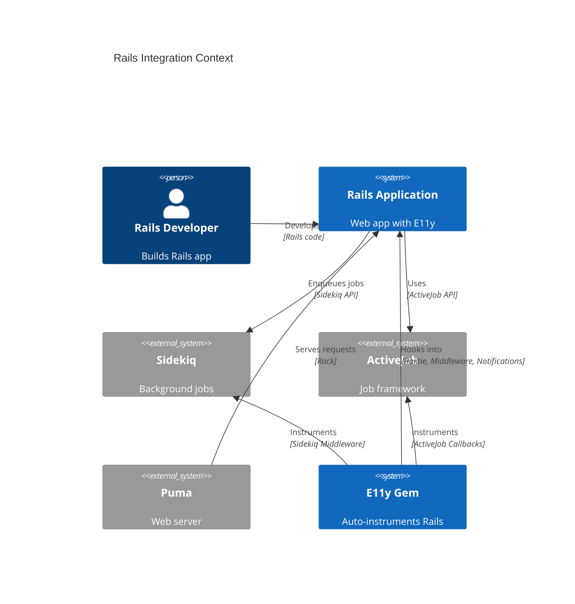
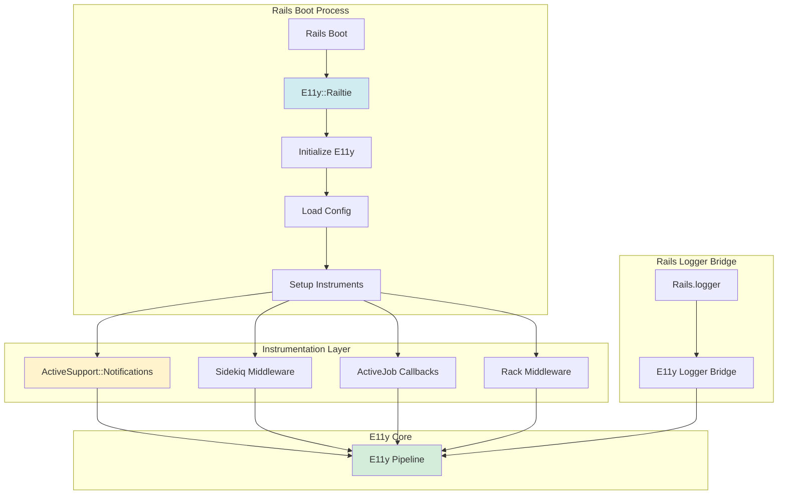
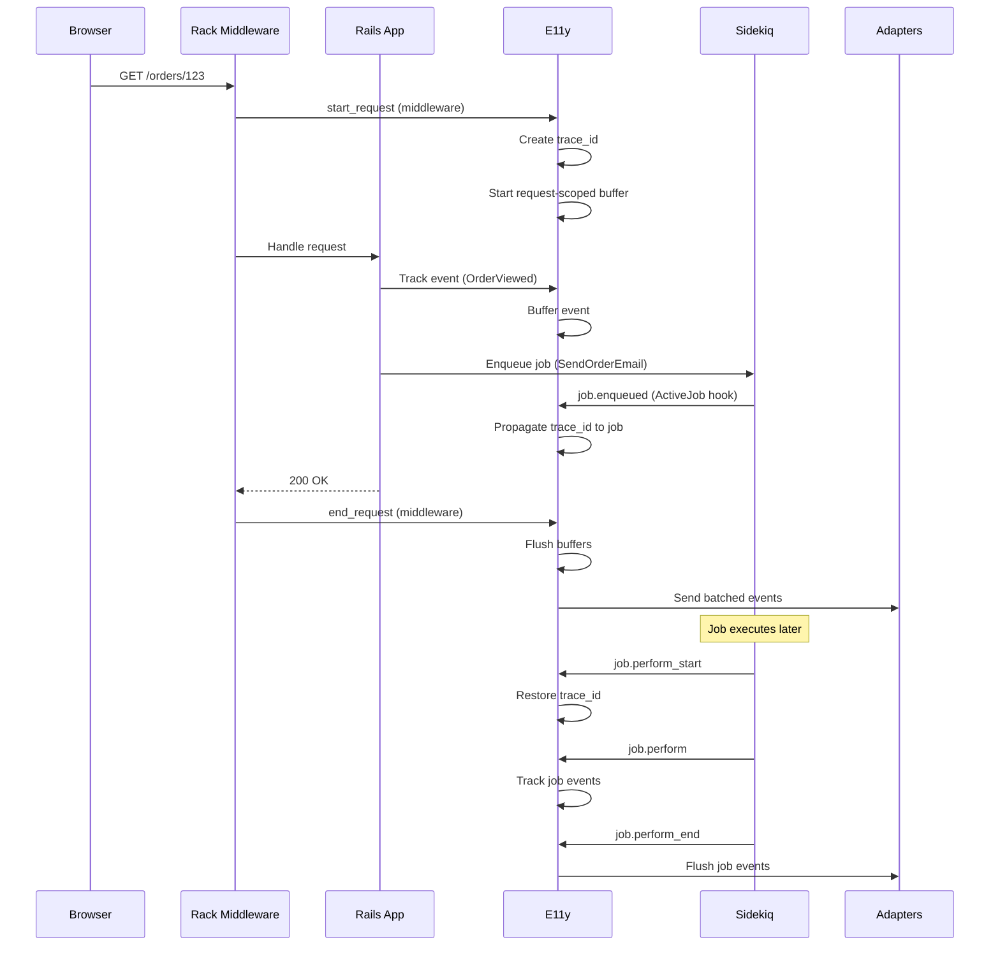
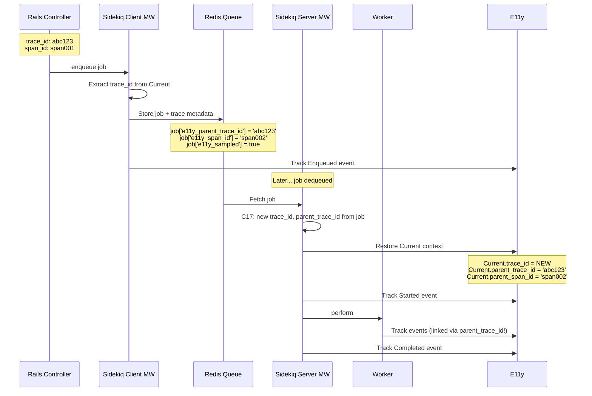

# ADR-008: Rails Integration

**Status:** Draft  
**Date:** January 12, 2026  
**Covers:** UC-010 (Background Job Tracking), UC-016 (Rails Logger Migration)  
**Depends On:** ADR-001 (Core), ADR-004 (Adapters), ADR-006 (Security)

---

## 📋 Table of Contents

1. [Context & Problem](#1-context--problem)
2. [Architecture Overview](#2-architecture-overview)
3. [Railtie & Initialization](#3-railtie--initialization)
4. [ActiveSupport::Notifications Integration](#4-activesupportnotifications-integration)
5. [Sidekiq Integration](#5-sidekiq-integration)
6. [ActiveJob Integration](#6-activejob-integration)
7. [Rails.logger Migration](#7-railslogger-migration)
8. [Middleware Integration](#8-middleware-integration)
9. [Console & Development](#9-console--development)
10. [Testing in Rails](#10-testing-in-rails)
11. [Trade-offs](#11-trade-offs)

---

## 1. Context & Problem

### 1.1. Problem Statement

**Current Pain Points:**

1. **Manual Instrumentation:**
   ```ruby
   # ❌ Manual tracking everywhere
   def create
     Events::OrderCreated.track(order_id: order.id)
     order.save
   end
   ```

2. **No Rails Integration:**
   - Can't leverage ActiveSupport::Notifications
   - No automatic Sidekiq/ActiveJob tracking
   - No Rails.logger compatibility

3. **Complex Setup:**
   ```ruby
   # ❌ Boilerplate in every Rails app
   config/initializers/e11y.rb  # Manual setup
   app/events/...               # Manual event definitions
   config/environments/*.rb     # Environment-specific config
   ```

### 1.2. Goals

**Primary Goals:**
- ✅ Zero-config Rails integration via Railtie
- ✅ Auto-instrument Sidekiq & ActiveJob
- ✅ Bidirectional ActiveSupport::Notifications
- ✅ Drop-in Rails.logger replacement
- ✅ Development-friendly (console, debugging)

**Non-Goals:**
- ❌ Support non-Rails Ruby apps (Rails 8.0+ only)
- ❌ Backwards compatibility with Rails < 8.0
- ❌ Auto-instrument every possible gem

### 1.3. Success Metrics

| Metric | Target | Critical? |
|--------|--------|-----------|
| **Setup time** | <5 minutes | ✅ Yes |
| **Auto-instrumentation coverage** | >80% Rails events | ✅ Yes |
| **Performance overhead** | <5% | ✅ Yes |
| **Rails.logger compatibility** | 100% | ✅ Yes |

---

## 2. Architecture Overview

### 2.1. System Context



### 2.2. Component Architecture



### 2.3. Request Lifecycle



---

## 3. Railtie & Initialization

### 3.1. Railtie implementation

**Source of truth:** `lib/e11y/railtie.rb` (read the file in the repo; do not paste stale excerpts).

Shipped behavior in short: `before_initialize` sets `environment`, `service_name`, and default `enabled`; after `load_config_initializers`, `e11y.setup_instrumentation` wires Rails instrumentation, optional logger bridge, and optional Sidekiq / Active Job when the corresponding **boolean** flags are set; `e11y.middleware` inserts `E11y::Middleware::Request`; development/test may register the DevLog adapter and `DevLogSource` middleware; optional `e11y.http_tracing` patches Net::HTTP; console loads `E11y::Console`; Rake tasks load the `lib/e11y/tasks/*.rake` files.

Older drafts of this ADR showed extra initializers (e.g. a global `ActiveSupport::Notifications.subscribe(/.*/)`, unconditional Sidekiq registration, `lib/e11y/configuration/rails.rb`, `LoggerBridgeConfig` as a nested type). **Those are not in the codebase.**

### 3.2. Configuration

All tunables live on **`E11y::Configuration`** in `lib/e11y/configuration.rb`. There is no separate `E11y::Configuration::Rails` class.

---

## 4. ActiveSupport::Notifications Integration

### 4.1. Unidirectional Flow (ASN → E11y)

**Design Decision (Updated 2026-01-17):** **Unidirectional** flow from ActiveSupport::Notifications to E11y.

**Rationale:**
- ✅ **Avoids infinite loops**: Bidirectional bridge can create cycles (E11y → ASN → E11y → ...)
- ✅ **Simpler reasoning**: Single direction = clear data flow
- ✅ **Better performance**: No double overhead of publish + subscribe
- ✅ **Separation of concerns**: ASN = Rails instrumentation, E11y = Business events + adapters

**Architecture:**
```
┌─────────────────────────────────────────────────────────────────┐
│                         Rails Application                        │
├─────────────────────────────────────────────────────────────────┤
│                                                                   │
│  ActiveSupport::Notifications                                    │
│  ┌──────────────────────────────────────────────────┐           │
│  │  Rails Internal Events:                          │           │
│  │  - sql.active_record                             │           │
│  │  - process_action.action_controller              │           │
│  │  - render_template.action_view                   │           │
│  │  - enqueue.active_job                            │           │
│  └──────────────────────────────────────────────────┘           │
│              │                                                    │
│              │ SUBSCRIBE ONLY (Unidirectional)                  │
│              ▼                                                    │
│  ┌──────────────────────────────────────────────────┐           │
│  │  E11y::Instruments::RailsInstrumentation         │           │
│  │  - Convert ASN events → E11y events              │           │
│  │  - Apply event mapping (overridable!)            │           │
│  │  - Route to E11y pipeline                        │           │
│  └──────────────────────────────────────────────────┘           │
│              │                                                    │
│              ▼                                                    │
│  ┌──────────────────────────────────────────────────┐           │
│  │  E11y Event Pipeline                             │           │
│  │  → Middleware → Adapters → Loki/Sentry/etc       │           │
│  └──────────────────────────────────────────────────┘           │
│                                                                   │
└─────────────────────────────────────────────────────────────────┘
```

```ruby
# lib/e11y/instruments/rails_instrumentation.rb
module E11y
  module Instruments
    class RailsInstrumentation
      # ========================================
      # ONLY ActiveSupport::Notifications → E11y
      # ========================================
      
      def self.setup!
        return unless E11y.config.rails_instrumentation_enabled
        
        # Subscribe to Rails events
        event_mapping.each do |asn_pattern, e11y_event_class|
          next if ignored?(asn_pattern)
          
          ActiveSupport::Notifications.subscribe(asn_pattern) do |name, start, finish, id, payload|
            duration = (finish - start) * 1000  # Convert to ms
            
            # Convert ASN event → E11y event
            e11y_event_class.track(
              event_name: name,
              duration: duration,
              **extract_relevant_payload(payload)
            )
          end
        end
      end
      
      # Built-in event mappings (can be overridden in config!)
      DEFAULT_RAILS_EVENT_MAPPING = {
        'sql.active_record' => E11y::Events::Rails::Database::Query,
        'process_action.action_controller' => E11y::Events::Rails::Http::Request,
        'render_template.action_view' => E11y::Events::Rails::View::Render,
        'send_file.action_controller' => E11y::Events::Rails::Http::SendFile,
        'redirect_to.action_controller' => E11y::Events::Rails::Http::Redirect,
        'start_processing.action_controller' => E11y::Events::Rails::Http::StartProcessing,
        'cache_read.active_support' => E11y::Events::Rails::Cache::Read,
        'cache_write.active_support' => E11y::Events::Rails::Cache::Write,
        'cache_delete.active_support' => E11y::Events::Rails::Cache::Delete,
        'enqueue.active_job' => E11y::Events::Rails::Job::Enqueued,
        'enqueue_at.active_job' => E11y::Events::Rails::Job::Scheduled,
        'perform_start.active_job' => E11y::Events::Rails::Job::Started,
        # perform.active_job: Completed on success; Failed when payload has exception
        'perform.active_job' => E11y::Events::Rails::Job::Completed
      }.freeze
      
      # Get final event mapping (after config overrides)
      def self.event_mapping
        @event_mapping ||= begin
          mapping = DEFAULT_RAILS_EVENT_MAPPING.dup
          
          # Apply custom mappings from config (Devise-style overrides)
          custom_mappings = E11y.config.rails_instrumentation_custom_mappings || {}
          mapping.merge!(custom_mappings)
          
          mapping
        end
      end
      
      def self.ignored?(pattern)
        ignore_list = E11y.config.rails_instrumentation_ignore_events || []
        ignore_list.include?(pattern)
      end
      
      def self.extract_relevant_payload(payload)
        # Extract only relevant fields (avoid PII, reduce noise)
        # Implementation depends on event type
        payload.slice(:controller, :action, :format, :status, :allocations, :db_runtime)
      end
    end
  end
end
```

### 4.2. Configuration (Rails integration)

**As implemented:** flags and hashes on `E11y::Configuration` (`lib/e11y/configuration.rb`). There is **no** nested `config.rails_instrumentation do`, `config.sidekiq do`, or `config.active_job do` DSL—those snippets were design sketches and must not be copied into apps.

**Rails → E11y:** enable `rails_instrumentation_enabled`, optionally set `rails_instrumentation_custom_mappings` (String ASN pattern → event class) and `rails_instrumentation_ignore_events` (Array of patterns to skip). Instrumentation is wired in `E11y::Instruments::RailsInstrumentation` and invoked from `E11y::Railtie`.

**Jobs:** `sidekiq_enabled` and `active_job_enabled` are booleans. **Logger bridge:** `logger_bridge_enabled`, `logger_bridge_track_severities`, `logger_bridge_ignore_patterns`.

```ruby
# config/initializers/e11y.rb
E11y.configure do |config|
  config.rails_instrumentation_enabled = true

  config.rails_instrumentation_custom_mappings["sql.active_record"] =
    MyApp::Events::CustomDatabaseQuery
  config.rails_instrumentation_ignore_events << "cache_read.active_support"

  config.sidekiq_enabled = true
  config.active_job_enabled = true
  config.ephemeral_buffer_enabled = true
end
```

### 4.2.1. Custom Event Class Example

**Use Case:** Override default `E11y::Events::Rails::Database::Query` with custom schema and PII rules.

```ruby
# app/events/custom_database_query.rb
module MyApp
  module Events
    class CustomDatabaseQuery < E11y::Event::Base
      schema do
        required(:query).filled(:string)
        required(:duration).filled(:float)
        required(:connection_name).filled(:string)
        
        # Custom field (not in default Event::Rails::Database::Query)
        optional(:database_shard).filled(:string)
        optional(:query_type).filled(:string)  # SELECT, INSERT, UPDATE, etc.
      end
      
      # Custom severity (mark slow queries as warnings)
      severity do |payload|
        payload[:duration] > 1000 ? :warn : :debug
      end
      
      # Custom adapter routing (also send to Elasticsearch)
      adapters [:loki, :elasticsearch]
      
      # Custom PII filtering (more aggressive than default)
      pii_filtering do
        masks :query  # Mask entire SQL query
        hashes :connection_name  # Hash connection name
      end
      
      # Custom rate limiting (protect from query floods)
      rate_limit 100, window: 1.second
      
      # Custom retention (keep only for 7 days)
      retention 7.days
    end
  end
end

# config/initializers/e11y.rb
E11y.configure do |config|
  config.rails_instrumentation_custom_mappings["sql.active_record"] =
    MyApp::Events::CustomDatabaseQuery
end

# Now sql.active_record uses CustomDatabaseQuery (see RailsInstrumentation.event_mapping).
```

**Example: Disable specific instruments:**

```ruby
# Disable ASN but keep Sidekiq
E11y.configure do |config|
  config.rails_instrumentation_enabled = false
  config.sidekiq_enabled = true
  config.active_job_enabled = true
end

# Minimal setup: only Sidekiq
E11y.configure do |config|
  config.rails_instrumentation_enabled = false
  config.sidekiq_enabled = true
  config.active_job_enabled = false
end
```

---

## 4.3. Built-in Event Classes

**Design Decision:** E11y provides built-in event classes for standard Rails events.

**Location:** `E11y::Events::Rails` namespace (auto-loaded by gem)

```ruby
# app/events/rails/ (provided by E11y gem)
module Events
  module Rails
    module Database
      class Query < E11y::Event::Base
        schema do
          required(:name).filled(:string)
          required(:sql).filled(:string)
          required(:duration).filled(:float)
          optional(:binds).array(:hash)
        end
        
        severity :debug
        adapters [:stdout, :loki]  # Default adapters for SQL queries
      end
    end
    
    module Http
      class Request < E11y::Event::Base
        schema do
          required(:controller).filled(:string)
          required(:action).filled(:string)
          required(:method).filled(:string)
          required(:path).filled(:string)
          required(:format).filled(:string)
          required(:status).filled(:integer)
          required(:duration).filled(:float)
          optional(:view_runtime).filled(:float)
          optional(:db_runtime).filled(:float)
        end
        
        severity :info
      end
    end
    
    module Cache
      class Read < E11y::Event::Base
        schema do
          required(:key).filled(:string)
          required(:hit).filled(:bool)
          optional(:duration).filled(:float)
        end
        
        severity :debug
      end
    end
    
    module Job
      class Enqueued < E11y::Event::Base
        schema do
          required(:job_class).filled(:string)
          required(:job_id).filled(:string)
          required(:queue).filled(:string)
          optional(:scheduled_at).filled(:time)
        end
        
        severity :info
      end
      
      class Started < E11y::Event::Base
        schema do
          required(:job_class).filled(:string)
          required(:job_id).filled(:string)
          required(:queue).filled(:string)
        end
        
        severity :info
      end
      
      class Completed < E11y::Event::Base
        schema do
          required(:job_class).filled(:string)
          required(:job_id).filled(:string)
          required(:duration).filled(:float)
        end
        
        severity :success  # Extended severity
      end
      
      class Failed < E11y::Event::Base
        schema do
          required(:job_class).filled(:string)
          required(:job_id).filled(:string)
          required(:duration).filled(:float)
          required(:error_class).filled(:string)
          required(:error_message).filled(:string)
        end
        
        severity :error
        adapters [:loki, :sentry]  # Send failures to Sentry
      end
    end
  end
end
```

**User can override** built-in ASN → event class mappings with `rails_instrumentation_custom_mappings` and skip patterns with `rails_instrumentation_ignore_events` (see §4.2).

---

## 5. Sidekiq Integration

**Implementation Note:** Sidekiq middleware emits `E11y::Events::Rails::Job::Enqueued`, `Started`, `Completed`, `Failed` for **raw Sidekiq jobs only** (`include Sidekiq::Worker`). When Sidekiq is the queue adapter for ActiveJob, jobs use `ActiveJob::QueueAdapters::SidekiqAdapter::JobWrapper`; we skip event emission in Sidekiq middleware to avoid double emission — ActiveJob events come from RailsInstrumentation (ASN).

### 5.1. Server Middleware (Job Execution)

```ruby
# lib/e11y/instruments/sidekiq/server_middleware.rb
module E11y
  module Instruments
    module Sidekiq
      class ServerMiddleware
        def call(worker, job, queue)
          # C17 Hybrid: Job gets NEW trace_id, parent_trace_id links to enqueuing request
          parent_trace_id = job['e11y_parent_trace_id']
          trace_id = E11y::TraceContext.generate_id  # NEW trace per job
          parent_span_id = job['e11y_span_id']
          
          E11y::Current.set(
            trace_id: trace_id,
            parent_trace_id: parent_trace_id,
            parent_span_id: parent_span_id,
            job_id: job['jid'],
            job_class: worker.class.name,
            queue: queue
          )
          
          # Start request-scoped buffer (same as HTTP; config.ephemeral_buffer_enabled)
          if E11y.config.ephemeral_buffer_enabled
            limit = E11y.config.ephemeral_buffer_job_buffer_limit ||
                    E11y::Buffers::EphemeralBuffer::DEFAULT_BUFFER_LIMIT
            E11y::Buffers::EphemeralBuffer.initialize!(buffer_limit: limit)
          end
          
          # Track job start
          E11y::Events::Rails::Job::Started.track(
            job_class: worker.class.name,
            job_id: job['jid'],
            queue: queue,
            args: sanitize_args(job['args']),
            enqueued_at: Time.at(job['enqueued_at'])
          )
          
          start_time = Time.now
          
          begin
            result = yield
            
            # Track job success
            E11y::Events::Rails::Job::Completed.track(
              job_class: worker.class.name,
              job_id: job['jid'],
              duration: (Time.now - start_time) * 1000,
              queue: queue
            )
            
            # Discard buffer on success (same as HTTP)
            E11y::Buffers::EphemeralBuffer.discard if E11y.config.ephemeral_buffer_enabled
            
            result
          rescue => error
            # Track job failure
            E11y::Events::Rails::Job::Failed.track(
              job_class: worker.class.name,
              job_id: job['jid'],
              duration: (Time.now - start_time) * 1000,
              queue: queue,
              error_class: error.class.name,
              error_message: error.message,
              backtrace: error.backtrace&.first(10)
            )
            
            # Flush buffer on error (includes debug events)
            E11y::Buffers::EphemeralBuffer.flush_on_error if E11y.config.ephemeral_buffer_enabled
            
            raise
          ensure
            E11y::Current.reset
          end
        end
        
        private
        
        def sanitize_args(args)
          # Limit size and filter PII
          args.first(5).map { |arg| truncate(arg.inspect, 100) }
        end
        
        def truncate(string, max_length)
          string.length > max_length ? "#{string[0...max_length]}..." : string
        end
      end
    end
  end
end
```

### 5.2. Client Middleware (Job Enqueuing)

```ruby
# lib/e11y/instruments/sidekiq/client_middleware.rb
module E11y
  module Instruments
    module Sidekiq
      class ClientMiddleware
        def call(worker_class, job, queue, redis_pool)
          # C17 Hybrid: Propagate parent trace (job will create NEW trace_id)
          job['e11y_parent_trace_id'] = E11y::Current.trace_id if E11y::Current.trace_id
          job['e11y_span_id'] = E11y::TraceContext.generate_span_id
          job['e11y_sampled'] = E11y::Current.sampled  # Trace-consistent sampling
          
          # Track job enqueued
          E11y::Events::Rails::Job::Enqueued.track(
            job_class: worker_class.to_s,
            job_id: job['jid'],
            queue: queue,
            scheduled_at: job['at'] ? Time.at(job['at']) : nil
          )
          
          yield
        end
      end
    end
  end
end
```

### 5.3. Buffer for Jobs

**Design Decision:** Jobs reuse the same `EphemeralBuffer` as HTTP requests. Same semantics: buffer debug events, flush on error, discard on success. Optional job-specific config allows tuning for longer-running jobs.

```ruby
# config/initializers/e11y.rb
E11y.configure do |config|
  # Shared buffer for HTTP and jobs
  config.ephemeral_buffer_enabled = true
  
  # Optional: job-specific overrides (jobs can run longer → more debug events)
  config.ephemeral_buffer_job_buffer_limit = 500  # nil = use default (100)
end
```

**Rationale:** Single buffer implementation, single config. Jobs may need higher `job_buffer_limit` when they process many items and emit more debug events than a typical HTTP request.

---

### 5.4. Trace Propagation Diagram



---

## 6. ActiveJob Integration

**Implementation Note:** Job lifecycle events (`Enqueued`, `Started`, `Completed`, `Failed`) come from **RailsInstrumentation** (ASN), not from ActiveJob callbacks. ActiveJob callbacks handle trace context propagation, request-scoped buffer, and SLO tracking only. This design:
- Uses ASN as single source for all queue adapters (Sidekiq, Resque, Solid Queue, etc.)
- Avoids duplicate emission when ActiveJob uses Sidekiq as adapter
- Keeps callbacks focused on context/buffer/SLO

**perform.active_job routing:** When payload contains `exception`, RailsInstrumentation routes to `E11y::Events::Rails::Job::Failed` (with `error_class`, `error_message`); otherwise to `Completed`.

### 6.1. Callbacks Integration

```ruby
# lib/e11y/instruments/active_job/callbacks.rb
module E11y
  module Instruments
    module ActiveJob
      module Callbacks
        extend ActiveSupport::Concern
        
        included do
          around_perform :e11y_track_job_execution
          after_enqueue :e11y_track_job_enqueued
        end
        
        private
        
        def e11y_track_job_execution
          # C17 Hybrid: Job gets NEW trace_id, parent_trace_id links to enqueuer
          parent_trace_id = job_metadata['e11y_parent_trace_id']
          trace_id = E11y::TraceContext.generate_id
          parent_span_id = job_metadata['e11y_span_id']
          
          E11y::Current.set(
            trace_id: trace_id,
            parent_trace_id: parent_trace_id,
            parent_span_id: parent_span_id,
            job_id: job_id,
            job_class: self.class.name
          )
          
          # Start request-scoped buffer (same as HTTP; config.ephemeral_buffer_enabled)
          if E11y.config.ephemeral_buffer_enabled
            limit = E11y.config.ephemeral_buffer_job_buffer_limit ||
                    E11y::Buffers::EphemeralBuffer::DEFAULT_BUFFER_LIMIT
            E11y::Buffers::EphemeralBuffer.initialize!(buffer_limit: limit)
          end
          
          E11y::Events::Rails::Job::Started.track(
            job_class: self.class.name,
            job_id: job_id,
            queue_name: queue_name,
            arguments: sanitized_arguments
          )
          
          start_time = Time.now
          
          begin
            yield
            
            E11y::Events::Rails::Job::Completed.track(
              job_class: self.class.name,
              job_id: job_id,
              duration: (Time.now - start_time) * 1000
            )
            
            # Discard buffer on success (same as HTTP)
            E11y::Buffers::EphemeralBuffer.discard if E11y.config.ephemeral_buffer_enabled
          rescue => error
            E11y::Events::Rails::Job::Failed.track(
              job_class: self.class.name,
              job_id: job_id,
              duration: (Time.now - start_time) * 1000,
              error_class: error.class.name,
              error_message: error.message
            )
            
            # Flush buffer on error (includes debug events)
            E11y::Buffers::EphemeralBuffer.flush_on_error if E11y.config.ephemeral_buffer_enabled
            
            raise
          ensure
            E11y::Current.reset
          end
        end
        
        def e11y_track_job_enqueued
          # C17 Hybrid: Store parent trace (job will create NEW trace_id)
          job_metadata['e11y_parent_trace_id'] = E11y::Current.trace_id if E11y::Current.trace_id
          job_metadata['e11y_span_id'] = E11y::TraceContext.generate_span_id
          job_metadata['e11y_sampled'] = E11y::Current.sampled
          
          E11y::Events::Rails::Job::Enqueued.track(
            job_class: self.class.name,
            job_id: job_id,
            queue_name: queue_name,
            scheduled_at: scheduled_at
          )
        end
        
        def job_metadata
          @e11y_metadata ||= (provider_job_id || {})
        end
        
        def sanitized_arguments
          arguments.map { |arg| E11y::Sanitizer.sanitize(arg) }
        end
      end
    end
  end
end
```

---

## 7. Rails.logger Migration

### 7.1. Logger Bridge

**Design Decision:** Drop-in replacement for Rails.logger.

```ruby
# lib/e11y/logger/bridge.rb
module E11y
  module Logger
    class Bridge
      def self.setup!
        return unless E11y.config.logger_bridge_enabled
        
        # Replace Rails.logger
        Rails.logger = Bridge.new(Rails.logger)
      end
      
      def initialize(original_logger = nil)
        @original_logger = original_logger
        @severity_mapping = {
          Logger::DEBUG => :debug,
          Logger::INFO => :info,
          Logger::WARN => :warn,
          Logger::ERROR => :error,
          Logger::FATAL => :fatal
        }
      end
      
      # Standard logger methods
      def debug(message = nil, &block)
        log(:debug, message, &block)
      end
      
      def info(message = nil, &block)
        log(:info, message, &block)
      end
      
      def warn(message = nil, &block)
        log(:warn, message, &block)
      end
      
      def error(message = nil, &block)
        log(:error, message, &block)
      end
      
      def fatal(message = nil, &block)
        log(:fatal, message, &block)
      end
      
      # Generic log method
      def add(severity, message = nil, progname = nil, &block)
        e11y_severity = @severity_mapping[severity] || :info
        log(e11y_severity, message || progname, &block)
      end
      
      alias_method :log, :add
      
      # Compatibility methods
      def level
        @original_logger&.level || Logger::DEBUG
      end
      
      def level=(new_level)
        @original_logger&.level = new_level if @original_logger
      end
      
      def formatter
        @original_logger&.formatter
      end
      
      def formatter=(new_formatter)
        @original_logger.formatter = new_formatter if @original_logger
      end
      
      private
      
      def log(severity, message = nil, &block)
        # Extract message
        msg = message || (block_given? ? block.call : nil)
        
        # Track via E11y (filtered by track_severities, ignore_patterns)
        event_class_for_severity(severity).track(message: msg.to_s, caller_location: extract_caller_location)
        
        # Always delegate to original logger (SimpleDelegator super)
      end
      
      def extract_caller_location
        # Find first caller outside E11y
        caller_locations.find { |loc|
          !loc.path.include?('e11y')
        }&.then { |loc|
          "#{loc.path}:#{loc.lineno}:in `#{loc.label}'"
        }
      end
    end
  end
end
```

### 7.2. Configuration

```ruby
# config/initializers/e11y.rb
E11y.configure do |config|
  config.logger_bridge_enabled = true
  
  # Which severities to track (nil = all)
  config.logger_bridge_track_severities = [:info, :warn, :error, :fatal]
  
  # Skip noisy log messages (regex or string)
  config.logger_bridge_ignore_patterns = [
    /Started GET/,
    /Completed \d+ OK/,
    /CACHE/
  ]
end
```

**Context:** Events are enriched with `trace_id`, `request_id`, `span_id`, `user_id` from `E11y::Current` via `Event::Base.build_context` — no separate config needed.

---

## 8. Middleware Integration

### 8.0. Buffer Types (Summary)

**E11y uses a single EphemeralBuffer for both HTTP and jobs:**

| Buffer | Purpose | Lifecycle | Config |
|--------|---------|-----------|--------|
| **Request Buffer** | Debug events (HTTP + jobs) | Per-request/job, flush on error, discard on success | `config.ephemeral_buffer_enabled`, `ephemeral_buffer_job_buffer_limit` |
| **Main Buffer** | All events (info+) | Global, flush every 200ms | — |

**Diagram:**

```mermaid
graph TB
    subgraph "HTTP Request"
        HTTPEvent[Event tracked] --> Decision1{Severity?}
        Decision1 -->|:debug| [Request Buffer]
        Decision1 -->|:info+| MainBuffer[Main Buffer]
        
         --> OnError1{Request failed?}
        OnError1 -->|Yes| MainBuffer
        OnError1 -->|No| Discard1[Discard]
    end
    
    subgraph "Background Job"
        JobEvent[Event tracked] --> Decision2{Severity?}
        Decision2 -->|:debug| 
        Decision2 -->|:info+| MainBuffer2[Main Buffer]
        
         --> OnError2{Job failed?}
        OnError2 -->|Yes| MainBuffer2
        OnError2 -->|No| Discard2[Discard]
    end
    
    subgraph "Global"
        MainBuffer --> Interval[Every 200ms]
        MainBuffer2 --> Interval
        Interval --> Adapters[Flush to Adapters]
    end
    
    style  fill:#fff3cd
    style MainBuffer fill:#d1ecf1
    style MainBuffer2 fill:#d1ecf1
```

**Configuration:**

```ruby
E11y.configure do |config|
  # Request-scoped buffer (shared for HTTP and jobs)
  config.ephemeral_buffer_enabled = true
  config.ephemeral_buffer_job_buffer_limit = 500  # Optional: higher limit for jobs (nil = default 100)
end
```

---

### 8.1. Request middleware

**Source of truth:** `lib/e11y/middleware/request.rb`. Earlier ADR excerpts used `Current.set`, non-existent `Events::Http::*` events, and a simplified error path—the real middleware wires W3C / fallback trace IDs, `E11y::Current`, optional `E11y::Buffers::EphemeralBuffer`, response status–based buffer flush, optional HTTP SLO tracking, and response headers.

---

## 9. Console & Development

### 9.1. Console Helpers

```ruby
# lib/e11y/console.rb
module E11y
  module Console
    def self.enable!
      define_helper_methods
      configure_for_console
    end
    
    def self.define_helper_methods
      # E11y.stats
      def E11y.stats
        {
          events_tracked: Registry.event_classes.sum { |e| e.track_count },
          events_in_buffer: Buffer.size,
          adapters: config.adapters.map { |name, a|
            { name: name, healthy: a.respond_to?(:healthy?) ? a.healthy? : true }
          },
          rate_limiter: {
            current_rate: RateLimiter.current_rate,
            limit: RateLimiter.limit
          }
        }
      end
      
      # E11y.test_event
      def E11y.test_event
        Events::Console::Test.track(
          message: 'Test event from console',
          timestamp: Time.now
        )
        
        puts "✅ Test event tracked!"
        puts "Check adapters: E11y.stats"
      end
      
      # E11y.events
      def E11y.events
        Registry.event_classes.map(&:name).sort
      end
      
      # E11y.adapters
      def E11y.adapters
        config.adapters.map do |name, adapter|
          {
            name: name,
            class: adapter.class.name,
            healthy: adapter.respond_to?(:healthy?) ? adapter.healthy? : true,
            capabilities: adapter.respond_to?(:capabilities) ? adapter.capabilities : {}
          }
        end
      end
      
      # E11y.reset!
      def E11y.reset!
        Buffer.clear!
        .clear!
        puts "✅ Buffers cleared"
      end
    end
    
    def self.configure_for_console
      E11y.configure do |config|
        # Console-friendly output
        config.adapters.clear
        config.adapters.register :stdout, Adapters::Stdout.new(
          colorize: true,
          pretty_print: true
        )
        
        # Disable rate limiting in console
        config.rate_limiting_enabled = false
        
        # Show all severities
        config.severity_threshold = :debug
      end
    end
  end
end
```

### 9.2. Development Web UI

```ruby
# lib/e11y/web_ui.rb
module E11y
  class WebUI
    def self.mount!(app)
      app.mount E11y::WebUI::Engine, at: '/e11y'
    end
  end
  
  module WebUI
    class Engine < Rails::Engine
      isolate_namespace E11y::WebUI
      
      # Routes
      initializer 'e11y_web_ui.routes' do
        E11y::WebUI::Engine.routes.draw do
          root to: 'dashboard#index'
          
          resources :events, only: [:index, :show]
          resources :adapters, only: [:index, :show]
          
          get '/stats', to: 'stats#index'
          get '/registry', to: 'registry#index'
        end
      end
    end
  end
end
```

---

## 10. Testing in Rails

### 10.1. RSpec Integration

```ruby
# lib/e11y/testing/rspec.rb
module E11y
  module Testing
    module RSpec
      def self.setup!
        ::RSpec.configure do |config|
          # Use in-memory adapter for tests
          config.before(:suite) do
            E11y.configure do |e11y_config|
              e11y_config.adapters.clear
              e11y_config.adapters.register :test, E11y::Adapters::InMemory.new
            end
          end
          
          # Clear events between tests
          config.after(:each) do
            E11y.test_adapter.clear!
          end
          
          # Include helpers
          config.include E11y::Testing::Matchers
        end
      end
    end
    
    module Matchers
      # have_tracked_event matcher
      def have_tracked_event(event_class_or_name)
        HaveTrackedEventMatcher.new(event_class_or_name)
      end
      
      class HaveTrackedEventMatcher
        def initialize(event_class_or_name)
          @event_class_or_name = event_class_or_name
          @payload_matchers = {}
        end
        
        def with(payload)
          @payload_matchers = payload
          self
        end
        
        def matches?(actual = nil)
          events = E11y.test_adapter.find_events(event_pattern)
          
          return false if events.empty?
          
          if @payload_matchers.any?
            events.any? { |event| payload_matches?(event) }
          else
            true
          end
        end
        
        def failure_message
          if E11y.test_adapter.events.empty?
            "expected #{@event_class_or_name} to be tracked, but no events were tracked"
          else
            tracked = E11y.test_adapter.events.map { |e| e[:event_name] }.join(', ')
            "expected #{@event_class_or_name} to be tracked, but only tracked: #{tracked}"
          end
        end
        
        private
        
        def event_pattern
          if @event_class_or_name.is_a?(Class)
            @event_class_or_name.event_name
          else
            @event_class_or_name
          end
        end
        
        def payload_matches?(event)
          @payload_matchers.all? do |key, expected|
            event[:payload][key] == expected
          end
        end
      end
    end
  end
end
```

### 10.2. Test Examples

```ruby
RSpec.describe OrdersController, type: :controller do
  describe 'POST #create' do
    it 'tracks order creation event' do
      post :create, params: { order: { item: 'Book', price: 29.99 } }
      
      expect(response).to have_tracked_event(Events::OrderCreated)
        .with(item: 'Book', price: 29.99)
    end
    
    it 'propagates trace_id to background job' do
      expect {
        post :create, params: { order: { item: 'Book' } }
      }.to have_enqueued_job(SendOrderEmailJob)
      
      job = ActiveJob::Base.queue_adapter.enqueued_jobs.last
      expect(job[:args].first['e11y_parent_trace_id']).to be_present
    end
  end
end
```

---

## 11. Trade-offs

### 11.1. Key Decisions

| Decision | Pro | Con | Rationale |
|----------|-----|-----|-----------|
| **Railtie auto-setup** | Zero config | Less control | DX > control |
| **Granular enable/disable** | Flexibility | More config | Production needs |
| **Built-in event classes** | Ready to use | Opinionated | Common Rails patterns |
| **ASN bidirectional** | Rich integration | Overhead | Leverage Rails |
| **Job-scoped buffer** | Debug on error | Memory overhead | Same as request buffer |
| **Dual logging** | Gradual migration | Duplication | Safety net |
| **In-memory test adapter** | Fast tests | Different from prod | Speed matters |
| **Web UI in gem** | Convenient | Gem bloat | Dev experience |

### 11.2. Alternatives Considered

**A) Manual initialization (no Railtie)**
- ❌ Rejected: Poor DX, error-prone

**B) Subscribe to ALL ASN events**
- ❌ Rejected: Too much noise, performance impact

**C) Replace Rails.logger completely**
- ❌ Rejected: Breaking change, risky migration

**D) Separate gem for Rails integration**
- ❌ Rejected: Complexity, most users are Rails

---

## 12. FAQ

### Q1: Can I disable specific Rails integrations?

**Yes!** Each instrument can be enabled/disabled independently:

```ruby
E11y.configure do |config|
  config.rails_instrumentation_enabled = false  # Disable ASN
  config.sidekiq_enabled = true                # Keep Sidekiq
  config.active_job_enabled = true              # Keep ActiveJob
  config.logger_bridge_enabled = true          # Keep logger bridge
end
```

### Q2: Do you provide built-in event classes for Rails?

**Yes!** E11y includes the `E11y::Events::Rails` namespace with common Rails events:

- `E11y::Events::Rails::Database::Query` (sql.active_record)
- `E11y::Events::Rails::Http::Request` (process_action.action_controller)
- `E11y::Events::Rails::Cache::Read/Write/Delete`
- `E11y::Events::Rails::Job::Enqueued/Started/Completed/Failed`

**You can:**
- Use them as-is (default)
- Override selected patterns via `config.rails_instrumentation_custom_mappings`
- Skip patterns via `config.rails_instrumentation_ignore_events`
- Turn the whole subscriber off with `config.rails_instrumentation_enabled = false`

### Q3: Is ActiveSupport::Notifications integration always on?

**No.** Toggle `rails_instrumentation_enabled`. Ignore individual ASN names by appending to `rails_instrumentation_ignore_events` (exact string match to the subscription key, e.g. `"render_template.action_view"`).

```ruby
E11y.configure do |config|
  config.rails_instrumentation_enabled = false
end

E11y.configure do |config|
  config.rails_instrumentation_ignore_events << "render_template.action_view"
end
```

### Q4: Does request-scoped buffer work for Sidekiq/ActiveJob?

**Yes. HTTP and jobs share the same EphemeralBuffer.**

- **Request Buffer** → HTTP requests and jobs (same buffer, same semantics)
- **Main Buffer** → Global buffer for all info+ events

Config:

```ruby
config.ephemeral_buffer_enabled = true
config.ephemeral_buffer_job_buffer_limit = 500  # Optional: higher limit for jobs (nil = default 100)
```

### Q5: How do I customize built-in Rails events?

**Override one mapping:**

```ruby
E11y.configure do |config|
  config.rails_instrumentation_custom_mappings["sql.active_record"] =
    MyApp::Events::CustomDatabaseQuery
end
```

**Disable automatic ASN → E11y conversion:** set `rails_instrumentation_enabled = false` and subscribe to `ActiveSupport::Notifications` yourself if you need a custom pipeline.

### Q6: Can I use E11y without Rails?

The supported path is **Rails 7.0+** (see gemspec). Non-Rails usage is not a supported integration surface today.

---

**Status:** ✅ Draft Complete  
**Next:** ADR-011 (Testing Strategy) or ADR-013 (Reliability & Error Handling)  
**Estimated Implementation:** 2 weeks
