# E11y Event Routing: Complete Flow Diagrams

**Date:** 2026-01-27  
**Purpose:** Visual explanation of event routing for ALL event types

---

## 📊 Overview

ALL events in E11y go through routing. Three types of events:
1. **Regular events** - Normal application events (info, warn, error)
2. **Audit events** - Compliance-critical events (UC-012)
3. **High-priority events** - Errors, critical alerts

Routing happens in 3 ways:
1. **Explicit adapters** - Set in event class DSL
2. **Routing rules** - Dynamic routing via lambdas
3. **Fallback** - Default adapters (OK for regular, BLOCKED for audit)

---

## Flow 1: Regular Event with Severity-Based Routing

Most common case - regular application event uses severity mapping.

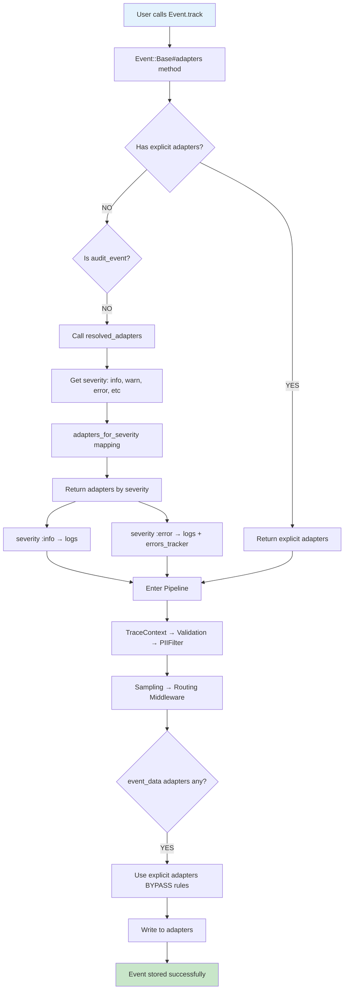

**Example:**
```ruby
class Events::UserLogin < E11y::Event::Base
  severity :info  # No audit_event, no explicit adapters
  schema { required(:user_id).filled(:integer) }
end

# Flow: severity :info → adapters_for_severity(:info) → [:logs]
# Result: Event written to :logs adapter
```

---

## Flow 2: Audit Event with Routing Rules

Audit event without explicit adapters uses routing rules. MUST match a rule!

```mermaid
flowchart TD
    A[Track audit event] --> B[Event::Base#adapters]
    B --> C{Has explicit adapters?}
    C -->|NO| D{Is audit_event?}
    D -->|YES| E[Return empty array]
    
    E --> F[Enter Pipeline]
    F --> G[Middleware processing]
    G --> H[Routing Middleware]
    
    H --> I{event_data adapters any?}
    I -->|NO empty array| J[apply_routing_rules]
    
    J --> K[Evaluate routing_rules]
    K --> L[Rule 1: if audit_event]
    L --> M{Matches?}
    M -->|YES| N[Set routing_used_fallback = false]
    N --> O[Return :audit_encrypted]
    
    O --> P[validate_audit_routing!]
    P --> Q{Has explicit adapters?}
    Q -->|NO| R{routing_used_fallback?}
    R -->|FALSE| S[Validation PASS - rule matched]
    
    S --> T[Write to :audit_encrypted]
    T --> U[Event encrypted and stored]
    
    style A fill:#fff9c4
    style U fill:#c8e6c9
    style S fill:#c8e6c9
```

**Example:**
```ruby
class Events::UserDeleted < E11y::Event::Base
  audit_event true  # No explicit adapters
  schema { required(:user_id).filled(:integer) }
end

E11y.configure do |config|
  config.routing_rules = [
    ->(e) { :audit_encrypted if e[:audit_event] }
  ]
end

# Flow: audit_event? YES → [] → routing rule matches → :audit_encrypted
```

---

## Flow 3: Audit Event with Explicit Adapters

Audit event with explicit adapters bypasses routing rules.

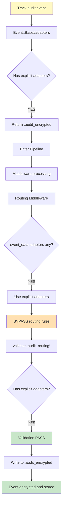

**Example:**
```ruby
class Events::UserDeleted < E11y::Event::Base
  audit_event true
  adapters :audit_encrypted  # Explicit!
  schema { required(:user_id).filled(:integer) }
end

# Flow: audit_event? YES, adapters set → [:audit_encrypted] → bypass rules
```

---

## Flow 4: Audit Event MISCONFIGURED - ERROR!

Audit event without routing - COMPLIANCE VIOLATION!

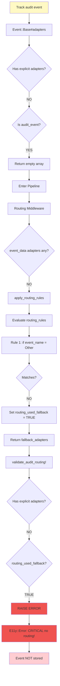

**Error message:**
```
CRITICAL: Audit event has no routing configuration!
Event: Events::UserDeleted
Routed to: [:stdout] (fallback adapters)

Fix options:
1. Add explicit adapters: adapters :audit_encrypted
2. Configure routing rule: config.routing_rules = [->(e) { :audit_encrypted if e[:audit_event] }]
```

---

## Flow 5: Multi-Adapter Routing

Event can go to MULTIPLE adapters simultaneously.

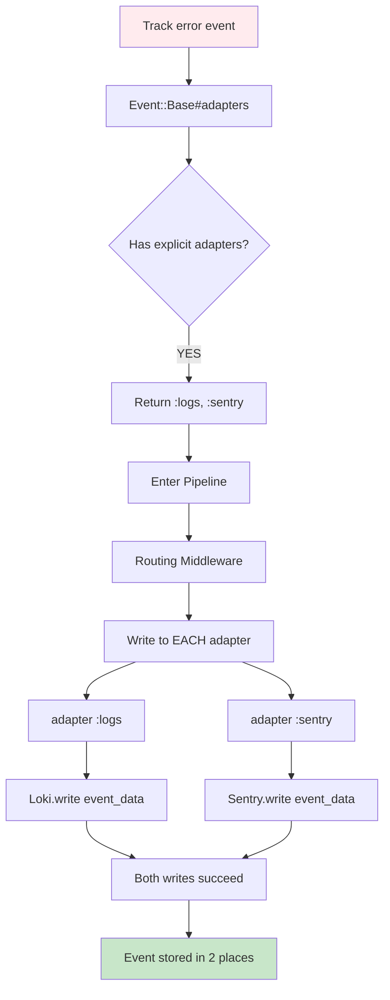

**Example:**
```ruby
class Events::CriticalError < E11y::Event::Base
  severity :error
  adapters :logs, :sentry  # Multiple!
  schema { required(:error).filled(:string) }
end

# Flow: explicit [:logs, :sentry] → writes to BOTH adapters
```

---

## Flow 6: Routing Rules Priority

Multiple rules evaluated in order, first match wins.

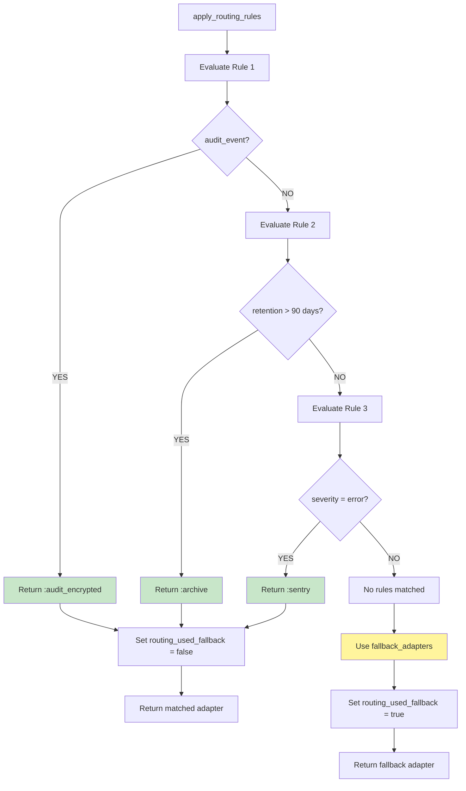

**Configuration:**
```ruby
E11y.configure do |config|
  config.routing_rules = [
    # Priority 1: Audit events
    ->(e) { :audit_encrypted if e[:audit_event] },
    
    # Priority 2: Long retention
    ->(e) {
      days = (Time.parse(e[:retention_until]) - Time.now) / 86400
      :archive if days > 90
    },
    
    # Priority 3: Errors
    ->(e) { :sentry if e[:severity] == :error }
  ]
end
```

---

## Flow 7: Complete Pipeline with Routing

Full picture from track() to adapter.write().

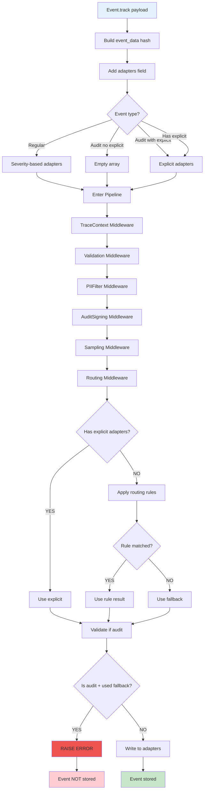

---

## Decision Matrix: What Happens to My Event?

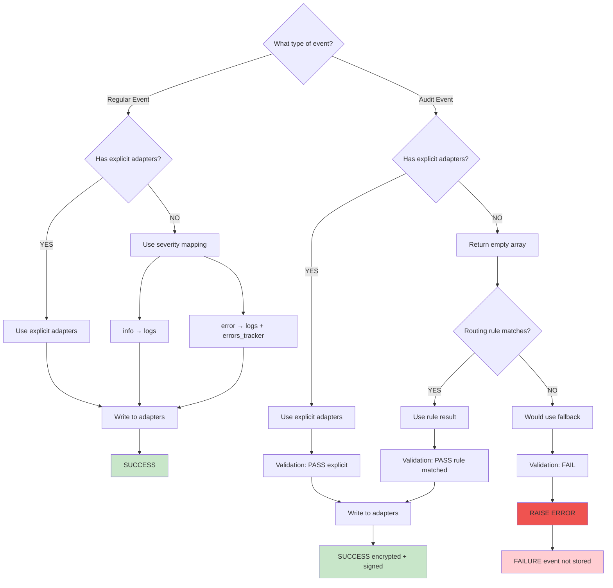

---

## Adapter Resolution Logic

How `Event::Base#adapters` method works.

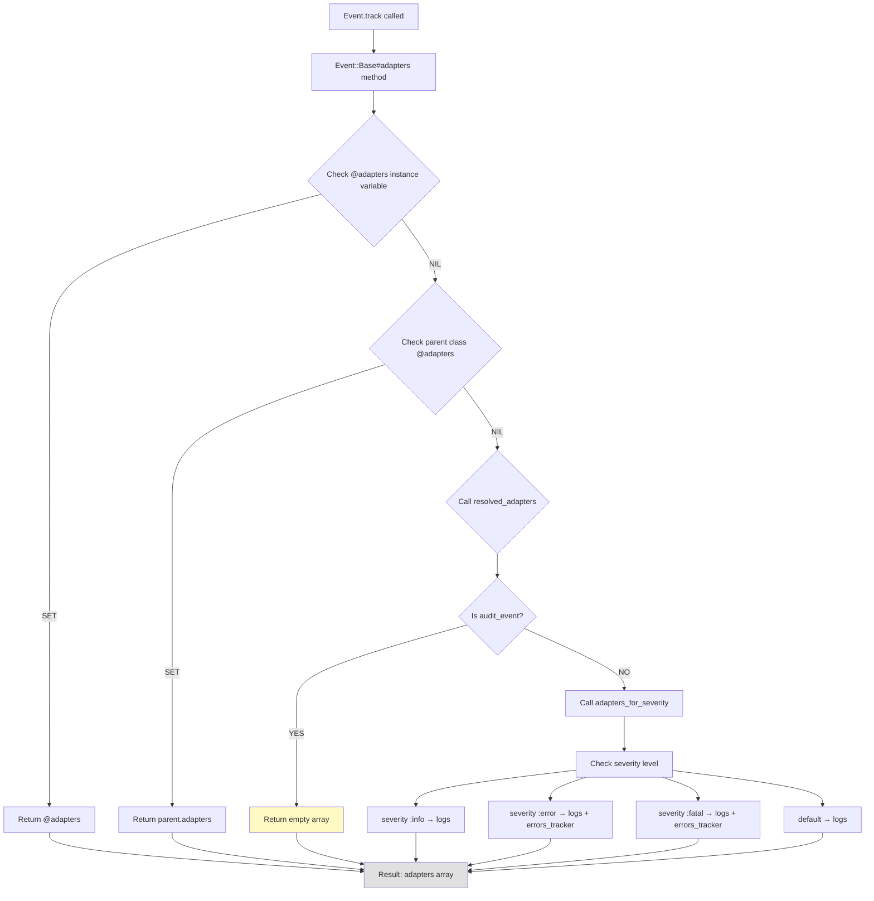

---

## Validation Flow for Audit Events

What happens in `validate_audit_routing!`.

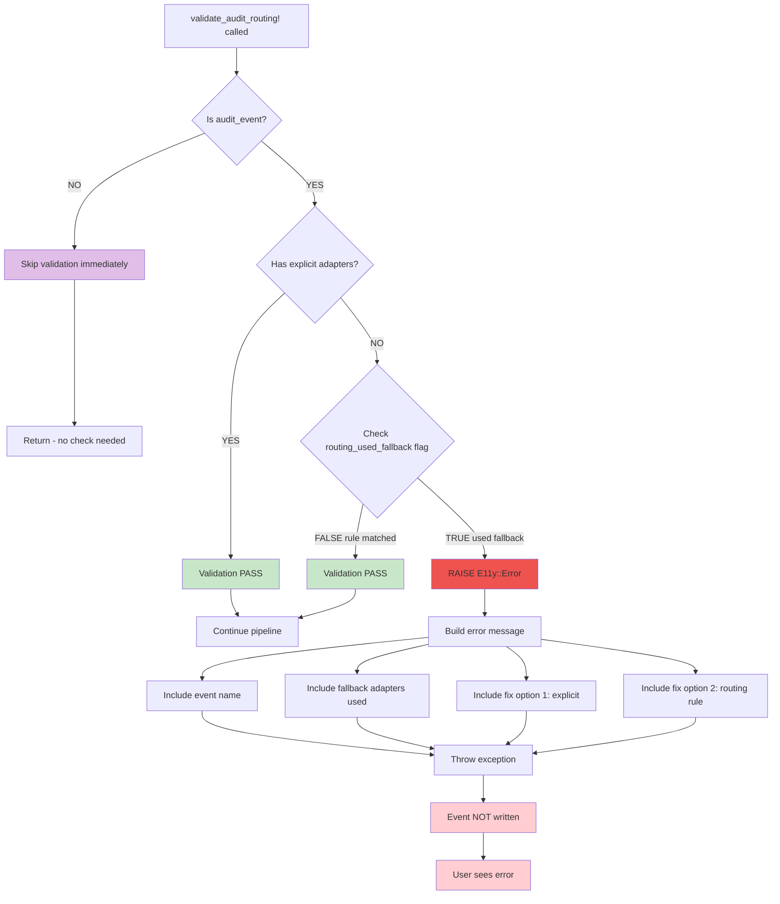

---

## Severity-Based Adapter Mapping

Default configuration for regular events.

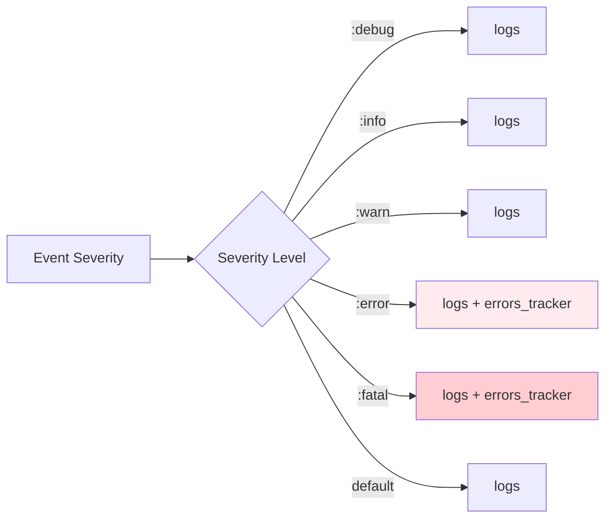

**Configuration:**
```ruby
# Default mapping (in E11y::Configuration)
{
  error: [:logs, :errors_tracker],
  fatal: [:logs, :errors_tracker],
  default: [:logs]
}
```

---

## Quick Reference Table

| Event Type | Explicit Adapters | Routing Rule | Result |
|------------|------------------|--------------|---------|
| Regular | ✅ YES | N/A | Use explicit |
| Regular | ❌ NO | ✅ Matches | Use rule result |
| Regular | ❌ NO | ❌ No match | Use fallback ✅ OK |
| Audit | ✅ YES | N/A | Use explicit |
| Audit | ❌ NO | ✅ Matches | Use rule result |
| Audit | ❌ NO | ❌ No match | ❌ ERROR! |

---

## Common Patterns

### Pattern 1: Simple Application Event

```ruby
class Events::UserLogin < E11y::Event::Base
  severity :info
  schema { required(:user_id).filled(:integer) }
end

# Flow: severity :info → [:logs] → Loki adapter
```

### Pattern 2: Error Event to Multiple Destinations

```ruby
class Events::PaymentFailed < E11y::Event::Base
  severity :error
  adapters :logs, :sentry  # Explicit multi-adapter
  schema { required(:order_id).filled(:integer) }
end

# Flow: explicit [:logs, :sentry] → both adapters
```

### Pattern 3: Audit Event via Rules

```ruby
class Events::UserDeleted < E11y::Event::Base
  audit_event true
  schema { required(:user_id).filled(:integer) }
end

# Config: routing_rules = [->(e) { :audit_encrypted if e[:audit_event] }]
# Flow: [] → rule matches → :audit_encrypted
```

### Pattern 4: High-Value Event with Long Retention

```ruby
class Events::OrderPlaced < E11y::Event::Base
  severity :info
  retention_period 7.years
  schema { required(:order_id).filled(:integer) }
end

# Config: routing_rules = [->(e) { 
#   days = (Time.parse(e[:retention_until]) - Time.now) / 86400
#   :archive if days > 365
# }]
# Flow: [] → retention rule matches → :archive
```

---

## Testing Your Routing

### Check Event Configuration

```ruby
# What adapters will this event use?
Events::UserLogin.adapters
# => [:logs]

Events::UserDeleted.adapters  # audit_event true
# => []

Events::PaymentFailed.adapters  # explicit
# => [:logs, :sentry]
```

### Test Routing Rule

```ruby
event_data = {
  event_name: "Events::UserDeleted",
  audit_event: true,
  severity: :info,
  retention_until: (Time.now + 7.years).iso8601
}

E11y.config.routing_rules.each do |rule|
  result = rule.call(event_data)
  puts "Rule result: #{result.inspect}"
end
```

### Verify in Tests

```ruby
RSpec.describe Events::UserDeleted do
  it "routes to audit_encrypted" do
    event = described_class.track(user_id: 123)
    expect(event[:routing][:adapters]).to eq([:audit_encrypted])
  end
end
```

---

## Troubleshooting

### "CRITICAL: Audit event has no routing configuration!"

**Problem:** Audit event doesn't match any routing rule.

**Solutions:**
1. Add explicit adapter: `adapters :audit_encrypted`
2. Add routing rule: `config.routing_rules = [->(e) { :audit_encrypted if e[:audit_event] }]`

### "Event not appearing in logs"

**Check:**
1. Is E11y enabled? `E11y.config.enabled`
2. What adapters configured? `E11y.config.adapters.keys`
3. What adapters will event use? `YourEvent.adapters`
4. Is sampling dropping it? Check sample_rate

### "Event going to wrong adapter"

**Debug:**
1. Check explicit adapters: `YourEvent.adapters`
2. Check routing rules: `E11y.config.routing_rules`
3. Check fallback: `E11y.config.fallback_adapters`
4. Check priority: explicit > rules > fallback

---

## Related Files

- **Fix Documentation:** `AUDIT-TRAIL-FIX.md`
- **Quick Reference:** `AUDIT-ROUTING-QUICK-REFERENCE.md`
- **Test Specs:** `spec/integration/audit*.rb`
- **Routing Middleware:** `lib/e11y/middleware/routing.rb`
- **Event Base:** `lib/e11y/event/base.rb`
