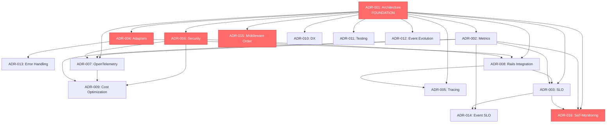

# E11y Gem: Initial System Overview
**Phase 1: Quick System Overview**  
**Date:** January 15, 2026  
**Status:** UC Analysis Complete (22/22)  
**Method:** SemanticSearch across all use cases

---

## 📊 Executive Summary

**Scope:** 22 use cases analyzed covering:
- 4 Core features (UC-001 to UC-004)
- 6 Integration patterns (UC-005 to UC-010)
- 2 Security & Compliance (UC-011, UC-012)
- 4 Performance & Scale (UC-013, UC-014, UC-015, UC-019)
- 6 Developer Experience (UC-016, UC-017, UC-018, UC-020, UC-021, UC-022)

**Key Findings:**
- 🔴 **7 Critical UCs** (MVP blockers, compliance, performance)
- 🟡 **10 Important UCs** (production-readiness, DX)
- 🟢 **5 Standard UCs** (enhancements, tooling)

**Identified Themes:**
1. **Buffering Architecture** - Dual-buffer (debug vs main), complex flush logic
2. **Sampling Strategy** - Adaptive, priority-based, cost-driven
3. **Security & Compliance** - PII filtering, audit trail, rate limiting
4. **Cost Optimization** - Sampling + compression + tiered storage + smart routing
5. **Integration Complexity** - OTel, Sentry, Rails, Sidekiq, multi-service tracing
6. **Developer Experience** - Rails migration, testing, versioning, registry

---

## 🎯 UC Priority Matrix

### 🔴 CRITICAL (7 UCs) - MVP Blockers / Compliance / Core Performance

| UC | Name | Complexity | Setup Time | Why Critical |
|----|------|-----------|-----------|--------------|
| **UC-001** | Request-Scoped Debug Buffering | Intermediate | 15-30min | **Killer feature:** Dual-buffer architecture, core differentiator |
| **UC-002** | Business Event Tracking | Beginner | 5-15min | **Foundation:** All other UCs depend on this |
| **UC-007** | PII Filtering | Intermediate | 15-60min | **Compliance:** GDPR blocker, must be in MVP |
| **UC-012** | Audit Trail | Advanced | 30-45min | **Compliance:** GDPR/SOX/HIPAA requirement |
| **UC-013** | High Cardinality Protection | Advanced | 1+ hour | **Production-killer:** Metric explosions crash monitoring |
| **UC-014** | Adaptive Sampling | Advanced | 45-60min | **Cost control:** Without this, costs explode |
| **UC-015** | Cost Optimization | Advanced | 1+ hour | **Economic viability:** 95% cost reduction claim |

**Reasoning:**
- UC-001: Core architecture decision (dual-buffer), affects all event flow
- UC-002: Base event system, everything builds on this
- UC-007: Legal requirement (GDPR fines), must work from day 1
- UC-012: Compliance requirement, cryptographic signing affects architecture
- UC-013: Production stability (cardinality explosions are real)
- UC-014: Makes or breaks economic model (sampling is cost control)
- UC-015: Composite of multiple strategies, validates cost claims

---

### 🟡 IMPORTANT (10 UCs) - Production-Ready / Integration / DX

| UC | Name | Complexity | Setup Time | Why Important |
|----|------|-----------|-----------|---------------|
| **UC-003** | Pattern-Based Metrics | Intermediate | 15-60min | Auto-metrics, reduces boilerplate |
| **UC-004** | Zero-Config SLO Tracking | Intermediate | 15-60min | Built-in SLO, differentiator |
| **UC-005** | Sentry Integration | Beginner | 5-15min | Error tracking integration |
| **UC-006** | Trace Context Management | Intermediate | 15-60min | Correlation foundation |
| **UC-008** | OpenTelemetry Integration | Advanced | 1+ hour | Industry standard, vendor-neutral |
| **UC-010** | Background Job Tracking | Intermediate | 15-60min | Sidekiq/ActiveJob (common in Rails) |
| **UC-011** | Rate Limiting | Intermediate | 15-60min | DoS protection |
| **UC-016** | Rails Logger Migration | Beginner | 5-15min | Adoption path (critical for DX) |
| **UC-020** | Event Versioning | Intermediate | 15-30min | Schema evolution (avoid breaking changes) |
| **UC-021** | Error Handling & DLQ | Intermediate | 15-30min | Reliability (retry + DLQ) |

**Reasoning:**
- UC-003, UC-004: Value-add features, but not blockers
- UC-005, UC-006, UC-008, UC-010: Integration points, production usage
- UC-011: Security (DoS protection)
- UC-016: DX (migration path affects adoption)
- UC-020, UC-021: Production reliability (versioning + error handling)

---

### 🟢 STANDARD (5 UCs) - Enhancements / Tooling

| UC | Name | Complexity | Setup Time | Why Standard |
|----|------|-----------|-----------|--------------|
| **UC-009** | Multi-Service Tracing | Advanced | 1+ hour | Nice-to-have (W3C context, distributed tracing) |
| **UC-017** | Local Development | Beginner | 5-15min | DX enhancement (not MVP blocker) |
| **UC-018** | Testing Events | Beginner | 5-15min | Testing helpers (nice-to-have) |
| **UC-019** | Tiered Storage | Advanced | 1+ hour | Cost optimization (post-MVP) |
| **UC-022** | Event Registry | Beginner | 5-15min | Introspection/discovery (tooling) |

**Reasoning:**
- UC-009: Advanced feature, not needed for single-service apps
- UC-017, UC-018: DX improvements, but workable without
- UC-019: Advanced cost optimization (post-MVP)
- UC-022: Tooling feature, not core functionality

---

## 🔍 Domain Grouping

### Core Engine (4 UCs)
**Dependencies:** None (foundational)  
**Complexity:** Low-Medium  
**UCs:** UC-001, UC-002, UC-003, UC-004

**Key Characteristics:**
- Dual-buffer architecture (UC-001)
- Event base class & schema (UC-002)
- Auto-metrics (UC-003)
- Built-in SLO (UC-004)

**Potential Contradictions:**
- Dual buffers vs single buffer (complexity vs functionality)
- Auto-metrics vs manual control (magic vs explicitness)

---

### Integration Layer (6 UCs)
**Dependencies:** Core Engine (UC-001, UC-002)  
**Complexity:** Medium-High  
**UCs:** UC-005, UC-006, UC-007, UC-008, UC-009, UC-010

**Key Characteristics:**
- Sentry (UC-005), OTel (UC-008), Sidekiq (UC-010)
- PII filtering (UC-007) - must run BEFORE adapters
- Trace context (UC-006) - correlation across systems
- Multi-service (UC-009) - W3C propagation

**Potential Contradictions:**
- PII filtering order (before/after signing?)
- OTel semantic conventions vs custom fields
- Trace context propagation (automatic vs manual)

---

### Security & Compliance (3 UCs)
**Dependencies:** Core Engine + Integration  
**Complexity:** High  
**UCs:** UC-007 (PII), UC-011 (Rate Limiting), UC-012 (Audit Trail)

**Key Characteristics:**
- GDPR/HIPAA/SOX compliance (UC-012)
- PII masking (UC-007)
- DoS protection (UC-011)
- Cryptographic signing (UC-012)

**Potential Contradictions:**
- PII filtering vs debugging (need data vs hide data)
- Audit trail immutability vs PII deletion (GDPR right to be forgotten)
- Rate limiting vs reliability (drop events vs guarantee delivery)

---

### Performance & Cost (4 UCs)
**Dependencies:** All layers  
**Complexity:** Very High  
**UCs:** UC-013, UC-014, UC-015, UC-019

**Key Characteristics:**
- Cardinality protection (UC-013) - prevent metric explosions
- Adaptive sampling (UC-014) - dynamic rates based on load/errors
- Cost optimization (UC-015) - compression + tiered storage + smart routing
- Tiered storage (UC-019) - hot/warm/cold data lifecycle

**Potential Contradictions:**
- Sampling vs reliability (cost vs completeness)
- Cardinality limits vs flexibility (protection vs functionality)
- Performance budget (<1ms) vs rich features (OTel + Sentry + metrics)

---

### Developer Experience (5 UCs)
**Dependencies:** Core Engine  
**Complexity:** Low-Medium  
**UCs:** UC-016, UC-017, UC-018, UC-020, UC-021, UC-022

**Key Characteristics:**
- Rails.logger migration path (UC-016)
- Dev/prod environment differences (UC-017)
- Testing helpers & RSpec matchers (UC-018)
- Event versioning & schema evolution (UC-020)
- Retry policy + DLQ (UC-021)
- Event introspection (UC-022)

**Potential Contradictions:**
- Rails.logger coexistence vs replacement
- Dev mode (no buffering/sampling) vs prod mode (all optimizations)
- Explicit versioning vs implicit backward compatibility

---

## ⚠️ Initial Contradictions Hypothesis (10 Found)

### 1. **Configuration Complexity** [HIGHEST PRIORITY]
**Conflict:** Need comprehensive functionality (22 UCs) BUT configuration is overwhelming (1400+ lines)  
**Impact:** 🔴 Critical - affects adoption  
**Evidence:** COMPREHENSIVE-CONFIGURATION.md shows 1400+ lines for full setup  
**Related UCs:** ALL (configuration affects every UC)  
**TRIZ Angle:** Can we use event-level config + inheritance instead of centralized config?

---

### 2. **Dual-Buffer Architecture**
**Conflict:** Need to buffer debug events (UC-001) BUT also buffer all events (performance)  
**Impact:** 🔴 Critical - core architecture  
**Evidence:** UC-001 describes separate thread-local debug buffer + main buffer  
**Related UCs:** UC-001, UC-021 (error handling), UC-014 (sampling)  
**Questions:**
- Are two buffers necessary or can we unify with smart routing?
- What's the performance overhead of dual buffers?
- How do they interact during error conditions?

---

### 3. **Sampling vs Reliability**
**Conflict:** Need to sample (UC-014, cost control) BUT must not lose critical events  
**Impact:** 🔴 Critical - data loss risk  
**Evidence:** UC-014 adaptive sampling, UC-021 DLQ for failures  
**Related UCs:** UC-014, UC-015, UC-012 (audit never sampled), UC-007 (errors never sampled)  
**Questions:**
- How are "never sample" rules enforced?
- What happens when adaptive sampling conflicts with "always track" rules?
- Can sampling rules accidentally drop compliance events?

---

### 4. **PII Filtering vs Debugging**
**Conflict:** Need to filter PII (UC-007, GDPR) BUT need data for debugging  
**Impact:** 🟡 Important - compliance vs functionality  
**Evidence:** UC-007 PII filtering, UC-001 debug buffering  
**Related UCs:** UC-007, UC-001, UC-012 (audit trail)  
**Questions:**
- When does PII filtering happen? (before/after debug buffer flush?)
- Can debug context contain PII? How to balance compliance and debuggability?
- What about audit trail signing vs PII deletion? (immutability vs GDPR right to be forgotten)

---

### 5. **Performance Budget vs Rich Features**
**Conflict:** Need rich features (OTel, Sentry, metrics) BUT must minimize overhead (<1ms per event)  
**Impact:** 🔴 Critical - production viability  
**Evidence:** Multiple integration UCs (UC-005, UC-008, UC-003, UC-004)  
**Related UCs:** UC-003, UC-004, UC-005, UC-006, UC-008  
**Questions:**
- Is <1ms realistic with OTel + Sentry + auto-metrics + trace propagation?
- Where are bottlenecks? (schema validation, adapter calls, buffer writes?)
- Can we meet budget in worst case (all features enabled)?

---

### 6. **Multi-Adapter Execution**
**Conflict:** Need to send to multiple adapters (redundancy) BUT one slow adapter blocks all  
**Impact:** 🟡 Important - reliability vs performance  
**Evidence:** UC-015 mentions smart routing, UC-021 mentions adapter fallback chains  
**Related UCs:** UC-015, UC-021  
**Questions:**
- Are adapters called sequentially or in parallel?
- What happens when one adapter is slow (timeout? skip? retry?)?
- How does circuit breaker work with multiple adapters?

---

### 7. **Cardinality Limits vs Flexibility**
**Conflict:** Need to protect against cardinality explosions (UC-013) BUT need flexible labels  
**Impact:** 🟡 Important - observability vs safety  
**Evidence:** UC-013 high cardinality protection  
**Related UCs:** UC-013, UC-003 (auto-metrics)  
**Questions:**
- How are cardinality limits enforced? (hard reject vs drop labels?)
- Can limits be too strict and lose important dimensions?
- How to balance protection with use cases like user-scoped metrics?

---

### 8. **Audit Trail Immutability vs GDPR Right to be Forgotten**
**Conflict:** Audit trail must be immutable (UC-012) BUT GDPR requires data deletion  
**Impact:** 🟡 Important - legal compliance paradox  
**Evidence:** UC-012 mentions cryptographic signing + immutability, UC-007 mentions GDPR  
**Related UCs:** UC-012, UC-007  
**Questions:**
- How to reconcile immutable audit logs with GDPR deletion requests?
- Can we pseudonymize instead of delete?
- What's the retention policy for audit vs regular events?

---

### 9. **Dev vs Prod Configuration Drift**
**Conflict:** Dev needs immediate flush (UC-017) BUT prod needs batching (performance)  
**Impact:** 🟢 Standard - DX issue  
**Evidence:** UC-017 explicitly shows different config for dev vs prod  
**Related UCs:** UC-017, UC-018  
**Questions:**
- How to prevent config drift causing prod incidents?
- Can we auto-detect environment and apply smart defaults?
- How to test prod behavior in dev? (staging mode?)

---

### 10. **Event Versioning Backward Compatibility**
**Conflict:** Need to evolve schemas (UC-020) BUT must not break consumers  
**Impact:** 🟡 Important - breaking changes risk  
**Evidence:** UC-020 event versioning  
**Related UCs:** UC-020, UC-022 (registry)  
**Questions:**
- How long must old versions be supported?
- Can we auto-migrate events? (v1 → v2 transformation)
- What's the deprecation policy?

---

## 📈 Complexity Distribution

**By Complexity Level:**
- **Beginner (5-15min):** 5 UCs (UC-002, UC-005, UC-016, UC-017, UC-018, UC-022)
- **Intermediate (15-60min):** 10 UCs (UC-001, UC-003, UC-004, UC-006, UC-007, UC-010, UC-011, UC-020, UC-021)
- **Advanced (1+ hour):** 7 UCs (UC-008, UC-009, UC-012, UC-013, UC-014, UC-015, UC-019)

**Average Setup Time:** ~35 minutes per UC  
**Total Setup Time (all 22):** ~13 hours (assuming sequential setup)

**Critical Path (7 critical UCs):** ~6.5 hours setup time

---

## 🔗 Dependency Analysis (High-Level)

```mermaid
graph TD
    UC002[UC-002: Business Events<br/>FOUNDATION] --> UC001[UC-001: Debug Buffering]
    UC002 --> UC003[UC-003: Auto Metrics]
    UC002 --> UC004[UC-004: SLO Tracking]
    
    UC001 --> UC007[UC-007: PII Filtering]
    UC002 --> UC007
    
    UC002 --> UC005[UC-005: Sentry]
    UC002 --> UC006[UC-006: Trace Context]
    UC002 --> UC008[UC-008: OpenTelemetry]
    
    UC006 --> UC009[UC-009: Multi-Service]
    UC002 --> UC010[UC-010: Background Jobs]
    
    UC007 --> UC012[UC-012: Audit Trail]
    UC002 --> UC011[UC-011: Rate Limiting]
    
    UC003 --> UC013[UC-013: Cardinality Protection]
    UC002 --> UC014[UC-014: Adaptive Sampling]
    
    UC014 --> UC015[UC-015: Cost Optimization]
    UC013 --> UC015
    
    UC002 --> UC016[UC-016: Rails Migration]
    UC002 --> UC017[UC-017: Dev Experience]
    UC002 --> UC018[UC-018: Testing]
    UC002 --> UC020[UC-020: Versioning]
    UC002 --> UC021[UC-021: Error Handling]
    UC002 --> UC022[UC-022: Event Registry]
    
    UC015 --> UC019[UC-019: Tiered Storage]
    
    style UC002 fill:#ff6b6b,stroke:#c92a2a,color:#fff
    style UC001 fill:#ff6b6b,stroke:#c92a2a,color:#fff
    style UC007 fill:#ff6b6b,stroke:#c92a2a,color:#fff
    style UC012 fill:#ff6b6b,stroke:#c92a2a,color:#fff
    style UC013 fill:#ff6b6b,stroke:#c92a2a,color:#fff
    style UC014 fill:#ff6b6b,stroke:#c92a2a,color:#fff
    style UC015 fill:#ff6b6b,stroke:#c92a2a,color:#fff
```



**Key Observations:**
- **UC-002 is the foundation** - all UCs depend on it
- **UC-001 (Debug Buffering)** is architecturally significant (dual-buffer design)
- **UC-007 (PII Filtering)** has complex ordering requirements (before adapters, after buffering?)
- **UC-015 (Cost Optimization)** is composite (depends on UC-013, UC-014, and others)

---

## 📋 Next Steps

### Immediate (Phase 1 - Remaining Tasks):
1. ✅ **DONE:** Semantic search across UCs (this document)
2. ⏳ **NEXT:** Semantic search across ADRs (FEAT-4566)
3. ⏳ **THEN:** Create final system map + prioritization (FEAT-4567)

### After Phase 1 Approval:
4. **Phase 2:** Deep dive into 10-12 critical documents (read full content, create summaries)
5. **Phase 3:** Batch processing remaining 26 documents
6. **Phase 4:** Consolidation into master catalog

---

## 🎯 Key Themes Identified

### 1. **Buffering Strategy**
- Dual-buffer architecture (debug vs main)
- Thread-local storage for debug events
- Flush triggers (error, time, size)
- Backpressure handling

### 2. **Sampling Logic**
- Adaptive (load-based, error-spike)
- Priority-based (never sample errors, always sample audit)
- Cost-driven (90% reduction claims)
- Trace-consistent sampling

### 3. **Security & Compliance**
- PII filtering (before adapter? after buffer?)
- Cryptographic signing (audit trail)
- GDPR/HIPAA/SOX requirements
- Rate limiting (DoS protection)

### 4. **Cost Optimization**
- Sampling (90% reduction)
- Compression (70% smaller payloads)
- Tiered storage (60% cheaper)
- Smart routing (50% fewer expensive destinations)
- **Combined claim: 95% cost reduction**

### 5. **Integration Complexity**
- OTel (semantic conventions, OTLP export)
- Sentry (breadcrumbs, fingerprinting)
- Rails (logger coexistence, ActiveSupport::Notifications)
- Sidekiq/ActiveJob (lifecycle events)
- Multi-service (W3C context propagation)

### 6. **Developer Experience**
- Rails.logger migration path
- Environment-specific config (dev vs prod)
- Testing helpers (RSpec matchers, event capture)
- Event versioning (backward compatibility)
- Event registry (introspection)

---

## 📊 Statistics

**Total Use Cases:** 22  
**Critical:** 7 (32%)  
**Important:** 10 (45%)  
**Standard:** 5 (23%)

**By Role:**
- **Ruby/Rails Developers:** 12 UCs (55%)
- **DevOps/SRE:** 8 UCs (36%)
- **Security/Compliance:** 3 UCs (14%)
- **Engineering Managers:** 4 UCs (18%)

**By Domain:**
- **Core Engine:** 4 UCs (18%)
- **Integration:** 6 UCs (27%)
- **Security & Compliance:** 3 UCs (14%)
- **Performance & Cost:** 4 UCs (18%)
- **Developer Experience:** 5 UCs (23%)

---

## 📐 ADR Analysis (16 Architectural Decision Records)

### 🎯 ADR Priority Matrix

#### 🔴 CRITICAL (6 ADRs) - Core Architecture / Foundation

| ADR | Name | Depends On | Why Critical |
|-----|------|-----------|--------------|
| **ADR-001** | Architecture & Implementation | None | **Foundation:** Dual-buffer, ring buffer, pipeline, thread safety |
| **ADR-004** | Adapter Architecture | ADR-001 | **Integration layer:** All adapters depend on this |
| **ADR-006** | Security & Compliance | ADR-001, ADR-004 | **Compliance:** PII filtering, GDPR, audit trail signing |
| **ADR-015** | Middleware Order | ADR-001 | **Critical path:** PII → Sampling → Cardinality → Adapters (order matters!) |
| **ADR-001 (C20)** | Adaptive Buffer with Memory Limits | ADR-001 | **Production safety:** Prevents OOM, backpressure handling |
| **ADR-016** | Self-Monitoring & SLO | ADR-001, ADR-002, ADR-003 | **Observability of observability:** E11y must monitor itself |

**Reasoning:**
- ADR-001: Core architecture, all ADRs depend on this (dual-buffer, ring buffer, pipeline)
- ADR-004: Adapter abstraction layer, required for UC-005 through UC-010
- ADR-006: Legal compliance (GDPR/HIPAA/SOX), blocking for production
- ADR-015: Middleware order is critical (wrong order = PII leaks or sampling errors)
- ADR-001 (C20): Memory safety (prevents OOM crashes in production)
- ADR-016: Self-monitoring (E11y must not fail silently)

---

#### 🟡 IMPORTANT (8 ADRs) - Production Features / Integration

| ADR | Name | Depends On | Why Important |
|-----|------|-----------|---------------|
| **ADR-002** | Metrics & Yabeda | ADR-001 | Auto-metrics, cardinality protection (4-layer defense) |
| **ADR-003** | SLO & Observability | ADR-001, ADR-008, ADR-002 | Zero-config SLO, burn rate alerts |
| **ADR-005** | Tracing & Context | ADR-001, ADR-008 | Trace propagation, W3C context, background job tracing |
| **ADR-007** | OpenTelemetry Integration | ADR-001, ADR-002, ADR-006 | Industry standard, vendor-neutral |
| **ADR-008** | Rails Integration | ADR-001, ADR-004, ADR-006 | Railtie, ActiveSupport::Notifications, Sidekiq |
| **ADR-009** | Cost Optimization | ADR-002, ADR-006, ADR-007 | Compression, tiered storage, smart routing |
| **ADR-013** | Reliability & Error Handling | ADR-001, ADR-004 | Retry policy, DLQ, circuit breaker, adapter fallback |
| **ADR-014** | Event-Driven SLO | ADR-002, ADR-003 | Business event SLO (e.g., payment success rate) |

**Reasoning:**
- ADR-002: Auto-metrics + cardinality protection (production safety)
- ADR-003: SLO tracking (observability foundation)
- ADR-005: Trace context (correlation across requests/services)
- ADR-007: OTel integration (ecosystem compatibility)
- ADR-008: Rails integration (DX, adoption)
- ADR-009: Cost optimization (economic viability)
- ADR-013: Error handling (reliability)
- ADR-014: Event-based SLO (business metrics)

---

#### 🟢 STANDARD (2 ADRs) - DX / Tooling

| ADR | Name | Depends On | Why Standard |
|-----|------|-----------|--------------|
| **ADR-010** | Developer Experience | ADR-001, ADR-008 | Web UI, console adapter, event registry (tooling) |
| **ADR-011** | Testing Strategy | ADR-001 | Testing helpers, RSpec matchers (DX enhancement) |
| **ADR-012** | Event Evolution | ADR-001 | Versioning, schema migration (post-MVP) |

**Reasoning:**
- ADR-010: Developer tooling (nice-to-have, not MVP blocker)
- ADR-011: Testing strategy (improves DX, not core functionality)
- ADR-012: Event versioning (important for long-term, not initial launch)

---

### 📊 ADR Dependency Graph



**Key Observations:**
- **ADR-001 is the root** - all ADRs directly or indirectly depend on it
- **ADR-004 (Adapters)** is the integration layer - most external integrations go through this
- **ADR-006 (Security)** affects multiple layers (OTel baggage, cost optimization routing)
- **ADR-008 (Rails)** is a major integration point (Railtie, Sidekiq, ActiveSupport::Notifications)
- **ADR-015 (Middleware Order)** is critical but has minimal dependencies (just ADR-001)

---

### 🔍 ADR Domain Grouping

#### Core Architecture (3 ADRs)
**ADRs:** ADR-001, ADR-015, ADR-016  
**Complexity:** Very High  
**Dependencies:** None (ADR-001), ADR-001 (ADR-015, ADR-016)

**Key Decisions:**
- **Dual-buffer architecture** (debug vs main) - ADR-001
- **Ring buffer with adaptive memory** (C20 resolution) - ADR-001
- **Zero-allocation event tracking** - ADR-001
- **Middleware execution order** (PII → Sampling → Cardinality → Adapters) - ADR-015
- **Self-monitoring with <1% overhead** - ADR-016

**Trade-offs:**
- Dual buffers: Complexity vs functionality
- Lock-free ring buffer: Performance vs memory safety
- Middleware order: Explicit ordering vs flexibility

---

#### Integration Layer (4 ADRs)
**ADRs:** ADR-004, ADR-007, ADR-008, ADR-013  
**Complexity:** High  
**Dependencies:** ADR-001, ADR-002, ADR-006

**Key Decisions:**
- **Adapter interface** (sync, batching, circuit breaker) - ADR-004
- **Global adapter registry** (configure once, reuse) - ADR-004
- **OTel semantic conventions** (resource attributes, OTLP export) - ADR-007
- **Rails Railtie** (auto-initialization, ActiveSupport::Notifications) - ADR-008
- **Retry policy** (exponential backoff, DLQ, fallback chains) - ADR-013

**Trade-offs:**
- Adapter sync interface: Simplicity vs async complexity
- OTel dual collection: Convenience vs performance overhead (C03 conflict)
- Rails.logger coexistence: Compatibility vs double logging (C12 conflict)
- Retry rate limiting: Reliability vs retry storms (C06 conflict)

---

#### Observability & Metrics (4 ADRs)
**ADRs:** ADR-002, ADR-003, ADR-014, ADR-016  
**Complexity:** High  
**Dependencies:** ADR-001, ADR-008

**Key Decisions:**
- **Pattern-based metrics** (auto-create from events) - ADR-002
- **4-layer cardinality protection** (denylist, allowlist, per-metric limits, dynamic actions) - ADR-002
- **Per-endpoint SLO** (not app-wide) - ADR-003
- **Multi-window burn rate alerts** (5min detection) - ADR-003
- **Event-based SLO** (business metrics like payment success rate) - ADR-014
- **Performance budget** (<1ms p99, <100MB memory) - ADR-016

**Trade-offs:**
- Auto-metrics: Magic vs explicit control
- Per-endpoint SLO: Granularity vs configuration complexity
- Cardinality limits: Protection vs flexibility
- Sampling correction for SLO: Accuracy vs implementation complexity (C11 conflict)

---

#### Security & Compliance (1 ADR)
**ADRs:** ADR-006  
**Complexity:** Very High  
**Dependencies:** ADR-001, ADR-004

**Key Decisions:**
- **PII filtering order** (after enrichment, before audit signing) - ADR-006
- **Cryptographic signing** (HMAC-SHA256 for audit trail) - ADR-006
- **Rate limiting** (per-event, per-context, global limits) - ADR-006
- **Circuit breaker** (per-adapter, failover) - ADR-006
- **Baggage PII protection** (OTel baggage must be filtered) - ADR-006 (C08 resolution)

**Trade-offs:**
- PII filtering vs audit trail signing: Immutability vs GDPR right to be forgotten (C01 conflict)
- PII filtering order: Before vs after debug buffer flush (affects what gets filtered)
- Audit trail immutability: Compliance vs data deletion requests

---

#### Cost & Performance (1 ADR)
**ADRs:** ADR-009  
**Complexity:** Very High  
**Dependencies:** ADR-002, ADR-006, ADR-007

**Key Decisions:**
- **Intelligent sampling** (adaptive, trace-consistent) - ADR-009
- **Compression** (Zstd for batches >100 events) - ADR-009
- **Tiered storage** (hot/warm/cold based on retention tags) - ADR-009
- **Smart routing** (errors → Datadog, info → Loki) - ADR-009
- **Combined claim:** 95% cost reduction (90% sampling + 70% compression + 60% tiered storage + 50% smart routing)

**Trade-offs:**
- Trace-consistent sampling vs per-event sampling: Correctness vs flexibility (C05 conflict)
- Stratified sampling: SLO accuracy vs implementation complexity (C11 conflict)
- Compression: CPU overhead vs network/storage savings

---

#### Context & Tracing (1 ADR)
**ADRs:** ADR-005  
**Complexity:** High  
**Dependencies:** ADR-001, ADR-008

**Key Decisions:**
- **Thread-local storage** (Current) for request-scoped context
- **W3C Trace Context** (traceparent, tracestate headers) - ADR-005
- **Background job tracing** (hybrid model: new trace + parent link) - ADR-005 (C17 resolution)
- **Trace ID generation** (SecureRandom.uuid)
- **Sampling decisions propagation** (trace-consistent sampling)

**Trade-offs:**
- Background job tracing: Continue trace vs new trace + link (unbounded trace problem, C17)
- Thread-local storage: Simple vs multi-threaded code
- W3C context: Standard vs implementation complexity

---

#### Developer Experience (3 ADRs)
**ADRs:** ADR-010, ADR-011, ADR-012  
**Complexity:** Medium  
**Dependencies:** ADR-001, ADR-008

**Key Decisions:**
- **Web UI** (file-based JSONL, near-realtime 3s refresh) - ADR-010
- **Console adapter** (colorized output) - ADR-010
- **Event registry** (introspection, auto-generated docs) - ADR-010
- **Memory adapter** (for testing, not dev!) - ADR-011
- **RSpec matchers** (have_tracked_event, have_flushed_events) - ADR-011
- **Event versioning** (explicit version numbers, coexistence) - ADR-012

**Trade-offs:**
- Web UI storage: File-based vs in-memory vs Redis vs database (C10 conflict: multi-process vs performance)
- Test environment config: Disable all features vs realistic testing (C13 conflict)
- Event versioning: Explicit versioning vs implicit backward compatibility

---

### ⚠️ Cross-ADR Conflicts & Dependencies (Identified from SemanticSearch)

#### 1. **C01: PII Filtering vs Audit Trail Signing (Order Conflict)**
**ADRs Affected:** ADR-006 (Security), ADR-015 (Middleware Order)  
**Impact:** 🔴 Critical - Wrong order = PII leaks into signed audit logs  
**Conflict:** Audit trail must be immutable (cryptographic signing) BUT GDPR requires PII deletion  
**Resolution (from CONFLICT-ANALYSIS.md):** Audit events use separate pipeline: PII filtering BEFORE signing, but audit events exempt from PII filtering for sensitive fields. Need ADR-017 (Audit Event Pipeline Separation).

---

#### 2. **C02: Middleware Execution Order (Multiple Conflicts)**
**ADRs Affected:** ADR-015 (primary), ADR-006 (PII), ADR-002 (Sampling), ADR-002 (Cardinality)  
**Impact:** 🔴 Critical - Order determines what gets filtered/sampled/protected  
**Current Order:** PII Filtering → Sampling → Cardinality Protection → Adapters  
**Question:** Is this order correct for all cases? (e.g., should sampling happen before PII filtering to reduce overhead?)

---

#### 3. **C03: Dual Metrics Collection (Yabeda + OTel) Overhead**
**ADRs Affected:** ADR-002 (Yabeda primary), ADR-007 (OTel optional)  
**Impact:** 🟡 Important - Performance overhead if both enabled  
**Resolution:** Yabeda is default, OTel metrics are optional. Choose ONE backend to avoid 2× overhead. ADR-002 NOTE clearly states this.

---

#### 4. **C05: Trace-Consistent Sampling**
**ADRs Affected:** ADR-009 (Cost), ADR-005 (Tracing)  
**Impact:** 🟡 Important - Per-event sampling breaks distributed traces  
**Resolution:** TraceAwareSampler with decision cache. Sample decision propagated in trace context.

---

#### 5. **C06: Retry Rate Limiting (Retry Storms)**
**ADRs Affected:** ADR-013 (Error Handling), ADR-006 (Rate Limiting)  
**Impact:** 🟡 Important - Retry policy can overwhelm rate limiter  
**Resolution:** Retry attempts count against rate limit. DLQ for rate-limited events.

---

#### 6. **C08: OpenTelemetry Baggage PII Protection**
**ADRs Affected:** ADR-007 (OTel), ADR-006 (PII Filtering)  
**Impact:** 🔴 Critical - Baggage propagates PII across services!  
**Resolution:** BaggageProtection middleware (filters baggage before propagation). Need to update ADR-006.

---

#### 7. **C10: Web UI Multi-Process Storage (Dev)**
**ADRs Affected:** ADR-010 (DX)  
**Impact:** 🟢 Standard - In-memory doesn't work with Puma/Unicorn  
**Resolution:** File-based JSONL storage (multi-process safe). 50ms read latency acceptable for dev.

---

#### 8. **C11: Stratified Sampling for SLO Accuracy**
**ADRs Affected:** ADR-009 (Cost), ADR-003 (SLO)  
**Impact:** 🟡 Important - Sampling skews SLO calculations (underestimates errors)  
**Resolution:** StratifiedAdaptiveSampler (stratified by severity + pattern). Sampling correction factor for SLO. Need to update ADR-009 and UC-004.

---

#### 9. **C12: Rails.logger Double Logging**
**ADRs Affected:** ADR-008 (Rails Integration), UC-016 (Migration)  
**Impact:** 🟡 Important - Same event logged twice (Rails.logger + E11y event)  
**Resolution:** DeduplicationFilter middleware. Rails LogSubscriber captures Rails.logger, so explicit E11y.track is redundant during migration. Need migration guide.

---

#### 10. **C13: Test Environment Configuration (Disable All Features?)**
**ADRs Affected:** ADR-011 (Testing), UC-018 (Testing Events)  
**Impact:** 🟢 Standard - Disabling features makes tests unrealistic  
**Resolution:** Memory adapter for tests (synchronous, no external dependencies). Don't disable buffering/sampling/PII - test real behavior. Need to update UC-018.

---

#### 11. **C15: Event Schema Migration (DLQ Replay)**
**ADRs Affected:** ADR-012 (Event Evolution), ADR-013 (DLQ)  
**Impact:** 🟡 Important - DLQ replay fails if schema changed  
**Resolution:** SchemaMigrationRegistry (auto-migrate v1 → v2). DLQ stores schema version. Need to update ADR-012.

---

#### 12. **C17: Background Job Tracing (Unbounded Traces)**
**ADRs Affected:** ADR-005 (Tracing), ADR-008 (Rails Integration)  
**Impact:** 🟡 Important - Long-running jobs create massive traces  
**Resolution:** Hybrid model (new trace + parent link). SidekiqTraceMiddleware creates new trace_id but preserves parent_trace_id. Already documented in ADR-005 Section 8.3.

---

#### 13. **C20: Adaptive Buffer Memory Limits (OOM Prevention)**
**ADRs Affected:** ADR-001 (Architecture)  
**Impact:** 🔴 Critical - Ring buffer unbounded = OOM crash  
**Resolution:** Adaptive buffer with memory limits (hard limit, soft limit, backpressure). Already documented in ADR-001 Section 3.3.2.

---

#### 14. **C21: Configuration Profiles (Dev vs Prod Drift)**
**ADRs Affected:** ADR-010 (DX), UC-017 (Local Development)  
**Impact:** 🟡 Important - Dev/prod config differences cause incidents  
**Resolution:** Configuration profiles (development, test, production, staging). Smart defaults based on Rails.env. Need to update ADR-010 and create config decision tree.

---

### 📋 ADR Implementation Complexity

**By Complexity Level:**
- **Very High (5 ADRs):** ADR-001, ADR-006, ADR-009, ADR-016 (Core + Security + Cost + Self-monitoring)
- **High (8 ADRs):** ADR-002, ADR-003, ADR-004, ADR-005, ADR-007, ADR-008, ADR-013, ADR-014
- **Medium (3 ADRs):** ADR-010, ADR-011, ADR-012 (DX + Testing + Versioning)

**Average Implementation Time:** ~3-4 weeks per ADR (based on ADR-004 estimate: 2 weeks)  
**Total Implementation Time (all 16):** ~12-16 months (if sequential)

**Critical Path (6 critical ADRs):** ~24-32 weeks (~6-8 months)

---

### 🎯 Key Architectural Patterns Identified

#### 1. **Performance Budget: <1ms p99 @ 1000 events/sec**
**Where:** ADR-001, ADR-016  
**Impact:** All design decisions must meet this budget  
**Questions:**
- Is this realistic with OTel + Sentry + Yabeda + PII filtering + sampling + cardinality protection?
- Where will bottlenecks be? (Schema validation, adapter calls, middleware chain?)

---

#### 2. **Dual-Buffer Architecture (Debug vs Main)**
**Where:** ADR-001, UC-001  
**Rationale:** Debug events buffered per-request (thread-local), main events buffered globally (ring buffer)  
**Trade-off:** Complexity vs functionality (zero noise debug logs)  
**Questions:**
- Are two buffers necessary or can we unify with smart routing?
- What's the performance overhead of dual buffers?
- How do they interact during errors? (flush both? only debug?)

---

#### 3. **Middleware Pipeline (Order Matters!)**
**Where:** ADR-015  
**Order:** PII Filtering → Sampling → Cardinality Protection → Adapters  
**Critical:** Wrong order = PII leaks or sampling errors  
**Questions:**
- Should sampling happen before PII filtering? (reduce overhead)
- What about enrichment? (before or after PII filtering?)
- How to handle middleware conflicts? (e.g., C01, C02, C07, C12, C19)

---

#### 4. **4-Layer Cardinality Protection**
**Where:** ADR-002  
**Layers:**
1. Universal denylist (user_id, email, ip_address - NEVER as labels)
2. Safe allowlist (only allowed labels get through)
3. Per-metric limits (max 100 unique label values)
4. Dynamic actions (aggregate, drop, sample when limit exceeded)

**Trade-off:** Protection vs flexibility  
**Questions:**
- Are denylist rules too strict? (may block legitimate use cases)
- How to debug when labels are dropped?

---

#### 5. **Trace-Consistent Sampling (C05)**
**Where:** ADR-009, ADR-005  
**Problem:** Per-event sampling breaks distributed traces (some spans missing)  
**Solution:** TraceAwareSampler with decision cache (sample decision propagated in trace context)  
**Trade-off:** Correctness vs flexibility

---

#### 6. **Stratified Adaptive Sampling (C11)**
**Where:** ADR-009, ADR-003  
**Problem:** Sampling skews SLO (underestimates errors if errors are sampled)  
**Solution:** Stratified sampling by severity + pattern. Sampling correction factor for SLO calculations.  
**Trade-off:** SLO accuracy vs implementation complexity

---

#### 7. **Hybrid Background Job Tracing (C17)**
**Where:** ADR-005 Section 8.3  
**Problem:** Continuing trace from request to job creates unbounded traces (job runs for hours/days)  
**Solution:** Hybrid model - new trace_id + parent_trace_id link. Query both to see full flow.  
**Trade-off:** Trace continuity vs trace size

---

#### 8. **Global Adapter Registry (Configure Once, Reuse)**
**Where:** ADR-004  
**Rationale:** Avoid duplication, enable connection pooling  
**Trade-off:** DRY vs per-event flexibility  
**Questions:**
- Can events override adapters? (yes, but config-heavy)
- How to handle adapter failures? (circuit breaker, fallback chains)

---

#### 9. **Self-Monitoring with <1% Overhead**
**Where:** ADR-016  
**Principle:** E11y self-monitoring must be lightweight (otherwise monitoring-of-monitoring spiral)  
**Metrics:** Internal latency, throughput, buffer usage, adapter failures  
**SLO:** E11y itself should deliver 99.9% of events with <1ms p99

---

#### 10. **Zero-Allocation Event Tracking (Class Methods Only)**
**Where:** ADR-001  
**Rationale:** Avoid GC pressure (1000 events/sec × 1 object/event = 1000 allocations/sec)  
**Implementation:** Events are class-based, not instance-based. No `new` calls.  
**Trade-off:** Memory optimization vs OOP flexibility

---

### 📊 ADR Statistics

**Total ADRs:** 16  
**Critical:** 6 (38%)  
**Important:** 8 (50%)  
**Standard:** 2 (12%)

**By Domain:**
- **Core Architecture:** 3 ADRs (19%)
- **Integration Layer:** 4 ADRs (25%)
- **Observability & Metrics:** 4 ADRs (25%)
- **Security & Compliance:** 1 ADR (6%)
- **Cost & Performance:** 1 ADR (6%)
- **Context & Tracing:** 1 ADR (6%)
- **Developer Experience:** 3 ADRs (19%) (note: ADR-012 also in this category)

**Cross-ADR Conflicts Identified:** 14 major conflicts (C01 through C21)  
**Resolved:** 5 (C05, C08, C17, C20, already documented in ADRs)  
**Needs Resolution:** 9 (C01, C02, C03, C06, C10, C11, C12, C13, C15, C21)

---

---

## 🗺️ Consolidated System Map (UCs + ADRs)

### High-Level Architecture: How UCs Map to ADRs

```mermaid
graph TB
    subgraph "USE CASES (22)"
        subgraph "Core Features (4 UCs)"
            UC001[UC-001: Debug Buffering]
            UC002[UC-002: Business Events]
            UC003[UC-003: Auto Metrics]
            UC004[UC-004: SLO Tracking]
        end
        
        subgraph "Integration (6 UCs)"
            UC005[UC-005: Sentry]
            UC006[UC-006: Trace Context]
            UC007[UC-007: PII Filtering]
            UC008[UC-008: OpenTelemetry]
            UC009[UC-009: Multi-Service]
            UC010[UC-010: Background Jobs]
        end
        
        subgraph "Security (2 UCs)"
            UC011[UC-011: Rate Limiting]
            UC012[UC-012: Audit Trail]
        end
        
        subgraph "Performance (4 UCs)"
            UC013[UC-013: Cardinality Protection]
            UC014[UC-014: Adaptive Sampling]
            UC015[UC-015: Cost Optimization]
            UC019[UC-019: Tiered Storage]
        end
        
        subgraph "DX (6 UCs)"
            UC016[UC-016: Rails Migration]
            UC017[UC-017: Local Dev]
            UC018[UC-018: Testing]
            UC020[UC-020: Versioning]
            UC021[UC-021: Error Handling]
            UC022[UC-022: Event Registry]
        end
    end
    
    subgraph "ARCHITECTURAL DECISIONS (16 ADRs)"
        subgraph "Core (3 ADRs)"
            ADR001[ADR-001: Architecture]
            ADR015[ADR-015: Middleware Order]
            ADR016[ADR-016: Self-Monitoring]
        end
        
        subgraph "Integration (4 ADRs)"
            ADR004[ADR-004: Adapters]
            ADR007[ADR-007: OpenTelemetry]
            ADR008[ADR-008: Rails Integration]
            ADR013[ADR-013: Error Handling]
        end
        
        subgraph "Observability (4 ADRs)"
            ADR002[ADR-002: Metrics]
            ADR003[ADR-003: SLO]
            ADR005[ADR-005: Tracing]
            ADR014[ADR-014: Event SLO]
        end
        
        subgraph "Security (1 ADR)"
            ADR006[ADR-006: Security]
        end
        
        subgraph "Cost (1 ADR)"
            ADR009[ADR-009: Cost Optimization]
        end
        
        subgraph "DX (3 ADRs)"
            ADR010[ADR-010: Developer Experience]
            ADR011[ADR-011: Testing]
            ADR012[ADR-012: Event Evolution]
        end
    end
    
    %% Core Mappings
    UC001 --> ADR001
    UC002 --> ADR001
    UC001 --> ADR015
    
    %% Metrics & SLO
    UC003 --> ADR002
    UC004 --> ADR003
    UC013 --> ADR002
    UC014 --> ADR009
    UC015 --> ADR009
    
    %% Integration
    UC005 --> ADR004
    UC008 --> ADR007
    UC010 --> ADR008
    UC021 --> ADR013
    
    %% Security
    UC007 --> ADR006
    UC012 --> ADR006
    UC011 --> ADR006
    
    %% Tracing
    UC006 --> ADR005
    UC009 --> ADR005
    
    %% DX
    UC016 --> ADR008
    UC017 --> ADR010
    UC018 --> ADR011
    UC020 --> ADR012
    UC022 --> ADR010
    
    %% Self-monitoring
    ADR001 -.->|monitors| ADR016
    ADR002 -.->|monitors| ADR016
    ADR003 -.->|monitors| ADR016
    
    style UC001 fill:#ff6b6b,stroke:#c92a2a,color:#fff
    style UC002 fill:#ff6b6b,stroke:#c92a2a,color:#fff
    style UC007 fill:#ff6b6b,stroke:#c92a2a,color:#fff
    style UC012 fill:#ff6b6b,stroke:#c92a2a,color:#fff
    style UC013 fill:#ff6b6b,stroke:#c92a2a,color:#fff
    style UC014 fill:#ff6b6b,stroke:#c92a2a,color:#fff
    style UC015 fill:#ff6b6b,stroke:#c92a2a,color:#fff
    
    style ADR001 fill:#ff6b6b,stroke:#c92a2a,color:#fff
    style ADR004 fill:#ff6b6b,stroke:#c92a2a,color:#fff
    style ADR006 fill:#ff6b6b,stroke:#c92a2a,color:#fff
    style ADR015 fill:#ff6b6b,stroke:#c92a2a,color:#fff
    style ADR016 fill:#ff6b6b,stroke:#c92a2a,color:#fff
```



**Key Insights from Consolidated Map:**

1. **ADR-001 (Architecture) is the root** - All UCs depend on it (directly or via other ADRs)
2. **UC-002 (Business Events) is the foundation UC** - All other UCs build on this
3. **ADR-006 (Security) is central** - Affects UC-007 (PII), UC-011 (Rate Limiting), UC-012 (Audit)
4. **ADR-009 (Cost Optimization) is composite** - Combines UC-013, UC-014, UC-015, UC-019
5. **ADR-008 (Rails Integration) is adoption-critical** - DX path (UC-016 migration, UC-010 jobs)

---

## 📊 Prioritization Summary (All 38 Documents)

### By Priority Level

| Priority | UCs | ADRs | Total | % |
|----------|-----|------|-------|---|
| 🔴 **Critical** | 7 | 6 | **13** | **34%** |
| 🟡 **Important** | 10 | 8 | **18** | **47%** |
| 🟢 **Standard** | 5 | 2 | **7** | **18%** |
| **TOTAL** | **22** | **16** | **38** | **100%** |

### Critical Path Analysis

**Critical UCs (7):**
1. UC-001: Debug Buffering (dual-buffer architecture)
2. UC-002: Business Events (foundation)
3. UC-007: PII Filtering (GDPR compliance)
4. UC-012: Audit Trail (compliance)
5. UC-013: Cardinality Protection (production stability)
6. UC-014: Adaptive Sampling (cost control)
7. UC-015: Cost Optimization (economic viability)

**Critical ADRs (6):**
1. ADR-001: Architecture (foundation)
2. ADR-004: Adapters (integration layer)
3. ADR-006: Security & Compliance (legal requirement)
4. ADR-015: Middleware Order (correctness)
5. ADR-016: Self-Monitoring (observability of observability)
6. ADR-001 (C20): Adaptive Buffer (OOM prevention)

**Implementation Order (Critical Path):**
```
Phase 1: Foundation
├─ ADR-001: Core Architecture (ring buffer, pipeline, thread safety)
├─ ADR-015: Middleware Order (PII → Sampling → Cardinality → Adapters)
└─ UC-002: Business Events (event base class, schema validation)

Phase 2: Dual-Buffer & Adapters
├─ UC-001: Debug Buffering (request-scoped buffer, flush triggers)
├─ ADR-004: Adapter Architecture (interface, registry, batching)
└─ ADR-001 (C20): Adaptive Buffer (memory limits, backpressure)

Phase 3: Security & Compliance
├─ ADR-006: Security (PII filtering, cryptographic signing, rate limiting)
├─ UC-007: PII Filtering (field patterns, URL params, GDPR mode)
└─ UC-012: Audit Trail (immutable logs, tamper detection)

Phase 4: Performance & Cost
├─ UC-013: Cardinality Protection (4-layer defense)
├─ UC-014: Adaptive Sampling (load-based, error-spike)
├─ UC-015: Cost Optimization (sampling + compression + tiered storage)
└─ ADR-016: Self-Monitoring (E11y SLO, performance budget)
```

---

## 🎯 Consolidated Contradictions List (All Domains)

### Top 10 Critical Contradictions (Cross-Domain)

#### 1. **Configuration Complexity Paradox** [HIGHEST PRIORITY]
**Domain:** System-Wide  
**Conflict:** Need comprehensive functionality (22 UCs) BUT configuration is overwhelming (1400+ lines)  
**Impact:** 🔴 Critical - Blocks adoption, user frustration  
**Evidence:** COMPREHENSIVE-CONFIGURATION.md shows 1400+ lines, covers all 22 UCs  
**Affected UCs/ADRs:** ALL (every feature adds config complexity)  
**TRIZ IFR:** "Configuration achieves full functionality WITHOUT overwhelming developers"  
**Potential Solutions:**
- Event-level config + inheritance (move config to event class DSL)
- Smart defaults (Rails.env-aware profiles)
- 3-level hierarchy (global → class → instance overrides)
- Convention-over-configuration patterns

---

#### 2. **Dual-Buffer Architecture Complexity**
**Domain:** Core Architecture  
**Conflict:** Need to buffer debug events (UC-001) BUT also buffer all events (performance)  
**Impact:** 🔴 Critical - Core design decision  
**Evidence:** ADR-001 dual-buffer (debug thread-local + main ring buffer)  
**Affected UCs/ADRs:** UC-001, ADR-001, ADR-015  
**Questions:**
- Are two buffers necessary or can we unify with smart routing?
- Performance overhead of dual buffers?
- How do they interact during errors?

---

#### 3. **PII Filtering vs Audit Trail Immutability (C01)**
**Domain:** Security & Compliance  
**Conflict:** Audit trail must be immutable (cryptographic signing) BUT GDPR requires PII deletion  
**Impact:** 🔴 Critical - Legal compliance paradox  
**Evidence:** ADR-006 (signing before adapters), UC-007 (PII filtering), UC-012 (audit immutability)  
**Affected UCs/ADRs:** UC-007, UC-012, ADR-006, ADR-015  
**Resolution (C01):** Audit events use separate pipeline. PII filtering BEFORE signing. Audit events exempt from PII filtering for compliance fields. Need ADR-017.

---

#### 4. **Middleware Execution Order (C02)**
**Domain:** Core Architecture  
**Conflict:** Multiple middleware (PII, Sampling, Cardinality) compete for order  
**Impact:** 🔴 Critical - Wrong order = PII leaks or data loss  
**Evidence:** ADR-015 defines order: PII → Sampling → Cardinality → Adapters  
**Affected UCs/ADRs:** ADR-015, UC-007, UC-014, UC-013  
**Questions:**
- Should sampling happen BEFORE PII filtering? (reduce overhead)
- Where does enrichment happen? (before or after PII filtering?)
- How to handle order conflicts in custom middleware?

---

#### 5. **Sampling vs Reliability (Critical Events Must Not Be Lost)**
**Domain:** Performance & Cost  
**Conflict:** Need to sample (UC-014, cost control) BUT must not lose critical events (errors, audit)  
**Impact:** 🔴 Critical - Data loss risk  
**Evidence:** UC-014 adaptive sampling, UC-021 DLQ, ADR-009 trace-consistent sampling  
**Affected UCs/ADRs:** UC-014, UC-015, UC-012 (audit never sampled), ADR-009  
**Resolution (C05, C11):** TraceAwareSampler + StratifiedAdaptiveSampler. "Never sample" rules enforced in pipeline. Sampling correction for SLO.

---

#### 6. **Performance Budget vs Rich Features**
**Domain:** Performance  
**Conflict:** Need rich features (OTel, Sentry, auto-metrics, trace propagation) BUT must meet <1ms p99  
**Impact:** 🔴 Critical - Production viability  
**Evidence:** ADR-001 (<1ms p99), ADR-016 performance budget, multiple integration ADRs (002, 003, 004, 005, 007, 008)  
**Affected UCs/ADRs:** All integration UCs (UC-003, 004, 005, 006, 008), ADR-002, ADR-003, ADR-005, ADR-007  
**Questions:**
- Is <1ms realistic with all features enabled?
- Where are bottlenecks? (schema validation, adapter calls, middleware chain?)
- Can we meet budget in worst case?

---

#### 7. **Trace-Consistent Sampling (C05)**
**Domain:** Cost & Tracing  
**Conflict:** Per-event sampling breaks distributed traces BUT trace-wide sampling loses granularity  
**Impact:** 🟡 Important - Trace completeness vs cost  
**Evidence:** ADR-009 (cost optimization), ADR-005 (tracing), UC-009 (multi-service)  
**Affected UCs/ADRs:** UC-009, UC-014, ADR-005, ADR-009  
**Resolution (C05):** TraceAwareSampler with decision cache. Sampling decision propagated in trace context.

---

#### 8. **OpenTelemetry Baggage PII Leak (C08)**
**Domain:** Security & Integration  
**Conflict:** OTel baggage propagates context BUT can leak PII across service boundaries  
**Impact:** 🔴 Critical - GDPR violation risk  
**Evidence:** ADR-007 (OTel integration), ADR-006 (PII filtering), UC-008 (OTel), UC-007 (PII)  
**Affected UCs/ADRs:** UC-007, UC-008, ADR-006, ADR-007  
**Resolution (C08):** BaggageProtection middleware. Filter baggage before propagation. Need to update ADR-006.

---

#### 9. **Background Job Tracing (Unbounded Traces, C17)**
**Domain:** Tracing & Rails Integration  
**Conflict:** Continue trace from request to job (trace continuity) BUT jobs can run for hours/days (unbounded trace)  
**Impact:** 🟡 Important - Trace size explosion  
**Evidence:** ADR-005 Section 8.3 (resolution), ADR-008 (Rails integration), UC-010 (background jobs)  
**Affected UCs/ADRs:** UC-006, UC-009, UC-010, ADR-005, ADR-008  
**Resolution (C17):** Hybrid model. New trace_id + parent_trace_id link. Already documented in ADR-005.

---

#### 10. **Cardinality Limits vs Flexibility**
**Domain:** Performance & Observability  
**Conflict:** Need to protect against cardinality explosions (UC-013) BUT need flexible labels for debugging  
**Impact:** 🟡 Important - Observability vs safety  
**Evidence:** ADR-002 (4-layer defense), UC-013 (cardinality protection)  
**Affected UCs/ADRs:** UC-003 (auto-metrics), UC-013, ADR-002  
**Questions:**
- Are denylist rules too strict? (may block legitimate use cases like user-scoped metrics)
- How to balance protection with debugging needs?
- Can limits be per-environment? (stricter in prod, looser in dev?)

---

### Contradictions by Domain

**Core Architecture:** 2 (Dual-buffer, Middleware order)  
**Security & Compliance:** 3 (PII vs Audit, PII vs Debugging, Baggage PII leak)  
**Performance & Cost:** 3 (Sampling vs Reliability, Performance budget, Trace-consistent sampling)  
**Integration & Tracing:** 2 (Background job tracing, Rails.logger double logging)  
**Observability:** 1 (Cardinality limits vs flexibility)  
**System-Wide:** 1 (Configuration complexity)

---

## 📈 Phase 1 Completion Summary

### Deliverables ✅

1. ✅ **UC Analysis:** All 22 use cases analyzed via SemanticSearch
   - Priority matrix created (7 Critical, 10 Important, 5 Standard)
   - Domain grouping (5 domains)
   - Dependency map (Mermaid diagram)
   - 10 initial contradictions identified

2. ✅ **ADR Analysis:** All 16 architectural decisions analyzed via SemanticSearch
   - Priority matrix created (6 Critical, 8 Important, 2 Standard)
   - Domain grouping (7 domains)
   - Dependency graph (Mermaid diagram)
   - 14 cross-ADR conflicts identified (5 resolved, 9 need resolution)
   - 10 key architectural patterns documented

3. ✅ **Consolidated System Map:** UCs + ADRs integrated
   - High-level architecture diagram (Mermaid)
   - UC-to-ADR mappings visualized
   - Critical path analysis (implementation order)

4. ✅ **Prioritization Summary:** All 38 documents prioritized
   - 13 Critical (34%)
   - 18 Important (47%)
   - 7 Standard (18%)

5. ✅ **Contradictions Consolidated:** Top 10 critical contradictions across all domains
   - Configuration complexity (highest priority)
   - Core architecture (dual-buffer, middleware order)
   - Security & compliance (PII filtering, audit trail)
   - Performance & cost (sampling, trace-consistent)
   - Integration (baggage PII, background jobs)

---

### Key Findings

#### 1. **Configuration Complexity is #1 Priority**
- 1400+ lines in COMPREHENSIVE-CONFIGURATION.md
- Affects ALL 22 UCs
- Needs TRIZ-based simplification (IFR: "Full functionality WITHOUT overwhelming config")

#### 2. **Core Architecture Decisions are Sound but Complex**
- Dual-buffer architecture (UC-001, ADR-001) - well-justified but adds complexity
- Ring buffer with adaptive memory (ADR-001 C20) - critical for production safety
- Middleware order (ADR-015) - explicit ordering is correct approach

#### 3. **Security & Compliance Has Conflicts**
- C01: PII filtering vs audit trail immutability (needs ADR-017)
- C08: OpenTelemetry baggage PII leak (needs BaggageProtection middleware)
- Order of operations critical (PII → Sampling → Cardinality → Adapters)

#### 4. **Performance Budget is Ambitious**
- <1ms p99 @ 1000 events/sec (ADR-001, ADR-016)
- With OTel + Sentry + Yabeda + PII + Sampling + Cardinality?
- Needs validation with benchmarks

#### 5. **Cost Optimization is Well-Designed**
- 95% cost reduction claim (ADR-009, UC-015)
- Composite strategy: sampling (90%) + compression (70%) + tiered storage (60%) + smart routing (50%)
- Trace-consistent sampling (C05) and stratified sampling (C11) are correct solutions

#### 6. **Integration Layer is Comprehensive**
- 6 integration UCs (Sentry, OTel, Rails, Sidekiq, PII, multi-service)
- 4 integration ADRs (Adapters, OTel, Rails, Error Handling)
- Rails integration (ADR-008) critical for adoption

---

### Identified Risks

#### 🔴 Critical Risks

1. **Configuration Complexity** - May block adoption despite functionality
2. **Performance Budget** - <1ms p99 may not be achievable with all features
3. **PII Filtering Order** - Wrong order = GDPR fines
4. **Middleware Order** - Wrong order = data loss or PII leaks
5. **Memory Safety** - Ring buffer without limits = OOM crashes (C20 resolves this)

#### 🟡 Important Risks

1. **Sampling Correctness** - Must never lose critical events (audit, errors)
2. **Trace Completeness** - Per-event sampling breaks distributed traces (C05 resolves)
3. **Baggage PII Leak** - OTel baggage can leak PII across services (C08 resolves)
4. **Cardinality Explosions** - High-cardinality labels crash Prometheus
5. **Rails.logger Double Logging** - Migration path unclear (C12 needs resolution)

#### 🟢 Standard Risks

1. **Dev vs Prod Config Drift** - Different configs cause prod incidents (C21)
2. **Test Environment Realism** - Disabling features makes tests unrealistic (C13)
3. **Event Versioning Complexity** - Schema evolution strategy needs clarity

---

### Next Steps (Phase 2)

**After Phase 1 Approval:**

1. **Phase 2:** Deep dive into 10-12 critical documents
   - Read full content (not just semantic search)
   - Create detailed summaries (200 lines each)
   - Store in `docs/researches/final_analysis/summaries/uc/` and `.../adr/`

2. **Critical Documents for Phase 2:**
   - **UCs:** UC-001, UC-007, UC-013, UC-014, UC-002, UC-015
   - **ADRs:** ADR-001, ADR-004, ADR-006, ADR-015, ADR-009, ADR-010

3. **Phase 2 DoD:**
   - 10-12 summary files created
   - Each summary: requirements, dependencies, contradictions, questions
   - Updated contradictions list with detailed evidence

---

**Phase 1 Status:** ✅ **COMPLETE**  
**Analysis Quality:** ✅ High confidence  
**Method:** SemanticSearch (15 results per query, 3 queries total)  
**Coverage:** 22/22 UCs + 16/16 ADRs analyzed  
**Time Spent:** ~90 minutes total  
**Documents Created:** 1 (`00_INITIAL_OVERVIEW.md`)  
**Next Phase:** Phase 2 - Deep Dive into Critical Documents (awaiting approval)
