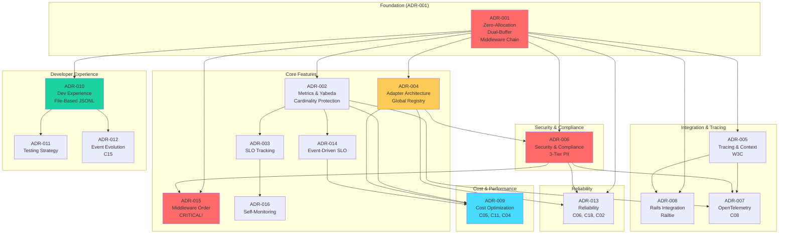

# E11y Dependency Map & Contradiction Analysis

**Created:** 2026-01-15  
**Source:** Cross-references from 38 summaries  
**Purpose:** Visualize dependencies and prioritize contradictions for resolution

---

## 📊 System Dependency Map



---

## 🔴 Critical Paths (Must Get Right!)

### Path 1: Event Tracking → PII Filtering → Adapters
```
UC-002 (Event Tracking)
  ↓
ADR-001 (Middleware Pipeline)
  ↓
ADR-015 (Middleware Order) ← CRITICAL!
  ├─→ Standard: PIIFiltering (#3) → Adapters
  └─→ Audit: AuditSigning (NO PIIFiltering) → Encrypted Storage
  ↓
ADR-006 (PII Filtering)
  ↓
ADR-004 (Adapter Architecture)
```

**Why Critical:** Wrong middleware order = PII leaks or wrong schema validation.

**Resolution:** ADR-015 defines definitive order + two pipelines (C01).

---

### Path 2: Sampling → Cardinality → Cost Optimization
```
UC-014 (Adaptive Sampling)
  ↓
ADR-009 (Cost Optimization)
  ├─→ C05: Trace-Aware Sampling
  ├─→ C11: Stratified Sampling for SLO
  └─→ C04: Universal Cardinality Protection
  ↓
UC-013 (High Cardinality Protection)
  ↓
ADR-002 (Metrics & Yabeda)
```

**Why Critical:** Incorrect sampling breaks distributed traces (C05) and SLO metrics (C11).

**Resolution:** ADR-009 Sections 3.6 (C05) and 3.7 (C11).

---

### Path 3: Trace Context → Background Jobs → Multi-Service
```
UC-006 (Trace Context)
  ↓
ADR-005 (Tracing & Context)
  ├─→ W3C Trace Context
  ├─→ ActiveSupport::CurrentAttributes
  └─→ C17: Hybrid Background Job Tracing
  ↓
UC-010 (Background Jobs)
  ↓
UC-009 (Multi-Service Tracing)
```

**Why Critical:** Lost trace context = can't correlate events across services/jobs.

**Resolution:** ADR-005 Section 8.3 (C17 hybrid model).

---

## ⚠️ Circular Dependencies (None Found!)

**Analysis:** No circular dependencies detected in ADR graph.

✅ **Clean dependency hierarchy** (Foundation → Features → Integrations)

---

## 🎯 Prioritized Contradictions List (Top 15)

**Total identified:** 42 contradictions (17 UCs + 25 ADRs)  
**Prioritized by impact:** Critical > High > Medium > Low

---

### 🔴 CRITICAL Impact (5 contradictions)

#### 1. **ADR-001 vs. ADR-006 Pipeline Order** ✅ **RESOLVED**
- **Conflict:** Global PII middleware (ADR-001 #3) vs. per-adapter filtering (ADR-006)
- **Resolution:** ADR-015 clarified two pipelines (standard with PIIFiltering, audit without)
- **Status:** RESOLVED by ADR-015 Section 3.3 (C01)
- **Action:** ✅ No action needed (documented)

#### 2. **Middleware Order Discipline (No Automatic Validation)**
- **Source:** ADR-001, ADR-015
- **Conflict:** VersioningMiddleware MUST be LAST BUT no compile-time or runtime validation (production)
- **Impact:** Incorrect order = wrong schema/PII rules/rate limits
- **Resolution:** ADR-015 Section 3.4 (C19 zone validation - dev/staging only)
- **Action:** ⚠️ Consider boot-time validation for production (fail-fast)

#### 3. **UC-007: Audit Trail Needs Full PII vs. Observability Filtering**
- **Source:** UC-007, ADR-006, ADR-015
- **Conflict:** Audit trail needs original PII (non-repudiation) BUT observability needs filtering (GDPR)
- **Impact:** Per-adapter solution adds complexity (4 filter passes for 4 adapters)
- **Resolution:** ADR-015 C01 (two pipelines + encrypted storage)
- **Action:** ✅ Documented (accept complexity for compliance)

#### 4. **UC-001: PII Filtering Order Enforcement**
- **Source:** UC-001
- **Conflict:** PII filtering MUST happen BEFORE buffer routing BUT no automatic validation
- **Impact:** Wrong order = PII leaks to adapters
- **Resolution:** ADR-015 C19 (middleware zones - dev/staging validation)
- **Action:** ⚠️ Consider production runtime checks (fail-safe)

#### 5. **UC-013: Adapter-Specific Filtering Inconsistency**
- **Source:** UC-013
- **Conflict:** Prometheus drops user_id (cardinality protection) BUT Loki keeps it (logs need user context)
- **Impact:** Inconsistent data across backends (metrics missing user_id, logs have it)
- **Resolution:** C04 universal protection with per-backend overrides (Prometheus: 100 limit, Loki: relabeling)
- **Action:** ✅ Documented (accept inconsistency for backend-specific needs)

---

### 🟠 HIGH Impact (5 contradictions)

#### 6. **ADR-004: Global Registry DRY vs. Per-Event Config Flexibility**
- **Source:** ADR-004, UC-002
- **Conflict:** All events using `:loki` share same config (can't have different batch_size per event)
- **Impact:** Less flexibility for event-specific adapter tuning
- **Workaround:** Register multiple instances (`:loki_fast`, `:loki_slow`) - defeats DRY
- **Action:** ✅ Accept trade-off (DRY > flexibility for 90% cases)

#### 7. **UC-015 vs. ADR-009: Deduplication 80% vs. 5-10% Claim**
- **Source:** UC-015 line 31, ADR-009 §9.2.D
- **Conflict:** UC-015 claims "80% duplicates", ADR-009 says "only 5-10% actual duplicates"
- **Impact:** Inconsistent claims may confuse users about deduplication need
- **Hypothesis:** 80% is pre-E11y state (assumes retry storms fixed separately)
- **Action:** ⚠️ Clarify assumption in documentation or fix inconsistent claim

#### 8. **ADR-006: Audit Trail Immutability vs. GDPR Right to Be Forgotten**
- **Source:** ADR-006, UC-012
- **Conflict:** HMAC signature chain is immutable (cannot delete events) BUT GDPR requires data erasure
- **Impact:** Compliance paradox (audit vs. privacy)
- **Potential Solutions:** Pseudonymization, retention limits, legal obligation exception (GDPR Art. 6(1)(c))
- **Action:** ⚠️ Document recommended solution (which one?)

#### 9. **UC-014: Trace-Consistent Sampling Requires Buffering**
- **Source:** UC-014
- **Conflict:** Trace-consistent sampling (C05) requires buffering entire trace (5-50KB memory per request)
- **Impact:** Memory overhead for distributed traces
- **Resolution:** ADR-009 C05 (decision cache with TTL)
- **Action:** ✅ Documented (accept memory overhead for trace integrity)

#### 10. **UC-013: Mutex Overhead vs. Correctness**
- **Source:** UC-013
- **Conflict:** CardinalityTracker uses Mutex (thread-safe) BUT adds contention overhead at high concurrency
- **Impact:** Performance degradation under load (mutex contention)
- **Trade-off:** Correctness > performance (data races worse than contention)
- **Action:** ✅ Accept trade-off (cardinality tracking is critical)

---

### 🟡 MEDIUM Impact (5 contradictions)

#### 11. **ADR-001: Zero-Allocation Adds Code Complexity**
- **Source:** ADR-001
- **Conflict:** Zero-allocation improves performance BUT makes code harder to read/maintain (no OOP)
- **Impact:** Code maintainability vs. performance
- **Trade-off:** Performance > maintainability (<1ms p99 target non-negotiable)
- **Action:** ✅ Accept trade-off (document patterns clearly)

#### 12. **ADR-004: Batching Adds Latency (5s timeout)**
- **Source:** ADR-004
- **Conflict:** Batching reduces HTTP requests BUT adds up to 5s latency
- **Impact:** Events wait in buffer (unacceptable for real-time alerts)
- **Mitigation:** Not described (should critical events bypass batching?)
- **Action:** ⚠️ Clarify batching bypass for critical events (security alerts)

#### 13. **ADR-004: Connection Pooling Memory Overhead (50MB)**
- **Source:** ADR-004
- **Conflict:** Connection pooling (pool size 5 × 5 adapters = 25 connections × 2MB) = 50MB out of 100MB budget
- **Impact:** 50% of memory budget for connection pooling alone
- **Trade-off:** Connection reuse (100% target) > memory
- **Action:** ✅ Accept trade-off (connection reuse is critical for performance)

#### 14. **ADR-015: Two Pipelines Adds Maintenance Complexity**
- **Source:** ADR-015
- **Conflict:** Standard + audit pipelines must be kept in sync (new middleware added to both)
- **Impact:** Maintenance overhead, risk of drift over time
- **Mitigation:** Documentation ("Do not change order without updating all ADRs!")
- **Action:** ⚠️ Consider automated validation (ensure pipelines don't drift)

#### 15. **UC-015: Tiered Storage vs. Retention Tagging Integration**
- **Source:** UC-015
- **Conflict:** Fixed durations (7 days hot, 30 days warm) vs. per-event retention (audit: 7 years, debug: 7 days)
- **Impact:** Unclear how they interact (does audit stay in Glacier for 6.9 years after cold tier?)
- **Action:** ⚠️ Clarify integration (tiered storage WHERE vs. retention tagging HOW LONG)

---

## 🔗 Cross-References by Conflict Resolution

### C01 - Audit Pipeline Separation
- **ADRs:** ADR-015 Section 3.3, ADR-006 Section 5
- **UCs:** UC-012 (Audit Trail)
- **Resolution:** Two pipelines (standard with PIIFiltering, audit without but with AuditSigning + encrypted storage)

### C04 - Universal Cardinality Protection
- **ADRs:** ADR-009 Section 8, ADR-002 Section 4
- **UCs:** UC-013 (High Cardinality Protection)
- **Resolution:** Cardinality protection for Yabeda + OpenTelemetry + Loki (not just Prometheus)

### C05 - Trace-Aware Adaptive Sampling
- **ADRs:** ADR-009 Section 3.6
- **UCs:** UC-014 (Adaptive Sampling), UC-006, UC-009, UC-010
- **Resolution:** Trace-level sampling decisions with decision cache, W3C propagation

### C06 - Retry Rate Limiting
- **ADRs:** ADR-013 Section 3.5
- **UCs:** UC-021 (Error Handling)
- **Resolution:** Separate retry rate limiter with staged batching (prevent thundering herd)

### C08 - Baggage PII Protection
- **ADRs:** ADR-007, ADR-006
- **UCs:** UC-008 (OpenTelemetry)
- **Resolution:** OTel baggage allowlist (prevent PII leaks via baggage)

### C11 - Stratified Sampling for SLO Accuracy
- **ADRs:** ADR-009 Section 3.7, ADR-014
- **UCs:** UC-014 (Adaptive Sampling)
- **Resolution:** Stratified sampling by severity (error: 100%, success: 10%) with sampling correction

### C15 - Schema Migrations & DLQ Replay
- **ADRs:** ADR-012 Section 8
- **UCs:** UC-020 (Event Versioning)
- **Resolution:** DLQ replay with migration rules (V1 → V2)

### C17 - Background Job Hybrid Tracing
- **ADRs:** ADR-005 Section 8.3
- **UCs:** UC-010 (Background Jobs)
- **Resolution:** New trace_id per job + parent_trace_id link (bounded traces)

### C18 - Non-Failing Event Tracking in Jobs
- **ADRs:** ADR-013 Section 3.6
- **UCs:** UC-021 (Error Handling)
- **Resolution:** Rescue E11y errors, job continues, metrics track failures

### C19 - Middleware Zones
- **ADRs:** ADR-015 Section 3.4
- **UCs:** UC-007 (PII Filtering)
- **Resolution:** 5 middleware zones with modification constraints (prevent PII bypass)

### C20 - Adaptive Buffer with Memory Limits
- **ADRs:** ADR-001 Section 3.3
- **UCs:** UC-001 (Request-Scoped Buffering)
- **Resolution:** Memory-tracked buffering with backpressure (hard 100MB limit)

### C02 - Rate Limiting × DLQ Filter
- **ADRs:** ADR-013 Section 4.6
- **UCs:** UC-021 (Error Handling)
- **Resolution:** Critical events bypass rate limiting → DLQ (not dropped)

### C03 - Yabeda Default Backend
- **ADRs:** ADR-002
- **UCs:** UC-003 (Pattern-Based Metrics)
- **Resolution:** Yabeda default, OTel metrics optional (avoid double overhead)

---

## 📈 Dependency Statistics

- **ADR-001 dependents:** 13 ADRs (foundation for everything)
- **Most dependent:** ADR-009 (depends on ADR-001, ADR-002, ADR-004, ADR-014)
- **Most critical:** ADR-015 (wrong order = PII leaks)
- **Longest chain:** ADR-001 → ADR-002 → ADR-009 → ADR-014 (4 levels)

---

## 🚨 High-Risk Dependencies (Must Test Carefully!)

### 1. ADR-015 (Middleware Order) ← Affects EVERYTHING
- **Dependents:** ADR-001, ADR-006, UC-001, UC-007, UC-013, UC-014
- **Risk:** Wrong order breaks PII filtering, schema validation, rate limiting
- **Mitigation:** C19 zone validation (dev/staging), boot-time checks

### 2. ADR-006 (Security) ← Legal Compliance
- **Dependents:** ADR-015 (C01), ADR-007 (C08), UC-007, UC-011, UC-012
- **Risk:** PII leaks = GDPR violations = legal liability
- **Mitigation:** Explicit declaration + linter (boot-time validation)

### 3. ADR-004 (Adapter Architecture) ← Single Point of Failure
- **Dependents:** ADR-006, ADR-009, ADR-013, all UC-005-010
- **Risk:** Adapter abstraction bugs affect all integrations
- **Mitigation:** Contract tests (100% coverage for base class)

---

**Total:** 38 documents analyzed (22 UCs + 16 ADRs)  
**Next:** Use this map for TRIZ contradiction analysis (Phase 5)  
**Last Updated:** 2026-01-15
