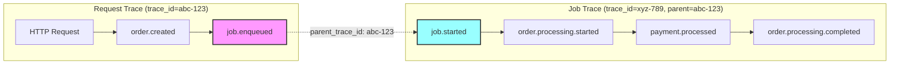

# UC-009: Multi-Service Tracing

**Status:** v1.1+ Enhancement  
**Complexity:** Advanced  
**Setup Time:** 30-40 minutes  
**Target Users:** Platform Engineers, SRE, Microservices Teams

---

## 📋 Overview

### Problem Statement

**The microservices debugging nightmare:**
```ruby
# ❌ BEFORE: Lost context across services
# Service A (API):
Rails.logger.info "Order created: #{order_id}"

# Service B (Payment):
Rails.logger.info "Processing payment"  # ← Which order?!

# Service C (Fulfillment):
Rails.logger.info "Shipping order"  # ← Which payment?!

# Problems:
# 1. No correlation between services
# 2. Can't see complete request flow
# 3. Manual trace_id passing (error-prone)
# 4. Different logging formats per service
# 5. Can't measure cross-service latency
# 6. Debugging takes hours (grep through multiple logs)
```

### E11y Solution

**Automatic distributed tracing:**
```ruby
# ✅ AFTER: Automatic trace propagation across services

# Service A (API) - trace_id: abc-123
Events::OrderCreated.track(order_id: '789')
# → HTTP call to Service B with W3C Trace Context header

# Service B (Payment) - trace_id: abc-123 (preserved!)
Events::PaymentProcessing.track(order_id: '789', amount: 99.99)
# → HTTP call to Service C with W3C Trace Context header

# Service C (Fulfillment) - trace_id: abc-123 (preserved!)
Events::OrderShipping.track(order_id: '789', tracking: 'TRACK123')

# Grafana query: {trace_id="abc-123"}
# 10:00:00.000 [service-a] order.created
# 10:00:00.050 [service-b] payment.processing
# 10:00:02.120 [service-c] order.shipping
# → Complete distributed trace!
```

---

## 🎯 Features

> **Implementation:** See [ADR-005: Tracing Context](../ADR-005-tracing-context.md) for complete architecture, including [Section 5: W3C Trace Context](../ADR-005-tracing-context.md#5-w3c-trace-context), [Section 6.1: HTTP Propagator](../ADR-005-tracing-context.md#61-http-propagator-outgoing-requests), and [Section 8: Context Inheritance](../ADR-005-tracing-context.md#8-context-inheritance-thread-fiber-support).

### 1. Automatic W3C Trace Context Propagation

**Zero-config HTTP header propagation:**
```ruby
# Service A: API Gateway
class OrdersController < ApplicationController
  def create
    order = Order.create!(order_params)
    
    # Track event (trace_id automatically set from request)
    Events::OrderCreated.track(
      order_id: order.id,
      user_id: current_user.id
    )
    
    # Call Payment Service (trace_id automatically propagated!)
    response = PaymentServiceClient.charge(
      order_id: order.id,
      amount: order.total
    )
    
    render json: order
  end
end

# HTTP Request to Payment Service includes:
# traceparent: 00-abc123...-def456...-01
#              ^   ^         ^         ^
#              |   |         |         +-- flags (sampled)
#              |   |         +------------ span_id
#              |   +---------------------- trace_id
#              +-------------------------- version
```

**Faraday middleware (automatic!):**
```ruby
# config/initializers/e11y.rb
E11y.configure do |config|
  config.trace_propagation do
    # Faraday middleware (auto-inject trace headers)
    faraday enabled: true
    
    # Net::HTTP middleware
    net_http enabled: true
    
    # HTTParty
    httparty enabled: true
  end
end

# Now ALL HTTP clients automatically propagate trace context!
conn = Faraday.new(url: 'http://payment-service')
conn.post('/charges', { amount: 99.99 })
# → Automatically includes traceparent header ✨
```

---

### 2. Service-to-Service Event Correlation

**Explicit service boundaries:**
```ruby
# Service A: API Gateway
module Events
  class OrderCreated < E11y::Event::Base
    service_boundary :outgoing  # This service initiates call
    
    schema do
      required(:order_id).filled(:string)
      required(:user_id).filled(:string)
      required(:amount).filled(:decimal)
    end
  end
end

# Track + call downstream service
Events::OrderCreated.track(order_id: '789', user_id: '123', amount: 99.99)

# HTTP call to Service B
PaymentServiceClient.charge(order_id: '789', amount: 99.99)

# ---

# Service B: Payment Service
module Events
  class PaymentReceived < E11y::Event::Base
    service_boundary :incoming  # This service receives call
    
    schema do
      required(:order_id).filled(:string)
      required(:amount).filled(:decimal)
    end
  end
  
  class PaymentProcessed < E11y::Event::Base
    service_boundary :outgoing  # This service initiates next call
    
    schema do
      required(:order_id).filled(:string)
      required(:transaction_id).filled(:string)
    end
  end
end

class ChargesController < ApplicationController
  def create
    # Track incoming request (trace_id from header!)
    Events::PaymentReceived.track(
      order_id: params[:order_id],
      amount: params[:amount]
    )
    
    # Process payment
    transaction = charge_card(params[:amount])
    
    # Track outgoing event
    Events::PaymentProcessed.track(
      order_id: params[:order_id],
      transaction_id: transaction.id
    )
    
    # Call Fulfillment Service
    FulfillmentServiceClient.ship_order(
      order_id: params[:order_id],
      transaction_id: transaction.id
    )
    
    render json: { transaction_id: transaction.id }
  end
end

# Timeline in Grafana: {trace_id="abc-123"}
# 10:00:00.000 [api-gateway] order.created
# 10:00:00.050 [payment] payment.received
# 10:00:02.000 [payment] payment.processed
# 10:00:02.050 [fulfillment] order.received
# 10:00:05.000 [fulfillment] order.shipped
# → Complete multi-service trace!
```

---

### 3. Background Job Trace Propagation (C17 Resolution) ⚠️

> **Implementation:** See [ADR-005 Section 8.3: Background Job Tracing Strategy](../ADR-005-tracing-context.md#83-background-job-tracing-strategy-c17-resolution) for the hybrid tracing model.

**Hybrid Tracing Model (New Trace + Parent Link):**
```ruby
# Service A: API Gateway
class OrdersController < ApplicationController
  def create
    order = Order.create!(order_params)
    
    # Track event (trace_id: abc-123)
    Events::OrderCreated.track(order_id: order.id)
    # Current trace: abc-123
    
    # Enqueue job (parent trace context automatically passed!)
    ProcessOrderJob.perform_later(order.id)
    # → Sidekiq metadata: { parent_trace_id: 'abc-123' }
    
    render json: order
  end
end

# Service B: Worker Service (Sidekiq)
class ProcessOrderJob < ApplicationJob
  def perform(order_id)
    # ✅ NEW TRACE STARTED: trace_id: xyz-789 (fresh trace for job!)
    # ✅ PARENT LINKED: parent_trace_id: abc-123 (link to request trace)
    
    Events::OrderProcessingStarted.track(
      order_id: order_id
      # Metadata auto-added:
      # - trace_id: xyz-789 (job's own trace)
      # - parent_trace_id: abc-123 (link to parent request)
    )
    
    # Call Payment Service (NEW trace_id propagated!)
    PaymentServiceClient.charge(order_id: order_id)
    # → HTTP header: traceparent: xyz-789 (job's trace!)
    
    Events::OrderProcessingCompleted.track(order_id: order_id)
  end
end

# Service C: Payment Service
class ChargesController < ApplicationController
  def create
    # trace_id: xyz-789 (from job's HTTP header)
    # parent_trace_id: abc-123 (preserved from job)
    Events::PaymentProcessed.track(...)
  end
end

# Timeline 1: Request Trace {trace_id="abc-123"}
# 10:00:00.000 [api-gateway] order.created (trace_id=abc-123)
# 10:00:00.010 [api-gateway] job.enqueued (trace_id=abc-123)

# Timeline 2: Job Trace {trace_id="xyz-789", parent_trace_id="abc-123"}
# 10:00:05.000 [worker] job.started (trace_id=xyz-789, parent=abc-123)
# 10:00:05.010 [worker] order.processing.started (trace_id=xyz-789)
# 10:00:05.050 [payment] payment.processed (trace_id=xyz-789)
# 10:00:07.000 [worker] order.processing.completed (trace_id=xyz-789)

# Query to see full flow (request + job):
# Loki: {trace_id="abc-123"} OR {parent_trace_id="abc-123"}
# → Shows BOTH request trace AND linked job trace!
```

**Why Hybrid Model (not same trace_id)?**

1. **Bounded trace duration:** Job may run for hours/days (not same as 100ms request)
2. **SLO accuracy:** Request SLO (P99 200ms) ≠ Job SLO (P99 5 minutes)
3. **Trace clarity:** Separate timelines for sync (request) vs async (job) operations
4. **Link preserved:** `parent_trace_id` allows reconstructing full flow

See [ADR-005 §8.3](../ADR-005-tracing-context.md#83-background-job-tracing-strategy-c17-resolution) for detailed rationale.

**Visual Diagram: Request Trace → Job Trace (with parent link)**



**Query Examples:**

```ruby
# 1. Find all events in request trace
Loki query: {trace_id="abc-123"}
# Result:
# - order.created
# - job.enqueued

# 2. Find all events in job trace
Loki query: {trace_id="xyz-789"}
# Result:
# - job.started
# - order.processing.started
# - payment.processed
# - order.processing.completed

# 3. Find FULL FLOW (request + linked jobs)
Loki query: {trace_id="abc-123"} OR {parent_trace_id="abc-123"}
# Result: ALL events from request AND its child jobs!
# - order.created (trace=abc-123)
# - job.enqueued (trace=abc-123)
# - job.started (trace=xyz-789, parent=abc-123)
# - order.processing.started (trace=xyz-789, parent=abc-123)
# - payment.processed (trace=xyz-789, parent=abc-123)
# - order.processing.completed (trace=xyz-789, parent=abc-123)
```

**Database Schema (parent_trace_id field):**

```sql
-- events table
CREATE TABLE events (
  id BIGSERIAL PRIMARY KEY,
  event_name VARCHAR(255),
  trace_id VARCHAR(36),
  parent_trace_id VARCHAR(36),  -- ✅ NEW: Link to parent trace!
  -- ... other fields
);

-- Index for efficient queries
CREATE INDEX idx_events_parent_trace_id ON events(parent_trace_id);

-- Query to reconstruct full flow:
SELECT * FROM events
WHERE trace_id = 'abc-123'
   OR parent_trace_id = 'abc-123'
ORDER BY timestamp ASC;
```

---

### 4. Cross-Service Latency Measurement

**Automatic service-to-service timing:**
```ruby
# config/initializers/e11y.rb
E11y.configure do |config|
  config.distributed_tracing do
    # Measure cross-service latency
    measure_service_latency true
    
    # Track service hops
    track_service_hops true
  end
end

# Service A: API Gateway
Events::OrderCreated.track(
  order_id: '789',
  timestamp_sent: Time.current  # Auto-added!
)

# Service B: Payment Service
Events::PaymentReceived.track(
  order_id: '789',
  timestamp_received: Time.current  # Auto-added!
)

# E11y automatically calculates:
# - Network latency: timestamp_received - timestamp_sent
# - Service hop count: 1 (API → Payment)
# - Total trace duration: last event - first event

# Metrics (automatic!):
# e11y_service_to_service_latency_ms{from="api",to="payment"} = 50
# e11y_service_hops{trace_id="abc-123"} = 3
# e11y_trace_duration_ms{trace_id="abc-123"} = 5020
```

---

### 5. Service Mesh Integration

> **Implementation:** See [ADR-005 Section 5.3: HTTP Header Extraction](../ADR-005-tracing-context.md#53-http-header-extraction-w3c-legacy-headers) for W3C standard header support enabling service mesh compatibility.

**Automatic integration with Istio/Linkerd:**
```ruby
# config/initializers/e11y.rb
E11y.configure do |config|
  config.service_mesh do
    # Detect service mesh
    auto_detect true  # Detects Istio/Linkerd
    
    # Use mesh headers
    use_mesh_headers true
    
    # Mesh-specific headers
    istio do
      use_headers [
        'x-request-id',
        'x-b3-traceid',
        'x-b3-spanid',
        'x-b3-parentspanid',
        'x-b3-sampled',
        'x-b3-flags'
      ]
    end
    
    linkerd do
      use_headers [
        'l5d-ctx-trace',
        'l5d-ctx-deadline'
      ]
    end
  end
end

# E11y automatically:
# 1. Reads trace context from mesh headers
# 2. Propagates context to downstream services
# 3. Respects mesh sampling decisions
# 4. Correlates E11y events with mesh spans
```

---

## 💻 Implementation Examples

### Example 1: E-commerce Order Flow (3 Services)

```ruby
# === SERVICE A: API GATEWAY ===
# app/controllers/orders_controller.rb
class OrdersController < ApplicationController
  def create
    # Start distributed trace
    Events::OrderCreationStarted.track(
      user_id: current_user.id,
      cart_total: cart.total
    )
    
    # Create order
    order = Order.create!(
      user_id: current_user.id,
      items: cart.items,
      total: cart.total
    )
    
    # Track order created
    Events::OrderCreated.track(
      order_id: order.id,
      user_id: current_user.id,
      amount: order.total,
      items_count: order.items.count
    )
    
    # Call Payment Service (trace_id auto-propagated!)
    begin
      payment = PaymentServiceClient.charge(
        order_id: order.id,
        amount: order.total,
        payment_method: params[:payment_method]
      )
      
      Events::PaymentInitiated.track(
        order_id: order.id,
        payment_id: payment.id,
        amount: order.total
      )
      
      render json: { order: order, payment: payment }
    rescue PaymentServiceClient::Error => e
      Events::PaymentFailed.track(
        order_id: order.id,
        error: e.message,
        severity: :error
      )
      
      render json: { error: e.message }, status: :unprocessable_entity
    end
  end
end

# === SERVICE B: PAYMENT SERVICE ===
# app/controllers/charges_controller.rb
class ChargesController < ApplicationController
  def create
    # Trace context automatically extracted from headers!
    Events::PaymentRequestReceived.track(
      order_id: params[:order_id],
      amount: params[:amount],
      payment_method: params[:payment_method]
    )
    
    # Process payment
    transaction = StripeGateway.charge(
      amount: params[:amount],
      source: params[:payment_method]
    )
    
    Events::PaymentSucceeded.track(
      order_id: params[:order_id],
      transaction_id: transaction.id,
      amount: transaction.amount,
      severity: :success
    )
    
    # Call Fulfillment Service (trace_id auto-propagated!)
    FulfillmentServiceClient.create_shipment(
      order_id: params[:order_id],
      transaction_id: transaction.id
    )
    
    render json: { transaction: transaction }
  rescue StripeGateway::Error => e
    Events::PaymentFailed.track(
      order_id: params[:order_id],
      error: e.message,
      error_code: e.code,
      severity: :error
    )
    
    render json: { error: e.message }, status: :unprocessable_entity
  end
end

# === SERVICE C: FULFILLMENT SERVICE ===
# app/controllers/shipments_controller.rb
class ShipmentsController < ApplicationController
  def create
    Events::ShipmentRequestReceived.track(
      order_id: params[:order_id],
      transaction_id: params[:transaction_id]
    )
    
    # Create shipment
    shipment = Shipment.create!(
      order_id: params[:order_id],
      carrier: 'USPS',
      tracking_number: generate_tracking_number
    )
    
    Events::ShipmentCreated.track(
      order_id: params[:order_id],
      shipment_id: shipment.id,
      tracking_number: shipment.tracking_number,
      estimated_delivery: shipment.estimated_delivery,
      severity: :success
    )
    
    render json: { shipment: shipment }
  end
end

# === GRAFANA QUERY ===
# {trace_id="abc-123"} | json | line_format "{{.timestamp}} [{{.service}}] {{.event_name}}"
#
# Result:
# 10:00:00.000 [api-gateway] order.creation.started
# 10:00:00.050 [api-gateway] order.created
# 10:00:00.060 [api-gateway] payment.initiated
# 10:00:00.100 [payment] payment.request.received
# 10:00:02.150 [payment] payment.succeeded
# 10:00:02.200 [fulfillment] shipment.request.received
# 10:00:03.500 [fulfillment] shipment.created
# → Complete 7-step distributed trace!
```

---

### Example 2: GraphQL Federation (4 Services)

```ruby
# === SERVICE A: GATEWAY (GraphQL) ===
class Mutations::CreateOrder < Mutations::BaseMutation
  def resolve(input:)
    Events::GraphqlMutationStarted.track(
      mutation: 'createOrder',
      user_id: context[:current_user].id
    )
    
    # Query User Service (trace_id propagated)
    user = UserServiceClient.get_user(context[:current_user].id)
    
    # Query Product Service (trace_id propagated)
    products = ProductServiceClient.get_products(input[:product_ids])
    
    # Query Order Service (trace_id propagated)
    order = OrderServiceClient.create_order(
      user_id: user.id,
      products: products
    )
    
    Events::GraphqlMutationCompleted.track(
      mutation: 'createOrder',
      order_id: order.id,
      duration_ms: duration
    )
    
    { order: order }
  end
end

# === SERVICE B: USER SERVICE ===
class UsersController < ApplicationController
  def show
    Events::UserFetchRequested.track(user_id: params[:id])
    
    user = User.find(params[:id])
    
    Events::UserFetched.track(
      user_id: user.id,
      user_segment: user.segment
    )
    
    render json: user
  end
end

# === SERVICE C: PRODUCT SERVICE ===
class ProductsController < ApplicationController
  def index
    Events::ProductsFetchRequested.track(
      product_ids: params[:ids]
    )
    
    products = Product.where(id: params[:ids])
    
    Events::ProductsFetched.track(
      product_ids: products.map(&:id),
      count: products.count
    )
    
    render json: products
  end
end

# === SERVICE D: ORDER SERVICE ===
class OrdersController < ApplicationController
  def create
    Events::OrderCreationRequested.track(
      user_id: params[:user_id],
      product_ids: params[:product_ids]
    )
    
    order = Order.create!(
      user_id: params[:user_id],
      order_items: params[:products].map { |p|
        OrderItem.new(product_id: p[:id], quantity: p[:quantity])
      }
    )
    
    Events::OrderCreated.track(
      order_id: order.id,
      user_id: order.user_id,
      total: order.total
    )
    
    render json: order
  end
end

# === JAEGER TRACE VIEW ===
# Span: graphql.mutation.createOrder (2.5s)
#   ├─ Span: user.fetch (50ms) [user-service]
#   ├─ Span: products.fetch (120ms) [product-service]
#   └─ Span: order.create (2.3s) [order-service]
#       └─ Span: db.insert (200ms)
# → Complete GraphQL federation trace!
```

---

### Example 3: Event-Driven Architecture (Kafka)

```ruby
# === SERVICE A: ORDER SERVICE ===
class OrdersController < ApplicationController
  def create
    order = Order.create!(order_params)
    
    # Track event
    Events::OrderCreated.track(
      order_id: order.id,
      user_id: current_user.id,
      amount: order.total
    )
    
    # Publish to Kafka (trace_id in message metadata!)
    KafkaProducer.publish(
      topic: 'orders.created',
      key: order.id,
      value: order.to_json,
      headers: {
        'traceparent' => E11y::TraceContext.current.to_traceparent
        # ↑ W3C Trace Context header in Kafka message!
      }
    )
    
    render json: order
  end
end

# === SERVICE B: NOTIFICATION SERVICE (Kafka Consumer) ===
class OrderCreatedConsumer
  def consume(message)
    # Extract trace context from Kafka headers
    trace_context = E11y::TraceContext.from_traceparent(
      message.headers['traceparent']
    )
    
    # Set trace context (restores trace_id!)
    E11y::TraceContext.with_context(trace_context) do
      order_data = JSON.parse(message.value)
      
      Events::NotificationRequested.track(
        order_id: order_data['id'],
        notification_type: 'order_confirmation'
      )
      
      # Send email
      OrderMailer.confirmation(order_data['id']).deliver_now
      
      Events::NotificationSent.track(
        order_id: order_data['id'],
        notification_type: 'email',
        severity: :success
      )
    end
  end
end

# === SERVICE C: ANALYTICS SERVICE (Kafka Consumer) ===
class OrderCreatedConsumer
  def consume(message)
    trace_context = E11y::TraceContext.from_traceparent(
      message.headers['traceparent']
    )
    
    E11y::TraceContext.with_context(trace_context) do
      order_data = JSON.parse(message.value)
      
      Events::AnalyticsEventProcessed.track(
        order_id: order_data['id'],
        event_type: 'order_created',
        user_segment: calculate_segment(order_data['user_id'])
      )
    end
  end
end

# === TIMELINE: {trace_id="abc-123"} ===
# 10:00:00.000 [order-service] order.created
# 10:00:00.010 [kafka] message.published (topic: orders.created)
# 10:00:00.500 [notification-service] notification.requested
# 10:00:01.200 [notification-service] notification.sent
# 10:00:00.550 [analytics-service] analytics.event.processed
# → Complete event-driven trace!
```

---

## 🔧 Configuration

### Full Configuration

```ruby
# config/initializers/e11y.rb
E11y.configure do |config|
  config.distributed_tracing do
    # === TRACE PROPAGATION ===
    propagation do
      # W3C Trace Context (standard)
      w3c_trace_context enabled: true
      
      # B3 (Zipkin)
      b3 enabled: true, single_header: true
      
      # Jaeger
      jaeger enabled: false
      
      # Datadog
      datadog enabled: false
    end
    
    # === HTTP CLIENTS ===
    http_clients do
      # Faraday
      faraday do
        enabled true
        inject_headers true
        extract_headers true
      end
      
      # Net::HTTP
      net_http do
        enabled true
        inject_headers true
      end
      
      # HTTParty
      httparty do
        enabled true
        inject_headers true
      end
      
      # RestClient
      rest_client do
        enabled true
        inject_headers true
      end
    end
    
    # === BACKGROUND JOBS ===
    background_jobs do
      # Sidekiq
      sidekiq do
        enabled true
        propagate_trace_context true
        store_in_job_metadata true
      end
      
      # ActiveJob
      active_job do
        enabled true
        propagate_trace_context true
      end
    end
    
    # === MESSAGE QUEUES ===
    message_queues do
      # Kafka
      kafka do
        enabled true
        inject_headers true
        extract_headers true
        header_name 'traceparent'
      end
      
      # RabbitMQ
      rabbitmq do
        enabled true
        inject_headers true
        extract_headers true
      end
      
      # AWS SQS
      sqs do
        enabled true
        use_message_attributes true
      end
    end
    
    # === SERVICE MESH ===
    service_mesh do
      auto_detect true
      
      # Istio
      istio do
        enabled true
        use_headers true
      end
      
      # Linkerd
      linkerd do
        enabled true
        use_headers true
      end
    end
    
    # === METRICS ===
    metrics do
      # Service-to-service latency
      measure_service_latency true
      
      # Service hops
      track_service_hops true
      
      # Trace duration
      measure_trace_duration true
    end
  end
end
```

---

## 📊 Monitoring Distributed Traces

### Grafana Queries

```ruby
# 1. Find all events for a trace
{trace_id="abc-123"} | json

# 2. Service-to-service flow
{trace_id="abc-123"} 
| json 
| line_format "{{.timestamp}} [{{.service}}] {{.event_name}}"

# 3. Cross-service latency
sum by(from_service, to_service) (
  e11y_service_to_service_latency_ms
)

# 4. Service hop distribution
histogram_quantile(0.95, 
  sum(rate(e11y_service_hops_bucket[5m])) by (le)
)

# 5. Failed distributed traces
{trace_id=~".+"} 
| json 
| severity="error" 
| line_format "{{.trace_id}} {{.service}} {{.event_name}}"
```

---

## 💡 Best Practices

### ✅ DO

**1. Use W3C Trace Context (standard)**
```ruby
# ✅ GOOD: Industry standard
config.distributed_tracing do
  propagation do
    w3c_trace_context enabled: true
  end
end
```

**2. Mark service boundaries**
```ruby
# ✅ GOOD: Clear boundaries
module Events
  class OrderCreated < E11y::Event::Base
    service_boundary :outgoing  # This service → next service
  end
  
  class PaymentReceived < E11y::Event::Base
    service_boundary :incoming  # From previous service
  end
end
```

**3. Propagate context in async jobs**
```ruby
# ✅ GOOD: Preserve trace_id in jobs
config.background_jobs do
  sidekiq do
    propagate_trace_context true
  end
end
```

---

### ❌ DON'T

**1. Don't use different context formats**
```ruby
# ❌ BAD: Mixed formats (incompatible!)
# Service A: W3C Trace Context
# Service B: B3 format
# Service C: Custom format
# → Can't correlate!

# ✅ GOOD: Single format everywhere
config.distributed_tracing do
  propagation do
    w3c_trace_context enabled: true  # All services!
  end
end
```

**2. Don't forget message queue propagation**
```ruby
# ❌ BAD: Kafka without trace headers
KafkaProducer.publish(topic: 'orders', value: order.to_json)
# → Trace context lost!

# ✅ GOOD: Include trace headers
KafkaProducer.publish(
  topic: 'orders',
  value: order.to_json,
  headers: {
    'traceparent' => E11y::TraceContext.current.to_traceparent
  }
)
```

---

## 📚 Related Use Cases

- **[UC-006: Trace Context Management](./UC-006-trace-context-management.md)** - W3C Trace Context basics
- **[UC-008: OpenTelemetry Integration](./UC-008-opentelemetry-integration.md)** - OTel setup
- **[UC-010: Background Job Tracking](./UC-010-background-job-tracking.md)** - Async tracing

---

## 🎯 Summary

### Distributed Tracing Benefits

| Without E11y | With E11y |
|--------------|-----------|
| Manual trace_id passing | Automatic propagation |
| Different formats per service | W3C Trace Context (standard) |
| Lost context in async jobs | Preserved automatically |
| No cross-service visibility | Complete trace timeline |
| Hours to debug issues | Minutes to find root cause |

**Setup Time:**
- Per service: 10-15 min (config only!)
- First trace: Immediate (automatic!)

**Debugging Time:**
- Before: 2-4 hours (grep through logs)
- After: 5-10 minutes (Grafana query)

---

**Document Version:** 1.0  
**Last Updated:** January 12, 2026  
**Status:** ✅ Complete
